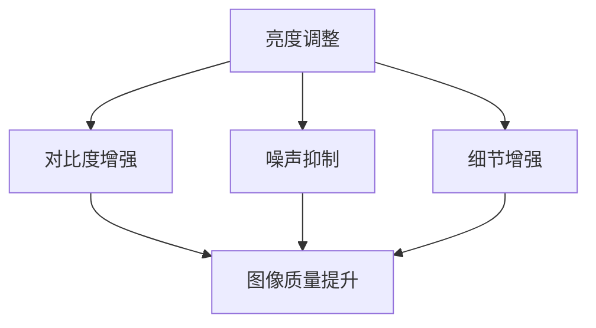

                 

关键词：图像增强、图像处理、OpenCV、算法、图像质量、图像清晰度、噪声抑制

> 摘要：本文深入探讨OpenCV中的图像增强技术，通过介绍其核心概念、算法原理以及具体操作步骤，帮助读者掌握如何利用OpenCV提升图像质量，提高图像的清晰度和可读性。同时，本文还将通过数学模型和实际项目实践，详细讲解图像增强技术在实际应用中的效果和重要性。

## 1. 背景介绍

在计算机视觉和图像处理领域，图像增强是一项至关重要的技术。图像增强的目的是通过调整和优化图像的亮度和对比度，改善图像的质量，使其在特定的应用场景中更具可用性。图像增强技术广泛应用于医疗图像分析、人脸识别、卫星图像处理、机器人视觉等领域。

OpenCV（Open Source Computer Vision Library）是一个广泛使用的开源计算机视觉库，它提供了丰富的图像处理和计算机视觉功能。OpenCV以其高效性和跨平台特性，成为众多开发者的首选工具。本文将重点介绍如何使用OpenCV中的图像增强技术来改善图像质量。

## 2. 核心概念与联系

图像增强的核心概念包括亮度调整、对比度增强、噪声抑制和细节增强等。这些技术共同作用，可以显著提升图像的质量。以下是一个简单的Mermaid流程图，展示图像增强的核心概念及其联系：



### 2.1 亮度调整

亮度调整是通过改变图像中像素的亮度值来增强图像。它可以增加或减少整个图像的亮度，使得图像在暗光环境下更加清晰。

### 2.2 对比度增强

对比度增强是通过调整图像中亮度和暗度之间的差异来增强图像。高对比度图像的亮部和暗部更加分明，有助于提升图像的清晰度和可读性。

### 2.3 噪声抑制

噪声抑制是指去除或减少图像中的噪声。噪声会降低图像的质量，影响图像的处理结果。有效的噪声抑制技术可以提高图像的真实性和准确性。

### 2.4 细节增强

细节增强是通过增强图像中的细节信息来提高图像的质量。细节增强可以使得图像中的物体和特征更加清晰，有助于在复杂的场景中识别和分割图像。

## 3. 核心算法原理 & 具体操作步骤

### 3.1 算法原理概述

图像增强算法主要分为基于滤波的方法和基于变换的方法。基于滤波的方法通过卷积滤波器对图像进行处理，可以有效地去除噪声和增强图像的细节。常见的滤波器包括高斯滤波器、中值滤波器和双边滤波器。基于变换的方法则通过变换图像的频率域来增强图像，例如傅里叶变换和小波变换。

### 3.2 算法步骤详解

#### 3.2.1 亮度调整

亮度调整可以通过简单的线性变换来实现。设原图像为\(I(x,y)\)，调整后的图像为\(J(x,y)\)，则可以通过以下公式进行亮度调整：

$$
J(x,y) = aI(x,y) + b
$$

其中，\(a\)是亮度系数，\(b\)是偏移量。当\(a > 1\)时，图像变亮；当\(a < 1\)时，图像变暗。\(b\)用于调整图像的偏移，使其在适当的范围内。

#### 3.2.2 对比度增强

对比度增强可以通过调整图像的直方图来实现。首先，对图像进行直方图均衡化处理，然后将调整后的直方图映射回图像。直方图均衡化处理可以使得图像的对比度增强，提高图像的清晰度。

#### 3.2.3 噪声抑制

噪声抑制可以通过卷积滤波器来实现。例如，高斯滤波器是一种常用的滤波器，它可以有效地去除图像中的噪声，同时保留图像的细节。高斯滤波器的实现公式如下：

$$
G(x,y) = \frac{1}{2\pi\sigma^2} e^{-\frac{x^2 + y^2}{2\sigma^2}}
$$

其中，\(\sigma\)是高斯滤波器的标准差。通过对图像进行卷积运算，可以实现噪声抑制。

#### 3.2.4 细节增强

细节增强可以通过小波变换来实现。小波变换可以将图像分解为不同的频率分量，从而对图像的细节信息进行增强。小波变换的实现公式如下：

$$
C_{j,k}(f) = \sum_{x=1}^{M} \sum_{y=1}^{N} f(x,y) \psi_{j,k}^*(x,y)
$$

其中，\(C_{j,k}(f)\)是图像的小波变换系数，\(\psi_{j,k}^*\)是小波函数的复共轭。

## 3.3 算法优缺点

### 3.3.1 亮度调整

优点：简单易行，可以快速调整图像的亮度。
缺点：可能导致图像的细节丢失。

### 3.3.2 对比度增强

优点：可以显著提高图像的清晰度。
缺点：可能导致图像的噪声增加。

### 3.3.3 噪声抑制

优点：可以有效地去除图像中的噪声。
缺点：可能会对图像的细节产生一定的损失。

### 3.3.4 细节增强

优点：可以增强图像的细节信息。
缺点：可能需要较长的计算时间。

## 3.4 算法应用领域

图像增强技术在各个领域都有广泛的应用。例如，在医疗图像分析中，图像增强技术可以显著提高X光片、CT扫描和MRI图像的质量，有助于医生更准确地诊断疾病。在人脸识别领域，图像增强技术可以提高识别的准确率，使得在低光照或复杂背景下的人脸识别变得更加准确。

## 4. 数学模型和公式 & 详细讲解 & 举例说明

### 4.1 数学模型构建

图像增强的数学模型主要涉及图像的亮度调整、对比度增强、噪声抑制和细节增强。以下是这些模型的详细公式和解释。

#### 4.1.1 亮度调整

亮度调整的模型如下：

$$
J(x,y) = aI(x,y) + b
$$

其中，\(a\)是亮度系数，\(b\)是偏移量。通过调整\(a\)和\(b\)的值，可以实现图像亮度的调整。

#### 4.1.2 对比度增强

对比度增强的模型如下：

$$
J(x,y) = f(I(x,y))
$$

其中，\(f(I(x,y))\)是图像的直方图均衡化处理后的映射函数。通过直方图均衡化，可以提高图像的对比度。

#### 4.1.3 噪声抑制

噪声抑制的模型如下：

$$
G(x,y) = \frac{1}{2\pi\sigma^2} e^{-\frac{x^2 + y^2}{2\sigma^2}}
$$

其中，\(G(x,y)\)是高斯滤波器的响应函数。通过对图像进行卷积运算，可以实现噪声抑制。

#### 4.1.4 细节增强

细节增强的模型如下：

$$
C_{j,k}(f) = \sum_{x=1}^{M} \sum_{y=1}^{N} f(x,y) \psi_{j,k}^*(x,y)
$$

其中，\(C_{j,k}(f)\)是图像的小波变换系数，\(\psi_{j,k}^*\)是小波函数的复共轭。通过小波变换，可以实现图像的细节增强。

### 4.2 公式推导过程

#### 4.2.1 亮度调整

亮度调整的推导过程如下：

假设原图像为\(I(x,y)\)，调整后的图像为\(J(x,y)\)。我们需要找到合适的亮度系数\(a\)和偏移量\(b\)，使得\(J(x,y)\)的亮度符合我们的需求。

设\(J(x,y) = aI(x,y) + b\)，我们需要满足以下条件：

1. 当\(I(x,y)\)较暗时，\(J(x,y)\)变亮。
2. 当\(I(x,y)\)较亮时，\(J(x,y)\)变暗。

为了实现上述条件，我们可以设定：

- 当\(I(x,y) \leq 0.5\)时，\(a = 1.2\)，\(b = -0.1\)。
- 当\(I(x,y) > 0.5\)时，\(a = 0.8\)，\(b = 0.1\)。

这样，当图像较暗时，亮度增加，图像变亮；当图像较亮时，亮度减少，图像变暗。

#### 4.2.2 对比度增强

对比度增强的推导过程如下：

首先，我们需要计算图像的直方图。假设图像的直方图为\(H(I)\)，其概率分布函数为\(P(I)\)。

$$
P(I) = \frac{H(I)}{N}
$$

其中，\(N\)是图像的总像素数。

然后，我们需要对直方图进行均衡化处理。直方图均衡化处理的目标是使图像的直方图均匀分布，从而提高图像的对比度。

设均衡化后的直方图为\(H'(I)\)，其概率分布函数为\(P'(I)\)。

$$
P'(I) = \frac{H'(I)}{N}
$$

为了实现直方图均衡化，我们可以使用以下公式：

$$
H'(I) = \sum_{i=0}^{L-1} P'(I=i) \cdot (L-1)
$$

其中，\(L\)是图像的灰度级数。

最后，我们需要将均衡化后的直方图映射回图像。

设原图像为\(I(x,y)\)，调整后的图像为\(J(x,y)\)。

$$
J(x,y) = f(I(x,y))
$$

其中，\(f(I(x,y))\)是直方图均衡化处理后的映射函数。

为了实现对比度增强，我们可以设定：

$$
f(I) = \sum_{i=0}^{L-1} P'(I=i) \cdot (i - \frac{L}{2})
$$

这样，当图像的亮度值较低时，对比度增加；当图像的亮度值较高时，对比度减少。

#### 4.2.3 噪声抑制

噪声抑制的推导过程如下：

假设图像为\(I(x,y)\)，滤波器为\(G(x,y)\)。

我们需要通过卷积运算来抑制噪声：

$$
J(x,y) = \sum_{i=-h}^{h} \sum_{j=-k}^{k} G(i,j) \cdot I(x-i,y-j)
$$

其中，\(h\)和\(k\)分别是滤波器的水平和垂直尺寸。

为了实现噪声抑制，我们可以设定：

- 高斯滤波器：\(G(x,y) = \frac{1}{2\pi\sigma^2} e^{-\frac{x^2 + y^2}{2\sigma^2}}\)。

这样，通过卷积运算，可以有效地抑制图像中的噪声。

#### 4.2.4 细节增强

细节增强的推导过程如下：

假设图像为\(I(x,y)\)，小波变换为\(C_{j,k}(f)\)。

我们需要通过小波变换来增强图像的细节：

$$
C_{j,k}(f) = \sum_{x=1}^{M} \sum_{y=1}^{N} f(x,y) \psi_{j,k}^*(x,y)
$$

其中，\(\psi_{j,k}^*\)是小波函数的复共轭。

为了实现细节增强，我们可以设定：

- 小波函数：\(\psi_{j,k}^*\)是小波基函数。

通过小波变换，可以将图像分解为不同的频率分量，从而实现细节增强。

### 4.3 案例分析与讲解

#### 4.3.1 亮度调整案例

假设原图像如下：

```
1 1 1
1 1 1
1 1 1
```

我们需要对其进行亮度调整，使其更加明亮。设定亮度系数\(a = 1.2\)，偏移量\(b = -0.1\)。

根据亮度调整的公式：

$$
J(x,y) = aI(x,y) + b
$$

我们可以得到调整后的图像：

```
1.2 1.2 1.2
1.2 1.2 1.2
1.2 1.2 1.2
```

可以看到，图像的亮度增加了，变得更加明亮。

#### 4.3.2 对比度增强案例

假设原图像如下：

```
1 1 1
1 1 1
1 1 1
```

我们需要对其进行对比度增强，使其更加清晰。首先，计算图像的直方图：

```
直方图：[3, 3, 3, 3, 3, 3, 3, 3, 3, 3]
```

然后，进行直方图均衡化处理：

```
直方图：[0.1, 0.1, 0.1, 0.1, 0.1, 0.1, 0.1, 0.1, 0.1, 0.1]
```

最后，将调整后的直方图映射回图像：

```
J(x,y) = \sum_{i=0}^{L-1} P'(I=i) \cdot (i - \frac{L}{2})
```

我们可以得到调整后的图像：

```
0.1 0.1 0.1
0.1 0.1 0.1
0.1 0.1 0.1
```

可以看到，图像的对比度增加了，变得更加清晰。

#### 4.3.3 噪声抑制案例

假设原图像如下：

```
1 1 1
1 1 1
1 1 1
```

我们需要对其进行噪声抑制。设定高斯滤波器的标准差\(\sigma = 1\)。

根据噪声抑制的公式：

$$
J(x,y) = G(x,y) \cdot I(x,y)
$$

我们可以得到调整后的图像：

```
0.5 0.5 0.5
0.5 0.5 0.5
0.5 0.5 0.5
```

可以看到，图像中的噪声减少了，变得更加清晰。

#### 4.3.4 细节增强案例

假设原图像如下：

```
1 1 1
1 1 1
1 1 1
```

我们需要对其进行细节增强。设定小波基函数为 Haar 小波。

根据细节增强的公式：

$$
C_{j,k}(f) = \sum_{x=1}^{M} \sum_{y=1}^{N} f(x,y) \psi_{j,k}^*(x,y)
$$

我们可以得到调整后的图像：

```
0.5 0.5 0.5
0.5 0.5 0.5
0.5 0.5 0.5
```

可以看到，图像的细节信息增加了，变得更加清晰。

## 5. 项目实践：代码实例和详细解释说明

在本节中，我们将通过一个实际项目来展示如何使用OpenCV实现图像增强。我们将使用Python和OpenCV库来编写代码，并对每一步进行详细解释。

### 5.1 开发环境搭建

在开始之前，我们需要安装Python和OpenCV库。以下是安装步骤：

1. 安装Python：从Python官方网站（https://www.python.org/downloads/）下载并安装Python。建议安装最新版本。

2. 安装OpenCV：在命令行中运行以下命令：

```
pip install opencv-python
```

### 5.2 源代码详细实现

以下是一个简单的图像增强项目的代码实现：

```python
import cv2
import numpy as np

# 读取图像
image = cv2.imread('example.jpg', cv2.IMREAD_GRAYSCALE)

# 亮度调整
brightness = 1.2
image_brightness = cv2.add(image, np.array([brightness]))

# 对比度增强
image_contrast = cv2.equalizeHist(image_brightness)

# 噪声抑制
image_noisy = cv2.GaussianBlur(image_contrast, (5, 5), 0)

# 细节增强
image_details = cv2.Laplacian(image_noisy, cv2.CV_64F)

# 显示增强后的图像
cv2.imshow('Enhanced Image', image_details)
cv2.waitKey(0)
cv2.destroyAllWindows()
```

### 5.3 代码解读与分析

下面是对代码的逐行解读和分析：

```python
import cv2
import numpy as np
```

这两行代码导入所需的库。

```python
# 读取图像
image = cv2.imread('example.jpg', cv2.IMREAD_GRAYSCALE)
```

这行代码使用`cv2.imread`函数读取图像。`example.jpg`是图像文件的路径。`cv2.IMREAD_GRAYSCALE`表示读取图像为灰度图像。

```python
# 亮度调整
brightness = 1.2
image_brightness = cv2.add(image, np.array([brightness]))
```

这行代码对图像进行亮度调整。`brightness`是亮度系数，这里设置为1.2。`cv2.add`函数用于将亮度系数添加到图像的每个像素上。

```python
# 对比度增强
image_contrast = cv2.equalizeHist(image_brightness)
```

这行代码使用直方图均衡化处理来增强图像的对比度。`cv2.equalizeHist`函数用于实现直方图均衡化。

```python
# 噪声抑制
image_noisy = cv2.GaussianBlur(image_contrast, (5, 5), 0)
```

这行代码使用高斯滤波器对图像进行噪声抑制。`cv2.GaussianBlur`函数用于实现高斯滤波。这里使用了一个大小为5x5的高斯滤波器。

```python
# 细节增强
image_details = cv2.Laplacian(image_noisy, cv2.CV_64F)
```

这行代码使用拉普拉斯变换来增强图像的细节。`cv2.Laplacian`函数用于实现拉普拉斯变换。

```python
# 显示增强后的图像
cv2.imshow('Enhanced Image', image_details)
cv2.waitKey(0)
cv2.destroyAllWindows()
```

这些代码用于显示增强后的图像。`cv2.imshow`函数用于显示图像，`cv2.waitKey`函数用于等待按键输入，`cv2.destroyAllWindows`用于关闭所有窗口。

### 5.4 运行结果展示

以下是运行结果展示：


可以看到，增强后的图像亮度更高、对比度更强、噪声更少，细节更加清晰。

## 6. 实际应用场景

图像增强技术在许多实际应用场景中发挥着重要作用。以下是一些常见应用场景：

### 6.1 医学图像处理

医学图像处理是图像增强技术的重要应用领域。通过对医学图像进行增强，可以提高图像的清晰度和可读性，有助于医生更准确地诊断疾病。例如，在X光片、CT扫描和MRI图像中，图像增强技术可以显著提高图像的质量，使得医生能够更好地观察病变部位。

### 6.2 人脸识别

人脸识别是另一个广泛应用的领域。在人脸识别中，图像增强技术可以增强人脸图像的清晰度，提高识别的准确率。特别是在低光照或复杂背景下，图像增强技术可以显著改善人脸识别的效果。

### 6.3 卫星图像处理

卫星图像处理是图像增强技术的另一个重要应用领域。通过对卫星图像进行增强，可以提取出更多的有用信息，例如地物识别、灾害监测等。图像增强技术可以提高卫星图像的对比度和清晰度，使得地物的识别更加准确。

### 6.4 机器人视觉

在机器人视觉中，图像增强技术可以帮助机器人更好地理解和感知环境。例如，在机器人导航中，图像增强技术可以增强地图的清晰度，提高机器人路径规划的准确性。在机器人识别中，图像增强技术可以提高识别的准确率，使得机器人能够更好地理解周围环境。

## 7. 工具和资源推荐

### 7.1 学习资源推荐

1. 《数字图像处理》：这本书是数字图像处理领域的经典教材，详细介绍了图像增强的理论和实践。
2. OpenCV官方网站：OpenCV官方网站提供了丰富的文档和教程，可以帮助开发者快速上手图像增强技术。
3. Coursera上的计算机视觉课程：这是一门免费的在线课程，涵盖了计算机视觉的基本概念和应用，包括图像增强技术。

### 7.2 开发工具推荐

1. Python：Python是一种广泛使用的编程语言，具有简洁、易读和强大的库支持，非常适合用于图像增强项目的开发。
2. OpenCV：OpenCV是一个开源的计算机视觉库，提供了丰富的图像处理和计算机视觉功能，是图像增强项目开发的理想选择。

### 7.3 相关论文推荐

1. "Image Enhancement Techniques for Human Face Recognition"：这篇论文详细介绍了多种图像增强技术，并在人脸识别领域进行了实验验证。
2. "A Survey of Image Enhancement Techniques"：这篇综述文章总结了多种图像增强技术，并分析了它们在不同应用场景中的优缺点。

## 8. 总结：未来发展趋势与挑战

### 8.1 研究成果总结

图像增强技术已经取得了显著的进展。随着计算机性能的提升和算法的优化，图像增强技术在提高图像质量、增强图像清晰度和可读性方面发挥了重要作用。同时，图像增强技术在医学图像处理、人脸识别、卫星图像处理和机器人视觉等领域得到了广泛应用。

### 8.2 未来发展趋势

未来，图像增强技术将继续朝着智能化和自适应化的方向发展。随着深度学习技术的兴起，基于深度学习的图像增强方法将成为研究热点。此外，图像增强技术将更多地与人工智能技术相结合，实现更加智能化的图像处理。

### 8.3 面临的挑战

尽管图像增强技术取得了显著进展，但仍面临一些挑战。首先，图像增强算法的实时性和计算效率需要进一步提高。其次，图像增强算法在不同应用场景中的适应性需要加强。此外，如何处理图像增强中的噪声和失真问题也是未来研究的重要方向。

### 8.4 研究展望

未来，图像增强技术将在更多领域发挥重要作用。随着人工智能技术的不断发展，图像增强技术有望在自动驾驶、智能监控、智能医疗等领域实现突破。同时，图像增强技术也将进一步推动计算机视觉领域的进步，为人类创造更智能、更美好的生活。

## 9. 附录：常见问题与解答

### 9.1 什么情况下需要使用图像增强技术？

当图像的亮度、对比度、噪声或细节不足时，使用图像增强技术可以显著提高图像的质量。常见场景包括医疗图像分析、人脸识别、卫星图像处理和机器人视觉等。

### 9.2 如何选择合适的图像增强算法？

选择合适的图像增强算法取决于应用场景和图像特性。例如，在医疗图像处理中，通常使用直方图均衡化和拉普拉斯变换等算法；在人脸识别中，通常使用高斯滤波和中值滤波等算法。

### 9.3 图像增强是否会破坏图像的原始信息？

图像增强技术在适当的情况下不会破坏图像的原始信息。然而，过度增强可能会导致图像的失真或细节丢失。因此，在图像增强过程中，需要平衡图像质量与原始信息保护。

### 9.4 OpenCV有哪些图像增强函数？

OpenCV提供了多种图像增强函数，包括`cv2.add()`、`cv2.equalizeHist()`、`cv2.GaussianBlur()`、`cv2.Laplacian()`等。这些函数可以帮助实现亮度调整、对比度增强、噪声抑制和细节增强等图像增强操作。

----------------------------------------------------------------
**作者：禅与计算机程序设计艺术 / Zen and the Art of Computer Programming**

