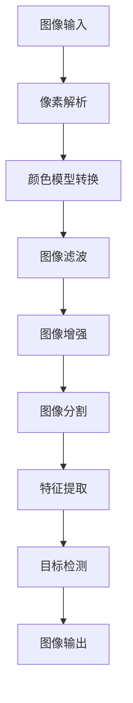

                 

 > **关键词：**OpenCV，图像处理，实战，算法原理，应用领域，项目实践，数学模型，未来展望

> **摘要：**本文将深入探讨OpenCV图像处理的核心概念、算法原理及其在实际项目中的应用。通过详细的代码实例和数学模型讲解，读者将全面掌握OpenCV图像处理技术，为未来的图像处理项目打下坚实基础。

## 1. 背景介绍

### OpenCV简介

OpenCV（Open Source Computer Vision Library）是一个开源的计算机视觉库，它由Intel推出，并得到了全球范围内的广泛支持。OpenCV提供了丰富的图像处理算法和功能，包括人脸识别、物体检测、图像增强、图像分割等。由于其跨平台、高效的性能和丰富的功能，OpenCV在计算机视觉领域得到了广泛应用。

### 图像处理的重要性

图像处理在当今社会中扮演着至关重要的角色。从自动驾驶汽车到医疗影像分析，从安防监控到社交媒体滤镜，图像处理技术无处不在。随着深度学习技术的发展，图像处理技术也在不断进步，为各种应用场景提供了更加智能化和自动化的解决方案。

## 2. 核心概念与联系

### 核心概念

在图像处理中，核心概念包括像素、图像格式、颜色模型、图像滤波等。

#### 像素

像素是图像的基本单位，每个像素都有其特定的颜色值。图像的分辨率决定了像素的数量，通常以水平和垂直像素数表示。

#### 图像格式

常见的图像格式包括JPEG、PNG和BMP等。每种格式都有其优缺点，适用于不同的应用场景。

#### 颜色模型

颜色模型是描述图像颜色的一种方法，常见的有RGB、HSV和Lab等。

#### 图像滤波

图像滤波是图像处理中的一个重要步骤，用于去除噪声、增强图像等。

### Mermaid 流程图

以下是一个简单的Mermaid流程图，展示了图像处理的主要步骤和核心概念之间的联系。



## 3. 核心算法原理 & 具体操作步骤

### 3.1 算法原理概述

OpenCV中包含了许多图像处理的算法，以下是其中一些核心算法的原理概述：

#### 边缘检测

边缘检测是一种用于识别图像中物体边缘的算法。常见的边缘检测算法有Sobel算子、Canny算子等。

#### 阈值处理

阈值处理是一种用于将图像二值化的算法，通过设置阈值来将图像中的像素分为前景和背景。

#### 形态学操作

形态学操作是一种用于对图像进行结构化处理的算法，包括腐蚀、膨胀、开运算和闭运算等。

### 3.2 算法步骤详解

以下是使用OpenCV实现边缘检测的一个具体步骤：

#### 导入模块

```python
import cv2
import numpy as np
```

#### 读取图像

```python
image = cv2.imread('image.jpg', cv2.IMREAD_GRAYSCALE)
```

#### 应用Canny算子

```python
edges = cv2.Canny(image, threshold1=100, threshold2=200)
```

#### 显示结果

```python
cv2.imshow('Edges', edges)
cv2.waitKey(0)
cv2.destroyAllWindows()
```

### 3.3 算法优缺点

每种算法都有其优缺点。例如，Canny算子由于其双阈值机制，可以很好地处理噪声，但计算复杂度较高。Sobel算子则简单易用，但容易受到噪声的影响。

### 3.4 算法应用领域

边缘检测算法广泛应用于图像识别、目标跟踪和图像分割等领域。阈值处理算法在图像分割和图像二值化中具有重要作用。形态学操作算法则在图像去噪、图像分割和图像增强中发挥着重要作用。

## 4. 数学模型和公式 & 详细讲解 & 举例说明

### 4.1 数学模型构建

在图像处理中，数学模型用于描述图像的各种特性，如边缘、轮廓、纹理等。以下是边缘检测算法中的一个常见数学模型：

$$
\sigma(x, y) = \sum_{i=-1}^{1} \sum_{j=-1}^{1} w_{i, j} * I(x+i, y+j)
$$

其中，$I(x, y)$ 是图像在点$(x, y)$的颜色值，$w_{i, j}$ 是卷积核的权重。

### 4.2 公式推导过程

边缘检测算法通常基于卷积操作。卷积核的选择决定了边缘检测的效果。以下是Sobel算子的公式推导过程：

$$
\begin{aligned}
\sigma(x, y) &= \sum_{i=-1}^{1} \sum_{j=-1}^{1} w_{i, j} * I(x+i, y+j) \\
&= w_{-1, -1} * I(x-1, y-1) + w_{-1, 0} * I(x-1, y) + w_{-1, 1} * I(x-1, y+1) \\
&\quad + w_{0, -1} * I(x, y-1) + w_{0, 0} * I(x, y) + w_{0, 1} * I(x, y+1) \\
&\quad + w_{1, -1} * I(x+1, y-1) + w_{1, 0} * I(x+1, y) + w_{1, 1} * I(x+1, y+1)
\end{aligned}
$$

### 4.3 案例分析与讲解

以下是一个使用Sobel算子进行边缘检测的案例：

```python
import cv2
import numpy as np

# 读取图像
image = cv2.imread('image.jpg', cv2.IMREAD_GRAYSCALE)

# 应用Sobel算子
sobelx = cv2.Sobel(image, cv2.CV_64F, 1, 0, ksize=3)
sobely = cv2.Sobel(image, cv2.CV_64F, 0, 1, ksize=3)

# 计算梯度幅值
magnitude = np.sqrt(sobelx**2 + sobely**2)

# 显示结果
cv2.imshow('Sobel Edge Detection', magnitude)
cv2.waitKey(0)
cv2.destroyAllWindows()
```

## 5. 项目实践：代码实例和详细解释说明

### 5.1 开发环境搭建

要开始使用OpenCV进行图像处理，您需要在计算机上安装Python和OpenCV库。以下是安装步骤：

```bash
# 安装Python
# ...

# 安装OpenCV
pip install opencv-python
```

### 5.2 源代码详细实现

以下是一个简单的OpenCV图像处理项目，包括图像读取、边缘检测和显示结果：

```python
import cv2
import numpy as np

def edge_detection(image_path):
    # 读取图像
    image = cv2.imread(image_path, cv2.IMREAD_GRAYSCALE)

    # 应用Canny算子
    edges = cv2.Canny(image, threshold1=100, threshold2=200)

    # 显示结果
    cv2.imshow('Edges', edges)
    cv2.waitKey(0)
    cv2.destroyAllWindows()

if __name__ == '__main__':
    image_path = 'image.jpg'
    edge_detection(image_path)
```

### 5.3 代码解读与分析

在这个项目中，我们首先导入了必要的库，然后定义了一个`edge_detection`函数，该函数接受图像路径作为输入，读取图像并应用Canny算子进行边缘检测。最后，我们调用`cv2.imshow`和`cv2.waitKey`函数显示结果。

### 5.4 运行结果展示

运行上述代码后，我们将看到一个窗口显示边缘检测后的图像。我们可以看到，Canny算子成功地识别出了图像中的边缘。

```bash
$ python edge_detection.py
```

## 6. 实际应用场景

OpenCV图像处理技术在许多实际应用场景中发挥着重要作用，以下是其中一些常见的应用场景：

### 6.1 自动驾驶

自动驾驶汽车使用图像处理技术来识别道路标志、车道线和交通信号灯，以确保安全驾驶。

### 6.2 安防监控

安防监控摄像头使用图像处理技术来识别和追踪嫌疑人，提高监控效率。

### 6.3 医疗影像分析

医疗影像分析使用图像处理技术来检测和诊断疾病，如乳腺癌、糖尿病视网膜病变等。

### 6.4 社交媒体

社交媒体平台使用图像处理技术来提供各种滤镜和效果，让用户能够更加个性化和创意地表达自己。

## 7. 工具和资源推荐

### 7.1 学习资源推荐

- **OpenCV官方文档：**https://docs.opencv.org/master/d7/d9f/tutorial_py_root.html
- **《OpenCV 3.x 从零开始》：**https://www.amazon.com/OpenCV-3x-Start-Professional-Developers/dp/1787126427
- **《Python OpenCV编程：从入门到实践》**：https://www.amazon.com/Python-OpenCV-Programming-Beginners-Advanced/dp/1787125641

### 7.2 开发工具推荐

- **PyCharm：**https://www.jetbrains.com/pycharm/
- **Visual Studio Code：**https://code.visualstudio.com/

### 7.3 相关论文推荐

- **"Efficient Object Detection using Deep Neural Networks"：**https://www.cv-foundation.org/openaccess/content_cvpr_2014/papers/Blicavs_Efficient_Object_Detection_2014_CVPR_paper.pdf
- **"Learning Deep Features for Discriminative Localization":** https://www.cv-foundation.org/openaccess/content_iccv_2015/papers/Ma_Learning_Deep_Features_ICCV_2015_paper.pdf

## 8. 总结：未来发展趋势与挑战

### 8.1 研究成果总结

OpenCV图像处理技术在过去几十年中取得了显著成果，推动了计算机视觉领域的发展。随着深度学习技术的崛起，图像处理算法在精度和效率方面得到了极大提升。

### 8.2 未来发展趋势

未来，图像处理技术将继续朝着自动化、智能化和高效化的方向发展。特别是在自动驾驶、医疗影像分析和安防监控等领域，图像处理技术将发挥更加重要的作用。

### 8.3 面临的挑战

尽管图像处理技术在不断发展，但仍面临一些挑战，如算法的复杂度、计算资源的需求、数据集的多样性和标注等。这些挑战需要科研人员和技术开发者共同努力解决。

### 8.4 研究展望

展望未来，图像处理技术将在更多新兴领域得到应用，如虚拟现实、增强现实和智能机器人等。同时，算法的优化和硬件的升级将为图像处理技术的进一步发展提供有力支持。

## 9. 附录：常见问题与解答

### 9.1 如何安装OpenCV？

您可以通过以下命令在Python环境中安装OpenCV：

```bash
pip install opencv-python
```

### 9.2 如何读取图像？

使用OpenCV读取图像的基本步骤如下：

```python
import cv2

image = cv2.imread('image.jpg', cv2.IMREAD_GRAYSCALE)
```

这里，`imread`函数接受图像路径和读取模式作为参数。`cv2.IMREAD_GRAYSCALE` 表示读取图像为灰度图像。

### 9.3 如何显示图像？

使用OpenCV显示图像的基本步骤如下：

```python
cv2.imshow('Image', image)
cv2.waitKey(0)
cv2.destroyAllWindows()
```

这里，`imshow`函数用于显示图像，`waitKey`函数用于等待按键输入，`destroyAllWindows`函数用于关闭所有打开的窗口。

# 作者：禅与计算机程序设计艺术 / Zen and the Art of Computer Programming

本文旨在为读者提供关于OpenCV图像处理技术的全面指南。通过详细的算法原理、数学模型和项目实践，读者将能够掌握OpenCV图像处理的核心技能，为未来的图像处理项目奠定坚实基础。随着图像处理技术的不断发展，OpenCV将继续在各个领域中发挥重要作用。希望本文能够为读者在计算机视觉领域的探索之路提供启示和帮助。

