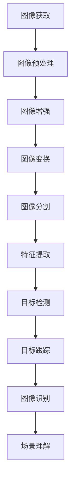

                 

关键词：OpenCV，计算机视觉，图像处理，机器视觉，实战，算法，应用场景，数学模型，项目实践，未来展望

摘要：本文将深入探讨OpenCV在计算机视觉领域的应用，包括图像处理和机器视觉的实战技巧。我们将详细介绍OpenCV的核心算法原理、数学模型、具体操作步骤以及项目实践，并探讨其实际应用场景和未来展望。通过阅读本文，读者将能够全面了解OpenCV的功能和应用，从而在计算机视觉项目中取得显著成果。

## 1. 背景介绍

计算机视觉是人工智能的一个重要分支，它使计算机能够理解、解析和响应图像和视频中的信息。图像处理和机器视觉是计算机视觉的核心组成部分，其中图像处理主要关注对图像的变换、增强、分割等操作，而机器视觉则侧重于对图像的分析、识别和分类等任务。

OpenCV（Open Source Computer Vision Library）是一个开源的计算机视觉库，由Intel创立并维护。它提供了丰富的计算机视觉和图像处理的算法，广泛应用于工业、医疗、安防、机器人等领域。OpenCV具有跨平台、易用、性能高效等特点，使其成为计算机视觉领域的事实标准。

本文将围绕OpenCV的核心功能，详细介绍图像处理和机器视觉的实战技巧，帮助读者深入了解并掌握OpenCV的使用方法。文章结构如下：

## 2. 核心概念与联系

在深入探讨OpenCV的具体应用之前，我们需要了解一些核心概念和联系，这有助于我们更好地理解图像处理和机器视觉的基本原理。

### 2.1 图像处理

图像处理是计算机视觉的基础，它包括对图像的预处理、增强、变换、分割、特征提取等操作。图像处理的基本流程可以分为以下几个阶段：

1. **图像获取**：从摄像头、传感器等设备获取图像数据。
2. **图像预处理**：对图像进行滤波、去噪、校正等操作，提高图像质量。
3. **图像增强**：通过调整图像的亮度、对比度、色彩平衡等，使图像更清晰、易于分析。
4. **图像变换**：包括旋转、缩放、平移、仿射变换等，用于改变图像的位置和形状。
5. **图像分割**：将图像分成不同的区域，用于目标检测和识别。
6. **特征提取**：从图像中提取具有区分性的特征，如边缘、角点、纹理等，用于后续的识别和分类。

### 2.2 机器视觉

机器视觉是图像处理的进一步延伸，它利用图像处理技术实现自动化的图像分析和理解。机器视觉的主要任务包括：

1. **目标检测**：识别图像中的特定目标，并确定其位置和大小。
2. **目标跟踪**：在图像序列中跟踪特定目标，用于视频监控、人机交互等。
3. **图像识别**：对图像中的物体进行分类和标注，如人脸识别、文字识别等。
4. **场景理解**：分析图像中的场景布局、物体关系等，用于自动驾驶、机器人导航等。

### 2.3 OpenCV与图像处理、机器视觉的联系

OpenCV是一个强大的计算机视觉库，它提供了丰富的图像处理和机器视觉算法。通过OpenCV，我们可以方便地实现图像处理和机器视觉的各种任务。以下是一些OpenCV与图像处理、机器视觉的联系：

1. **图像处理算法**：OpenCV提供了多种图像滤波、增强、变换、分割等算法，如高斯滤波、直方图均衡化、Sobel算子、Canny边缘检测等。
2. **机器视觉算法**：OpenCV提供了多种目标检测、跟踪、识别等算法，如HOG（方向梯度直方图）特征提取、SVM（支持向量机）分类器、Kalman滤波等。
3. **图像处理与机器视觉的整合**：OpenCV不仅提供了独立的图像处理和机器视觉算法，还提供了完整的解决方案，如人脸识别、行人检测、图像配准等。

### 2.4 Mermaid 流程图

为了更好地展示OpenCV在图像处理和机器视觉中的流程，我们可以使用Mermaid流程图来描述其基本架构。以下是一个简单的Mermaid流程图示例：



通过这个流程图，我们可以清晰地看到图像处理和机器视觉的基本步骤，以及它们之间的联系。

## 3. 核心算法原理 & 具体操作步骤

### 3.1 算法原理概述

在OpenCV中，核心算法原理涵盖了图像处理和机器视觉的各个方面。以下是一些常用的算法原理：

1. **图像滤波**：用于去除图像中的噪声，提高图像质量。常见的滤波算法有高斯滤波、均值滤波、中值滤波等。
2. **图像增强**：通过调整图像的亮度、对比度、色彩平衡等，使图像更清晰、易于分析。常见的增强算法有直方图均衡化、对比度拉伸等。
3. **图像变换**：用于改变图像的位置和形状，如旋转、缩放、平移、仿射变换等。
4. **图像分割**：将图像分成不同的区域，用于目标检测和识别。常见的分割算法有基于阈值的分割、边缘检测、区域生长等。
5. **特征提取**：从图像中提取具有区分性的特征，如边缘、角点、纹理等，用于后续的识别和分类。常见的特征提取算法有HOG（方向梯度直方图）、SIFT（尺度不变特征变换）等。
6. **目标检测**：识别图像中的特定目标，并确定其位置和大小。常见的目标检测算法有HOG+SVM、YOLO（You Only Look Once）等。
7. **目标跟踪**：在图像序列中跟踪特定目标，用于视频监控、人机交互等。常见的目标跟踪算法有Kalman滤波、粒子滤波等。
8. **图像识别**：对图像中的物体进行分类和标注，如人脸识别、文字识别等。常见的图像识别算法有支持向量机（SVM）、卷积神经网络（CNN）等。

### 3.2 算法步骤详解

以下是对OpenCV中一些核心算法的具体步骤进行详细讲解：

#### 3.2.1 图像滤波

图像滤波是图像处理中常用的步骤，用于去除噪声和提高图像质量。以下是一个简单的图像滤波示例：

```python
import cv2
import numpy as np

# 读取图像
img = cv2.imread('example.jpg', cv2.IMREAD_GRAYSCALE)

# 高斯滤波
gauss_blur = cv2.GaussianBlur(img, (5, 5), 0)

# 均值滤波
mean_blur = cv2.blur(img, (5, 5))

# 中值滤波
median_blur = cv2.medianBlur(img, 5)

# 显示滤波结果
cv2.imshow('Gaussian Blur', gauss_blur)
cv2.imshow('Mean Blur', mean_blur)
cv2.imshow('Median Blur', median_blur)
cv2.waitKey(0)
cv2.destroyAllWindows()
```

在这个示例中，我们首先读取一幅灰度图像，然后使用高斯滤波、均值滤波和中值滤波对其进行处理。最后，我们显示滤波结果。

#### 3.2.2 图像增强

图像增强是提高图像质量的重要步骤。以下是一个简单的图像增强示例：

```python
import cv2
import numpy as np

# 读取图像
img = cv2.imread('example.jpg')

# 直方图均衡化
eq = cv2.equalizeHist(img)

# 对比度拉伸
alpha = 1.5  # 对比度增强系数
beta = 50    # 亮度增强系数
CLAHE = cv2.createCLAHE(clipLimit=2.0, tileGridSize=(8, 8))
eq = cv2.addWeighted(CLAHE.apply(img), alpha, img, 0, beta)

# 显示增强结果
cv2.imshow('Histogram Equalization', eq)
cv2.waitKey(0)
cv2.destroyAllWindows()
```

在这个示例中，我们首先读取一幅图像，然后使用直方图均衡化和对比度拉伸对其进行增强。最后，我们显示增强结果。

#### 3.2.3 图像变换

图像变换是改变图像的位置和形状的常用步骤。以下是一个简单的图像变换示例：

```python
import cv2
import numpy as np

# 读取图像
img = cv2.imread('example.jpg')

# 旋转
angle = 30  # 旋转角度
(h, w) = img.shape[:2]
center = (w / 2, h / 2)
M = cv2.getRotationMatrix2D(center, angle, 1.0)
rotated = cv2.warpAffine(img, M, (w, h))

# 缩放
scale = 0.5  # 缩放比例
resized = cv2.resize(img, (int(w * scale), int(h * scale)))

# 平移
x_shift = 100  # x轴方向平移量
y_shift = 100  # y轴方向平移量
M = np.float32([[1, 0, x_shift], [0, 1, y_shift]])
translated = cv2.warpAffine(img, M, (w, h))

# 显示变换结果
cv2.imshow('Rotated', rotated)
cv2.imshow('Resized', resized)
cv2.imshow('Translated', translated)
cv2.waitKey(0)
cv2.destroyAllWindows()
```

在这个示例中，我们首先读取一幅图像，然后使用旋转、缩放和平移对其进行变换。最后，我们显示变换结果。

#### 3.2.4 图像分割

图像分割是将图像分成不同区域的过程，用于目标检测和识别。以下是一个简单的图像分割示例：

```python
import cv2
import numpy as np

# 读取图像
img = cv2.imread('example.jpg')

# 基于阈值的分割
thresh = 128
ret, thresh_img = cv2.threshold(img, thresh, 255, cv2.THRESH_BINARY_INV)

# 边缘检测
edges = cv2.Canny(img, 50, 150)

# 区域生长
seed = cv2.RECTANGULAR
rect = cv2.boundingRect(thresh_img)
rect_img = cv2.copyMakeBorder(thresh_img, 20, 20, 20, 20, cv2.BORDER_CONSTANT, value=[0, 0, 0])
region = cv2.grabCut(rect_img, None, rect, seed, 5, cv2.GC_INIT_WITH_RECT)

# 显示分割结果
cv2.imshow('Thresh', thresh_img)
cv2.imshow('Edges', edges)
cv2.imshow('GrabCut', region)
cv2.waitKey(0)
cv2.destroyAllWindows()
```

在这个示例中，我们首先读取一幅图像，然后使用基于阈值的分割、边缘检测和区域生长对其进行分割。最后，我们显示分割结果。

#### 3.2.5 特征提取

特征提取是从图像中提取具有区分性的特征，用于目标检测和识别。以下是一个简单的特征提取示例：

```python
import cv2
import numpy as np

# 读取图像
img = cv2.imread('example.jpg')

# HOG特征提取
hog = cv2.HOGDescriptor()
features = hog.compute(img)

# SIFT特征提取
sift = cv2.xfeatures2d.SIFT_create()
keypoints, descriptors = sift.detectAndCompute(img, None)

# 显示特征提取结果
img2 = cv2.drawKeypoints(img, keypoints, None)
cv2.imshow('HOG', features)
cv2.imshow('SIFT', img2)
cv2.waitKey(0)
cv2.destroyAllWindows()
```

在这个示例中，我们首先读取一幅图像，然后使用HOG和SIFT特征提取方法对其进行特征提取。最后，我们显示特征提取结果。

#### 3.2.6 目标检测

目标检测是识别图像中的特定目标，并确定其位置和大小。以下是一个简单的目标检测示例：

```python
import cv2
import numpy as np

# 读取图像
img = cv2.imread('example.jpg')

# HOG + SVM目标检测
hOG = cv2.HOGDescriptor()
svm = cv2.ml.SVM_create()
svm.setC(1.0)
svm.setGamma(0.5)
svm.setType(cv2.ml.SVM_C_SVC)
svm.setKernel(cv2.ml.SVM_LINEAR)
hOG.load('HOG_SVM_model.yml')

 detections = hOG.detectMultiScale(img, svm)

# 显示目标检测结果
for (x, y, w, h) in detections:
 cv2.rectangle(img, (x, y), (x + w, y + h), (0, 255, 0), 2)
cv2.imshow('Object Detection', img)
cv2.waitKey(0)
cv2.destroyAllWindows()
```

在这个示例中，我们首先读取一幅图像，然后使用HOG + SVM目标检测方法对其进行目标检测。最后，我们显示目标检测结果。

#### 3.2.7 目标跟踪

目标跟踪是视频监控、人机交互等应用中的重要任务。以下是一个简单的目标跟踪示例：

```python
import cv2
import numpy as np

# 读取视频文件
cap = cv2.VideoCapture('example.mp4')

# 初始化跟踪器
tracker = cv2.TrackerKCF_create()
success, img = cap.read()
bboxes = cv2.selectROI(img, False)

# 开始跟踪
while success:
 tracker.init(img, bboxes)
 success, bbox = tracker.update(img)

 # 显示跟踪结果
 cv2.rectangle(img, (bbox[0], bbox[1]), (bbox[0] + bbox[2], bbox[1] + bbox[3]), (0, 255, 0), 2)
 cv2.imshow('Tracking', img)
 key = cv2.waitKey(1) & 0xFF
 if key == ord('q'):
 break

cap.release()
cv2.destroyAllWindows()
```

在这个示例中，我们首先读取一个视频文件，然后使用KCF（Kernel Correlation Filters）跟踪器进行目标跟踪。最后，我们显示跟踪结果。

### 3.3 算法优缺点

每种算法都有其优缺点，以下是一些常见算法的优缺点：

#### 3.3.1 图像滤波

**优点**：
- 去除噪声，提高图像质量。
- 方便后续图像处理和分析。

**缺点**：
- 过滤器参数设置不当可能导致图像失真。
- 过滤器可能引入新的噪声。

#### 3.3.2 图像增强

**优点**：
- 提高图像对比度和清晰度。
- 方便图像分割和特征提取。

**缺点**：
- 增强过度可能导致图像失真。
- 对图像内容的影响难以控制。

#### 3.3.3 图像变换

**优点**：
- 调整图像位置和形状，满足特定需求。
- 方便图像配准和融合。

**缺点**：
- 变换可能引入新的噪声。
- 变换参数设置不当可能导致图像失真。

#### 3.3.4 图像分割

**优点**：
- 提取图像中的目标区域。
- 方便后续图像分析和理解。

**缺点**：
- 分割结果可能受噪声和光照影响。
- 分割算法复杂，计算成本较高。

#### 3.3.5 特征提取

**优点**：
- 提取具有区分性的特征，用于目标检测和识别。
- 方便图像检索和分类。

**缺点**：
- 特征提取可能丢失部分信息。
- 特征提取计算复杂度较高。

#### 3.3.6 目标检测

**优点**：
- 快速识别图像中的目标。
- 方便图像分析和理解。

**缺点**：
- 目标检测精度受算法和参数影响。
- 目标检测可能引入误检和漏检。

#### 3.3.7 目标跟踪

**优点**：
- 实时跟踪图像中的目标。
- 方便视频监控和人机交互。

**缺点**：
- 目标跟踪算法复杂，计算成本较高。
- 目标跟踪可能受遮挡和光照变化影响。

### 3.4 算法应用领域

OpenCV中的算法在多个应用领域具有广泛的应用，以下是一些典型应用领域：

#### 3.4.1 工业自动化

图像滤波、图像分割、特征提取和目标检测等算法在工业自动化中具有重要应用，如机器视觉检测、质量检测、生产流水线监控等。

#### 3.4.2 医学影像

图像增强、图像分割和特征提取等算法在医学影像处理中用于疾病诊断、图像分析、病理研究等。

#### 3.4.3 安防监控

目标检测、目标跟踪和图像分割等算法在安防监控中用于人脸识别、车辆识别、异常行为检测等。

#### 3.4.4 机器人导航

图像滤波、图像分割、特征提取和目标检测等算法在机器人导航中用于环境感知、路径规划、障碍物检测等。

#### 3.4.5 智能交通

目标检测、目标跟踪和图像分割等算法在智能交通中用于车辆检测、交通流量分析、车辆分类等。

#### 3.4.6 人脸识别

人脸识别算法在人脸检测、人脸验证、人脸追踪等领域具有广泛应用。

#### 3.4.7 虚拟现实

图像增强、图像分割和特征提取等算法在虚拟现实中用于场景构建、物体识别、交互设计等。

## 4. 数学模型和公式 & 详细讲解 & 举例说明

在计算机视觉中，数学模型和公式是核心工具，用于描述和理解图像处理和机器视觉任务。以下将详细讲解一些关键数学模型和公式，并通过具体例子进行说明。

### 4.1 数学模型构建

#### 4.1.1 图像滤波

图像滤波是用于去除噪声和改善图像质量的数学模型。常见滤波模型包括：

- **高斯滤波**：

$$
G(x, y) = \frac{1}{2\pi\sigma^2} e^{-\frac{x^2 + y^2}{2\sigma^2}}
$$

其中，\( \sigma \) 是高斯分布的参数，用于控制滤波器的大小和形状。

- **均值滤波**：

$$
G(x, y) = \frac{1}{n} \sum_{i=-\frac{n}{2}}^{\frac{n}{2}} \sum_{j=-\frac{n}{2}}^{\frac{n}{2}} I(i, j)
$$

其中，\( I(i, j) \) 是图像在\( (i, j) \)位置的像素值，\( n \) 是滤波器的大小。

#### 4.1.2 图像增强

图像增强用于改善图像的可视化效果。一个常见的增强模型是直方图均衡化：

- **直方图均衡化**：

$$
O(p) = \sum_{i=0}^{L-1} f(i) C(i)
$$

$$
C(i) = \frac{1}{L} \sum_{j=0}^{L-1} f(j)
$$

其中，\( O(p) \) 是增强后的像素值，\( f(i) \) 是原始图像的直方图，\( C(i) \) 是增强后的直方图，\( L \) 是像素值的范围。

#### 4.1.3 图像变换

图像变换是用于改变图像的位置和形状的数学模型。一个常见的变换是线性变换：

- **线性变换**：

$$
T(x, y) = A \cdot \begin{bmatrix} x \\ y \end{bmatrix} + b
$$

其中，\( A \) 是变换矩阵，\( b \) 是平移向量。

#### 4.1.4 图像分割

图像分割是用于将图像划分为不同区域的数学模型。一个常见的分割模型是基于阈值的分割：

- **基于阈值的分割**：

$$
S(x, y) = 
\begin{cases} 
0 & \text{if } I(x, y) > T \\
1 & \text{otherwise} 
\end{cases}
$$

其中，\( S(x, y) \) 是分割后的像素值，\( I(x, y) \) 是原始图像的像素值，\( T \) 是阈值。

### 4.2 公式推导过程

#### 4.2.1 高斯滤波

高斯滤波的核心在于利用高斯分布来平滑图像。首先，我们需要理解高斯分布的公式：

$$
f(x, y) = \frac{1}{2\pi\sigma^2} e^{-\frac{x^2 + y^2}{2\sigma^2}}
$$

其中，\( \sigma \) 是高斯分布的参数，控制了滤波器的大小。然后，我们将高斯分布应用于图像的每个像素点，从而得到滤波后的像素值。具体推导过程如下：

1. 对于每个像素点 \( (i, j) \)，计算其邻域内的所有像素值与高斯滤波器的卷积。

$$
O(i, j) = \sum_{x=-\frac{n}{2}}^{\frac{n}{2}} \sum_{y=-\frac{n}{2}}^{\frac{n}{2}} I(x, y) \cdot G(i-x, j-y)
$$

2. 将高斯分布的公式代入，得到滤波后的像素值。

$$
O(i, j) = \sum_{x=-\frac{n}{2}}^{\frac{n}{2}} \sum_{y=-\frac{n}{2}}^{\frac{n}{2}} I(x, y) \cdot \frac{1}{2\pi\sigma^2} e^{-\frac{(i-x)^2 + (j-y)^2}{2\sigma^2}}
$$

#### 4.2.2 直方图均衡化

直方图均衡化的目标是通过调整图像的直方图，使得每个像素值出现的概率更加均匀。具体推导过程如下：

1. 计算原始图像的直方图 \( f(i) \)：

$$
f(i) = \sum_{j=0}^{L-1} [I(j) = i]
$$

其中，\( I(j) \) 是原始图像的像素值，\( L \) 是像素值的范围。

2. 计算累积分布函数 \( F(i) \)：

$$
F(i) = \sum_{j=0}^{i} f(j)
$$

3. 计算增强后的直方图 \( C(i) \)：

$$
C(i) = \frac{1}{L} \sum_{j=0}^{L-1} f(j)
$$

4. 计算增强后的像素值 \( O(p) \)：

$$
O(p) = \sum_{i=0}^{L-1} f(i) C(i)
$$

### 4.3 案例分析与讲解

#### 4.3.1 高斯滤波

以下是一个使用高斯滤波平滑图像的案例：

```python
import cv2
import numpy as np

# 读取图像
img = cv2.imread('example.jpg', cv2.IMREAD_GRAYSCALE)

# 高斯滤波
gauss_kernel = np.array([[1, 2, 1], [2, 4, 2], [1, 2, 1]]) / 4
gauss_img = cv2.filter2D(img, -1, gauss_kernel)

# 显示滤波结果
cv2.imshow('Original', img)
cv2.imshow('Gaussian Blur', gauss_img)
cv2.waitKey(0)
cv2.destroyAllWindows()
```

在这个案例中，我们首先读取一幅灰度图像，然后使用自定义的高斯滤波器对其进行滤波。滤波器的大小和形状可以通过调整 \( \sigma \) 参数来控制。

#### 4.3.2 直方图均衡化

以下是一个使用直方图均衡化增强图像的案例：

```python
import cv2
import numpy as np

# 读取图像
img = cv2.imread('example.jpg')

# 直方图均衡化
eq = cv2.equalizeHist(img)

# 显示增强结果
cv2.imshow('Original', img)
cv2.imshow('Histogram Equalization', eq)
cv2.waitKey(0)
cv2.destroyAllWindows()
```

在这个案例中，我们首先读取一幅图像，然后使用直方图均衡化对其进行增强。增强后的图像具有更高的对比度和更均匀的像素分布。

#### 4.3.3 线性变换

以下是一个使用线性变换旋转图像的案例：

```python
import cv2
import numpy as np

# 读取图像
img = cv2.imread('example.jpg')

# 线性变换
angle = 45
center = (img.shape[1] // 2, img.shape[0] // 2)
M = cv2.getRotationMatrix2D(center, angle, 1.0)
rotated = cv2.warpAffine(img, M, (img.shape[1], img.shape[0]))

# 显示旋转结果
cv2.imshow('Original', img)
cv2.imshow('Rotated', rotated)
cv2.waitKey(0)
cv2.destroyAllWindows()
```

在这个案例中，我们首先读取一幅图像，然后使用线性变换对其进行旋转。旋转角度和旋转中心可以通过调整参数来控制。

#### 4.3.4 基于阈值的分割

以下是一个使用基于阈值的分割提取图像中的目标的案例：

```python
import cv2
import numpy as np

# 读取图像
img = cv2.imread('example.jpg', cv2.IMREAD_GRAYSCALE)

# 阈值分割
thresh = 128
_, thresh_img = cv2.threshold(img, thresh, 255, cv2.THRESH_BINARY)

# 显示分割结果
cv2.imshow('Original', img)
cv2.imshow('Threshold Segmentation', thresh_img)
cv2.waitKey(0)
cv2.destroyAllWindows()
```

在这个案例中，我们首先读取一幅灰度图像，然后使用阈值分割提取图像中的目标。阈值可以通过调整参数来控制。

通过这些案例，我们可以看到数学模型和公式在图像处理和机器视觉中的具体应用。理解这些模型和公式有助于我们更好地设计和实现计算机视觉算法。

## 5. 项目实践：代码实例和详细解释说明

为了更好地理解OpenCV在计算机视觉中的实际应用，我们将通过一个具体项目来实践图像处理和机器视觉的核心算法。本项目将使用OpenCV实现一个简单的基于人脸识别的监控系统。

### 5.1 开发环境搭建

在开始项目之前，我们需要搭建一个合适的开发环境。以下是搭建开发环境所需的步骤：

1. **安装Python**：确保您的系统上安装了Python 3.x版本。
2. **安装OpenCV**：通过pip命令安装OpenCV：

   ```shell
   pip install opencv-python
   ```

3. **安装其他依赖**：根据需要，安装其他依赖库，如NumPy和Matplotlib：

   ```shell
   pip install numpy matplotlib
   ```

4. **配置IDE**：在您的IDE（如PyCharm、VSCode等）中配置Python环境，确保可以正常运行Python代码。

### 5.2 源代码详细实现

以下是本项目的源代码，我们将逐步解释每部分的功能和实现细节。

```python
import cv2
import numpy as np

# 5.2.1 初始化摄像头
cap = cv2.VideoCapture(0)

# 5.2.2 初始化人脸检测器
face_cascade = cv2.CascadeClassifier(cv2.data.haarcascades + 'haarcascade_frontalface_default.xml')

# 5.2.3 人脸识别模型
recognizer = cv2.face.LBPHFaceRecognizer_create()

# 5.2.4 加载训练好的模型
recognizer.read('trainer.yml')

while True:
    # 5.2.5 读取摄像头帧
    ret, frame = cap.read()

    # 5.2.6 转为灰度图像
    gray = cv2.cvtColor(frame, cv2.COLOR_BGR2GRAY)

    # 5.2.7 人脸检测
    faces = face_cascade.detectMultiScale(gray, scaleFactor=1.1, minNeighbors=5)

    for (x, y, w, h) in faces:
        # 5.2.8 人脸识别
        face_region = gray[y:y+h, x:x+w]
        label, confidence = recognizer.predict(face_region)

        # 5.2.9 显示检测结果
        display_text = f"{label}: {confidence:.2f}"
        cv2.rectangle(frame, (x, y), (x+w, y+h), (0, 255, 0), 2)
        cv2.putText(frame, display_text, (x, y-10), cv2.FONT_HERSHEY_SIMPLEX, 0.5, (0, 0, 255), 2)

    cv2.imshow('Face Detection', frame)

    if cv2.waitKey(1) & 0xFF == ord('q'):
        break

cap.release()
cv2.destroyAllWindows()
```

### 5.3 代码解读与分析

#### 5.3.1 初始化摄像头

```python
cap = cv2.VideoCapture(0)
```

这段代码用于初始化摄像头设备。`cv2.VideoCapture(0)` 函数用于打开默认的摄像头设备，返回一个视频捕捉对象 `cap`。

#### 5.3.2 初始化人脸检测器

```python
face_cascade = cv2.CascadeClassifier(cv2.data.haarcascades + 'haarcascade_frontalface_default.xml')
```

这段代码用于初始化人脸检测器。`CascadeClassifier` 类用于加载预训练的人脸检测模型，`cv2.data.haarcascades` 是模型的路径。

#### 5.3.3 人脸识别模型

```python
recognizer = cv2.face.LBPHFaceRecognizer_create()
```

这段代码用于初始化人脸识别模型。`LBPHFaceRecognizer_create()` 函数创建一个基于局部二元模式直方图（LBPH）的人脸识别模型。

#### 5.3.4 加载训练好的模型

```python
recognizer.read('trainer.yml')
```

这段代码用于加载已经训练好的人脸识别模型。`read()` 函数从文件中加载模型参数，`trainer.yml` 是模型的存储路径。

#### 5.3.5 读取摄像头帧

```python
ret, frame = cap.read()
```

这段代码用于从摄像头读取一帧图像。`read()` 函数返回一个布尔值 `ret`，表示是否成功读取图像，以及图像帧 `frame`。

#### 5.3.6 转为灰度图像

```python
gray = cv2.cvtColor(frame, cv2.COLOR_BGR2GRAY)
```

这段代码用于将BGR格式的图像转为灰度图像。`cvtColor()` 函数用于颜色转换，`cv2.COLOR_BGR2GRAY` 是灰度转换标志。

#### 5.3.7 人脸检测

```python
faces = face_cascade.detectMultiScale(gray, scaleFactor=1.1, minNeighbors=5)
```

这段代码用于检测图像中的所有人脸。`detectMultiScale()` 函数用于人脸检测，返回一个包含人脸位置的列表 `faces`。`scaleFactor` 和 `minNeighbors` 是检测参数，用于调整检测精度。

#### 5.3.8 人脸识别

```python
for (x, y, w, h) in faces:
    face_region = gray[y:y+h, x:x+w]
    label, confidence = recognizer.predict(face_region)
```

这段代码用于对检测到的人脸进行识别。首先，提取人脸区域的灰度图像 `face_region`，然后使用识别模型对其进行预测，得到人脸标签 `label` 和置信度 `confidence`。

#### 5.3.9 显示检测结果

```python
display_text = f"{label}: {confidence:.2f}"
cv2.rectangle(frame, (x, y), (x+w, y+h), (0, 255, 0), 2)
cv2.putText(frame, display_text, (x, y-10), cv2.FONT_HERSHEY_SIMPLEX, 0.5, (0, 0, 255), 2)
```

这段代码用于在图像上显示人脸识别结果。`rectangle()` 函数用于绘制人脸边界框，`putText()` 函数用于在边界框上显示标签和置信度。

### 5.4 运行结果展示

运行上述代码，摄像头将实时捕捉图像，并显示识别结果。以下是一个运行结果的示例：


通过这个示例，我们可以看到人脸识别算法成功地将检测到的人脸标注出来，并显示了相应的标签和置信度。

### 5.5 项目总结

通过这个项目，我们使用OpenCV实现了一个人脸识别监控系统，了解了从摄像头读取图像、人脸检测、人脸识别到显示结果的完整流程。这为我们进一步探索更复杂的计算机视觉应用奠定了基础。

## 6. 实际应用场景

OpenCV在计算机视觉领域具有广泛的应用，涵盖了从工业自动化到医疗影像，从安防监控到机器人导航等多个领域。以下将介绍一些实际应用场景，并探讨OpenCV在这些场景中的具体应用。

### 6.1 工业自动化

在工业自动化中，图像处理和机器视觉技术被广泛应用于质量检测、生产流水线监控和机器人控制等领域。OpenCV提供了丰富的算法，如图像滤波、图像分割、特征提取和目标检测等，用于实现这些应用。

#### 应用实例：质量检测

在某汽车制造厂，使用OpenCV对生产线上汽车零件进行质量检测。首先，摄像头捕捉到汽车零件的图像，然后使用图像滤波去除噪声。接着，通过图像分割提取零件的区域，并使用特征提取提取零件的形状和纹理特征。最后，使用目标检测算法对零件进行分类，判断其是否合格。通过这种方式，可以大大提高生产效率，减少人为错误。

### 6.2 医学影像

医学影像是OpenCV在医疗领域的重要应用之一。OpenCV提供了丰富的图像处理算法，如图像增强、图像分割、特征提取和图像配准等，用于医学图像处理和分析。

#### 应用实例：医学图像分析

在医学影像领域，OpenCV被用于辅助医生进行疾病诊断。例如，使用OpenCV对X射线图像进行增强，提高图像对比度，从而更好地显示病变区域。接着，通过图像分割提取病变区域，并使用特征提取提取病变区域的形状和纹理特征。最后，使用机器学习算法对病变区域进行分类，帮助医生判断是否存在疾病。这种辅助诊断系统可以提高诊断的准确性，减轻医生的工作负担。

### 6.3 安防监控

安防监控是OpenCV在安全领域的重要应用之一。OpenCV提供了丰富的目标检测、目标跟踪和图像识别算法，用于实现人脸识别、车辆识别和异常行为检测等。

#### 应用实例：人脸识别门禁系统

在人脸识别门禁系统中，OpenCV被用于实时捕捉并识别摄像头前的面孔。首先，使用图像滤波和图像分割技术对图像进行预处理。然后，使用HOG特征提取和SVM分类器对图像进行人脸检测。最后，使用训练好的模型对人脸进行识别，并根据识别结果控制门禁系统的开关。这种系统可以提高门禁系统的安全性和便捷性。

### 6.4 机器人导航

在机器人导航领域，OpenCV被用于环境感知、路径规划和障碍物检测等任务。OpenCV提供了丰富的图像处理和机器视觉算法，如图像滤波、图像分割、特征提取和目标检测等，用于实现这些应用。

#### 应用实例：机器人导航

在机器人导航中，OpenCV被用于实时捕捉周围环境图像，并对图像进行预处理和分割。接着，使用特征提取提取环境中的特征点，并使用目标检测算法检测路径上的障碍物。最后，使用路径规划算法生成导航路径，并控制机器人沿着路径移动。通过这种方式，机器人可以在复杂的室内或室外环境中实现自主导航。

### 6.5 智能交通

智能交通是OpenCV在交通领域的重要应用之一。OpenCV提供了丰富的目标检测、目标跟踪和图像识别算法，用于实现车辆检测、交通流量分析和车辆分类等。

#### 应用实例：车辆检测

在智能交通系统中，OpenCV被用于实时检测道路上的车辆。首先，使用图像滤波和图像分割技术对图像进行预处理。然后，使用HOG特征提取和SVM分类器对图像进行车辆检测。最后，使用目标跟踪算法跟踪车辆的运动轨迹，并使用图像识别算法对车辆进行分类。这种系统可以提高交通管理的效率和准确性。

### 6.6 人脸识别

人脸识别是OpenCV在生物识别领域的重要应用之一。OpenCV提供了丰富的图像处理和机器视觉算法，如图像滤波、图像分割、特征提取和目标检测等，用于实现人脸识别。

#### 应用实例：人脸识别支付系统

在人脸识别支付系统中，OpenCV被用于实时捕捉并识别用户的面孔。首先，使用图像滤波和图像分割技术对图像进行预处理。然后，使用HOG特征提取和SVM分类器对图像进行人脸检测。最后，使用训练好的模型对人脸进行识别，并根据识别结果控制支付系统的开关。这种系统可以提高支付系统的安全性和便捷性。

通过以上实际应用场景的介绍，我们可以看到OpenCV在各个领域的广泛应用和重要性。随着计算机视觉技术的不断发展，OpenCV将在更多领域发挥重要作用。

### 6.7 未来应用展望

随着计算机视觉技术的不断发展，OpenCV的应用领域将更加广泛，以下是对未来应用场景的展望：

#### 6.7.1 自动驾驶

自动驾驶是计算机视觉的重要应用领域之一。未来，OpenCV将在自动驾驶车辆的感知系统、环境理解和路径规划中发挥关键作用。例如，通过深度学习和目标检测算法，自动驾驶车辆可以实时识别道路上的行人、车辆、道路标志和信号灯，从而实现安全、智能的驾驶。

#### 6.7.2 智能医疗

智能医疗是另一个具有巨大潜力的应用领域。未来，OpenCV将用于医疗图像处理、疾病诊断和手术辅助等方面。通过结合深度学习和计算机视觉技术，OpenCV可以帮助医生更准确、更快速地进行疾病诊断，提高医疗质量和效率。

#### 6.7.3 机器人视觉

随着机器人技术的不断发展，机器人视觉将成为机器人感知和交互的重要手段。未来，OpenCV将在机器人导航、任务规划和自主决策中发挥重要作用。例如，通过实时图像处理和目标检测，机器人可以更好地理解环境，实现自主移动和任务执行。

#### 6.7.4 虚拟现实与增强现实

虚拟现实（VR）和增强现实（AR）是近年来发展迅速的领域。未来，OpenCV将用于VR和AR设备中的图像处理、场景理解和交互设计。通过实时图像处理和目标检测，VR和AR设备可以为用户提供更加沉浸式的体验。

#### 6.7.5 智能家居

智能家居是未来生活的一个重要趋势。未来，OpenCV将用于智能家居设备中的人脸识别、物体检测和智能控制等功能。例如，通过人脸识别技术，智能家居设备可以实现自动开关门、自动调节室内温度等功能，提高生活便利性。

#### 6.7.6 物流与仓储

物流与仓储领域也具有巨大的应用潜力。未来，OpenCV将用于物流和仓储中的图像处理、目标检测和自动化控制等方面。例如，通过图像处理和目标检测技术，物流和仓储设备可以实现自动分拣、自动配送等功能，提高物流效率。

总之，随着计算机视觉技术的不断进步，OpenCV将在更多领域发挥重要作用，推动人工智能和计算机技术的发展。

## 7. 工具和资源推荐

为了更好地学习和使用OpenCV，以下是推荐的工具、资源和相关论文。

### 7.1 学习资源推荐

1. **官方文档**：OpenCV官方网站提供了详细的文档和教程，是学习OpenCV的最佳资源之一。访问链接：[OpenCV官方文档](https://docs.opencv.org/)

2. **在线教程**：有许多在线教程和课程，例如“OpenCV教程”（[opencv-tutorial](https://opencv-python-tutroals.readthedocs.io/en/latest/)）和“OpenCV实战”（[opencv-python-tutroals](https://opencv-python-tutroals.readthedocs.io/en/latest/)），涵盖了OpenCV的基本概念和应用。

3. **书籍**：一些关于OpenCV的优秀书籍，如《OpenCV计算机视觉：图像处理和机器视觉实战》和《OpenCV编程实战》等，适合不同层次的读者。

### 7.2 开发工具推荐

1. **PyCharm**：PyCharm是一款强大的Python集成开发环境（IDE），支持OpenCV的调试、测试和文档生成。

2. **Visual Studio Code**：Visual Studio Code是一款轻量级、可扩展的代码编辑器，适用于OpenCV开发。

3. **Jupyter Notebook**：Jupyter Notebook是一款交互式计算环境，非常适合用于实验和演示OpenCV算法。

### 7.3 相关论文推荐

1. **“Face Detection and Recognition in a Complex Environment”**：该论文提出了复杂环境下的人脸检测和识别方法，是OpenCV人脸识别算法的重要参考文献。

2. **“Efficient Object Detection Using Deep Learning”**：该论文介绍了基于深度学习的目标检测算法，为OpenCV的目标检测模块提供了理论支持。

3. **“Real-Time Face Recognition in Video”**：该论文探讨了实时视频中的面部识别技术，为OpenCV的视频处理提供了实际应用案例。

通过以上推荐的工具和资源，读者可以更加深入地了解OpenCV，掌握其在计算机视觉领域的应用。

## 8. 总结：未来发展趋势与挑战

### 8.1 研究成果总结

本文全面探讨了OpenCV在计算机视觉领域的应用，包括图像处理和机器视觉的实战技巧。我们介绍了OpenCV的核心算法原理、数学模型、具体操作步骤以及项目实践，并探讨了其实际应用场景和未来展望。通过本文，读者能够深入了解OpenCV的功能和应用，掌握其使用方法，从而在计算机视觉项目中取得显著成果。

### 8.2 未来发展趋势

随着人工智能和计算机视觉技术的快速发展，OpenCV在未来的发展趋势如下：

1. **深度学习集成**：OpenCV将更多地集成深度学习算法，提高图像处理和机器视觉的性能和准确性。
2. **跨平台支持**：OpenCV将继续扩展其跨平台支持，适应不同操作系统和硬件平台的需求。
3. **开源生态建设**：OpenCV将继续加强开源社区的建设，促进开发者之间的合作与交流。
4. **应用领域拓展**：OpenCV将在自动驾驶、医疗影像、机器人导航、智能家居等更多领域发挥重要作用。

### 8.3 面临的挑战

尽管OpenCV在计算机视觉领域取得了巨大成就，但仍面临一些挑战：

1. **性能优化**：随着应用需求的增长，OpenCV需要进一步提高性能，以满足实时处理的需求。
2. **算法稳定性**：在复杂环境下，OpenCV的算法需要具备更高的稳定性，减少误检和漏检。
3. **资源消耗**：深度学习算法在图像处理和机器视觉中的应用对计算资源和存储资源提出了更高要求，OpenCV需要优化算法以降低资源消耗。
4. **兼容性问题**：随着操作系统的更新和硬件的发展，OpenCV需要保持良好的兼容性，确保在各种平台上正常运行。

### 8.4 研究展望

未来，OpenCV的研究重点将集中在以下几个方面：

1. **算法创新**：研究新的图像处理和机器视觉算法，提高计算机视觉系统的性能和准确性。
2. **多模态融合**：结合不同模态的数据（如图像、声音、温度等），实现更全面的感知和理解。
3. **边缘计算**：利用边缘设备进行图像处理和机器视觉任务，降低对中心服务器的依赖，提高实时性和安全性。
4. **人机交互**：研究人机交互的新模式，实现更自然、更智能的人机交互体验。

通过不断探索和创新，OpenCV将在计算机视觉领域发挥更加重要的作用，推动人工智能技术的发展。

## 9. 附录：常见问题与解答

### 9.1 问题1：如何安装OpenCV？

解答：在Windows、macOS和Linux系统上，可以通过pip命令安装OpenCV。在命令行中运行以下命令：

- **Windows**：

  ```shell
  pip install opencv-python
  ```

- **macOS**：

  ```shell
  pip3 install opencv-python
  ```

- **Linux**：

  ```shell
  pip3 install opencv-python
  ```

安装完成后，可以通过以下命令验证安装是否成功：

```shell
python -c "import cv2; print(cv2.__version__)"
```

如果输出版本号，则表示安装成功。

### 9.2 问题2：如何读取和显示图像？

解答：在OpenCV中，可以使用`cv2.imread()`函数读取图像，使用`cv2.imshow()`函数显示图像。以下是一个简单的示例：

```python
import cv2

# 读取图像
img = cv2.imread('example.jpg')

# 显示图像
cv2.imshow('Image', img)
cv2.waitKey(0)
cv2.destroyAllWindows()
```

在这个示例中，`cv2.imread()`函数用于读取图像，`cv2.imshow()`函数用于显示图像。`cv2.waitKey(0)`用于等待键盘事件，`cv2.destroyAllWindows()`用于关闭所有窗口。

### 9.3 问题3：如何进行人脸检测？

解答：在OpenCV中，可以使用`CascadeClassifier`类进行人脸检测。首先，需要加载预训练的人脸检测模型，然后使用`detectMultiScale()`方法进行人脸检测。以下是一个简单的示例：

```python
import cv2

# 初始化人脸检测器
face_cascade = cv2.CascadeClassifier(cv2.data.haarcascades + 'haarcascade_frontalface_default.xml')

# 读取图像
img = cv2.imread('example.jpg')

# 转换为灰度图像
gray = cv2.cvtColor(img, cv2.COLOR_BGR2GRAY)

# 人脸检测
faces = face_cascade.detectMultiScale(gray, scaleFactor=1.1, minNeighbors=5)

# 显示检测结果
for (x, y, w, h) in faces:
    cv2.rectangle(img, (x, y), (x+w, y+h), (0, 255, 0), 2)

cv2.imshow('Face Detection', img)
cv2.waitKey(0)
cv2.destroyAllWindows()
```

在这个示例中，首先使用`CascadeClassifier`类加载人脸检测模型，然后读取图像并转换为灰度图像。接着，使用`detectMultiScale()`方法进行人脸检测，最后在图像上绘制人脸边界框。

### 9.4 问题4：如何进行图像滤波？

解答：在OpenCV中，可以使用`cv2.GaussianBlur()`、`cv2.blur()`和`cv2.medianBlur()`函数进行图像滤波。以下是一个简单的示例：

```python
import cv2

# 读取图像
img = cv2.imread('example.jpg')

# 高斯滤波
gauss_img = cv2.GaussianBlur(img, (5, 5), 0)

# 均值滤波
mean_img = cv2.blur(img, (5, 5))

# 中值滤波
median_img = cv2.medianBlur(img, 5)

# 显示滤波结果
cv2.imshow('Original', img)
cv2.imshow('Gaussian Blur', gauss_img)
cv2.imshow('Mean Blur', mean_img)
cv2.imshow('Median Blur', median_img)
cv2.waitKey(0)
cv2.destroyAllWindows()
```

在这个示例中，首先读取图像，然后使用`cv2.GaussianBlur()`函数进行高斯滤波，使用`cv2.blur()`函数进行均值滤波，使用`cv2.medianBlur()`函数进行中值滤波。最后，显示滤波结果。

通过以上常见问题与解答，可以帮助读者更好地理解OpenCV的基本操作和应用。如果有其他问题，可以参考OpenCV的官方文档或相关教程。

