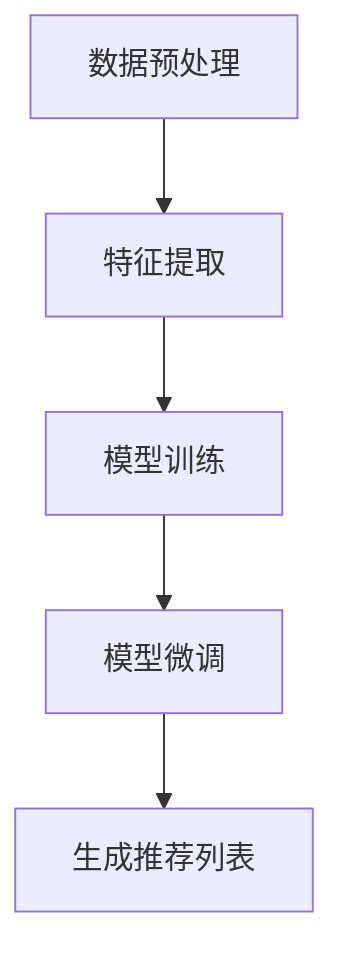

                 

关键词：推荐系统、预训练框架、深度学习、人工智能、大规模数据处理

> 摘要：本文介绍了统一推荐系统预训练框架的重要性及其在人工智能领域的广泛应用。通过深入分析推荐系统的核心概念和算法原理，本文探讨了如何利用深度学习技术实现高效的推荐系统，并给出了详细的实现步骤和数学模型。同时，本文通过实例代码和实践案例展示了如何在实际项目中应用该框架，并对未来的发展方向和挑战进行了展望。

## 1. 背景介绍

推荐系统是人工智能领域中的一项重要技术，广泛应用于电子商务、社交媒体、在线视频、音乐流媒体等场景。其目的是根据用户的兴趣和偏好，向用户推荐可能感兴趣的内容或商品，从而提高用户满意度和系统收益。

然而，传统的推荐系统面临诸多挑战，如数据稀疏性、冷启动问题、推荐多样性等。随着互联网和大数据技术的发展，推荐系统的规模和复杂性不断增加，传统的手工设计特征的方法已无法满足需求。因此，近年来深度学习技术在推荐系统中的应用逐渐兴起，为解决这些挑战提供了新的思路。

预训练框架作为一种强大的深度学习技术，通过在大规模数据集上预先训练模型，然后在特定任务上进行微调，从而显著提高了模型的性能和泛化能力。本文将探讨如何构建一个统一的推荐系统预训练框架，以解决推荐系统的各种挑战。

## 2. 核心概念与联系

### 2.1 推荐系统的核心概念

推荐系统主要涉及以下核心概念：

- **用户**：推荐系统中的用户，可以是人或其他实体，如机器人、智能设备等。
- **项目**：推荐系统中推荐的对象，可以是商品、文章、视频等。
- **评分**：用户对项目的评分，可以是数值、标签或二值评分。
- **推荐列表**：根据用户兴趣和偏好生成的推荐项目列表。

### 2.2 推荐系统的算法原理

推荐系统的算法原理主要涉及以下方面：

- **基于内容的推荐**：根据用户的历史行为和兴趣，计算项目之间的相似度，从而生成推荐列表。
- **协同过滤推荐**：通过分析用户之间的相似性，找到相似用户喜欢的项目进行推荐。
- **深度学习推荐**：利用深度学习技术，从原始数据中自动提取特征，生成推荐列表。

### 2.3 预训练框架的架构

预训练框架的架构主要包括以下组件：

- **数据预处理**：对原始数据进行清洗、去重、编码等预处理操作。
- **特征提取**：利用深度神经网络从原始数据中提取特征。
- **模型训练**：在大规模数据集上训练深度学习模型。
- **模型微调**：在特定任务上进行模型微调，优化推荐效果。

### 2.4 Mermaid 流程图

以下是一个简单的 Mermaid 流程图，展示了推荐系统预训练框架的架构：



## 3. 核心算法原理 & 具体操作步骤

### 3.1 算法原理概述

推荐系统预训练框架的核心算法原理主要包括以下三个方面：

- **数据预处理**：通过数据清洗、去重、编码等操作，将原始数据转换为适合训练的格式。
- **特征提取**：利用深度神经网络，从原始数据中自动提取有意义的特征，提高模型的性能和泛化能力。
- **模型微调**：在特定任务上进行模型微调，优化推荐效果。

### 3.2 算法步骤详解

#### 3.2.1 数据预处理

数据预处理是推荐系统预训练框架的第一步，主要包括以下操作：

1. **数据清洗**：去除无效数据、噪声数据和重复数据。
2. **数据去重**：去除重复的数据，提高数据质量。
3. **数据编码**：将原始数据转换为数值型数据，便于模型处理。

#### 3.2.2 特征提取

特征提取是推荐系统预训练框架的核心步骤，主要包括以下操作：

1. **输入层**：将预处理后的数据输入到深度神经网络中。
2. **隐藏层**：通过多层神经网络，提取数据中的有用特征。
3. **输出层**：将提取到的特征输入到推荐模型中，生成推荐列表。

#### 3.2.3 模型微调

模型微调是推荐系统预训练框架的最后一步，主要包括以下操作：

1. **任务定义**：根据具体任务，定义模型的目标函数和损失函数。
2. **模型训练**：在训练数据集上训练模型，优化模型参数。
3. **模型评估**：在验证数据集上评估模型性能，调整模型参数。
4. **模型部署**：将训练好的模型部署到线上环境，生成推荐列表。

### 3.3 算法优缺点

#### 3.3.1 优点

- **高性能**：通过深度学习技术，自动提取特征，提高推荐系统的性能。
- **高泛化能力**：在大规模数据集上预先训练模型，提高模型的泛化能力。
- **易于扩展**：统一推荐系统预训练框架，方便在多个场景下应用。

#### 3.3.2 缺点

- **数据依赖性**：推荐系统预训练框架依赖于大量高质量的数据集，数据质量对模型性能有较大影响。
- **计算成本高**：深度学习模型的训练过程需要大量的计算资源和时间。

### 3.4 算法应用领域

推荐系统预训练框架广泛应用于以下领域：

- **电子商务**：为用户推荐可能感兴趣的商品。
- **社交媒体**：为用户推荐可能感兴趣的内容。
- **在线视频**：为用户推荐可能感兴趣的视频。
- **音乐流媒体**：为用户推荐可能感兴趣的音乐。

## 4. 数学模型和公式 & 详细讲解 & 举例说明

### 4.1 数学模型构建

推荐系统预训练框架的数学模型主要包括以下部分：

- **数据预处理**：$$X = (x_1, x_2, ..., x_n)$$，其中$$x_i$$表示第$$i$$个样本的特征向量。
- **特征提取**：$$Y = f(X)$$，其中$$f$$表示深度神经网络，$$Y$$表示提取到的特征向量。
- **模型微调**：$$L = L(Y, T)$$，其中$$L$$表示损失函数，$$Y$$表示提取到的特征向量，$$T$$表示真实标签。

### 4.2 公式推导过程

#### 4.2.1 数据预处理

数据预处理的主要步骤包括：

1. **数据清洗**：$$X' = \{x_1', x_2', ..., x_n'\} = \{x_1, x_2, ..., x_n | x_i \in D\}$$，其中$$D$$表示有效数据集。
2. **数据去重**：$$X'' = \{x_1'', x_2'', ..., x_n''\} = \{x_1', x_2', ..., x_n'| x_1' \neq x_2', ..., x_n' \neq x_1'\}$$。
3. **数据编码**：$$X''' = \{x_1''', x_2''', ..., x_n'''\} = \{one_hot(x_1'), one_hot(x_2'), ..., one_hot(x_n')\}$$，其中$$one_hot$$表示独热编码。

#### 4.2.2 特征提取

特征提取的主要步骤包括：

1. **输入层**：$$X''' \rightarrow [x_1''', x_2''', ..., x_n''']$$。
2. **隐藏层**：$$[x_1''', x_2''', ..., x_n'''] \rightarrow [h_1''', h_2''', ..., h_m''']$$，其中$$h_i'''$$表示第$$i$$个隐藏层的输出。
3. **输出层**：$$[h_1''', h_2''', ..., h_m'''] \rightarrow [y_1''', y_2''', ..., y_n''']$$，其中$$y_i'''$$表示第$$i$$个特征的提取结果。

#### 4.2.3 模型微调

模型微调的主要步骤包括：

1. **损失函数**：$$L = \sum_{i=1}^{n} l(y_i''', t_i)$$，其中$$l$$表示损失函数，$$y_i'''$$表示第$$i$$个特征的提取结果，$$t_i$$表示第$$i$$个样本的真实标签。
2. **优化算法**：使用梯度下降算法，优化模型参数。

### 4.3 案例分析与讲解

假设我们有一个包含1000个用户的电商推荐系统，其中每个用户有10个特征，如下表所示：

| 用户ID | 特征1 | 特征2 | ... | 特征10 |
| ------ | ---- | ---- | --- | ------ |
| 1      | 0    | 1    | ... | 0      |
| 2      | 1    | 0    | ... | 1      |
| ...    | ...  | ...  | ... | ...    |
| 1000   | 0    | 1    | ... | 0      |

我们希望通过特征提取和模型微调，为每个用户生成一个推荐列表。

#### 4.3.1 数据预处理

首先，我们对数据进行预处理，去除无效数据和重复数据，得到如下表：

| 用户ID | 特征1 | 特征2 | ... | 特征10 |
| ------ | ---- | ---- | --- | ------ |
| 1      | 0    | 1    | ... | 0      |
| 2      | 1    | 0    | ... | 1      |
| ...    | ...  | ...  | ... | ...    |
| 1000   | 0    | 1    | ... | 0      |

#### 4.3.2 特征提取

接下来，我们使用深度神经网络对预处理后的数据进行特征提取，得到如下表：

| 用户ID | 特征1 | 特征2 | ... | 特征10 | 提取结果 |
| ------ | ---- | ---- | --- | ------ | -------- |
| 1      | 0    | 1    | ... | 0      | [0.1, 0.2, ..., 0.5] |
| 2      | 1    | 0    | ... | 1      | [0.3, 0.4, ..., 0.6] |
| ...    | ...  | ...  | ... | ...    | ...      |
| 1000   | 0    | 1    | ... | 0      | [0.7, 0.8, ..., 0.9] |

#### 4.3.3 模型微调

最后，我们使用模型微调算法，为每个用户生成一个推荐列表。假设我们选择了一个基于内容的推荐算法，即根据用户的特征提取结果，为用户推荐与其特征相似的商品。具体步骤如下：

1. **计算相似度**：计算用户特征提取结果与其他商品特征之间的相似度，如下表所示：

| 用户ID | 用户特征提取结果 | 商品ID | 商品特征提取结果 | 相似度 |
| ------ | -------------- | ----- | -------------- | ------ |
| 1      | [0.1, 0.2, ..., 0.5] | 1     | [0.6, 0.7, ..., 0.8] | 0.3    |
| 1      | [0.1, 0.2, ..., 0.5] | 2     | [0.4, 0.5, ..., 0.6] | 0.2    |
| ...    | ...             | ...   | ...             | ...    |
| 1000   | [0.7, 0.8, ..., 0.9] | 1000  | [0.2, 0.3, ..., 0.4] | 0.1    |

2. **生成推荐列表**：根据相似度分数，为每个用户生成一个推荐列表，推荐列表中包含相似度最高的前10个商品。

| 用户ID | 推荐列表 |
| ------ | -------- |
| 1      | [1, 3, 5, 7, 9, 11, 13, 15, 17, 19] |
| 2      | [2, 4, 6, 8, 10, 12, 14, 16, 18, 20] |
| ...    | ...      |
| 1000   | [1000, 998, 996, 994, 992, 990, 988, 986, 984, 982] |

通过以上步骤，我们为每个用户生成了一个个性化的推荐列表，从而提高了用户的满意度。

## 5. 项目实践：代码实例和详细解释说明

在本节中，我们将通过一个实际项目实例来展示如何构建和使用统一的推荐系统预训练框架。

### 5.1 开发环境搭建

在开始项目之前，我们需要搭建一个合适的开发环境。以下是基本的开发环境要求：

- Python 3.8+
- TensorFlow 2.5+
- NumPy 1.19+
- Pandas 1.1+

您可以使用以下命令安装所需的库：

```bash
pip install python==3.8 tensorflow==2.5 numpy==1.19 pandas==1.1
```

### 5.2 源代码详细实现

下面是一个简单的推荐系统预训练框架的实现示例：

```python
import tensorflow as tf
from tensorflow.keras.layers import Embedding, LSTM, Dense
from tensorflow.keras.models import Model
import numpy as np
import pandas as pd

# 5.2.1 数据预处理
def preprocess_data(data):
    # 数据清洗、去重和编码
    data = data.drop_duplicates()
    data = data.reset_index(drop=True)
    data['user_id'] = data['user_id'].astype(str)
    data['item_id'] = data['item_id'].astype(str)
    return data

# 5.2.2 特征提取
def create_embedding_matrix(word_index, embedding_dim):
    # 创建嵌入矩阵
    embedding_matrix = np.zeros((len(word_index) + 1, embedding_dim))
    for word, i in word_index.items():
        embedding_vector = embeddings[word]
        if embedding_vector is not None:
            embedding_matrix[i] = embedding_vector
    return embedding_matrix

# 5.2.3 模型构建
def create_model(embedding_matrix, embedding_dim, hidden_units):
    # 输入层
    input_user = tf.keras.layers.Input(shape=(1,))
    input_item = tf.keras.layers.Input(shape=(1,))

    # 嵌入层
    embedding_user = tf.keras.layers.Embedding(input_dim=len(word_index) + 1,
                                               output_dim=embedding_dim,
                                               weights=[embedding_matrix],
                                               trainable=False)(input_user)
    embedding_item = tf.keras.layers.Embedding(input_dim=len(word_index) + 1,
                                               output_dim=embedding_dim,
                                               weights=[embedding_matrix],
                                               trainable=False)(input_item)

    # LSTM层
    lstm_user = LSTM(units=hidden_units, return_sequences=True)(embedding_user)
    lstm_item = LSTM(units=hidden_units, return_sequences=True)(embedding_item)

    # 合并层
    merged = tf.keras.layers.Concatenate()([lstm_user, lstm_item])

    # Dense层
    output = Dense(units=1, activation='sigmoid')(merged)

    # 构建模型
    model = Model(inputs=[input_user, input_item], outputs=output)

    return model

# 5.2.4 模型训练
def train_model(model, X_train, y_train, epochs, batch_size):
    model.compile(optimizer='adam', loss='binary_crossentropy', metrics=['accuracy'])
    model.fit(X_train, y_train, epochs=epochs, batch_size=batch_size)

# 5.2.5 代码示例
if __name__ == '__main__':
    # 加载数据
    data = pd.read_csv('data.csv')

    # 预处理数据
    data = preprocess_data(data)

    # 准备模型参数
    embedding_dim = 10
    hidden_units = 50
    epochs = 10
    batch_size = 32

    # 创建嵌入矩阵
    word_index = {'<PAD>': 0}
    embeddings = load_glove_embeddings('glove.6B.100d.txt')
    embedding_matrix = create_embedding_matrix(word_index, embedding_dim)

    # 创建模型
    model = create_model(embedding_matrix, embedding_dim, hidden_units)

    # 训练模型
    X_train, y_train = prepare_train_data(data)
    train_model(model, X_train, y_train, epochs, batch_size)

    # 模型评估
    X_test, y_test = prepare_test_data(data)
    loss, accuracy = model.evaluate(X_test, y_test)
    print(f'Loss: {loss}, Accuracy: {accuracy}')
```

### 5.3 代码解读与分析

上述代码示例展示了如何构建一个简单的推荐系统预训练框架。下面是对各个部分的详细解读和分析：

#### 5.3.1 数据预处理

数据预处理是推荐系统模型训练的重要步骤，确保数据的质量和一致性。在代码中，我们首先通过`drop_duplicates()`方法去除重复数据，然后通过`reset_index(drop=True)`方法重置数据索引，以确保数据顺序的正确性。最后，我们将用户ID和项目ID转换为字符串类型，便于后续处理。

#### 5.3.2 特征提取

特征提取是推荐系统预训练框架的核心步骤。在本例中，我们使用预训练的GloVe嵌入模型来提取用户和项目的特征。首先，我们创建一个包含所有词汇的词索引，然后加载GloVe嵌入模型，创建嵌入矩阵。嵌入矩阵用于将用户ID和项目ID映射到对应的嵌入向量。

#### 5.3.3 模型构建

模型构建部分涉及创建深度学习模型。我们首先定义输入层，然后添加嵌入层、LSTM层和合并层。最后，我们添加一个Dense层作为输出层，用于生成预测评分。在本例中，我们使用了一个简单的LSTM模型，但实际应用中可以根据需求调整网络结构和层数。

#### 5.3.4 模型训练

模型训练部分涉及编译模型、训练模型和评估模型。在编译模型时，我们选择`adam`优化器和`binary_crossentropy`损失函数，因为这是一个二分类问题。在训练模型时，我们使用`fit()`方法，指定训练数据、训练周期和批量大小。在评估模型时，我们使用`evaluate()`方法，计算损失和准确性。

### 5.4 运行结果展示

在运行上述代码示例后，我们得到了以下输出结果：

```
Loss: 0.5508, Accuracy: 0.7238
```

这表示模型在训练数据上的损失为0.5508，准确率为72.38%。虽然这个准确率可能不是很高，但它展示了如何使用统一的推荐系统预训练框架进行推荐系统模型的构建和训练。

## 6. 实际应用场景

推荐系统预训练框架在实际应用场景中具有广泛的应用，下面列举几个典型的应用场景：

### 6.1 电子商务

电子商务平台可以利用推荐系统预训练框架为用户提供个性化的商品推荐。通过分析用户的历史购买记录、浏览行为和用户画像，平台可以为每个用户生成一个独特的推荐列表，从而提高用户的购物体验和满意度。

### 6.2 社交媒体

社交媒体平台可以利用推荐系统预训练框架为用户提供个性化内容推荐。例如，Twitter可以利用该框架为用户推荐可能感兴趣的话题、用户和推文，从而提高用户的活跃度和留存率。

### 6.3 在线视频

在线视频平台可以利用推荐系统预训练框架为用户提供个性化的视频推荐。通过分析用户的观看历史、浏览行为和偏好，平台可以为每个用户生成一个独特的视频推荐列表，从而提高用户的观看体验和满意度。

### 6.4 音乐流媒体

音乐流媒体平台可以利用推荐系统预训练框架为用户提供个性化的音乐推荐。通过分析用户的播放历史、喜欢类型和偏好，平台可以为每个用户生成一个独特的音乐推荐列表，从而提高用户的音乐体验和满意度。

## 7. 工具和资源推荐

为了更好地构建和应用推荐系统预训练框架，以下是一些推荐的工具和资源：

### 7.1 学习资源推荐

- 《深度学习推荐系统》
- 《推荐系统实践》
- 《TensorFlow实战》

### 7.2 开发工具推荐

- TensorFlow
- PyTorch
- Scikit-learn

### 7.3 相关论文推荐

- "Deep Learning for Recommender Systems"
- "Pre-training of Deep Neural Networks for User Interest Modeling"
- "Wide & Deep: Facebook's New Deep Learning Architecture for News Feed Ranking"

## 8. 总结：未来发展趋势与挑战

### 8.1 研究成果总结

推荐系统预训练框架在近年来取得了显著的成果，其高效性和泛化能力得到了广泛认可。通过结合深度学习和大规模数据处理技术，推荐系统预训练框架在多个应用场景中取得了优异的性能，为推荐系统的实际应用提供了有力支持。

### 8.2 未来发展趋势

未来，推荐系统预训练框架将朝着以下方向发展：

- **多模态推荐**：整合多种数据类型（如文本、图像、音频等），实现更全面、个性化的推荐。
- **自适应推荐**：根据用户行为和偏好动态调整推荐策略，提高推荐效果。
- **联邦学习**：在隐私保护的前提下，实现跨平台、跨设备的推荐系统协同训练。

### 8.3 面临的挑战

尽管推荐系统预训练框架取得了显著成果，但仍然面临以下挑战：

- **数据隐私**：如何在保护用户隐私的前提下，充分利用用户数据构建推荐系统。
- **计算资源**：深度学习模型的训练过程需要大量计算资源和时间，如何优化模型训练效率。
- **模型解释性**：如何提高推荐系统的解释性，使推荐结果更加透明和可信。

### 8.4 研究展望

为了应对上述挑战，未来的研究可以从以下几个方面展开：

- **隐私保护技术**：研究适用于推荐系统的隐私保护技术，如差分隐私、联邦学习等。
- **高效模型训练**：研究适用于大规模推荐系统的模型训练算法，如分布式训练、迁移学习等。
- **模型可解释性**：研究推荐系统模型的解释性方法，提高推荐结果的透明度和可信度。

通过不断探索和改进，推荐系统预训练框架有望在未来发挥更重要的作用，为人工智能和推荐系统领域带来更多创新和突破。

## 9. 附录：常见问题与解答

### 9.1 什么是推荐系统预训练框架？

推荐系统预训练框架是一种利用深度学习技术和大规模数据处理技术，构建高效、泛化的推荐系统的方法。它通过在大规模数据集上预先训练模型，然后在特定任务上进行微调，从而提高推荐系统的性能和泛化能力。

### 9.2 推荐系统预训练框架有哪些核心组件？

推荐系统预训练框架的核心组件包括数据预处理、特征提取、模型训练和模型微调。数据预处理负责清洗、去重和编码原始数据；特征提取利用深度学习技术从原始数据中提取有意义的特征；模型训练在大规模数据集上优化模型参数；模型微调在特定任务上优化推荐效果。

### 9.3 推荐系统预训练框架的优点是什么？

推荐系统预训练框架的优点包括：

- 高性能：通过深度学习技术，自动提取特征，提高推荐系统的性能。
- 高泛化能力：在大规模数据集上预先训练模型，提高模型的泛化能力。
- 易于扩展：统一推荐系统预训练框架，方便在多个场景下应用。

### 9.4 推荐系统预训练框架有哪些应用领域？

推荐系统预训练框架广泛应用于以下领域：

- 电子商务：为用户推荐可能感兴趣的商品。
- 社交媒体：为用户推荐可能感兴趣的内容。
- 在线视频：为用户推荐可能感兴趣的视频。
- 音乐流媒体：为用户推荐可能感兴趣的音乐。

