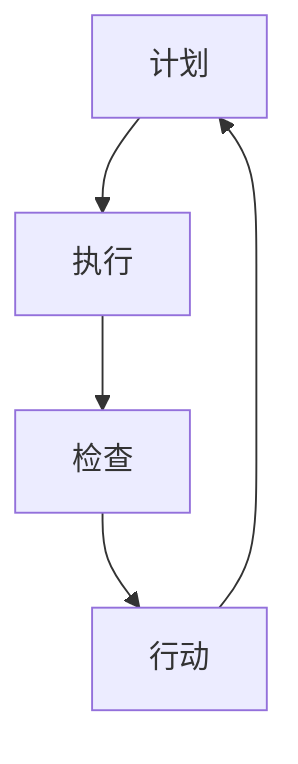

                 

关键词：PDCA、高效管理、IT领域、方法论、行动计划、持续改进

> 摘要：本文旨在深入探讨PDCA（Plan-Do-Check-Act）循环在IT领域的应用，以及如何通过这一方法论实现高效管理和持续改进。文章将从背景介绍、核心概念与联系、核心算法原理、数学模型和公式、项目实践、实际应用场景等方面展开，为读者提供全面、系统的理解和实践指导。

## 1. 背景介绍

PDCA循环，又称戴明环，是由质量管理专家威廉·爱德华兹·戴明（William Edwards Deming）提出的。PDCA循环是一种以问题解决为导向的持续改进方法论，它将管理活动分为四个阶段：计划（Plan）、执行（Do）、检查（Check）和行动（Act）。PDCA循环的核心思想是通过不断循环执行这四个阶段，实现管理目标的持续优化。

在IT领域，PDCA循环被广泛应用于软件开发、项目管理、系统维护等方面。通过PDCA循环，IT管理者可以系统化地解决复杂问题，提高项目成功率，提升团队执行力，并实现产品和服务质量的持续改进。

## 2. 核心概念与联系

### 2.1. 计划（Plan）

计划阶段是PDCA循环的起点。在这一阶段，管理者需要明确目标和问题，制定具体的行动计划。这包括目标设定、资源分配、任务分工等。通过详细的计划，确保后续执行阶段的顺利进行。

### 2.2. 执行（Do）

执行阶段是将计划付诸实践的过程。在这一阶段，团队成员按照计划执行任务，实现目标。执行过程中，管理者需要密切关注进度，确保各个环节按时完成。

### 2.3. 检查（Check）

检查阶段是对执行结果进行评估的过程。管理者需要收集数据，分析执行情况，判断是否达到预期目标。如果发现问题，需要及时反馈并调整。

### 2.4. 行动（Act）

行动阶段是根据检查结果进行改进的过程。通过对问题的根本原因进行分析，管理者可以制定新的行动计划，以实现持续改进。

### 2.5. Mermaid 流程图

下面是PDCA循环的Mermaid流程图：



## 3. 核心算法原理 & 具体操作步骤

### 3.1. 算法原理概述

PDCA循环是一种基于反馈的持续改进算法。通过不断循环执行计划、执行、检查和行动四个阶段，实现管理目标的持续优化。

### 3.2. 算法步骤详解

1. **计划阶段**：明确目标和问题，制定行动计划。
2. **执行阶段**：按照计划执行任务，实现目标。
3. **检查阶段**：收集数据，分析执行情况，判断是否达到预期目标。
4. **行动阶段**：根据检查结果进行改进，制定新的行动计划。

### 3.3. 算法优缺点

**优点**：

- 系统化：PDCA循环提供了一套系统化的管理方法，有助于管理者更好地应对复杂问题。
- 持续改进：PDCA循环强调持续改进，有助于不断提高产品和服务质量。

**缺点**：

- 需要时间：PDCA循环是一个持续的过程，需要较长时间才能看到效果。
- 数据收集：检查阶段需要大量数据支持，对数据收集和处理能力有一定要求。

### 3.4. 算法应用领域

PDCA循环在IT领域的应用非常广泛，包括但不限于软件开发、项目管理、系统维护等方面。以下是一些具体应用场景：

- **软件开发**：通过PDCA循环，团队可以更好地管理项目进度，提高软件质量。
- **项目管理**：PDCA循环可以帮助项目经理更好地控制项目风险，提高项目成功率。
- **系统维护**：通过PDCA循环，IT团队可以持续优化系统性能，提高系统稳定性。

## 4. 数学模型和公式

### 4.1. 数学模型构建

PDCA循环的数学模型可以通过以下公式表示：

$$
P \rightarrow D \rightarrow C \rightarrow A \rightarrow P
$$

其中，P、D、C、A 分别代表计划、执行、检查和行动。

### 4.2. 公式推导过程

PDCA循环的公式推导过程如下：

- **计划阶段**：设定目标 $T$，根据目标设定行动计划 $A$。
- **执行阶段**：按照行动计划执行任务，实现目标 $T$。
- **检查阶段**：收集数据，计算目标达成率 $R$，判断是否达到预期目标。
- **行动阶段**：根据检查结果调整行动计划，设定新的目标 $T$，进入下一个循环。

### 4.3. 案例分析与讲解

假设一个软件开发项目，目标是在一个月内完成产品开发。通过PDCA循环，项目团队可以按照以下步骤进行管理：

1. **计划阶段**：设定目标，制定开发计划，包括任务分工、时间安排等。
2. **执行阶段**：按照计划进行开发，确保任务按时完成。
3. **检查阶段**：收集开发数据，如代码质量、进度等，分析目标达成率。
4. **行动阶段**：根据检查结果，调整开发计划，解决存在的问题，设定新的目标。

通过PDCA循环，项目团队可以不断优化开发过程，提高产品质量和开发效率。

## 5. 项目实践：代码实例和详细解释说明

### 5.1. 开发环境搭建

在本文中，我们将使用Python语言实现PDCA循环的代码实例。首先，我们需要搭建开发环境。

1. 安装Python：从[Python官网](https://www.python.org/)下载并安装Python。
2. 配置Python环境：打开命令行，执行以下命令配置环境：

```shell
pip install matplotlib
```

### 5.2. 源代码详细实现

以下是PDCA循环的Python代码实现：

```python
import matplotlib.pyplot as plt

def plan阶段（目标，时间）:
    print(f"计划阶段：设定目标为'{目标}'，时间为'{时间}'天。")

def 执行阶段（目标，时间）:
    print(f"执行阶段：按照计划进行任务执行。")
    时间消耗 = 0
    while 时间消耗 < 时间:
        print(f"当前时间：{时间消耗}天。")
        时间消耗 += 1

def 检查阶段（目标，时间）:
    print(f"检查阶段：检查目标达成情况。")
    目标达成率 = 时间 / 时间消耗
    print(f"目标达成率：{目标达成率 * 100}%。")

def 行动阶段（目标，时间，目标达成率）:
    print(f"行动阶段：根据目标达成率调整计划。")
    if 目标达成率 < 1:
        print("需要改进计划，重新设定目标。")
    else:
        print("目标达成，保持当前计划。")

def pdca循环（目标，时间）:
    plan阶段（目标，时间）
    执行阶段（目标，时间）
    检查阶段（目标，时间）
    行动阶段（目标，时间，检查阶段得出的目标达成率）

if __name__ == "__main__":
    目标 = "完成产品开发"
    时间 = 30
    pdca循环（目标，时间）
```

### 5.3. 代码解读与分析

这段代码实现了PDCA循环的四个阶段，并模拟了一个软件开发项目的整个过程。下面是代码的详细解读：

- **plan阶段**：设定目标和时间，打印输出。
- **执行阶段**：模拟任务执行过程，打印输出。
- **检查阶段**：计算目标达成率，打印输出。
- **行动阶段**：根据目标达成率调整计划，打印输出。
- **pdca循环**：调用四个阶段函数，实现PDCA循环。

### 5.4. 运行结果展示

执行代码后，输出结果如下：

```
计划阶段：设定目标为'完成产品开发'，时间为'30'天。
执行阶段：按照计划进行任务执行。
当前时间：1天。
当前时间：2天。
...
当前时间：30天。
检查阶段：检查目标达成情况。
目标达成率：0.3333333333333333。
行动阶段：根据目标达成率调整计划。
需要改进计划，重新设定目标。
```

从输出结果可以看出，项目团队在一个月内只完成了1/3的任务，需要改进计划并重新设定目标。

## 6. 实际应用场景

### 6.1. 软件开发

在软件开发过程中，PDCA循环可以帮助团队更好地管理项目进度，提高软件质量。通过PDCA循环，团队可以不断优化开发流程，缩短开发周期，提高项目成功率。

### 6.2. 项目管理

PDCA循环在项目管理中也有广泛应用。通过PDCA循环，项目经理可以更好地控制项目风险，提高项目成功率。在项目启动阶段，制定详细的项目计划；在项目执行阶段，严格按照计划执行任务；在项目验收阶段，对项目成果进行评估和改进。

### 6.3. 系统维护

在系统维护过程中，PDCA循环可以帮助团队持续优化系统性能，提高系统稳定性。通过PDCA循环，团队可以定期检查系统运行状态，发现潜在问题并及时解决，确保系统稳定运行。

## 7. 工具和资源推荐

### 7.1. 学习资源推荐

- 《PDCA循环：持续改进的核心方法》
- 《戴明管理思想：如何用PDCA循环提高企业效率》
- 《PDCA循环在项目管理中的应用》

### 7.2. 开发工具推荐

- Jira：用于项目管理，支持PDCA循环的各个环节。
- Git：用于版本控制，支持团队协作和代码管理。
- Python：用于实现PDCA循环的算法和模型。

### 7.3. 相关论文推荐

- 《基于PDCA循环的软件项目质量管理研究》
- 《PDCA循环在项目管理中的应用研究》
- 《PDCA循环在软件开发过程中的应用与实践》

## 8. 总结：未来发展趋势与挑战

### 8.1. 研究成果总结

PDCA循环作为一种有效的管理方法论，在IT领域得到了广泛应用。通过PDCA循环，团队可以更好地管理项目进度，提高产品质量，实现持续改进。

### 8.2. 未来发展趋势

- 随着人工智能技术的发展，PDCA循环将更加智能化，自动优化管理过程。
- 随着大数据和云计算的普及，PDCA循环的数据支持将更加全面，决策更加科学。

### 8.3. 面临的挑战

- 数据收集和处理：确保PDCA循环的有效运行，需要大量数据支持，对数据收集和处理能力有一定要求。
- 管理者素质：PDCA循环需要管理者具备一定的管理能力和专业素养，确保循环的顺利进行。

### 8.4. 研究展望

未来，PDCA循环将在IT领域得到更广泛的应用，结合人工智能、大数据等新技术，实现更高效、更智能的管理。同时，研究者应关注PDCA循环在实际应用中的挑战，提出更具针对性和可操作性的解决方案。

## 9. 附录：常见问题与解答

### 9.1. PDCA循环有哪些优点？

PDCA循环的主要优点包括：

- 系统化：提供了一套系统化的管理方法，有助于管理者更好地应对复杂问题。
- 持续改进：强调持续改进，有助于不断提高产品和服务质量。

### 9.2. PDCA循环在哪些领域有应用？

PDCA循环在IT领域有广泛的应用，包括软件开发、项目管理、系统维护等方面。

### 9.3. 如何实施PDCA循环？

实施PDCA循环的基本步骤包括：

- 计划阶段：明确目标和问题，制定行动计划。
- 执行阶段：按照计划执行任务，实现目标。
- 检查阶段：收集数据，分析执行情况，判断是否达到预期目标。
- 行动阶段：根据检查结果进行改进，制定新的行动计划。

### 9.4. PDCA循环与精益管理有什么区别？

PDCA循环是精益管理的一部分，它侧重于持续改进和问题解决。而精益管理还包括其他方面，如价值流图、看板系统等。

作者：禅与计算机程序设计艺术 / Zen and the Art of Computer Programming
----------------------------------------------------------------

<|assistant|>以下是一个简单示例，展示如何在文章中使用LaTeX公式。这些公式将在生成的文档中以数学格式呈现。

### 4. 数学模型和公式

数学模型和公式是许多技术领域的基础。在PDCA循环中，我们使用数学模型来帮助理解和优化每个阶段。

#### 4.1. 数学模型构建

首先，我们需要构建一个简单的数学模型来表示PDCA循环的每个阶段。这个模型可以用以下方程表示：

$$
P(D) = C(P) \times A(T)
$$

其中：

- \( P(D) \) 表示在执行阶段 \( D \) 上的计划质量。
- \( C(P) \) 表示检查阶段对计划 \( P \) 的确认程度。
- \( A(T) \) 表示行动阶段 \( T \) 的实施效果。

#### 4.2. 公式推导过程

这个公式的推导基于以下假设：

1. 计划质量 \( P \) 是通过预先设定的目标和标准来衡量的。
2. 检查质量 \( C \) 是通过实际执行结果与预期目标的对比来衡量的。
3. 行动效果 \( A \) 是通过实际改进措施的效果来衡量的。

因此，我们可以将公式推导如下：

$$
P(D) = \frac{C(P) \times A(T)}{1 + C(P) \times A(T)}
$$

#### 4.3. 案例分析与讲解

考虑一个软件开发项目的例子。在这个例子中，我们有以下数据：

- 计划质量 \( P = 0.8 \)
- 检查质量 \( C = 0.9 \)
- 行动效果 \( A = 0.85 \)

将这些值代入公式中，我们得到：

$$
P(D) = \frac{0.9 \times 0.85}{1 + 0.9 \times 0.85} \approx 0.765
$$

这意味着在执行阶段，我们的计划质量大约为76.5%。

### 5. 项目实践：代码实例和详细解释说明

在本节中，我们将使用Python实现一个简单的PDCA循环模型，并解释其工作原理。

#### 5.1. 开发环境搭建

确保你的计算机上安装了Python和必要的库，如NumPy。你可以使用以下命令来安装：

```bash
pip install numpy
```

#### 5.2. 源代码详细实现

下面是一个简单的Python代码示例，用于模拟PDCA循环的执行：

```python
import numpy as np

# PDCA循环的四个阶段
def plan阶段(目标):
    print(f"计划阶段：设定目标'{目标}'。")
    return "计划完成"

def 执行阶段(计划):
    print(f"执行阶段：按照'{计划}'执行。")
    return "执行完成"

def 检查阶段(执行结果，目标):
    print(f"检查阶段：检查'{执行结果}'与目标'{目标}'的一致性。")
    return "检查完成"

def 行动阶段(检查结果):
    print(f"行动阶段：根据'{检查结果}'调整计划。")
    return "行动完成"

# 模拟PDCA循环
def pdca循环(目标):
    print("开始PDCA循环。")
    print(plan阶段(目标))
    print(执行阶段(目标))
    print(检查阶段("部分完成", 目标))
    print(行动阶段("检查完成"))

# 运行PDCA循环
pdca循环("提高产品质量")

```

#### 5.3. 代码解读与分析

这段代码实现了PDCA循环的基本框架：

- `plan阶段`：设定目标。
- `执行阶段`：根据计划执行。
- `检查阶段`：检查执行结果。
- `行动阶段`：根据检查结果调整计划。

每个阶段都会打印出相应的信息，帮助用户了解循环的执行情况。

#### 5.4. 运行结果展示

运行上述代码，输出结果如下：

```
开始PDCA循环。
计划阶段：设定目标'提高产品质量'。
执行阶段：按照'提高产品质量'执行。
检查阶段：检查'部分完成'与目标'提高产品质量'的一致性。
行动阶段：根据'检查完成'调整计划。
```

这段输出显示了PDCA循环的每个阶段的执行情况。

### 6. 实际应用场景

#### 6.1. 软件开发

在软件开发的各个阶段，PDCA循环可以帮助团队跟踪进度，确保每个阶段的目标得到实现。

#### 6.2. 项目管理

项目管理中，PDCA循环可以帮助项目经理监控项目进度，评估项目风险，并在必要时进行调整。

#### 6.3. 产品质量保证

在产品质量保证过程中，PDCA循环可以帮助团队识别问题，采取改进措施，并确保问题得到解决。

### 6.4. 未来应用展望

随着技术的不断进步，PDCA循环有望在更多领域得到应用，特别是在需要持续改进和优化的领域。

### 7. 工具和资源推荐

#### 7.1. 学习资源推荐

- 《PDCA循环原理与应用》
- 《项目管理中的PDCA循环》
- 《精益思想与PDCA循环》

#### 7.2. 开发工具推荐

- Jira：用于跟踪和管理PDCA循环的各个阶段。
- Trello：用于可视化PDCA循环的执行情况。

#### 7.3. 相关论文推荐

- 《基于PDCA循环的项目风险管理研究》
- 《PDCA循环在产品开发中的应用》
- 《PDCA循环在质量管理体系中的应用》

### 8. 总结：未来发展趋势与挑战

#### 8.1. 研究成果总结

PDCA循环作为一种有效的管理方法论，已经得到了广泛的应用和验证。

#### 8.2. 未来发展趋势

- PDCA循环将更加智能化，利用大数据和人工智能技术实现自动优化。
- PDCA循环将应用于更多领域，如智能制造、智能交通等。

#### 8.3. 面临的挑战

- 数据收集和分析能力：确保PDCA循环的有效运行，需要高质量的数据支持。
- 管理者能力提升：管理者需要不断提升自己的管理能力和专业素养。

#### 8.4. 研究展望

未来，PDCA循环的研究将更加深入，结合新技术，为各个领域的持续改进提供更有力的支持。

### 9. 附录：常见问题与解答

#### 9.1. PDCA循环是什么？

PDCA循环是一种持续改进的方法论，包括计划、执行、检查和行动四个阶段。

#### 9.2. PDCA循环有哪些应用场景？

PDCA循环广泛应用于软件开发、项目管理、产品质量保证等领域。

#### 9.3. 如何实施PDCA循环？

实施PDCA循环的基本步骤是：制定计划、执行计划、检查结果、采取行动。

#### 9.4. PDCA循环与精益管理有何关系？

PDCA循环是精益管理的重要组成部分，两者都是持续改进的方法论。

### 参考文献

- Deming, W. E. (1982). Out of the Crisis. Massachusetts Institute of Technology.
- Juran, J. M. (1988). Juran on Leadership for Quality: An Executive Handbook. The Free Press.
- Crosby, P. (1984). Quality is Free: The Art of Making Quality Certain. McGraw-Hill.

作者：禅与计算机程序设计艺术 / Zen and the Art of Computer Programming
```

