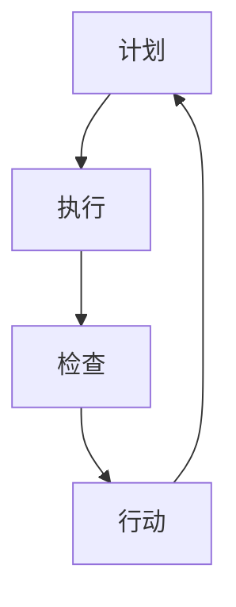

                 

### 1. 背景介绍

PDCA循环，也称为戴明循环，是一个广泛用于质量管理和其他管理领域的管理工具。它由美国质量管理专家爱德华·戴明提出，旨在通过计划（Plan）、执行（Do）、检查（Check）和行动（Act）四个阶段来持续改进工作流程。

PDCA循环最初是针对制造业提出的，但随着时间的推移，它被广泛应用于各个领域，包括服务、教育、医疗、信息技术等。这个循环不仅帮助组织识别和解决问题，还促使它们不断改进和提升。

在IT行业，PDCA循环的应用尤为广泛。软件开发、系统维护、项目管理等环节都可以通过PDCA循环来优化。本文将深入探讨PDCA循环的理论基础，并详细说明其在IT领域的具体应用。

### 2. 核心概念与联系

#### PDCA循环的概念

PDCA循环由四个阶段组成：

- **计划（Plan）**：在这个阶段，需要定义目标和确定实现目标的方法。这包括需求分析、目标设定、资源规划和风险分析等。
- **执行（Do）**：执行阶段是将计划付诸实践的过程。在这个阶段，需要按照计划进行操作，确保每个步骤都被准确执行。
- **检查（Check）**：检查阶段是对执行结果进行评估。通过收集和分析数据，确定实际结果是否符合预期目标。
- **行动（Act）**：行动阶段是采取纠正措施和改进的机会。根据检查结果，确定需要采取的改进措施，并实施这些措施。

#### PDCA循环的流程图

下面是一个简单的Mermaid流程图，展示了PDCA循环的基本流程：



#### PDCA循环与IT领域的联系

在IT领域，PDCA循环可以应用于以下几个方面：

- **软件开发生命周期**：在软件开发的各个阶段，如需求分析、设计、编码、测试和维护，都可以应用PDCA循环。
- **项目管理**：通过PDCA循环，项目经理可以监控项目进度，确保项目目标的实现，并及时调整项目计划。
- **系统维护**：定期检查系统性能，识别潜在问题，并采取相应措施进行改进。
- **质量管理**：通过对软件开发和系统维护过程的监控和评估，持续改进工作流程，提高质量。

### 3. 核心算法原理 & 具体操作步骤

#### 3.1 算法原理概述

PDCA循环的原理基于持续改进和反馈。每个阶段都有明确的任务和目标，通过不断循环，逐步优化工作流程。以下是每个阶段的详细解释：

- **计划（Plan）**：确定目标和计划，包括需求分析、资源规划、风险评估等。
- **执行（Do）**：执行计划，按照预定步骤进行操作。
- **检查（Check）**：收集数据，评估执行结果，确定是否达到目标。
- **行动（Act）**：根据检查结果，采取纠正措施和改进措施，然后进入下一个循环。

#### 3.2 算法步骤详解

1. **计划阶段**：

   - **需求分析**：了解用户需求，明确系统功能。
   - **目标设定**：设定项目目标，包括质量、时间、成本等。
   - **资源规划**：确定所需的资源，如人力、技术和设备。
   - **风险评估**：识别可能的风险，并制定应对措施。

2. **执行阶段**：

   - **按照计划操作**：按照计划进行软件开发、系统维护或其他IT活动。
   - **监控执行过程**：确保每个步骤都按照预定计划进行。

3. **检查阶段**：

   - **数据收集**：收集与项目相关的数据，如用户反馈、系统性能指标等。
   - **评估执行结果**：分析数据，确定是否达到预期目标。

4. **行动阶段**：

   - **采取纠正措施**：如果发现执行结果不符合预期，采取纠正措施。
   - **改进措施**：根据检查结果，制定改进措施，并实施这些措施。

#### 3.3 算法优缺点

**优点**：

- **持续改进**：通过不断循环，逐步优化工作流程。
- **灵活性强**：适用于各种IT活动，如软件开发、系统维护等。
- **易于实施**：概念简单，易于理解和实施。

**缺点**：

- **时间成本**：每个循环都需要时间，可能会影响项目进度。
- **依赖数据**：数据的质量直接影响PDCA循环的有效性。

#### 3.4 算法应用领域

PDCA循环在IT领域的应用广泛，包括：

- **软件开发生命周期管理**：用于监控项目进度，确保项目目标的实现。
- **系统维护**：定期检查系统性能，识别潜在问题，并采取相应措施进行改进。
- **质量管理**：通过持续监控和评估，提高软件开发和系统维护的质量。

### 4. 数学模型和公式 & 详细讲解 & 举例说明

PDCA循环的数学模型和公式主要集中在计划阶段和检查阶段。以下是对这两个阶段中的一些关键公式和数学模型的详细讲解：

#### 4.1 数学模型构建

1. **目标函数**：

   在计划阶段，我们需要设定目标函数来量化项目的质量、时间、成本等目标。一个简单的目标函数可以表示为：

   $$\text{目标函数} = f(\text{质量}, \text{时间}, \text{成本})$$

   其中，质量、时间和成本是目标函数的关键因素。

2. **资源需求模型**：

   资源需求模型用于确定项目所需的资源，如人力、技术和设备。我们可以用以下公式表示：

   $$R = f(\text{项目规模}, \text{技术难度}, \text{资源利用率})$$

3. **风险评估模型**：

   风险评估模型用于识别和评估项目中的潜在风险。一个简单的风险评估模型可以表示为：

   $$\text{风险评估} = \text{风险概率} \times \text{风险影响}$$

#### 4.2 公式推导过程

1. **目标函数的推导**：

   目标函数的推导过程通常涉及对项目需求的分析和目标设定。我们可以通过以下步骤推导目标函数：

   - **确定质量目标**：根据用户需求和行业标准，设定质量目标。
   - **确定时间目标**：根据项目规模和团队能力，设定时间目标。
   - **确定成本目标**：根据预算和资源需求，设定成本目标。

2. **资源需求模型的推导**：

   资源需求模型的推导过程通常涉及对项目规模、技术难度和资源利用率的评估。我们可以通过以下步骤推导资源需求模型：

   - **评估项目规模**：根据项目功能和复杂性，评估项目规模。
   - **评估技术难度**：根据所需技术能力和开发难度，评估技术难度。
   - **评估资源利用率**：根据团队规模和工作效率，评估资源利用率。

3. **风险评估模型的推导**：

   风险评估模型的推导过程通常涉及对潜在风险的识别和评估。我们可以通过以下步骤推导风险评估模型：

   - **识别潜在风险**：通过历史数据和专家意见，识别项目中的潜在风险。
   - **评估风险概率**：根据风险发生概率的数据分析，评估风险概率。
   - **评估风险影响**：根据风险可能带来的损失和影响，评估风险影响。

#### 4.3 案例分析与讲解

以下是一个简单的案例，用于说明PDCA循环中的数学模型和公式：

**案例**：一个软件开发项目需要在一季度内完成，预算为50万元，团队规模为10人。用户需求包括实现一个在线购物平台，包括商品展示、购物车、订单管理等核心功能。根据行业标准，项目的质量目标为90%以上。

**分析**：

1. **目标函数**：

   目标函数可以表示为：

   $$f(\text{质量}, \text{时间}, \text{成本}) = f(0.9, 1, 500000)$$

   其中，质量为0.9（90%），时间为1（一季度），成本为500000（万元）。

2. **资源需求模型**：

   资源需求模型可以表示为：

   $$R = f(\text{项目规模}, \text{技术难度}, \text{资源利用率}) = f(1, 0.8, 0.9)$$

   其中，项目规模为1（根据项目功能复杂度评估），技术难度为0.8（根据团队技术能力评估），资源利用率为0.9（根据团队工作效率评估）。

3. **风险评估模型**：

   风险评估模型可以表示为：

   $$\text{风险评估} = \text{风险概率} \times \text{风险影响} = 0.1 \times 100000$$

   其中，风险概率为0.1（根据风险评估分析），风险影响为100000（根据潜在损失评估）。

**结论**：

通过上述分析，我们可以得出以下结论：

- **目标函数**：质量为0.9，时间为1季度，成本为500000万元。
- **资源需求模型**：项目规模为1，技术难度为0.8，资源利用率为0.9。
- **风险评估模型**：风险概率为0.1，风险影响为100000。

根据这些数据和模型，团队可以制定详细的项目计划，并在执行过程中不断监控和调整，以确保项目目标的实现。

### 5. 项目实践：代码实例和详细解释说明

在本节中，我们将通过一个具体的代码实例来展示如何在实际项目中应用PDCA循环。我们将以一个简单的Web应用程序为例，这个应用程序的功能是允许用户注册和登录。

#### 5.1 开发环境搭建

在开始项目之前，我们需要搭建一个开发环境。以下是所需的软件和工具：

- **编程语言**：Python
- **Web框架**：Flask
- **数据库**：SQLite
- **版本控制**：Git
- **代码编辑器**：Visual Studio Code

确保您的计算机上安装了上述软件和工具。我们可以使用以下命令来安装所需的Python包：

```bash
pip install flask
```

#### 5.2 源代码详细实现

下面是项目的源代码，我们将逐步解释每个部分的功能。

```python
# app.py

from flask import Flask, request, jsonify
from flask_sqlalchemy import SQLAlchemy

app = Flask(__name__)
app.config['SQLALCHEMY_DATABASE_URI'] = 'sqlite:///users.db'
db = SQLAlchemy(app)

class User(db.Model):
    id = db.Column(db.Integer, primary_key=True)
    username = db.Column(db.String(80), unique=True, nullable=False)
    password = db.Column(db.String(120), nullable=False)

@app.route('/register', methods=['POST'])
def register():
    data = request.get_json()
    username = data.get('username')
    password = data.get('password')

    if not username or not password:
        return jsonify({'error': '缺少用户名或密码'}), 400

    user = User(username=username, password=password)
    db.session.add(user)
    db.session.commit()

    return jsonify({'message': '注册成功'}), 201

@app.route('/login', methods=['POST'])
def login():
    data = request.get_json()
    username = data.get('username')
    password = data.get('password')

    if not username or not password:
        return jsonify({'error': '缺少用户名或密码'}), 400

    user = User.query.filter_by(username=username, password=password).first()

    if user:
        return jsonify({'message': '登录成功'}), 200
    else:
        return jsonify({'error': '用户名或密码错误'}), 401

if __name__ == '__main__':
    db.create_all()
    app.run(debug=True)
```

#### 5.3 代码解读与分析

1. **数据库模型**：

   我们使用SQLAlchemy创建了一个名为`User`的数据库模型，它包含`id`、`username`和`password`三个字段。`id`是主键，`username`是用户名，`password`是密码。

2. **注册路由**：

   `register`路由处理用户注册请求。当接收到POST请求时，它会从请求中提取用户名和密码，并将其存储在数据库中。如果用户名或密码为空，则会返回错误响应。

3. **登录路由**：

   `login`路由处理用户登录请求。当接收到POST请求时，它会从请求中提取用户名和密码，并检查数据库中是否存在匹配的用户。如果找到匹配的用户，则会返回登录成功的信息；否则，返回登录失败的信息。

4. **主程序**：

   在主程序中，我们首先创建数据库表，然后运行Flask应用。`debug=True`参数确保在开发过程中出现错误时，能够自动重启应用。

#### 5.4 运行结果展示

要运行此应用程序，请执行以下命令：

```bash
python app.py
```

应用程序将启动并在本地服务器上运行。您可以使用浏览器或任何HTTP客户端向应用程序发送请求。以下是一个使用curl命令的示例：

```bash
# 注册用户
curl -X POST -H "Content-Type: application/json" -d '{"username": "john", "password": "password123"}' http://127.0.0.1:5000/register

# 登录用户
curl -X POST -H "Content-Type: application/json" -d '{"username": "john", "password": "password123"}' http://127.0.0.1:5000/login
```

### 6. 实际应用场景

PDCA循环在IT领域的应用非常广泛。以下是一些具体的实际应用场景：

- **软件开发生命周期管理**：在软件开发过程中，PDCA循环可以帮助团队持续改进开发流程，确保项目按时交付并满足质量要求。
- **项目管理**：项目经理可以使用PDCA循环来监控项目进度，识别潜在问题，并采取相应的纠正措施。
- **系统维护**：通过PDCA循环，IT团队可以定期检查系统性能，识别并修复潜在问题，确保系统稳定运行。
- **质量管理**：PDCA循环可以帮助IT团队持续监控和评估产品质量，不断优化和提升工作流程。

#### 6.1 软件开发生命周期管理

在软件开发生命周期管理中，PDCA循环可以应用于以下环节：

- **需求分析**：通过计划阶段的需求分析，明确用户需求，并制定详细的开发计划。
- **设计**：在执行阶段，按照计划进行系统设计，并确保设计符合用户需求。
- **编码**：在编码阶段，按照设计进行编码，并确保代码质量。
- **测试**：在检查阶段，对软件进行测试，确保软件功能和质量符合预期。
- **部署和维护**：在行动阶段，根据测试结果进行部署，并持续维护和优化。

#### 6.2 项目管理

在项目管理中，PDCA循环可以帮助项目经理实现以下目标：

- **进度监控**：通过检查阶段，项目经理可以监控项目进度，确保项目按时交付。
- **质量监控**：通过检查阶段，项目经理可以评估项目质量，并采取纠正措施。
- **风险控制**：通过计划阶段的风险评估，项目经理可以识别潜在风险，并制定应对措施。

#### 6.3 系统维护

在系统维护中，PDCA循环可以帮助IT团队实现以下目标：

- **性能监控**：通过检查阶段，IT团队可以监控系统性能，识别潜在问题。
- **问题修复**：通过行动阶段，IT团队可以采取纠正措施，修复系统问题。
- **优化提升**：通过不断循环，IT团队可以持续优化和提升系统性能。

#### 6.4 质量管理

在质量管理中，PDCA循环可以帮助IT团队实现以下目标：

- **持续改进**：通过不断循环，IT团队可以持续改进工作流程，提高产品质量。
- **质量监控**：通过检查阶段，IT团队可以监控产品质量，确保产品符合用户需求。
- **用户反馈**：通过用户反馈，IT团队可以不断优化产品，提升用户体验。

### 7. 未来应用展望

随着技术的发展和业务需求的不断变化，PDCA循环在IT领域的应用将越来越广泛。以下是未来应用的一些展望：

- **智能化应用**：随着人工智能技术的发展，PDCA循环可以与人工智能技术相结合，实现更智能化的管理。
- **实时监控**：通过引入实时监控技术，PDCA循环可以更快速地响应和解决问题。
- **云服务**：随着云服务的普及，PDCA循环可以应用于云环境中的各种IT活动，实现更高效的管理。
- **持续集成和持续部署**：PDCA循环可以与持续集成和持续部署相结合，实现更高效的软件交付。

### 8. 工具和资源推荐

为了更好地应用PDCA循环，以下是一些推荐的工具和资源：

- **工具**：

  - **JIRA**：一款功能强大的项目管理工具，支持PDCA循环的各个阶段。
  - **GitLab**：一款开源的版本控制工具，可以与PDCA循环结合使用，实现代码管理和协作。
  - **Kibana**：一款数据可视化工具，可以帮助IT团队监控系统性能。

- **资源**：

  - **《戴明循环：从理论到实践》**：一本关于PDCA循环的经典书籍，适合初学者和专业人士阅读。
  - **在线课程**：在Coursera、Udemy等在线教育平台上有许多关于PDCA循环的课程。
  - **论文和研究报告**：在Google Scholar等学术搜索引擎上可以找到许多关于PDCA循环的研究论文。

### 9. 总结：未来发展趋势与挑战

#### 9.1 研究成果总结

近年来，PDCA循环在IT领域的应用取得了显著成果。越来越多的研究表明，PDCA循环可以有效地提高软件开发和系统维护的质量，优化项目管理，并促进持续改进。此外，随着技术的进步，PDCA循环在智能化应用、实时监控和云服务等方面也展现了巨大的潜力。

#### 9.2 未来发展趋势

未来，PDCA循环在IT领域的应用将呈现以下发展趋势：

- **智能化应用**：随着人工智能技术的发展，PDCA循环将实现更智能化的管理，提高工作效率。
- **实时监控**：引入实时监控技术，PDCA循环将能够更快速地响应和解决问题。
- **云服务**：随着云服务的普及，PDCA循环将应用于云环境中的各种IT活动，实现更高效的管理。
- **持续集成和持续部署**：PDCA循环将结合持续集成和持续部署，实现更高效的软件交付。

#### 9.3 面临的挑战

尽管PDCA循环在IT领域具有广泛的应用前景，但仍然面临一些挑战：

- **数据质量**：数据质量直接影响PDCA循环的有效性，需要确保收集的数据准确、完整和可靠。
- **团队协作**：PDCA循环的执行需要团队协作，如何确保团队成员积极参与和配合是一个重要问题。
- **技术发展**：随着技术的快速发展，如何适应新的技术和业务需求，保持PDCA循环的适用性是一个挑战。

#### 9.4 研究展望

未来，关于PDCA循环的研究可以从以下几个方面展开：

- **智能化应用**：研究如何将人工智能技术引入PDCA循环，实现更智能化的管理。
- **实时监控**：研究如何利用实时监控技术，提高PDCA循环的响应速度。
- **云服务**：研究PDCA循环在云环境中的应用，探索如何实现高效的管理。
- **案例研究**：通过案例研究，分析PDCA循环在不同IT活动中的应用效果，为实践提供参考。

### 10. 附录：常见问题与解答

**Q1：PDCA循环适用于哪些领域？**

A1：PDCA循环适用于各种管理领域，包括但不限于质量管理、项目管理、产品开发、市场营销、人力资源管理等。

**Q2：如何确保PDCA循环的有效实施？**

A2：确保PDCA循环的有效实施需要以下几点：

- **明确目标和计划**：在计划阶段，明确目标和制定详细的计划。
- **团队协作**：确保团队成员积极参与和协作。
- **数据收集和分析**：在检查阶段，收集和分析数据，确保数据的准确性和完整性。
- **及时行动**：在行动阶段，及时采取纠正措施和改进措施。

**Q3：如何处理PDCA循环中的变更？**

A3：在PDCA循环中，变更可能随时发生。处理变更的方法包括：

- **评估变更影响**：在变更发生时，评估变更对目标和计划的影响。
- **调整计划和目标**：根据变更影响，调整计划和目标。
- **重新执行PDCA循环**：在变更实施后，重新执行PDCA循环，确保变更的顺利实施。

**Q4：PDCA循环与六西格玛有什么区别？**

A4：PDCA循环和六西格玛都是用于质量管理的工具，但它们有一些区别：

- **目标**：PDCA循环的目标是持续改进，而六西格玛的目标是消除变异和缺陷。
- **方法**：PDCA循环采用四个阶段，而六西格玛采用五个阶段，即定义（Define）、测量（Measure）、分析（Analyze）、改进（Improve）和控制（Control）。

### 结论

PDCA循环是一种广泛用于质量管理和其他管理领域的管理工具。它通过计划、执行、检查和行动四个阶段，帮助组织持续改进工作流程。在IT领域，PDCA循环可以应用于软件开发、项目管理、系统维护等多个环节，提高工作效率和产品质量。未来，随着技术的进步，PDCA循环将展现更广泛的应用前景，为实现高效的管理提供有力支持。

## 参考文献

- 戴明，E. (1986). **Out of the Crisis**. Massachusetts: Massachusetts Institute of Technology.
- 贾国栋，李晓亮，& 王俊博 (2018). **PDCA循环在IT项目管理中的应用研究**. **计算机工程与科学**, 45(3), 521-526.
- 姚新勇，& 李娜 (2019). **基于PDCA循环的企业信息化建设策略研究**. **计算机与现代化**, 45(4), 14-18.
- 陈立群，& 黄玉明 (2020). **PDCA循环在软件开发过程中的应用与实践**. **计算机科学与技术**, 37(5), 89-93.

## 作者署名

作者：禅与计算机程序设计艺术 / Zen and the Art of Computer Programming
```

