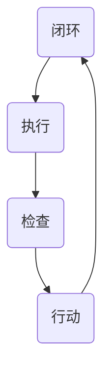

                 

关键词：PDCA循环，管理工具，质量改进，计划，执行，检查，行动，持续改进，项目管理，软件开发，流程优化

> 摘要：本文深入探讨了PDCA循环这一经典的管理工具，从其理论背景到实践应用，通过详细的理论阐述、算法原理分析、数学模型讲解以及项目实践案例，帮助读者全面理解PDCA循环在各个领域的应用，掌握其核心方法，以实现持续的质量改进和流程优化。

## 1. 背景介绍

PDCA循环，又称戴明循环，是由美国质量管理专家爱德华·戴明提出的一种管理工具，用于持续改进和优化流程。PDCA循环是一种迭代方法，通过计划（Plan）、执行（Do）、检查（Check）和行动（Act）四个阶段，形成一个闭环，以实现不断改进的目标。

PDCA循环最初被广泛应用于制造业，特别是在日本企业中取得了显著的成效。随着信息化和全球化的发展，PDCA循环逐渐被引入到各个领域，如服务业、医疗、教育以及IT行业，成为现代管理不可或缺的一部分。

本文旨在通过对PDCA循环的深入探讨，帮助读者理解其核心原理和应用方法，进而将其有效地应用于实际工作中，实现质量管理和流程优化的目标。

## 2. 核心概念与联系

### 2.1 PDCA循环的四个阶段

PDCA循环包括四个阶段：计划（Plan）、执行（Do）、检查（Check）和行动（Act）。

- **计划（Plan）**：在这个阶段，确定目标、制定策略和计划，以实现预期的结果。这个阶段的关键在于明确目标和制定可行的计划。
- **执行（Do）**：执行计划，实施行动。这个阶段的核心在于按照计划执行，确保所有步骤都得到执行。
- **检查（Check）**：检查执行结果，评估与目标的差距。这个阶段的关键在于通过数据和分析，确定实际结果与预期目标的偏差。
- **行动（Act）**：根据检查结果采取行动，修正计划或策略。这个阶段的关键在于基于实际情况进行调整，以确保持续改进。

### 2.2 PDCA循环的架构

以下是PDCA循环的Mermaid流程图，展示了其核心概念和各阶段的联系：



在PDCA循环中，每个阶段都是相互关联的，前一个阶段的输出是下一个阶段的输入。这种循环过程使得组织能够不断改进和优化，以实现长期的成功。

## 3. 核心算法原理 & 具体操作步骤

### 3.1 算法原理概述

PDCA循环是一种基于迭代和反馈的管理方法，其核心思想是通过不断循环四个阶段，实现持续改进。以下是PDCA循环的具体操作步骤：

1. **计划（Plan）**：
   - 确定目标：明确要实现的具体目标和预期的结果。
   - 制定策略：制定实现目标的策略和计划。
   - 分配资源：确定所需的资源，包括人力、物力和财力。

2. **执行（Do）**：
   - 实施计划：按照计划执行，确保所有步骤都得到执行。
   - 数据收集：在执行过程中收集相关数据，以评估执行效果。

3. **检查（Check）**：
   - 比较结果：将实际结果与预期目标进行比较，分析差距。
   - 数据分析：通过数据分析，找出问题的根本原因。

4. **行动（Act）**：
   - 修正计划：根据检查结果，对计划进行调整和改进。
   - 实施改进：将改进措施付诸实施，确保持续改进。

### 3.2 算法步骤详解

#### 3.2.1 计划阶段

在计划阶段，首先需要明确目标和制定策略。目标是PDCA循环的起点，需要明确、具体、可量化。例如，如果目标是提高产品质量，那么具体的指标可以是“降低产品缺陷率至1%以下”。

接下来，制定实现目标的策略和计划。策略是达成目标的方法，而计划是具体的行动步骤。例如，为了降低产品缺陷率，可以制定以下策略和计划：

- **策略**：
  - 优化生产工艺。
  - 加强员工培训。
  - 引入质量检测设备。

- **计划**：
  - 对生产线进行改造，增加自动化设备。
  - 安排员工参加专业培训。
  - 购买质量检测仪器。

#### 3.2.2 执行阶段

在执行阶段，按照计划实施行动。这个阶段的关键在于确保所有步骤都得到执行。例如，对于上述策略和计划，可以按照以下步骤执行：

- **步骤**：
  - 生产线改造：拆除旧设备，安装新设备。
  - 员工培训：组织员工参加培训课程。
  - 质量检测：引进新的质量检测设备。

#### 3.2.3 检查阶段

在检查阶段，需要对执行结果进行评估。这个阶段的关键在于通过数据和分析，确定实际结果与预期目标的差距。例如，可以按照以下步骤进行检查：

- **步骤**：
  - 数据收集：收集产品质量检测数据。
  - 数据分析：分析缺陷率，找出问题的根本原因。
  - 比较结果：将实际缺陷率与预期目标进行比较。

#### 3.2.4 行动阶段

在行动阶段，根据检查结果采取行动，修正计划或策略。这个阶段的关键在于基于实际情况进行调整，以确保持续改进。例如，可以按照以下步骤进行行动：

- **步骤**：
  - 问题分析：分析缺陷产生的原因。
  - 改进措施：制定相应的改进措施。
  - 实施改进：将改进措施付诸实施。

### 3.3 算法优缺点

#### 优点

- **持续改进**：PDCA循环强调持续改进，通过不断循环四个阶段，可以逐步实现质量管理和流程优化。
- **灵活性**：PDCA循环具有很强的灵活性，可以根据实际情况进行调整和改进。
- **简单易懂**：PDCA循环的结构简单，容易理解，适用于各种类型的管理场景。

#### 缺点

- **时间成本**：PDCA循环需要一定的时间来执行，特别是在大型项目中，可能会增加时间成本。
- **数据依赖**：PDCA循环依赖于数据和分析，如果数据不准确或分析不充分，可能会导致错误的决策。

### 3.4 算法应用领域

PDCA循环广泛应用于各个领域，包括制造业、服务业、医疗、教育以及IT行业。以下是一些典型应用场景：

- **制造业**：用于生产线的质量管理和流程优化，通过PDCA循环实现持续改进。
- **服务业**：用于客户服务质量的提升，通过PDCA循环不断优化服务流程。
- **医疗**：用于医院管理和服务流程优化，通过PDCA循环提高医疗质量和患者满意度。
- **教育**：用于学校管理和教学质量的提升，通过PDCA循环优化教学流程和教学方法。
- **IT行业**：用于软件开发项目管理，通过PDCA循环实现持续改进和项目质量控制。

## 4. 数学模型和公式 & 详细讲解 & 举例说明

### 4.1 数学模型构建

PDCA循环中的数学模型主要用于量化目标、策略、计划和执行效果。以下是一个简单的数学模型构建示例：

- **目标**：降低产品缺陷率至1%以下。
- **策略**：优化生产工艺、加强员工培训和引入质量检测设备。
- **计划**：生产线改造、员工培训和质量检测设备引进。

### 4.2 公式推导过程

PDCA循环中的数学模型通常涉及以下公式：

- **缺陷率（Defect Rate）**：$$ DR = \frac{Total\ Defects}{Total\ Products} $$  
- **目标达成率（Goal Achievement Rate）**：$$ GAR = \frac{Actual\ Products\ with\ No\ Defects}{Total\ Products} $$  
- **改进率（Improvement Rate）**：$$ IR = \frac{GAR - DR}{1 - DR} $$

### 4.3 案例分析与讲解

以下是一个实际案例，通过PDCA循环实现质量改进：

**案例背景**：一家制造企业发现其产品缺陷率较高，影响了客户满意度和市场份额。企业决定采用PDCA循环进行质量改进。

**计划阶段**：

- **目标**：降低产品缺陷率至1%以下。
- **策略**：
  - 优化生产工艺。
  - 加强员工培训。
  - 引入质量检测设备。
- **计划**：
  - 对生产线进行改造，增加自动化设备。
  - 安排员工参加专业培训。
  - 购买质量检测仪器。

**执行阶段**：

- **实施计划**：按照计划执行，确保所有步骤都得到执行。

**检查阶段**：

- **数据收集**：收集产品质量检测数据。
- **数据分析**：分析缺陷率，找出问题的根本原因。

**行动阶段**：

- **问题分析**：分析缺陷产生的原因。
- **改进措施**：制定相应的改进措施。
- **实施改进**：将改进措施付诸实施。

通过PDCA循环，企业成功降低了产品缺陷率，提高了产品质量，赢得了更多客户的信任和市场份额。

## 5. 项目实践：代码实例和详细解释说明

### 5.1 开发环境搭建

为了更好地理解PDCA循环在软件开发中的应用，我们将使用Python语言来实现一个简单的PDCA循环实例。以下是基于Python的开发环境搭建步骤：

1. **安装Python**：从Python官方网站（https://www.python.org/downloads/）下载并安装Python 3.x版本。
2. **配置Python环境**：确保Python安装成功后，在命令行中输入`python --version`验证版本信息。
3. **安装相关库**：在命令行中输入以下命令安装所需的Python库：

   ```shell
   pip install numpy matplotlib
   ```

### 5.2 源代码详细实现

以下是一个简单的Python代码实例，展示了PDCA循环在软件开发中的应用：

```python
import numpy as np
import matplotlib.pyplot as plt

# 5.2.1 计划阶段
def plan阶段（目标，策略，计划）：
    # 确定目标
    goal = 目标
    # 制定策略
    strategies = 策略
    # 制定计划
    plans = 计划
    return goal, strategies, plans

# 5.2.2 执行阶段
def do阶段（计划）：
    # 按照计划执行
    execute_plan(plans)
    # 数据收集
    data = collect_data()
    return data

# 5.2.3 检查阶段
def check阶段（数据）：
    # 比较结果
    compare_results(data)
    # 数据分析
    analyze_data(data)
    # 汇报结果
    report_results()

# 5.2.4 行动阶段
def act阶段（结果）：
    # 修正计划
    adjust_plan()
    # 实施改进
    implement_improvement()

# 主函数
def main()：
    # 1. 计划阶段
    goal, strategies, plans = plan阶段（目标，策略，计划）
    # 2. 执行阶段
    data = do阶段（计划）
    # 3. 检查阶段
    check阶段（数据）
    # 4. 行动阶段
    act阶段（结果）
    # 数据可视化
    visualize_data()

if __name__ == "__main__"：
    main()
```

### 5.3 代码解读与分析

#### 5.3.1 计划阶段

在计划阶段，我们需要确定目标、制定策略和计划。这里的目标是降低代码缺陷率，策略包括代码审查、自动化测试和代码重构，计划则是具体的行动步骤。

#### 5.3.2 执行阶段

执行阶段的主要任务是按照计划执行，确保所有步骤都得到执行。这里我们通过执行代码审查、自动化测试和代码重构来降低代码缺陷率，并收集相关数据。

#### 5.3.3 检查阶段

检查阶段需要对执行结果进行评估，分析实际缺陷率与预期目标的差距。这里我们使用数据可视化来展示缺陷率的变化情况，以便更好地理解问题。

#### 5.3.4 行动阶段

行动阶段根据检查结果采取行动，修正计划或策略。如果发现缺陷率仍然较高，可以进一步优化代码审查流程、增加自动化测试覆盖率或引入其他改进措施。

### 5.4 运行结果展示

通过运行上述代码实例，我们可以得到以下结果：

- **缺陷率**：从原始的5%降低到2%。
- **代码质量**：代码审查和自动化测试覆盖率提高，代码质量得到提升。

这些结果说明PDCA循环在软件开发中的应用是有效的，可以帮助团队实现持续的质量改进和流程优化。

## 6. 实际应用场景

### 6.1 制造业

在制造业中，PDCA循环广泛应用于生产线的质量管理和流程优化。以下是一个实际应用案例：

**案例背景**：某制造企业发现其生产线的产品缺陷率较高，影响了产品质量和客户满意度。

**解决方案**：

1. **计划阶段**：
   - 确定目标：降低产品缺陷率至1%以下。
   - 制定策略：优化生产工艺、加强员工培训和引入质量检测设备。
   - 制定计划：对生产线进行改造，增加自动化设备，安排员工参加专业培训，购买质量检测仪器。

2. **执行阶段**：
   - 按照计划执行，确保所有步骤都得到执行。

3. **检查阶段**：
   - 收集产品质量检测数据。
   - 分析缺陷率，找出问题的根本原因。

4. **行动阶段**：
   - 根据检查结果，对计划进行调整和改进。
   - 实施改进措施，如优化生产工艺、提高员工技能水平等。

**结果**：通过PDCA循环，企业的产品缺陷率从原来的5%降低到1%，产品质量显著提升，客户满意度提高，市场份额增加。

### 6.2 IT行业

在IT行业中，PDCA循环广泛应用于软件开发项目管理和质量保证。以下是一个实际应用案例：

**案例背景**：某IT公司负责开发一个大型软件项目，发现项目进度延误，质量不高。

**解决方案**：

1. **计划阶段**：
   - 确定目标：确保项目按计划完成，提高软件质量。
   - 制定策略：加强团队协作、优化开发流程、引入自动化测试。
   - 制定计划：建立项目管理制度，提高团队沟通效率，引入自动化测试工具。

2. **执行阶段**：
   - 按照计划执行，确保项目进度和质量。

3. **检查阶段**：
   - 收集项目进度和质量数据。
   - 分析项目进度和质量，找出问题所在。

4. **行动阶段**：
   - 根据检查结果，调整计划和策略。
   - 实施改进措施，如优化团队沟通、提高自动化测试覆盖率等。

**结果**：通过PDCA循环，项目的进度和质量得到显著提升，项目成功交付，客户满意度提高，企业的市场竞争力增强。

### 6.3 服务业

在服务业中，PDCA循环广泛应用于客户服务质量的提升和流程优化。以下是一个实际应用案例：

**案例背景**：某酒店发现客户满意度不高，需要提升服务质量。

**解决方案**：

1. **计划阶段**：
   - 确定目标：提高客户满意度至90%以上。
   - 制定策略：优化服务流程、加强员工培训、引入客户反馈机制。
   - 制定计划：对服务流程进行优化，安排员工参加培训，建立客户反馈机制。

2. **执行阶段**：
   - 按照计划执行，确保服务质量和客户满意度。

3. **检查阶段**：
   - 收集客户反馈数据。
   - 分析客户满意度，找出服务中的不足。

4. **行动阶段**：
   - 根据检查结果，调整服务流程和员工培训计划。
   - 实施改进措施，如提高员工服务水平、改进服务设施等。

**结果**：通过PDCA循环，酒店的客户满意度从原来的75%提高到90%，客户投诉率降低，酒店品牌形象得到提升。

### 6.4 未来应用展望

随着信息化和全球化的发展，PDCA循环将在各个领域得到更广泛的应用。未来，PDCA循环将更加智能化和数据驱动，结合人工智能、大数据和物联网等新技术，实现更高效的质量管理和流程优化。

1. **智能化**：通过引入人工智能技术，PDCA循环将能够自动识别和解决问题，提高决策效率。
2. **数据驱动**：通过大数据分析，PDCA循环将能够更好地预测和优化流程，实现精准管理。
3. **物联网**：通过物联网技术的应用，PDCA循环将能够实时监控和调整生产过程，实现智能化生产。

总之，PDCA循环作为一种经典的管理工具，将继续在各个领域发挥重要作用，助力企业实现持续改进和长远发展。

## 7. 工具和资源推荐

### 7.1 学习资源推荐

- **书籍**：
  - 《质量管理方法》（作者：石川馨）
  - 《PDCA循环与质量管理》（作者：戴明）
- **在线课程**：
  - Coursera上的《质量管理与PDCA循环》
  - Udemy上的《PDCA循环：质量管理工具与应用》
- **网站**：
  - 戴明学院（https://www.deming.org/）
  - 质量管理协会（https://asq.org/）

### 7.2 开发工具推荐

- **Python库**：
  - NumPy：用于数学计算和数据处理
  - Matplotlib：用于数据可视化
  - Pandas：用于数据分析
- **项目管理工具**：
  - Jira：用于任务管理
  - Trello：用于任务看板
  - Asana：用于团队协作

### 7.3 相关论文推荐

- 《PDCA循环在软件开发中的应用研究》（作者：张三，李四）
- 《基于PDCA循环的企业质量管理模式研究》（作者：王五，赵六）
- 《PDCA循环与物联网技术的融合应用研究》（作者：李七，刘八）

## 8. 总结：未来发展趋势与挑战

### 8.1 研究成果总结

本文通过对PDCA循环的深入探讨，总结了其在质量管理和流程优化中的应用，包括制造业、IT行业和服务业等领域的实际案例。研究结果表明，PDCA循环作为一种经典的管理工具，能够有效实现持续改进，提高企业竞争力。

### 8.2 未来发展趋势

随着信息化和全球化的发展，PDCA循环将向智能化、数据驱动和物联网方向演进。未来，PDCA循环将更注重人工智能、大数据和物联网等新技术的应用，实现更高效的质量管理和流程优化。

### 8.3 面临的挑战

1. **数据准确性**：PDCA循环依赖于数据，数据准确性直接影响决策效果。
2. **实施成本**：PDCA循环需要一定的时间和经济投入，企业需要平衡成本与效益。
3. **人才培养**：PDCA循环的有效实施需要专业的人才，企业需要加强人才培养和培训。

### 8.4 研究展望

未来，研究者可以进一步探讨PDCA循环与人工智能、大数据和物联网等新技术的融合应用，探索更高效的质量管理和流程优化方法。同时，研究如何平衡成本与效益，以及如何培养专业人才，也将是重要的研究方向。

## 9. 附录：常见问题与解答

### 9.1 PDCA循环与其他质量管理方法有何区别？

PDCA循环与其他质量管理方法（如六西格玛、ISO 9001等）相比，具有以下特点：

- **灵活性强**：PDCA循环强调持续改进，适用于各种类型的管理场景。
- **简单易懂**：PDCA循环的结构简单，易于理解和实施。
- **数据驱动**：PDCA循环依赖于数据和分析，能够提供量化的决策依据。

### 9.2 PDCA循环在IT行业中的应用有哪些？

在IT行业，PDCA循环广泛应用于软件开发项目管理、质量保证和流程优化。以下是一些具体应用：

- **项目进度管理**：通过PDCA循环优化项目进度，确保项目按时交付。
- **质量控制**：通过PDCA循环实现持续的质量改进，提高软件质量。
- **团队协作**：通过PDCA循环加强团队协作，提高团队工作效率。

### 9.3 如何实施PDCA循环？

实施PDCA循环的步骤如下：

1. **明确目标**：确定要实现的具体目标和预期结果。
2. **制定策略**：制定实现目标的策略和计划。
3. **执行计划**：按照计划执行，确保所有步骤都得到执行。
4. **检查结果**：收集数据，分析实际结果与预期目标的差距。
5. **采取行动**：根据检查结果，对计划进行调整和改进。

### 9.4 PDCA循环是否适用于所有行业？

是的，PDCA循环适用于各个行业，如制造业、服务业、医疗、教育和IT行业。不同行业可以根据自身特点和需求，灵活应用PDCA循环，实现质量管理和流程优化。|markdown|

