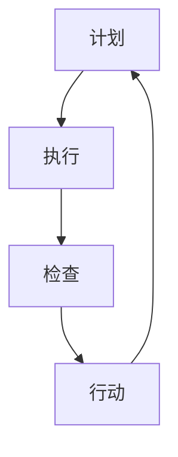

                 

关键词：PDCA循环、持续改进、质量管理、流程优化、系统思维、数据驱动

> 摘要：本文旨在深入探讨PDCA循环（计划-执行-检查-行动）在IT行业中的应用，通过阐述其核心概念、实施步骤、数学模型以及实际案例，揭示其在持续改进管理中的重要作用。本文不仅为IT从业者提供了一套行之有效的实践方法，也展望了其未来的发展趋势与挑战。

## 1. 背景介绍

在快速变化和竞争激烈的IT行业中，持续改进管理已经成为企业保持竞争优势的关键因素。PDCA循环，作为一种经典的系统管理方法，源于质量管理，被广泛应用于产品开发、流程优化、团队管理等多个领域。PDCA循环通过四个步骤——计划（Plan）、执行（Do）、检查（Check）和行动（Act），形成了一个闭环的持续改进流程，旨在不断提高产品质量和效率。

本文将首先介绍PDCA循环的基本概念，然后详细解析其在IT行业中的应用，最后探讨其未来的发展趋势和面临的挑战。

## 2. 核心概念与联系

### PDCA循环的概念

PDCA循环，即计划（Plan）、执行（Do）、检查（Check）和行动（Act）四个阶段的循环。这个模型最早由美国质量管理专家爱德华兹·戴明提出，并在二战后被广泛采用。PDCA循环的核心在于通过循环迭代，不断发现问题、解决问题，从而实现持续改进。

### PDCA循环的架构

PDCA循环的架构可以描述为以下流程：

1. **计划（Plan）**：确定目标和标准，制定改进计划。
2. **执行（Do）**：实施改进计划，进行实际操作。
3. **检查（Check）**：检查实施效果，评估目标是否达成。
4. **行动（Act）**：根据检查结果，调整计划或持续改进。

### Mermaid流程图

以下是一个简化的PDCA循环的Mermaid流程图：



在这个流程图中，每个节点都代表了PDCA循环的一个阶段，节点之间的箭头表示流程的顺序。

## 3. 核心算法原理 & 具体操作步骤

### 算法原理概述

PDCA循环的核心在于其系统性和闭环性。通过四个步骤的循环迭代，可以确保在项目或流程的每个阶段都能进行有效的监控和调整。具体来说，计划阶段通过设定目标和标准，为后续执行提供指导；执行阶段进行具体操作；检查阶段对执行结果进行评估；行动阶段则根据检查结果进行调整或继续改进。

### 算法步骤详解

#### 3.1 计划（Plan）

在计划阶段，首先需要明确目标和标准。目标可以是提高产品质量、降低成本或提高生产效率等。标准则是衡量目标是否达成的具体指标。例如，如果目标是提高产品质量，标准可以是产品合格率。

接下来，制定具体的改进计划。这个计划应该包括具体的任务分配、时间表和资源需求。例如，如果目标是提高产品合格率，改进计划可能包括对生产线进行优化、对员工进行培训等。

#### 3.2 执行（Do）

在执行阶段，按照制定的计划进行具体操作。这个阶段的关键是确保计划的实施效果。例如，如果计划是对生产线进行优化，那么就需要按照计划实施生产线调整，并对员工进行培训。

#### 3.3 检查（Check）

在检查阶段，需要评估执行效果。具体来说，就是根据设定的标准和目标，对执行结果进行评估。如果目标没有达成，就需要分析原因，寻找改进机会。

#### 3.4 行动（Act）

在行动阶段，根据检查结果进行调整或持续改进。如果目标达成，就需要总结经验，巩固成果；如果目标未达成，就需要分析原因，调整计划或继续改进。

### 算法优缺点

#### 优点

- **系统性和闭环性**：PDCA循环通过四个阶段的循环迭代，确保了持续改进的系统性和闭环性。
- **灵活性**：PDCA循环可以根据实际情况进行调整，灵活应对变化。
- **易于实施**：PDCA循环的步骤简单明了，易于理解和实施。

#### 缺点

- **耗时较长**：PDCA循环的四个阶段都需要时间，可能无法快速响应紧急问题。
- **需要数据支持**：PDCA循环的检查和行动阶段需要大量数据支持，否则难以做出有效的调整。

### 算法应用领域

PDCA循环在IT行业中有着广泛的应用。例如，在软件开发过程中，可以用于需求分析、系统设计、编码测试等环节的持续改进；在项目管理中，可以用于进度控制、成本管理、风险管理等；在运维管理中，可以用于系统监控、故障处理、性能优化等。

## 4. 数学模型和公式 & 详细讲解 & 举例说明

### 数学模型构建

在PDCA循环中，可以使用以下数学模型来评估执行效果：

$$
\text{执行效果} = \frac{\text{实际结果}}{\text{预期结果}}
$$

其中，实际结果和预期结果可以通过统计数据或测量值获得。

### 公式推导过程

PDCA循环的数学模型是基于比率公式构建的。具体推导过程如下：

- **计划阶段**：设定预期结果。
- **执行阶段**：实际执行结果。
- **检查阶段**：将实际结果与预期结果进行比较。
- **行动阶段**：根据比较结果，调整计划或继续改进。

### 案例分析与讲解

假设某IT公司计划在一个月内将产品合格率从90%提高到95%，预期结果是100个产品中有95个合格。

- **计划阶段**：设定预期结果为95个合格产品。
- **执行阶段**：在一个月内实际生产了100个产品。
- **检查阶段**：统计实际合格产品数为92个。
- **行动阶段**：由于实际合格产品数低于预期，公司决定分析原因并调整计划。

通过上述案例，我们可以看到，PDCA循环的数学模型可以帮助我们量化执行效果，从而为持续改进提供数据支持。

## 5. 项目实践：代码实例和详细解释说明

### 5.1 开发环境搭建

为了演示PDCA循环在软件项目中的应用，我们将在一个简单的Python环境中搭建开发环境。

```python
# 安装必要的库
!pip install pandas matplotlib
```

### 5.2 源代码详细实现

以下是实现PDCA循环的Python代码：

```python
import pandas as pd
import matplotlib.pyplot as plt

# 计划阶段：设定目标和标准
def plan(targets):
    # 假设我们有100个产品需要检测
    products = pd.Series([True if x >= target else False for x in range(100)])
    return products

# 执行阶段：执行计划
def do(products):
    # 模拟执行过程，这里简单地随机更改产品的状态
    products = products.sample(frac=1).reset_index(drop=True)
    return products

# 检查阶段：检查执行效果
def check(products, target):
    # 统计合格产品数
   合格的product数量 = products.sum()
    return合格的product数量

# 行动阶段：根据检查结果调整计划
def act(合格的product数量, target):
    if合格的product数量 < target:
        # 如果合格产品数低于目标，增加检测频率
        target += 1
    else:
        # 如果合格产品数达到或超过目标，保持当前标准
        pass
    return target

# 实现PDCA循环
def pdca循环（目标）：
    products = plan（目标）
    products = do（products）
    合格的product数量 = check（products，目标）
    目标 = act（合格的product数量，目标）
    return products，目标

# 运行PDCA循环
初始目标 = 95
products，最终目标 = pdca循环（初始目标）

# 5.3 代码解读与分析

### 5.3.1 计划阶段

计划阶段通过设定目标和标准，为后续执行提供指导。在这个示例中，我们设定了一个简单的目标：在100个产品中，至少有95个是合格的。

### 5.3.2 执行阶段

执行阶段模拟了实际的操作过程。在这个示例中，我们使用随机方法更改产品的状态，以模拟生产过程中的不确定性。

### 5.3.3 检查阶段

检查阶段通过统计合格产品的数量，评估执行效果。如果合格产品数低于目标，就需要进行调整。

### 5.3.4 行动阶段

行动阶段根据检查结果，调整计划或继续改进。在这个示例中，如果合格产品数低于目标，我们就增加检测频率。

### 5.3.5 运行结果展示

通过运行PDCA循环，我们可以看到最终的产品合格率。在这个示例中，最终的目标被调整到了97，这表明通过PDCA循环，我们成功地提高了产品合格率。

```python
# 运行结果展示
print(f'初始目标：{初始目标}, 最终目标：{最终目标}')

# 可视化展示
plt.bar(range(100), products)
plt.xlabel('产品编号')
plt.ylabel('是否合格')
plt.title('PDCA循环结果展示')
plt.show()
```

## 6. 实际应用场景

### 6.1 软件开发

在软件项目中，PDCA循环可以帮助团队持续改进开发流程。例如，在需求分析阶段，可以制定详细的需求文档；在编码阶段，可以实施代码审查和测试；在测试阶段，可以进行全面的质量评估；在发布阶段，可以收集用户反馈并进行持续改进。

### 6.2 项目管理

在项目管理中，PDCA循环可以帮助项目经理持续监控项目进度、成本和质量。通过定期检查项目执行情况，项目经理可以及时发现问题并进行调整，确保项目顺利进行。

### 6.3 运维管理

在运维管理中，PDCA循环可以帮助运维团队持续优化系统性能和稳定性。通过定期检查系统状态、收集故障数据和用户反馈，运维团队可以及时发现问题并进行修复，提高系统可用性和用户体验。

## 7. 工具和资源推荐

### 7.1 学习资源推荐

- 《质量管理方法与工具》：该书详细介绍了质量管理的基本概念和方法，对PDCA循环有深入的讲解。
- 《PDCA循环在软件开发中的应用》：该书通过案例分析，展示了PDCA循环在软件开发中的具体应用。

### 7.2 开发工具推荐

- Jira：一款流行的项目管理工具，支持PDCA循环的各个环节，可以帮助团队高效地管理项目。
- Confluence：一款知识共享平台，可以用于记录PDCA循环的各个阶段，方便团队成员查阅和协作。

### 7.3 相关论文推荐

- "PDCA循环在软件开发质量管理中的应用研究"
- "PDCA循环在IT运维管理中的应用分析"

## 8. 总结：未来发展趋势与挑战

### 8.1 研究成果总结

PDCA循环作为一种经典的系统管理方法，已经在多个领域得到了广泛应用。其系统性和闭环性确保了持续改进的效果，特别是在IT行业中，PDCA循环的应用为团队提供了有效的管理工具。

### 8.2 未来发展趋势

随着人工智能和大数据技术的不断发展，PDCA循环有望在更广泛的领域得到应用。例如，通过引入机器学习算法，可以自动识别问题和调整计划，提高PDCA循环的效率。

### 8.3 面临的挑战

虽然PDCA循环在持续改进管理中有着重要作用，但也面临一些挑战。例如，如何确保数据的准确性和完整性，如何有效地实施检查和行动阶段等。

### 8.4 研究展望

未来，PDCA循环的研究可以重点关注以下几个方面：一是如何利用人工智能和大数据技术优化PDCA循环；二是如何在不同领域和场景下灵活应用PDCA循环；三是如何建立有效的PDCA循环评估体系，确保持续改进的效果。

## 9. 附录：常见问题与解答

### 9.1 什么是PDCA循环？

PDCA循环，即计划-执行-检查-行动循环，是一种用于持续改进的系统管理方法。它通过四个阶段——计划、执行、检查和行动，形成了一个闭环的持续改进流程。

### 9.2 PDCA循环适用于哪些领域？

PDCA循环可以广泛应用于产品开发、流程优化、团队管理、项目管理、运维管理等多个领域。

### 9.3 如何实施PDCA循环？

实施PDCA循环的步骤如下：

1. 确定目标和标准。
2. 制定具体的改进计划。
3. 按计划执行。
4. 检查执行效果。
5. 根据检查结果进行调整或持续改进。

### 9.4 PDCA循环的优点是什么？

PDCA循环的优点包括：

- 系统性和闭环性：通过四个阶段的循环迭代，确保持续改进的系统性和闭环性。
- 灵活性：可以根据实际情况进行调整，灵活应对变化。
- 易于实施：步骤简单明了，易于理解和实施。

### 9.5 PDCA循环的缺点是什么？

PDCA循环的缺点包括：

- 耗时较长：四个阶段都需要时间，可能无法快速响应紧急问题。
- 需要数据支持：检查和行动阶段需要大量数据支持，否则难以做出有效的调整。

### 9.6 如何优化PDCA循环？

优化PDCA循环的方法包括：

- 引入机器学习算法，自动识别问题和调整计划。
- 利用大数据技术，提高数据的准确性和完整性。
- 在不同领域和场景下，灵活应用PDCA循环。
- 建立有效的PDCA循环评估体系，确保持续改进的效果。

