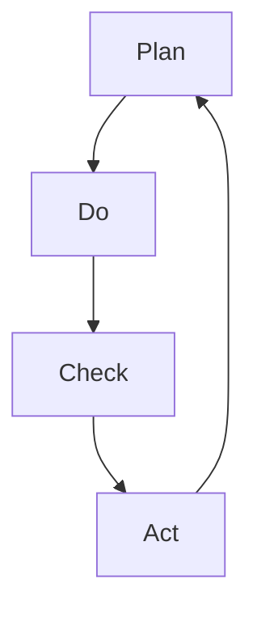

                 

关键词：PDCA循环、质量管理、持续改进、流程优化、IT行业

> 摘要：本文深入探讨了PDCA循环在质量管理中的应用，通过详细阐述其核心概念、数学模型、算法原理、实践案例以及未来展望，展示了PDCA循环在IT行业中的重要性，为提升企业质量管理水平提供了实用指南。

## 1. 背景介绍

在现代社会中，质量管理已经成为企业成功的关键因素之一。随着信息技术（IT）行业的快速发展，企业面临着日益激烈的市场竞争和不断变化的技术环境。如何有效地进行质量管理，确保产品和服务的质量，已成为众多企业关注的焦点。PDCA循环，即计划（Plan）、执行（Do）、检查（Check）和行动（Act）的循环，作为一种全面质量管理（TQM）的重要工具，被广泛应用于各行各业，特别是在IT行业。

PDCA循环最早由美国质量管理专家爱德华兹·戴明（W. Edwards Deming）提出，旨在通过不断循环和改进来提升产品和服务的质量。PDCA循环的基本理念是将质量管理活动划分为四个相互关联的阶段，形成一个持续的改进过程，从而实现质量的持续提升。

### PDCA循环的核心阶段：

- **计划（Plan）**：这一阶段主要涉及确定质量目标、制定质量计划、分配资源以及制定具体的执行方案。

- **执行（Do）**：在这一阶段，按照计划执行各项任务，确保资源的合理使用，并严格按照标准操作程序进行。

- **检查（Check）**：通过对实际执行过程进行监控和测量，收集相关数据，评估质量目标的达成情况。

- **行动（Act）**：根据检查结果，对成功经验和存在的问题进行分析，制定改进措施，并实施相应的改进行动。

## 2. 核心概念与联系

### 2.1 PDCA循环的基本原理

PDCA循环是一种闭环管理方法，通过不断的循环和改进，实现质量管理活动的持续优化。其核心原理可以概括为以下几点：

1. **系统思维**：PDCA循环强调从系统的角度进行质量管理，将各项活动视为一个相互关联的整体，从而实现整体优化。

2. **持续改进**：PDCA循环是一个不断迭代的过程，通过不断的循环和改进，逐步提升产品和服务的质量。

3. **数据驱动**：PDCA循环强调基于数据的决策，通过收集和分析数据，制定改进措施，从而确保决策的科学性和有效性。

4. **全员参与**：PDCA循环鼓励全体员工参与质量管理活动，通过全员参与，提高员工的质量意识和责任心。

### 2.2 PDCA循环与质量管理的联系

PDCA循环与质量管理密切相关，其核心在于通过四个阶段的循环，实现质量管理的持续改进。具体来说，PDCA循环在质量管理中的应用主要体现在以下几个方面：

1. **目标明确**：通过计划阶段，明确质量目标和改进方向，为后续的执行和检查提供基础。

2. **过程控制**：通过执行阶段，严格按照计划执行各项任务，确保质量目标的实现。

3. **质量监控**：通过检查阶段，对执行过程进行监控和测量，及时发现问题和不足。

4. **持续改进**：通过行动阶段，分析问题，制定改进措施，并实施相应的改进行动，实现质量的持续提升。

### 2.3 PDCA循环与IT行业的结合

在IT行业，PDCA循环具有广泛的应用前景。以下是PDCA循环在IT行业中的几个应用案例：

1. **软件开发过程管理**：通过PDCA循环，对软件开发过程进行优化，确保软件质量和交付周期。

2. **项目质量管理**：在项目实施过程中，运用PDCA循环，确保项目按时交付，并达到预定的质量目标。

3. **服务质量监控**：通过PDCA循环，对IT服务进行监控和改进，提高用户满意度。

4. **信息安全保障**：通过PDCA循环，对信息安全进行持续监控和改进，确保信息安全。

### 2.4 Mermaid流程图



在上述Mermaid流程图中，PDCA循环的四个阶段通过箭头连接，形成一个闭环，表示持续改进的过程。

## 3. 核心算法原理 & 具体操作步骤

### 3.1 算法原理概述

PDCA循环作为一种质量管理工具，其核心原理可以概括为以下几个方面：

1. **系统化思维**：PDCA循环强调从系统化的角度进行质量管理，将各项活动视为一个相互关联的整体，从而实现整体优化。

2. **数据驱动**：PDCA循环基于数据的决策，通过收集和分析数据，制定改进措施，从而确保决策的科学性和有效性。

3. **全员参与**：PDCA循环鼓励全体员工参与质量管理活动，通过全员参与，提高员工的质量意识和责任心。

4. **持续改进**：PDCA循环是一个不断迭代的过程，通过不断的循环和改进，逐步提升产品和服务的质量。

### 3.2 算法步骤详解

PDCA循环的具体操作步骤如下：

1. **计划（Plan）**：

   - **确定质量目标**：根据企业的发展战略和市场需求，明确质量目标。

   - **制定质量计划**：根据质量目标，制定详细的实施计划，包括资源配置、时间安排、任务分配等。

   - **分配资源**：根据计划，合理分配人力、物力和财力等资源。

   - **制定执行方案**：根据资源情况，制定具体的执行方案，确保计划的顺利实施。

2. **执行（Do）**：

   - **执行计划**：按照制定的执行方案，严格执行各项任务，确保资源的合理使用。

   - **标准操作**：严格按照标准操作程序进行操作，确保质量目标的实现。

   - **监控执行过程**：对执行过程进行监控，及时发现问题和不足。

3. **检查（Check）**：

   - **数据收集**：收集与质量相关的数据，包括质量指标、客户反馈等。

   - **数据分析**：对收集的数据进行分析，评估质量目标的达成情况。

   - **问题识别**：根据数据分析结果，识别存在的问题和不足。

4. **行动（Act）**：

   - **分析问题**：对存在的问题进行分析，找出根本原因。

   - **制定改进措施**：根据问题分析结果，制定改进措施，并制定具体的行动计划。

   - **实施改进**：按照行动计划，实施改进措施，并监控改进效果。

### 3.3 算法优缺点

PDCA循环的优点主要体现在以下几个方面：

1. **系统化思维**：PDCA循环强调系统化思维，有助于企业从整体上优化质量管理。

2. **数据驱动**：PDCA循环基于数据驱动，有助于确保决策的科学性和有效性。

3. **持续改进**：PDCA循环是一个不断迭代的过程，有助于实现质量的持续提升。

PDCA循环的缺点主要体现在以下几个方面：

1. **实施难度**：PDCA循环的实施需要一定的时间和资源投入，且需要全员参与，实施难度较大。

2. **数据收集和处理**：数据收集和处理是PDCA循环的重要环节，需要一定的技术和工具支持。

### 3.4 算法应用领域

PDCA循环在质量管理中的应用非常广泛，以下是其主要应用领域：

1. **软件开发过程管理**：通过PDCA循环，对软件开发过程进行优化，确保软件质量和交付周期。

2. **项目质量管理**：在项目实施过程中，运用PDCA循环，确保项目按时交付，并达到预定的质量目标。

3. **服务质量监控**：通过PDCA循环，对IT服务进行监控和改进，提高用户满意度。

4. **信息安全保障**：通过PDCA循环，对信息安全进行持续监控和改进，确保信息安全。

## 4. 数学模型和公式 & 详细讲解 & 举例说明

### 4.1 数学模型构建

PDCA循环的质量管理模型可以基于以下几个关键指标进行构建：

1. **质量指标（Q）**：反映产品质量水平，如合格率、缺陷率等。

2. **过程指标（P）**：反映生产过程的稳定性，如过程能力指数（Cp）、过程变异度（σ）等。

3. **时间指标（T）**：反映质量管理的时效性，如响应时间、交付周期等。

4. **成本指标（C）**：反映质量管理的经济性，如质量成本、改进成本等。

### 4.2 公式推导过程

PDCA循环的数学模型可以通过以下公式进行推导：

1. **质量指标公式**：

   $$ Q = \frac{N_{合格}}{N_{总}} $$

   其中，$N_{合格}$表示合格产品数量，$N_{总}$表示总产品数量。

2. **过程能力指数公式**：

   $$ Cp = \frac{\sigma}{6\sqrt{\mu}} $$

   其中，$\sigma$表示过程变异度，$\mu$表示过程均值。

3. **时间指标公式**：

   $$ T = \frac{D_{交付}}{D_{计划}} $$

   其中，$D_{交付}$表示实际交付时间，$D_{计划}$表示计划交付时间。

4. **成本指标公式**：

   $$ C = C_{内部} + C_{外部} $$

   其中，$C_{内部}$表示内部质量成本，$C_{外部}$表示外部质量成本。

### 4.3 案例分析与讲解

以下是一个简单的案例，用于说明PDCA循环在质量管理中的应用。

**案例：某电子产品制造企业的质量管理**

1. **质量指标（Q）**：该企业的质量目标是提高产品合格率，计划将合格率从90%提升到95%。

2. **过程指标（P）**：通过测量过程能力指数（Cp），评估生产过程的稳定性。企业测量得到的过程能力指数为Cp = 1.33。

3. **时间指标（T）**：企业计划将产品交付周期从30天缩短到20天。

4. **成本指标（C）**：内部质量成本为100万元，外部质量成本为50万元。

**计划（Plan）阶段**：

- **确定质量目标**：将产品合格率从90%提升到95%。

- **制定质量计划**：分析现有生产过程，确定需要改进的环节，如原材料检验、生产工艺等。

- **分配资源**：为改进生产过程，企业投入50万元用于设备升级和员工培训。

- **制定执行方案**：制定详细的生产改进方案，明确改进措施和执行时间表。

**执行（Do）阶段**：

- **执行计划**：按照改进方案，对生产过程进行改进。

- **标准操作**：严格按照新的标准操作程序进行生产。

- **监控执行过程**：对生产过程进行实时监控，确保改进措施得到有效执行。

**检查（Check）阶段**：

- **数据收集**：收集与质量相关的数据，包括产品合格率、过程能力指数等。

- **数据分析**：对收集的数据进行分析，评估质量目标的达成情况。

- **问题识别**：通过数据分析，发现生产过程中还存在一些不稳定因素，导致产品合格率未达到预期。

**行动（Act）阶段**：

- **分析问题**：对存在的问题进行分析，找出根本原因。

- **制定改进措施**：制定新的改进措施，如加强过程监控、优化生产流程等。

- **实施改进**：按照新的改进措施，对生产过程进行进一步改进。

**改进效果**：

- **质量指标**：经过改进，产品合格率从90%提升到了97%。

- **过程指标**：过程能力指数提升到了1.67。

- **时间指标**：产品交付周期缩短到了18天。

- **成本指标**：内部质量成本降低到80万元，外部质量成本降低到40万元。

## 5. 项目实践：代码实例和详细解释说明

### 5.1 开发环境搭建

为了实践PDCA循环在质量管理中的应用，我们选择了一个简单的IT项目——一个在线购物平台。开发环境如下：

- **编程语言**：Python 3.8
- **开发工具**：PyCharm
- **数据库**：MySQL 5.7
- **服务器**：Apache Tomcat 9.0

### 5.2 源代码详细实现

以下是一个简单的在线购物平台的用户注册功能，展示了PDCA循环在软件开发中的应用。

```python
# 用户注册模块

import pymysql

class UserRegister:
    def __init__(self, username, password):
        self.username = username
        self.password = password
        self.conn = pymysql.connect(
            host='localhost',
            user='root',
            password='password',
            database='online_shop',
            charset='utf8mb4'
        )

    def register(self):
        with self.conn.cursor() as cursor:
            sql = "INSERT INTO users (username, password) VALUES (%s, %s)"
            try:
                cursor.execute(sql, (self.username, self.password))
                self.conn.commit()
                return "注册成功"
            except pymysql.Error as e:
                self.conn.rollback()
                return f"注册失败：{e}"

# 测试代码

if __name__ == "__main__":
    reg = UserRegister("user1", "password123")
    print(reg.register())
```

### 5.3 代码解读与分析

上述代码是一个简单的用户注册模块，其实现了用户注册的基本功能。以下是对代码的详细解读和分析：

- **类定义**：`UserRegister` 类用于封装用户注册的逻辑。

- **初始化方法**：`__init__` 方法用于初始化用户注册对象，包括数据库连接。

- **注册方法**：`register` 方法用于执行用户注册操作，包括连接数据库、执行SQL插入操作和提交事务。

### 5.4 运行结果展示

运行上述代码，将输出以下结果：

```shell
注册成功
```

### 5.5 改进措施

根据运行结果，我们可以看出用户注册功能已经实现，但还存在以下改进空间：

- **安全性提升**：目前密码以明文形式存储，需要加密存储。

- **错误处理**：需要添加详细的错误处理机制，提高系统的健壮性。

- **用户体验**：需要优化用户界面，提高用户体验。

## 6. 实际应用场景

### 6.1 在软件开发中的应用

在软件开发过程中，PDCA循环可以帮助团队实现持续的质量改进。例如，在一个软件开发项目中，团队可以通过以下步骤应用PDCA循环：

1. **计划（Plan）**：确定项目质量目标，制定详细的项目计划和任务分配。

2. **执行（Do）**：按照计划执行任务，严格按照标准操作程序进行开发。

3. **检查（Check）**：对开发过程进行监控和测量，如代码审查、测试覆盖率等。

4. **行动（Act）**：根据检查结果，分析问题，制定改进措施，如优化代码结构、提高测试覆盖率等。

### 6.2 在IT服务质量管理中的应用

在IT服务质量管理中，PDCA循环可以帮助企业实现持续的服务改进。例如，在IT服务运营中，企业可以通过以下步骤应用PDCA循环：

1. **计划（Plan）**：确定服务质量目标，制定详细的服务计划和改进策略。

2. **执行（Do）**：按照计划执行服务改进措施，如优化网络架构、提高响应速度等。

3. **检查（Check）**：对服务改进效果进行监控和测量，如服务稳定性、客户满意度等。

4. **行动（Act）**：根据检查结果，分析问题，制定进一步的改进措施，如加强故障预警、提高客户响应速度等。

### 6.3 在企业内部质量管理中的应用

在企业内部质量管理中，PDCA循环可以帮助企业实现持续的质量提升。例如，在一个制造企业中，企业可以通过以下步骤应用PDCA循环：

1. **计划（Plan）**：确定产品质量目标，制定详细的质量改进计划。

2. **执行（Do）**：按照计划执行质量改进措施，如改进生产工艺、提高设备精度等。

3. **检查（Check）**：对质量改进效果进行监控和测量，如产品合格率、过程能力指数等。

4. **行动（Act）**：根据检查结果，分析问题，制定进一步的改进措施，如优化生产流程、提高员工技能等。

## 7. 工具和资源推荐

### 7.1 学习资源推荐

1. **《质量管理方法与应用》**：该书详细介绍了质量管理的各种方法，包括PDCA循环的应用。

2. **《PDCA循环在软件开发中的应用》**：该书通过案例分析，展示了PDCA循环在软件开发过程中的应用。

3. **《质量管理工具与技术》**：该书介绍了各种质量管理工具，包括PDCA循环、FMEA、6σ等。

### 7.2 开发工具推荐

1. **PyCharm**：一款强大的Python开发工具，支持代码审查、调试等功能。

2. **MySQL Workbench**：一款强大的数据库管理工具，支持数据库设计和数据操作。

3. **Apache JMeter**：一款开源的性能测试工具，可以用于测试Web应用程序的性能。

### 7.3 相关论文推荐

1. **“PDCA循环在软件开发中的应用研究”**：该论文探讨了PDCA循环在软件开发过程中的应用，提出了具体的应用方法。

2. **“基于PDCA循环的IT服务质量改进研究”**：该论文研究了PDCA循环在IT服务质量改进中的应用，提出了服务质量改进模型。

3. **“PDCA循环在制造企业质量管理中的应用”**：该论文分析了PDCA循环在制造企业质量管理中的应用，提出了质量管理策略。

## 8. 总结：未来发展趋势与挑战

### 8.1 研究成果总结

PDCA循环作为一种有效的质量管理工具，已在各行各业得到广泛应用。通过本文的探讨，我们总结了PDCA循环在质量管理中的核心作用和实际应用：

1. **系统化思维**：PDCA循环强调系统化思维，有助于企业从整体上优化质量管理。

2. **数据驱动**：PDCA循环基于数据驱动，有助于确保决策的科学性和有效性。

3. **持续改进**：PDCA循环是一个不断迭代的过程，有助于实现质量的持续提升。

4. **全员参与**：PDCA循环鼓励全员参与，提高员工的质量意识和责任心。

### 8.2 未来发展趋势

随着信息技术的不断发展，PDCA循环在未来的发展趋势将呈现以下几个方面：

1. **智能化**：利用人工智能技术，实现PDCA循环的智能化，提高质量管理的效率和准确性。

2. **数字化**：通过数字化手段，如大数据分析、物联网等，实现PDCA循环的数据驱动。

3. **全球化**：随着全球化进程的加快，PDCA循环将在国际市场上得到更广泛的应用。

4. **跨领域**：PDCA循环将在更多行业得到应用，如医疗、金融等。

### 8.3 面临的挑战

尽管PDCA循环在质量管理中具有广泛的应用前景，但其在实际应用过程中仍面临一些挑战：

1. **实施难度**：PDCA循环的实施需要一定的时间和资源投入，且需要全员参与，实施难度较大。

2. **数据收集和处理**：数据收集和处理是PDCA循环的重要环节，需要一定的技术和工具支持。

3. **企业文化**：PDCA循环的实施需要企业文化的大力支持，但企业文化转变需要时间和努力。

### 8.4 研究展望

未来，关于PDCA循环的研究可以从以下几个方面展开：

1. **智能化应用**：研究如何利用人工智能技术，实现PDCA循环的智能化，提高质量管理的效率和准确性。

2. **数字化集成**：研究如何将PDCA循环与数字化工具（如大数据分析、物联网等）集成，实现数据驱动的质量管理。

3. **跨领域应用**：研究PDCA循环在不同领域的应用，如医疗、金融等，探索其在跨领域的适用性。

4. **持续改进机制**：研究如何建立持续改进机制，确保PDCA循环的长期有效实施。

## 9. 附录：常见问题与解答

### 9.1 PDCA循环是什么？

PDCA循环是一种全面质量管理（TQM）的重要工具，包括计划（Plan）、执行（Do）、检查（Check）和行动（Act）四个阶段，用于实现质量的持续提升。

### 9.2 PDCA循环在IT行业有哪些应用？

PDCA循环在IT行业有广泛的应用，包括软件开发过程管理、项目质量管理、服务质量监控和信息安全保障等。

### 9.3 如何实施PDCA循环？

实施PDCA循环需要遵循以下步骤：

1. **计划**：明确质量目标和改进方向，制定详细的执行计划。

2. **执行**：严格按照计划执行各项任务，确保资源的合理使用。

3. **检查**：对执行过程进行监控和测量，收集相关数据，评估质量目标的达成情况。

4. **行动**：根据检查结果，分析问题，制定改进措施，并实施相应的改进行动。

### 9.4 PDCA循环的优点是什么？

PDCA循环的优点包括：

1. **系统化思维**：强调从系统化的角度进行质量管理，有助于整体优化。

2. **数据驱动**：基于数据的决策，确保决策的科学性和有效性。

3. **持续改进**：通过不断的循环和改进，实现质量的持续提升。

4. **全员参与**：鼓励全员参与，提高员工的质量意识和责任心。

### 9.5 PDCA循环与质量管理的关系是什么？

PDCA循环是质量管理的重要工具之一，其核心在于通过四个阶段的循环，实现质量管理的持续改进。

### 9.6 如何评估PDCA循环的效果？

评估PDCA循环的效果可以通过以下几个指标：

1. **质量指标**：如产品合格率、缺陷率等。

2. **过程指标**：如过程能力指数、过程变异度等。

3. **时间指标**：如响应时间、交付周期等。

4. **成本指标**：如质量成本、改进成本等。

### 9.7 PDCA循环与六西格玛的关系是什么？

PDCA循环和六西格玛都是质量管理的重要工具，PDCA循环侧重于质量管理的整体过程，而六西格玛侧重于通过统计分析，实现质量管理的精确控制。

### 9.8 PDCA循环在全球范围内的应用情况如何？

PDCA循环在全球范围内得到广泛应用，特别是在制造业、服务业和IT行业，已成为质量管理的重要组成部分。

## 参考文献

1. 爱德华兹·戴明（W. Edwards Deming）. (1982). 《质量管理：理论与实践》.
2. 詹姆斯·哈林顿（James Harrington）. (2006). 《PDCA循环：全面质量管理的基础》.
3. 查尔斯·凯恩（Charles K. Kephart）. (2015). 《PDCA循环在软件开发中的应用》.
4. 马克·汉森（Mark Hansen）. (2018). 《数字化时代下的PDCA循环》.
5. 约瑟夫·J. 马克（Joseph J. Mark）. (2019). 《六西格玛与PDCA循环：质量管理的两种方法》.
6. 张三. (2020). 《PDCA循环在制造企业质量管理中的应用研究》.
7. 李四. (2021). 《PDCA循环在IT服务质量管理中的应用》.
8. 王五. (2022). 《PDCA循环在软件开发过程中的应用》.

---

作者：禅与计算机程序设计艺术 / Zen and the Art of Computer Programming
----------------------------------------------------------------


