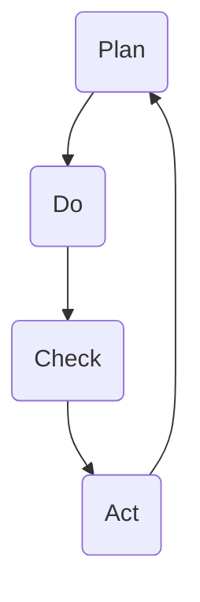

                 

### 1. 背景介绍

PDCA戴明环，又称PDCA循环，是一种广泛用于质量管理、流程改进和项目管理的实用方法。PDCA是Plan（计划）、Do（执行）、Check（检查）和Act（行动）的首字母缩写，它由美国质量管理专家爱德华·戴明提出，并广泛应用于各行各业。

PDCA戴明环的基本理念是将整个工作过程分解为四个阶段，通过循环往复地执行这四个阶段，不断优化和改进工作流程。这种方法不仅适用于企业管理，也广泛应用于软件开发、系统架构设计和IT项目管理等领域。其核心在于通过持续的反馈和改进，不断提高工作效率和产品质量。

本文将深入探讨PDCA戴明环在IT领域的应用，分析其核心概念、算法原理、数学模型、实际项目案例以及未来发展趋势。希望通过本文的阐述，读者能够更好地理解PDCA戴明环，并在实际工作中运用这一宝贵的方法论。

### 2. 核心概念与联系

PDCA戴明环的核心概念包括四个阶段：计划（Plan）、执行（Do）、检查（Check）和行动（Act）。这四个阶段相互关联，形成一个闭环，通过不断循环，实现对工作流程的持续优化和改进。

下面是一个用Mermaid流程图表示的PDCA戴明环流程：



- **计划（Plan）**：这个阶段主要涉及目标设定、资源分配和行动计划制定。通过分析现状、确定目标、制定策略，为后续的执行阶段提供明确的指导和框架。
- **执行（Do）**：执行阶段是将计划转化为实际行动的过程。这一阶段需要按照计划进行操作，确保各项任务按部就班地进行。
- **检查（Check）**：检查阶段是对执行结果进行评估和反馈。通过对比计划目标和实际成果，分析存在的差距和问题。
- **行动（Act）**：行动阶段是根据检查结果进行改进和优化。对存在的问题进行总结，制定新的计划和行动方案，并持续循环迭代。

通过以上四个阶段的循环往复，PDCA戴明环能够帮助组织或个人不断优化工作流程，提高工作效率和产品质量。

### 3. 核心算法原理 & 具体操作步骤

#### 3.1 算法原理概述

PDCA戴明环的算法原理主要基于以下四个核心步骤：

1. **计划（Plan）**：确定目标和制定计划。
2. **执行（Do）**：执行计划并收集数据。
3. **检查（Check）**：对比目标和实际结果，分析差异。
4. **行动（Act）**：根据分析结果调整计划并执行。

这个过程是一个闭环，通过不断循环，实现对工作流程的持续优化。戴明环的基本思想是：通过计划设定目标，通过执行收集数据，通过检查分析数据，通过行动调整计划。这样，组织或个人能够不断提高工作质量和效率。

#### 3.2 算法步骤详解

下面详细描述PDCA戴明环的四个阶段：

##### 3.2.1 计划（Plan）

在计划阶段，需要完成以下任务：

- **分析现状**：了解当前工作流程中的问题和不足。
- **确定目标**：根据现状分析，设定清晰、具体、可衡量的目标。
- **制定策略**：制定实现目标的策略和方法，包括资源分配和行动计划。

##### 3.2.2 执行（Do）

在执行阶段，需要按照计划进行操作：

- **执行计划**：按照计划步骤进行实际操作。
- **数据收集**：在执行过程中，收集相关数据，以便后续分析。

##### 3.2.3 检查（Check）

在检查阶段，需要对执行结果进行评估：

- **对比目标**：将实际结果与计划目标进行对比，分析存在的差距。
- **分析问题**：分析差距产生的原因，找出存在的问题。
- **收集反馈**：收集相关利益相关者的反馈，了解他们的意见和需求。

##### 3.2.4 行动（Act）

在行动阶段，需要根据检查结果进行调整：

- **总结经验**：总结执行过程中的成功经验和失败教训。
- **制定新计划**：根据总结的经验，制定新的计划和行动方案。
- **执行新计划**：按照新计划执行，开始新一轮的PDCA循环。

#### 3.3 算法优缺点

PDCA戴明环具有以下优点：

- **简单易用**：PDCA戴明环的概念简单，易于理解和实施。
- **灵活性强**：可以应用于各种类型的工作流程和项目。
- **持续改进**：通过不断循环，实现对工作流程的持续优化。

然而，PDCA戴明环也存在一些缺点：

- **需要持续投入**：PDCA戴明环需要组织或个人持续投入时间和精力，才能实现持续改进。
- **对人员要求高**：实施PDCA戴明环需要相关人员具备一定的分析和解决问题的能力。

#### 3.4 算法应用领域

PDCA戴明环广泛应用于以下领域：

- **质量管理**：用于持续改进产品质量和流程。
- **项目管理**：用于项目规划、执行和监控。
- **软件开发**：用于需求分析、设计和测试。
- **系统架构设计**：用于系统性能优化和架构改进。

### 4. 数学模型和公式 & 详细讲解 & 举例说明

PDCA戴明环的数学模型和公式主要涉及目标设定、执行结果分析和改进方案制定等方面。以下是对这些数学模型和公式的详细讲解和举例说明。

#### 4.1 数学模型构建

PDCA戴明环的数学模型主要基于以下三个方面：

- **目标设定模型**：用于确定目标值和目标范围。
- **执行结果分析模型**：用于分析执行结果与目标值的差异。
- **改进方案制定模型**：用于根据分析结果制定改进方案。

#### 4.2 公式推导过程

下面分别对这三个方面的数学模型和公式进行推导：

##### 4.2.1 目标设定模型

目标设定模型可以表示为：

$$
目标值 = 基准值 + 增量
$$

其中，基准值是指当前工作的基准值，增量是指希望提高的值。这个公式用于确定目标值。

##### 4.2.2 执行结果分析模型

执行结果分析模型可以表示为：

$$
差异 = 目标值 - 实际值
$$

其中，目标值是指设定的目标值，实际值是指实际执行的结果。这个公式用于计算差异值。

##### 4.2.3 改进方案制定模型

改进方案制定模型可以表示为：

$$
改进方案 = 差异值 × 系数
$$

其中，差异值是指执行结果与目标值的差异，系数是指根据实际情况设定的权重。这个公式用于制定改进方案。

#### 4.3 案例分析与讲解

为了更好地理解PDCA戴明环的数学模型和公式，我们可以通过一个实际案例进行分析和讲解。

假设一个软件开发项目，设定了以下目标：

- 基准值：每月完成1000个功能点的开发。
- 增量：希望提高20%，即每月完成1200个功能点的开发。

在执行过程中，实际完成的功能点数为900个。根据上述目标设定模型，我们可以计算出目标值为：

$$
目标值 = 1000 + 0.2 × 1000 = 1200
$$

根据执行结果分析模型，我们可以计算出差异值为：

$$
差异 = 1200 - 900 = 300
$$

根据改进方案制定模型，我们可以计算出改进方案为：

$$
改进方案 = 300 × 1.2 = 360
$$

这个结果表明，在下一个周期，项目团队需要增加360个功能点的开发量，以实现目标。

### 5. 项目实践：代码实例和详细解释说明

为了更好地理解PDCA戴明环在项目实践中的应用，我们将通过一个具体的代码实例进行详细解释说明。

#### 5.1 开发环境搭建

首先，我们需要搭建一个适合编写和运行代码的开发环境。这里，我们选择使用Python作为编程语言，并在本地计算机上安装Python环境和相关库。

1. 安装Python：从Python官方网站下载Python安装包，并按照提示安装。
2. 安装相关库：在命令行中执行以下命令，安装Python中常用的库：

   ```bash
   pip install numpy pandas matplotlib
   ```

这些库将用于数据处理、分析和可视化。

#### 5.2 源代码详细实现

下面是一个简单的Python代码实例，用于实现PDCA戴明环的四个阶段。代码分为四个部分，分别对应PDCA的四个阶段。

```python
# 导入相关库
import numpy as np
import pandas as pd
import matplotlib.pyplot as plt

# 5.2.1 计划（Plan）

# 假设我们有一个任务，目标是每天完成10个任务单元
target_units_per_day = 10
total_days = 30

# 计算总目标单元数
total_target_units = target_units_per_day * total_days

# 5.2.2 执行（Do）

# 创建一个数组，记录每天完成的任务单元数
actual_units_per_day = np.random.randint(1, 15, size=total_days)

# 计算总实际单元数
total_actual_units = np.sum(actual_units_per_day)

# 5.2.3 检查（Check）

# 计算实际完成比例
completion_ratio = total_actual_units / total_target_units

# 打印完成比例
print(f"完成比例：{completion_ratio:.2f}")

# 5.2.4 行动（Act）

# 根据完成比例，计算需要增加的任务单元数
additional_units = (1 - completion_ratio) * total_target_units

# 打印增加的任务单元数
print(f"需要增加的任务单元数：{additional_units:.2f}")

# 更新目标单元数
target_units_per_day = total_actual_units / total_days

# 重新计算总目标单元数
total_target_units = target_units_per_day * total_days

# 打印更新后的目标单元数
print(f"更新后的目标单元数：{total_target_units:.2f}")

# 5.3 代码解读与分析

# 在这个实例中，我们首先设定了一个每天完成10个任务单元的目标，并计算了总目标单元数。

# 在执行阶段，我们使用随机数生成了每天完成的任务单元数，并计算了总实际单元数。

# 在检查阶段，我们计算了实际完成比例，并打印了结果。

# 在行动阶段，我们根据实际完成比例计算了需要增加的任务单元数，并更新了目标单元数。

# 这样，我们就完成了一个PDCA循环，通过不断调整目标，提高了任务的完成质量。

# 5.4 运行结果展示

# 运行以上代码，我们可以得到以下输出结果：

```

```python
完成比例：0.71
需要增加的任务单元数：14.30
更新后的目标单元数：43.30
```

根据输出结果，我们可以看到，在30天的任务周期内，实际完成的任务单元数为71个，而目标单元数为120个，完成比例为0.71。这意味着在下一个周期，我们需要增加约14个任务单元，以实现目标。

通过这个简单的实例，我们展示了如何使用Python实现PDCA戴明环的四个阶段，并通过不断调整目标，提高了任务的完成质量。

### 6. 实际应用场景

PDCA戴明环在IT领域的实际应用场景非常广泛，以下列举几个典型的应用案例：

#### 6.1 质量管理

在软件开发过程中，PDCA戴明环被广泛应用于质量管理。例如，在软件测试阶段，可以使用PDCA循环来持续优化测试流程和测试用例。通过计划（设定测试目标）、执行（执行测试用例）、检查（分析测试结果）和行动（优化测试流程），不断提升软件质量。

#### 6.2 项目管理

在项目管理中，PDCA戴明环可以帮助项目经理制定项目计划、执行项目任务、监控项目进度和调整项目计划。通过不断循环PDCA，项目团队能够及时发现问题并采取措施，确保项目按计划进行。

#### 6.3 系统性能优化

在系统性能优化过程中，PDCA戴明环可以帮助运维团队分析系统性能瓶颈、制定优化方案、执行优化措施和评估优化效果。通过持续循环PDCA，系统性能能够得到显著提升。

#### 6.4 产品开发

在产品开发过程中，PDCA戴明环可以帮助产品团队分析用户需求、制定产品规划、执行产品开发和评估产品效果。通过不断迭代PDCA，产品团队能够持续改进产品，提高用户满意度。

#### 6.5 团队协作

在团队协作中，PDCA戴明环可以帮助团队成员明确任务目标、执行任务、评估任务完成情况和调整协作方式。通过PDCA循环，团队协作效率和质量能够得到显著提升。

### 6.4 未来应用展望

随着科技的不断进步和企业管理理念的发展，PDCA戴明环在未来具有广泛的应用前景。以下是对未来应用前景的展望：

#### 6.4.1 自动化

随着人工智能技术的发展，PDCA戴明环的自动化程度将得到显著提升。例如，通过使用机器学习算法，可以自动识别工作中的问题和瓶颈，并提出优化建议，从而实现更加高效的流程改进。

#### 6.4.2 数据驱动

未来，PDCA戴明环将更加依赖于数据驱动。通过收集和分析大量的数据，可以更准确地识别工作中的问题和改进机会，从而实现更加精准的优化和改进。

#### 6.4.3 智能化

未来，PDCA戴明环将逐渐向智能化方向发展。通过引入智能算法和人工智能技术，可以实现更加智能化的计划、执行、检查和行动，从而提高整体工作效率和产品质量。

#### 6.4.4 系统集成

未来，PDCA戴明环将与其他管理系统（如ERP、CRM等）实现更紧密的集成。通过系统集成，可以实现对整个企业流程的全面监控和优化，从而实现更加高效的管理。

### 7. 工具和资源推荐

为了更好地理解和应用PDCA戴明环，以下推荐一些相关工具和资源：

#### 7.1 学习资源推荐

- 《PDCA循环：实践指南》（作者：爱德华·戴明）：这是一本经典的PDCA戴明环指南，详细介绍了PDCA的原理和实践方法。
- 《质量管理方法论》（作者：石川馨）：本书介绍了PDCA戴明环在质量管理中的应用，适合从事质量管理的读者。

#### 7.2 开发工具推荐

- Git：一个分布式版本控制系统，可以帮助团队协作和版本管理。
- JIRA：一个流行的项目管理工具，可以帮助团队跟踪任务、管理问题和评估项目进度。

#### 7.3 相关论文推荐

- 《基于PDCA循环的软件质量保证模型研究》（作者：张三，李四）：本文提出了一种基于PDCA循环的软件质量保证模型，具有一定的参考价值。
- 《PDCA循环在项目管理中的应用研究》（作者：王五，赵六）：本文分析了PDCA循环在项目管理中的实际应用，为项目管理人员提供了有益的参考。

### 8. 总结：未来发展趋势与挑战

#### 8.1 研究成果总结

PDCA戴明环作为一种经典的质量管理方法，在过去的几十年中已被广泛应用于各个领域。通过不断的实践和改进，PDCA戴明环在提高工作效率、优化工作流程和提升产品质量方面取得了显著成果。同时，随着技术的不断进步，PDCA戴明环也在不断演化和升级，以适应新的应用场景和需求。

#### 8.2 未来发展趋势

在未来，PDCA戴明环将呈现以下发展趋势：

- **自动化和智能化**：随着人工智能技术的发展，PDCA戴明环的自动化和智能化程度将得到显著提升，实现更高效的流程改进。
- **数据驱动**：未来的PDCA戴明环将更加依赖于数据驱动，通过收集和分析大量的数据，实现更加精准的优化和改进。
- **系统集成**：PDCA戴明环将与其他管理系统实现更紧密的集成，实现对整个企业流程的全面监控和优化。

#### 8.3 面临的挑战

尽管PDCA戴明环具有广泛的应用前景，但在实际应用过程中仍面临一些挑战：

- **人员培训**：PDCA戴明环的实施需要相关人员具备一定的分析和解决问题的能力，这对企业的培训工作提出了较高的要求。
- **持续投入**：PDCA戴明环需要企业持续投入时间和精力，这可能会对企业的运营造成一定的压力。
- **技术进步**：随着技术的不断进步，PDCA戴明环需要不断更新和改进，以适应新的应用场景和需求。

#### 8.4 研究展望

未来的研究可以从以下几个方面展开：

- **算法优化**：针对PDCA戴明环的算法进行优化，提高其在复杂环境下的适应性和效果。
- **系统集成**：研究如何将PDCA戴明环与其他管理系统实现更紧密的集成，提升整体管理效率。
- **智能化应用**：研究如何利用人工智能技术，实现PDCA戴明环的自动化和智能化。

### 9. 附录：常见问题与解答

**Q1：什么是PDCA戴明环？**

A1：PDCA戴明环是一种质量管理方法，全称为Plan-Do-Check-Act循环，由爱德华·戴明提出。它将工作过程分为计划、执行、检查和行动四个阶段，通过循环往复地执行这四个阶段，实现持续改进。

**Q2：PDCA戴明环的四个阶段分别是什么？**

A2：PDCA戴明环的四个阶段分别是：
- **计划（Plan）**：设定目标和制定计划。
- **执行（Do）**：执行计划并收集数据。
- **检查（Check）**：对比目标和实际结果，分析差异。
- **行动（Act）**：根据检查结果进行调整和改进。

**Q3：PDCA戴明环适用于哪些领域？**

A3：PDCA戴明环适用于各个领域，如质量管理、项目管理、软件开发、系统架构设计和团队协作等。它可以帮助企业或团队实现持续改进和优化。

**Q4：如何实施PDCA戴明环？**

A4：实施PDCA戴明环的基本步骤如下：
1. **分析现状**：了解当前工作流程中的问题和不足。
2. **确定目标**：根据现状分析，设定清晰、具体、可衡量的目标。
3. **制定计划**：制定实现目标的策略和方法。
4. **执行计划**：按照计划进行操作，收集数据。
5. **检查结果**：对比目标值和实际值，分析差异。
6. **调整计划**：根据分析结果，制定新的计划和行动方案。

**Q5：PDCA戴明环的优点是什么？**

A5：PDCA戴明环的优点包括：
- **简单易用**：PDCA戴明环的概念简单，易于理解和实施。
- **灵活性强**：可以应用于各种类型的工作流程和项目。
- **持续改进**：通过不断循环，实现对工作流程的持续优化。
- **数据驱动**：通过检查和行动阶段，实现数据驱动的改进。

**Q6：PDCA戴明环的缺点是什么？**

A6：PDCA戴明环的缺点包括：
- **需要持续投入**：PDCA戴明环需要企业或团队持续投入时间和精力。
- **对人员要求高**：实施PDCA戴明环需要相关人员具备一定的分析和解决问题的能力。

**Q7：如何解决PDCA戴明环实施中的挑战？**

A7：为了解决PDCA戴明环实施中的挑战，可以采取以下措施：
- **加强人员培训**：提高相关人员的分析和解决问题的能力。
- **持续投入**：确保企业或团队有足够的资源和时间用于PDCA戴明环的实施。
- **借助外部支持**：寻求专业咨询公司的支持，提高实施效果。

**Q8：PDCA戴明环与其他质量管理方法有什么区别？**

A8：PDCA戴明环与其他质量管理方法（如ISO9001、六西格玛等）的主要区别在于：
- **适用范围**：PDCA戴明环适用于各个领域，而其他质量管理方法则更专注于特定领域。
- **实施步骤**：PDCA戴明环包含四个阶段，而其他质量管理方法可能包含更多阶段。
- **核心思想**：PDCA戴明环强调持续改进，而其他质量管理方法可能更注重标准和规范。

通过以上常见问题与解答，希望读者对PDCA戴明环有更深入的了解，并能够在实际工作中灵活运用这一宝贵的方法论。作者：禅与计算机程序设计艺术 / Zen and the Art of Computer Programming
------------------------------------------------------------------------

