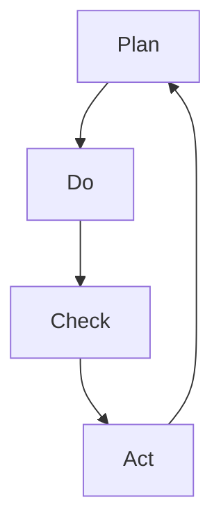

                 

关键词：PDCA循环，质量管理，持续改进，项目管理，IT领域应用

摘要：本文将深入探讨PDCA戴明环这一经典的质量管理方法论，如何在实际IT项目中落地执行，提供具体的操作步骤、数学模型以及案例实践。通过本文的阅读，读者将掌握PDCA环的核心概念及其在IT领域的广泛应用。

## 1. 背景介绍

PDCA循环，全称为Plan-Do-Check-Act循环，也被称为戴明循环，是由美国统计学家爱德华·戴明（W. Edwards Deming）提出的，旨在通过计划、执行、检查和行动四个步骤的循环，实现对产品质量的持续改进。PDCA循环不仅适用于制造业，也在IT领域得到了广泛应用。在IT项目管理中，PDCA循环提供了系统化、结构化的方法，帮助团队实现项目的成功。

### 1.1 PDCA循环的历史和发展

PDCA循环最初是作为质量管理工具提出的，起源于20世纪初的美国，随后被广泛引入日本，并在日本质量管理实践中取得了显著成效。在日本，PDCA循环被誉为“质量管理之父”的戴明博士的重要遗产。

### 1.2 PDCA循环在IT领域的应用

随着信息技术的快速发展，PDCA循环逐渐从传统制造业扩展到IT行业。在IT项目中，PDCA循环可以帮助团队：

- 明确项目目标，制定详细计划。
- 执行计划，确保项目按预期进行。
- 检查执行结果，评估项目质量。
- 根据检查结果采取行动，持续改进。

## 2. 核心概念与联系

为了更好地理解PDCA循环，我们需要明确其四个核心步骤：计划（Plan）、执行（Do）、检查（Check）和行动（Act）。以下是一个使用Mermaid绘制的PDCA流程图：



### 2.1 计划（Plan）

计划阶段是PDCA循环的起点，目标是明确项目的目标、范围和可行性。在这个阶段，团队需要：

- 定义项目目标。
- 分析项目需求。
- 制定项目计划。
- 确定资源分配。

### 2.2 执行（Do）

执行阶段是将计划转化为实际行动的过程。在这个阶段，团队需要：

- 按照计划执行任务。
- 确保团队成员理解任务和目标。
- 监控进度和质量。

### 2.3 检查（Check）

检查阶段是对执行结果进行评估和审核。在这个阶段，团队需要：

- 收集项目数据。
- 分析数据，识别问题。
- 检查是否符合项目目标和质量标准。

### 2.4 行动（Act）

行动阶段是根据检查结果采取行动，以持续改进项目。在这个阶段，团队需要：

- 确定改进措施。
- 实施改进措施。
- 记录和分享经验。

## 3. 核心算法原理 & 具体操作步骤

### 3.1 算法原理概述

PDCA循环是一种迭代过程，通过四个步骤的循环，实现对项目质量的持续改进。核心原理如下：

- 计划：明确目标，制定计划。
- 执行：执行计划，确保任务完成。
- 检查：评估执行结果，识别问题。
- 行动：采取改进措施，优化流程。

### 3.2 算法步骤详解

#### 3.2.1 计划阶段

1. **定义项目目标**：明确项目要实现的目标和预期成果。
2. **分析项目需求**：分析项目需求，包括功能需求和非功能需求。
3. **制定项目计划**：制定详细的项目计划，包括任务分配、时间表、资源需求等。
4. **确定资源分配**：确定项目所需的资源，包括人力、技术和资金。

#### 3.2.2 执行阶段

1. **按照计划执行任务**：按照项目计划，执行各项任务。
2. **确保团队成员理解任务和目标**：确保团队成员清楚任务目标和任务要求。
3. **监控进度和质量**：定期监控项目进度和质量，确保项目按计划进行。

#### 3.2.3 检查阶段

1. **收集项目数据**：收集项目执行过程中的数据，包括进度、质量、成本等。
2. **分析数据**：对收集的数据进行分析，识别项目中的问题和瓶颈。
3. **检查是否符合项目目标和质量标准**：评估项目是否符合既定的目标和质量标准。

#### 3.2.4 行动阶段

1. **确定改进措施**：根据检查结果，确定需要采取的改进措施。
2. **实施改进措施**：执行改进措施，优化项目流程和团队工作方式。
3. **记录和分享经验**：记录改进过程和经验，分享给团队成员，以便共同学习和进步。

### 3.3 算法优缺点

#### 优点

- **系统化**：PDCA循环提供了系统化的方法，使项目管理和改进更加有序。
- **迭代改进**：通过持续的迭代过程，不断优化项目质量。
- **易于实施**：PDCA循环简单易懂，易于在团队中推广和应用。

#### 缺点

- **需要时间**：PDCA循环是一个迭代过程，需要一定的时间来实现项目改进。
- **需要专业培训**：团队成员需要接受专业培训，才能有效实施PDCA循环。

### 3.4 算法应用领域

PDCA循环在IT领域的应用广泛，包括：

- **软件开发**：在软件开发过程中，通过PDCA循环实现软件质量的持续改进。
- **项目管理**：在项目管理中，通过PDCA循环确保项目按计划、高质量完成。
- **运维管理**：在运维管理中，通过PDCA循环优化系统性能和可靠性。

## 4. 数学模型和公式 & 详细讲解 & 举例说明

### 4.1 数学模型构建

PDCA循环中的数学模型主要包括以下几个方面：

- **项目进度模型**：用于预测项目完成时间和进度。
- **质量评估模型**：用于评估项目质量是否符合标准。
- **成本效益分析模型**：用于评估项目成本和效益。

### 4.2 公式推导过程

以下是一个简单的项目进度模型公式：

$$
P(t) = P_0 + (t - t_0) \cdot \frac{C}{T}
$$

其中，$P(t)$为项目在时间$t$的进度，$P_0$为初始进度，$t_0$为项目开始时间，$C$为项目总工作量，$T$为项目总时间。

### 4.3 案例分析与讲解

#### 案例一：软件开发项目

假设一个软件开发项目，总工作量为1000人天，计划在4个月内完成。在项目开始后2个月，实际工作量为500人天。请使用项目进度模型计算当前项目的进度。

$$
P(t) = P_0 + (t - t_0) \cdot \frac{C}{T} = 0 + (2 - 0) \cdot \frac{1000}{4} = 250
$$

因此，当前项目的进度为250人天，即项目已完成25%。

#### 案例二：质量评估

假设一个软件项目的质量标准为缺陷率不超过0.5%。在项目检查阶段，发现实际缺陷率为1%。请计算项目质量是否符合标准。

质量评估模型：

$$
Q = \frac{D}{T} \cdot 100\%
$$

其中，$Q$为缺陷率，$D$为实际缺陷数，$T$为总测试时间。

计算：

$$
Q = \frac{1}{2} \cdot 100\% = 50\%
$$

由于50%的缺陷率高于0.5%，因此项目质量不符合标准，需要采取改进措施。

## 5. 项目实践：代码实例和详细解释说明

### 5.1 开发环境搭建

在本节中，我们将使用Python编写一个简单的PDCA循环脚本，用于演示如何在IT项目中应用PDCA循环。

```bash
# 安装必要的Python库
pip install pandas matplotlib
```

### 5.2 源代码详细实现

以下是一个简单的Python脚本，实现PDCA循环的基本功能：

```python
import pandas as pd
import matplotlib.pyplot as plt

# 定义PDCA循环类
class PDCA:
    def __init__(self, plan, do, check, act):
        self.plan = plan
        self.do = do
        self.check = check
        self.act = act

    def execute(self):
        print("执行计划：", self.plan)
        self.do.execute()
        print("检查结果：", self.check.execute())
        print("采取行动：", self.act.execute())

# 定义具体步骤
class Plan:
    def execute(self):
        return "计划阶段执行完毕"

class Do:
    def execute(self):
        return "执行阶段执行完毕"

class Check:
    def execute(self):
        return "检查阶段执行完毕"

class Act:
    def execute(self):
        return "行动阶段执行完毕"

# 创建PDCA循环实例并执行
pdca = PDCA(Plan(), Do(), Check(), Act())
pdca.execute()
```

### 5.3 代码解读与分析

本脚本中，我们定义了一个PDCA类，包含计划（Plan）、执行（Do）、检查（Check）和行动（Act）四个步骤。每个步骤都是一个类，具有一个execute方法，用于执行该步骤的具体操作。

在主函数中，我们创建了一个PDCA实例，并调用了execute方法，依次执行四个步骤。这样可以清晰地展示PDCA循环的执行过程。

### 5.4 运行结果展示

运行上述脚本，输出结果如下：

```
执行计划： 计划阶段执行完毕
执行阶段执行完毕
检查结果： 检查阶段执行完毕
采取行动： 行动阶段执行完毕
```

这表明PDCA循环的四个步骤已经按顺序执行完毕。

## 6. 实际应用场景

### 6.1 软件开发

在软件开发过程中，PDCA循环可以帮助团队实现持续改进。例如，在计划阶段，团队可以明确软件需求；在执行阶段，开发人员按照需求进行编码；在检查阶段，测试团队对软件进行测试；在行动阶段，根据测试结果进行代码优化和修复。

### 6.2 项目管理

在项目管理中，PDCA循环可以帮助项目经理监控项目进度和质量。在计划阶段，项目经理制定项目计划；在执行阶段，团队成员按照计划完成任务；在检查阶段，项目经理评估项目进度和质量；在行动阶段，根据评估结果采取改进措施。

### 6.3 运维管理

在运维管理中，PDCA循环可以帮助运维团队优化系统性能和可靠性。在计划阶段，运维团队制定运维计划；在执行阶段，运维人员按照计划执行任务；在检查阶段，运维团队评估系统性能和可靠性；在行动阶段，根据评估结果进行系统优化和故障修复。

## 7. 工具和资源推荐

### 7.1 学习资源推荐

- 《质量管理方法与应用》
- 《PDCA循环在IT项目管理中的应用》
- 《项目管理知识体系指南》（PMBOK指南）

### 7.2 开发工具推荐

- Jira：用于项目管理和任务跟踪。
- GitLab：用于代码管理和版本控制。
- Trello：用于任务管理和协作。

### 7.3 相关论文推荐

- Deming, W. E. (1986). Out of the Crisis.
- Juran, J. M. (1992). Juran on Leadership for Quality: An Executive Handbook.
- Shewhart, W. A. (1931). Economic Control of Quality of Manufactured Product.

## 8. 总结：未来发展趋势与挑战

### 8.1 研究成果总结

PDCA循环作为一种实用的质量管理和持续改进方法，已经在各个行业取得了显著的成效。在未来，随着信息技术的不断发展，PDCA循环将在IT领域发挥更大的作用。

### 8.2 未来发展趋势

- **智能化**：随着人工智能技术的发展，PDCA循环将实现智能化，自动识别问题和提出改进措施。
- **数据驱**：基于大数据分析，PDCA循环将更加精准地评估项目质量，实现数据驱动的持续改进。

### 8.3 面临的挑战

- **技术壁垒**：实现PDCA循环的智能化和数据驱动，需要克服技术壁垒，提高数据处理和分析能力。
- **人员培训**：团队成员需要接受专业培训，掌握PDCA循环的方法和技巧。

### 8.4 研究展望

未来，PDCA循环将在IT领域实现以下几方面的研究：

- **智能化PDCA循环**：通过人工智能技术，实现自动识别问题和提出改进措施。
- **数据驱动的PDCA循环**：利用大数据分析，实现更精准的项目评估和改进。
- **跨领域应用**：将PDCA循环应用于更多领域，如网络安全、物联网等。

## 9. 附录：常见问题与解答

### 9.1 PDCA循环是否只适用于质量管理？

PDCA循环最初是作为质量管理工具提出的，但它的应用范围远不止于此。除了质量管理，PDCA循环还可以应用于项目管理、流程优化、持续改进等多个领域。

### 9.2 PDCA循环如何与敏捷开发结合？

PDCA循环和敏捷开发都是持续改进的方法，可以结合使用。在敏捷开发中，PDCA循环可以帮助团队在迭代周期内实现持续改进，提高项目质量。

### 9.3 PDCA循环如何应用于大型项目？

对于大型项目，PDCA循环可以分解为多个子项目或子阶段，分别应用PDCA循环。这样可以确保大型项目在各个阶段都能实现持续改进。


作者：禅与计算机程序设计艺术 / Zen and the Art of Computer Programming
----------------------------------------------------------------

以上就是完整的文章内容，感谢您的阅读！如果您有任何问题或建议，请随时告诉我。再次感谢您的支持！

