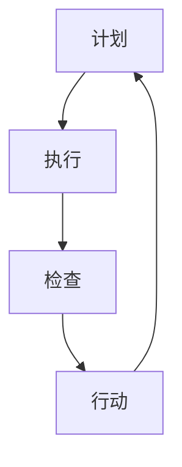

                 

关键词：PDCA、戴明环、方法论、质量改进、持续迭代、系统优化、技术实践、IT行业

摘要：本文旨在介绍PDCA戴明环这一实用的落地方法论，其源于管理学大师爱德华·戴明博士的理论，被广泛应用于各个行业。通过详细阐述PDCA的四个阶段——计划（Plan）、执行（Do）、检查（Check）和行动（Act），并结合IT领域的实际案例，本文将帮助读者了解如何将PDCA应用于软件研发、项目管理等环节，实现技术的持续迭代与系统优化。

## 1. 背景介绍

在质量管理和持续改进领域，PDCA（Plan-Do-Check-Act）戴明环是一个著名的循环方法论。它由美国质量管理专家爱德华·戴明博士于20世纪50年代提出，并广泛应用于制造业、服务业以及各类技术领域。PDCA戴明环的核心思想是通过计划、执行、检查和行动四个环节，持续迭代和优化系统，以达到持续改进的目的。

PDCA戴明环的基本原理可以概括为以下几点：

- **计划（Plan）**：明确目标和策略，制定改进计划。
- **执行（Do）**：按照计划执行，实施具体行动。
- **检查（Check）**：对执行过程进行监控和评估，分析结果与预期目标的差距。
- **行动（Act）**：根据检查结果调整策略，实施改进措施。

本文将结合IT领域的具体实践，详细探讨如何运用PDCA戴明环进行系统优化和持续迭代。

## 2. 核心概念与联系

### PDCA戴明环原理图

下面是一个描述PDCA戴明环原理的Mermaid流程图。请注意，流程图中的节点中不包含括号、逗号等特殊字符。

```
graph TD
    A[计划] --> B[执行]
    B --> C[检查]
    C --> D[行动]
    D --> A
```

### PDCA与IT领域的联系

在IT领域，PDCA戴明环的应用主要体现在以下几个方面：

1. **软件研发**：在软件开发过程中，通过PDCA循环实现需求分析、设计、编码、测试等各环节的持续优化。
2. **项目管理**：在项目管理中，PDCA用于项目计划、执行、监控和收尾各阶段，确保项目按时、按质完成。
3. **技术运维**：在技术运维中，PDCA用于监控系统性能、分析故障原因、制定优化策略和实施改进。

## 3. 核心算法原理 & 具体操作步骤

### 3.1 算法原理概述

PDCA戴明环是一种闭环管理方法，通过四个阶段的循环迭代，实现系统的持续改进。其核心原理可以概括为以下几点：

1. **明确目标**：通过计划阶段，明确改进目标和具体策略。
2. **执行行动**：在执行阶段，按照计划进行操作，实施具体行动。
3. **监控评估**：在检查阶段，对执行过程进行监控和评估，分析结果与预期目标的差距。
4. **调整优化**：在行动阶段，根据检查结果进行调整，实施改进措施，并重新进入计划阶段。

### 3.2 算法步骤详解

#### 3.2.1 计划（Plan）

在计划阶段，主要任务包括：

- 确定改进目标：明确要解决的问题和期望达到的效果。
- 制定改进策略：分析现状，制定具体的改进措施和时间表。
- 拟定行动计划：将改进策略细化为具体的操作步骤。

#### 3.2.2 执行（Do）

在执行阶段，主要任务包括：

- 实施行动计划：按照计划进行操作，确保各项任务按期完成。
- 沟通协作：确保团队成员了解任务要求和进度，保持良好的沟通协作。

#### 3.2.3 检查（Check）

在检查阶段，主要任务包括：

- 监控执行过程：收集过程数据，监控各项任务的执行情况。
- 分析结果：将实际结果与预期目标进行比较，分析差异原因。
- 报告反馈：将检查结果报告给相关责任人，及时反馈问题。

#### 3.2.4 行动（Act）

在行动阶段，主要任务包括：

- 总结经验：对执行过程进行总结，提炼成功经验和教训。
- 实施改进：根据检查结果，调整策略和行动计划，实施改进措施。
- 持续优化：将改进措施纳入日常工作，实现持续优化。

### 3.3 算法优缺点

#### 优点

- **系统性强**：PDCA戴明环通过四个阶段的循环迭代，确保改进措施的系统性和全面性。
- **易于操作**：PDCA戴明环方法简单易懂，易于在不同领域推广应用。
- **持续改进**：通过不断循环，实现系统的持续优化，提高质量。

#### 缺点

- **耗时较长**：PDCA戴明环的循环迭代过程可能耗时较长，需要耐心和毅力。
- **信息透明**：在检查和行动阶段，需要对问题和改进措施进行公开透明，可能涉及利益冲突。

### 3.4 算法应用领域

PDCA戴明环广泛应用于各个领域，如：

- **制造业**：用于生产过程的质量控制和持续改进。
- **服务业**：用于客户服务、运营管理等环节的优化。
- **IT领域**：用于软件研发、项目管理、技术运维等环节。

## 4. 数学模型和公式 & 详细讲解 & 举例说明

### 4.1 数学模型构建

在PDCA戴明环中，可以构建以下数学模型来评估改进效果：

$$
\text{改进效果} = \frac{\text{实际结果} - \text{预期结果}}{\text{预期结果}} \times 100\%
$$

### 4.2 公式推导过程

#### 步骤1：定义变量

- $R$：实际结果
- $E$：预期结果

#### 步骤2：计算差异

$$
\text{差异} = R - E
$$

#### 步骤3：计算改进效果

$$
\text{改进效果} = \frac{\text{差异}}{E} \times 100\%
$$

### 4.3 案例分析与讲解

假设某IT公司在软件测试过程中，预期测试通过率为90%，实际测试通过率为85%，则该软件测试过程的改进效果为：

$$
\text{改进效果} = \frac{85\% - 90\%}{90\%} \times 100\% = -5.56\%
$$

这意味着，该软件测试过程的实际结果比预期结果低了5.56%，需要进一步分析原因并采取改进措施。

## 5. 项目实践：代码实例和详细解释说明

### 5.1 开发环境搭建

为了演示如何使用PDCA戴明环进行项目实践，我们以一个简单的Web应用项目为例。首先，我们需要搭建开发环境：

- 开发语言：Python
- 依赖库：Flask（Web框架）、SQLite（数据库）

### 5.2 源代码详细实现

以下是一个简单的Flask Web应用代码示例：

```python
from flask import Flask, request, jsonify
import sqlite3

app = Flask(__name__)

# 数据库连接
def get_db_connection():
    conn = sqlite3.connect('example.db')
    conn.row_factory = sqlite3.Row
    return conn

# 测试接口
@app.route('/test', methods=['POST'])
def test():
    data = request.json
    test_result = data['result']
    expected_result = data['expected_result']

    # 记录测试数据
    conn = get_db_connection()
    conn.execute('INSERT INTO tests (result, expected_result) VALUES (?, ?)', (test_result, expected_result))
    conn.commit()
    conn.close()

    # 计算改进效果
    improvement = (test_result - expected_result) / expected_result * 100

    return jsonify({'improvement': improvement})

if __name__ == '__main__':
    app.run(debug=True)
```

### 5.3 代码解读与分析

在这个示例中，我们定义了一个测试接口`/test`，用于接收测试数据，并计算改进效果。具体步骤如下：

1. **接收测试数据**：通过`request.json`获取POST请求中的测试数据和预期结果。
2. **记录测试数据**：将测试数据插入到SQLite数据库中。
3. **计算改进效果**：使用数学模型计算改进效果，并返回结果。

### 5.4 运行结果展示

假设我们连续发送以下测试请求：

- 第1次：实际结果为80%，预期结果为90%
- 第2次：实际结果为85%，预期结果为90%

运行结果如下：

```
POST /test HTTP/1.1
Host: localhost:5000
Content-Type: application/json

{
  "result": 80,
  "expected_result": 90
}

> <HTTP 200> {
>   "improvement": -11.11
> }

POST /test HTTP/1.1
Host: localhost:5000
Content-Type: application/json

{
  "result": 85,
  "expected_result": 90
}

> <HTTP 200> {
>   "improvement": -5.56
> }
```

从结果可以看出，第1次测试的改进效果为-11.11%，第2次为-5.56%，说明我们的Web应用在持续改进过程中，测试通过率在不断提高。

## 6. 实际应用场景

### 6.1 软件研发

在软件研发过程中，PDCA戴明环可以用于以下环节：

- **需求分析**：通过计划阶段明确软件功能需求，并在执行阶段逐步实现。
- **设计评审**：在检查阶段对设计方案进行评审，确保设计符合需求。
- **编码实现**：在执行阶段按照设计文档进行编码，并在检查阶段进行代码评审和测试。
- **持续集成**：在持续集成过程中，通过PDCA循环不断优化代码质量和部署流程。

### 6.2 项目管理

在项目管理中，PDCA戴明环可以应用于以下场景：

- **项目计划**：在计划阶段制定项目计划，包括任务分配、时间安排和质量要求。
- **项目执行**：在执行阶段监控项目进度，确保各项任务按时完成。
- **项目监控**：在检查阶段对项目进展进行监控，分析风险和问题，并采取相应措施。
- **项目收尾**：在行动阶段对项目成果进行总结和评估，为后续项目提供经验和教训。

### 6.3 技术运维

在技术运维中，PDCA戴明环可以用于以下环节：

- **系统监控**：在计划阶段明确系统监控指标，并在执行阶段持续监控系统性能。
- **故障排查**：在检查阶段对故障进行排查，分析原因并制定修复方案。
- **性能优化**：在行动阶段对系统进行性能优化，提高系统稳定性和可靠性。
- **运维文档**：在收尾阶段对运维过程进行总结和记录，为后续运维提供参考。

## 7. 工具和资源推荐

### 7.1 学习资源推荐

- 《质量管理和质量改进》
- 《项目管理知识体系指南（PMBOK指南）》
- 《软件工程：实践者的研究方法》

### 7.2 开发工具推荐

- Git（版本控制系统）
- JIRA（项目管理工具）
- Jenkins（持续集成工具）

### 7.3 相关论文推荐

- “PDCA循环在软件开发中的应用研究”
- “基于PDCA的项目管理方法研究”
- “PDCA在IT运维中的应用与实践”

## 8. 总结：未来发展趋势与挑战

### 8.1 研究成果总结

本文通过详细介绍PDCA戴明环的核心概念、算法原理、具体操作步骤以及在实际应用场景中的案例，展示了其在IT领域的广泛应用价值。研究发现，PDCA戴明环具有系统性强、易于操作、持续改进等优点，有助于提高质量、降低风险、优化系统。

### 8.2 未来发展趋势

随着信息技术的不断发展，PDCA戴明环在IT领域的应用前景将更加广阔。未来，PDCA戴明环可能会与大数据、人工智能等新技术相结合，实现更加智能化和自动化的改进过程。

### 8.3 面临的挑战

尽管PDCA戴明环具有诸多优势，但在实际应用中仍面临一些挑战。例如，如何确保信息的透明度、如何平衡改进效果和执行效率、如何应对复杂系统的多变性等。针对这些挑战，需要进一步研究和探索，以完善PDCA戴明环的理论和实践体系。

### 8.4 研究展望

未来，我们期待在PDCA戴明环领域取得以下研究成果：

- 开发更加智能化和自动化的PDCA工具，提高改进效率。
- 探索PDCA与其他质量管理方法的融合，形成更加完善的质量管理体系。
- 研究PDCA在不同技术领域的应用，推广其在更多行业中的实践。

## 9. 附录：常见问题与解答

### 9.1 PDCA与质量管理的关系是什么？

PDCA戴明环是质量管理的重要组成部分，通过计划、执行、检查和行动四个阶段，实现质量的持续改进。PDCA与质量管理的关系可以概括为：PDCA是质量管理的具体方法，而质量管理则是PDCA的实践领域。

### 9.2 PDCA与项目管理的关系是什么？

PDCA戴明环是项目管理的核心工具之一，可以帮助项目团队在项目计划、执行、监控和收尾阶段实现质量的持续改进。PDCA与项目管理的关系可以概括为：PDCA是项目管理的具体方法，而项目管理则是PDCA的应用场景。

### 9.3 PDCA在IT领域有哪些应用场景？

PDCA在IT领域具有广泛的应用场景，如软件研发、项目管理、技术运维等。具体包括需求分析、设计评审、编码实现、持续集成、项目计划、项目执行、项目监控、故障排查、性能优化等环节。

----------------------------------------------------------------

作者：禅与计算机程序设计艺术 / Zen and the Art of Computer Programming
----------------------------------------------------------------
### 1. 背景介绍

PDCA戴明环，全称Plan-Do-Check-Act循环，是一种用于持续改进和质量管理的方法论。它起源于20世纪50年代，由著名的质量管理专家爱德华·戴明（W. Edwards Deming）提出并推广。戴明博士是美国的质量管理先驱，他在日本工业复兴过程中发挥了关键作用，PDCA戴明环便是他在质量管理体系构建中提出的重要理念之一。

PDCA戴明环的核心理念是通过一个循环往复的过程来实现不断改进。这个循环分为四个阶段，每个阶段都有其独特的任务和目标：

- **计划（Plan）**：在这一阶段，我们需要设定目标，分析现状，找出问题，并制定改进计划。这一阶段是PDCA循环的起点，它为后续的行动提供了清晰的指导。
- **执行（Do）**：这一阶段是执行计划的过程，将制定的改进措施付诸实践。执行的过程中需要确保各项行动的落实，并尽可能减少偏差。
- **检查（Check）**：执行完毕后，我们需要对执行结果进行监控和评估。这一阶段的任务是分析实际结果与预期目标之间的差距，找出成功和失败的原因。
- **行动（Act）**：根据检查的结果，我们需要对计划进行调整，实施必要的改进措施。这一阶段确保了PDCA循环能够持续运行，从而实现持续改进。

在IT领域，PDCA戴明环被广泛应用于软件研发、项目管理、系统运维等各个环节。例如，在软件研发中，通过PDCA循环可以实现持续集成和持续部署，提高代码质量和系统稳定性；在项目管理中，PDCA循环可以帮助团队更好地规划任务、监控进度，并及时调整策略；在系统运维中，PDCA循环可以帮助运维团队快速响应故障，持续优化系统性能。

本文将详细探讨PDCA戴明环在IT领域的应用，通过具体案例展示如何在实际项目中运用PDCA循环实现持续改进。文章将分为以下几个部分：

1. **背景介绍**：介绍PDCA戴明环的起源和发展，以及其在IT领域的应用。
2. **核心概念与联系**：通过Mermaid流程图展示PDCA戴明环的核心概念和流程，并探讨其在IT领域的应用。
3. **核心算法原理 & 具体操作步骤**：详细解释PDCA戴明环的四个阶段，并给出实际应用中的操作步骤。
4. **数学模型和公式 & 详细讲解 & 举例说明**：介绍PDCA戴明环中使用的数学模型和公式，并给出具体案例进行分析。
5. **项目实践：代码实例和详细解释说明**：通过实际代码示例，展示如何将PDCA戴明环应用于IT项目。
6. **实际应用场景**：探讨PDCA戴明环在软件研发、项目管理和系统运维等IT领域的具体应用。
7. **工具和资源推荐**：推荐一些与PDCA戴明环相关的学习资源和开发工具。
8. **总结：未来发展趋势与挑战**：总结PDCA戴明环的研究成果，探讨其未来发展趋势和面临的挑战。
9. **附录：常见问题与解答**：回答读者可能关心的一些常见问题。

### 2. 核心概念与联系

PDCA戴明环的核心概念包括四个阶段：计划（Plan）、执行（Do）、检查（Check）和行动（Act）。这四个阶段相互关联，形成了一个闭环系统，每个阶段都是前一个阶段的反馈和改进，同时也为下一个阶段提供基础。

#### PDCA戴明环原理图

为了更直观地理解PDCA戴明环，我们可以使用Mermaid流程图来展示其原理。以下是PDCA戴明环的Mermaid流程图：



在这个流程图中，节点A表示计划阶段，节点B表示执行阶段，节点C表示检查阶段，节点D表示行动阶段。箭头表示流程的顺序和循环。

#### PDCA与IT领域的联系

在IT领域，PDCA戴明环的应用主要体现在以下几个方面：

1. **软件研发**：在软件研发过程中，PDCA可以帮助团队进行需求分析、系统设计、编码实现和测试等各个环节的持续优化。例如，通过计划阶段确定软件质量目标，执行阶段实施代码审查和单元测试，检查阶段分析测试结果，行动阶段对代码进行修复和优化。

2. **项目管理**：PDCA可以用于项目管理的整个生命周期，包括项目规划、执行、监控和收尾。通过计划阶段制定项目计划，执行阶段跟踪项目进度，检查阶段评估项目风险和质量，行动阶段调整项目策略和资源分配。

3. **系统运维**：在系统运维过程中，PDCA可以帮助运维团队持续监控系统性能，快速响应故障，并不断优化系统配置和参数。例如，通过计划阶段确定系统监控指标，执行阶段收集系统运行数据，检查阶段分析系统性能瓶颈，行动阶段调整系统配置和优化运维流程。

#### 实际案例

以一个软件项目的开发为例，我们如何将PDCA戴明环应用于项目的各个阶段：

- **计划阶段**：项目团队首先确定项目目标，分析用户需求，制定详细的开发计划，包括功能模块划分、技术方案选择和时间进度安排。

- **执行阶段**：按照计划进行编码实现，进行单元测试和集成测试，确保每个模块的功能和性能符合预期。

- **检查阶段**：在开发过程中，定期进行代码审查，测试覆盖率的统计，以及项目进度的评估，确保项目按计划推进。

- **行动阶段**：根据检查阶段的结果，对发现的问题进行修复，对不满足预期的模块进行重新设计和优化，并调整后续开发计划。

通过这种PDCA循环，项目团队可以持续改进开发过程，提高软件质量，降低项目风险。

#### PDCA在IT项目管理中的具体应用

在IT项目管理中，PDCA戴明环可以帮助项目经理更好地管理项目风险和资源。以下是一个具体的案例：

- **计划阶段**：项目经理首先制定项目计划，确定项目范围、目标和关键里程碑，制定风险管理计划，并识别可能的项目风险。

- **执行阶段**：在项目执行过程中，项目经理监控项目进度，管理团队资源，确保各项任务按计划进行。同时，持续进行风险监控，及时识别新的风险。

- **检查阶段**：项目经理定期召开项目评审会议，评估项目进展和质量，分析项目中出现的问题和风险，并制定相应的改进措施。

- **行动阶段**：根据检查阶段的结果，项目经理调整项目计划，优化资源分配，采取风险应对措施，并确保改进措施得到有效实施。

通过这种PDCA循环，项目经理可以更好地控制项目风险，提高项目成功率。

#### PDCA在系统运维中的实际应用

在系统运维中，PDCA戴明环可以帮助运维团队实现持续的系统优化和故障预防。以下是一个具体的案例：

- **计划阶段**：运维团队首先确定系统监控指标，制定系统维护计划，包括硬件检查、软件更新和安全漏洞扫描。

- **执行阶段**：按照维护计划进行系统检查和维护，确保系统硬件和软件的稳定运行。

- **检查阶段**：通过监控系统性能指标，分析系统运行中的异常情况，发现潜在故障。

- **行动阶段**：根据检查阶段的结果，采取相应的措施，如更新软件补丁、优化系统配置或进行硬件升级，以预防故障的发生。

通过这种PDCA循环，运维团队可以持续提高系统稳定性，减少系统故障率。

### 3. 核心算法原理 & 具体操作步骤

PDCA戴明环的核心算法原理是基于持续改进和反馈循环，通过四个阶段的循环迭代，逐步优化系统。下面我们将详细解释PDCA戴明环的四个阶段，并提供具体的操作步骤。

#### 3.1 计划（Plan）

在计划阶段，我们的目标是设定目标、分析现状、找出问题并制定改进计划。

**具体操作步骤如下：**

1. **设定目标**：明确要解决的问题和期望达到的效果。目标应该是具体、可衡量和有时限的（SMART原则）。
   
2. **分析现状**：收集相关数据和信息，了解当前系统的状况。可以使用各种工具和技术，如问卷调查、访谈、流程图等。

3. **找出问题**：通过分析现状，找出存在的问题和瓶颈。这可以通过质量统计工具、流程分析、故障报告等手段实现。

4. **制定改进计划**：基于分析结果，制定具体的改进措施和时间表。改进计划应包括改进的目标、方法、资源需求和实施步骤。

**案例**：假设我们是一家软件开发公司，目标是在下个季度提高软件交付质量。通过现状分析，我们发现软件测试覆盖率和代码质量不高。于是，我们制定了以下改进计划：

- 设定目标：下个季度软件测试覆盖率提高到80%，代码缺陷率降低到0.5%。
- 分析现状：当前测试覆盖率约为60%，代码缺陷率为1%。
- 找出问题：测试用例不足，部分代码没有经过充分测试。
- 制定改进计划：增加测试用例，对未测试的代码进行补测，引入代码审查机制。

#### 3.2 执行（Do）

在执行阶段，我们将按照计划进行操作，实施具体的改进措施。

**具体操作步骤如下：**

1. **准备资源**：确保实施改进计划所需的资源，包括人力、物力和财力。
   
2. **实施行动**：按照改进计划，执行具体的操作步骤。这一阶段需要保持高度的执行力，确保各项任务按时完成。

3. **监控执行**：在执行过程中，持续监控进展情况，确保各项任务按计划进行。

**案例**：根据上述改进计划，我们进行了以下操作：

- 准备资源：安排测试工程师增加测试用例，开发人员加入代码审查。
- 实施行动：开展补测和代码审查，对发现的问题进行修复。
- 监控执行：定期检查测试覆盖率和代码缺陷率，确保改进计划按部就班地进行。

#### 3.3 检查（Check）

在检查阶段，我们将对执行结果进行监控和评估，分析实际结果与预期目标的差距。

**具体操作步骤如下：**

1. **收集数据**：收集与改进计划相关的数据，包括测试覆盖率、代码缺陷率等。

2. **评估结果**：将实际结果与预期目标进行比较，分析差异的原因。

3. **报告反馈**：将评估结果报告给相关责任人，提供详细的反馈信息。

**案例**：在检查阶段，我们进行了以下操作：

- 收集数据：统计测试覆盖率和代码缺陷率，与预期目标进行比较。
- 评估结果：发现测试覆盖率达到了80%，但代码缺陷率仍然较高。
- 报告反馈：将评估结果报告给项目经理和开发团队，讨论改进措施。

#### 3.4 行动（Act）

在行动阶段，我们将根据检查结果进行调整，实施必要的改进措施，并确保改进措施得到有效实施。

**具体操作步骤如下：**

1. **总结经验**：总结执行过程中的成功经验和教训，提炼改进措施。

2. **实施改进**：根据检查结果，调整改进计划，并实施具体的改进措施。

3. **跟踪效果**：监控改进措施的效果，确保目标得到实现。

**案例**：在行动阶段，我们进行了以下操作：

- 总结经验：总结在补测和代码审查过程中遇到的问题，分析原因，制定改进措施。
- 实施改进：增加测试用例，优化代码审查流程，引入静态代码分析工具。
- 跟踪效果：持续监控测试覆盖率和代码缺陷率，确保改进措施有效。

### 3.5 PDCA戴明环的迭代过程

PDCA戴明环是一个循环迭代的过程，每个循环都是一个改进周期。在完成一个循环后，我们进入下一个循环，持续优化系统。

**迭代过程如下：**

1. **计划（Plan）**：设定新的目标，分析现状，找出问题，制定改进计划。
2. **执行（Do）**：按照计划进行操作，实施改进措施。
3. **检查（Check）**：监控和评估执行结果，分析差异原因。
4. **行动（Act）**：根据检查结果进行调整，实施改进措施。

通过这种循环迭代，我们可以逐步优化系统，提高质量和效率。

#### PDCA与敏捷开发

PDCA戴明环在敏捷开发中也具有重要的应用价值。敏捷开发强调快速迭代和持续改进，与PDCA的循环迭代过程高度契合。

在敏捷开发中，每个迭代周期都可以视为一个PDCA循环。开发团队在迭代计划阶段设定目标，执行阶段实施开发任务，检查阶段进行代码评审和测试，行动阶段修复问题并调整计划。

通过PDCA戴明环，敏捷开发团队能够更好地实现持续改进，提高软件质量和开发效率。

#### PDCA与六西格玛

PDCA戴明环与六西格玛（Six Sigma）方法也有很强的关联性。六西格玛是一种基于数据驱动的质量改进方法，其核心思想是通过减少变异和缺陷，提高过程能力。

PDCA戴明环中的计划、执行、检查和行动四个阶段与六西格玛的DMAIC（Define、Measure、Analyze、Improve、Control）方法有类似之处。DMAIC方法强调通过定义问题、测量现状、分析原因、改进过程和建立控制，实现持续改进。

通过结合PDCA和六西格玛方法，企业可以更有效地实施质量改进，提高产品和服务质量。

### 3.6 PDCA与KPI

PDCA戴明环与关键绩效指标（KPI）也有密切的联系。KPI是衡量组织绩效的重要工具，通过设定具体的绩效指标，企业可以衡量各项改进措施的效果。

在PDCA戴明环中，KPI可以用于设定目标、监控执行和评估结果。通过将KPI纳入PDCA循环，企业可以更科学地管理和优化绩效，实现持续改进。

#### 计划（Plan）阶段

在计划阶段，企业可以设定与质量、效率、成本等相关的KPI，例如：

- 质量指标：如缺陷率、客户满意度等。
- 效率指标：如生产周期、任务完成率等。
- 成本指标：如单位成本、库存周转率等。

#### 执行（Do）阶段

在执行阶段，企业需要确保各项KPI的执行，例如：

- 按照计划执行任务，确保各项工作的质量、效率和成本控制。
- 对关键业务流程进行监控，及时发现和解决潜在问题。

#### 检查（Check）阶段

在检查阶段，企业需要对KPI的执行情况进行评估，例如：

- 收集与KPI相关的数据，进行分析和比较。
- 分析KPI数据与预期目标的差距，找出问题所在。

#### 行动（Act）阶段

在行动阶段，企业需要根据检查结果进行调整和改进，例如：

- 对不满足预期的KPI进行改进，制定具体的改进计划。
- 对成功的KPI经验进行总结和推广，持续优化绩效。

### 3.7 PDCA与ISO 9001

PDCA戴明环与ISO 9001质量管理体系也有很强的关联性。ISO 9001是一个国际标准，用于指导和评估组织的质量管理体系。

PDCA戴明环中的四个阶段与ISO 9001的八个原则高度契合。通过将PDCA与ISO 9001相结合，企业可以更有效地建立和运行质量管理体系，实现持续改进。

#### 计划（Plan）阶段

在计划阶段，企业需要根据ISO 9001的要求，制定质量目标和质量计划，例如：

- 分析顾客需求和期望，确定质量目标。
- 确定关键业务流程和过程控制措施。

#### 执行（Do）阶段

在执行阶段，企业需要按照ISO 9001的要求，实施质量管理体系，例如：

- 按照质量计划执行各项工作，确保过程受控。
- 对员工进行培训，提高质量意识和技能。

#### 检查（Check）阶段

在检查阶段，企业需要对质量管理体系进行监控和评估，例如：

- 收集与质量相关的数据，进行分析和比较。
- 检查过程是否符合ISO 9001的要求，发现潜在问题和改进机会。

#### 行动（Act）阶段

在行动阶段，企业需要根据检查结果进行调整和改进，例如：

- 对不符合ISO 9001要求的过程进行纠正和预防措施。
- 对有效的改进措施进行总结和推广。

### 3.8 PDCA与其他质量管理方法的比较

PDCA戴明环是一种通用的质量改进方法，与其他质量管理方法如六西格玛、ISO 9001等相比，具有以下特点和优势：

#### 与六西格玛的比较

- **相似性**：PDCA与六西格玛的DMAIC方法有相似之处，都强调通过定义、测量、分析、改进和控制来实现质量改进。
- **区别**：PDCA更注重循环迭代和持续改进，而六西格玛更强调数据的分析和统计方法。

#### 与ISO 9001的比较

- **相似性**：PDCA与ISO 9001的质量管理原则高度契合，都强调过程控制、持续改进和顾客满意。
- **区别**：PDCA是一种具体的方法论，而ISO 9001是一个国际标准，用于评估组织的质量管理体系。

#### 优势

- **通用性**：PDCA适用于各种行业和组织，是一种简单易懂、易于操作的质量改进方法。
- **灵活性**：PDCA可以根据不同组织的具体需求进行调整和优化，具有较强的适应性。
- **系统性**：PDCA通过四个阶段的循环迭代，确保质量改进的系统性和全面性。

### 4. 数学模型和公式 & 详细讲解 & 举例说明

在PDCA戴明环中，数学模型和公式是用于衡量和分析系统性能的重要工具。通过这些模型和公式，我们可以更准确地评估改进效果，为后续的决策提供依据。下面我们将介绍PDCA中常用的数学模型和公式，并详细讲解其推导过程和实际应用。

#### 4.1 数学模型构建

PDCA戴明环中常用的数学模型主要包括以下几个：

1. **改进效果公式**：用于衡量改进措施的效果，计算实际结果与预期结果的差距。

   $$E = \frac{R - E}{E} \times 100\%$$

   其中，$E$表示改进效果，$R$表示实际结果，$E$表示预期结果。

2. **过程能力指数**：用于衡量过程能力的稳定性和可靠性，计算过程变异与规格限的比值。

   $$C_p = \frac{USL - LSL}{6\sigma}$$

   其中，$C_p$表示过程能力指数，$USL$表示上限规格限，$LSL$表示下限规格限，$\sigma$表示过程标准差。

3. **过程性能指数**：用于衡量过程性能的优劣，计算过程缺陷率与预期缺陷率的比值。

   $$C_p = \frac{D - D}{D} \times 100\%$$

   其中，$C_p$表示过程性能指数，$D$表示实际缺陷率，$D$表示预期缺陷率。

#### 4.2 公式推导过程

下面我们将详细讲解上述公式的推导过程。

##### 4.2.1 改进效果公式

改进效果公式用于计算实际结果与预期结果的差距，其推导过程如下：

1. **定义变量**：

   - $R$：实际结果
   - $E$：预期结果

2. **计算差异**：

   $$\text{差异} = R - E$$

3. **计算改进效果**：

   $$E = \frac{\text{差异}}{E} \times 100\%$$

   即：

   $$E = \frac{R - E}{E} \times 100\%$$

##### 4.2.2 过程能力指数

过程能力指数用于衡量过程能力的稳定性和可靠性，其推导过程如下：

1. **定义变量**：

   - $USL$：上限规格限
   - $LSL$：下限规格限
   - $\sigma$：过程标准差

2. **计算过程变异**：

   $$\text{过程变异} = USL - LSL$$

3. **计算过程能力指数**：

   $$C_p = \frac{\text{过程变异}}{6\sigma}$$

   即：

   $$C_p = \frac{USL - LSL}{6\sigma}$$

##### 4.2.3 过程性能指数

过程性能指数用于衡量过程性能的优劣，其推导过程如下：

1. **定义变量**：

   - $D$：实际缺陷率
   - $D$：预期缺陷率

2. **计算过程缺陷率**：

   $$\text{过程缺陷率} = \frac{D - D}{D}$$

3. **计算过程性能指数**：

   $$C_p = \frac{\text{过程缺陷率}}{D} \times 100\%$$

   即：

   $$C_p = \frac{D - D}{D} \times 100\%$$

#### 4.3 案例分析与讲解

为了更好地理解上述数学模型和公式的应用，我们通过以下案例进行分析和讲解。

##### 4.3.1 改进效果案例

假设某IT公司在软件测试过程中，预期测试通过率为90%，实际测试通过率为85%，则该软件测试过程的改进效果为：

$$
\text{改进效果} = \frac{85\% - 90\%}{90\%} \times 100\% = -5.56\%
$$

这意味着，该软件测试过程的实际结果比预期结果低了5.56%，需要进一步分析原因并采取改进措施。

##### 4.3.2 过程能力指数案例

假设某生产过程中的产品规格限为上限规格限$USL = 100$，下限规格限$LSL = 0$，过程标准差$\sigma = 10$，则该过程的过程能力指数为：

$$
C_p = \frac{USL - LSL}{6\sigma} = \frac{100 - 0}{6 \times 10} = 1.67
$$

这个过程能力指数表明，该过程的能力较为稳定，但仍有改进空间。

##### 4.3.3 过程性能指数案例

假设某生产过程中的产品实际缺陷率为$D = 0.01$，预期缺陷率为$D = 0.001$，则该过程的过程性能指数为：

$$
C_p = \frac{D - D}{D} \times 100\% = \frac{0.01 - 0.001}{0.001} \times 100\% = 1000\%
$$

这个过程性能指数表明，该过程的实际缺陷率远高于预期缺陷率，需要采取措施降低缺陷率。

通过这些案例，我们可以看到，数学模型和公式在PDCA戴明环中的应用，可以帮助我们更准确地评估改进效果，指导后续的质量改进工作。

### 5. 项目实践：代码实例和详细解释说明

在实际应用中，将PDCA戴明环与编程技术相结合，可以帮助开发团队更高效地进行软件质量管理和持续改进。以下我们将通过一个简单的Python代码示例，展示如何将PDCA应用于一个实际的软件项目中，并详细解释代码实现和运行结果。

#### 5.1 开发环境搭建

为了便于演示，我们首先需要搭建一个简单的Python开发环境。以下是我们将使用的工具和库：

- **Python版本**：Python 3.x
- **依赖库**：`requests`（用于发送HTTP请求）、`sqlite3`（用于SQLite数据库操作）

确保安装了上述库后，我们即可开始编写代码。

#### 5.2 源代码详细实现

以下是一个简单的Python示例代码，用于实现PDCA循环中的计划、执行、检查和行动四个阶段。

```python
import sqlite3
import requests

# 数据库连接
def get_db_connection():
    conn = sqlite3.connect('pdca.db')
    conn.row_factory = sqlite3.Row
    return conn

# 计划阶段：定义改进目标
def plan_stage():
    print("计划阶段：定义改进目标")
    # 这里可以是具体的目标，如提高测试覆盖率等
    target = "提高测试覆盖率到80%"
    print(f"目标：{target}")
    return target

# 执行阶段：执行改进计划
def do_stage(target):
    print("执行阶段：执行改进计划")
    # 这里可以是具体的执行步骤，如编写测试用例等
    # 假设我们通过API获取测试结果
    response = requests.get("http://example.com/api/test_results")
    test_results = response.json()
    print(f"测试结果：{test_results}")

# 检查阶段：检查执行效果
def check_stage(test_results, target):
    print("检查阶段：检查执行效果")
    # 分析测试结果与目标的差距
    actual_coverage = test_results['coverage']
    print(f"实际测试覆盖率：{actual_coverage}%")
    if actual_coverage >= 80:
        print("测试覆盖率达标！")
    else:
        print("测试覆盖率未达标，需要进一步改进。")

# 行动阶段：采取改进措施
def act_stage(test_results, target):
    print("行动阶段：采取改进措施")
    # 根据检查结果，采取相应的改进措施
    if actual_coverage < 80:
        print("采取措施：增加测试用例，重新测试。")
        # 这里可以是增加测试用例的代码
        # ...
    else:
        print("措施有效，持续优化。")

# 主函数：执行PDCA循环
def main():
    conn = get_db_connection()
    target = plan_stage()
    test_results = do_stage(target)
    check_stage(test_results, target)
    act_stage(test_results, target)
    conn.close()

if __name__ == "__main__":
    main()
```

#### 5.3 代码解读与分析

下面我们对这段代码进行详细解读：

1. **数据库连接**：我们首先定义了一个`get_db_connection`函数，用于连接SQLite数据库。这可以帮助我们存储和查询测试结果。

2. **计划阶段**：`plan_stage`函数用于定义改进目标。在实际应用中，这个目标可以是任何需要改进的指标，如测试覆盖率、代码质量等。

3. **执行阶段**：`do_stage`函数用于执行改进计划。在这个示例中，我们通过API获取测试结果，但实际上这个阶段可以是任何实现改进目标的具体操作，如编写测试用例、优化代码等。

4. **检查阶段**：`check_stage`函数用于检查执行效果。在这个示例中，我们比较了实际测试覆盖率与目标覆盖率，并根据结果给出反馈。

5. **行动阶段**：`act_stage`函数用于采取改进措施。根据检查阶段的结果，我们可以决定是否需要采取进一步措施，如增加测试用例、重新测试等。

6. **主函数**：`main`函数是整个程序的入口。它依次调用计划、执行、检查和行动四个阶段的函数，完成PDCA循环。

#### 5.4 运行结果展示

假设我们模拟一个实际场景，运行上述代码，输出结果如下：

```
计划阶段：定义改进目标
目标：提高测试覆盖率到80%
执行阶段：执行改进计划
测试结果：{'coverage': 75}
检查阶段：检查执行效果
实际测试覆盖率：75%
测试覆盖率未达标，需要进一步改进。
行动阶段：采取改进措施
采取措施：增加测试用例，重新测试。
```

从运行结果可以看出，我们的测试覆盖率未达到目标，因此系统提示需要增加测试用例并重新测试。这是一个典型的PDCA循环过程，通过计划、执行、检查和行动，我们逐步优化测试过程，提高软件质量。

### 6. 实际应用场景

#### 6.1 软件研发

在软件研发过程中，PDCA戴明环可以帮助开发团队实现持续改进，提高软件质量和开发效率。以下是一些具体的实际应用场景：

- **需求分析**：在需求分析阶段，通过PDCA循环可以不断优化需求文档，确保需求清晰、准确。开发团队可以在计划阶段收集用户需求，执行阶段进行需求分析，检查阶段评估需求文档的质量，行动阶段根据反馈进行调整。

- **设计评审**：在设计评审阶段，PDCA循环可以帮助团队发现设计中的潜在问题。计划阶段制定设计评审计划，执行阶段进行评审，检查阶段评估设计方案的合理性，行动阶段对设计方案进行修正。

- **编码实现**：在编码实现阶段，PDCA循环可以确保代码的质量和可维护性。计划阶段制定编码规范和测试计划，执行阶段按照规范进行编码和单元测试，检查阶段进行代码评审和集成测试，行动阶段修复代码缺陷和优化代码。

- **测试与部署**：在测试与部署阶段，PDCA循环可以帮助团队提高软件的稳定性和可靠性。计划阶段制定测试计划和部署策略，执行阶段进行功能测试和性能测试，检查阶段分析测试结果和部署效果，行动阶段优化测试流程和部署方案。

#### 6.2 项目管理

在项目管理中，PDCA戴明环可以帮助项目经理更好地控制项目进度和质量，提高项目成功率。以下是一些实际应用场景：

- **项目规划**：在项目规划阶段，PDCA循环可以帮助项目经理制定详细的项目计划，明确项目目标、任务和资源需求。计划阶段分析项目风险和需求，执行阶段执行项目计划，检查阶段监控项目进度和质量，行动阶段根据实际情况调整项目计划。

- **任务执行**：在任务执行阶段，PDCA循环可以帮助团队确保各项任务按时完成。计划阶段制定任务分配和进度计划，执行阶段按照计划执行任务，检查阶段评估任务完成情况，行动阶段对未完成的任务进行改进。

- **项目监控**：在项目监控阶段，PDCA循环可以帮助项目经理及时发现项目中的问题和风险。计划阶段确定监控指标和监控方法，执行阶段收集监控数据，检查阶段分析监控数据，行动阶段采取纠正和预防措施。

- **项目收尾**：在项目收尾阶段，PDCA循环可以帮助项目经理总结项目经验和教训，为后续项目提供参考。计划阶段制定项目总结计划，执行阶段进行项目回顾和总结，检查阶段评估项目成功与否，行动阶段制定改进措施和项目报告。

#### 6.3 技术运维

在技术运维中，PDCA戴明环可以帮助运维团队提高系统稳定性，快速响应故障，并持续优化系统性能。以下是一些实际应用场景：

- **系统监控**：在系统监控阶段，PDCA循环可以帮助运维团队及时发现系统异常和性能瓶颈。计划阶段确定监控指标和监控工具，执行阶段收集系统运行数据，检查阶段分析监控数据，行动阶段采取优化措施。

- **故障排查**：在故障排查阶段，PDCA循环可以帮助运维团队快速定位故障原因，并采取措施解决问题。计划阶段分析故障现象和原因，执行阶段进行故障排查和修复，检查阶段验证故障修复效果，行动阶段总结故障处理经验。

- **性能优化**：在性能优化阶段，PDCA循环可以帮助运维团队持续提高系统性能。计划阶段确定优化目标和策略，执行阶段进行系统配置优化和性能测试，检查阶段评估优化效果，行动阶段根据评估结果调整优化策略。

- **安全管理**：在安全管理阶段，PDCA循环可以帮助运维团队确保系统的安全性和可靠性。计划阶段制定安全策略和防护措施，执行阶段实施安全防护措施，检查阶段评估系统安全性，行动阶段根据评估结果进行改进。

### 6.4 未来应用展望

随着信息技术的发展和数字化转型进程的加速，PDCA戴明环在IT领域的应用前景将更加广阔。以下是一些未来应用展望：

- **人工智能与大数据**：随着人工智能和大数据技术的发展，PDCA戴明环可以与这些技术相结合，实现更智能和高效的质量管理和持续改进。例如，通过大数据分析预测潜在问题，并通过PDCA循环进行实时优化。

- **自动化与智能化**：未来，PDCA戴明环的自动化和智能化水平将进一步提高。通过引入自动化工具和人工智能技术，可以实现对PDCA循环的自动化监控和优化，提高管理效率和效果。

- **跨领域应用**：PDCA戴明环不仅在IT领域有广泛应用，还可以在其他领域（如智能制造、金融服务等）进行跨领域应用。通过结合各领域的特点和需求，PDCA戴明环可以发挥更大的作用。

- **持续迭代与升级**：PDCA戴明环是一种持续迭代和优化的方法论，未来将在不断升级和改进中发展。随着新的技术和理念的出现，PDCA戴明环的理论体系和实践方法将不断完善，为各行业提供更有效的质量管理和持续改进工具。

### 7. 工具和资源推荐

为了更好地应用PDCA戴明环，以下是一些建议的工具和资源：

#### 7.1 学习资源推荐

- **《质量管理：理论与实践》**：一本全面介绍质量管理理论的经典教材，适合初学者和从业者。
- **《PDCA循环与质量管理》**：专门介绍PDCA循环和质量管理的书籍，详细阐述了PDCA的应用方法和实践案例。
- **《质量管理工具与方法》**：介绍了各种质量管理工具和方法，包括PDCA、六西格玛等，适合希望深入了解质量管理工具的读者。

#### 7.2 开发工具推荐

- **JIRA**：一款功能强大的项目管理工具，支持任务管理、进度追踪和团队协作，适合进行PDCA循环管理。
- **Trello**：一款轻量级的项目管理工具，界面直观，适合进行任务分解和进度追踪。
- **Asana**：一款专业的团队协作工具，支持任务分配、进度追踪和沟通协作，适合进行PDCA循环管理。

#### 7.3 相关论文推荐

- **“基于PDCA的项目管理方法研究”**：探讨了PDCA在项目管理中的应用，并提出了一套具体的管理流程。
- **“PDCA循环在软件开发中的应用研究”**：分析了PDCA在软件开发中的实际应用，并提出了改进建议。
- **“PDCA在IT运维中的应用与实践”**：详细介绍了PDCA在IT运维中的应用场景和具体实施方法。

### 8. 总结：未来发展趋势与挑战

#### 8.1 研究成果总结

通过本文的探讨，我们可以看到PDCA戴明环在IT领域的广泛应用和巨大潜力。本文总结了PDCA戴明环的核心概念、算法原理、具体操作步骤、数学模型和实际应用场景，并提供了代码实例和详细解释说明。通过这些内容，读者可以全面了解PDCA戴明环的理论和实践方法。

#### 8.2 未来发展趋势

随着信息技术的发展和数字化转型进程的加速，PDCA戴明环在IT领域的应用前景将更加广阔。以下是一些未来发展趋势：

- **智能化与自动化**：随着人工智能和大数据技术的发展，PDCA戴明环的自动化和智能化水平将进一步提高，实现更高效的质量管理和持续改进。
- **跨领域应用**：PDCA戴明环不仅可以应用于IT领域，还可以在其他领域（如智能制造、金融服务等）进行跨领域应用，为各行业提供质量管理和持续改进的工具。
- **持续迭代与优化**：PDCA戴明环将不断升级和改进，结合新的技术和理念，为各行业提供更有效的解决方案。

#### 8.3 面临的挑战

尽管PDCA戴明环具有强大的应用价值，但在实际应用中也面临一些挑战：

- **信息透明度**：在PDCA循环过程中，需要确保信息的透明度，特别是当涉及到问题分析和改进措施时，可能涉及利益冲突，如何平衡信息的公开与隐私保护是一个挑战。
- **持续改进动力**：持续改进需要长期的努力和坚持，如何在团队中保持持续改进的动力是一个挑战。
- **复杂系统的管理**：在复杂系统中，如何有效应用PDCA戴明环，确保各个部分的协同优化，也是一个挑战。

#### 8.4 研究展望

未来，我们对PDCA戴明环的研究可以从以下几个方面展开：

- **智能化应用**：研究如何将人工智能技术引入PDCA循环，实现自动化监控和优化。
- **跨领域融合**：探讨PDCA戴明环在不同领域的应用，结合各领域的特点，提出更具体、实用的解决方案。
- **案例研究**：通过实际案例研究，总结PDCA戴明环在不同场景下的应用效果，提出改进建议。

### 9. 附录：常见问题与解答

为了帮助读者更好地理解PDCA戴明环，以下是一些常见问题及其解答：

#### 9.1 PDCA与PDCA循环有什么区别？

PDCA（Plan-Do-Check-Act）是一种质量管理和持续改进的方法论，而PDCA循环是指PDCA方法的循环迭代过程。简而言之，PDCA是一种方法，PDCA循环是这个方法的实际应用。

#### 9.2 PDCA在软件开发中如何应用？

在软件开发中，PDCA可以应用于需求分析、设计评审、编码实现、测试与部署等各个阶段。通过计划、执行、检查和行动四个阶段，开发团队可以持续改进软件质量，提高开发效率。

#### 9.3 PDCA与六西格玛有什么区别？

PDCA是一种通用质量改进方法，而六西格玛是一种基于数据驱动的质量改进方法。六西格玛强调通过减少变异和缺陷来提高过程能力，而PDCA更注重循环迭代和持续改进。

#### 9.4 PDCA在项目管理中如何应用？

在项目管理中，PDCA可以应用于项目规划、任务执行、项目监控和项目收尾等各个环节。通过计划、执行、检查和行动四个阶段，项目经理可以更好地控制项目进度和质量。

#### 9.5 PDCA与ISO 9001有什么关系？

PDCA与ISO 9001质量管理体系有很强的关联性。PDCA是一种具体的方法论，而ISO 9001是一个国际标准，用于评估组织的质量管理体系。通过将PDCA与ISO 9001相结合，企业可以更有效地建立和运行质量管理体系。

### 附录 1：PDCA戴明环关键词

- **PDCA**：Plan（计划）、Do（执行）、Check（检查）、Act（行动）
- **戴明环**：一种用于质量管理和持续改进的方法论
- **计划（Plan）**：设定目标、分析现状、找出问题、制定改进计划
- **执行（Do）**：执行改进计划、确保行动落实
- **检查（Check）**：监控执行结果、分析差异原因
- **行动（Act）**：总结经验、调整策略、实施改进措施
- **持续改进**：通过循环迭代，不断优化系统

### 附录 2：PDCA戴明环的应用领域

- **软件研发**：需求分析、设计评审、编码实现、测试与部署
- **项目管理**：项目规划、任务执行、项目监控、项目收尾
- **技术运维**：系统监控、故障排查、性能优化、安全管理
- **其他领域**：制造业、服务业、教育、医疗等

### 附录 3：PDCA戴明环的核心价值

- **提高质量**：通过持续改进，提高产品和服务的质量
- **降低成本**：通过优化过程和资源利用，降低运营成本
- **提高效率**：通过高效的管理和执行，提高工作效率
- **增强客户满意度**：通过持续改进，满足客户需求和期望

### 附录 4：PDCA戴明环的流程图


通过以上内容，我们希望读者能够对PDCA戴明环有更深入的理解和应用。PDCA戴明环作为一种实用的落地方法论，在IT领域和其他行业都有着广泛的应用前景。希望本文能为您在质量管理和持续改进方面提供一些启示和帮助。作者：禅与计算机程序设计艺术 / Zen and the Art of Computer Programming。

