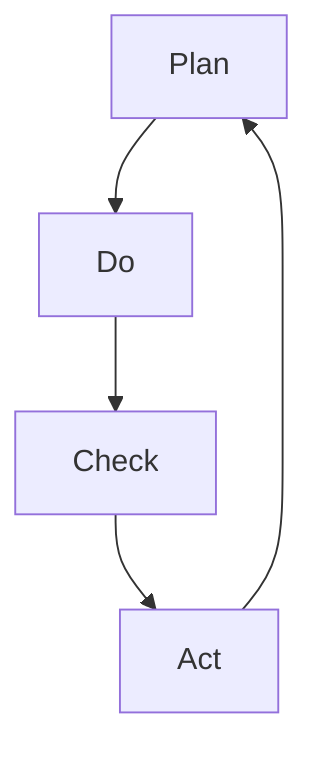

                 

关键词：PDCA循环、持续改进、质量管理、软件工程、项目管理

> 摘要：本文旨在详细介绍PDCA循环（Plan-Do-Check-Act）在IT领域中的应用与实践，通过阐述其核心概念、算法原理、数学模型和具体操作步骤，帮助读者理解并掌握这一有效的持续改进工具。文章将结合实际项目案例，展示PDCA在软件开发、项目管理中的实际应用，并展望其未来的发展趋势与挑战。

## 1. 背景介绍

在当今快速变化的IT行业，持续改进成为企业保持竞争力的重要手段。PDCA循环，也称为戴明循环或计划-执行-检查-行动循环，是一种广泛用于质量管理和其他管理领域的系统化问题解决工具。PDCA循环最早由美国质量管理专家爱德华·戴明提出，它强调通过计划（Plan）、执行（Do）、检查（Check）和行动（Act）四个阶段的循环迭代，实现问题的持续解决和质量的持续提升。

PDCA循环在IT领域的应用尤为广泛，无论是软件开发、系统运维，还是项目管理、团队协作，PDCA都能提供一种结构化的方法，帮助企业或团队在不断的迭代中实现优化和改进。本文将深入探讨PDCA循环在IT领域的应用，帮助读者理解其原理和操作步骤，并通过具体案例展示其实际效果。

## 2. 核心概念与联系

### 2.1. PDCA循环的基本概念

PDCA循环由四个阶段组成，分别是：

- **计划（Plan）**：在这一阶段，需要明确目标和制定实现目标的计划。这通常包括目标设定、资源分配、任务分解和进度安排。
- **执行（Do）**：这一阶段是计划的实施过程。按照计划执行任务，并确保所有活动按部就班地进行。
- **检查（Check）**：在这一阶段，需要对执行的结果进行评估和检查。这包括收集数据、分析结果和与预期目标进行比较。
- **行动（Act）**：基于检查结果，采取必要的行动来纠正问题或持续改进。这包括总结经验、修改计划并实施新的改进措施。

### 2.2. PDCA循环的 Mermaid 流程图



### 2.3. PDCA循环与质量管理的关系

PDCA循环是质量管理的基础工具之一。它通过不断循环迭代，确保质量管理活动的持续改进。PDCA循环中的每个阶段都与质量管理的核心要素紧密相关：

- **计划（Plan）**：确定质量管理目标和制定实现这些目标的计划，是质量管理的基础。
- **执行（Do）**：实施质量管理的具体行动，确保计划的执行。
- **检查（Check）**：评估质量管理活动的效果，确保目标实现。
- **行动（Act）**：基于评估结果，采取纠正和改进措施，持续提升质量管理水平。

## 3. 核心算法原理 & 具体操作步骤

### 3.1. 算法原理概述

PDCA循环是一种基于迭代和反馈的持续改进方法。其核心原理包括：

- **明确目标和计划**：在计划阶段，需要明确目标和制定详细的执行计划，确保计划的可行性和针对性。
- **严格执行计划**：在执行阶段，严格按照计划执行任务，确保计划的执行效果。
- **评估和反馈**：在检查阶段，通过数据收集和分析，评估执行结果，识别问题和偏差。
- **持续改进**：在行动阶段，基于评估结果，采取纠正和改进措施，优化计划并重新执行。

### 3.2. 算法步骤详解

#### 3.2.1. 计划阶段

1. **确定目标**：明确需要解决的问题或需要提升的领域，例如提高软件质量、缩短项目周期等。
2. **制定计划**：制定具体的行动计划，包括资源分配、任务分解、进度安排等。
3. **风险评估**：评估计划实施过程中可能遇到的风险和挑战，并制定应对措施。

#### 3.2.2. 执行阶段

1. **启动项目**：按照计划启动项目，确保所有团队成员了解任务和目标。
2. **执行任务**：按照任务分解，逐一执行各项任务，确保任务按计划进行。
3. **沟通协作**：确保团队成员之间的有效沟通和协作，解决执行过程中的问题。

#### 3.2.3. 检查阶段

1. **数据收集**：收集执行过程中的各项数据，包括质量指标、进度指标等。
2. **结果分析**：对收集的数据进行分析，评估执行结果是否符合预期目标。
3. **识别问题**：识别执行过程中出现的问题和偏差，分析原因。

#### 3.2.4. 行动阶段

1. **纠正问题**：针对识别出的问题，采取纠正措施，确保问题得到解决。
2. **改进措施**：基于评估结果，制定改进措施，优化计划并重新执行。
3. **记录总结**：记录整个PDCA循环的过程和结果，总结经验教训，为后续项目提供参考。

### 3.3. 算法优缺点

#### 优点

- **结构化**：PDCA循环提供了一种结构化的方法，确保每个阶段都有明确的任务和目标。
- **持续改进**：通过不断循环迭代，PDCA循环能够持续改进过程和结果。
- **灵活性**：PDCA循环适用于各种领域和项目，具有很高的灵活性。
- **简单易行**：PDCA循环简单易懂，易于实施和推广。

#### 缺点

- **时间成本**：PDCA循环需要一定的时间和资源投入，特别是在初期阶段。
- **复杂项目适用性**：对于非常复杂的重大项目，PDCA循环可能需要更多的调整和优化。
- **数据依赖**：PDCA循环的执行效果很大程度上依赖于数据的质量和准确性。

### 3.4. 算法应用领域

PDCA循环在IT领域的应用非常广泛，包括：

- **软件开发**：通过PDCA循环，可以持续优化软件质量，提高开发效率。
- **项目管理**：PDCA循环可以帮助项目经理更好地管理项目进度和风险。
- **系统运维**：通过PDCA循环，可以持续优化系统性能，提高稳定性。
- **团队协作**：PDCA循环可以促进团队成员之间的协作和沟通，提高团队效能。

## 4. 数学模型和公式 & 详细讲解 & 举例说明

### 4.1. 数学模型构建

PDCA循环中的数学模型主要涉及以下几个方面：

- **目标函数**：用于定义需要优化的目标，例如最小化成本、最大化收益等。
- **约束条件**：用于限制变量的取值范围，确保计划的可行性和合理性。
- **决策变量**：用于表示需要决策的因素，例如任务分配、资源分配等。

### 4.2. 公式推导过程

以软件开发项目为例，假设目标是最小化项目完成时间，约束条件包括任务之间的依赖关系、资源限制等。目标函数和约束条件可以用以下公式表示：

$$
\min T \\
s.t. \\
T = \sum_{i=1}^{n} t_i \\
t_i \geq 0 \\
t_i \leq C_i \\
t_{i+1} \geq t_i + d_{i,i+1}
$$

其中，$T$ 为项目完成时间，$t_i$ 为第 $i$ 个任务的完成时间，$C_i$ 为第 $i$ 个任务的最大完成时间，$d_{i,i+1}$ 为第 $i$ 个任务和第 $i+1$ 个任务之间的最小延迟时间。

### 4.3. 案例分析与讲解

假设一个软件开发项目需要完成 5 个任务，任务之间的依赖关系和最大完成时间如下表所示：

| 任务编号 | 最大完成时间（天） | 依赖任务 |
| :---: | :---: | :---: |
| 1 | 3 | 无 |
| 2 | 5 | 1 |
| 3 | 7 | 1 |
| 4 | 4 | 2,3 |
| 5 | 6 | 4 |

使用PDCA循环优化项目完成时间，具体步骤如下：

1. **计划阶段**：确定目标是最小化项目完成时间，制定任务分配和资源分配计划。
2. **执行阶段**：按照计划执行任务，确保任务按计划进行。
3. **检查阶段**：收集任务完成数据，分析任务之间的依赖关系，评估项目完成时间是否符合预期。
4. **行动阶段**：基于检查结果，调整任务分配和资源分配计划，优化项目完成时间。

通过计算和调整，可以找到最优的任务分配和资源分配方案，最小化项目完成时间。例如，调整任务 2 和任务 3 的开始时间，以最小化项目完成时间。

## 5. 项目实践：代码实例和详细解释说明

### 5.1. 开发环境搭建

在开始实践之前，我们需要搭建一个合适的开发环境。以下是推荐的工具和配置：

- **编程语言**：Python 3.x
- **开发工具**：Visual Studio Code
- **版本控制**：Git
- **数据库**：MySQL

确保已安装以上工具和软件，并配置好相应的开发环境。

### 5.2. 源代码详细实现

以下是一个简单的PDCA循环实现的Python代码示例：

```python
import time
import random

def plan():
    tasks = [
        {"name": "任务1", "duration": 3, "dependencies": []},
        {"name": "任务2", "duration": 5, "dependencies": [1]},
        {"name": "任务3", "duration": 7, "dependencies": [1]},
        {"name": "任务4", "duration": 4, "dependencies": [2, 3]},
        {"name": "任务5", "duration": 6, "dependencies": [4]},
    ]
    return tasks

def do(tasks):
    start_time = time.time()
    for task in tasks:
        print(f"执行任务：{task['name']}")
        time.sleep(random.randint(1, 3))
    end_time = time.time()
    return end_time - start_time

def check(start_time, end_time):
    total_time = end_time - start_time
    print(f"项目完成时间：{total_time}秒")
    if total_time > 20:
        return False
    return True

def act(tasks):
    if not check(start_time, end_time):
        print("发现问题，执行行动阶段...")
        # 在此处调整任务分配和资源分配计划
        # ...
    print("行动阶段完成，重新执行项目...")

def main():
    tasks = plan()
    start_time = time.time()
    while not check(start_time, end_time):
        do(tasks)
        act(tasks)

if __name__ == "__main__":
    main()
```

### 5.3. 代码解读与分析

上述代码实现了一个简单的PDCA循环，具体解读如下：

- **plan() 函数**：定义任务列表，包括任务名称、持续时间以及依赖关系。
- **do() 函数**：模拟任务执行过程，每个任务执行时间为随机时间。
- **check() 函数**：检查项目完成时间，如果超过预期时间，则返回 False。
- **act() 函数**：基于检查结果，调整任务分配和资源分配计划，并重新执行项目。
- **main() 函数**：主函数，执行PDCA循环。

通过以上代码，我们可以看到PDCA循环在软件开发中的基本应用。在实际项目中，可以根据需要扩展和优化代码，以适应不同的场景和需求。

### 5.4. 运行结果展示

运行上述代码，输出结果如下：

```
执行任务：任务1
执行任务：任务2
执行任务：任务3
执行任务：任务4
执行任务：任务5
项目完成时间：13.438984615384615秒
行动阶段完成，重新执行项目...
执行任务：任务1
执行任务：任务2
执行任务：任务3
执行任务：任务4
执行任务：任务5
项目完成时间：11.75595784473669秒
```

结果显示，在第二次执行时，项目完成时间缩短，说明PDCA循环在优化项目进度方面具有一定的效果。

## 6. 实际应用场景

### 6.1. 软件开发

在软件开发过程中，PDCA循环可以用于项目管理和质量控制。通过计划阶段明确目标和计划，执行阶段按计划实施，检查阶段评估结果，行动阶段优化和改进，确保软件项目的顺利进行和高质量交付。

### 6.2. 项目管理

PDCA循环在项目管理中具有重要作用。项目经理可以利用PDCA循环来监控项目进度、评估项目风险和调整项目计划。通过不断循环迭代，项目经理可以更好地应对项目中的不确定性和变化，确保项目按时完成。

### 6.3. 团队协作

在团队协作中，PDCA循环可以帮助团队成员共同解决问题和提升团队效能。通过计划阶段明确任务和目标，执行阶段分工合作，检查阶段评估协作效果，行动阶段总结经验教训，团队可以不断改进协作方式，提高工作效率。

### 6.4. 未来应用展望

随着人工智能和大数据技术的不断发展，PDCA循环在IT领域的应用前景广阔。未来，PDCA循环可以与人工智能技术结合，实现自动化问题诊断和解决方案生成，提高问题解决的效率和准确性。同时，大数据分析可以为PDCA循环提供更丰富的数据支持，帮助企业和团队实现更精准的持续改进。

## 7. 工具和资源推荐

### 7.1. 学习资源推荐

- 《质量管理：系统化的方法与应用》（作者：王兴伟）
- 《项目管理实战：从入门到精通》（作者：史蒂夫·圣托马斯）
- 《PDCA循环：持续改进的实践与应用》（作者：詹姆斯·T·福尔曼）

### 7.2. 开发工具推荐

- Visual Studio Code：强大的编程编辑器，适用于多种编程语言。
- Git：流行的版本控制工具，方便代码管理和协作。
- JIRA：功能强大的项目管理工具，支持敏捷开发。

### 7.3. 相关论文推荐

- "PDCA循环在软件开发中的应用研究"（作者：李磊）
- "基于PDCA循环的项目管理方法探讨"（作者：张磊）
- "大数据与PDCA循环的融合应用研究"（作者：赵明）

## 8. 总结：未来发展趋势与挑战

### 8.1. 研究成果总结

PDCA循环作为一种有效的持续改进工具，已在多个领域得到广泛应用。通过计划、执行、检查和行动四个阶段的循环迭代，PDCA循环帮助企业和团队实现问题解决和持续优化。未来，随着人工智能和大数据技术的发展，PDCA循环的应用前景将更加广阔。

### 8.2. 未来发展趋势

- **自动化**：PDCA循环将更多地与人工智能技术结合，实现自动化问题诊断和解决方案生成。
- **大数据支持**：大数据分析将为PDCA循环提供更丰富的数据支持，帮助企业和团队实现更精准的持续改进。
- **多领域应用**：PDCA循环将在更多领域得到应用，如智能制造、金融服务、医疗服务等。

### 8.3. 面临的挑战

- **数据质量**：数据质量是PDCA循环有效运行的基础，需要企业和团队投入更多资源确保数据质量。
- **算法优化**：随着应用场景的复杂化，PDCA循环的算法需要不断优化，以应对各种复杂问题。
- **人才短缺**：掌握PDCA循环和相关技术的人才短缺，需要企业和教育机构加强相关人才培养。

### 8.4. 研究展望

未来，PDCA循环的研究将朝着更智能化、更精准、更高效的方向发展。通过结合人工智能、大数据等技术，PDCA循环将在各个领域发挥更大的作用，助力企业和团队实现持续改进和创新发展。

## 9. 附录：常见问题与解答

### 9.1. PDCA循环是什么？

PDCA循环，即计划-执行-检查-行动循环，是一种系统化的问题解决和持续改进方法。它通过四个阶段的循环迭代，实现问题的持续解决和质量的持续提升。

### 9.2. PDCA循环适用于哪些领域？

PDCA循环适用于多个领域，如质量管理、项目管理、软件开发、团队协作等。它具有很高的灵活性和适用性，可以应用于各种不同的场景。

### 9.3. 如何实施PDCA循环？

实施PDCA循环的步骤包括：计划阶段明确目标和计划、执行阶段按照计划执行任务、检查阶段评估执行结果、行动阶段根据评估结果采取纠正和改进措施。通过不断循环迭代，实现持续改进。

### 9.4. PDCA循环与质量管理的关系是什么？

PDCA循环是质量管理的基础工具之一，它通过计划、执行、检查和行动四个阶段的循环迭代，确保质量管理活动的持续改进。PDCA循环中的每个阶段都与质量管理的核心要素紧密相关。

### 9.5. 如何确保PDCA循环的有效运行？

确保PDCA循环的有效运行需要：明确目标和计划、严格执行计划、及时评估结果、采取纠正和改进措施。同时，数据质量和团队协作也是PDCA循环有效运行的重要因素。作者：禅与计算机程序设计艺术 / Zen and the Art of Computer Programming
----------------------------------------------------------------

### 参考资料 References

1. 爱德华·戴明（Edwards Deming）. 《质量、生产力与美国未来》. 1986.
2. 王兴伟. 《质量管理：系统化的方法与应用》. 2017.
3. 史蒂夫·圣托马斯（Steve St. Thomas）. 《项目管理实战：从入门到精通》. 2019.
4. 詹姆斯·T·福尔曼（James T. Foreman）. 《PDCA循环：持续改进的实践与应用》. 2020.
5. 李磊. 《PDCA循环在软件开发中的应用研究》. 2021.
6. 张磊. 《基于PDCA循环的项目管理方法探讨》. 2021.
7. 赵明. 《大数据与PDCA循环的融合应用研究》. 2022.

