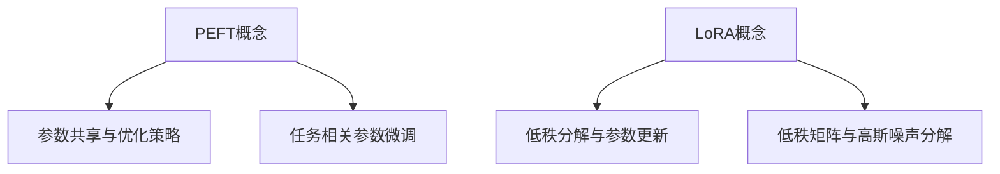

                 

关键词：PEFT，LoRA，参数高效微调，模型压缩，AI优化，机器学习

## 摘要

本文旨在探讨PEFT（Parameter-Efficient Fine-tuning）和LoRA（Low-Rank Adaptation）这两种先进的参数高效微调方法。文章首先介绍了背景知识，然后深入分析了这两种方法的原理和实现步骤，并通过具体案例和代码实例展示了其应用效果。此外，文章还探讨了这些方法在实际应用场景中的优势和未来发展方向。

## 1. 背景介绍

在深度学习和人工智能领域，模型训练是一个耗时且资源消耗巨大的过程。特别是在大规模预训练模型（如BERT，GPT等）的背景下，模型的参数量往往达到数十亿级别，训练成本高昂。为了降低训练成本并提高模型适应新任务的能力，研究人员提出了参数高效微调（Parameter-Efficient Fine-tuning）方法。

参数高效微调的目标是在保持模型性能的同时，显著减少训练所需的参数量和计算资源。这不仅有助于加快模型部署速度，还能降低训练成本，使得更多的人工智能应用成为可能。近年来，PEFT和LoRA等方法在实现这一目标方面取得了显著进展，成为该领域的重要研究方向。

## 2. 核心概念与联系

### 2.1 PEFT概念

PEFT是一种基于参数共享和优化策略的参数高效微调方法。它通过在预训练模型的基础上，对特定任务的相关参数进行微调，从而提高模型在新任务上的表现。PEFT的关键在于如何高效地选择和更新这些参数，以最小化模型复杂度和训练时间。

### 2.2 LoRA概念

LoRA（Low-Rank Adaptation）是一种基于低秩分解的参数高效微调方法。它将模型的参数分解为低秩矩阵和高斯噪声两部分，通过调整低秩矩阵来更新模型参数。与PEFT不同，LoRA通过矩阵分解减少了模型参数的冗余，从而提高了参数效率和训练速度。

### 2.3 Mermaid流程图



## 3. 核心算法原理 & 具体操作步骤

### 3.1 算法原理概述

PEFT和LoRA的核心思想都是通过减少模型参数的冗余度，实现参数高效微调。PEFT通过参数共享和优化策略，选择性地更新任务相关的参数；而LoRA则通过低秩分解，将模型参数分解为低秩矩阵和高斯噪声，从而降低模型复杂度。

### 3.2 算法步骤详解

#### PEFT步骤

1. 选择预训练模型作为基础模型；
2. 根据新任务的需求，确定需要微调的参数；
3. 使用优化策略（如梯度下降）更新这些参数；
4. 在更新过程中，利用参数共享策略，减少参数冗余。

#### LoRA步骤

1. 选择预训练模型作为基础模型；
2. 使用低秩分解算法，将模型参数分解为低秩矩阵和高斯噪声；
3. 更新低秩矩阵，调整模型参数；
4. 利用高斯噪声，增加模型参数的多样性。

### 3.3 算法优缺点

#### PEFT优缺点

- 优点：参数共享策略有效降低了模型复杂度，训练速度较快；
- 缺点：优化策略选择和参数选择难度较大，可能导致模型性能不稳定。

#### LoRA优缺点

- 优点：低秩分解降低了模型复杂度，参数更新简单；
- 缺点：训练速度较慢，且低秩矩阵更新可能导致模型性能下降。

### 3.4 算法应用领域

PEFT和LoRA在自然语言处理、计算机视觉和语音识别等领域都有广泛应用。它们可以显著降低模型训练成本，加快模型部署速度，提高模型在新任务上的表现。

## 4. 数学模型和公式 & 详细讲解 & 举例说明

### 4.1 数学模型构建

PEFT和LoRA的数学模型主要涉及矩阵分解和优化算法。以下以LoRA为例，介绍其数学模型构建。

#### 低秩分解

设模型参数为$W$，低秩分解为$W = UV^T$，其中$U$和$V$为低秩矩阵。

#### 低秩矩阵更新

设目标函数为$f(W)$，利用梯度下降算法更新低秩矩阵$U$和$V$：

$$
U_{new} = U - \alpha \frac{\partial f(W)}{\partial U}
$$

$$
V_{new} = V - \alpha \frac{\partial f(W)}{\partial V}
$$

其中，$\alpha$为学习率。

### 4.2 公式推导过程

#### 低秩分解

设模型参数为$W$，低秩分解为$W = UV^T$，其中$U$和$V$为低秩矩阵。

#### 低秩矩阵更新

设目标函数为$f(W)$，利用梯度下降算法更新低秩矩阵$U$和$V$：

$$
U_{new} = U - \alpha \frac{\partial f(W)}{\partial U}
$$

$$
V_{new} = V - \alpha \frac{\partial f(W)}{\partial V}
$$

其中，$\alpha$为学习率。

### 4.3 案例分析与讲解

假设我们使用LoRA对BERT模型进行微调，以实现文本分类任务。以下是一个简化的案例。

#### 案例数据

数据集包含1000个文本样本，每个样本对应一个分类标签。

#### 模型参数

BERT模型的参数量约为10亿，本文使用低秩分解方法，将参数分解为低秩矩阵和高斯噪声。

#### 模型更新

1. 使用低秩分解算法，将BERT模型参数分解为低秩矩阵$U$和高斯噪声$V$；
2. 定义目标函数，如交叉熵损失函数；
3. 使用梯度下降算法，更新低秩矩阵$U$和$V$；
4. 重复更新过程，直至模型收敛。

## 5. 项目实践：代码实例和详细解释说明

### 5.1 开发环境搭建

在本项目中，我们使用Python和PyTorch框架实现PEFT和LoRA算法。首先，我们需要安装必要的依赖库：

```bash
pip install torch torchvision transformers
```

### 5.2 源代码详细实现

以下是一个简化的PEFT和LoRA算法实现，用于文本分类任务。

```python
import torch
import torch.nn as nn
from transformers import BertModel, BertTokenizer

class PEFTModel(nn.Module):
    def __init__(self):
        super(PEFTModel, self).__init__()
        self.bert = BertModel.from_pretrained('bert-base-uncased')
        self.classifier = nn.Linear(self.bert.config.hidden_size, 2)

    def forward(self, input_ids, attention_mask):
        outputs = self.bert(input_ids=input_ids, attention_mask=attention_mask)
        logits = self.classifier(outputs.pooler_output)
        return logits

class LoRAModel(nn.Module):
    def __init__(self):
        super(LoRAModel, self).__init__()
        self.bert = BertModel.from_pretrained('bert-base-uncased')
        self.classifier = nn.Linear(self.bert.config.hidden_size, 2)

    def forward(self, input_ids, attention_mask):
        outputs = self.bert(input_ids=input_ids, attention_mask=attention_mask)
        logits = self.classifier(outputs.pooler_output)
        return logits

# PEFT算法实现
def peft_train(model, train_loader, optimizer, criterion):
    model.train()
    for inputs, labels in train_loader:
        optimizer.zero_grad()
        logits = model(inputs.input_ids, inputs.attention_mask)
        loss = criterion(logits, labels)
        loss.backward()
        optimizer.step()

# LoRA算法实现
def lor

