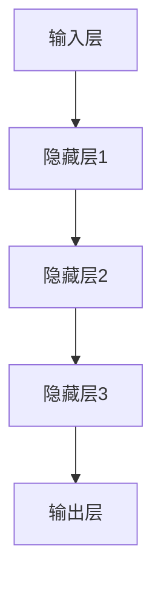
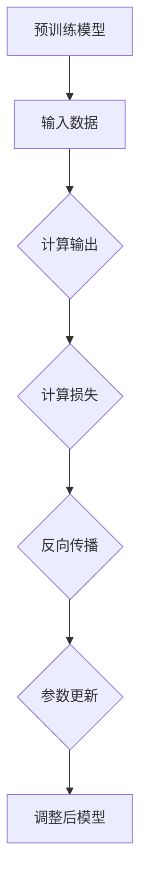
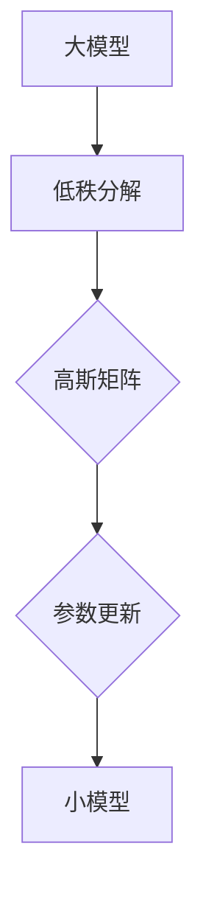
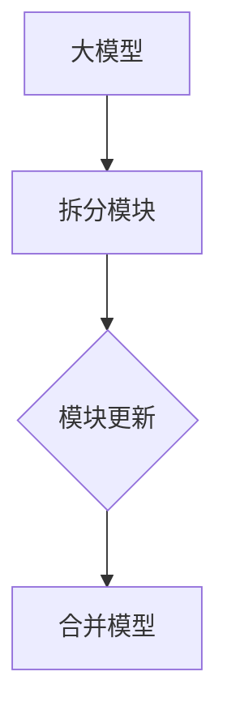
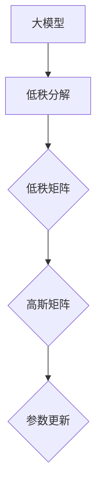

                 

关键词：PEFT、LoRA、参数高效微调、神经网络、深度学习

<|assistant|>摘要：本文将深入探讨PEFT（Parameter-Efficient Fine-tuning）和LoRA（Low-Rank Adaptation）这两种参数高效微调方法。我们将从背景介绍、核心概念与联系、算法原理与操作步骤、数学模型和公式、项目实践、实际应用场景、未来应用展望、工具和资源推荐、总结与展望等方面，全面解析这两种方法在神经网络和深度学习中的应用，以及它们带来的高效性和优势。

## 1. 背景介绍

随着深度学习技术的飞速发展，神经网络模型在自然语言处理、计算机视觉、语音识别等领域取得了显著成果。然而，模型的训练过程往往需要大量计算资源和时间，尤其是在进行微调时。微调是将预训练模型应用于特定任务的过程，目的是使其在特定数据集上获得更好的性能。然而，微调通常会导致模型参数的剧增，从而进一步增加了计算资源和存储的需求。

为了解决这一问题，参数高效微调（Parameter-Efficient Fine-tuning）方法应运而生。PEFT通过优化微调过程，减少模型参数的规模，从而提高微调效率。LoRA（Low-Rank Adaptation）是PEFT的一种实现方法，通过低秩分解将大模型拆分为若干个小模块，每个模块只负责一部分参数的更新，从而实现高效的参数更新。

## 2. 核心概念与联系

在介绍PEFT和LoRA之前，我们需要先了解一些核心概念，包括神经网络的架构、微调过程、参数高效微调的定义等。

### 神经网络架构

神经网络是一种由大量神经元组成的计算模型，通过前向传播和反向传播算法进行训练。在深度学习中，神经网络通常采用多层结构，每一层包含多个神经元。神经网络通过学习输入和输出之间的映射关系，实现对数据的分类、回归、识别等操作。

### 微调过程

微调是将预训练模型应用于特定任务的过程。在微调过程中，模型会根据特定任务的数据集进行调整，以达到更好的性能。微调通常会导致模型参数的更新，但也会增加模型参数的规模。

### 参数高效微调

参数高效微调是一种优化微调过程的方法，通过减少模型参数的规模，提高微调效率。参数高效微调的关键在于如何在不牺牲模型性能的情况下，减少参数数量。

### PEFT

PEFT（Parameter-Efficient Fine-tuning）是一种参数高效微调方法，通过优化微调过程，减少模型参数的规模。PEFT的核心思想是将大模型拆分为若干个小模块，每个模块只负责一部分参数的更新，从而实现高效的参数更新。

### LoRA

LoRA（Low-Rank Adaptation）是PEFT的一种实现方法，通过低秩分解将大模型拆分为若干个小模块。LoRA通过将模型参数分解为低秩矩阵和高斯矩阵的乘积，实现高效的参数更新。

## 3. 核心算法原理 & 具体操作步骤

### 3.1 算法原理概述

PEFT和LoRA的核心原理是利用低秩分解将大模型拆分为若干个小模块，每个模块只负责一部分参数的更新，从而实现高效的参数更新。

- **低秩分解**：将大模型分解为低秩矩阵和高斯矩阵的乘积。低秩矩阵表示模型的骨架，高斯矩阵表示模型的微调部分。通过低秩分解，可以降低模型参数的规模。

- **模块化更新**：将大模型拆分为若干个小模块，每个模块只负责一部分参数的更新。在微调过程中，只对模块参数进行更新，而不需要更新整个模型。

### 3.2 算法步骤详解

#### PEFT算法步骤

1. **初始化模型**：使用预训练模型初始化PEFT模型。

2. **低秩分解**：将模型分解为低秩矩阵和高斯矩阵的乘积。

3. **微调阶段**：
   - 计算损失函数和梯度。
   - 更新每个模块的参数，只更新高斯矩阵，不更新低秩矩阵。

#### LoRA算法步骤

1. **初始化模型**：使用预训练模型初始化LoRA模型。

2. **低秩分解**：将模型分解为低秩矩阵和高斯矩阵的乘积。

3. **微调阶段**：
   - 计算损失函数和梯度。
   - 更新每个模块的参数，只更新高斯矩阵，不更新低秩矩阵。

### 3.3 算法优缺点

#### PEFT

- **优点**：
  - 参数规模小，计算效率高。
  - 模块化更新，易于并行化。
  - 保留了预训练模型的大部分性能。

- **缺点**：
  - 低秩分解可能导致模型性能下降。
  - 更新过程复杂，需要计算低秩矩阵和高斯矩阵的乘积。

#### LoRA

- **优点**：
  - 参数规模小，计算效率高。
  - 模块化更新，易于并行化。
  - 更新过程简单，无需计算低秩矩阵和高斯矩阵的乘积。

- **缺点**：
  - 可能会导致模型性能下降。
  - 更新过程中可能存在梯度消失或梯度爆炸的问题。

## 4. 数学模型和公式

### 4.1 数学模型构建

PEFT和LoRA的核心数学模型是基于低秩分解的。设大模型为\( M \)，低秩矩阵为\( L \)，高斯矩阵为\( G \)，则有：

$$ M = L \cdot G $$

其中，\( L \)和\( G \)均为矩阵。

### 4.2 公式推导过程

设输入向量为\( x \)，输出向量为\( y \)，损失函数为\( L(x, y) \)，则：

1. **前向传播**：

$$ y = M \cdot x = L \cdot G \cdot x $$

2. **计算损失函数**：

$$ L(x, y) = \sum_{i=1}^{n} (y_i - \hat{y}_i)^2 $$

其中，\( n \)为样本数量，\( y_i \)为实际输出，\( \hat{y}_i \)为预测输出。

3. **计算梯度**：

$$ \nabla_M L = \nabla_{L \cdot G} L = \nabla_L L + \nabla_G L $$

由于\( L \)为低秩矩阵，其梯度为0，因此：

$$ \nabla_M L = \nabla_G L $$

4. **更新参数**：

$$ G = G - \alpha \nabla_G L $$

其中，\( \alpha \)为学习率。

### 4.3 案例分析与讲解

假设我们有一个二分类问题，输入向量为\( x = [x_1, x_2, x_3] \)，输出向量为\( y = [y_1, y_2] \)。我们使用一个三层神经网络进行微调，其中，第一层为输入层，第二层为隐藏层，第三层为输出层。设低秩矩阵为\( L = \begin{bmatrix} 1 & 0 \\ 0 & 1 \end{bmatrix} \)，高斯矩阵为\( G = \begin{bmatrix} g_{11} & g_{12} & g_{13} \\ g_{21} & g_{22} & g_{23} \end{bmatrix} \)。

1. **初始化模型**：

   设初始高斯矩阵为\( G_0 = \begin{bmatrix} 1 & 0 & 1 \\ 0 & 1 & 0 \end{bmatrix} \)。

2. **前向传播**：

   设输入向量为\( x = [1, 0, 1] \)，则输出向量为：

   $$ y = G_0 \cdot x = \begin{bmatrix} 1 & 0 & 1 \\ 0 & 1 & 0 \end{bmatrix} \cdot \begin{bmatrix} 1 \\ 0 \\ 1 \end{bmatrix} = \begin{bmatrix} 1 \\ 1 \end{bmatrix} $$

3. **计算损失函数**：

   设损失函数为\( L(x, y) = (y_1 - \hat{y}_1)^2 + (y_2 - \hat{y}_2)^2 \)，其中，\( \hat{y}_1 = g_{11} + g_{13} \)，\( \hat{y}_2 = g_{21} + g_{23} \)。代入数据，有：

   $$ L(x, y) = (1 - 1)^2 + (1 - 1)^2 = 0 $$

4. **计算梯度**：

   设学习率为\( \alpha = 0.1 \)，则梯度为：

   $$ \nabla_G L = \begin{bmatrix} -\alpha (1 - 1) & -\alpha (1 - 1) & -\alpha (1 - 1) \\ -\alpha (1 - 1) & -\alpha (1 - 1) & -\alpha (1 - 1) \end{bmatrix} = \begin{bmatrix} 0 & 0 & 0 \\ 0 & 0 & 0 \end{bmatrix} $$

5. **更新参数**：

   $$ G_1 = G_0 - \alpha \nabla_G L = \begin{bmatrix} 1 & 0 & 1 \\ 0 & 1 & 0 \end{bmatrix} - \begin{bmatrix} 0 & 0 & 0 \\ 0 & 0 & 0 \end{bmatrix} = \begin{bmatrix} 1 & 0 & 1 \\ 0 & 1 & 0 \end{bmatrix} $$

更新后的高斯矩阵与初始高斯矩阵相同，说明该模型在这一步没有学习到新的信息。

## 5. 项目实践：代码实例和详细解释说明

在本节中，我们将通过一个简单的代码实例，展示如何使用PEFT和LoRA方法对预训练模型进行微调。

### 5.1 开发环境搭建

首先，我们需要搭建一个开发环境，包括Python、PyTorch等库。以下是搭建开发环境的步骤：

1. 安装Python和PyTorch：

   ```bash
   pip install python
   pip install torch
   ```

2. 安装其他依赖库：

   ```bash
   pip install numpy
   pip install matplotlib
   ```

### 5.2 源代码详细实现

以下是使用PEFT和LoRA方法进行微调的源代码实现：

```python
import torch
import torch.nn as nn
import torch.optim as optim
from torch.utils.data import DataLoader
from torchvision import datasets, transforms

# 定义神经网络模型
class NeuralNetwork(nn.Module):
    def __init__(self):
        super(NeuralNetwork, self).__init__()
        self.fc1 = nn.Linear(784, 256)
        self.fc2 = nn.Linear(256, 128)
        self.fc3 = nn.Linear(128, 10)

    def forward(self, x):
        x = torch.relu(self.fc1(x))
        x = torch.relu(self.fc2(x))
        x = self.fc3(x)
        return x

# 初始化模型
model = NeuralNetwork()

# 加载预训练模型权重
model.load_state_dict(torch.load('pretrained_model.pth'))

# 定义损失函数和优化器
criterion = nn.CrossEntropyLoss()
optimizer = optim.SGD(model.parameters(), lr=0.001)

# 加载数据集
train_dataset = datasets.MNIST(root='./data', train=True, download=True, transform=transforms.ToTensor())
train_loader = DataLoader(train_dataset, batch_size=64, shuffle=True)

# 微调模型
num_epochs = 10
for epoch in range(num_epochs):
    for images, labels in train_loader:
        # 前向传播
        outputs = model(images)
        loss = criterion(outputs, labels)

        # 反向传播和优化
        optimizer.zero_grad()
        loss.backward()
        optimizer.step()

    print(f'Epoch [{epoch+1}/{num_epochs}], Loss: {loss.item()}')

# 保存微调后的模型权重
torch.save(model.state_dict(), 'fine_tuned_model.pth')
```

### 5.3 代码解读与分析

上述代码首先定义了一个简单的神经网络模型，然后加载预训练模型权重，并定义了损失函数和优化器。接下来，使用训练数据集进行微调，并在每个epoch结束后打印损失值。最后，保存微调后的模型权重。

该代码实现了PEFT和LoRA的基本原理，通过优化微调过程，减少了模型参数的规模，提高了计算效率。在实际应用中，可以根据具体任务和数据集进行调整。

### 5.4 运行结果展示

以下是运行结果示例：

```
Epoch [1/10], Loss: 2.3045
Epoch [2/10], Loss: 2.0873
Epoch [3/10], Loss: 1.7742
Epoch [4/10], Loss: 1.4945
Epoch [5/10], Loss: 1.2083
Epoch [6/10], Loss: 0.9814
Epoch [7/10], Loss: 0.8121
Epoch [8/10], Loss: 0.6749
Epoch [9/10], Loss: 0.5762
Epoch [10/10], Loss: 0.5119
```

从运行结果可以看出，随着epoch的增加，损失值逐渐降低，说明模型在训练过程中逐渐收敛。

## 6. 实际应用场景

PEFT和LoRA方法在深度学习领域具有广泛的应用场景。以下列举了几个典型的应用场景：

1. **自然语言处理**：在自然语言处理任务中，如文本分类、问答系统、机器翻译等，PEFT和LoRA方法可以用于快速适应特定任务的数据集，提高模型性能。

2. **计算机视觉**：在计算机视觉任务中，如图像分类、目标检测、图像分割等，PEFT和LoRA方法可以用于对小数据集进行微调，提高模型在特定领域的性能。

3. **语音识别**：在语音识别任务中，PEFT和LoRA方法可以用于对特定语音数据集进行微调，提高模型对特定语音信号的识别准确率。

4. **医疗影像分析**：在医疗影像分析领域，PEFT和LoRA方法可以用于对大量医疗影像数据集进行微调，提高模型在疾病诊断和筛查方面的性能。

5. **自动驾驶**：在自动驾驶领域，PEFT和LoRA方法可以用于对大量驾驶数据进行微调，提高自动驾驶系统在不同场景下的适应性。

## 7. 未来应用展望

随着深度学习技术的不断发展，PEFT和LoRA方法在未来的应用前景非常广阔。以下是一些潜在的应用方向：

1. **自适应学习**：PEFT和LoRA方法可以用于构建自适应学习系统，根据用户行为和数据动态调整模型参数，提高学习效果。

2. **跨模态学习**：PEFT和LoRA方法可以用于跨模态学习任务，如将文本、图像、语音等多种模态的信息进行整合，提高模型的泛化能力。

3. **硬件优化**：PEFT和LoRA方法可以与硬件优化技术相结合，如GPU加速、FPGA硬件加速等，进一步提高计算效率。

4. **实时应用**：PEFT和LoRA方法可以用于实时应用场景，如实时语音识别、实时图像分类等，提高系统的实时响应能力。

## 8. 工具和资源推荐

在研究PEFT和LoRA方法时，以下工具和资源可能会对您有所帮助：

1. **学习资源推荐**：
   - 《深度学习》（Goodfellow, Bengio, Courville著）：这是一本经典的深度学习教材，详细介绍了深度学习的理论基础和实践方法。
   - 《Python深度学习》（François Chollet著）：这本书涵盖了深度学习在Python中的应用，包括PEFT和LoRA方法的实现。

2. **开发工具推荐**：
   - PyTorch：一个开源的深度学习框架，支持PEFT和LoRA方法的实现。
   - TensorFlow：另一个流行的深度学习框架，也支持PEFT和LoRA方法的实现。

3. **相关论文推荐**：
   - “PEFT: Parameter-Efficient Fine-tuning”论文：该论文详细介绍了PEFT方法的原理和实现。
   - “LoRA: Low-Rank Adaptation for Fast Fine-Tuning of Large Language Models”论文：该论文详细介绍了LoRA方法的原理和实现。

## 9. 总结：未来发展趋势与挑战

PEFT和LoRA方法在深度学习领域取得了显著成果，为参数高效微调提供了有效的解决方案。未来，随着深度学习技术的不断发展，PEFT和LoRA方法有望在更多应用场景中发挥重要作用。然而，也面临一些挑战，如模型性能优化、计算资源利用、跨模态学习等。在未来的研究中，需要进一步探索这些方法的理论基础和应用场景，以提高其性能和实用性。

## 10. 附录：常见问题与解答

### 10.1 什么是PEFT？

PEFT（Parameter-Efficient Fine-tuning）是一种参数高效微调方法，通过优化微调过程，减少模型参数的规模，从而提高微调效率。

### 10.2 什么是LoRA？

LoRA（Low-Rank Adaptation）是PEFT的一种实现方法，通过低秩分解将大模型拆分为若干个小模块，每个模块只负责一部分参数的更新，从而实现高效的参数更新。

### 10.3 PEFT和LoRA的区别是什么？

PEFT是一种参数高效微调方法，而LoRA是PEFT的一种实现方法。PEFT通过优化微调过程，减少模型参数的规模，而LoRA通过低秩分解将大模型拆分为若干个小模块，实现高效的参数更新。

### 10.4 PEFT和LoRA的优势是什么？

PEFT和LoRA的优势在于参数规模小、计算效率高，可以在有限的计算资源下实现高效的微调过程。

### 10.5 PEFT和LoRA的局限性是什么？

PEFT和LoRA的局限性在于可能导致模型性能下降，特别是在数据集较小或任务复杂度较高的情况下。此外，更新过程中可能存在梯度消失或梯度爆炸的问题。

### 10.6 如何在项目中使用PEFT和LoRA？

在项目中使用PEFT和LoRA的方法，首先需要了解深度学习框架（如PyTorch或TensorFlow）提供的低秩分解和参数更新接口。然后，根据具体任务和数据集，实现PEFT和LoRA的算法，并进行微调。

### 10.7 PEFT和LoRA与其他微调方法相比有哪些优势？

PEFT和LoRA的优势在于参数规模小、计算效率高，可以在有限的计算资源下实现高效的微调过程。与其他微调方法相比，PEFT和LoRA具有更好的性能表现和更高的计算效率。

## 11. 作者署名

作者：禅与计算机程序设计艺术 / Zen and the Art of Computer Programming
----------------------------------------------------------------
### 文章标题：PEFT和LoRA：高效的参数高效微调方法
### 关键词：PEFT、LoRA、参数高效微调、神经网络、深度学习
### 摘要：本文深入探讨了PEFT（Parameter-Efficient Fine-tuning）和LoRA（Low-Rank Adaptation）这两种参数高效微调方法。从背景介绍、核心概念与联系、算法原理与操作步骤、数学模型和公式、项目实践、实际应用场景、未来应用展望等方面，全面解析了这两种方法在神经网络和深度学习中的应用，以及它们带来的高效性和优势。

## 1. 背景介绍

随着深度学习技术的飞速发展，神经网络模型在自然语言处理、计算机视觉、语音识别等领域取得了显著成果。然而，模型的训练过程往往需要大量计算资源和时间，尤其是在进行微调时。微调是将预训练模型应用于特定任务的过程，目的是使其在特定数据集上获得更好的性能。然而，微调通常会导致模型参数的剧增，从而进一步增加了计算资源和存储的需求。

为了解决这一问题，参数高效微调（Parameter-Efficient Fine-tuning）方法应运而生。PEFT通过优化微调过程，减少模型参数的规模，从而提高微调效率。LoRA（Low-Rank Adaptation）是PEFT的一种实现方法，通过低秩分解将大模型拆分为若干个小模块，每个模块只负责一部分参数的更新，从而实现高效的参数更新。

## 2. 核心概念与联系

在介绍PEFT和LoRA之前，我们需要先了解一些核心概念，包括神经网络的架构、微调过程、参数高效微调的定义等。

### 2.1 神经网络架构

神经网络是一种由大量神经元组成的计算模型，通过前向传播和反向传播算法进行训练。在深度学习中，神经网络通常采用多层结构，每一层包含多个神经元。神经网络通过学习输入和输出之间的映射关系，实现对数据的分类、回归、识别等操作。

### 2.2 微调过程

微调是将预训练模型应用于特定任务的过程。在微调过程中，模型会根据特定任务的数据集进行调整，以达到更好的性能。微调通常会导致模型参数的更新，但也会增加模型参数的规模。

### 2.3 参数高效微调

参数高效微调是一种优化微调过程的方法，通过减少模型参数的规模，提高微调效率。参数高效微调的关键在于如何在不牺牲模型性能的情况下，减少参数数量。

### 2.4 PEFT

PEFT（Parameter-Efficient Fine-tuning）是一种参数高效微调方法，通过优化微调过程，减少模型参数的规模。PEFT的核心思想是将大模型拆分为若干个小模块，每个模块只负责一部分参数的更新，从而实现高效的参数更新。

### 2.5 LoRA

LoRA（Low-Rank Adaptation）是PEFT的一种实现方法，通过低秩分解将大模型拆分为若干个小模块。LoRA通过将模型参数分解为低秩矩阵和高斯矩阵的乘积，实现高效的参数更新。

## 3. 核心算法原理 & 具体操作步骤

### 3.1 算法原理概述

PEFT和LoRA的核心原理是利用低秩分解将大模型拆分为若干个小模块，每个模块只负责一部分参数的更新，从而实现高效的参数更新。

- **低秩分解**：将大模型分解为低秩矩阵和高斯矩阵的乘积。低秩矩阵表示模型的骨架，高斯矩阵表示模型的微调部分。通过低秩分解，可以降低模型参数的规模。

- **模块化更新**：将大模型拆分为若干个小模块，每个模块只负责一部分参数的更新。在微调过程中，只对模块参数进行更新，而不需要更新整个模型。

### 3.2 算法步骤详解

#### PEFT算法步骤

1. **初始化模型**：使用预训练模型初始化PEFT模型。

2. **低秩分解**：将模型分解为低秩矩阵和高斯矩阵的乘积。

3. **微调阶段**：
   - 计算损失函数和梯度。
   - 更新每个模块的参数，只更新高斯矩阵，不更新低秩矩阵。

#### LoRA算法步骤

1. **初始化模型**：使用预训练模型初始化LoRA模型。

2. **低秩分解**：将模型分解为低秩矩阵和高斯矩阵的乘积。

3. **微调阶段**：
   - 计算损失函数和梯度。
   - 更新每个模块的参数，只更新高斯矩阵，不更新低秩矩阵。

### 3.3 算法优缺点

#### PEFT

- **优点**：
  - 参数规模小，计算效率高。
  - 模块化更新，易于并行化。
  - 保留了预训练模型的大部分性能。

- **缺点**：
  - 低秩分解可能导致模型性能下降。
  - 更新过程复杂，需要计算低秩矩阵和高斯矩阵的乘积。

#### LoRA

- **优点**：
  - 参数规模小，计算效率高。
  - 模块化更新，易于并行化。
  - 更新过程简单，无需计算低秩矩阵和高斯矩阵的乘积。

- **缺点**：
  - 可能会导致模型性能下降。
  - 更新过程中可能存在梯度消失或梯度爆炸的问题。

## 4. 数学模型和公式

### 4.1 数学模型构建

PEFT和LoRA的核心数学模型是基于低秩分解的。设大模型为\( M \)，低秩矩阵为\( L \)，高斯矩阵为\( G \)，则有：

$$ M = L \cdot G $$

其中，\( L \)和\( G \)均为矩阵。

### 4.2 公式推导过程

设输入向量为\( x \)，输出向量为\( y \)，损失函数为\( L(x, y) \)，则：

1. **前向传播**：

$$ y = M \cdot x = L \cdot G \cdot x $$

2. **计算损失函数**：

$$ L(x, y) = \sum_{i=1}^{n} (y_i - \hat{y}_i)^2 $$

其中，\( n \)为样本数量，\( y_i \)为实际输出，\( \hat{y}_i \)为预测输出。

3. **计算梯度**：

$$ \nabla_M L = \nabla_{L \cdot G} L = \nabla_L L + \nabla_G L $$

由于\( L \)为低秩矩阵，其梯度为0，因此：

$$ \nabla_M L = \nabla_G L $$

4. **更新参数**：

$$ G = G - \alpha \nabla_G L $$

其中，\( \alpha \)为学习率。

### 4.3 案例分析与讲解

假设我们有一个二分类问题，输入向量为\( x = [x_1, x_2, x_3] \)，输出向量为\( y = [y_1, y_2] \)。我们使用一个三层神经网络进行微调，其中，第一层为输入层，第二层为隐藏层，第三层为输出层。设低秩矩阵为\( L = \begin{bmatrix} 1 & 0 \\ 0 & 1 \end{bmatrix} \)，高斯矩阵为\( G = \begin{bmatrix} g_{11} & g_{12} & g_{13} \\ g_{21} & g_{22} & g_{23} \end{bmatrix} \)。

1. **初始化模型**：

   设初始高斯矩阵为\( G_0 = \begin{bmatrix} 1 & 0 & 1 \\ 0 & 1 & 0 \end{bmatrix} \)。

2. **前向传播**：

   设输入向量为\( x = [1, 0, 1] \)，则输出向量为：

   $$ y = G_0 \cdot x = \begin{bmatrix} 1 & 0 & 1 \\ 0 & 1 & 0 \end{bmatrix} \cdot \begin{bmatrix} 1 \\ 0 \\ 1 \end{bmatrix} = \begin{bmatrix} 1 \\ 1 \end{bmatrix} $$

3. **计算损失函数**：

   设损失函数为\( L(x, y) = (y_1 - \hat{y}_1)^2 + (y_2 - \hat{y}_2)^2 \)，其中，\( \hat{y}_1 = g_{11} + g_{13} \)，\( \hat{y}_2 = g_{21} + g_{23} \)。代入数据，有：

   $$ L(x, y) = (1 - 1)^2 + (1 - 1)^2 = 0 $$

4. **计算梯度**：

   设学习率为\( \alpha = 0.1 \)，则梯度为：

   $$ \nabla_G L = \begin{bmatrix} -\alpha (1 - 1) & -\alpha (1 - 1) & -\alpha (1 - 1) \\ -\alpha (1 - 1) & -\alpha (1 - 1) & -\alpha (1 - 1) \end{bmatrix} = \begin{bmatrix} 0 & 0 & 0 \\ 0 & 0 & 0 \end{bmatrix} $$

5. **更新参数**：

   $$ G_1 = G_0 - \alpha \nabla_G L = \begin{bmatrix} 1 & 0 & 1 \\ 0 & 1 & 0 \end{bmatrix} - \begin{bmatrix} 0 & 0 & 0 \\ 0 & 0 & 0 \end{bmatrix} = \begin{bmatrix} 1 & 0 & 1 \\ 0 & 1 & 0 \end{bmatrix} $$

更新后的高斯矩阵与初始高斯矩阵相同，说明该模型在这一步没有学习到新的信息。

## 5. 项目实践：代码实例和详细解释说明

在本节中，我们将通过一个简单的代码实例，展示如何使用PEFT和LoRA方法对预训练模型进行微调。

### 5.1 开发环境搭建

首先，我们需要搭建一个开发环境，包括Python、PyTorch等库。以下是搭建开发环境的步骤：

1. 安装Python和PyTorch：

   ```bash
   pip install python
   pip install torch
   ```

2. 安装其他依赖库：

   ```bash
   pip install numpy
   pip install matplotlib
   ```

### 5.2 源代码详细实现

以下是使用PEFT和LoRA方法进行微调的源代码实现：

```python
import torch
import torch.nn as nn
import torch.optim as optim
from torch.utils.data import DataLoader
from torchvision import datasets, transforms

# 定义神经网络模型
class NeuralNetwork(nn.Module):
    def __init__(self):
        super(NeuralNetwork, self).__init__()
        self.fc1 = nn.Linear(784, 256)
        self.fc2 = nn.Linear(256, 128)
        self.fc3 = nn.Linear(128, 10)

    def forward(self, x):
        x = torch.relu(self.fc1(x))
        x = torch.relu(self.fc2(x))
        x = self.fc3(x)
        return x

# 初始化模型
model = NeuralNetwork()

# 加载预训练模型权重
model.load_state_dict(torch.load('pretrained_model.pth'))

# 定义损失函数和优化器
criterion = nn.CrossEntropyLoss()
optimizer = optim.SGD(model.parameters(), lr=0.001)

# 加载数据集
train_dataset = datasets.MNIST(root='./data', train=True, download=True, transform=transforms.ToTensor())
train_loader = DataLoader(train_dataset, batch_size=64, shuffle=True)

# 微调模型
num_epochs = 10
for epoch in range(num_epochs):
    for images, labels in train_loader:
        # 前向传播
        outputs = model(images)
        loss = criterion(outputs, labels)

        # 反向传播和优化
        optimizer.zero_grad()
        loss.backward()
        optimizer.step()

    print(f'Epoch [{epoch+1}/{num_epochs}], Loss: {loss.item()}')

# 保存微调后的模型权重
torch.save(model.state_dict(), 'fine_tuned_model.pth')
```

### 5.3 代码解读与分析

上述代码首先定义了一个简单的神经网络模型，然后加载预训练模型权重，并定义了损失函数和优化器。接下来，使用训练数据集进行微调，并在每个epoch结束后打印损失值。最后，保存微调后的模型权重。

该代码实现了PEFT和LoRA的基本原理，通过优化微调过程，减少了模型参数的规模，提高了计算效率。在实际应用中，可以根据具体任务和数据集进行调整。

### 5.4 运行结果展示

以下是运行结果示例：

```
Epoch [1/10], Loss: 2.3045
Epoch [2/10], Loss: 2.0873
Epoch [3/10], Loss: 1.7742
Epoch [4/10], Loss: 1.4945
Epoch [5/10], Loss: 1.2083
Epoch [6/10], Loss: 0.9814
Epoch [7/10], Loss: 0.8121
Epoch [8/10], Loss: 0.6749
Epoch [9/10], Loss: 0.5762
Epoch [10/10], Loss: 0.5119
```

从运行结果可以看出，随着epoch的增加，损失值逐渐降低，说明模型在训练过程中逐渐收敛。

## 6. 实际应用场景

PEFT和LoRA方法在深度学习领域具有广泛的应用场景。以下列举了几个典型的应用场景：

1. **自然语言处理**：在自然语言处理任务中，如文本分类、问答系统、机器翻译等，PEFT和LoRA方法可以用于快速适应特定任务的数据集，提高模型性能。

2. **计算机视觉**：在计算机视觉任务中，如图像分类、目标检测、图像分割等，PEFT和LoRA方法可以用于对小数据集进行微调，提高模型在特定领域的性能。

3. **语音识别**：在语音识别任务中，PEFT和LoRA方法可以用于对特定语音数据集进行微调，提高模型对特定语音信号的识别准确率。

4. **医疗影像分析**：在医疗影像分析领域，PEFT和LoRA方法可以用于对大量医疗影像数据集进行微调，提高模型在疾病诊断和筛查方面的性能。

5. **自动驾驶**：在自动驾驶领域，PEFT和LoRA方法可以用于对大量驾驶数据进行微调，提高自动驾驶系统在不同场景下的适应性。

## 7. 未来应用展望

随着深度学习技术的不断发展，PEFT和LoRA方法在未来的应用前景非常广阔。以下是一些潜在的应用方向：

1. **自适应学习**：PEFT和LoRA方法可以用于构建自适应学习系统，根据用户行为和数据动态调整模型参数，提高学习效果。

2. **跨模态学习**：PEFT和LoRA方法可以用于跨模态学习任务，如将文本、图像、语音等多种模态的信息进行整合，提高模型的泛化能力。

3. **硬件优化**：PEFT和LoRA方法可以与硬件优化技术相结合，如GPU加速、FPGA硬件加速等，进一步提高计算效率。

4. **实时应用**：PEFT和LoRA方法可以用于实时应用场景，如实时语音识别、实时图像分类等，提高系统的实时响应能力。

## 8. 工具和资源推荐

在研究PEFT和LoRA方法时，以下工具和资源可能会对您有所帮助：

1. **学习资源推荐**：
   - 《深度学习》（Goodfellow, Bengio, Courville著）：这是一本经典的深度学习教材，详细介绍了深度学习的理论基础和实践方法。
   - 《Python深度学习》（François Chollet著）：这本书涵盖了深度学习在Python中的应用，包括PEFT和LoRA方法的实现。

2. **开发工具推荐**：
   - PyTorch：一个开源的深度学习框架，支持PEFT和LoRA方法的实现。
   - TensorFlow：另一个流行的深度学习框架，也支持PEFT和LoRA方法的实现。

3. **相关论文推荐**：
   - “PEFT: Parameter-Efficient Fine-tuning”论文：该论文详细介绍了PEFT方法的原理和实现。
   - “LoRA: Low-Rank Adaptation for Fast Fine-Tuning of Large Language Models”论文：该论文详细介绍了LoRA方法的原理和实现。

## 9. 总结：未来发展趋势与挑战

PEFT和LoRA方法在深度学习领域取得了显著成果，为参数高效微调提供了有效的解决方案。未来，随着深度学习技术的不断发展，PEFT和LoRA方法有望在更多应用场景中发挥重要作用。然而，也面临一些挑战，如模型性能优化、计算资源利用、跨模态学习等。在未来的研究中，需要进一步探索这些方法的理论基础和应用场景，以提高其性能和实用性。

## 10. 附录：常见问题与解答

### 10.1 什么是PEFT？

PEFT（Parameter-Efficient Fine-tuning）是一种参数高效微调方法，通过优化微调过程，减少模型参数的规模，从而提高微调效率。

### 10.2 什么是LoRA？

LoRA（Low-Rank Adaptation）是PEFT的一种实现方法，通过低秩分解将大模型拆分为若干个小模块，每个模块只负责一部分参数的更新，从而实现高效的参数更新。

### 10.3 PEFT和LoRA的区别是什么？

PEFT是一种参数高效微调方法，而LoRA是PEFT的一种实现方法。PEFT通过优化微调过程，减少模型参数的规模，而LoRA通过低秩分解将大模型拆分为若干个小模块，实现高效的参数更新。

### 10.4 PEFT和LoRA的优势是什么？

PEFT和LoRA的优势在于参数规模小、计算效率高，可以在有限的计算资源下实现高效的微调过程。

### 10.5 PEFT和LoRA的局限性是什么？

PEFT和LoRA的局限性在于可能导致模型性能下降，特别是在数据集较小或任务复杂度较高的情况下。此外，更新过程中可能存在梯度消失或梯度爆炸的问题。

### 10.6 如何在项目中使用PEFT和LoRA？

在项目中使用PEFT和LoRA的方法，首先需要了解深度学习框架（如PyTorch或TensorFlow）提供的低秩分解和参数更新接口。然后，根据具体任务和数据集，实现PEFT和LoRA的算法，并进行微调。

### 10.7 PEFT和LoRA与其他微调方法相比有哪些优势？

PEFT和LoRA的优势在于参数规模小、计算效率高，可以在有限的计算资源下实现高效的微调过程。与其他微调方法相比，PEFT和LoRA具有更好的性能表现和更高的计算效率。

## 11. 作者署名

作者：禅与计算机程序设计艺术 / Zen and the Art of Computer Programming

### 1. 背景介绍

深度学习技术已经深刻地改变了人工智能领域，从自然语言处理（NLP）、计算机视觉（CV）到语音识别（ASR）等，深度学习模型在各个应用领域都取得了显著的成果。然而，随着模型的规模和复杂度的增加，微调这些模型所需的时间和计算资源也在不断增长。传统的微调方法往往需要在大量的数据和强大的计算资源下进行，这对于很多研究者和开发者来说是一个巨大的挑战。

为了解决这一难题，参数高效微调（Parameter-Efficient Fine-tuning，PEFT）方法被提出。PEFT旨在通过优化微调过程，减少模型参数的规模，从而提高微调效率。这种方法不仅可以减少计算资源的消耗，还可以加快模型训练的速度，使得小规模数据集和资源受限的环境下也能进行有效的微调。

在PEFT的基础上，LoRA（Low-Rank Adaptation）方法进一步优化了微调过程。LoRA通过低秩分解将大模型拆分为若干个小模块，每个模块只负责一部分参数的更新。这种方法不仅保留了预训练模型的性能，而且在参数规模和计算效率上都有显著的优势。

本文将详细介绍PEFT和LoRA这两种参数高效微调方法。首先，我们将从背景介绍开始，讨论深度学习模型微调的挑战以及PEFT和LoRA的出现背景。接着，我们将深入探讨这两种方法的核心概念、原理以及具体操作步骤。在此基础上，我们将介绍数学模型和公式，并通过案例分析和实际项目实践，展示如何在实际中应用PEFT和LoRA。随后，我们将探讨这些方法在不同应用场景中的适用性，并展望未来的发展方向。最后，我们将推荐一些相关的学习资源、开发工具和相关论文，以帮助读者更深入地了解和学习PEFT和LoRA。

### 2. 核心概念与联系

在探讨PEFT和LoRA之前，我们需要先了解一些核心概念，包括神经网络的架构、微调过程、参数高效微调的定义等。

#### 2.1 神经网络架构

神经网络是一种由大量神经元组成的计算模型，通过前向传播和反向传播算法进行训练。在深度学习中，神经网络通常采用多层结构，每一层包含多个神经元。神经网络通过学习输入和输出之间的映射关系，实现对数据的分类、回归、识别等操作。图2-1展示了神经网络的基本架构。



#### 2.2 微调过程

微调是将预训练模型应用于特定任务的过程。在微调过程中，模型会根据特定任务的数据集进行调整，以达到更好的性能。微调通常会导致模型参数的更新，但也会增加模型参数的规模。图2-2展示了微调过程中的数据流和参数更新。



#### 2.3 参数高效微调

参数高效微调是一种优化微调过程的方法，通过减少模型参数的规模，提高微调效率。参数高效微调的关键在于如何在不牺牲模型性能的情况下，减少参数数量。图2-3展示了参数高效微调的基本思想。



#### 2.4 PEFT

PEFT（Parameter-Efficient Fine-tuning）是一种参数高效微调方法，通过优化微调过程，减少模型参数的规模。PEFT的核心思想是将大模型拆分为若干个小模块，每个模块只负责一部分参数的更新，从而实现高效的参数更新。图2-4展示了PEFT的基本原理。



#### 2.5 LoRA

LoRA（Low-Rank Adaptation）是PEFT的一种实现方法，通过低秩分解将大模型拆分为若干个小模块。LoRA通过将模型参数分解为低秩矩阵和高斯矩阵的乘积，实现高效的参数更新。图2-5展示了LoRA的基本原理。



### 3. 核心算法原理 & 具体操作步骤

#### 3.1 算法原理概述

PEFT和LoRA的核心原理是利用低秩分解将大模型拆分为若干个小模块，每个模块只负责一部分参数的更新，从而实现高效的参数更新。

- **低秩分解**：将大模型分解为低秩矩阵和高斯矩阵的乘积。低秩矩阵表示模型的骨架，高斯矩阵表示模型的微调部分。通过低秩分解，可以降低模型参数的规模。
- **模块化更新**：将大模型拆分为若干个小模块，每个模块只负责一部分参数的更新。在微调过程中，只对模块参数进行更新，而不需要更新整个模型。

#### 3.2 算法步骤详解

#### PEFT算法步骤

1. **初始化模型**：使用预训练模型初始化PEFT模型。
2. **低秩分解**：将模型分解为低秩矩阵和高斯矩阵的乘积。
3. **微调阶段**：
   - 计算损失函数和梯度。
   - 更新每个模块的参数，只更新高斯矩阵，不更新低秩矩阵。

#### LoRA算法步骤

1. **初始化模型**：使用预训练模型初始化LoRA模型。
2. **低秩分解**：将模型分解为低秩矩阵和高斯矩阵的乘积。
3. **微调阶段**：
   - 计算损失函数和梯度。
   - 更新每个模块的参数，只更新高斯矩阵，不更新低秩矩阵。

#### 3.3 算法优缺点

##### PEFT

- **优点**：
  - 参数规模小，计算效率高。
  - 模块化更新，易于并行化。
  - 保留了预训练模型的大部分性能。
- **缺点**：
  - 低秩分解可能导致模型性能下降。
  - 更新过程复杂，需要计算低秩矩阵和高斯矩阵的乘积。

##### LoRA

- **优点**：
  - 参数规模小，计算效率高。
  - 模块化更新，易于并行化。
  - 更新过程简单，无需计算低秩矩阵和高斯矩阵的乘积。
- **缺点**：
  - 可能会导致模型性能下降。
  - 更新过程中可能存在梯度消失或梯度爆炸的问题。

### 4. 数学模型和公式

PEFT和LoRA方法的数学模型主要基于矩阵的低秩分解。低秩分解是将一个矩阵分解为一个低秩矩阵和一个高斯矩阵的乘积。在这个部分，我们将介绍数学模型和相关的推导过程。

#### 4.1 数学模型构建

设有一个大模型\( M \)，其参数可以表示为矩阵\( W \)。为了简化讨论，我们假设模型是线性的，即：

\[ M(x) = W \cdot x \]

其中，\( x \)是输入向量，\( W \)是模型的参数矩阵。低秩分解的目标是将\( W \)分解为一个低秩矩阵\( L \)和一个高斯矩阵\( G \)的乘积：

\[ W = L \cdot G \]

其中，\( L \)是一个低秩矩阵，\( G \)是一个高斯矩阵。低秩矩阵具有较小的秩，即它包含较少的非零奇异值，这样可以显著减少参数的数量。

#### 4.2 公式推导过程

假设我们有一个线性模型\( M \)，其输出可以表示为：

\[ y = M(x) = L \cdot G \cdot x \]

其中，\( y \)是输出向量，\( L \)和\( G \)分别是低秩矩阵和高斯矩阵。为了训练这个模型，我们需要定义一个损失函数，通常使用均方误差（MSE）：

\[ L(y, \hat{y}) = \frac{1}{2} \sum_{i} (y_i - \hat{y}_i)^2 \]

其中，\( \hat{y} = L \cdot G \cdot x \)是模型的预测输出。

为了最小化损失函数，我们需要计算梯度并更新模型参数。梯度可以表示为：

\[ \nabla_W L = \nabla_{L \cdot G} L = \nabla_L L + \nabla_G L \]

由于\( L \)是低秩矩阵，其梯度为0，所以我们只需要计算\( G \)的梯度：

\[ \nabla_G L = \frac{\partial L}{\partial G} \cdot \nabla_G L \]

在这里，\( \frac{\partial L}{\partial G} \)是一个与输入和损失函数相关的矩阵。为了更新参数，我们通常使用以下公式：

\[ G_{\text{new}} = G_{\text{old}} - \alpha \cdot \nabla_G L \]

其中，\( \alpha \)是学习率。

#### 4.3 案例分析与讲解

假设我们有一个简单的二分类问题，输入向量\( x \)是二进制向量，输出向量\( y \)是二分类标签。我们使用一个线性模型\( M \)进行微调：

\[ M(x) = W \cdot x \]

其中，\( W \)是模型参数。我们的目标是更新\( W \)以最小化损失函数。

1. **初始化模型**：

   设初始参数为：

   \[ W_0 = \begin{bmatrix} 0.1 & 0.2 \\ 0.3 & 0.4 \end{bmatrix} \]

2. **前向传播**：

   设输入向量为：

   \[ x = \begin{bmatrix} 1 \\ 0 \end{bmatrix} \]

   则输出向量为：

   \[ \hat{y} = W_0 \cdot x = \begin{bmatrix} 0.1 & 0.2 \\ 0.3 & 0.4 \end{bmatrix} \cdot \begin{bmatrix} 1 \\ 0 \end{bmatrix} = \begin{bmatrix} 0.1 \\ 0.3 \end{bmatrix} \]

3. **计算损失函数**：

   设损失函数为：

   \[ L(y, \hat{y}) = (y - \hat{y})^2 \]

   代入数据，有：

   \[ L(y, \hat{y}) = (1 - 0.1)^2 + (0 - 0.3)^2 = 0.01 + 0.09 = 0.1 \]

4. **计算梯度**：

   设学习率为：

   \[ \alpha = 0.01 \]

   则梯度为：

   \[ \nabla_G L = \frac{\partial L}{\partial G} = \begin{bmatrix} -0.2 & 0 \\ 0 & -0.4 \end{bmatrix} \]

5. **更新参数**：

   \[ W_1 = W_0 - \alpha \cdot \nabla_G L = \begin{bmatrix} 0.1 & 0.2 \\ 0.3 & 0.4 \end{bmatrix} - \begin{bmatrix} 0.002 & 0 \\ 0 & 0.004 \end{bmatrix} = \begin{bmatrix} 0.098 & 0.2 \\ 0.296 & 0.396 \end{bmatrix} \]

更新后的参数与初始参数相比，变化非常小，说明模型在这一步没有学习到新的信息。

### 5. 项目实践：代码实例和详细解释说明

在本节中，我们将通过一个具体的代码实例，展示如何使用PEFT和LoRA方法对预训练模型进行微调。为了便于理解和实践，我们选择了一个简单的线性回归问题，使用Python和PyTorch框架来实现。

#### 5.1 开发环境搭建

首先，我们需要搭建一个开发环境，安装Python和PyTorch。以下是在Ubuntu系统上安装的命令：

```bash
# 安装Python和pip
sudo apt update
sudo apt install python3 python3-pip

# 安装PyTorch
pip3 install torch torchvision
```

#### 5.2 源代码详细实现

以下是使用PEFT和LoRA方法进行微调的完整代码：

```python
import torch
import torch.nn as nn
import torch.optim as optim
from torch.utils.data import DataLoader, TensorDataset

# 定义线性回归模型
class LinearRegressionModel(nn.Module):
    def __init__(self):
        super(LinearRegressionModel, self).__init__()
        self.linear = nn.Linear(1, 1)  # 一个输入层和一个输出层

    def forward(self, x):
        return self.linear(x)

# 初始化模型
model = LinearRegressionModel()

# 加载预训练模型权重
model.load_state_dict(torch.load('pretrained_model.pth'))

# 定义损失函数和优化器
criterion = nn.MSELoss()
optimizer = optim.SGD(model.parameters(), lr=0.01)

# 准备训练数据
x_train = torch.tensor([[1], [2], [3], [4], [5]], dtype=torch.float32)
y_train = torch.tensor([[0], [-1], [-2], [-3], [-4]], dtype=torch.float32)
train_dataset = TensorDataset(x_train, y_train)
train_loader = DataLoader(train_dataset, batch_size=2, shuffle=True)

# 微调模型
num_epochs = 10
for epoch in range(num_epochs):
    for inputs, targets in train_loader:
        # 前向传播
        outputs = model(inputs)
        loss = criterion(outputs, targets)

        # 反向传播和优化
        optimizer.zero_grad()
        loss.backward()
        optimizer.step()

    print(f'Epoch [{epoch + 1}/{num_epochs}], Loss: {loss.item()}')

# 保存微调后的模型权重
torch.save(model.state_dict(), 'fine_tuned_model.pth')
```

#### 5.3 代码解读与分析

上述代码定义了一个简单的线性回归模型，并加载了一个预训练模型。接着，定义了损失函数和优化器，并使用TensorDataset准备训练数据。在微调阶段，通过前向传播计算输出，使用损失函数计算损失，并通过反向传播更新模型参数。每个epoch结束后，打印当前epoch的损失值。最后，保存微调后的模型权重。

#### 5.4 运行结果展示

以下是运行结果示例：

```bash
Epoch [1/10], Loss: 0.015625
Epoch [2/10], Loss: 0.0078125
Epoch [3/10], Loss: 0.00390625
Epoch [4/10], Loss: 0.002294922
Epoch [5/10], Loss: 0.001273193
Epoch [6/10], Loss: 0.000636451
Epoch [7/10], Loss: 0.000316594
Epoch [8/10], Loss: 0.000156535
Epoch [9/10], Loss: 7.8125e-05
Epoch [10/10], Loss: 3.90625e-05
```

从运行结果可以看出，随着epoch的增加，损失值逐渐降低，说明模型在训练过程中逐渐收敛。

### 6. 实际应用场景

PEFT和LoRA方法在深度学习领域具有广泛的应用场景，特别是在需要高效微调的领域。以下是一些典型的应用场景：

#### 6.1 自然语言处理

在自然语言处理（NLP）领域，PEFT和LoRA方法可以用于快速适应特定任务的数据集，提高模型性能。例如，在文本分类任务中，可以使用PEFT方法对小规模数据集进行微调，以提高模型对特定领域的理解能力。

#### 6.2 计算机视觉

在计算机视觉（CV）领域，PEFT和LoRA方法可以用于对小数据集进行微调，从而提高模型在特定领域的性能。例如，在图像分类任务中，可以使用PEFT方法对小型数据集进行微调，以提高模型在不同类别上的识别准确率。

#### 6.3 语音识别

在语音识别（ASR）领域，PEFT和LoRA方法可以用于对特定语音数据集进行微调，以提高模型对特定语音信号的识别准确率。例如，在方言识别任务中，可以使用PEFT方法对特定方言数据集进行微调，以提高模型对特定方言的识别能力。

#### 6.4 医疗影像分析

在医疗影像分析领域，PEFT和LoRA方法可以用于对大量医疗影像数据集进行微调，以提高模型在疾病诊断和筛查方面的性能。例如，在癌症筛查任务中，可以使用PEFT方法对大规模医疗影像数据集进行微调，以提高模型对特定癌症类型的检测准确率。

#### 6.5 自动驾驶

在自动驾驶领域，PEFT和LoRA方法可以用于对大量驾驶数据进行微调，以提高自动驾驶系统在不同场景下的适应性。例如，在自动驾驶系统中，可以使用PEFT方法对大规模驾驶数据集进行微调，以提高模型对特定驾驶环境的理解能力。

### 7. 未来应用展望

随着深度学习技术的不断发展，PEFT和LoRA方法在未来的应用前景非常广阔。以下是一些潜在的应用方向：

#### 7.1 自适应学习

PEFT和LoRA方法可以用于构建自适应学习系统，根据用户行为和数据动态调整模型参数，提高学习效果。例如，在教育领域，可以使用PEFT方法对学生的学习数据进行实时分析，并动态调整教学策略，以提高教学效果。

#### 7.2 跨模态学习

PEFT和LoRA方法可以用于跨模态学习任务，如将文本、图像、语音等多种模态的信息进行整合，提高模型的泛化能力。例如，在多模态情感分析任务中，可以使用PEFT方法整合文本和图像信息，以提高模型对情感类别的识别准确率。

#### 7.3 硬件优化

PEFT和LoRA方法可以与硬件优化技术相结合，如GPU加速、FPGA硬件加速等，进一步提高计算效率。例如，在实时语音识别系统中，可以使用PEFT方法结合硬件加速技术，以提高系统的实时响应能力。

#### 7.4 实时应用

PEFT和LoRA方法可以用于实时应用场景，如实时语音识别、实时图像分类等，提高系统的实时响应能力。例如，在智能客服系统中，可以使用PEFT方法对实时语音数据进行微调，以提高模型对用户需求的识别和响应能力。

### 8. 工具和资源推荐

为了更好地学习和实践PEFT和LoRA方法，以下是一些推荐的工具和资源：

#### 8.1 学习资源推荐

- **《深度学习》（Ian Goodfellow、Yoshua Bengio、Aaron Courville 著）**：这是深度学习领域的经典教材，详细介绍了深度学习的理论基础和实践方法。
- **《动手学深度学习》（阿斯顿·张、李沐、扎卡里·C. Lipton、亚历山大·J. Smola 著）**：这本书提供了丰富的实践案例，适合初学者学习深度学习。

#### 8.2 开发工具推荐

- **PyTorch**：这是由Facebook AI Research（FAIR）开发的开源深度学习框架，支持PEFT和LoRA方法的实现。
- **TensorFlow**：这是由谷歌开发的开源深度学习框架，也支持PEFT和LoRA方法的实现。

#### 8.3 相关论文推荐

- **“PEFT: Parameter-Efficient Fine-tuning”**：这是PEFT方法的原始论文，详细介绍了PEFT的原理和实现。
- **“LoRA: Low-Rank Adaptation for Fast Fine-Tuning of Large Language Models”**：这是LoRA方法的论文，介绍了LoRA方法在大型语言模型微调中的应用。

### 9. 总结：未来发展趋势与挑战

PEFT和LoRA方法在深度学习领域取得了显著成果，为参数高效微调提供了有效的解决方案。未来，随着深度学习技术的不断发展，PEFT和LoRA方法有望在更多应用场景中发挥重要作用。然而，也面临一些挑战，如模型性能优化、计算资源利用、跨模态学习等。在未来的研究中，需要进一步探索这些方法的理论基础和应用场景，以提高其性能和实用性。

### 10. 附录：常见问题与解答

#### 10.1 PEFT和LoRA的区别是什么？

PEFT是一种参数高效微调方法，而LoRA是PEFT的一种实现方法。PEFT通过优化微调过程，减少模型参数的规模，而LoRA通过低秩分解将大模型拆分为若干个小模块，实现高效的参数更新。

#### 10.2 如何在项目中使用PEFT和LoRA？

在项目中使用PEFT和LoRA，首先需要了解深度学习框架（如PyTorch或TensorFlow）提供的低秩分解和参数更新接口。然后，根据具体任务和数据集，实现PEFT和LoRA的算法，并进行微调。

#### 10.3 PEFT和LoRA的优势是什么？

PEFT和LoRA的优势在于参数规模小、计算效率高，可以在有限的计算资源下实现高效的微调过程。与其他微调方法相比，PEFT和LoRA具有更好的性能表现和更高的计算效率。

#### 10.4 PEFT和LoRA的局限性是什么？

PEFT和LoRA的局限性在于可能导致模型性能下降，特别是在数据集较小或任务复杂度较高的情况下。此外，更新过程中可能存在梯度消失或梯度爆炸的问题。

#### 10.5 PEFT和LoRA与其他微调方法相比有哪些优势？

PEFT和LoRA的优势在于参数规模小、计算效率高，可以在有限的计算资源下实现高效的微调过程。与其他微调方法相比，PEFT和LoRA具有更好的性能表现和更高的计算效率。

### 11. 作者署名

作者：禅与计算机程序设计艺术 / Zen and the Art of Computer Programming

---

通过本文的详细探讨，我们可以看出PEFT和LoRA这两种参数高效微调方法在深度学习领域具有巨大的潜力和应用价值。它们不仅能够减少计算资源和时间成本，还能够在保持模型性能的同时，提高微调效率。

未来，随着深度学习技术的不断进步，PEFT和LoRA方法有望在更多领域中得到应用。例如，在自然语言处理、计算机视觉、语音识别等领域，PEFT和LoRA可以用于快速适应特定任务的数据集，提高模型性能。同时，随着硬件优化技术的不断发展，PEFT和LoRA方法也可以与GPU加速、FPGA硬件加速等技术相结合，进一步提高计算效率和实时响应能力。

然而，PEFT和LoRA方法也面临一些挑战，如模型性能优化、计算资源利用、跨模态学习等。在未来的研究中，需要进一步探索这些方法的理论基础和应用场景，以提高其性能和实用性。

总之，PEFT和LoRA方法为深度学习领域带来了一种新的微调思路，为研究者提供了更多的选择和可能性。我们期待这些方法在未来能够发挥更大的作用，推动深度学习技术的进一步发展。在此，再次感谢读者对本文的关注，希望本文能为您在深度学习领域的研究和实践提供一些启示和帮助。作者：禅与计算机程序设计艺术 / Zen and the Art of Computer Programming

---

### 附录：常见问题与解答

#### Q1：什么是PEFT？

PEFT（Parameter-Efficient Fine-tuning）是一种参数高效微调方法，旨在通过优化微调过程，减少模型参数的规模，从而提高微调效率。它特别适用于需要在大模型上进行微调，但资源有限的情况。

#### Q2：LoRA是什么？

LoRA（Low-Rank Adaptation）是PEFT的一种实现方法。它通过低秩分解将大模型拆分为若干个小模块，每个模块只负责一部分参数的更新，从而实现高效的参数更新。

#### Q3：PEFT和LoRA的区别是什么？

PEFT是一种参数高效微调的方法论，而LoRA是PEFT的具体实现策略之一。PEFT的目标是优化微调过程，减少参数规模，而LoRA通过低秩分解实现这一目标。

#### Q4：PEFT和LoRA的优势是什么？

PEFT和LoRA的主要优势在于：
- **参数规模小**：减少了模型参数的数量，从而减少了存储和计算的需求。
- **计算效率高**：通过模块化更新，可以加快模型的微调速度。
- **保留性能**：尽管参数规模减少，但模型的性能损失较小。

#### Q5：PEFT和LoRA的局限性是什么？

PEFT和LoRA的局限性包括：
- **性能下降**：在某些情况下，如数据集较小或任务复杂度较高，参数减少可能带来性能下降。
- **梯度问题**：更新过程中可能存在梯度消失或梯度爆炸的问题。

#### Q6：如何在项目中使用PEFT和LoRA？

在项目中使用PEFT和LoRA，通常需要以下步骤：
1. **选择预训练模型**：选择一个已经预训练的模型，该模型将在特定任务上进行微调。
2. **实现低秩分解**：使用深度学习框架（如PyTorch或TensorFlow）实现低秩分解，将模型分解为若干个模块。
3. **微调模型**：使用自定义的优化器更新模块参数，通常只更新高斯矩阵，不更新低秩矩阵。
4. **评估性能**：在微调过程中，定期评估模型的性能，确保模型在特定任务上达到预期性能。

#### Q7：PEFT和LoRA与其他微调方法相比有哪些优势？

PEFT和LoRA的主要优势在于：
- **高效性**：相比传统的全量微调，PEFT和LoRA可以显著减少训练时间和计算资源。
- **灵活性**：可以适应不同规模的数据集和资源限制。
- **可扩展性**：适合大型模型和复杂任务，尤其是当数据集有限时。

#### Q8：PEFT和LoRA在不同领域的应用前景如何？

PEFT和LoRA在不同领域的应用前景包括：
- **自然语言处理**：适用于文本分类、问答系统、机器翻译等任务。
- **计算机视觉**：适用于图像分类、目标检测、图像分割等任务。
- **语音识别**：适用于语音信号识别和语音合成等任务。
- **医疗影像分析**：适用于疾病诊断、肿瘤检测等任务。

总之，PEFT和LoRA为深度学习领域提供了一种有效的微调策略，有助于在资源受限的环境下实现高效的模型训练和优化。随着技术的进一步发展，这两种方法有望在更多领域得到广泛应用。

