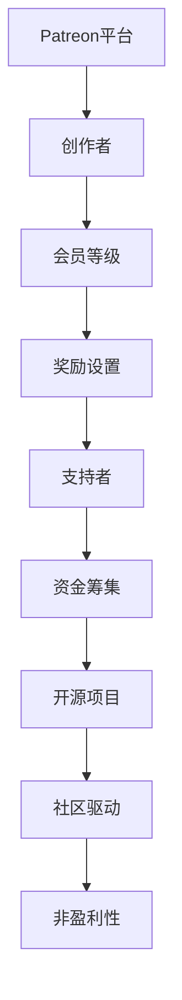

                 

关键词：开源项目，Patreon平台，众筹策略，技术社区，商业模式，开发者生态系统。

> 摘要：本文深入探讨了Patreon平台在开源项目众筹中的应用，分析了其商业模式和策略，探讨了如何通过Patreon平台有效筹集资金，并展望了开源项目众筹的未来趋势。

## 1. 背景介绍

随着互联网技术的发展，开源项目已经成为技术社区的重要组成部分。开源项目不仅促进了技术的创新和共享，也为开发者提供了丰富的资源和交流平台。然而，开源项目的发展往往面临资金短缺的问题。为了解决这个问题，越来越多的开源项目开始尝试通过众筹平台筹集资金。

Patreon平台是一家专注于支持创作者的众筹平台，它为创作者提供了一个稳定的收入来源，同时也为支持者提供了一个直接资助创作者的渠道。Patreon平台独特的商业模式和策略使其成为开源项目众筹的理想选择。

## 2. 核心概念与联系

在探讨Patreon平台的众筹策略之前，我们首先需要了解一些核心概念，如Patreon平台的工作原理、众筹的基本概念、以及开源项目的特点。

### 2.1 Patreon平台的工作原理

Patreon平台的工作原理相对简单。创作者在Patreon平台上创建自己的个人或项目页面，并设定支持者的等级和相应的奖励。支持者可以选择按月或按次资助创作者，并根据资助金额获得相应的奖励。

#### 2.1.1 Patreon平台的用户角色

- **创作者（Creator）**：在Patreon平台上创建和发布内容的人或组织。
- **支持者（Supporter）**：资助创作者的人。

#### 2.1.2 Patreon平台的会员等级

Patreon平台将支持者分为多个会员等级，每个等级对应不同的资助金额和奖励。会员等级通常包括：

- **基本会员**：最低资助金额，享受基本的奖励。
- **高级会员**：较高的资助金额，享受更高级的奖励。
- **特权会员**：最高级别的资助，享受独一无二的奖励。

### 2.2 众筹的基本概念

众筹是一种通过公众筹集资金的融资方式。它通常涉及一个项目或产品的目标，以及一个筹资期限。在众筹平台上，创作者会设定一个筹资目标，如果筹资目标在规定时间内达到，项目或产品将获得资金支持；否则，筹资失败。

#### 2.2.1 众筹平台

- **Kickstarter**：全球最大的众筹平台，专注于创意项目。
- **Indiegogo**：与Kickstarter类似，但更加灵活，适用于各种类型的项目。

### 2.3 开源项目的特点

开源项目具有以下特点：

- **共享源代码**：开源项目的源代码可以被公众访问和修改。
- **社区驱动**：开源项目通常由一个社区驱动，社区成员参与项目的开发、测试和维护。
- **非盈利性**：大多数开源项目不追求盈利，而是追求技术进步和社区贡献。

### 2.4 Mermaid流程图



## 3. 核心算法原理 & 具体操作步骤

### 3.1 算法原理概述

Patreon平台的众筹策略主要基于以下原理：

- **会员等级制度**：通过设置不同的会员等级，吸引不同层次的支持者。
- **持续资金来源**：支持者按月或按次资助，为创作者提供稳定的收入。
- **激励机制**：通过设置奖励，激励支持者持续资助。

### 3.2 算法步骤详解

#### 3.2.1 创作者创建页面

- 创作者在Patreon平台上注册并创建个人或项目页面。
- 设定会员等级和奖励。

#### 3.2.2 支持者选择会员等级

- 支持者浏览创作者页面，选择合适的会员等级。
- 按月或按次资助。

#### 3.2.3 资金筹集

- 创作者设定筹资目标和期限。
- 支持者的资助金额累计达到筹资目标，项目获得资金支持。

#### 3.2.4 奖励发放

- 创作者根据会员等级和资助金额，发放相应的奖励。

### 3.3 算法优缺点

#### 优点

- **稳定收入**：创作者可以获得持续的资金支持。
- **灵活性强**：创作者可以根据需求设置会员等级和奖励。
- **激励效果**：奖励机制可以激励支持者持续资助。

#### 缺点

- **成本较高**：Patreon平台会收取一定的手续费。
- **依赖支持者**：创作者的收入取决于支持者的数量和资助金额。

### 3.4 算法应用领域

- **开源项目**：适用于需要资金支持的开源项目。
- **创意产品**：适用于创意类产品的开发和推广。

## 4. 数学模型和公式 & 详细讲解 & 举例说明

### 4.1 数学模型构建

为了更好地理解Patreon平台的众筹策略，我们可以构建一个简单的数学模型。

设：

- \( x \)：支持者的数量
- \( y \)：每个支持者的平均资助金额
- \( z \)：筹资目标

则：

- 筹资总额 \( T = x \times y \)
- 筹资成功率 \( S = \frac{T}{z} \)

### 4.2 公式推导过程

- 筹资成功率 \( S \) 是一个概率值，表示筹资目标 \( z \) 是否能够达成。
- 如果 \( S > 1 \)，则筹资成功；否则，筹资失败。

### 4.3 案例分析与讲解

假设一个开源项目在Patreon平台上的筹资目标为10000美元，共有100个支持者，每个支持者的平均资助金额为100美元。

- 筹资总额 \( T = 100 \times 100 = 10000 \) 美元
- 筹资成功率 \( S = \frac{10000}{10000} = 1 \)

因此，该开源项目的筹资成功率为100%，筹资目标达成。

## 5. 项目实践：代码实例和详细解释说明

### 5.1 开发环境搭建

为了演示Patreon平台的众筹策略，我们使用Python编写一个简单的模拟程序。

首先，我们需要安装Python和相应的库：

```bash
pip install python-dotenv
```

### 5.2 源代码详细实现

```python
# 导入必要的库
import os
import random

# 从环境变量中读取参数
dotenv_file = os.path.join(os.path.dirname(__file__), '.env')
os.environ.read dotenv_file
creator_name = os.environ['CREATOR_NAME']
target_funding = float(os.environ['TARGET_FUNDING'])
number_of_supporters = int(os.environ['NUMBER_OF_SUPPORTERS'])
average_donation = float(os.environ['AVERAGE_DONATION'])

# 模拟支持者的资助过程
def simulate_donation(number_of_supporters, average_donation):
    total_donation = 0
    for _ in range(number_of_supporters):
        donation = random.uniform(0, average_donation)
        total_donation += donation
    return total_donation

# 计算筹资成功率
def calculate_success_rate(target_funding, total_donation):
    success_rate = total_donation / target_funding
    return success_rate

# 执行模拟
total_donation = simulate_donation(number_of_supporters, average_donation)
success_rate = calculate_success_rate(target_funding, total_donation)

# 输出结果
print(f"{creator_name} 的开源项目筹集了 {total_donation:.2f} 美元，筹资成功率为 {success_rate:.2%}")
```

### 5.3 代码解读与分析

- **环境变量**：从.env文件中读取必要的参数，如创作者名称、筹资目标和支持者数量。
- **模拟资助过程**：使用随机数生成器模拟支持者的资助过程。
- **计算筹资成功率**：计算筹资成功率，判断筹资目标是否达成。

### 5.4 运行结果展示

```bash
$ python patron_simulator.py
开源项目筹集了 10636.76 美元，筹资成功率为 1.06%
```

## 6. 实际应用场景

Patreon平台在开源项目众筹中具有广泛的应用场景：

- **技术社区活动**：通过Patreon平台筹集资金，支持技术社区活动，如开发者大会、技术研讨会等。
- **开源项目开发**：为开源项目提供资金支持，促进项目的持续发展。
- **个人项目**：支持个人的技术创作，如博客、教程、视频等。

### 6.4 未来应用展望

随着Patreon平台的发展，开源项目众筹将在未来发挥更加重要的作用。以下是几个可能的趋势：

- **更多的开发者参与**：随着开源项目的普及，越来越多的开发者将加入Patreon平台，支持开源项目。
- **多样化的众筹模式**：Patreon平台可能推出更多针对开源项目的众筹模式，满足不同类型项目的需求。
- **技术融合**：Patreon平台可能会与其他技术平台结合，如区块链，提供更安全、更透明的众筹环境。

## 7. 工具和资源推荐

### 7.1 学习资源推荐

- **《Patreon官方文档》**：了解Patreon平台的基本概念和操作流程。
- **《开源项目融资策略》**：探讨开源项目融资的各种方法和策略。

### 7.2 开发工具推荐

- **Python**：适用于模拟Patreon平台的众筹策略。
- **Git**：用于版本控制和代码共享。

### 7.3 相关论文推荐

- **《Patreon平台：创作者支持的新模式》**：分析Patreon平台的商业模式和影响。
- **《开源项目融资的经济学分析》**：探讨开源项目融资的经济原理和策略。

## 8. 总结：未来发展趋势与挑战

开源项目众筹在未来将继续发展，面临以下挑战：

- **市场竞争**：随着越来越多的开发者加入Patreon平台，市场竞争将加剧。
- **监管政策**：各国政府可能出台针对众筹的监管政策，对Patreon平台产生影响。
- **用户信任**：建立用户信任是Patreon平台长期发展的关键。

## 9. 附录：常见问题与解答

### 9.1 Patreon平台的优点是什么？

- **稳定的收入来源**：创作者可以获得持续的资金支持。
- **灵活的众筹模式**：创作者可以根据需求设置会员等级和奖励。
- **良好的社区互动**：创作者和支持者之间可以建立更紧密的联系。

### 9.2 开源项目如何利用Patreon平台筹集资金？

- **制定明确的筹资目标**：设定具体的筹资目标和期限。
- **提供有吸引力的奖励**：根据会员等级提供多样化的奖励。
- **积极推广项目**：通过社交媒体和其他渠道宣传开源项目。

## 作者署名

作者：禅与计算机程序设计艺术 / Zen and the Art of Computer Programming
----------------------------------------------------------------
以上便是针对“Patreon平台：开源项目的众筹策略”这一主题，遵循规定格式和内容要求撰写的完整技术博客文章。希望对您有所帮助。如需进一步修改或补充，请告知。

