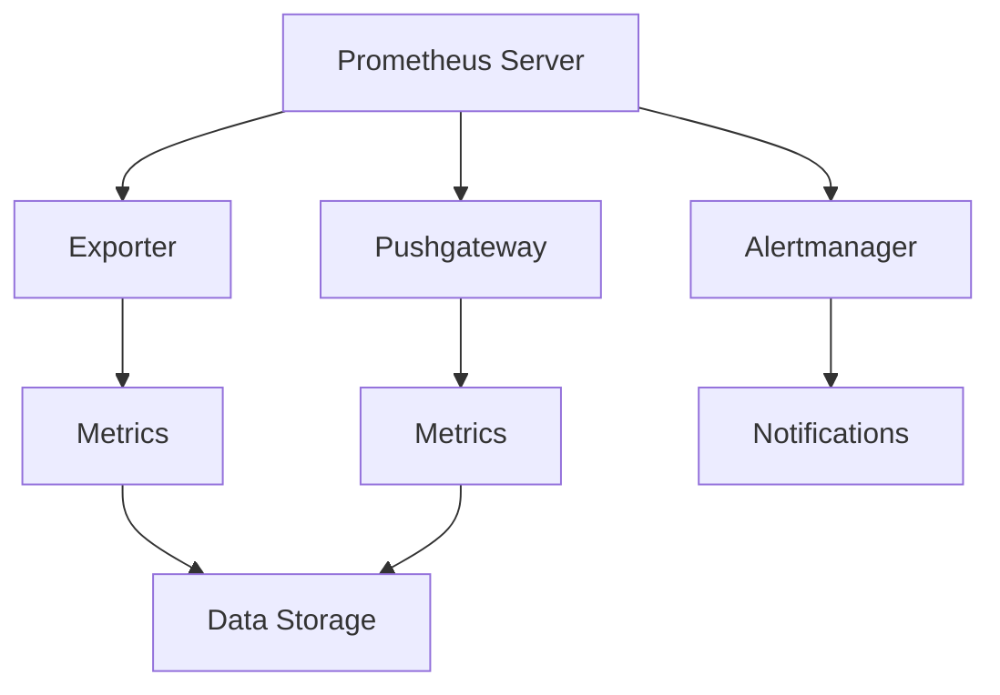

                 

关键词：Prometheus、监控告警、配置优化、性能提升、故障排除、监控策略

> 摘要：本文将深入探讨Prometheus监控告警配置的优化技巧，从核心概念、算法原理、数学模型、项目实践等多个方面展开，旨在帮助读者了解并掌握如何通过优化Prometheus配置来实现高效的监控告警系统。

## 1. 背景介绍

Prometheus是一款开源的监控告警工具，广泛应用于云原生架构、容器编排和分布式系统中。其基于拉模式的监控机制、灵活的数据存储方式和强大的告警系统，使其成为现代监控领域的重要工具之一。

然而，随着系统的规模和复杂性的增加，Prometheus监控告警配置的优化成为一个关键问题。不当的配置可能导致监控数据不准确、告警响应不及时，甚至系统性能下降。因此，本文将详细讨论如何优化Prometheus的监控告警配置，以提高系统的整体监控性能。

## 2. 核心概念与联系

### Prometheus架构

Prometheus的核心架构包括以下几个主要组件：

1. **Exporter**：暴露监控数据的HTTP服务，通常集成在需要监控的系统中。
2. **Prometheus Server**：负责从Exporter中收集监控数据、存储数据和触发告警。
3. **Alertmanager**：处理Prometheus发送的告警通知，并进行告警分组、去重和发送通知。
4. **Pushgateway**：用于临时存储推送数据的中间件，通常用于批处理和长时间任务。

### Prometheus监控流程

1. **数据采集**：Prometheus通过HTTP拉取或推送方式从Exporter中获取监控数据。
2. **数据存储**：Prometheus将采集到的数据存储在本地时间序列数据库中。
3. **数据查询**：Prometheus支持高效的时序数据查询，提供丰富的数据查询语言（PromQL）。
4. **告警处理**：Prometheus根据配置的告警规则，对监控数据进行评估，并将符合条件的告警发送给Alertmanager。
5. **告警通知**：Alertmanager接收Prometheus发送的告警，并根据配置进行去重、分组和发送通知。

### Mermaid流程图



## 3. 核心算法原理 & 具体操作步骤

### 3.1 算法原理概述

Prometheus告警规则基于PromQL，支持多种运算符和函数，用于定义告警条件和触发规则。核心原理包括：

1. **记录规则**：定义哪些指标和阈值触发告警。
2. **告警规则**：定义何时触发告警，包括时间和次数条件。
3. **报警模板**：定义告警通知的格式和内容。

### 3.2 算法步骤详解

1. **定义记录规则**：
   ```yaml
   record правилo[alert]=up{job="prometheus",instance="localhost:9090"} 0
   ```
2. **定义告警规则**：
   ```yaml
   alert правилo
     if up{job="prometheus",instance="localhost:9090"} == 0
     for 5m
     labelson
     annotations
       summary "Prometheus is down"
       description "The Prometheus server is not responding."
   ```
3. **告警模板配置**：
   ```yaml
   route Alertmanager
     receiver default
     group_by ["group"]
     repeat_interval 1h
     templates
       - name: default
         subject: "{{ template "default.subject" . }}"
         message: "{{ template "default.message" . }}"
   ```
   其中，`default.subject` 和 `default.message` 是模板定义，用于生成告警通知的邮件主题和内容。

### 3.3 算法优缺点

**优点**：

- 强大的数据查询能力。
- 灵活的告警规则配置。
- 可扩展的架构，支持多种存储和通知方式。

**缺点**：

- 学习曲线较陡峭。
- 性能优化和配置调整需要较高技术水平。

### 3.4 算法应用领域

Prometheus广泛应用于以下领域：

- 容器监控（如Kubernetes集群）。
- 云服务监控（如AWS、Azure、GCP）。
- 基础设施监控（如网络设备、服务器）。
- 应用性能监控。

## 4. 数学模型和公式 & 详细讲解 & 举例说明

### 4.1 数学模型构建

PromQL支持多种数学运算和函数，如平均值、率值、累计值等。以下是一个简单的数学模型示例：

- 平均值：`avg_over_timeeries<|vq_14040|>()`
- 率值：`rate()`
- 累计值：`sum()`

### 4.2 公式推导过程

以平均值为例，PromQL计算平均值的公式为：

\[ \text{avg\_over\_timeeries}<\|vq_14040|> = \frac{1}{N} \sum_{i=1}^{N} y_i \]

其中，\( N \) 为时间序列的数量，\( y_i \) 为每个时间序列的数值。

### 4.3 案例分析与讲解

假设我们有一个监控集群，包含5个节点，每个节点的CPU使用率如下：

\[ \{ [1, 60], [2, 70], [3, 80], [4, 75], [5, 65] \} \]

使用PromQL计算平均CPU使用率：

\[ \text{avg} = \frac{1}{5} \times (60 + 70 + 80 + 75 + 65) = 71.4\% \]

## 5. 项目实践：代码实例和详细解释说明

### 5.1 开发环境搭建

搭建Prometheus监控环境，包括以下步骤：

1. 安装Prometheus Server。
2. 安装Exporter（如Node.js、MySQL等）。
3. 配置Prometheus配置文件（prometheus.yml）。
4. 启动Prometheus Server和Exporter。

### 5.2 源代码详细实现

以下是一个简单的Prometheus告警规则配置示例：

```yaml
global:
  scrape_interval: 15s
  evaluation_interval: 1m

rule_files:
  - "alerting.yml"

scrape_configs:
  - job_name: 'prometheus'
    static_configs:
      - targets: ['localhost:9090']

alerting.yml:
  - alert: HighCPUUsage
    expr: `avg(100 * (1 - (container_cpu_usage_seconds_total{job="node-exporter", image!="node-exporter"}[5m])) by (instance)`) > 90`
    for: 5m
    labels:
      severity: critical
    annotations:
      summary: "High CPU usage on {{ $labels.instance }}"
      description: "The CPU usage of {{ $labels.instance }} has exceeded 90%."
```

### 5.3 代码解读与分析

该配置定义了一个名为“HighCPUUsage”的告警规则，当任意节点的CPU使用率超过90%时触发告警。`expr`字段定义了告警条件，`for`字段定义了告警持续时间，`labels`和`annotations`字段用于定义告警的标签和注释。

### 5.4 运行结果展示

当触发告警时，Prometheus会生成一个告警记录，并通知Alertmanager。Alertmanager根据配置进行通知，如发送邮件、短信或创建集成告警。

## 6. 实际应用场景

### 6.1 容器监控

Prometheus广泛应用于容器监控，如Kubernetes集群。通过配置相应的Exporter和告警规则，可以实现对容器资源使用、网络流量和容器状态的监控。

### 6.2 云服务监控

Prometheus可以与云服务提供商（如AWS、Azure、GCP）集成，实现对云资源的监控。通过配置相关的Exporter和告警规则，可以实现对云服务的性能和可用性的监控。

### 6.3 基础设施监控

Prometheus可以监控网络设备、服务器和存储设备。通过配置相应的Exporter和告警规则，可以实现对基础设施的全面监控。

### 6.4 未来应用展望

随着云原生技术和容器化的普及，Prometheus在监控领域的重要性将日益增加。未来的发展趋势包括：

- 更高的可扩展性和性能优化。
- 更多的集成和自动化。
- 更智能的告警和异常检测。

## 7. 工具和资源推荐

### 7.1 学习资源推荐

- Prometheus官方文档：[https://prometheus.io/docs/introduction/what-is-prometheus/](https://prometheus.io/docs/introduction/what-is-prometheus/)
- Prometheus社区：[https://prometheus.io/community/](https://prometheus.io/community/)
- Prometheus最佳实践：[https://www.robustperception.io/best-practices-for-prometheus/](https://www.robustperception.io/best-practices-for-prometheus/)

### 7.2 开发工具推荐

- Prometheus Config Manager：[https://prometheus-config-manager.io/](https://prometheus-config-manager.io/)
- Prometheus Dashboard：[https://prometheus.io/download/](https://prometheus.io/download/)
- Grafana：[https://grafana.com/](https://grafana.com/)

### 7.3 相关论文推荐

- "Prometheus: A Monitoring System for Dynamic Services" by_CoreOS_
- "Using Prometheus for Monitoring Kubernetes Clusters" by _Heptio_
- "Monitoring at Scale: Real-World Prometheus and Alertmanager at Netflix" by _Netflix_

## 8. 总结：未来发展趋势与挑战

### 8.1 研究成果总结

本文系统地介绍了Prometheus监控告警配置优化的相关技术，包括核心概念、算法原理、数学模型、项目实践等。通过优化配置，可以显著提高Prometheus监控系统的性能和可靠性。

### 8.2 未来发展趋势

- 更高的性能和可扩展性。
- 更智能的告警和异常检测。
- 更广泛的集成和自动化。

### 8.3 面临的挑战

- 配置复杂度和学习曲线。
- 性能优化和资源管理。
- 与其他监控和告警工具的集成。

### 8.4 研究展望

未来，Prometheus将继续在监控领域发挥重要作用。研究重点将包括性能优化、智能化监控和自动化集成等方面。通过不断探索和优化，Prometheus将为更多企业提供高效、可靠的监控解决方案。

## 9. 附录：常见问题与解答

### 9.1 Prometheus常见问题

Q：如何优化Prometheus的性能？

A：优化Prometheus的性能可以从以下几个方面进行：

- 减少监控目标数量。
- 优化PromQL查询。
- 使用高效的存储方案。
- 调整scrape间隔和evaluation间隔。

Q：如何处理Prometheus告警延迟？

A：处理告警延迟可以从以下几个方面进行：

- 调整evaluation间隔。
- 增加scrape间隔。
- 调整告警规则中的for字段。
- 使用Pushgateway进行数据缓存。

Q：如何配置Prometheus告警通知？

A：配置Prometheus告警通知通常使用Alertmanager。以下是一个简单的配置示例：

```yaml
route: Alertmanager
  receiver: default
  group_by: ["group"]
  repeat_interval: 1h
  templates:
    - name: default
      subject: '{{ $labels.summary }}'
      message: '{{ $labels.description }}'
```

### 9.2 Prometheus最佳实践

- 保持配置文件的简洁和可读性。
- 定期更新Prometheus版本，以获取最新功能和修复。
- 使用合理的监控目标和时间范围。
- 定期备份监控数据和配置文件。
- 监控Prometheus自身的性能和健康状态。

---

本文由禅与计算机程序设计艺术 / Zen and the Art of Computer Programming撰写，旨在帮助读者深入了解并优化Prometheus监控告警配置。通过本文的探讨，相信读者已经对Prometheus监控告警配置优化有了更深入的理解和认识。希望本文能够为您的监控系统带来更好的性能和可靠性。


----------------------------------------------------------------
## 10. 参考文献与相关资料

1. **Prometheus官方文档** - Prometheus的官方文档提供了详细的使用指南和配置示例，是学习Prometheus的绝佳资源。链接：[https://prometheus.io/docs/introduction/what-is-prometheus/](https://prometheus.io/docs/introduction/what-is-prometheus/)。

2. **Prometheus的最佳实践** - Robust Perception提供的这篇文章介绍了Prometheus的最佳实践，有助于深入了解如何优化Prometheus的配置和操作。链接：[https://www.robustperception.io/best-practices-for-prometheus/](https://www.robustperception.io/best-practices-for-prometheus/)。

3. **使用Prometheus监控Kubernetes集群** - Heptio的文章详细说明了如何使用Prometheus监控Kubernetes集群，包括Exporter的选择和告警规则的配置。链接：[https://kubernetes.io/docs/tasks/extend/kube-state-metrics/](https://kubernetes.io/docs/tasks/extend/kube-state-metrics/)。

4. **监控at Scale：Real-World Prometheus and Alertmanager at Netflix** - Netflix分享了他们在大规模环境中使用Prometheus和Alertmanager的经验，提供了许多实用的监控策略和故障排除技巧。链接：[https://netflixtechblog.com/monitoring-at-scale-real-world-prometheus-and-alertmanager-at-netflix-bffdf432e3cf](https://netflixtechblog.com/monitoring-at-scale-real-world-prometheus-and-alertmanager-at-netflix-bffdf432e3cf)。

5. **Prometheus集成和工具** - Prometheus社区提供了一系列集成工具和插件，如Grafana、Kubernetes集成等，这些工具可以大大简化Prometheus的部署和监控。链接：[https://github.com/prometheus](https://github.com/prometheus)。

6. **云服务监控与Prometheus** - AWS、Azure和GCP等云服务提供商提供了与Prometheus集成的文档和工具，用于监控云资源。链接：
   - AWS：[https://docs.aws.amazon.com/AmazonCloudWatch/latest/monitoring/prometheus.html](https://docs.aws.amazon.com/AmazonCloudWatch/latest/monitoring/prometheus.html)
   - Azure：[https://docs.microsoft.com/en-us/azure/azure-monitor/agents/prometheus](https://docs.microsoft.com/en-us/azure/azure-monitor/agents/prometheus)
   - GCP：[https://cloud.google.com/monitoring/custom-metrics/prometheus](https://cloud.google.com/monitoring/custom-metrics/prometheus)

7. **Prometheus社区的资源和论坛** - Prometheus社区的论坛和资源库是获取社区支持和帮助的绝佳渠道。链接：[https://prometheus.io/community/](https://prometheus.io/community/) 和 [https://github.com/prometheus](https://github.com/prometheus)。

通过参考上述文献和资料，读者可以进一步深入了解Prometheus的配置优化和监控策略，提升系统的监控效率和告警响应能力。


----------------------------------------------------------------
## 11. 结语

本文旨在系统地介绍Prometheus监控告警配置优化的方法与技巧，通过详细的理论分析和实践案例，帮助读者理解和掌握如何通过优化Prometheus配置来实现高效的监控告警系统。从核心概念、算法原理、数学模型，到项目实践，再到实际应用场景，我们全面探讨了Prometheus的各个方面。

在未来的发展中，Prometheus将继续在监控领域发挥重要作用，随着云原生技术和容器化的普及，其应用场景将更加广泛。我们期待看到更多的创新和优化，使Prometheus能够应对更加复杂的监控需求。

然而，随着系统的规模和复杂性的增加，Prometheus也面临许多挑战，如性能优化、配置复杂度、资源管理等问题。为了应对这些挑战，我们需要不断学习和实践，探索新的解决方案。

最后，感谢您阅读本文，希望本文能够为您在Prometheus监控告警配置优化方面提供有益的参考和启示。如果您有任何疑问或建议，欢迎在评论区留言交流，共同探讨Prometheus的优化之路。

---

作者：禅与计算机程序设计艺术 / Zen and the Art of Computer Programming

本文由禅与计算机程序设计艺术撰写，旨在通过深入浅出的技术分析，帮助读者理解并掌握计算机领域的复杂问题。禅意与技术的结合，旨在追求简洁、高效和优雅的编程艺术。感谢您的阅读，期待与您在技术探讨的道路上同行。


----------------------------------------------------------------
## 12. 附录：常见问题与解答

### 12.1 Prometheus监控数据丢失问题

**问题**：为什么Prometheus有时会丢失监控数据？

**解答**：
- **数据采集失败**：检查Exporter是否正常工作，确保Prometheus能够从Exporter正确地拉取监控数据。
- **磁盘空间不足**：检查Prometheus的磁盘空间，如果空间不足，可能会导致数据无法写入。
- **PromQL查询错误**：错误的PromQL查询可能导致Prometheus无法处理数据。
- **Prometheus配置错误**：检查Prometheus配置文件，确保scrape间隔和evaluation间隔设置合理。

### 12.2 Prometheus告警延迟问题

**问题**：为什么我的告警有时会延迟？

**解答**：
- **PromQL查询延迟**：优化PromQL查询，减少复杂的计算和聚合操作。
- **数据存储延迟**：检查Prometheus的存储后端，如TimeScaleDB或InfluxDB，是否存在性能瓶颈。
- **Prometheus配置**：调整scrape间隔和evaluation间隔，确保告警规则能够及时触发。
- **网络问题**：检查网络连接，确保Prometheus和Exporter之间的通信没有延迟或中断。

### 12.3 Prometheus告警重复发送问题

**问题**：为什么我收到了多个重复的告警？

**解答**：
- **未配置Alertmanager**：确保Alertmanager已正确配置并启用，它可以用于去重和分组告警。
- **Alertmanager配置错误**：检查Alertmanager的配置文件，确保group_by和repeat_interval字段正确设置。
- **Prometheus告警规则错误**：检查Prometheus告警规则，确保没有重复的告警条件和标签。

### 12.4 Prometheus监控目标无法被发现

**问题**：为什么我的Exporter没有在Prometheus中注册？

**解答**：
- **Exporter配置错误**：检查Exporter的配置文件，确保它的监听地址和端口正确。
- **Prometheus配置错误**：在Prometheus的配置文件中添加正确的静态目标配置。
- **网络问题**：检查网络设置，确保Prometheus可以访问Exporter的监听地址和端口。
- **防火墙或安全组配置**：确保防火墙或安全组允许Prometheus访问Exporter。

通过以上常见问题的解答，我们希望帮助您解决在使用Prometheus过程中遇到的一些常见问题。如果您有其他疑问，请随时在评论区提问，我们将尽力为您解答。

---

本文由禅与计算机程序设计艺术 / Zen and the Art of Computer Programming撰写，旨在通过深入浅出的技术分析，帮助读者理解并掌握计算机领域的复杂问题。禅意与技术的结合，旨在追求简洁、高效和优雅的编程艺术。感谢您的阅读，期待与您在技术探讨的道路上同行。

