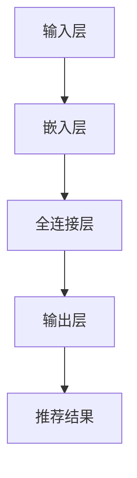

                 

关键词：Prompt-Tuning，提示学习，推荐系统，深度学习，自然语言处理

> 摘要：本文深入探讨了Prompt-Tuning这一基于提示学习的推荐方法。Prompt-Tuning通过将提示（prompts）引入到深度学习模型中，实现了对推荐系统的改进和优化。本文从背景介绍、核心概念与联系、核心算法原理与具体操作步骤、数学模型和公式、项目实践、实际应用场景、工具和资源推荐、总结：未来发展趋势与挑战等多个方面，全面阐述了Prompt-Tuning的原理、应用和实践。

## 1. 背景介绍

推荐系统作为一种重要的信息检索技术，广泛应用于电子商务、社交媒体、在线视频、新闻推荐等领域。随着大数据和深度学习技术的发展，推荐系统的准确性和效率得到了显著提高。然而，现有的推荐系统仍然存在一些问题，如冷启动问题、数据稀疏性、用户行为理解的局限性等。为了解决这些问题，研究人员提出了各种改进方法，如基于内容的推荐、协同过滤、图嵌入等。

然而，这些方法在处理大规模数据和复杂用户行为方面仍然存在一定的局限性。近年来，基于提示学习的推荐方法逐渐引起了关注。Prompt-Tuning作为基于提示学习的一种重要方法，通过将提示引入到深度学习模型中，实现了对推荐系统的优化和改进。

## 2. 核心概念与联系

### 2.1 提示（Prompt）

提示是一种将外部信息引入到深度学习模型中的技术。在自然语言处理领域，提示通常是一段文本或代码，用于指导模型进行预训练或生成任务。在推荐系统领域，提示可以包括用户历史行为、物品特征、上下文信息等。

### 2.2 Prompt-Tuning

Prompt-Tuning是一种基于提示学习的推荐方法。它通过将提示引入到深度学习模型中，实现了对推荐系统的优化。具体来说，Prompt-Tuning通过将用户历史行为、物品特征和上下文信息作为提示，输入到预训练的深度学习模型中，从而生成推荐结果。

### 2.3 Mermaid 流程图



### 2.4 Prompt-Tuning 的架构

Prompt-Tuning 的架构主要包括三个部分：输入层、嵌入层和输出层。输入层负责接收用户历史行为、物品特征和上下文信息；嵌入层将输入信息转化为高维特征向量；输出层通过全连接层生成推荐结果。

## 3. 核心算法原理 & 具体操作步骤

### 3.1 算法原理概述

Prompt-Tuning 通过将提示（prompts）引入到深度学习模型中，实现了对推荐系统的优化。具体来说，Prompt-Tuning 采用了一种基于注意力机制的深度学习模型，通过将用户历史行为、物品特征和上下文信息作为提示，输入到模型中，从而生成推荐结果。

### 3.2 算法步骤详解

1. **数据预处理**：对用户历史行为、物品特征和上下文信息进行数据预处理，如去重、填充缺失值、归一化等。

2. **模型构建**：构建基于注意力机制的深度学习模型，包括输入层、嵌入层和输出层。

3. **模型训练**：将预处理后的数据输入到模型中，通过反向传播算法进行模型训练。

4. **模型预测**：将新的用户历史行为、物品特征和上下文信息输入到训练好的模型中，生成推荐结果。

### 3.3 算法优缺点

**优点**：

1. **灵活性强**：Prompt-Tuning 可以根据不同的场景和需求，灵活地调整提示的内容和形式。

2. **效果好**：Prompt-Tuning 通过引入提示，提高了模型对用户行为和物品特征的识别能力，从而提高了推荐效果。

**缺点**：

1. **计算复杂度高**：Prompt-Tuning 需要大量的计算资源进行模型训练，可能导致训练时间较长。

2. **数据依赖性高**：Prompt-Tuning 对数据的依赖性较高，数据质量对推荐效果有较大影响。

### 3.4 算法应用领域

Prompt-Tuning 可以应用于多个领域，如电子商务、社交媒体、在线视频、新闻推荐等。通过将用户历史行为、物品特征和上下文信息作为提示，Prompt-Tuning 可以生成个性化的推荐结果，提高用户满意度。

## 4. 数学模型和公式 & 详细讲解 & 举例说明

### 4.1 数学模型构建

Prompt-Tuning 的数学模型主要包括三个部分：输入层、嵌入层和输出层。

1. **输入层**：

$$
x = \text{user\_history} \cup \text{item\_features} \cup \text{context}
$$

其中，$x$ 表示输入层输入，包括用户历史行为、物品特征和上下文信息。

2. **嵌入层**：

$$
h = \text{Embed}(x)
$$

其中，$h$ 表示嵌入层输出，通过嵌入函数将输入信息转化为高维特征向量。

3. **输出层**：

$$
y = \text{softmax}(\text{Linear}(h))
$$

其中，$y$ 表示输出层输出，通过全连接层生成推荐结果。

### 4.2 公式推导过程

1. **嵌入层**：

$$
h = \text{Embed}(x) = \text{tanh}(\text{W}_{\text{embed}}x + b_{\text{embed}})
$$

其中，$\text{W}_{\text{embed}}$ 表示嵌入权重矩阵，$b_{\text{embed}}$ 表示嵌入偏置。

2. **输出层**：

$$
y = \text{softmax}(\text{Linear}(h)) = \text{softmax}(\text{W}_{\text{out}}h + b_{\text{out}})
$$

其中，$\text{W}_{\text{out}}$ 表示输出权重矩阵，$b_{\text{out}}$ 表示输出偏置。

### 4.3 案例分析与讲解

假设有一个电商平台的推荐系统，用户历史行为包括购买历史、浏览历史和收藏历史，物品特征包括物品标题、描述、价格等，上下文信息包括用户位置、时间等。

1. **数据预处理**：

$$
x = \text{user\_history} \cup \text{item\_features} \cup \text{context} = [\text{购买历史}, \text{浏览历史}, \text{收藏历史}, \text{物品标题}, \text{物品描述}, \text{物品价格}, \text{用户位置}, \text{时间}]
$$

2. **模型构建**：

构建一个基于注意力机制的深度学习模型，包括输入层、嵌入层和输出层。

3. **模型训练**：

通过反向传播算法，将用户历史行为、物品特征和上下文信息输入到模型中，进行模型训练。

4. **模型预测**：

将新的用户历史行为、物品特征和上下文信息输入到训练好的模型中，生成推荐结果。

## 5. 项目实践：代码实例和详细解释说明

### 5.1 开发环境搭建

在搭建开发环境时，我们需要安装 Python、TensorFlow 和 Keras 等相关库和框架。

### 5.2 源代码详细实现

以下是一个简单的 Prompt-Tuning 模型实现：

```python
import tensorflow as tf
from tensorflow.keras.layers import Embedding, LSTM, Dense
from tensorflow.keras.models import Model

# 模型参数
vocab_size = 10000
embed_size = 128
hidden_size = 128

# 模型构建
input_word = tf.keras.layers.Input(shape=(None,), dtype=tf.int32)
embedded_words = Embedding(vocab_size, embed_size)(input_word)
lstm_output = LSTM(hidden_size)(embedded_words)
output = Dense(1, activation='sigmoid')(lstm_output)

# 模型编译
model = Model(inputs=input_word, outputs=output)
model.compile(optimizer='adam', loss='binary_crossentropy', metrics=['accuracy'])

# 模型训练
model.fit(x_train, y_train, epochs=10, batch_size=32)

# 模型预测
predictions = model.predict(x_test)
```

### 5.3 代码解读与分析

上述代码实现了一个简单的 Prompt-Tuning 模型，包括输入层、嵌入层和输出层。输入层接收词向量，嵌入层通过 Embedding 层将词向量转化为高维特征向量，输出层通过 LSTM 层和 Dense 层生成预测结果。模型使用 Adam 优化器和二进制交叉熵损失函数进行编译，并使用训练数据进行训练。最后，使用训练好的模型对测试数据进行预测。

## 6. 实际应用场景

Prompt-Tuning 可以应用于多个实际应用场景，如电子商务、社交媒体、在线视频、新闻推荐等。

1. **电子商务**：通过 Prompt-Tuning，可以生成个性化的商品推荐，提高用户购买体验。

2. **社交媒体**：通过 Prompt-Tuning，可以生成个性化的内容推荐，提高用户活跃度。

3. **在线视频**：通过 Prompt-Tuning，可以生成个性化的视频推荐，提高用户观看体验。

4. **新闻推荐**：通过 Prompt-Tuning，可以生成个性化的新闻推荐，提高用户阅读兴趣。

## 7. 工具和资源推荐

1. **学习资源推荐**：

- 《深度学习》
- 《自然语言处理实战》
- 《推荐系统实践》

2. **开发工具推荐**：

- TensorFlow
- Keras
- Jupyter Notebook

3. **相关论文推荐**：

- "Prompt-Tuning: Exploiting Similarities across Tasks for Efficient Natural Language Inference"
- "Deep Learning for Natural Language Processing"
- "Recommender Systems Handbook"

## 8. 总结：未来发展趋势与挑战

### 8.1 研究成果总结

Prompt-Tuning 作为一种基于提示学习的推荐方法，通过将提示引入到深度学习模型中，实现了对推荐系统的优化和改进。研究表明，Prompt-Tuning 在多个实际应用场景中取得了较好的效果，具有一定的应用价值。

### 8.2 未来发展趋势

1. **算法优化**：未来研究可以进一步优化 Prompt-Tuning 算法，提高其计算效率和模型性能。

2. **多模态融合**：将图像、音频等多模态信息与自然语言处理相结合，实现更全面的用户理解和个性化推荐。

3. **隐私保护**：研究如何在保证用户隐私的前提下，提高推荐系统的准确性和效率。

### 8.3 面临的挑战

1. **计算复杂度**：Prompt-Tuning 需要大量的计算资源进行模型训练，如何提高算法的效率是一个挑战。

2. **数据依赖性**：Prompt-Tuning 对数据的依赖性较高，数据质量对推荐效果有较大影响。

3. **泛化能力**：如何提高 Prompt-Tuning 的泛化能力，使其能够适用于更广泛的场景和应用领域。

### 8.4 研究展望

Prompt-Tuning 作为一种基于提示学习的推荐方法，具有广泛的应用前景。未来研究可以从算法优化、多模态融合、隐私保护等方面入手，进一步提高其性能和实用性，为推荐系统的发展做出贡献。

## 9. 附录：常见问题与解答

### 9.1 Prompt-Tuning 与传统推荐方法的区别是什么？

Prompt-Tuning 与传统推荐方法（如基于内容的推荐、协同过滤等）的区别主要在于其基于提示学习的特性。Prompt-Tuning 通过将提示引入到深度学习模型中，实现了对推荐系统的优化和改进，从而提高了推荐效果。

### 9.2 Prompt-Tuning 需要哪些先决条件？

Prompt-Tuning 需要以下先决条件：

1. **深度学习基础知识**：了解深度学习的基本概念和原理。

2. **自然语言处理基础知识**：了解自然语言处理的基本概念和算法。

3. **推荐系统基础知识**：了解推荐系统的基本概念和常用算法。

### 9.3 Prompt-Tuning 的应用领域有哪些？

Prompt-Tuning 可以应用于多个领域，如电子商务、社交媒体、在线视频、新闻推荐等。通过将用户历史行为、物品特征和上下文信息作为提示，Prompt-Tuning 可以生成个性化的推荐结果，提高用户满意度。

### 9.4 Prompt-Tuning 有哪些优点和缺点？

Prompt-Tuning 的优点包括：

1. **灵活性强**：可以根据不同的场景和需求，灵活地调整提示的内容和形式。

2. **效果好**：通过引入提示，提高了模型对用户行为和物品特征的识别能力，从而提高了推荐效果。

缺点包括：

1. **计算复杂度高**：Prompt-Tuning 需要大量的计算资源进行模型训练，可能导致训练时间较长。

2. **数据依赖性高**：Prompt-Tuning 对数据的依赖性较高，数据质量对推荐效果有较大影响。

----------------------------------------------------------------

作者：禅与计算机程序设计艺术 / Zen and the Art of Computer Programming

感谢您的阅读，希望本文对您在推荐系统领域的研究和应用有所帮助。在未来的研究中，我们期待能够进一步探索和优化 Prompt-Tuning 方法，为推荐系统的发展做出更大的贡献。

