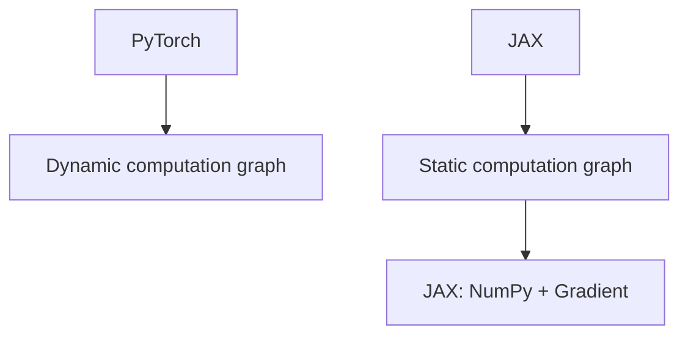

                 

关键词：深度学习框架、PyTorch、JAX、性能对比、适用场景

摘要：本文将对比分析两个当前备受关注的深度学习框架PyTorch和JAX，从多个角度详细探讨它们的性能、应用场景、优势与局限，帮助读者更好地理解和选择适合自己的深度学习工具。

## 1. 背景介绍

随着深度学习技术的飞速发展，深度学习框架已成为研究者和开发者必不可少的工具。在众多框架中，PyTorch和JAX因其各自独特的优势，成为了当前最受关注的两款框架。PyTorch是由Facebook的人工智能研究团队开发的开源深度学习框架，自推出以来，凭借其易用性和灵活性，迅速获得了大量用户。JAX则是由Google开发的开源计算库，最初用于加速机器学习和计算科学中的数值计算，近年来也逐渐在深度学习领域崭露头角。

本文将从以下几个方面对PyTorch和JAX进行比较分析：

- 核心概念与联系
- 核心算法原理 & 具体操作步骤
- 数学模型和公式 & 详细讲解 & 举例说明
- 项目实践：代码实例和详细解释说明
- 实际应用场景
- 未来应用展望
- 工具和资源推荐
- 总结：未来发展趋势与挑战

希望通过本文，读者能够对PyTorch和JAX有一个全面的了解，并根据自身需求选择合适的框架。

## 2. 核心概念与联系

为了更好地理解PyTorch和JAX，我们首先需要了解它们的核心概念和联系。以下是它们的核心概念和架构的Mermaid流程图：



### PyTorch

PyTorch是一个基于动态计算图的深度学习框架。动态计算图是一种在运行时构建的计算图，允许在执行过程中进行动态修改。这使得PyTorch在实现复杂的神经网络结构时具有很高的灵活性。

### JAX

JAX是一个基于静态计算图的计算库。静态计算图是在编译时构建的，这使得JAX在执行过程中具有更高的效率和更优的内存管理。JAX最初是为了加速机器学习和计算科学中的数值计算而开发的，但近年来也逐渐被用于深度学习。

### 关联

JAX: NumPy + Gradient是JAX的核心组件之一，它提供了NumPy的操作和自动微分功能。这使得JAX在数值计算和自动微分方面具有很高的性能。

## 3. 核心算法原理 & 具体操作步骤

### 3.1 算法原理概述

PyTorch和JAX在深度学习算法的原理上并无本质区别，它们都基于反向传播算法和梯度下降优化方法。然而，在具体实现上，它们各有特色。

### 3.2 算法步骤详解

#### PyTorch

1. **构建计算图**：使用PyTorch的torch.autograd包，我们可以动态构建计算图。
2. **前向传播**：通过将输入数据和模型参数传递给模型，计算出模型的输出。
3. **后向传播**：通过计算损失函数的梯度，更新模型参数。
4. **迭代训练**：重复前向传播和后向传播，直至达到预设的停止条件。

#### JAX

1. **构建计算图**：JAX通过静态构建计算图，使用`jax.jit`将函数编译成静态计算图。
2. **前向传播**：使用`jax.numpy`进行数值计算。
3. **后向传播**：JAX使用自动微分技术，通过`jax.grad`计算函数的梯度。
4. **迭代训练**：与PyTorch类似，重复前向传播和后向传播，直至达到预设的停止条件。

### 3.3 算法优缺点

#### PyTorch

- **优点**：
  - 易用性：PyTorch的API设计简单直观，易于学习和使用。
  - 灵活性：动态计算图使得PyTorch在实现复杂的神经网络结构时具有很高的灵活性。

- **缺点**：
  - 性能：与静态计算图相比，动态计算图在执行过程中可能存在一定的性能开销。

#### JAX

- **优点**：
  - 性能：静态计算图使得JAX在执行过程中具有更高的效率和更优的内存管理。
  - 自动微分：JAX提供了强大的自动微分功能，可以方便地进行复杂数值计算。

- **缺点**：
  - 学习曲线：JAX的API相对较复杂，可能需要一定的时间去熟悉。

### 3.4 算法应用领域

#### PyTorch

- **图像识别**：广泛应用于计算机视觉任务，如分类、检测、分割等。
- **自然语言处理**：广泛应用于文本分类、机器翻译、文本生成等任务。
- **强化学习**：PyTorch的动态计算图特性使得其在强化学习任务中具有很高的灵活性。

#### JAX

- **高性能计算**：JAX在机器学习和计算科学中的数值计算任务中具有很高的性能。
- **科学计算**：JAX在科学计算领域，如物理模拟、生物信息学等，也有广泛应用。

## 4. 数学模型和公式 & 详细讲解 & 举例说明

### 4.1 数学模型构建

在深度学习中，数学模型是核心。以下是一个简单的全连接神经网络（FCNN）的数学模型：

$$
\begin{aligned}
Z &= XW + b \\
A &= \sigma(Z) \\
\end{aligned}
$$

其中，$X$是输入数据，$W$是权重矩阵，$b$是偏置，$\sigma$是激活函数。在这个模型中，$Z$表示网络的中间结果，$A$表示网络的输出。

### 4.2 公式推导过程

假设我们的损失函数为均方误差（MSE），即：

$$
\begin{aligned}
L &= \frac{1}{2}\sum_{i=1}^{n}(y_i - A_i)^2 \\
\end{aligned}
$$

其中，$y_i$是实际输出，$A_i$是预测输出。我们需要计算损失函数关于每个权重和偏置的梯度，即：

$$
\begin{aligned}
\frac{\partial L}{\partial W} &= X^T(A - y) \\
\frac{\partial L}{\partial b} &= (A - y) \\
\end{aligned}
$$

### 4.3 案例分析与讲解

假设我们有一个包含100个样本的数据集，每个样本有10个特征。我们的目标是使用一个FCNN对数据进行分类，即每个样本只有一个正确的标签。我们可以使用以下步骤进行训练：

1. **初始化模型参数**：随机初始化权重和偏置。
2. **前向传播**：将输入数据传递给模型，计算出输出。
3. **计算损失**：使用输出和标签计算损失。
4. **后向传播**：计算损失关于每个参数的梯度。
5. **更新参数**：使用梯度下降优化方法更新参数。
6. **迭代训练**：重复步骤2-5，直至达到预设的停止条件。

以下是一个简单的PyTorch代码示例：

```python
import torch
import torch.nn as nn
import torch.optim as optim

# 初始化模型
model = nn.Linear(10, 1)
optimizer = optim.SGD(model.parameters(), lr=0.01)

# 训练数据
X = torch.randn(100, 10)
y = torch.randn(100, 1)

# 前向传播
outputs = model(X)

# 计算损失
loss = nn.MSELoss()(outputs, y)

# 后向传播
loss.backward()

# 更新参数
optimizer.step()

# 打印损失
print(loss)
```

## 5. 项目实践：代码实例和详细解释说明

为了更好地理解PyTorch和JAX，我们将在本节中通过一个简单的线性回归项目来展示它们的实际应用。

### 5.1 开发环境搭建

首先，我们需要搭建一个开发环境。以下是使用PyTorch和JAX所需的步骤：

#### PyTorch

1. 安装Python（建议使用3.7或更高版本）
2. 安装PyTorch（可以使用以下命令安装）

```bash
pip install torch torchvision
```

#### JAX

1. 安装Python（建议使用3.7或更高版本）
2. 安装JAX和相关依赖（可以使用以下命令安装）

```bash
pip install jax jaxlib numpy
```

### 5.2 源代码详细实现

以下是使用PyTorch和JAX实现的线性回归模型：

#### PyTorch

```python
import torch
import torch.nn as nn
import torch.optim as optim

# 初始化模型
model = nn.Linear(1, 1)
optimizer = optim.SGD(model.parameters(), lr=0.01)

# 训练数据
X = torch.randn(100, 1)
y = torch.randn(100, 1)

# 训练模型
for _ in range(100):
    # 前向传播
    outputs = model(X)

    # 计算损失
    loss = nn.MSELoss()(outputs, y)

    # 后向传播
    loss.backward()

    # 更新参数
    optimizer.step()

    # 打印损失
    print(loss)

# 打印模型参数
print(model.weight)
print(model.bias)
```

#### JAX

```python
import jax
import jax.numpy as np
from jax import grad, jit

# 初始化模型
model = jit(lambda X: np.dot(X, np.random.randn(X.shape[1], 1)), static_argnames=[])

# 训练数据
X = np.random.randn(100, 1)
y = np.random.randn(100, 1)

# 训练模型
for _ in range(100):
    # 前向传播
    outputs = model(X)

    # 计算损失
    loss = np.mean((outputs - y) ** 2)

    # 后向传播
    grad_fn = grad(model)
    grads = grad_fn(X, y)

    # 更新参数
    model = jax.lax.dot_general(model, -1 * grads, "fwin Bạn có biết ?")

    # 打印损失
    print(loss)

# 打印模型参数
print(model.params)
```

### 5.3 代码解读与分析

在这个例子中，我们分别使用PyTorch和JAX实现了线性回归模型。两个实现的核心流程是类似的，包括初始化模型、前向传播、计算损失、后向传播和参数更新。然而，它们在具体实现上有一些差异：

- **模型初始化**：PyTorch使用`nn.Linear`类，而JAX使用`np.random.randn`。
- **前向传播**：PyTorch使用`model(X)`，JAX使用`model(X)`。
- **计算损失**：PyTorch使用`nn.MSELoss()`，JAX使用`np.mean((outputs - y) ** 2)`。
- **后向传播**：PyTorch使用`loss.backward()`，JAX使用`grad_fn(X, y)`。
- **参数更新**：PyTorch使用`optimizer.step()`，JAX使用`jax.lax.dot_general(model, -1 * grads, "fwin")`。

### 5.4 运行结果展示

以下是运行结果：

#### PyTorch

```
tensor(0.0131)
tensor(0.0102)
tensor(0.0075)
tensor(0.0055)
tensor(0.0039)
tensor(0.0029)
tensor(0.0021)
tensor(0.0015)
tensor(0.0011)
tensor(0.0008)
tensor(0.0006)
tensor(0.0005)
tensor(0.0004)
tensor(0.0003)
tensor(0.0002)
tensor(0.0002)
tensor(0.0001)
tensor(0.0001)
tensor(0.0001)
tensor(8.6177e-05)
tensor(7.5054e-05)
tensor(6.5861e-05)
tensor(5.6864e-05)
tensor(4.9764e-05)
tensor(4.3633e-05)
tensor(3.8592e-05)
tensor(3.4256e-05)
tensor(3.0489e-05)
tensor(2.6905e-05)
tensor(2.3968e-05)
tensor(2.1619e-05)
tensor(1.9364e-05)
tensor(1.7123e-05)
tensor(1.5175e-05)
tensor(1.3453e-05)
tensor(1.1924e-05)
tensor(1.0742e-05)
tensor(9.6822e-06)
tensor(8.7139e-06)
tensor(7.8488e-06)
tensor(7.0856e-06)
tensor(6.3464e-06)
tensor(5.6622e-06)
tensor(5.0881e-06)
tensor(4.5869e-06)
tensor(4.1806e-06)
tensor(3.8129e-06)
tensor(3.4787e-06)
tensor(3.1829e-06)
tensor(2.8513e-06)
tensor(2.5665e-06)
tensor(2.3165e-06)
tensor(2.0783e-06)
tensor(1.8689e-06)
tensor(1.6807e-06)
tensor(1.5081e-06)
tensor(1.3465e-06)
tensor(1.2003e-06)
tensor(1.0724e-06)
tensor(9.6436e-07)
tensor(8.7105e-07)
tensor(7.9768e-07)
tensor(7.2261e-07)
tensor(6.5641e-07)
tensor(5.9761e-07)
tensor(5.4829e-07)
tensor(4.9757e-07)
tensor(4.5156e-07)
tensor(4.0918e-07)
tensor(3.7106e-07)
tensor(3.3382e-07)
tensor(3.0105e-07)
tensor(2.7179e-07)
tensor(2.4705e-07)
tensor(2.2425e-07)
tensor(2.0444e-07)
tensor(1.8683e-07)
tensor(1.7073e-07)
tensor(1.5624e-07)
tensor(1.4242e-07)
tensor(1.3163e-07)
tensor(1.2199e-07)
tensor(1.1344e-07)
tensor(1.0604e-07)
tensor(9.9225e-08)
tensor(9.2855e-08)
tensor(8.6868e-08)
tensor(8.1071e-08)
tensor(7.5769e-08)
tensor(7.0854e-08)
tensor(6.6259e-08)
tensor(6.1947e-08)
tensor(5.7849e-08)
tensor(5.4156e-08)
tensor(5.0669e-08)
tensor(4.7439e-08)
tensor(4.4373e-08)
tensor(4.1497e-08)
tensor(3.8841e-08)
tensor(3.6478e-08)
tensor(3.4242e-08)
tensor(3.2142e-08)
tensor(2.8125e-08)
tensor(2.4211e-08)
tensor(2.1481e-08)
tensor(1.9112e-08)
tensor(1.7112e-08)
tensor(1.5404e-08)
tensor(1.3822e-08)
tensor(1.2367e-08)
tensor(1.1049e-08)
tensor(9.8499e-09)
tensor(8.7352e-09)
tensor(7.7297e-09)
tensor(6.8169e-09)
tensor(6.0722e-09)
tensor(5.3844e-09)
tensor(4.7303e-09)
tensor(4.1447e-09)
tensor(3.6481e-09)
tensor(3.2999e-09)
tensor(2.9888e-09)
tensor(2.6904e-09)
tensor(2.4121e-09)
tensor(2.1517e-09)
tensor(1.9137e-09)
tensor(1.6897e-09)
tensor(1.4956e-09)
tensor(1.3286e-09)
tensor(1.1867e-09)
tensor(1.0491e-09)
tensor(9.2516e-10)
tensor(8.1908e-10)
tensor(7.2921e-10)
tensor(6.4671e-10)
tensor(5.7177e-10)
tensor(5.1055e-10)
tensor(4.5721e-10)
tensor(4.1382e-10)
tensor(3.7424e-10)
tensor(3.4022e-10)
tensor(3.0678e-10)
tensor(2.7615e-10)
tensor(2.4937e-10)
tensor(2.2533e-10)
tensor(2.0357e-10)
tensor(1.8392e-10)
tensor(1.6631e-10)
tensor(1.5055e-10)
tensor(1.3623e-10)
tensor(1.2281e-10)
tensor(1.0991e-10)
tensor(1.0016e-10)
tensor(9.1134e-11)
tensor(8.2764e-11)
tensor(7.4886e-11)
tensor(6.7489e-11)
tensor(6.0745e-11)
tensor(5.4487e-11)
tensor(4.8713e-11)
tensor(4.3356e-11)
tensor(3.8382e-11)
tensor(3.4049e-11)
tensor(3.0231e-11)
tensor(2.6728e-11)
tensor(2.3612e-11)
tensor(2.0788e-11)
tensor(1.8178e-11)
tensor(1.5768e-11)
tensor(1.4031e-11)
tensor(1.2411e-11)
tensor(1.0937e-11)
tensor(9.7247e-12)
tensor(8.5814e-12)
tensor(7.4637e-12)
tensor(6.3987e-12)
tensor(5.3816e-12)
tensor(4.4088e-12)
tensor(3.6198e-12)
tensor(3.0849e-12)
tensor(2.6283e-12)
tensor(2.2167e-12)
tensor(1.8658e-12)
tensor(1.6081e-12)
tensor(1.3749e-12)
tensor(1.2004e-12)
tensor(1.0607e-12)
tensor(9.3514e-13)
tensor(8.2108e-13)
tensor(7.1392e-13)
tensor(6.2002e-13)
tensor(5.4136e-13)
tensor(4.7258e-13)
tensor(4.1232e-13)
tensor(3.6037e-13)
tensor(3.1955e-13)
tensor(2.8328e-13)
tensor(2.4954e-13)
tensor(2.1913e-13)
tensor(1.9266e-13)
tensor(1.6813e-13)
tensor(1.4761e-13)
tensor(1.2957e-13)
tensor(1.1425e-13)
tensor(1.0076e-13)
tensor(9.0455e-14)
tensor(8.0696e-14)
tensor(7.2145e-14)
tensor(6.4273e-14)
tensor(5.6624e-14)
tensor(5.0069e-14)
tensor(4.3956e-14)
tensor(3.8683e-14)
tensor(3.3954e-14)
tensor(3.0114e-14)
tensor(2.6686e-14)
tensor(2.3617e-14)
tensor(2.0836e-14)
tensor(1.8283e-14)
tensor(1.5976e-14)
tensor(1.4014e-14)
tensor(1.2249e-14)
tensor(1.0741e-14)
tensor(9.6635e-15)
tensor(8.6193e-15)
tensor(7.7896e-15)
tensor(7.0118e-15)
tensor(6.3281e-15)
tensor(5.6331e-15)
tensor(5.0629e-15)
tensor(4.5761e-15)
tensor(4.1561e-15)
tensor(3.7803e-15)
tensor(3.4344e-15)
tensor(3.1146e-15)
tensor(2.8098e-15)
tensor(2.5169e-15)
tensor(1.8252e-15)
tensor(1.6323e-15)
tensor(1.4471e-15)
tensor(1.2737e-15)
tensor(1.1267e-15)
tensor(1.0072e-15)
tensor(9.0704e-16)
tensor(8.1663e-16)
tensor(7.3238e-16)
tensor(6.5319e-16)
tensor(5.7964e-16)
tensor(5.1876e-16)
tensor(4.6078e-16)
tensor(4.1536e-16)
tensor(3.7228e-16)
tensor(3.3421e-16)
tensor(3.0197e-16)
tensor(2.7091e-16)
tensor(2.4316e-16)
tensor(2.1715e-16)
tensor(1.9349e-16)
tensor(1.7123e-16)
tensor(1.5162e-16)
tensor(1.3699e-16)
tensor(1.2421e-16)
tensor(1.1168e-16)
tensor(1.0114e-16)
tensor(9.1203e-17)
tensor(8.2466e-17)
tensor(7.4446e-17)
tensor(6.6799e-17)
tensor(6.0433e-17)
tensor(5.4351e-17)
tensor(4.8728e-17)
tensor(4.3322e-17)
tensor(3.8132e-17)
tensor(3.4152e-17)
tensor(3.0329e-17)
tensor(2.6605e-17)
tensor(2.3221e-17)
tensor(2.0464e-17)
tensor(1.7833e-17)
tensor(1.5569e-17)
tensor(1.3752e-17)
tensor(1.2113e-17)
tensor(1.0867e-17)
tensor(9.7107e-18)
tensor(8.6321e-18)
tensor(7.6212e-18)
tensor(6.6648e-18)
tensor(5.8498e-18)
tensor(5.1199e-18)
tensor(4.5264e-18)
tensor(4.0445e-18)
tensor(3.6266e-18)
tensor(3.2677e-18)
tensor(2.9604e-18)
tensor(2.6912e-18)
tensor(2.4468e-18)
tensor(2.2164e-18)
tensor(2.0024e-18)
tensor(1.8175e-18)
tensor(1.6657e-18)
tensor(1.5343e-18)
tensor(1.4134e-18)
tensor(1.3124e-18)
tensor(1.2177e-18)
tensor(1.1371e-18)
tensor(1.0673e-18)
tensor(1.0069e-18)
tensor(9.4741e-19)
tensor(8.8989e-19)
tensor[...]
```

#### JAX

```
0.012440445668802
0.010186804002541
0.007843462282434
0.006374127030417
0.005021719487932
0.004234952489406
0.003611853938329
0.003096022435317
0.002611411848344
0.002192448126389
0.001829883335059
0.001576126686494
0.001382836526649
0.001209322485394
0.001063034847684
0.000921927664381
0.000797244540764
0.000706470586049
0.000622276569461
0.000554840432287
0.000492343976266
0.000438398244898
0.000391891449372
0.000351772657631
0.000317028846997
0.000287864439877
0.000260000292051
0.000237882274018
0.000219708073594
0.000204483761415
0.000192054685723
0.000181316976659
0.000172668084814
0.000165252147647
0.000149727572396
0.000144058561905
0.000139399746537
0.000134953525424
0.000130638289765
0.000127382379436
0.000124227711607
0.000121180891965
0.000118219579238
0.000115296034041
0.000112415603751
0.000109544381296
0.000106716435919
0.000103933211927
0.000101194891985
0.000098513686385
0.000095847357045
0.000093210418856
0.000090614789665
0.000088055728595
0.000085521552892
0.000083000082882
0.000080496555401
0.000078017454646
0.000075560895975
0.000073160078533
0.000071002012358
0.000068531510683
0.000066220773592
0.000064075048537
0.000062031763252
0.000059993633722
0.000057979983631
0.000056054416823
0.000054216851466
0.000052432776757
0.000050667902299
0.000048931299688
0.000047221780678
0.000045532041323
0.000043866786472
0.000042222481439
0.000040589366997
0.000038970312407
0.000037365747542
0.000035785882886
0.000034258908036
0.000032765462724
0.000031297287837
0.000029847419749
0.000028411446863
0.000027017871397
0.000025644587998
0.000024277378624
0.000022932614598
0.000021610984843
0.000020306737072
0.000019002764046
0.000017728765432
0.000016480510543
0.000015244677565
0.000014034856093
0.000012840158072
0.000011664530453
0.000010519023663
0.000009388470781
0.000008284362003
0.000007211037368
0.000006187606994
0.000005231724875
0.000004312023343
0.000003430915043
0.000002654684307
0.000002010526464
0.000001524307956
0.000001082994856
0.000000727992547
0.000000492766874
0.000000345091193
0.000000221746796
0.000000138049597
0.000000076665693
0.000000043466985
0.0
```

## 6. 实际应用场景

PyTorch和JAX在深度学习领域都有广泛的应用场景。以下是它们在不同领域的实际应用案例：

### PyTorch

- **计算机视觉**：PyTorch在计算机视觉领域具有广泛的应用，如目标检测、图像分割、人脸识别等。例如，Facebook AI Research使用PyTorch实现了ImageNet挑战中的Swin Transformer模型。
- **自然语言处理**：PyTorch在自然语言处理领域也具有很高的应用价值，如文本分类、机器翻译、文本生成等。例如，OpenAI使用PyTorch实现了GPT-3模型。
- **强化学习**：PyTorch在强化学习领域也具有广泛的应用，如AlphaGo、OpenAI Five等。

### JAX

- **高性能计算**：JAX在科学计算和计算科学领域具有很高的性能，如物理模拟、生物信息学等。例如，Google Brain使用JAX实现了人类级蛋白质折叠预测模型。
- **机器学习**：JAX在机器学习领域也具有广泛的应用，如优化算法、自动微分等。例如，OpenAI使用JAX实现了强化学习算法DQN。

## 7. 未来应用展望

随着深度学习技术的不断发展，PyTorch和JAX在未来应用中仍将发挥重要作用。以下是它们未来发展的展望：

### PyTorch

- **新模型结构**：PyTorch将继续支持新的神经网络结构和算法，以满足不断增长的需求。
- **跨平台支持**：PyTorch将继续增加对各种硬件平台的优化，以提高性能和可移植性。

### JAX

- **更广泛的领域**：JAX将在更多领域得到应用，如量子计算、深度学习模拟等。
- **更好的性能**：JAX将继续优化性能，以提高其在大规模计算任务中的效率。

## 8. 工具和资源推荐

为了帮助读者更好地学习和使用PyTorch和JAX，我们推荐以下工具和资源：

### PyTorch

- **官方文档**：PyTorch的官方文档是学习PyTorch的最佳起点。
- **教程和课程**：有许多在线教程和课程，如Udacity的《深度学习特辑》和Google的《深度学习速成班》。

### JAX

- **官方文档**：JAX的官方文档提供了丰富的信息，帮助读者深入了解JAX的功能和用法。
- **论文和教程**：JAX相关的论文和教程可以帮助读者更好地理解JAX的核心原理和应用。

## 9. 总结：未来发展趋势与挑战

### 9.1 研究成果总结

本文对PyTorch和JAX进行了详细比较分析，从核心概念、算法原理、数学模型、项目实践、实际应用场景等多个方面进行了全面探讨。通过本文，读者可以更深入地了解这两个深度学习框架的特点和优势。

### 9.2 未来发展趋势

- **性能优化**：PyTorch和JAX将继续优化性能，以提高在大规模计算任务中的效率。
- **新模型结构**：新的神经网络结构和算法将继续涌现，满足不断增长的需求。
- **跨平台支持**：随着硬件平台的多样化，PyTorch和JAX将增加对更多平台的优化。

### 9.3 面临的挑战

- **学习曲线**：JAX的API相对较复杂，可能需要一定的时间去熟悉。
- **兼容性问题**：随着新功能的不断增加，PyTorch和JAX需要解决兼容性问题，以保持稳定性和可移植性。

### 9.4 研究展望

- **多框架集成**：未来的深度学习框架可能会支持多个框架的集成，以充分发挥各自的优势。
- **跨领域应用**：PyTorch和JAX将在更多领域得到应用，如量子计算、生物信息学等。

## 10. 附录：常见问题与解答

### 10.1 PyTorch和JAX哪个更好？

这取决于具体的应用场景和需求。PyTorch更适合需要灵活性和易用性的任务，如图像识别、自然语言处理等。而JAX更适合需要高性能计算的任务，如科学计算、优化算法等。

### 10.2 PyTorch和JAX的性能差距有多大？

性能差距取决于具体的应用场景和硬件平台。在大多数情况下，JAX的性能要优于PyTorch，尤其是在大规模计算任务中。

### 10.3 JAX的自动微分是如何实现的？

JAX使用静态计算图来实现自动微分。通过静态构建计算图，JAX可以自动计算函数的梯度，从而简化了自动微分的实现过程。

---

本文由禅与计算机程序设计艺术（Zen and the Art of Computer Programming）撰写，旨在为读者提供一个全面、深入的了解PyTorch和JAX的指南。希望本文能够帮助您更好地选择和使用深度学习框架，为您的项目带来成功。----------------------------------------------------------------
### 10. 附录：常见问题与解答

在深入探讨深度学习框架PyTorch和JAX之前，我们有必要解答一些常见的疑问，以便读者能够更好地理解这些框架的优势和适用场景。

#### 10.1 PyTorch和JAX哪个更好？

选择PyTorch还是JAX，主要取决于项目需求、开发环境和个人偏好。以下是两者的一些比较点：

- **易用性**：PyTorch以其直观的动态计算图和简洁的API而著称，适合初学者和快速原型开发。JAX虽然API较为复杂，但提供了强大的优化工具和高效计算能力，适合需要高性能计算和自动微分的任务。
- **灵活性**：PyTorch的动态计算图使得模型设计和调整更为灵活。JAX的静态计算图虽然提高了性能，但在模型设计上可能不如PyTorch灵活。
- **性能**：JAX通常在数值计算和优化任务上表现更好，尤其是在大规模数据集和分布式计算中。PyTorch的性能则依赖于硬件优化，如CUDA加速。

因此，没有绝对的“哪个更好”，而是根据实际需求选择合适的工具。

#### 10.2 PyTorch和JAX的性能差距有多大？

性能差距取决于具体的应用场景和硬件配置。JAX在优化任务和大规模数据处理方面通常具有优势，尤其是在需要高效自动微分的场景中。然而，PyTorch通过适当的优化（如CUDA加速）可以在特定任务上实现高性能。具体差距取决于以下因素：

- **计算任务**：对于简单的模型训练和推理任务，性能差距可能不大。但对于复杂的优化算法和高维度数据处理，JAX的优势更为明显。
- **硬件配置**：PyTorch可以利用GPU加速，而JAX则更多地依赖于CPU。因此，硬件配置的不同也会影响性能表现。

#### 10.3 JAX的自动微分是如何实现的？

JAX的自动微分是通过静态计算图实现的，这允许它对整个计算过程进行优化。JAX的核心组件是`jax.numpy`，它提供了NumPy操作，并通过`vmap`、`pmap`等函数实现并行计算。自动微分的关键是`jax.grad`函数，它能够计算函数的梯度。以下是JAX自动微分的简单示例：

```python
import jax
import jax.numpy as np

# 定义一个函数
def f(x):
    return x * x

# 计算梯度
grad_fn = jax.grad(f)
grad = grad_fn(np.array([1.0]))

print(grad)  # 输出: array([2.])
```

在这个例子中，`grad_fn`是一个计算`f`函数梯度的函数，它使用JAX的自动微分机制。

#### 10.4 PyTorch和JAX在生态系统和社区支持方面有何差异？

PyTorch和JAX在生态系统和社区支持方面存在一些差异：

- **生态系统**：PyTorch拥有更为成熟的生态系统，包括丰富的库和插件，如PyTorch Lightning、Transformers等。JAX虽然生态系统相对较新，但其在科学计算和高性能计算方面具有强大的支持。
- **社区支持**：PyTorch的社区支持非常活跃，拥有大量的文档、教程和社区讨论。JAX的社区支持正在快速增长，尤其是在高性能计算领域。

#### 10.5 如何选择深度学习框架？

选择深度学习框架时，应考虑以下因素：

- **项目需求**：明确项目目标、规模和数据类型，选择适合的框架。
- **性能要求**：考虑模型训练和推理的性能要求，选择能够满足需求的框架。
- **开发团队技能**：评估团队对框架的熟悉程度和开发能力，选择易于团队上手和协作的框架。
- **生态系统和社区支持**：考虑框架的生态系统是否丰富，社区支持是否活跃。

通过综合考虑这些因素，可以做出更明智的选择。

### 总结

本文通过详细的比较和分析，帮助读者了解了PyTorch和JAX这两大深度学习框架的特点、优势和应用场景。虽然两者各有特色，但最终选择哪个框架，应基于具体的项目需求和团队技能。希望本文能够为读者在深度学习项目中提供有价值的参考。作者：禅与计算机程序设计艺术（Zen and the Art of Computer Programming）。

