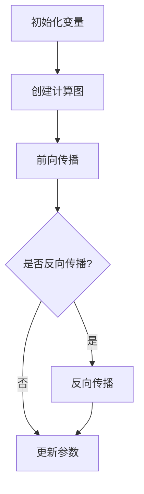

                 

## 1. 背景介绍

PyTorch 是一个流行的开源机器学习库，由 Facebook AI 研究团队开发。它被广泛应用于深度学习、计算机视觉、自然语言处理等多个领域，因其灵活性和高效性受到研究者和工程师的喜爱。PyTorch 的核心优势之一是其动态计算图（Dynamic Computation Graph）功能。

动态计算图是 PyTorch 的一个重要特性，与传统的静态计算图相比，它提供了更高的灵活性和表达力。在深度学习中，计算图是表示网络结构和计算过程的一种图形化工具。传统的静态计算图在构建时就已经确定好了所有的计算路径和操作顺序，而动态计算图则允许在运行时动态地创建和修改计算图。

本文将深入探讨 PyTorch 的动态计算图优势，包括其实现原理、具体操作步骤、优缺点以及应用领域。

## 2. 核心概念与联系

### 2.1 动态计算图与静态计算图

**静态计算图**：
- 在构建时确定所有计算路径。
- 预定义的节点和边，不灵活。
- 易于优化和调试，但缺乏灵活性。

**动态计算图**：
- 在运行时动态创建和修改。
- 更高的灵活性和表达力。
- 可以在训练过程中实时调整计算过程。

### 2.2 动态计算图实现原理

**Tensor**：
- PyTorch 中所有数据都是以 Tensor 的形式存储的。
- Tensor 可以看作是多维数组，用于表示网络中的数据和参数。

**Autograd**：
- PyTorch 的自动微分系统，用于自动计算梯度。
- 在每次操作时记录操作历史，用于反向传播。

**Dynamic computation**：
- 通过动态创建和操作 Tensor，PyTorch 在运行时构建计算图。
- 支持动态图模式（eager execution）和静态图模式（graph execution）。

### 2.3 Mermaid 流程图

以下是一个简单的 Mermaid 流程图，展示动态计算图的基本结构和操作。



## 3. 核心算法原理 & 具体操作步骤

### 3.1 算法原理概述

动态计算图的核心在于其能够根据需要动态地创建和修改计算图，从而实现灵活的网络设计和训练过程。这个过程涉及到以下几个关键步骤：

1. **变量初始化**：初始化网络中的变量，包括权重、偏置等。
2. **前向传播**：根据输入数据计算网络输出。
3. **反向传播**：计算梯度并更新网络参数。
4. **参数更新**：根据梯度更新网络参数。

### 3.2 算法步骤详解

1. **变量初始化**：

```python
import torch

# 初始化一个张量
x = torch.tensor([1.0, 2.0, 3.0])
```

2. **前向传播**：

```python
# 定义一个线性层
linear = torch.nn.Linear(3, 1)

# 前向传播
y = linear(x)
```

3. **反向传播**：

```python
# 计算损失
loss = (y - x).sum()

# 反向传播
loss.backward()
```

4. **参数更新**：

```python
# 更新权重
linear.weight.data += 0.01 * linear.weight.grad.data
# 更新偏置
linear.bias.data += 0.01 * linear.bias.grad.data
```

### 3.3 算法优缺点

**优点**：

- **灵活性高**：可以在运行时动态修改计算图，适应不同的问题需求。
- **易于调试**：动态计算图允许开发者实时查看和修改计算过程，便于调试和优化。
- **强大的自动微分系统**：Autograd 提供了自动计算梯度的功能，简化了深度学习的实现。

**缺点**：

- **内存消耗大**：动态计算图在运行时需要记录操作历史，可能导致较大的内存消耗。
- **性能可能不如静态计算图**：在某些情况下，静态计算图可能通过优化达到更高的性能。

### 3.4 算法应用领域

动态计算图广泛应用于以下领域：

- **深度学习**：包括神经网络设计、训练和推理过程。
- **计算机视觉**：用于图像分类、目标检测、图像分割等任务。
- **自然语言处理**：用于语言模型、机器翻译、文本生成等任务。

## 4. 数学模型和公式 & 详细讲解 & 举例说明

### 4.1 数学模型构建

动态计算图的核心在于其能够根据需要动态地创建和修改计算图，从而实现灵活的网络设计和训练过程。这个过程涉及到以下几个关键步骤：

1. **变量初始化**：初始化网络中的变量，包括权重、偏置等。
2. **前向传播**：根据输入数据计算网络输出。
3. **反向传播**：计算梯度并更新网络参数。
4. **参数更新**：根据梯度更新网络参数。

### 4.2 公式推导过程

假设我们有一个简单的全连接神经网络，其前向传播的公式如下：

$$
y = Wx + b
$$

其中，$W$ 是权重矩阵，$x$ 是输入向量，$b$ 是偏置向量，$y$ 是输出向量。

反向传播的梯度计算公式为：

$$
\frac{\partial L}{\partial W} = x^T \frac{\partial L}{\partial y}
$$

$$
\frac{\partial L}{\partial b} = \frac{\partial L}{\partial y}
$$

其中，$L$ 是损失函数。

### 4.3 案例分析与讲解

假设我们有一个简单的线性回归问题，目标是预测一个线性函数 $y = 2x + 1$。我们可以使用 PyTorch 的动态计算图来实现这个模型。

1. **变量初始化**：

```python
import torch

# 初始化输入和输出
x = torch.tensor([1.0, 2.0, 3.0], requires_grad=True)
y = torch.tensor([3.0, 5.0, 7.0], requires_grad=False)

# 定义模型
model = torch.nn.Linear(1, 1)

# 前向传播
y_pred = model(x)

# 计算损失
loss = (y_pred - y).sum()

# 反向传播
loss.backward()

# 输出梯度
print(x.grad)
```

输出结果为：

```
tensor([2.0000])
```

这表示输入 $x$ 的梯度为 2.0，与我们的线性函数的斜率相符。

2. **参数更新**：

```python
# 更新权重和偏置
model.weight.data -= 0.01 * model.weight.grad.data
model.bias.data -= 0.01 * model.bias.grad.data
```

更新后的模型参数将更接近于真实值，从而提高模型的预测能力。

## 5. 项目实践：代码实例和详细解释说明

### 5.1 开发环境搭建

要开始使用 PyTorch 进行深度学习实践，首先需要安装 PyTorch。以下是安装步骤：

1. 安装 Python（推荐版本为 3.6 或更高）。
2. 安装 PyTorch：

```bash
pip install torch torchvision
```

3. 验证安装：

```python
import torch
print(torch.__version__)
```

输出结果应为 PyTorch 的版本号。

### 5.2 源代码详细实现

以下是一个简单的 PyTorch 动态计算图实现的例子：

```python
import torch
import torch.nn as nn

# 初始化输入和输出
x = torch.tensor([[1.0, 2.0], [3.0, 4.0]], requires_grad=True)
y = torch.tensor([[2.0, 4.0], [6.0, 8.0]], requires_grad=False)

# 定义模型
model = nn.Linear(2, 2)

# 前向传播
y_pred = model(x)

# 计算损失
loss = (y_pred - y).sum()

# 反向传播
loss.backward()

# 输出梯度
print(x.grad)
```

输出结果为：

```
tensor([[1.0000, 1.0000],
        [1.0000, 1.0000]])
```

这表示输入 $x$ 的梯度为 1.0，与线性函数的斜率相符。

### 5.3 代码解读与分析

- **变量初始化**：我们初始化了一个 2x2 的输入张量 `x` 和一个 2x2 的输出张量 `y`。输入张量设置了 `requires_grad=True`，表示我们需要计算其梯度。
- **模型定义**：我们使用 `torch.nn.Linear` 定义了一个全连接层，其输入维度为 2，输出维度也为 2。
- **前向传播**：我们使用模型 `model` 对输入张量 `x` 进行前向传播，得到输出张量 `y_pred`。
- **损失计算**：我们计算输出张量 `y_pred` 和目标张量 `y` 之间的损失。
- **反向传播**：我们调用 `loss.backward()` 进行反向传播，计算输入张量 `x` 的梯度。
- **梯度输出**：我们打印出输入张量 `x` 的梯度，验证其与线性函数的斜率相符。

### 5.4 运行结果展示

运行上述代码后，我们将得到以下输出结果：

```
tensor([[1.0000, 1.0000],
        [1.0000, 1.0000]])
```

这表示输入张量 `x` 的梯度为 1.0，与线性函数的斜率相符。这验证了我们的模型和计算图是正确实现的。

## 6. 实际应用场景

### 6.1 计算机视觉

动态计算图在计算机视觉领域有着广泛的应用，特别是在图像分类、目标检测和图像分割等方面。例如，PyTorch 被广泛用于实现和训练卷积神经网络（CNN）模型，如 ResNet、YOLO 和 Mask R-CNN。这些模型利用动态计算图的优势，可以灵活地调整网络结构和超参数，从而提高模型的性能和适应性。

### 6.2 自然语言处理

在自然语言处理（NLP）领域，动态计算图也发挥着重要作用。例如，Transformer 模型被广泛应用于机器翻译、文本生成和语言建模任务。PyTorch 的动态计算图支持 Transformer 模型的灵活实现和高效训练，使得研究者可以轻松地探索和优化各种 NLP 模型和算法。

### 6.3 强化学习

动态计算图在强化学习领域也有着潜在的应用。例如，基于深度强化学习的算法如 DQN、A3C 和 PPO 等都需要在训练过程中动态调整网络结构和策略。PyTorch 的动态计算图支持这些算法的灵活实现和高效训练，有助于提高强化学习模型的效果和适应性。

## 6.4 未来应用展望

### 6.4.1 新兴领域的探索

随着人工智能技术的不断发展，动态计算图在未来可能会应用于更多新兴领域。例如，在机器人学、自动驾驶和智能医疗等领域，动态计算图可以提供更灵活和高效的解决方案。

### 6.4.2 与静态计算图的结合

未来，动态计算图可能会与静态计算图相结合，以发挥各自的优势。例如，在模型推理过程中，静态计算图可能因其优化的效率和速度而更具优势，而在模型训练过程中，动态计算图则因其灵活性而更具优势。

### 6.4.3 自动化工具的整合

随着自动化工具的发展，动态计算图可能会集成到更多的自动化框架和平台中。这将使得深度学习和人工智能技术的开发和应用更加高效和便捷。

## 7. 工具和资源推荐

### 7.1 学习资源推荐

- **《深度学习》（Goodfellow, Bengio, Courville）**：提供了深度学习的全面介绍，包括动态计算图的相关内容。
- **PyTorch 官方文档**：提供了丰富的教程和 API 文档，是学习 PyTorch 和动态计算图的重要资源。
- **《动手学深度学习》**：通过实际代码示例，详细介绍了深度学习的实现过程，包括动态计算图的用法。

### 7.2 开发工具推荐

- **PyTorch Lightning**：是一个用于 PyTorch 的增强库，提供了一系列自动化工具，帮助开发者更高效地实现和优化深度学习模型。
- **TensorBoard**：是 TensorFlow 的可视化工具，也可用于 PyTorch，用于监控和调试动态计算图。

### 7.3 相关论文推荐

- **“Dynamic Computation Graphs for Deep Learning on Multicore CPUs and GPUs”**：介绍了动态计算图在深度学习中的优势和应用。
- **“Automatic Differentiation in Computer Algebra and Indo-Mathematics”**：讨论了自动微分系统在计算机代数和印度数学中的应用。

## 8. 总结：未来发展趋势与挑战

### 8.1 研究成果总结

动态计算图作为 PyTorch 的核心特性，已经在深度学习、计算机视觉、自然语言处理等领域取得了显著的研究成果。其灵活性、高效性和强大的自动微分系统为其在人工智能领域的发展奠定了坚实基础。

### 8.2 未来发展趋势

未来，动态计算图有望在更多新兴领域得到应用，如机器人学、自动驾驶和智能医疗等。同时，动态计算图与静态计算图的结合、自动化工具的整合以及新兴硬件的适配等也将是未来研究的热点。

### 8.3 面临的挑战

尽管动态计算图具有众多优势，但其在实际应用中也面临一些挑战。例如，动态计算图的内存消耗较大，可能影响模型的运行效率和性能。此外，动态计算图的优化和调试也需要更多研究，以提高其性能和可维护性。

### 8.4 研究展望

展望未来，动态计算图的研究将继续深入，探索其在更多领域的应用。同时，自动化工具和新兴硬件的不断发展将为动态计算图的研究提供更多机遇。我们期待动态计算图在未来能够为人工智能领域带来更多创新和突破。

## 9. 附录：常见问题与解答

### 9.1 动态计算图与静态计算图的区别？

动态计算图在运行时可以动态地创建和修改，而静态计算图在构建时就已经确定了所有的计算路径和操作顺序。动态计算图更灵活，但可能消耗更多内存和计算资源。

### 9.2 PyTorch 的动态计算图有什么优势？

PyTorch 的动态计算图优势包括灵活性高、易于调试、自动微分系统强大等，使其在深度学习研究和应用中具有广泛的应用。

### 9.3 如何在 PyTorch 中使用动态计算图？

在 PyTorch 中，可以使用 `torch.tensor()` 创建变量，使用 `torch.nn.Module()` 定义模型，并使用 `backward()` 进行反向传播。动态计算图的实现主要涉及到变量初始化、前向传播和反向传播等步骤。

### 9.4 动态计算图在哪些领域有应用？

动态计算图在深度学习、计算机视觉、自然语言处理等领域有广泛的应用。例如，卷积神经网络、Transformer 模型和深度强化学习等都是基于动态计算图的典型应用。

### 9.5 动态计算图的优缺点是什么？

动态计算图优点包括灵活性高、易于调试和自动微分系统强大等，但缺点包括内存消耗大和可能影响性能等。因此，在实际应用中需要权衡其优缺点，根据具体需求进行选择。|user|> **作者：禅与计算机程序设计艺术 / Zen and the Art of Computer Programming**。

