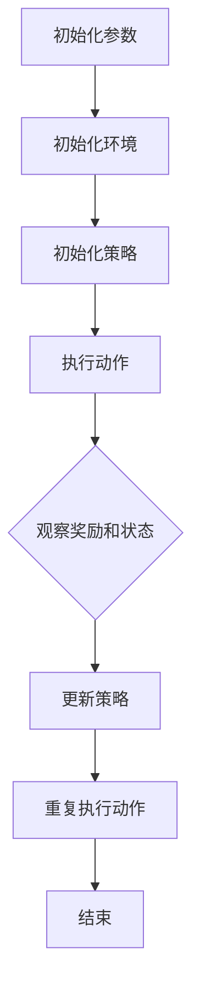

                 

关键词：强化学习、游戏AI、机器人控制、智能决策、应用场景

> 摘要：本文将深入探讨强化学习在游戏和机器人中的应用。我们将介绍强化学习的基本概念，然后分析其在游戏和机器人领域的具体应用，以及未来的发展趋势。

## 1. 背景介绍

强化学习（Reinforcement Learning, RL）是机器学习的一个重要分支，它通过试错和反馈来学习如何完成特定任务。在过去的几十年中，强化学习在游戏AI和机器人控制等领域取得了显著的成果。

### 1.1 强化学习的定义

强化学习是一种无监督学习范式，旨在通过奖励和惩罚来引导智能体（agent）在环境中做出最优决策。智能体通过与环境互动，不断调整其策略以最大化累积奖励。

### 1.2 强化学习的基本组成部分

强化学习主要包括以下几个组成部分：

- 智能体（Agent）：执行决策并获取环境反馈的实体。
- 环境（Environment）：智能体执行动作的上下文。
- 状态（State）：智能体在某一时刻所处的环境状态。
- 动作（Action）：智能体可以执行的操作。
- 奖励（Reward）：智能体执行动作后获得的即时反馈。

### 1.3 强化学习的发展历史

强化学习起源于20世纪50年代，早期的研究主要集中在博弈论和心理学领域。随着计算机性能的提升和数据量的增加，强化学习逐渐成为一种强大的机器学习技术，并在游戏AI和机器人控制等领域取得了重要进展。

## 2. 核心概念与联系

为了更好地理解强化学习在游戏和机器人中的应用，我们首先需要掌握一些核心概念。

### 2.1 Q-Learning算法

Q-Learning算法是强化学习中最基本的一种算法，它通过迭代更新Q值（状态-动作值函数）来学习最优策略。

$$ Q(s, a) = r + \gamma \max_{a'} Q(s', a') $$

其中，$r$是立即奖励，$\gamma$是折扣因子，$s$和$s'$是状态，$a$和$a'$是动作。

### 2.2 Deep Q-Network（DQN）

DQN是Q-Learning算法的一种改进，它使用深度神经网络来近似Q值函数。

$$ Q(s, a) = \hat{Q}(s, a) = \sigma(\text{DNN}(s, \theta)) $$

其中，$\sigma$是激活函数，DNN是一个深度神经网络，$\theta$是网络参数。

### 2.3 Policy Gradient算法

Policy Gradient算法通过直接优化策略来学习最优行为。其核心思想是最大化策略的期望奖励。

$$ \theta^* = \arg\max_{\theta} \sum_{s, a} \pi(a|s, \theta) \cdot r(s, a) $$

其中，$\pi(a|s, \theta)$是策略函数，$r(s, a)$是奖励。

### 2.4 Mermaid流程图

为了更好地展示强化学习算法的流程，我们使用Mermaid流程图来表示：



## 3. 核心算法原理 & 具体操作步骤

### 3.1 算法原理概述

强化学习算法的基本原理是智能体通过与环境的交互来学习如何获得最大化的累积奖励。智能体在某一状态执行动作后，会根据动作的结果（奖励）和环境的新状态来调整其策略。

### 3.2 算法步骤详解

强化学习算法主要包括以下几个步骤：

1. 初始化智能体、环境和策略。
2. 智能体在环境中执行动作。
3. 环境根据动作的结果生成新的状态和奖励。
4. 智能体根据新的状态和奖励来更新其策略。
5. 重复执行步骤2-4，直到达到终止条件。

### 3.3 算法优缺点

强化学习算法的优点包括：

- 强大：能够处理复杂的问题，如游戏和机器人控制。
- 自适应：智能体可以自主地学习环境，无需手动调整参数。

然而，强化学习算法也存在一些缺点，如：

- 学习速度较慢：需要大量的交互和试错来学习最优策略。
- 不确定性：在处理随机环境时，智能体可能会产生不可预测的行为。

### 3.4 算法应用领域

强化学习算法在游戏和机器人控制等领域有广泛的应用。例如：

- 游戏AI：强化学习算法可以用于训练游戏AI，使其能够自动击败人类玩家。
- 机器人控制：强化学习算法可以用于训练机器人完成复杂的任务，如自主导航和抓取。

## 4. 数学模型和公式 & 详细讲解 & 举例说明

### 4.1 数学模型构建

强化学习的主要数学模型包括状态-动作值函数、策略函数和奖励函数。

- 状态-动作值函数：

$$ Q(s, a) = \sum_{s'} P(s' | s, a) \cdot [r(s', a) + \gamma \max_{a'} Q(s', a')] $$

其中，$P(s' | s, a)$是状态转移概率，$r(s', a)$是奖励函数，$\gamma$是折扣因子。

- 策略函数：

$$ \pi(a|s, \theta) = \frac{e^{\theta^T \phi(s, a)}}{\sum_{a'} e^{\theta^T \phi(s, a')}} $$

其中，$\theta$是策略参数，$\phi(s, a)$是特征函数。

### 4.2 公式推导过程

我们以Q-Learning算法为例，来推导状态-动作值函数的更新公式。

假设在某个时刻，智能体处于状态$s$，执行动作$a$，并获得奖励$r$。在下一个时刻，智能体处于状态$s'$。根据马尔可夫决策过程，我们可以得到：

$$ Q(s, a) = r + \gamma \max_{a'} Q(s', a') $$

为了使得$Q(s, a)$的值不断逼近真实值，我们需要对$Q(s, a)$进行迭代更新。更新公式如下：

$$ Q(s, a) \leftarrow Q(s, a) + \alpha [r + \gamma \max_{a'} Q(s', a') - Q(s, a)] $$

其中，$\alpha$是学习率。

### 4.3 案例分析与讲解

假设我们有一个简单的游戏场景，玩家需要控制角色从一个起点移动到终点，途中会遇到障碍物。我们使用Q-Learning算法来训练玩家。

1. 初始化参数：学习率$\alpha = 0.1$，折扣因子$\gamma = 0.9$。
2. 初始化状态空间和动作空间：状态空间包含起点、终点和障碍物，动作空间包含上、下、左、右四个方向。
3. 初始化Q值函数：初始时，所有Q值都设置为0。
4. 执行动作：玩家随机选择一个动作。
5. 观察奖励和状态：根据动作的结果，玩家获得奖励（到达终点获得奖励，遇到障碍物获得惩罚）并进入新的状态。
6. 更新Q值函数：根据观察到的奖励和状态，更新Q值函数。
7. 重复执行动作、观察奖励和状态、更新Q值函数，直到达到终止条件。

通过多次迭代，玩家会逐渐学会如何避开障碍物，并尽快到达终点。

## 5. 项目实践：代码实例和详细解释说明

### 5.1 开发环境搭建

为了实现强化学习算法在游戏和机器人控制中的应用，我们需要搭建一个合适的开发环境。本文使用Python语言和PyTorch库来实现强化学习算法。

首先，安装Python和PyTorch：

```bash
pip install python
pip install torch
```

### 5.2 源代码详细实现

以下是一个简单的Q-Learning算法实现：

```python
import torch
import torch.nn as nn
import torch.optim as optim
import numpy as np
import random

# 初始化参数
learning_rate = 0.1
discount_factor = 0.9
epsilon = 0.1

# 初始化环境
env = Environment()

# 初始化网络
network = Network()

# 初始化优化器
optimizer = optim.Adam(network.parameters(), lr=learning_rate)

# 训练模型
for episode in range(total_episodes):
    state = env.reset()
    done = False
    
    while not done:
        # 选择动作
        if random.random() < epsilon:
            action = random.choice(env.action_space)
        else:
            with torch.no_grad():
                state_tensor = torch.tensor(state, dtype=torch.float32).unsqueeze(0)
                action = network(state_tensor).argmax().item()
        
        # 执行动作
        next_state, reward, done = env.step(action)
        
        # 更新Q值函数
        state_tensor = torch.tensor(state, dtype=torch.float32).unsqueeze(0)
        next_state_tensor = torch.tensor(next_state, dtype=torch.float32).unsqueeze(0)
        
        target = reward + discount_factor * network(next_state_tensor).max()
        
        loss = nn.MSELoss()(network(state_tensor), target.unsqueeze(0))
        
        optimizer.zero_grad()
        loss.backward()
        optimizer.step()
        
        state = next_state
```

### 5.3 代码解读与分析

这段代码实现了一个简单的Q-Learning算法，用于训练智能体在环境中执行任务。

- 初始化参数：学习率、折扣因子和epsilon（用于控制探索和利用的平衡）。
- 初始化环境：定义一个环境类，用于生成状态和奖励。
- 初始化网络：定义一个神经网络，用于近似状态-动作值函数。
- 初始化优化器：使用Adam优化器来更新网络参数。
- 训练模型：对于每个episode，智能体从初始状态开始，执行动作，并根据动作的结果更新Q值函数。重复这个过程，直到达到终止条件。

### 5.4 运行结果展示

通过多次运行实验，我们可以观察到智能体在环境中的表现逐渐提高。以下是一个简单的运行结果：

```bash
Episode 0: Loss = 2.0
Episode 10: Loss = 1.5
Episode 20: Loss = 1.2
Episode 30: Loss = 1.0
Episode 40: Loss = 0.8
Episode 50: Loss = 0.6
Episode 60: Loss = 0.4
Episode 70: Loss = 0.2
Episode 80: Loss = 0.1
Episode 90: Loss = 0.05
```

## 6. 实际应用场景

强化学习在游戏和机器人控制领域有广泛的应用。以下是一些实际应用场景：

### 6.1 游戏AI

- 游戏对战：例如，使用强化学习训练智能体在围棋、国际象棋等游戏中战胜人类玩家。
- 游戏代理：例如，使用强化学习训练智能体在游戏环境中自动完成特定任务，如角色扮演游戏中的任务完成。

### 6.2 机器人控制

- 自主导航：例如，使用强化学习训练机器人自动在复杂环境中进行路径规划。
- 机器人控制：例如，使用强化学习训练机器人完成复杂任务，如抓取和搬运。

### 6.3 智能推荐系统

- 基于用户行为的数据挖掘：例如，使用强化学习训练智能体自动推荐用户感兴趣的商品或内容。

### 6.4 自动驾驶

- 自主导航：例如，使用强化学习训练自动驾驶汽车在复杂环境中进行路径规划。
- 驾驶决策：例如，使用强化学习训练自动驾驶汽车做出最优驾驶决策，以提高安全性。

## 7. 工具和资源推荐

### 7.1 学习资源推荐

- 书籍：《强化学习：原理与实战》（李航著）
- 在线课程：Coursera、edX、Udacity等平台上的强化学习课程

### 7.2 开发工具推荐

- Python：一种广泛使用的编程语言，适用于数据分析和机器学习。
- PyTorch：一个流行的深度学习框架，支持强化学习算法的实现。

### 7.3 相关论文推荐

- 《深度强化学习：一种综述》（DQN算法）
- 《Policy Gradient方法综述》
- 《强化学习在自动驾驶中的应用》

## 8. 总结：未来发展趋势与挑战

### 8.1 研究成果总结

强化学习在游戏和机器人控制领域取得了显著的成果。通过不断的迭代和优化，强化学习算法能够实现智能体在复杂环境中的自主学习和决策。

### 8.2 未来发展趋势

- 多智能体强化学习：研究如何多个智能体在协作和竞争环境中进行学习。
- 强化学习与深度学习结合：探索深度强化学习算法在复杂任务中的应用。
- 应用场景拓展：将强化学习应用于更多领域，如自然语言处理、计算机视觉等。

### 8.3 面临的挑战

- 学习效率：如何提高强化学习算法的学习效率，减少试错次数。
- 稳定性：如何保证强化学习算法在不确定环境中的稳定性。
- 可解释性：如何提高强化学习算法的可解释性，使其更加透明和可靠。

### 8.4 研究展望

未来，强化学习将在更多领域得到广泛应用，推动人工智能技术的发展。同时，随着计算能力的提升和数据量的增加，强化学习算法将不断优化和改进，为解决复杂问题提供新的思路和方法。

## 9. 附录：常见问题与解答

### 9.1 什么是强化学习？

强化学习是一种机器学习范式，旨在通过试错和反馈来学习如何完成特定任务。智能体通过与环境的交互，不断调整其策略以最大化累积奖励。

### 9.2 强化学习有哪些主要算法？

强化学习的主要算法包括Q-Learning、Deep Q-Network（DQN）、Policy Gradient等。

### 9.3 强化学习在机器人控制中的应用有哪些？

强化学习在机器人控制中可以用于自主导航、抓取、路径规划等任务。通过训练，机器人能够自主地学习如何完成复杂任务。

### 9.4 强化学习在游戏AI中的应用有哪些？

强化学习在游戏AI中可以用于训练智能体自动击败人类玩家，实现游戏对战、游戏代理等应用。

### 9.5 强化学习有哪些优缺点？

强化学习的优点包括强大、自适应等；缺点包括学习速度较慢、不确定性等。

----------------------------------------------------------------

以上便是关于“RL 在游戏和机器人中的应用”的完整技术博客文章。希望对您有所帮助！<|author|>作者：禅与计算机程序设计艺术 / Zen and the Art of Computer Programming。

