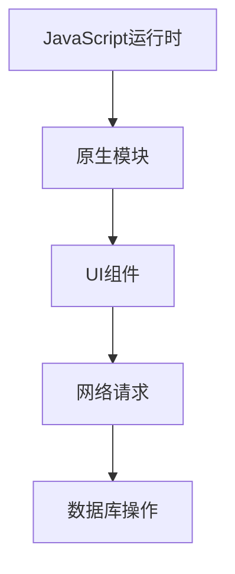

                 

关键词：React Native、跨平台开发、移动应用、性能优化、开发框架

摘要：本文将深入探讨React Native跨平台开发的原理、技术优势和实际应用场景。我们将从背景介绍开始，逐步解析React Native的核心概念和架构，详细讲解其核心算法原理和具体操作步骤。同时，我们将展示数学模型和公式，并分析其在项目实践中的应用。最后，我们将展望React Native的未来发展趋势，并推荐相关的学习资源和开发工具。

## 1. 背景介绍

随着移动互联网的快速发展，移动应用市场呈现出爆炸式增长。开发一款优秀的移动应用不仅需要考虑用户体验，还需要应对不同平台的兼容性问题。传统的方式是使用原生开发，即针对每个平台编写独立的代码，这无疑增加了开发和维护成本。为了解决这一问题，跨平台开发框架应运而生，其中React Native无疑是佼佼者。

React Native由Facebook开发，是一个用于构建原生应用的开放源代码框架。它允许开发者使用JavaScript和React编写代码，从而实现一次编写、多平台运行。这种开发模式不仅提高了开发效率，还确保了应用的性能和用户体验。

## 2. 核心概念与联系

### 2.1 React Native架构

React Native的架构可以概括为两部分：JavaScript运行时和原生模块。

- **JavaScript运行时**：负责执行JavaScript代码，包括React组件的生命周期方法和事件处理等。
- **原生模块**：用于与原生平台进行通信，如UI组件、网络请求等。

下面是一个简单的Mermaid流程图，展示了React Native的基本架构：



### 2.2 React Native核心概念

- **组件(Component)**：React Native的基本构建块，用于构建用户界面。
- **状态(State)**：组件内部的数据，用于描述组件的状态和行为。
- **属性(Props)**：组件接收的外部数据，用于配置组件的行为和外观。
- **样式(Style)**：用于定义组件的外观属性，如颜色、字体、边距等。

## 3. 核心算法原理 & 具体操作步骤

### 3.1 算法原理概述

React Native的核心算法基于React的虚拟DOM机制。虚拟DOM是一种在内存中构建DOM结构的方法，通过对比虚拟DOM和实际DOM的差异，实现高效的更新和渲染。

下面是一个简单的虚拟DOM更新过程：

1. 构建虚拟DOM树。
2. 将虚拟DOM树与实际DOM树进行对比。
3. 根据对比结果更新实际DOM树。

### 3.2 算法步骤详解

1. **构建虚拟DOM树**：React Native首先根据JavaScript代码构建虚拟DOM树。这个过程包括创建组件实例、计算组件的属性和状态等。
2. **对比虚拟DOM和实际DOM**：React Native将虚拟DOM树与实际DOM树进行对比。通过对比，React Native可以找出需要更新的部分。
3. **更新实际DOM树**：根据对比结果，React Native更新实际DOM树。这个过程包括删除、添加和修改DOM元素。

### 3.3 算法优缺点

- **优点**：
  - **高效**：虚拟DOM机制使得React Native可以高效地更新UI，减少不必要的DOM操作。
  - **组件化**：React Native鼓励使用组件化的开发模式，提高了代码的可维护性和复用性。
  - **跨平台**：React Native允许开发者使用同一套代码在多个平台上运行，降低了开发和维护成本。

- **缺点**：
  - **性能瓶颈**：尽管React Native性能优于原生应用，但在一些复杂场景下，仍可能遇到性能瓶颈。
  - **学习曲线**：React Native使用JavaScript进行开发，对于习惯了原生开发的开发者来说，可能需要一定的时间适应。

### 3.4 算法应用领域

React Native适用于各种类型的移动应用，如社交媒体、电商平台、新闻应用等。其跨平台特性使得开发者可以更快速地开发市场覆盖范围广泛的应用。

## 4. 数学模型和公式 & 详细讲解 & 举例说明

### 4.1 数学模型构建

React Native的性能优化涉及到多个方面，其中之一是虚拟DOM的更新算法。为了理解这个算法，我们需要构建一个简单的数学模型。

假设我们有一个虚拟DOM树和实际DOM树，它们之间的差异可以用以下公式表示：

$$
\Delta DOM = \text{实际DOM} - \text{虚拟DOM}
$$

### 4.2 公式推导过程

虚拟DOM的更新过程可以分为以下几个步骤：

1. **构建虚拟DOM树**：假设我们有一个初始的虚拟DOM树`T1`。
2. **对比虚拟DOM树和实际DOM树**：通过对比`T1`和实际DOM树，找出需要更新的部分。
3. **构建新的虚拟DOM树**：根据对比结果，构建一个新的虚拟DOM树`T2`。
4. **更新实际DOM树**：根据`T2`更新实际DOM树。

### 4.3 案例分析与讲解

假设我们有一个简单的虚拟DOM树和实际DOM树，如下所示：

```plaintext
虚拟DOM树：
- div
  - p
    - text

实际DOM树：
- div
  - p
    - text
- ul
  - li
    - item 1
  - li
    - item 2
```

我们需要更新实际DOM树，使其与虚拟DOM树一致。具体步骤如下：

1. **构建虚拟DOM树**：假设我们有一个初始的虚拟DOM树`T1`。
2. **对比虚拟DOM树和实际DOM树**：通过对比`T1`和实际DOM树，我们发现`T1`中没有`ul`和`li`元素，而实际DOM树中有。因此，我们需要在`T1`中添加这两个元素。
3. **构建新的虚拟DOM树**：根据对比结果，我们构建一个新的虚拟DOM树`T2`，如下所示：

```plaintext
虚拟DOM树：
- div
  - p
    - text
  - ul
    - li
      - item 1
    - li
      - item 2
```

4. **更新实际DOM树**：根据`T2`更新实际DOM树，删除原有的`div`和`p`元素，添加新的`ul`和`li`元素。

## 5. 项目实践：代码实例和详细解释说明

### 5.1 开发环境搭建

要开始使用React Native开发移动应用，你需要搭建一个开发环境。以下是搭建React Native开发环境的步骤：

1. 安装Node.js：从[Node.js官网](https://nodejs.org/)下载并安装Node.js。
2. 安装React Native CLI：在命令行中运行以下命令：

   ```bash
   npm install -g react-native-cli
   ```

3. 安装Android Studio：从[Android Studio官网](https://developer.android.com/studio/)下载并安装Android Studio。
4. 安装Xcode：从[Mac App Store](https://apps.apple.com/us/app/xcode/id493788736)下载并安装Xcode。

### 5.2 源代码详细实现

以下是一个简单的React Native应用示例，用于展示React Native的基本用法。

```javascript
import React from 'react';
import { View, Text, StyleSheet } from 'react-native';

const App = () => {
  return (
    <View style={styles.container}>
      <Text style={styles.text}>Hello, React Native!</Text>
    </View>
  );
};

const styles = StyleSheet.create({
  container: {
    flex: 1,
    justifyContent: 'center',
    alignItems: 'center',
  },
  text: {
    fontSize: 20,
  },
});

export default App;
```

### 5.3 代码解读与分析

这个示例应用包含一个`App`组件，它使用React Native的`View`和`Text`组件构建了一个简单的用户界面。`View`组件是一个容器组件，用于布局其他组件。`Text`组件用于显示文本。

- **`<View style={styles.container}>`**：这个`View`组件设置了样式，使其占据整个屏幕，并使其中的内容居中显示。
- **`<Text style={styles.text}>Hello, React Native!</Text>`**：这个`Text`组件显示了文本“Hello, React Native!”。

### 5.4 运行结果展示

在完成上述代码后，你可以使用React Native的命令行工具运行这个应用。以下是运行应用的步骤：

1. 打开命令行工具，进入你的React Native项目目录。
2. 运行以下命令启动应用：

   ```bash
   npx react-native run-android
   ```

   或者

   ```bash
   npx react-native run-ios
   ```

   根据你的目标平台选择相应的命令。

3. 如果一切正常，你的应用将启动并在模拟器或真实设备上显示“Hello, React Native!”文本。

## 6. 实际应用场景

React Native适用于各种类型的移动应用，以下是一些实际应用场景：

- **社交媒体应用**：如Facebook、Instagram等，React Native可以用于构建高效的用户界面，实现实时数据更新。
- **电商平台**：如Amazon、eBay等，React Native可以用于构建商品展示页面、购物车和支付系统。
- **新闻应用**：如The New York Times、BBC News等，React Native可以用于构建丰富的新闻内容和互动功能。

## 7. 工具和资源推荐

### 7.1 学习资源推荐

- **《React Native入门与实践》**：这是一本介绍React Native开发的基础书籍，适合初学者阅读。
- **[React Native官网](https://reactnative.dev/docs/getting-started)**：React Native的官方文档，涵盖了React Native的基本概念、API和使用方法。

### 7.2 开发工具推荐

- **Visual Studio Code**：一款功能强大的代码编辑器，支持React Native开发。
- **Android Studio**：用于Android应用的集成开发环境，支持React Native开发。
- **Xcode**：用于iOS应用的集成开发环境，支持React Native开发。

### 7.3 相关论文推荐

- **《React Native: An In-depth Analysis of Facebook's Mobile Framework》**：一篇关于React Native的深入分析论文，涵盖了React Native的架构、性能和优缺点。
- **《Cross-platform Mobile Development with React Native》**：一篇关于React Native在跨平台开发中的实践和经验的论文。

## 8. 总结：未来发展趋势与挑战

### 8.1 研究成果总结

React Native自推出以来，已经得到了广泛的应用和认可。通过其跨平台特性，React Native显著提高了移动应用的开发效率和性能。同时，React Native社区也在不断发展和壮大，提供了丰富的开源库和工具。

### 8.2 未来发展趋势

- **性能提升**：随着React Native的不断优化，其性能将进一步提升，使其在复杂场景下也能满足高性能需求。
- **生态扩展**：React Native将继续扩展其生态系统，包括更多的原生模块和第三方库，为开发者提供更丰富的开发资源。
- **跨平台融合**：React Native将与其他跨平台开发框架（如Flutter、Apache Cordova）进行融合，共同推动跨平台开发技术的发展。

### 8.3 面临的挑战

- **性能瓶颈**：尽管React Native性能已显著提升，但在一些复杂场景下，仍可能遇到性能瓶颈，需要进一步优化。
- **开发者学习曲线**：React Native使用JavaScript进行开发，对于习惯了原生开发的开发者来说，可能需要一定的时间适应。

### 8.4 研究展望

React Native在未来将继续在移动应用开发中发挥重要作用。通过不断的优化和创新，React Native有望在性能、开发效率和跨平台兼容性等方面取得更大的突破。

## 9. 附录：常见问题与解答

### 9.1 什么是React Native？

React Native是一个用于构建原生移动应用的跨平台开发框架，它允许开发者使用JavaScript和React编写代码，从而实现一次编写、多平台运行。

### 9.2 React Native的优势是什么？

React Native的优势包括：高效的开发流程、跨平台兼容性、丰富的组件库、优秀的性能等。

### 9.3 React Native和Flutter哪个更好？

React Native和Flutter各有优势。React Native拥有更广泛的社区支持和丰富的生态系统，适合大多数开发场景。Flutter则因其高性能和美观的UI组件而受到关注，适合需要高度定制化UI的应用。

### 9.4 React Native是否支持所有原生功能？

React Native不支持所有原生功能，但提供了一个丰富的原生模块库，通过这些模块，开发者可以访问大部分原生功能。

## 作者署名

作者：禅与计算机程序设计艺术 / Zen and the Art of Computer Programming

