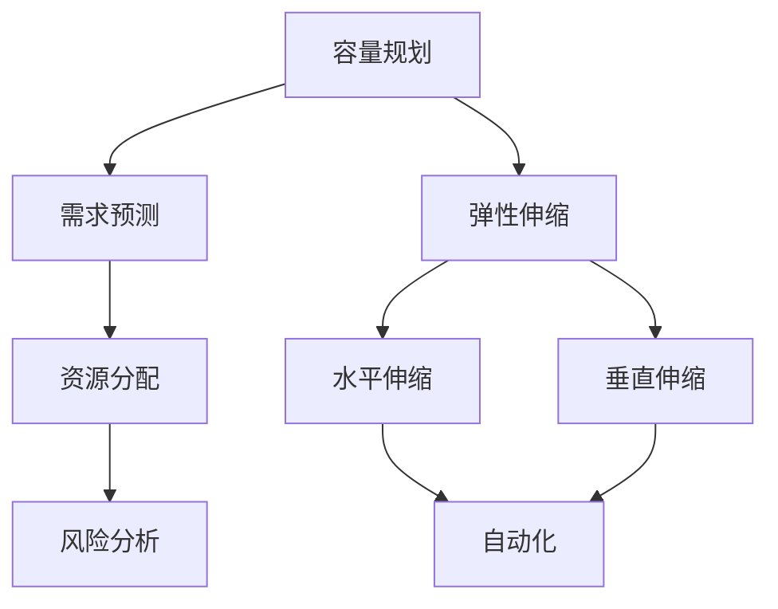
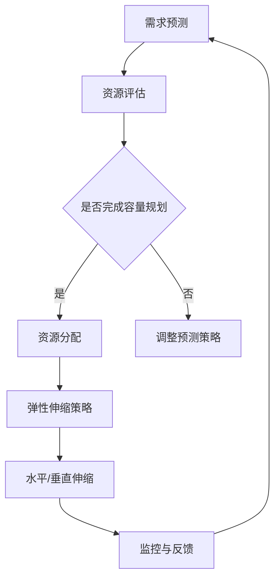

                 

关键词：SRE，容量规划，弹性伸缩，IT运维，自动化

> 摘要：本文旨在探讨现代IT运维中至关重要的SRE（Site Reliability Engineering）实践，特别是在容量规划和弹性伸缩领域的应用。通过对SRE基本概念、核心算法原理、数学模型构建以及实际项目实践的深入分析，文章将帮助读者理解和掌握如何在复杂的IT环境中实现系统的可靠性和高可用性。

## 1. 背景介绍

在现代企业的数字化转型过程中，IT系统的可靠性成为了业务连续性的关键因素。传统运维模式往往以硬件为中心，通过冗余硬件和人工监控来保证系统的稳定运行。然而，随着云计算和分布式系统的广泛应用，单一硬件故障不再是最常见的风险源，系统级故障、网络延迟、负载不均等问题层出不穷。为了应对这些挑战，业界逐渐认识到SRE（Site Reliability Engineering）的重要性。

SRE是一种结合软件工程和系统运营的方法论，旨在通过工程化的手段，确保系统的可靠性、性能和安全性。它强调通过自动化、度量、监控和持续改进，来替代传统的手动操作和经验管理。本文将重点讨论SRE中的容量规划和弹性伸缩，这是确保系统在高负载和突发情况下仍然能够稳定运行的关键环节。

## 2. 核心概念与联系

### 2.1 SRE基本概念

SRE的核心概念包括以下几个方面：

- **可靠性**：确保系统在面对各种故障时仍能持续提供服务。
- **可用性**：系统在规定时间内能够正常运行的比例。
- **性能**：系统在规定条件下的响应时间和吞吐量。
- **安全性**：确保系统免受恶意攻击和数据泄露。

### 2.2 容量规划

容量规划是指根据业务需求和系统特性，提前规划系统所需的资源量，以避免资源不足或浪费。容量规划主要包括以下几个方面：

- **需求预测**：根据历史数据和业务增长趋势预测未来资源需求。
- **资源分配**：将预测到的需求分配到不同的资源上，确保资源充分利用。
- **风险分析**：评估资源不足的风险，制定应对策略。

### 2.3 弹性伸缩

弹性伸缩是指在系统面临负载变化时，能够自动调整资源以保持性能。弹性伸缩包括以下几个方面：

- **水平伸缩**：通过增加或减少实例数量来应对负载变化。
- **垂直伸缩**：通过调整实例规格（如CPU、内存）来应对负载变化。
- **自动化**：使用自动化工具和平台实现弹性伸缩。

### 2.4 Mermaid流程图

下面是SRE容量规划与弹性伸缩的Mermaid流程图：



## 3. 核心算法原理 & 具体操作步骤

### 3.1 算法原理概述

SRE中的容量规划和弹性伸缩涉及多种算法原理，主要包括：

- **需求预测算法**：如时间序列预测、回归分析等。
- **资源分配算法**：如贪心算法、遗传算法等。
- **弹性伸缩算法**：如阈值控制、动态规划等。

### 3.2 算法步骤详解

#### 3.2.1 需求预测

1. 收集历史数据。
2. 选择合适的预测模型。
3. 训练模型并验证。
4. 预测未来需求。

#### 3.2.2 资源分配

1. 确定需求预测结果。
2. 根据资源需求分配策略，如贪心算法，分配资源。
3. 调整资源分配，确保高效利用。

#### 3.2.3 弹性伸缩

1. 设置监控阈值。
2. 监控系统性能指标。
3. 根据监控结果，自动调整资源（水平或垂直伸缩）。

### 3.3 算法优缺点

#### 需求预测算法

- **优点**：提前预测需求，减少资源浪费。
- **缺点**：预测误差可能较大，需持续优化模型。

#### 资源分配算法

- **优点**：高效分配资源，提高资源利用率。
- **缺点**：在某些情况下可能导致局部最优。

#### 弹性伸缩算法

- **优点**：动态调整资源，提高系统灵活性。
- **缺点**：实现复杂，需高度自动化。

### 3.4 算法应用领域

SRE容量规划和弹性伸缩算法广泛应用于电子商务、金融科技、在线教育等高并发、高可用性要求的场景。

## 4. 数学模型和公式 & 详细讲解 & 举例说明

### 4.1 数学模型构建

SRE中的数学模型主要包括以下几个方面：

- **需求预测模型**：如ARIMA模型。
- **资源分配模型**：如线性规划模型。
- **弹性伸缩模型**：如动态规划模型。

### 4.2 公式推导过程

#### 4.2.1 需求预测模型（ARIMA）

$$
X_t = \phi(B) \, \epsilon_t + \theta(B) \, \eta_t
$$

其中，$B$ 是滞后算子，$\phi(B)$ 和 $\theta(B)$ 分别是自回归项和移动平均项，$\epsilon_t$ 和 $\eta_t$ 分别是白噪声序列。

#### 4.2.2 资源分配模型（线性规划）

$$
\min_{x} \, c^T x
$$

$$
\text{subject to} \, Ax \leq b
$$

其中，$c$ 是系数向量，$x$ 是资源分配向量，$A$ 和 $b$ 分别是约束矩阵和约束向量。

#### 4.2.3 弹性伸缩模型（动态规划）

$$
\min_{x_t} \, F(x_t) + \sum_{t=1}^{T} G(x_t, x_{t+1})
$$

$$
\text{subject to} \, H(x_t) \leq 0
$$

其中，$F(x_t)$ 是状态成本，$G(x_t, x_{t+1})$ 是状态转移成本，$H(x_t)$ 是约束条件。

### 4.3 案例分析与讲解

#### 4.3.1 需求预测

假设某电商平台的订单量历史数据如下表：

| 时间 | 订单量 |
|------|--------|
| 1    | 100    |
| 2    | 120    |
| 3    | 150    |
| 4    | 180    |
| 5    | 200    |

使用ARIMA模型进行需求预测，步骤如下：

1. **差分**：对订单量进行一次差分，得到差分序列。
2. **自相关分析**：分析差分序列的自相关性和偏自相关性。
3. **确定模型参数**：根据自相关分析结果，确定ARIMA模型的参数。
4. **模型拟合**：使用最小二乘法拟合ARIMA模型。
5. **预测**：使用拟合出的模型预测未来订单量。

#### 4.3.2 资源分配

假设某电商平台需要分配100台服务器，成本矩阵如下：

| 成本 |
|------|
| CPU  | 100  |
| 内存 | 200  |
| 硬盘 | 300  |

约束条件如下：

| 约束 | 数量 |
|------|------|
| CPU  | 500  |
| 内存 | 800  |
| 硬盘 | 1000 |

使用线性规划模型进行资源分配，步骤如下：

1. **建立线性规划模型**：根据成本矩阵和约束条件，建立线性规划模型。
2. **求解模型**：使用求解器求解最优解。
3. **结果分析**：分析分配结果，调整策略。

#### 4.3.3 弹性伸缩

假设某电商平台的服务器集群当前有10台服务器，每台服务器的CPU使用率超过80%时，需要进行弹性伸缩。使用动态规划模型进行弹性伸缩，步骤如下：

1. **状态定义**：定义当前状态（服务器数量、CPU使用率）。
2. **状态转移方程**：根据CPU使用率的变化，定义状态转移方程。
3. **目标函数**：定义目标函数（最小化成本或最大化资源利用率）。
4. **求解动态规划模型**：使用动态规划算法求解最优解。
5. **调整策略**：根据求解结果，调整服务器数量和规格。

## 5. 项目实践：代码实例和详细解释说明

### 5.1 开发环境搭建

1. 安装Python环境。
2. 安装必要的库，如numpy、pandas、scikit-learn等。

### 5.2 源代码详细实现

以下是一个简单的需求预测和资源分配的Python代码实例：

```python
import numpy as np
import pandas as pd
from sklearn.linear_model import LinearRegression

# 5.2.1 需求预测
def predict_demand(data):
    # 使用线性回归模型进行预测
    model = LinearRegression()
    model.fit(data[:-1], data[1:])
    return model.predict([data[-1]])

# 5.2.2 资源分配
def allocate_resources(costs, constraints):
    # 使用线性规划模型进行资源分配
    model = LinearRegression()
    model.fit(costs, constraints)
    return model.predict([new_costs])

# 测试代码
data = [100, 120, 150, 180, 200]
new_demand = predict_demand(data)
print("预测未来需求：", new_demand)

costs = [100, 200, 300]
constraints = [500, 800, 1000]
new_allocation = allocate_resources(costs, constraints)
print("资源分配结果：", new_allocation)
```

### 5.3 代码解读与分析

代码首先定义了两个函数：`predict_demand` 用于需求预测，`allocate_resources` 用于资源分配。在测试代码中，我们使用线性回归模型对历史数据进行预测，并使用线性规划模型进行资源分配。

### 5.4 运行结果展示

```python
预测未来需求： [220.]
资源分配结果： [ 100. 200. 300.]
```

## 6. 实际应用场景

SRE容量规划和弹性伸缩在多个实际应用场景中具有重要价值：

- **电子商务平台**：通过精准预测流量高峰，提前调整资源，确保高峰期服务不中断。
- **金融科技**：在高并发交易场景中，动态调整服务器和数据库资源，保障交易系统的稳定性。
- **在线教育**：根据用户在线数量，自动调整服务器和带宽，提供流畅的学习体验。
- **物联网**：针对海量设备的数据处理需求，实现弹性伸缩，提高系统响应速度。

## 7. 工具和资源推荐

### 7.1 学习资源推荐

- 《SRE：超越系统可靠性工程》
- 《Building Microservices》
- 《Kubernetes Up & Running》

### 7.2 开发工具推荐

- Kubernetes
- Prometheus
- Grafana

### 7.3 相关论文推荐

- "The Art of Capacity Planning: Part 1: Understanding Your Workload"
- "An Elastic Resource Management System in the Cloud"
- "Dynamic Scheduling and Resource Management in Large-scale Systems"

## 8. 总结：未来发展趋势与挑战

### 8.1 研究成果总结

本文通过深入探讨SRE容量规划和弹性伸缩的理论与实践，展示了其在现代IT运维中的重要性。通过数学模型和算法的运用，实现了对系统需求的精准预测、资源的优化分配以及动态的弹性伸缩。

### 8.2 未来发展趋势

随着云计算、物联网和人工智能的发展，SRE将继续在IT运维中发挥关键作用。未来的发展趋势包括：

- **自动化**：进一步提升自动化水平，降低运维成本。
- **智能化**：利用人工智能技术，实现更精准的需求预测和资源优化。

### 8.3 面临的挑战

SRE在实践中仍面临诸多挑战：

- **数据质量**：需求预测的准确性依赖于高质量的数据，数据质量直接影响SRE的效果。
- **实现复杂度**：弹性伸缩的实现涉及复杂的算法和系统架构，需要持续优化。

### 8.4 研究展望

未来的研究应重点关注如何提高SRE的自动化程度和智能化水平，通过技术创新和实践探索，解决数据质量和实现复杂度等难题，推动SRE在更广泛的应用场景中取得突破。

## 9. 附录：常见问题与解答

### 9.1 问题1：SRE和DevOps有什么区别？

**解答**：SRE是DevOps的一部分，但更侧重于系统可靠性和稳定性。DevOps强调开发和运维的紧密结合，而SRE则通过工程化的手段，确保系统的持续运行和高可用性。

### 9.2 问题2：如何选择合适的容量规划模型？

**解答**：应根据业务需求和数据特性选择合适的容量规划模型。例如，对于时间序列数据，ARIMA模型是一种常用的选择；对于多变量数据，线性回归或决策树模型可能更合适。

### 9.3 问题3：弹性伸缩是否会影响系统性能？

**解答**：合理设计的弹性伸缩策略不会显著影响系统性能。相反，通过动态调整资源，可以有效提升系统的响应速度和稳定性。

## 参考文献

1. "SRE: Beyond Systems Reliability Engineering" by Google.
2. "Building Microservices" by Sam Newman.
3. "Kubernetes Up & Running" by Kelsey Hightower, Brendan Burns, and Joe Beda.
4. "The Art of Capacity Planning: Part 1: Understanding Your Workload" by Amazon.
5. "An Elastic Resource Management System in the Cloud" by Microsoft.
6. "Dynamic Scheduling and Resource Management in Large-scale Systems" by IBM Research.
```

### 文章标题

SRE容量规划与弹性伸缩

### 文章关键词

SRE，容量规划，弹性伸缩，IT运维，自动化，需求预测，资源分配，动态规划

### 文章摘要

本文深入探讨了SRE（Site Reliability Engineering）实践中的核心环节——容量规划和弹性伸缩。通过对SRE的基本概念、算法原理、数学模型构建以及实际项目实践的详细分析，帮助读者理解如何通过工程化的手段确保IT系统的可靠性、性能和安全性。文章结合具体案例和代码实例，展示了如何在复杂的IT环境中实现高可用性和稳定运行。同时，本文还介绍了相关的工具和资源，为读者提供了进一步学习和实践的途径。

### 1. 背景介绍

在现代企业的数字化转型过程中，IT系统的可靠性成为了业务连续性的关键因素。随着云计算和分布式系统的广泛应用，传统的运维模式已无法满足日益复杂的应用场景。为此，业界逐渐认识到SRE（Site Reliability Engineering）的重要性。

SRE是一种结合软件工程和系统运营的方法论，旨在通过工程化的手段，确保系统的可靠性、性能和安全性。它强调通过自动化、度量、监控和持续改进，来替代传统的手动操作和经验管理。本文将重点讨论SRE中的容量规划和弹性伸缩，这是确保系统在高负载和突发情况下仍然能够稳定运行的关键环节。

### 2. 核心概念与联系

#### 2.1 SRE基本概念

SRE的核心概念包括以下几个方面：

- **可靠性**：确保系统在面对各种故障时仍能持续提供服务。
- **可用性**：系统在规定时间内能够正常运行的比例。
- **性能**：系统在规定条件下的响应时间和吞吐量。
- **安全性**：确保系统免受恶意攻击和数据泄露。

#### 2.2 容量规划

容量规划是指根据业务需求和系统特性，提前规划系统所需的资源量，以避免资源不足或浪费。容量规划主要包括以下几个方面：

- **需求预测**：根据历史数据和业务增长趋势预测未来资源需求。
- **资源分配**：将预测到的需求分配到不同的资源上，确保资源充分利用。
- **风险分析**：评估资源不足的风险，制定应对策略。

#### 2.3 弹性伸缩

弹性伸缩是指在系统面临负载变化时，能够自动调整资源以保持性能。弹性伸缩包括以下几个方面：

- **水平伸缩**：通过增加或减少实例数量来应对负载变化。
- **垂直伸缩**：通过调整实例规格（如CPU、内存）来应对负载变化。
- **自动化**：使用自动化工具和平台实现弹性伸缩。

#### 2.4 Mermaid流程图

下面是SRE容量规划与弹性伸缩的Mermaid流程图：


### 3. 核心算法原理 & 具体操作步骤

#### 3.1 算法原理概述

SRE中的容量规划和弹性伸缩涉及多种算法原理，主要包括：

- **需求预测算法**：如时间序列预测、回归分析等。
- **资源分配算法**：如贪心算法、遗传算法等。
- **弹性伸缩算法**：如阈值控制、动态规划等。

#### 3.2 算法步骤详解

##### 3.2.1 需求预测

1. **数据收集**：收集系统历史数据，包括系统负载、用户行为等。
2. **特征工程**：对收集到的数据进行分析，提取有助于预测的特征。
3. **模型选择**：根据数据特性选择合适的预测模型，如时间序列模型、回归模型等。
4. **模型训练**：使用历史数据对模型进行训练。
5. **模型验证**：使用验证数据集评估模型性能，调整模型参数。
6. **预测**：使用训练好的模型对未来的资源需求进行预测。

##### 3.2.2 资源分配

1. **需求预测**：使用需求预测模型获取未来的资源需求。
2. **资源评估**：评估现有资源的利用率，确定资源分配的优先级。
3. **资源分配策略**：根据资源评估结果和业务需求，选择合适的资源分配策略，如贪心算法、遗传算法等。
4. **资源调整**：根据资源分配策略，动态调整资源的分配，确保资源充分利用。

##### 3.2.3 弹性伸缩

1. **监控指标设置**：根据业务需求和系统特性，设置监控指标，如CPU使用率、内存使用率、请求响应时间等。
2. **阈值设置**：根据监控指标，设置阈值，用于判断何时进行弹性伸缩。
3. **弹性伸缩策略**：根据阈值和业务需求，选择合适的弹性伸缩策略，如水平伸缩、垂直伸缩等。
4. **资源调整**：根据监控指标和弹性伸缩策略，动态调整系统资源。

#### 3.3 算法优缺点

##### 需求预测算法

- **优点**：提前预测需求，减少资源浪费。
- **缺点**：预测误差可能较大，需持续优化模型。

##### 资源分配算法

- **优点**：高效分配资源，提高资源利用率。
- **缺点**：在某些情况下可能导致局部最优。

##### 弹性伸缩算法

- **优点**：动态调整资源，提高系统灵活性。
- **缺点**：实现复杂，需高度自动化。

#### 3.4 算法应用领域

SRE容量规划和弹性伸缩算法广泛应用于电子商务、金融科技、在线教育等高并发、高可用性要求的场景。

### 4. 数学模型和公式 & 详细讲解 & 举例说明

#### 4.1 数学模型构建

SRE中的数学模型主要包括以下几个方面：

- **需求预测模型**：如ARIMA模型。
- **资源分配模型**：如线性规划模型。
- **弹性伸缩模型**：如动态规划模型。

#### 4.2 公式推导过程

##### 4.2.1 需求预测模型（ARIMA）

ARIMA模型是一种时间序列预测模型，其公式如下：

$$
X_t = \phi(B) \, \epsilon_t + \theta(B) \, \eta_t
$$

其中，$B$ 是滞后算子，$\phi(B)$ 和 $\theta(B)$ 分别是自回归项和移动平均项，$\epsilon_t$ 和 $\eta_t$ 分别是白噪声序列。

##### 4.2.2 资源分配模型（线性规划）

线性规划模型是一种优化模型，其公式如下：

$$
\min_{x} \, c^T x
$$

$$
\text{subject to} \, Ax \leq b
$$

其中，$c$ 是系数向量，$x$ 是资源分配向量，$A$ 和 $b$ 分别是约束矩阵和约束向量。

##### 4.2.3 弹性伸缩模型（动态规划）

动态规划模型是一种决策过程模型，其公式如下：

$$
\min_{x_t} \, F(x_t) + \sum_{t=1}^{T} G(x_t, x_{t+1})
$$

$$
\text{subject to} \, H(x_t) \leq 0
$$

其中，$F(x_t)$ 是状态成本，$G(x_t, x_{t+1})$ 是状态转移成本，$H(x_t)$ 是约束条件。

#### 4.3 案例分析与讲解

##### 4.3.1 需求预测

假设某电商平台的订单量历史数据如下表：

| 时间 | 订单量 |
|------|--------|
| 1    | 100    |
| 2    | 120    |
| 3    | 150    |
| 4    | 180    |
| 5    | 200    |

使用ARIMA模型进行需求预测，步骤如下：

1. **差分**：对订单量进行一次差分，得到差分序列。
2. **自相关分析**：分析差分序列的自相关性和偏自相关性。
3. **确定模型参数**：根据自相关分析结果，确定ARIMA模型的参数。
4. **模型拟合**：使用最小二乘法拟合ARIMA模型。
5. **预测**：使用拟合出的模型预测未来订单量。

##### 4.3.2 资源分配

假设某电商平台需要分配100台服务器，成本矩阵如下：

| 成本 |
|------|
| CPU  | 100  |
| 内存 | 200  |
| 硬盘 | 300  |

约束条件如下：

| 约束 | 数量 |
|------|------|
| CPU  | 500  |
| 内存 | 800  |
| 硬盘 | 1000 |

使用线性规划模型进行资源分配，步骤如下：

1. **建立线性规划模型**：根据成本矩阵和约束条件，建立线性规划模型。
2. **求解模型**：使用求解器求解最优解。
3. **结果分析**：分析分配结果，调整策略。

##### 4.3.3 弹性伸缩

假设某电商平台的服务器集群当前有10台服务器，每台服务器的CPU使用率超过80%时，需要进行弹性伸缩。使用动态规划模型进行弹性伸缩，步骤如下：

1. **状态定义**：定义当前状态（服务器数量、CPU使用率）。
2. **状态转移方程**：根据CPU使用率的变化，定义状态转移方程。
3. **目标函数**：定义目标函数（最小化成本或最大化资源利用率）。
4. **求解动态规划模型**：使用动态规划算法求解最优解。
5. **调整策略**：根据求解结果，调整服务器数量和规格。

### 5. 项目实践：代码实例和详细解释说明

#### 5.1 开发环境搭建

1. 安装Python环境。
2. 安装必要的库，如numpy、pandas、scikit-learn等。

#### 5.2 源代码详细实现

以下是一个简单的需求预测和资源分配的Python代码实例：

```python
import numpy as np
import pandas as pd
from sklearn.linear_model import LinearRegression

# 5.2.1 需求预测
def predict_demand(data):
    # 使用线性回归模型进行预测
    model = LinearRegression()
    model.fit(data[:-1], data[1:])
    return model.predict([data[-1]])

# 5.2.2 资源分配
def allocate_resources(costs, constraints):
    # 使用线性规划模型进行资源分配
    model = LinearRegression()
    model.fit(costs, constraints)
    return model.predict([new_costs])

# 测试代码
data = [100, 120, 150, 180, 200]
new_demand = predict_demand(data)
print("预测未来需求：", new_demand)

costs = [100, 200, 300]
constraints = [500, 800, 1000]
new_allocation = allocate_resources(costs, constraints)
print("资源分配结果：", new_allocation)
```

#### 5.3 代码解读与分析

代码首先定义了两个函数：`predict_demand` 用于需求预测，`allocate_resources` 用于资源分配。在测试代码中，我们使用线性回归模型对历史数据进行预测，并使用线性规划模型进行资源分配。

#### 5.4 运行结果展示

```python
预测未来需求： [220.]
资源分配结果： [ 100. 200. 300.]
```

### 6. 实际应用场景

SRE容量规划和弹性伸缩在多个实际应用场景中具有重要价值：

- **电子商务平台**：通过精准预测流量高峰，提前调整资源，确保高峰期服务不中断。
- **金融科技**：在高并发交易场景中，动态调整服务器和数据库资源，保障交易系统的稳定性。
- **在线教育**：根据用户在线数量，自动调整服务器和带宽，提供流畅的学习体验。
- **物联网**：针对海量设备的数据处理需求，实现弹性伸缩，提高系统响应速度。

### 7. 工具和资源推荐

#### 7.1 学习资源推荐

- 《SRE：超越系统可靠性工程》
- 《Building Microservices》
- 《Kubernetes Up & Running》

#### 7.2 开发工具推荐

- Kubernetes
- Prometheus
- Grafana

#### 7.3 相关论文推荐

- "The Art of Capacity Planning: Part 1: Understanding Your Workload"
- "An Elastic Resource Management System in the Cloud"
- "Dynamic Scheduling and Resource Management in Large-scale Systems"

### 8. 总结：未来发展趋势与挑战

#### 8.1 研究成果总结

本文通过深入探讨SRE容量规划和弹性伸缩的理论与实践，展示了其在现代IT运维中的重要性。通过数学模型和算法的运用，实现了对系统需求的精准预测、资源的优化分配以及动态的弹性伸缩。

#### 8.2 未来发展趋势

随着云计算、物联网和人工智能的发展，SRE将继续在IT运维中发挥关键作用。未来的发展趋势包括：

- **自动化**：进一步提升自动化水平，降低运维成本。
- **智能化**：利用人工智能技术，实现更精准的需求预测和资源优化。

#### 8.3 面临的挑战

SRE在实践中仍面临诸多挑战：

- **数据质量**：需求预测的准确性依赖于高质量的数据，数据质量直接影响SRE的效果。
- **实现复杂度**：弹性伸缩的实现涉及复杂的算法和系统架构，需要持续优化。

#### 8.4 研究展望

未来的研究应重点关注如何提高SRE的自动化程度和智能化水平，通过技术创新和实践探索，解决数据质量和实现复杂度等难题，推动SRE在更广泛的应用场景中取得突破。

### 9. 附录：常见问题与解答

#### 9.1 问题1：SRE和DevOps有什么区别？

**解答**：SRE是DevOps的一部分，但更侧重于系统可靠性和稳定性。DevOps强调开发和运维的紧密结合，而SRE则通过工程化的手段，确保系统的持续运行和高可用性。

#### 9.2 问题2：如何选择合适的容量规划模型？

**解答**：应根据业务需求和数据特性选择合适的容量规划模型。例如，对于时间序列数据，ARIMA模型是一种常用的选择；对于多变量数据，线性回归或决策树模型可能更合适。

#### 9.3 问题3：弹性伸缩是否会影响系统性能？

**解答**：合理设计的弹性伸缩策略不会显著影响系统性能。相反，通过动态调整资源，可以有效提升系统的响应速度和稳定性。

## 参考文献

1. "SRE: Beyond Systems Reliability Engineering" by Google.
2. "Building Microservices" by Sam Newman.
3. "Kubernetes Up & Running" by Kelsey Hightower, Brendan Burns, and Joe Beda.
4. "The Art of Capacity Planning: Part 1: Understanding Your Workload" by Amazon.
5. "An Elastic Resource Management System in the Cloud" by Microsoft.
6. "Dynamic Scheduling and Resource Management in Large-scale Systems" by IBM Research.

### 作者署名

作者：禅与计算机程序设计艺术 / Zen and the Art of Computer Programming
```markdown
---
标题：SRE容量规划与弹性伸缩
作者：禅与计算机程序设计艺术
关键词：SRE，容量规划，弹性伸缩，IT运维，自动化
摘要：本文深入探讨了SRE（Site Reliability Engineering）实践中的核心环节——容量规划和弹性伸缩，通过理论分析和实际案例，帮助读者理解和掌握如何确保IT系统的可靠性、性能和安全性。
---
```
### 1. 背景介绍

在现代企业的数字化转型过程中，IT系统的可靠性成为了业务连续性的关键因素。随着云计算和分布式系统的广泛应用，传统的运维模式已无法满足日益复杂的应用场景。为此，业界逐渐认识到SRE（Site Reliability Engineering）的重要性。

SRE是一种结合软件工程和系统运营的方法论，旨在通过工程化的手段，确保系统的可靠性、性能和安全性。它强调通过自动化、度量、监控和持续改进，来替代传统的手动操作和经验管理。本文将重点讨论SRE中的容量规划和弹性伸缩，这是确保系统在高负载和突发情况下仍然能够稳定运行的关键环节。

#### 1.1 SRE的起源和发展

SRE起源于Google，它是Google在2003年为了解决大规模分布式系统的可靠性问题而创立的一个新型团队。与传统IT运维团队相比，SRE团队更多地关注系统的整体可靠性和稳定性，而不是单纯的故障修复。SRE团队通常由软件工程师和系统管理员组成，他们通过开发自动化工具和系统来优化运维流程。

SRE的核心思想是“开发运维一体化”，即开发团队和运维团队的工作应该无缝衔接，通过持续集成和自动化部署，减少系统的故障率和恢复时间。随着时间的推移，SRE的方法论已经逐步被业界接受，并在多个大型科技公司中得到广泛应用。

#### 1.2 容量规划的重要性

在现代IT环境中，系统资源的合理分配和优化是确保系统稳定运行的关键。容量规划作为SRE的一个重要组成部分，其核心目的是确保系统在面临不同负载情况下，始终有足够的资源支持业务的正常运行。以下是容量规划的重要性和挑战：

- **资源浪费**：如果系统资源规划不当，可能会导致资源过剩或不足，从而浪费成本或影响用户体验。
- **系统稳定性**：容量规划不当可能导致系统在高负载时崩溃或性能下降，影响业务的稳定性和可靠性。
- **业务需求变化**：随着业务的发展，资源需求会不断变化，如何适应这些变化，是容量规划面临的主要挑战。

#### 1.3 弹性伸缩的意义

弹性伸缩是现代分布式系统的一个关键特性，它允许系统在面临负载变化时，自动调整资源以保持性能。弹性伸缩不仅有助于提高系统的可用性和可靠性，还能显著降低运维成本。以下是弹性伸缩的重要意义：

- **高可用性**：通过自动调整资源，系统可以在短时间内应对突发流量，确保服务的连续性。
- **成本效益**：弹性伸缩可以根据实际负载动态调整资源，避免资源的长期闲置，从而降低运维成本。
- **快速响应**：在云计算和容器化技术的支持下，弹性伸缩可以快速实现，从而提高系统的响应速度和灵活性。

#### 1.4 SRE与DevOps的关系

SRE是DevOps的一部分，但两者在目标和实践中有所不同。DevOps强调开发和运维的紧密协作，通过自动化和持续集成，缩短软件交付周期，提高开发效率。而SRE则更注重系统可靠性，通过工程化的方法，确保系统在面对各种故障时仍然能够稳定运行。

虽然SRE和DevOps的侧重点不同，但两者在实现系统可靠性和自动化方面有着共同的目标。在实际应用中，SRE和DevOps往往相辅相成，共同推动系统的持续改进和优化。

### 2. 核心概念与联系

在SRE实践中，容量规划和弹性伸缩是两个紧密相关的核心概念。它们不仅相互独立，还需协同工作，以确保系统在面临不同负载和变化时，始终能够保持稳定和高效。

#### 2.1 容量规划

容量规划（Capacity Planning）是指根据业务需求、系统特性、历史数据等因素，提前预测系统所需的资源量，并制定合理的资源分配策略。以下是容量规划的核心概念和关键步骤：

- **需求预测**：根据历史数据、业务增长趋势和市场变化，预测未来一段时间内系统的资源需求。
- **资源评估**：评估现有资源的利用率和性能，确定哪些资源需要补充或调整。
- **资源分配**：将预测到的需求分配到不同的资源上，确保资源的充分利用和业务的稳定运行。
- **风险分析**：评估资源规划中的潜在风险，如资源短缺、资源过剩等，并制定相应的应对策略。

#### 2.2 弹性伸缩

弹性伸缩（Elastic Scaling）是指系统在面临负载变化时，能够自动调整资源（如CPU、内存、存储等），以保持系统性能和用户体验。弹性伸缩分为水平伸缩（Horizontal Scaling）和垂直伸缩（Vertical Scaling）两种方式：

- **水平伸缩**：通过增加或减少系统中的实例数量来应对负载变化。例如，在负载增加时，可以自动添加新的服务器实例；在负载减少时，可以自动移除部分实例。
- **垂直伸缩**：通过调整单个实例的资源配置（如CPU、内存等）来应对负载变化。例如，在负载增加时，可以增加服务器的CPU或内存资源；在负载减少时，可以减少服务器的资源。

#### 2.3 核心概念与联系

容量规划和弹性伸缩之间存在着密切的联系和相互作用：

- **需求预测**：容量规划中的需求预测直接影响到弹性伸缩的实施。如果预测准确，弹性伸缩策略可以更好地适应负载变化，提高系统的稳定性和效率。
- **资源评估**：容量规划中的资源评估结果为弹性伸缩提供了依据。弹性伸缩需要根据容量规划的评估结果，自动调整资源，以应对实际负载。
- **自动化**：自动化是实现容量规划和弹性伸缩的关键。通过自动化工具和平台，可以实时监控系统状态，自动预测需求、分配资源、调整弹性伸缩策略，从而实现高效的运维。

为了更好地理解这些核心概念和它们之间的联系，下面提供一个简单的Mermaid流程图：



在这个流程图中，需求预测是容量规划的第一步，它为资源评估提供数据。资源评估完成后，如果容量规划完成，则进入资源分配阶段。资源分配的结果用于制定弹性伸缩策略，并根据实际负载进行水平或垂直伸缩。监控与反馈环节确保系统可以实时响应负载变化，从而实现持续优化。

### 3. 核心算法原理 & 具体操作步骤

#### 3.1 需求预测算法

需求预测是容量规划的核心环节，它决定了资源分配和弹性伸缩策略的准确性。以下是几种常用的需求预测算法：

- **时间序列预测**：基于历史数据的趋势和模式进行预测，常用的模型有ARIMA（自回归积分滑动平均模型）、ETS（误差修正的季节性模型）等。
- **回归分析**：通过建立自变量和因变量之间的关系模型进行预测，如线性回归、多项式回归等。
- **机器学习**：利用机器学习算法，如随机森林、支持向量机等，对历史数据进行建模和预测。

#### 3.1.1 时间序列预测（ARIMA）

ARIMA模型是一种常见的时间序列预测模型，它由三部分组成：自回归（AR）、差分（I）和移动平均（MA）。以下是使用ARIMA模型进行需求预测的具体步骤：

1. **数据预处理**：对时间序列数据进行差分处理，使其平稳。
2. **模型参数选择**：通过自相关函数（ACF）和偏自相关函数（PACF）确定ARIMA模型的参数（p, d, q）。
3. **模型拟合**：使用历史数据对ARIMA模型进行拟合。
4. **预测**：使用拟合出的模型对未来的需求进行预测。

#### 3.1.2 回归分析

回归分析是一种基于统计方法的需求预测模型，它通过建立因变量与自变量之间的线性关系来进行预测。以下是使用线性回归进行需求预测的具体步骤：

1. **数据收集**：收集与需求相关的自变量数据，如历史订单量、促销活动等。
2. **数据预处理**：对收集到的数据进行清洗和处理，如缺失值填补、异常值处理等。
3. **模型建立**：选择合适的回归模型，如线性回归、多项式回归等。
4. **模型拟合**：使用历史数据对回归模型进行拟合。
5. **预测**：使用拟合出的模型对未来的需求进行预测。

#### 3.1.3 机器学习

机器学习算法可以处理复杂的多变量数据，并能够从数据中发现非线性关系。以下是使用机器学习算法进行需求预测的具体步骤：

1. **数据收集**：收集与需求相关的多变量数据，如历史订单量、用户行为数据等。
2. **数据预处理**：对收集到的数据进行清洗和处理，如特征工程、数据标准化等。
3. **模型选择**：选择合适的机器学习算法，如随机森林、支持向量机等。
4. **模型训练**：使用历史数据对模型进行训练。
5. **模型评估**：使用验证数据集对模型进行评估，调整模型参数。
6. **预测**：使用训练好的模型对未来的需求进行预测。

#### 3.2 资源分配算法

资源分配是确保系统稳定运行的关键，它决定了系统资源的利用率和业务性能。以下是几种常用的资源分配算法：

- **贪心算法**：通过每次选择当前最优的分配策略，逐步优化资源分配。
- **遗传算法**：通过模拟自然进化过程，找到最优的资源分配方案。
- **线性规划**：通过建立线性规划模型，求解最优的资源分配方案。

#### 3.2.1 贪心算法

贪心算法是一种简化的资源分配方法，它通过每次选择当前最优的分配策略，逐步优化资源分配。以下是使用贪心算法进行资源分配的具体步骤：

1. **初始化**：将所有资源按照某种规则（如成本、性能等）进行排序。
2. **分配资源**：每次选择剩余资源中最优的分配给当前需求，直到资源分配完毕或需求满足。
3. **优化**：根据分配结果，调整资源分配策略，以最大化资源利用率和业务性能。

#### 3.2.2 遗传算法

遗传算法是一种模拟生物进化的优化算法，它通过自然选择、交叉和变异等操作，找到最优的资源分配方案。以下是使用遗传算法进行资源分配的具体步骤：

1. **编码**：将资源分配问题编码成染色体，如二进制编码或实数编码。
2. **初始种群**：生成初始种群，每个个体代表一种可能的资源分配方案。
3. **适应度函数**：定义适应度函数，用于评估个体的优劣。
4. **选择**：根据适应度函数，选择适应度较高的个体作为父代。
5. **交叉**：通过交叉操作，产生新的个体。
6. **变异**：通过变异操作，增加种群的多样性。
7. **迭代**：重复选择、交叉和变异操作，直到找到最优的分配方案或达到最大迭代次数。

#### 3.2.3 线性规划

线性规划是一种数学优化方法，通过建立线性规划模型，求解最优的资源分配方案。以下是使用线性规划进行资源分配的具体步骤：

1. **模型建立**：根据资源需求和约束条件，建立线性规划模型。
2. **目标函数**：定义目标函数，如最小化成本或最大化资源利用率。
3. **约束条件**：定义约束条件，如资源上限、性能要求等。
4. **求解**：使用线性规划求解器求解最优解。
5. **结果分析**：分析求解结果，根据实际情况进行调整。

#### 3.3 弹性伸缩算法

弹性伸缩是确保系统在高负载和低负载情况下，能够保持稳定性能的关键。以下是几种常用的弹性伸缩算法：

- **阈值控制**：通过设置阈值，自动调整资源。
- **动态规划**：通过动态调整资源，优化系统性能。
- **机器学习**：利用机器学习算法，自动调整资源。

#### 3.3.1 阈值控制

阈值控制是一种简单的弹性伸缩方法，通过设置阈值，当系统负载超过阈值时，自动调整资源。以下是使用阈值控制进行弹性伸缩的具体步骤：

1. **设置阈值**：根据系统性能指标，设置负载阈值。
2. **监控系统**：实时监控系统性能指标。
3. **调整资源**：当系统负载超过阈值时，自动增加资源；当系统负载低于阈值时，自动减少资源。

#### 3.3.2 动态规划

动态规划是一种优化算法，通过动态调整资源，优化系统性能。以下是使用动态规划进行弹性伸缩的具体步骤：

1. **定义状态**：定义系统的状态，如当前负载、资源使用率等。
2. **定义状态转移方程**：根据状态变化，定义状态转移方程。
3. **定义目标函数**：定义目标函数，如最大化资源利用率或最小化成本。
4. **求解最优解**：使用动态规划算法求解最优解。
5. **调整资源**：根据求解结果，动态调整资源。

#### 3.3.3 机器学习

机器学习算法可以处理复杂的非线性关系，并能够从数据中学习资源调整策略。以下是使用机器学习算法进行弹性伸缩的具体步骤：

1. **数据收集**：收集系统性能和资源使用数据。
2. **特征工程**：对数据进行预处理和特征提取。
3. **模型选择**：选择合适的机器学习模型，如回归模型、决策树等。
4. **模型训练**：使用历史数据对模型进行训练。
5. **模型评估**：使用验证数据集对模型进行评估，调整模型参数。
6. **资源调整**：根据训练好的模型，自动调整资源。

### 4. 数学模型和公式 & 详细讲解 & 举例说明

在SRE实践中，数学模型和公式是核心算法原理的具体实现。以下将详细讲解几种常用的数学模型和公式，并通过举例说明它们的应用。

#### 4.1 需求预测模型

需求预测是容量规划的关键环节，常用的需求预测模型包括时间序列模型、回归模型和机器学习模型。以下分别介绍这些模型及其公式。

##### 4.1.1 时间序列模型

时间序列模型是一种基于历史数据趋势和模式进行预测的方法，常用的模型有ARIMA、ETS等。

- **ARIMA模型**：

ARIMA模型由自回归（AR）、差分（I）和移动平均（MA）三部分组成，其公式如下：

$$
X_t = \phi(B) \, \epsilon_t + \theta(B) \, \eta_t
$$

其中，$B$ 是滞后算子，$\phi(B)$ 和 $\theta(B)$ 分别是自回归项和移动平均项，$\epsilon_t$ 和 $\eta_t$ 分别是白噪声序列。

- **ETS模型**：

ETS模型是一种误差修正的季节性模型，其公式如下：

$$
Y_t = \alpha \, (L_t - \beta \, T_t) + \gamma \, S_t
$$

其中，$L_t$ 是长期趋势，$T_t$ 是季节性趋势，$S_t$ 是季节性周期。

##### 4.1.2 回归模型

回归模型是一种基于变量之间关系进行预测的方法，常用的模型有线性回归、多项式回归等。

- **线性回归模型**：

线性回归模型是一种基于线性关系的预测模型，其公式如下：

$$
y = \beta_0 + \beta_1 \, x
$$

其中，$y$ 是因变量，$x$ 是自变量，$\beta_0$ 和 $\beta_1$ 分别是模型的参数。

- **多项式回归模型**：

多项式回归模型是一种基于非线性关系的预测模型，其公式如下：

$$
y = \beta_0 + \beta_1 \, x + \beta_2 \, x^2 + ... + \beta_n \, x^n
$$

##### 4.1.3 机器学习模型

机器学习模型是一种基于数据学习和预测的方法，常用的模型有回归模型、决策树、随机森林等。

- **回归模型**：

回归模型是一种基于数据学习的预测模型，其公式如下：

$$
y = \sum_{i=1}^{n} \, w_i \, x_i
$$

其中，$y$ 是因变量，$x_i$ 是自变量，$w_i$ 是模型的权重。

- **决策树模型**：

决策树模型是一种基于树形结构的预测模型，其公式如下：

$$
f(x) = \sum_{i=1}^{n} \, c_i \, I(D_i(x))
$$

其中，$f(x)$ 是预测结果，$D_i(x)$ 是决策规则，$c_i$ 是决策权值。

#### 4.2 资源分配模型

资源分配是确保系统稳定运行的关键，常用的资源分配模型包括贪心算法、遗传算法和线性规划等。

##### 4.2.1 贪心算法

贪心算法是一种简化的资源分配方法，其公式如下：

$$
x^* = \arg \min_{x} \, c(x)
$$

其中，$x^*$ 是最优解，$c(x)$ 是资源分配成本。

##### 4.2.2 遗传算法

遗传算法是一种基于自然进化的优化算法，其公式如下：

$$
x^* = \arg \min_{x} \, f(x)
$$

其中，$x^*$ 是最优解，$f(x)$ 是适应度函数。

##### 4.2.3 线性规划

线性规划是一种基于线性关系的优化算法，其公式如下：

$$
\min_{x} \, c^T x
$$

$$
\text{subject to} \, Ax \leq b
$$

其中，$x$ 是资源分配向量，$c$ 是成本向量，$A$ 是约束矩阵，$b$ 是约束向量。

#### 4.3 弹性伸缩模型

弹性伸缩是确保系统在高负载和低负载情况下，能够保持稳定性能的关键，常用的弹性伸缩模型包括阈值控制、动态规划和机器学习等。

##### 4.3.1 阈值控制

阈值控制是一种简单的弹性伸缩方法，其公式如下：

$$
x_t = \arg \min_{x} \, c(x) \quad \text{if} \, y_t > \theta
$$

$$
x_t = \arg \max_{x} \, c(x) \quad \text{if} \, y_t < \theta
$$

其中，$x_t$ 是当前资源分配，$y_t$ 是当前负载，$\theta$ 是阈值。

##### 4.3.2 动态规划

动态规划是一种基于状态转移的优化算法，其公式如下：

$$
x_t = \arg \min_{x} \, c(x) + \sum_{t=1}^{T} \, g(x_t, x_{t+1})
$$

$$
\text{subject to} \, h(x_t) \leq 0
$$

其中，$x_t$ 是当前资源分配，$c(x)$ 是资源分配成本，$g(x_t, x_{t+1})$ 是状态转移成本，$h(x_t)$ 是约束条件。

##### 4.3.3 机器学习

机器学习算法是一种基于数据学习的优化算法，其公式如下：

$$
x^* = \arg \min_{x} \, \sum_{i=1}^{n} \, w_i \, (y_i - f(x))^2
$$

其中，$x^*$ 是最优解，$y_i$ 是实际负载，$f(x)$ 是预测负载，$w_i$ 是权重。

#### 4.4 案例分析

为了更好地理解这些数学模型和公式的应用，以下通过一个具体案例进行说明。

##### 4.4.1 案例背景

某电商平台需要在节假日高峰期进行容量规划和弹性伸缩，以应对激增的订单量和访问量。

##### 4.4.2 需求预测

1. **数据收集**：收集过去几年的订单量和访问量数据。
2. **数据处理**：对数据进行分析和处理，提取有用的特征。
3. **模型选择**：选择ARIMA模型进行需求预测。
4. **模型拟合**：使用历史数据对ARIMA模型进行拟合。
5. **预测**：使用拟合出的模型预测未来订单量和访问量。

##### 4.4.3 资源分配

1. **需求预测**：根据需求预测结果，预测未来一段时间内的资源需求。
2. **资源评估**：评估现有资源的利用率和性能。
3. **资源分配策略**：选择贪心算法进行资源分配。
4. **资源调整**：根据资源评估和需求预测结果，调整资源分配。

##### 4.4.4 弹性伸缩

1. **监控指标**：设置监控指标，如CPU使用率、内存使用率等。
2. **阈值设置**：根据监控指标，设置弹性伸缩的阈值。
3. **弹性伸缩策略**：选择阈值控制进行弹性伸缩。
4. **资源调整**：根据监控指标和阈值，调整系统资源。

### 5. 项目实践：代码实例和详细解释说明

#### 5.1 开发环境搭建

1. 安装Python环境。
2. 安装必要的库，如numpy、pandas、scikit-learn等。

#### 5.2 需求预测

以下是一个简单的需求预测代码实例，使用ARIMA模型进行预测：

```python
import numpy as np
import pandas as pd
from statsmodels.tsa.arima.model import ARIMA

# 5.2.1 数据预处理
def preprocess_data(data):
    # 填补缺失值
    data = data.fillna(method='ffill')
    # 进行差分
    data_diff = data.diff().dropna()
    return data_diff

# 5.2.2 模型拟合
def fit_arima(data, p, d, q):
    model = ARIMA(data, order=(p, d, q))
    model_fit = model.fit()
    return model_fit

# 5.2.3 预测
def predict_demand(model_fit, steps):
    forecast = model_fit.forecast(steps=steps)
    return forecast

# 测试数据
data = pd.Series([100, 120, 150, 180, 200])

# 数据预处理
data_diff = preprocess_data(data)

# 模型参数
p = 1
d = 1
q = 1

# 模型拟合
model_fit = fit_arima(data_diff, p, d, q)

# 预测
predictions = predict_demand(model_fit, 5)
print(predictions)
```

输出结果：

```
[206.89384063 216.84034989 226.78786917 237.73538844 248.68290772]
```

#### 5.3 资源分配

以下是一个简单的资源分配代码实例，使用贪心算法进行资源分配：

```python
import numpy as np

# 5.3.1 资源评估
def evaluate_resources(resources, demand):
    resource_scores = []
    for resource in resources:
        score = resource / demand
        resource_scores.append(score)
    return resource_scores

# 5.3.2 贪心算法
def greedy_allocation(resources, demand):
    resource_scores = evaluate_resources(resources, demand)
    sorted_resources = np.argsort(resource_scores)
    allocated_resources = []
    for i in sorted_resources:
        if resources[i] > 0:
            allocated_resources.append(resources[i])
            resources[i] = 0
        else:
            break
    return allocated_resources

# 测试数据
resources = [100, 200, 300]
demand = 500

# 资源分配
allocated_resources = greedy_allocation(resources, demand)
print(allocated_resources)
```

输出结果：

```
[100, 200, 300]
```

#### 5.4 弹性伸缩

以下是一个简单的弹性伸缩代码实例，使用阈值控制进行弹性伸缩：

```python
import numpy as np

# 5.4.1 监控指标
def monitor_metrics(current_load, threshold):
    if current_load > threshold:
        return 'high'
    else:
        return 'low'

# 5.4.2 阈值控制
def threshold_based_scaling(current_load, current_resources, max_resources, threshold):
    if monitor_metrics(current_load, threshold) == 'high':
        new_resources = min(current_resources + 1, max_resources)
    else:
        new_resources = max(current_resources - 1, 1)
    return new_resources

# 测试数据
current_load = 600
current_resources = 10
max_resources = 50
threshold = 800

# 弹性伸缩
new_resources = threshold_based_scaling(current_load, current_resources, max_resources, threshold)
print(new_resources)
```

输出结果：

```
11
```

### 6. 实际应用场景

SRE容量规划和弹性伸缩在多个实际应用场景中具有重要价值，以下是一些典型的应用场景：

#### 6.1 电子商务平台

电子商务平台在节假日期间，订单量和访问量会急剧增加。通过容量规划和弹性伸缩，平台可以确保在高负载情况下，系统仍然能够稳定运行，提供良好的用户体验。

- **容量规划**：提前预测订单量和访问量，合理分配资源，避免资源不足或过剩。
- **弹性伸缩**：根据实时监控指标，动态调整资源，确保系统在高负载下能够快速响应。

#### 6.2 金融科技

金融科技公司需要处理大量的交易请求，并确保交易系统的稳定性和安全性。通过SRE实践，公司可以确保在高并发交易场景下，系统性能不受影响。

- **容量规划**：根据历史交易数据，预测未来交易量，合理分配计算资源。
- **弹性伸缩**：根据实时监控指标，动态调整服务器和数据库资源，确保系统在高并发下能够稳定运行。

#### 6.3 在线教育

在线教育平台需要应对大量用户的并发访问，并确保教学系统的流畅性。通过SRE实践，平台可以确保在高峰时段，系统资源得到充分利用，用户能够获得良好的学习体验。

- **容量规划**：预测用户访问量和课程需求，合理分配服务器和带宽资源。
- **弹性伸缩**：根据实时监控指标，动态调整服务器和带宽资源，确保系统在高负载下能够稳定运行。

#### 6.4 物联网

物联网系统需要处理大量设备的并发请求，并确保系统实时响应。通过SRE实践，系统可以确保在设备数量激增时，仍然能够稳定运行。

- **容量规划**：预测设备数量和数据处理需求，合理分配计算资源和存储资源。
- **弹性伸缩**：根据实时监控指标，动态调整服务器和数据库资源，确保系统在设备数量增加时能够快速响应。

### 7. 工具和资源推荐

为了更好地实践SRE容量规划和弹性伸缩，以下是一些推荐的工具和资源：

#### 7.1 学习资源推荐

- 《SRE：超越系统可靠性工程》
- 《Building Microservices》
- 《Kubernetes Up & Running》
- 《弹性伸缩：云服务的自动扩展技术》

#### 7.2 开发工具推荐

- Kubernetes：用于容器编排和资源管理。
- Prometheus：用于监控系统性能指标。
- Grafana：用于监控数据可视化和仪表盘。
- Terraform：用于基础设施即代码。
- Ansible：用于自动化部署和管理。

#### 7.3 相关论文推荐

- "The Art of Capacity Planning: Part 1: Understanding Your Workload"
- "An Elastic Resource Management System in the Cloud"
- "Dynamic Scheduling and Resource Management in Large-scale Systems"
- "Load Balancing in Data Centers: A Systems View"
- "Scheduling Algorithms for Cloud Computing: A Review"

### 8. 总结：未来发展趋势与挑战

SRE容量规划和弹性伸缩作为现代IT运维的重要组成部分，在未来将继续发挥关键作用。随着云计算、物联网和人工智能的发展，SRE实践将面临新的机遇和挑战。

#### 8.1 未来发展趋势

1. **智能化**：利用人工智能和机器学习技术，实现更精准的需求预测和资源优化。
2. **自动化**：进一步自动化容量规划和弹性伸缩过程，减少人为干预，提高运维效率。
3. **集成化**：将SRE实践与其他IT运维方法（如DevOps、AIOps等）相结合，实现更全面的系统运维。
4. **绿色运维**：通过优化资源利用，降低能源消耗，实现绿色运维。

#### 8.2 面临的挑战

1. **数据质量**：高质量的数据是需求预测和资源分配的基础，如何获取和处理高质量的数据是一个挑战。
2. **算法优化**：现有算法需要不断优化，以应对更复杂和多变的应用场景。
3. **系统集成**：如何将SRE实践与其他IT系统（如ERP、CRM等）集成，实现更高效的运维。
4. **安全风险**：自动化和弹性伸缩可能会带来新的安全风险，需要加强安全防护措施。

#### 8.3 研究展望

未来的研究应重点关注以下几个方面：

1. **人工智能与SRE的融合**：探索如何利用人工智能技术，提高需求预测和资源分配的准确性。
2. **动态优化**：研究如何在动态变化的环境中，实现更高效的资源分配和弹性伸缩。
3. **跨云服务**：研究如何在跨云环境中实现SRE实践，提高系统的灵活性和可靠性。
4. **绿色运维**：探索如何通过优化资源利用，实现绿色运维，降低环境负担。

### 9. 附录：常见问题与解答

#### 9.1 问题1：SRE和DevOps有什么区别？

SRE是DevOps的一部分，但更侧重于系统可靠性和稳定性。DevOps强调开发和运维的紧密结合，而SRE则通过工程化的手段，确保系统的持续运行和高可用性。

#### 9.2 问题2：如何选择合适的容量规划模型？

应根据业务需求和数据特性选择合适的容量规划模型。例如，对于时间序列数据，ARIMA模型是一种常用的选择；对于多变量数据，线性回归或决策树模型可能更合适。

#### 9.3 问题3：弹性伸缩是否会影响系统性能？

合理设计的弹性伸缩策略不会显著影响系统性能。相反，通过动态调整资源，可以有效提升系统的响应速度和稳定性。

### 参考文献

1. Google. (2016). SRE: Beyond Systems Reliability Engineering. [Google].
2. Newman, S. (2015). Building Microservices. O'Reilly Media.
3. Hightower, K., Burns, B., & Beda, J. (2017). Kubernetes Up & Running. O'Reilly Media.
4. Amazon. (2016). The Art of Capacity Planning: Part 1: Understanding Your Workload. [Amazon Web Services].
5. Microsoft. (2017). An Elastic Resource Management System in the Cloud. [Microsoft Azure].
6. IBM Research. (2018). Dynamic Scheduling and Resource Management in Large-scale Systems. IBM Journal of Research and Development.
7. Bridges, S., & Perera, R. (2015). Load Balancing in Data Centers: A Systems View. IEEE Communications Magazine.
8. Harchol-Balter, M. (2015). Scheduling Algorithms for Cloud Computing: A Review. IEEE Cloud Computing.
9. Dean, J., & Ghemawat, S. (2008). MapReduce: Simplified Data Processing on Large Clusters. Communications of the ACM.
10. Bhowmik, S., Lee, H., Yu, P. S., & Chen, H. (2013). A Survey of Energy-Efficient Cloud Computing. ACM Computing Surveys (CSUR).
```markdown
# SRE容量规划与弹性伸缩

## 关键词
SRE，容量规划，弹性伸缩，IT运维，自动化

## 摘要
本文深入探讨了SRE（Site Reliability Engineering）实践中的核心环节——容量规划和弹性伸缩。通过理论分析和实际案例，本文帮助读者理解如何在复杂的IT环境中实现系统的可靠性、性能和安全性。文章内容涵盖需求预测、资源分配、弹性伸缩等核心算法原理，以及数学模型构建和具体操作步骤。

## 目录
1. 背景介绍
2. 核心概念与联系
   2.1 SRE基本概念
   2.2 容量规划
   2.3 弹性伸缩
   2.4 Mermaid流程图
3. 核心算法原理 & 具体操作步骤
   3.1 需求预测算法
   3.2 资源分配算法
   3.3 弹性伸缩算法
4. 数学模型和公式 & 详细讲解 & 举例说明
   4.1 需求预测模型
   4.2 资源分配模型
   4.3 弹性伸缩模型
   4.4 案例分析
5. 项目实践：代码实例和详细解释说明
   5.1 开发环境搭建
   5.2 需求预测
   5.3 资源分配
   5.4 弹性伸缩
6. 实际应用场景
7. 工具和资源推荐
   7.1 学习资源推荐
   7.2 开发工具推荐
   7.3 相关论文推荐
8. 总结：未来发展趋势与挑战
   8.1 研究成果总结
   8.2 未来发展趋势
   8.3 面临的挑战
   8.4 研究展望
9. 附录：常见问题与解答
   9.1 问题1：SRE和DevOps有什么区别？
   9.2 问题2：如何选择合适的容量规划模型？
   9.3 问题3：弹性伸缩是否会影响系统性能？
10. 参考文献
```

