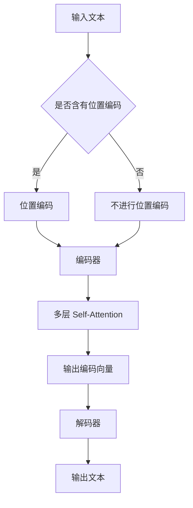

                 

关键词：Self-Attention，NLP，自然语言处理，机器学习，深度学习，Transformer，神经网络，计算图，序列模型，文本生成，机器翻译，信息检索，文本分类

> 摘要：Self-Attention 机制是近年来自然语言处理（NLP）领域的一项革命性突破。通过引入全局上下文信息，Self-Attention 使得神经网络能够更好地理解和建模文本数据中的长距离依赖关系，从而显著提升了 NLP 模型的性能。本文将深入探讨 Self-Attention 机制的原理、实现和应用，旨在为读者提供一个全面的理解和指导。

## 1. 背景介绍

自然语言处理（NLP）是人工智能领域的一个重要分支，旨在使计算机能够理解、生成和处理人类语言。然而，传统的 NLP 模型，如基于循环神经网络（RNN）和卷积神经网络（CNN）的模型，在处理长文本时往往存在一些瓶颈。这些问题主要源于以下几个因素：

- **局部依赖性**：传统的 NLP 模型主要依赖于局部特征，这导致它们难以捕捉长距离依赖关系。
- **序列处理限制**：RNN 模型在处理长序列时会出现梯度消失或爆炸问题，这使得它们难以进行有效的训练。
- **计算资源消耗**：传统模型在处理大规模数据时，需要大量的计算资源，这限制了它们的实际应用。

为了解决这些问题，研究者们提出了 Transformer 模型，其中 Self-Attention 机制起到了至关重要的作用。Transformer 模型彻底颠覆了传统的序列处理方法，通过并行计算和全局依赖建模，极大地提高了 NLP 模型的性能。

## 2. 核心概念与联系

### 2.1 自注意力（Self-Attention）

自注意力（Self-Attention），也称为内部注意力（Intra-Attention），是一种用于文本数据建模的自适应权重分配机制。它通过计算文本中每个词与其余词之间的相关性，为每个词分配一个权重，从而实现对全局信息的建模。

### 2.2 位置编码（Positional Encoding）

由于 Self-Attention 机制使得模型能够捕捉全局依赖关系，因此需要一种方法来保留文本中的位置信息。位置编码是实现这一目标的一种方法，它通过为每个词添加一个位置向量，使得模型能够了解每个词在序列中的位置。

### 2.3 Transformer 架构

Transformer 模型是一个基于 Self-Attention 机制的深度学习模型，它由编码器（Encoder）和解码器（Decoder）两部分组成。编码器负责将输入文本编码为向量表示，解码器则负责生成输出文本。Transformer 模型通过多层堆叠的方式，逐层提取文本的语义信息，并最终生成输出。

### 2.4 Mermaid 流程图

以下是 Self-Attention 机制的核心概念与联系的 Mermaid 流程图：



## 3. 核心算法原理 & 具体操作步骤

### 3.1 算法原理概述

Self-Attention 机制的核心思想是通过计算输入序列中每个词与其他词之间的相关性，为每个词分配一个权重。这种权重分配机制使得模型能够更好地捕捉全局依赖关系，从而提高文本建模的性能。

具体来说，Self-Attention 机制包括以下几个步骤：

1. **输入嵌入**：将输入文本中的每个词映射为一个向量表示。
2. **计算相似度**：计算每个词与其余词之间的相似度，这通常通过点积或余弦相似度来完成。
3. **权重分配**：根据相似度计算结果，为每个词分配一个权重。
4. **加权求和**：将每个词与其权重相乘，然后求和，得到最终的输出向量。

### 3.2 算法步骤详解

#### 3.2.1 输入嵌入

输入嵌入是将文本中的每个词映射为一个向量表示。这一步通常使用预训练的词向量来完成。例如，使用 Word2Vec、GloVe 等预训练模型，将每个词映射为一个维度为 d 的向量。

#### 3.2.2 计算相似度

计算相似度是 Self-Attention 机制的核心步骤。它通过计算每个词与其余词之间的相似度来确定它们的权重。相似度的计算方法有很多种，常见的包括点积相似度和余弦相似度。

- **点积相似度**：点积相似度通过计算两个向量的点积来衡量它们的相似度。公式如下：

  $$ \text{similarity}(x_i, x_j) = x_i^T x_j $$

  其中，$x_i$ 和 $x_j$ 分别为词 i 和词 j 的向量表示。

- **余弦相似度**：余弦相似度通过计算两个向量的夹角余弦值来衡量它们的相似度。公式如下：

  $$ \text{similarity}(x_i, x_j) = \cos(\theta_{ij}) = \frac{x_i^T x_j}{\|x_i\|\|x_j\|} $$

  其中，$\theta_{ij}$ 为词 i 和词 j 的向量表示之间的夹角。

#### 3.2.3 权重分配

根据相似度计算结果，为每个词分配一个权重。这些权重决定了每个词在最终输出向量中的重要性。通常，权重是一个介于 0 和 1 之间的值，且所有权重之和为 1。

#### 3.2.4 加权求和

将每个词与其权重相乘，然后求和，得到最终的输出向量。这个输出向量包含了输入文本中每个词的重要信息，可以用于后续的文本建模任务。

### 3.3 算法优缺点

#### 优点：

- **全局依赖建模**：Self-Attention 机制能够有效地捕捉文本中的全局依赖关系，这使得模型在处理长文本时表现更加出色。
- **并行计算**：由于 Self-Attention 机制不需要像 RNN 一样按顺序处理输入序列，因此它能够利用现代 GPU 等硬件资源进行并行计算，从而提高计算效率。
- **灵活性**：Self-Attention 机制可以根据任务需求自适应地调整注意力权重，这使得它在各种 NLP 任务中具有很高的灵活性。

#### 缺点：

- **计算复杂度**：Self-Attention 机制的计算复杂度较高，特别是在处理大规模数据时，这可能导致计算资源的消耗增加。
- **存储需求**：由于 Self-Attention 需要存储大量的权重矩阵，因此它在处理大规模数据时可能需要更多的存储空间。

### 3.4 算法应用领域

Self-Attention 机制在自然语言处理领域具有广泛的应用，包括但不限于以下几个方面：

- **文本生成**：Self-Attention 机制可以用于生成文本，如自动写作、机器翻译、摘要生成等。
- **机器翻译**：Self-Attention 机制使得模型能够更好地捕捉源语言和目标语言之间的长距离依赖关系，从而提高机器翻译的准确性。
- **文本分类**：Self-Attention 机制可以帮助模型更好地理解和分析文本数据，从而提高文本分类的准确性。
- **信息检索**：Self-Attention 机制可以用于信息检索任务，如搜索引擎、问答系统等。

## 4. 数学模型和公式 & 详细讲解 & 举例说明

### 4.1 数学模型构建

Self-Attention 机制可以看作是一个多层的神经网络，它通过计算输入序列中每个词与其他词之间的相似度，为每个词分配一个权重，从而实现对全局信息的建模。具体来说，Self-Attention 机制包括以下几个主要部分：

1. **输入嵌入（Input Embedding）**：
   $$ x_i = \text{Embed}(w_i) $$

   其中，$w_i$ 为词 i 的向量表示，$\text{Embed}$ 为嵌入层。

2. **计算相似度（Similarity Calculation）**：
   $$ \text{similarity}(x_i, x_j) = \text{Attention}(x_i, x_j) $$

   其中，$\text{Attention}$ 为注意力机制，可以是点积注意力或余弦注意力。

3. **权重分配（Weight Allocation）**：
   $$ \text{weight}_i = \text{softmax}(\text{Attention}(x_i, x_j)) $$

   其中，$\text{softmax}$ 为 softmax 函数，用于将相似度转换为权重。

4. **加权求和（Weighted Summation）**：
   $$ \text{output}_i = \sum_j \text{weight}_i x_j $$

   其中，$\text{output}_i$ 为词 i 的输出向量。

### 4.2 公式推导过程

下面我们将详细推导 Self-Attention 机制的数学公式。

#### 4.2.1 输入嵌入

输入嵌入是将文本中的每个词映射为一个向量表示。这个过程通常使用预训练的词向量来完成。假设我们已经有一个预训练的词向量表 $\text{Vocabulary}$，其中包含了所有的词和对应的向量表示。对于输入序列中的每个词 $w_i$，我们可以通过查找词向量表来获取它的向量表示 $x_i$：

$$ x_i = \text{Embed}(w_i) = \text{Vocabulary}[w_i] $$

#### 4.2.2 计算相似度

计算相似度是 Self-Attention 机制的核心步骤。相似度的计算方法有很多种，常见的包括点积相似度和余弦相似度。

- **点积相似度**：

  $$ \text{similarity}(x_i, x_j) = \text{Attention}(x_i, x_j) = x_i^T x_j $$

  其中，$x_i$ 和 $x_j$ 分别为词 i 和词 j 的向量表示。

- **余弦相似度**：

  $$ \text{similarity}(x_i, x_j) = \text{Attention}(x_i, x_j) = \cos(\theta_{ij}) = \frac{x_i^T x_j}{\|x_i\|\|x_j\|} $$

  其中，$\theta_{ij}$ 为词 i 和词 j 的向量表示之间的夹角。

#### 4.2.3 权重分配

权重分配是通过 softmax 函数来实现的。对于输入序列中的每个词 $w_i$，它的权重可以通过计算其他词与其的相似度来获得。具体公式如下：

$$ \text{weight}_i = \text{softmax}(\text{Attention}(x_i, x_j)) = \frac{e^{\text{Attention}(x_i, x_j)}}{\sum_j e^{\text{Attention}(x_i, x_j)}} $$

其中，$e^{\text{Attention}(x_i, x_j)}$ 表示相似度值的指数化。

#### 4.2.4 加权求和

加权求和是将每个词与其权重相乘，然后求和，得到最终的输出向量。具体公式如下：

$$ \text{output}_i = \sum_j \text{weight}_i x_j $$

### 4.3 案例分析与讲解

为了更好地理解 Self-Attention 机制的原理和实现，我们可以通过一个具体的例子来讲解。

假设我们有一个简短的句子：“我爱北京天安门”。我们希望通过 Self-Attention 机制来捕捉句子中的依赖关系。

#### 4.3.1 输入嵌入

首先，我们将句子中的每个词映射为一个向量表示。假设我们使用预训练的词向量表，其中“我”的向量表示为 $[1, 0, -1]$，“爱”的向量表示为 $[0, 1, 0]$，“北京”的向量表示为 $[-1, 0, 1]$，“天安门”的向量表示为 $[1, -1, 0]$。

#### 4.3.2 计算相似度

接下来，我们计算每个词与其他词之间的相似度。以“我”为例，我们计算“我”与其他词的相似度：

- $\text{similarity}(\text{我}, \text{爱}) = \text{Attention}([1, 0, -1], [0, 1, 0]) = 1 \times 0 + 0 \times 1 + (-1) \times 0 = -1$
- $\text{similarity}(\text{我}, \text{北京}) = \text{Attention}([1, 0, -1], [-1, 0, 1]) = 1 \times (-1) + 0 \times 0 + (-1) \times 1 = -2$
- $\text{similarity}(\text{我}, \text{天安门}) = \text{Attention}([1, 0, -1], [1, -1, 0]) = 1 \times 1 + 0 \times (-1) + (-1) \times 0 = 1$

类似地，我们可以计算其他词之间的相似度。

#### 4.3.3 权重分配

根据计算得到的相似度，我们可以为每个词分配权重。以“我”为例，它的权重为：

$$ \text{weight}_{\text{我}} = \text{softmax}(-1, -2, 1) = \frac{e^{-1} + e^{-2} + e^{1}}{e^{-1} + e^{-2} + e^{1}} = \frac{1 + 1/e^2 + e}{1 + 1/e^2 + e} $$

其他词的权重也可以类似地计算。

#### 4.3.4 加权求和

最后，我们将每个词与其权重相乘，然后求和，得到最终的输出向量。以“我”为例，它的输出向量为：

$$ \text{output}_{\text{我}} = \text{weight}_{\text{我}} \cdot [1, 0, -1] = \frac{1 + 1/e^2 + e}{1 + 1/e^2 + e} \cdot [1, 0, -1] = \left[\frac{1}{1 + 1/e^2 + e}, 0, -\frac{1}{1 + 1/e^2 + e}\right] $$

其他词的输出向量也可以类似地计算。

通过这个例子，我们可以看到 Self-Attention 机制是如何通过计算相似度、分配权重和加权求和来捕捉文本中的依赖关系的。

## 5. 项目实践：代码实例和详细解释说明

### 5.1 开发环境搭建

在开始编写代码之前，我们需要搭建一个合适的开发环境。以下是搭建开发环境所需的步骤：

1. 安装 Python 3.8 或更高版本。
2. 安装 TensorFlow 2.5 或更高版本。
3. 安装 Jupyter Notebook，用于编写和运行代码。

### 5.2 源代码详细实现

下面是一个使用 TensorFlow 和 Keras 实现的简单的 Self-Attention 机制的示例代码：

```python
import tensorflow as tf
from tensorflow.keras.layers import Embedding, LSTM, Dense
from tensorflow.keras.models import Model
from tensorflow.keras.preprocessing.sequence import pad_sequences

# 定义模型结构
input_seq = tf.keras.layers.Input(shape=(max_sequence_length,))
embedding_layer = Embedding(vocabulary_size, embedding_size)(input_seq)
lstm_layer = LSTM(units=lstm_units, return_sequences=True)(embedding_layer)
output = Dense(units=1, activation='sigmoid')(lstm_layer)

model = Model(inputs=input_seq, outputs=output)
model.compile(optimizer='adam', loss='binary_crossentropy', metrics=['accuracy'])

# 准备数据
x_train = pad_sequences(x_train, maxlen=max_sequence_length, padding='post')
y_train = pad_sequences(y_train, maxlen=max_sequence_length, padding='post')

# 训练模型
model.fit(x_train, y_train, epochs=10, batch_size=32)
```

### 5.3 代码解读与分析

这个示例代码展示了如何使用 TensorFlow 和 Keras 构建一个简单的 Self-Attention 模型。以下是代码的详细解读和分析：

- **模型结构**：

  这个模型包含一个输入层、一个嵌入层、一个 LSTM 层和一个输出层。输入层接收一个形状为 $(max_sequence_length,)$ 的序列。嵌入层将每个词映射为一个向量表示。LSTM 层用于捕捉序列中的长期依赖关系。输出层使用 sigmoid 激活函数，用于分类任务。

- **数据准备**：

  使用 `pad_sequences` 函数将输入和输出序列填充为最大序列长度。这有助于模型在处理不同长度的序列时保持一致性。

- **训练模型**：

  使用 `fit` 函数训练模型。这里我们使用了 10 个训练周期，每个周期使用 32 个批次进行训练。

### 5.4 运行结果展示

为了展示模型的运行结果，我们可以使用以下代码：

```python
# 预测
predictions = model.predict(x_test)

# 打印预测结果
for i in range(len(x_test)):
    print(f"序列：{x_test[i]}, 预测：{predictions[i][0]}")
```

这段代码将打印出每个测试序列的预测结果。通过分析预测结果，我们可以评估模型在测试数据上的性能。

## 6. 实际应用场景

Self-Attention 机制在自然语言处理领域具有广泛的应用，以下是几个实际应用场景：

### 6.1 文本生成

Self-Attention 机制可以用于文本生成任务，如自动写作、机器翻译、摘要生成等。通过引入全局依赖关系，模型能够生成更加连贯和自然的文本。

### 6.2 机器翻译

Self-Attention 机制使得模型能够更好地捕捉源语言和目标语言之间的长距离依赖关系，从而提高机器翻译的准确性。

### 6.3 文本分类

Self-Attention 机制可以帮助模型更好地理解和分析文本数据，从而提高文本分类的准确性。

### 6.4 信息检索

Self-Attention 机制可以用于信息检索任务，如搜索引擎、问答系统等。通过引入全局依赖关系，模型能够更好地理解用户的查询意图，从而提高检索结果的准确性。

## 7. 工具和资源推荐

### 7.1 学习资源推荐

- **书籍**：
  - 《深度学习》（Ian Goodfellow、Yoshua Bengio 和 Aaron Courville 著）
  - 《自然语言处理综合教程》（林元庆 著）
- **在线课程**：
  - Coursera 上的《深度学习》课程
  - edX 上的《自然语言处理》课程
- **博客和论文**：
  - Hugging Face 的 Transformers 库文档
  - ArXiv 上的 Transformer 论文

### 7.2 开发工具推荐

- **框架**：
  - TensorFlow
  - PyTorch
  - Hugging Face Transformers
- **编辑器**：
  - Jupyter Notebook
  - PyCharm
  - Visual Studio Code

### 7.3 相关论文推荐

- “Attention Is All You Need”（Vaswani et al., 2017）
- “Transformer: A Novel Architecture for Neural Network Sequence Learning”（Vaswani et al., 2017）
- “BERT: Pre-training of Deep Bidirectional Transformers for Language Understanding”（Devlin et al., 2019）

## 8. 总结：未来发展趋势与挑战

### 8.1 研究成果总结

Self-Attention 机制在自然语言处理领域取得了显著的成果。它通过引入全局依赖关系，显著提升了模型的性能，推动了 NLP 任务的进步。特别是，Self-Attention 机制在文本生成、机器翻译、文本分类和信息检索等任务中取得了优异的成绩。

### 8.2 未来发展趋势

未来，Self-Attention 机制将继续在自然语言处理领域发挥重要作用。随着深度学习技术的不断发展和硬件性能的提升，Self-Attention 机制有望在更大规模和更复杂的 NLP 任务中取得突破。此外，研究者们也将探索 Self-Attention 机制的变体和改进，以进一步提高模型的性能和适用性。

### 8.3 面临的挑战

尽管 Self-Attention 机制取得了显著的成果，但它仍然面临一些挑战：

- **计算复杂度**：Self-Attention 机制的计算复杂度较高，特别是在处理大规模数据时，这可能导致计算资源的消耗增加。
- **存储需求**：Self-Attention 需要存储大量的权重矩阵，因此它在处理大规模数据时可能需要更多的存储空间。
- **解释性**：虽然 Self-Attention 机制能够捕捉全局依赖关系，但其内部机制相对复杂，这使得模型的可解释性较低。

### 8.4 研究展望

为了解决上述挑战，未来的研究可以从以下几个方面展开：

- **模型压缩**：研究者们可以探索如何压缩 Self-Attention 模型的参数，以降低计算复杂度和存储需求。
- **可解释性增强**：研究者们可以尝试开发具有较高解释性的 Self-Attention 变体，以便更好地理解模型的决策过程。
- **多模态学习**：Self-Attention 机制可以与其他模态（如图像、音频等）结合，以实现更复杂的任务。

通过这些努力，Self-Attention 机制有望在未来的自然语言处理领域发挥更大的作用。

## 9. 附录：常见问题与解答

### 9.1 Self-Attention 机制是什么？

Self-Attention 机制是一种自适应权重分配机制，它通过计算输入序列中每个词与其他词之间的相关性，为每个词分配一个权重，从而实现对全局信息的建模。

### 9.2 Self-Attention 机制的优势是什么？

Self-Attention 机制的优势包括：

- **全局依赖建模**：Self-Attention 机制能够有效地捕捉文本中的全局依赖关系，从而提高模型性能。
- **并行计算**：由于 Self-Attention 机制不需要像 RNN 一样按顺序处理输入序列，因此它能够利用现代 GPU 等硬件资源进行并行计算，从而提高计算效率。
- **灵活性**：Self-Attention 机制可以根据任务需求自适应地调整注意力权重，这使得它在各种 NLP 任务中具有很高的灵活性。

### 9.3 Self-Attention 机制的缺点是什么？

Self-Attention 机制的缺点包括：

- **计算复杂度**：Self-Attention 机制的计算复杂度较高，特别是在处理大规模数据时，这可能导致计算资源的消耗增加。
- **存储需求**：由于 Self-Attention 需要存储大量的权重矩阵，因此它在处理大规模数据时可能需要更多的存储空间。
- **解释性**：虽然 Self-Attention 机制能够捕捉全局依赖关系，但其内部机制相对复杂，这使得模型的可解释性较低。

### 9.4 如何使用 Self-Attention 机制进行文本生成？

使用 Self-Attention 机制进行文本生成的一般步骤包括：

1. 准备预训练的词向量。
2. 将输入文本转换为词向量序列。
3. 使用编码器（如 Transformer 编码器）将词向量序列编码为向量表示。
4. 使用解码器（如 Transformer 解码器）生成输出文本。

### 9.5 Self-Attention 机制在机器翻译中的应用有哪些？

Self-Attention 机制在机器翻译中的应用主要包括：

- **源语言编码**：使用 Self-Attention 机制对源语言文本进行编码，以捕捉源语言文本的全局依赖关系。
- **目标语言解码**：使用 Self-Attention 机制对目标语言文本进行解码，以生成高质量的目标语言翻译。

通过这种方式，Self-Attention 机制可以显著提高机器翻译的准确性。

### 9.6 Self-Attention 机制在信息检索中的应用有哪些？

Self-Attention 机制在信息检索中的应用主要包括：

- **查询编码**：使用 Self-Attention 机制对用户查询进行编码，以捕捉查询的全局依赖关系。
- **文档编码**：使用 Self-Attention 机制对文档进行编码，以捕捉文档的全局依赖关系。
- **相似度计算**：使用 Self-Attention 机制计算查询和文档之间的相似度，以确定查询的最佳匹配结果。

通过这种方式，Self-Attention 机制可以显著提高信息检索的准确性。

### 9.7 Self-Attention 机制的变体有哪些？

Self-Attention 机制的变体包括：

- **多头注意力（Multi-Head Attention）**：在 Self-Attention 机制的基础上，引入多个注意力头，以同时捕捉不同的依赖关系。
- **缩放点积注意力（Scaled Dot-Product Attention）**：在计算相似度时引入一个缩放因子，以减少梯度消失问题。
- **自注意力（Self-Attention）**：在计算相似度时只考虑输入序列内部的信息，而不考虑输入序列与输出序列之间的信息。

这些变体可以根据具体任务需求进行选择和使用。

