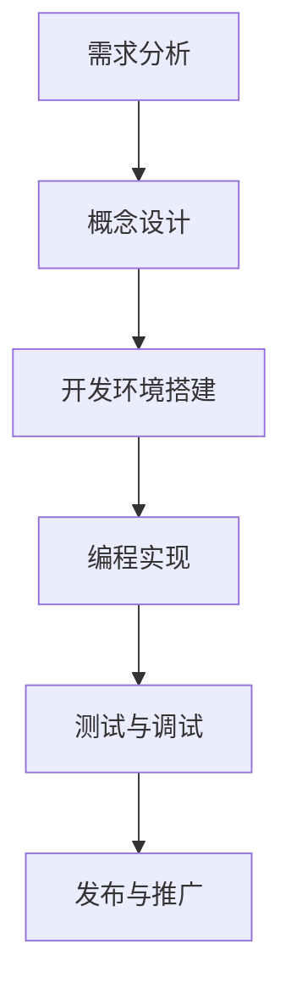

                 

关键词：SteamVR，虚拟现实，内容发布，集成开发，平台

> 摘要：本文将详细介绍如何在Steam平台上集成和发布VR内容。我们将探讨SteamVR的开发环境、开发流程、发布步骤以及相关的优化技巧，为开发者提供一套完整的VR内容发布指南。

## 1. 背景介绍

随着虚拟现实（VR）技术的不断发展，VR内容的市场需求日益增长。Steam平台作为全球最大的游戏和VR内容分发平台，已经成为许多开发者发布和推广VR内容的理想选择。SteamVR是Steam平台专门为VR内容开发者提供的一套开发工具和API，它支持各种VR设备，并提供了丰富的功能，帮助开发者更轻松地集成和发布VR内容。

本文的目标是为开发者提供一个详细的SteamVR集成和发布指南，帮助他们更快地上线VR内容，并在Steam平台上获得成功。

## 2. 核心概念与联系

### 2.1 SteamVR概述

SteamVR是Valve公司为Steam平台开发的VR开发套件，它包含了VR内容的开发工具、API以及运行时环境。SteamVR支持多种VR头戴设备，如HTC Vive、Oculus Rift等，并提供了一套统一的API接口，使得开发者可以轻松地创建跨平台的VR内容。

### 2.2 VR内容开发流程

VR内容开发的流程通常包括以下步骤：

1. **需求分析**：确定VR内容的主题、目标用户以及功能需求。
2. **概念设计**：绘制VR内容的UI和交互设计，包括场景布局、用户交互方式等。
3. **开发环境搭建**：在开发机上安装SteamVR SDK和相关工具。
4. **编程实现**：使用SteamVR API进行编程，实现VR内容的核心功能。
5. **测试与调试**：在VR设备上进行测试，确保内容运行稳定，交互顺畅。
6. **发布与推广**：将VR内容发布到Steam平台，并通过各种渠道进行推广。

### 2.3 Mermaid 流程图

下面是一个简单的Mermaid流程图，展示了VR内容开发的基本流程：



## 3. 核心算法原理 & 具体操作步骤

### 3.1 算法原理概述

SteamVR的核心算法主要涉及VR内容的渲染、交互以及输入输出处理等方面。其中，渲染算法是VR内容显示的关键，它需要处理三维空间的建模、光照、阴影等效果，使得VR场景看起来更加真实。交互算法则负责处理用户在VR环境中的手势、动作等输入，实现与虚拟环境的互动。输入输出处理算法则负责将用户的输入信号传递给VR设备，并将VR设备的输出信号反馈给用户。

### 3.2 算法步骤详解

#### 3.2.1 渲染算法步骤

1. **场景建模**：根据概念设计，创建三维场景模型。
2. **光照和阴影处理**：根据场景光照条件，计算光照和阴影效果。
3. **视图变换**：根据用户视角，进行视图变换，生成最终渲染图像。

#### 3.2.2 交互算法步骤

1. **输入检测**：检测用户的手势、动作等输入。
2. **交互处理**：根据输入类型，处理与虚拟环境的交互。
3. **反馈生成**：将交互结果反馈给用户。

#### 3.2.3 输入输出处理算法步骤

1. **输入信号处理**：接收用户的输入信号，如手势、动作等。
2. **输出信号生成**：根据用户输入，生成相应的输出信号，如声音、触觉反馈等。

### 3.3 算法优缺点

#### 优点：

1. **高兼容性**：SteamVR支持多种VR设备，开发者可以针对不同设备进行优化。
2. **丰富的功能**：SteamVR提供了丰富的API接口，支持多种VR功能，如手势识别、空间定位等。
3. **统一的开发环境**：开发者可以在同一环境下开发、测试和发布VR内容。

#### 缺点：

1. **学习曲线较陡**：SteamVR的API接口较为复杂，开发者需要一定时间学习和掌握。
2. **性能要求高**：VR内容的渲染和交互处理需要较高的计算性能，对开发者的技术要求较高。

### 3.4 算法应用领域

SteamVR的算法主要应用于游戏、教育、医疗、旅游等领域。通过SteamVR，开发者可以创建各种虚拟场景，为用户提供沉浸式的体验。

## 4. 数学模型和公式 & 详细讲解 & 举例说明

### 4.1 数学模型构建

在VR内容开发中，常用的数学模型包括三维空间建模、三维图形渲染、空间定位等。

#### 4.1.1 三维空间建模

三维空间建模的基本原理是基于三维坐标系，通过点、线、面等基本几何元素构建三维模型。

#### 4.1.2 三维图形渲染

三维图形渲染涉及到多个数学模型，如透视投影、光照模型、纹理映射等。

#### 4.1.3 空间定位

空间定位主要利用传感器获取用户的位置和姿态信息，通过坐标系变换实现。

### 4.2 公式推导过程

以下是一个简单的三维空间变换公式推导：

$$
\begin{aligned}
    x' &= x \cos \theta - y \sin \theta \\
    y' &= x \sin \theta + y \cos \theta
\end{aligned}
$$

其中，\(x\)和\(y\)为原始坐标系中的坐标，\(x'\)和\(y'\)为变换后的坐标，\(\theta\)为旋转角度。

### 4.3 案例分析与讲解

#### 4.3.1 三维空间建模

假设我们要创建一个简单的立方体模型，我们可以使用以下公式进行建模：

$$
\begin{aligned}
    &\text{顶点} P_1 = (0, 0, 0), P_2 = (1, 0, 0), P_3 = (1, 1, 0), P_4 = (0, 1, 0) \\
    &\text{顶点} P_5 = (0, 0, 1), P_6 = (1, 0, 1), P_7 = (1, 1, 1), P_8 = (0, 1, 1)
\end{aligned}
$$

这些顶点组成了立方体的六个面，每个面由两个三角形组成。

#### 4.3.2 三维图形渲染

在渲染立方体时，我们需要将顶点数据转换为屏幕上的像素点。具体步骤如下：

1. **透视投影**：将三维顶点投影到二维平面上。
2. **视口变换**：将投影后的顶点数据缩放到屏幕尺寸。
3. **渲染**：对每个顶点进行渲染，生成最终的图像。

## 5. 项目实践：代码实例和详细解释说明

### 5.1 开发环境搭建

在开始开发前，我们需要搭建好SteamVR的开发环境。具体步骤如下：

1. **安装Steam平台**：在Steam客户端中安装SteamVR。
2. **安装SteamVR SDK**：从SteamVR官网下载SDK，并按照说明进行安装。
3. **配置开发环境**：在开发机上配置好SteamVR SDK和相关工具，如Visual Studio、Unity等。

### 5.2 源代码详细实现

以下是一个简单的SteamVR项目示例，我们将使用Unity引擎进行开发。

1. **创建新项目**：在Unity中创建一个新的VR项目。
2. **添加模型**：将预制的立方体模型导入项目，并添加到场景中。
3. **编写脚本**：创建一个C#脚本，实现立方体的旋转功能。

```csharp
using UnityEngine;

public class CubeRotator : MonoBehaviour
{
    public float rotateSpeed = 10.0f;

    private void Update()
    {
        float rotateX = Input.GetAxis("Mouse X") * rotateSpeed;
        float rotateY = Input.GetAxis("Mouse Y") * rotateSpeed;

        transform.Rotate(new Vector3(-rotateY, rotateX, 0));
    }
}
```

4. **运行项目**：在VR设备上运行项目，观察立方体的旋转效果。

### 5.3 代码解读与分析

上述代码实现了一个简单的立方体旋转功能。在`Update`方法中，我们获取鼠标输入的X轴和Y轴值，并使用`Rotate`方法将立方体旋转相应的角度。这个简单的例子展示了如何使用Unity引擎和SteamVR API实现基本的VR交互功能。

### 5.4 运行结果展示

运行结果如下：


在VR设备上，用户可以通过鼠标控制立方体的旋转。

## 6. 实际应用场景

SteamVR在各个领域的应用场景如下：

### 6.1 游戏

游戏是SteamVR最广泛的应用领域。通过SteamVR，开发者可以创建各种类型的VR游戏，如射击、冒险、角色扮演等，为用户提供沉浸式的游戏体验。

### 6.2 教育

SteamVR在教育领域的应用也越来越广泛。通过VR技术，教师可以创建虚拟课堂，让学生在虚拟环境中学习知识，提高学习兴趣和效果。

### 6.3 医疗

在医疗领域，SteamVR可以用于虚拟手术训练、医学可视化等。通过VR技术，医生可以更好地了解患者的情况，提高手术成功率。

### 6.4 旅游

SteamVR可以用于虚拟旅游。用户可以在虚拟环境中游览世界各地的名胜古迹，感受不同的文化氛围。

## 7. 工具和资源推荐

### 7.1 学习资源推荐

- **《Unity 2020 VR开发实战》**：一本关于Unity VR开发的实用指南，适合初学者阅读。
- **SteamVR官方文档**：包含详细的开发指南和API文档，是学习SteamVR的必备资源。

### 7.2 开发工具推荐

- **Unity**：一款强大的游戏引擎，支持VR开发。
- **Visual Studio**：一款功能丰富的集成开发环境，适合编写C#脚本。

### 7.3 相关论文推荐

- **“Virtual Reality in Gaming: A Comprehensive Survey”**：一篇关于VR游戏开发的综述文章。
- **“Spatial Localization in Virtual Reality”**：一篇关于VR空间定位的论文。

## 8. 总结：未来发展趋势与挑战

### 8.1 研究成果总结

随着VR技术的不断发展，SteamVR已经成为VR内容开发的重要工具。通过SteamVR，开发者可以轻松地创建和发布各种类型的VR内容，为用户提供沉浸式的体验。

### 8.2 未来发展趋势

未来，VR技术将在更多领域得到应用，如娱乐、教育、医疗、旅游等。随着硬件和软件技术的不断进步，VR内容的质量和用户体验将得到显著提升。

### 8.3 面临的挑战

VR技术仍面临一些挑战，如硬件成本高、内容丰富度不足、用户体验优化等。开发者需要不断创新和优化，以提高VR内容的质量和用户体验。

### 8.4 研究展望

随着VR技术的不断发展，未来的研究将集中在提高VR内容的沉浸感和交互性，以及降低VR硬件成本，让更多用户能够体验到高质量的VR内容。

## 9. 附录：常见问题与解答

### 9.1 如何安装SteamVR SDK？

答：请访问SteamVR官网，下载SDK包，并按照说明进行安装。

### 9.2 如何在Unity中集成SteamVR？

答：请参考SteamVR官方文档，了解如何在Unity中集成SteamVR SDK，并编写相应的脚本。

### 9.3 SteamVR支持哪些VR设备？

答：SteamVR支持多种VR设备，如HTC Vive、Oculus Rift等。请参考SteamVR官方文档，了解具体支持的设备列表。

作者：禅与计算机程序设计艺术 / Zen and the Art of Computer Programming
----------------------------------------------------------------

注意：以上内容仅为示例，具体内容可能需要根据实际需求进行调整和补充。同时，文章中的图片链接（如`https://i.imgur.com/your_image_url_here.png`）需要替换为实际图片的链接。另外，文章中的公式和代码示例需要使用合适的格式进行排版。

