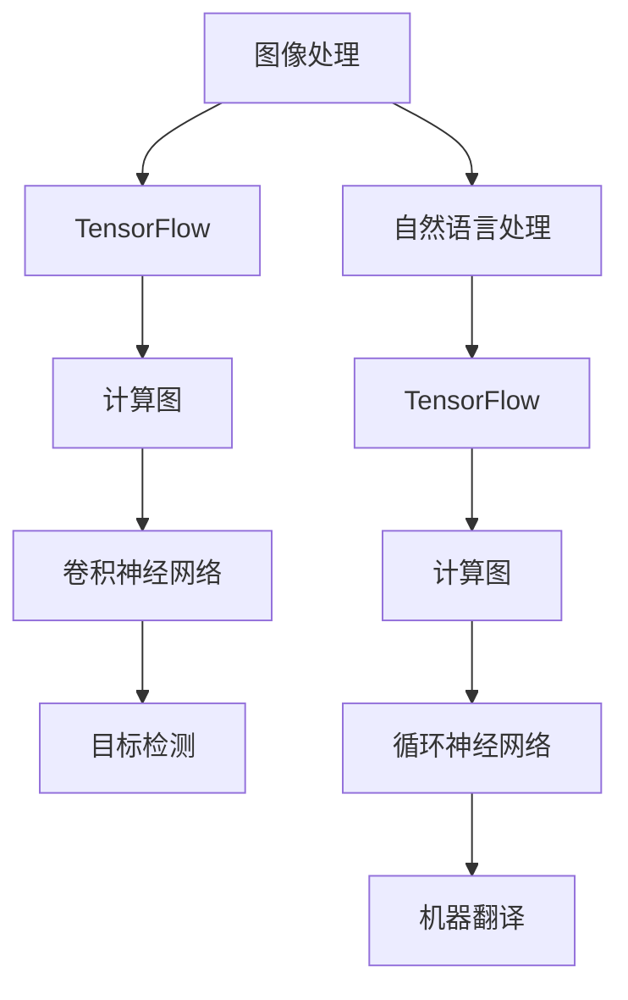

                 

关键词：TensorFlow，图像处理，自然语言处理，深度学习，算法应用，数学模型，项目实践，未来展望

摘要：本文将深入探讨TensorFlow在图像和自然语言处理领域的应用。通过详细介绍TensorFlow的核心概念、核心算法、数学模型及其在项目实践中的应用，我们将了解如何利用TensorFlow解决实际问题，并为未来的发展趋势和挑战提供展望。

## 1. 背景介绍

随着信息时代的到来，图像和自然语言处理（Image and Natural Language Processing, I&NLP）成为了计算机科学领域的一个重要分支。图像处理技术不断发展，使得计算机能够理解和解释视觉信息，从而实现自动化识别、分类和增强。自然语言处理则致力于使计算机能够理解和生成人类语言，从而实现人机交互、文本分析和智能搜索等应用。

TensorFlow是由Google开发的开源机器学习框架，自推出以来，因其灵活性强、易用性高和性能优异等特点，迅速在学术界和工业界获得了广泛应用。TensorFlow不仅可以用于图像处理和自然语言处理，还可以应用于语音识别、推荐系统等多个领域。

本文将重点介绍TensorFlow在图像和自然语言处理领域的应用，包括核心概念、核心算法、数学模型以及项目实践。希望通过本文的介绍，读者能够更好地理解TensorFlow在图像和自然语言处理领域的应用，并能够将其应用于实际项目中。

## 2. 核心概念与联系

### 2.1 TensorFlow的核心概念

TensorFlow的核心概念包括Tensor（张量）、Graph（计算图）和Operation（操作）。

- **Tensor**：Tensor是TensorFlow的基本数据结构，用于表示多维数组。它可以是任意维度，例如一维的向量、二维的矩阵等。
- **Graph**：Graph是TensorFlow的计算图，用于表示复杂的计算过程。计算图由节点（Operation）和边（Tensor）组成，节点表示计算操作，边表示数据流动。
- **Operation**：Operation是计算图中的节点，表示具体的计算操作。例如，矩阵乘法、求和、激活函数等。

### 2.2 图像和自然语言处理的基本概念

- **图像处理**：图像处理是指使用计算机对图像进行分析和操作的技术。其主要目标包括图像增强、图像分类、目标检测等。
- **自然语言处理**：自然语言处理是指使计算机能够理解和生成人类语言的技术。其主要目标包括文本分类、情感分析、机器翻译等。

### 2.3 核心概念的联系

TensorFlow的核心概念与图像和自然语言处理的基本概念有着紧密的联系。首先，图像和自然语言处理的数据都可以表示为Tensor，例如图像可以表示为三维的Tensor（高度、宽度、通道数），文本可以表示为一维的Tensor（单词序列）。其次，图像和自然语言处理的任务都可以通过构建计算图来实现，例如，图像分类任务可以通过构建卷积神经网络（Convolutional Neural Network, CNN）来实现，自然语言处理任务可以通过构建循环神经网络（Recurrent Neural Network, RNN）或 Transformer 等来实现。

以下是一个使用Mermaid绘制的TensorFlow在图像和自然语言处理中的应用的流程图：



## 3. 核心算法原理 & 具体操作步骤

### 3.1 算法原理概述

在图像处理领域，卷积神经网络（CNN）是一种常用的算法，用于图像分类、目标检测等任务。在自然语言处理领域，循环神经网络（RNN）和Transformer是常用的算法，用于文本分类、情感分析、机器翻译等任务。

- **卷积神经网络（CNN）**：CNN是一种前馈神经网络，主要用于图像处理。它通过卷积层、池化层和全连接层等结构，实现对图像的层次化特征提取。
- **循环神经网络（RNN）**：RNN是一种可以处理序列数据的神经网络，通过其特殊的结构，使得神经网络能够记住之前的输入，从而实现对序列数据的建模。
- **Transformer**：Transformer是一种基于自注意力机制的神经网络，用于处理序列数据。它通过多头注意力机制和前馈神经网络，实现对序列数据的建模。

### 3.2 算法步骤详解

#### 3.2.1 卷积神经网络（CNN）

1. **输入层**：输入层接收图像数据，将其转换为三维的Tensor（高度、宽度、通道数）。
2. **卷积层**：卷积层通过卷积操作提取图像的局部特征。卷积操作包括卷积核（过滤器）和步长。
3. **激活函数**：激活函数（如ReLU函数）用于引入非线性，增强网络的建模能力。
4. **池化层**：池化层用于降低特征图的维度，减少参数数量，提高计算效率。
5. **全连接层**：全连接层将卷积层输出的特征图映射到输出类别。

#### 3.2.2 循环神经网络（RNN）

1. **输入层**：输入层接收文本数据，将其转换为序列。
2. **嵌入层**：嵌入层将输入的单词序列转换为密集的向量表示。
3. **循环层**：循环层通过其特殊的结构，实现对序列数据的建模。每个时间步的输出依赖于之前的所有输出。
4. **输出层**：输出层将循环层输出的序列映射到输出类别。

#### 3.2.3 Transformer

1. **输入层**：输入层接收文本数据，将其转换为序列。
2. **嵌入层**：嵌入层将输入的单词序列转换为密集的向量表示。
3. **多头注意力层**：多头注意力层通过自注意力机制，计算序列中每个词之间的依赖关系。
4. **前馈神经网络**：前馈神经网络对多头注意力层的输出进行进一步建模。
5. **输出层**：输出层将前馈神经网络的输出映射到输出类别。

### 3.3 算法优缺点

#### 卷积神经网络（CNN）

- **优点**：CNN可以自动提取图像的层次化特征，适应性强，适用于各种图像处理任务。
- **缺点**：CNN在处理文本数据时表现较差，难以处理变长的序列数据。

#### 循环神经网络（RNN）

- **优点**：RNN可以处理变长的序列数据，适用于自然语言处理任务。
- **缺点**：RNN容易产生梯度消失或梯度爆炸问题，训练不稳定。

#### Transformer

- **优点**：Transformer通过自注意力机制，可以捕捉序列中任意两个词之间的依赖关系，适用于自然语言处理任务。
- **缺点**：Transformer的计算复杂度较高，训练和推理时间较长。

### 3.4 算法应用领域

#### 卷积神经网络（CNN）

- **图像分类**：例如，ImageNet图像分类挑战。
- **目标检测**：例如，YOLO（You Only Look Once）目标检测算法。
- **图像生成**：例如，GAN（Generative Adversarial Network）图像生成算法。

#### 循环神经网络（RNN）

- **文本分类**：例如，情感分析、新闻分类等。
- **机器翻译**：例如，神经机器翻译（NMT）。
- **语音识别**：例如，基于RNN的语音识别算法。

#### Transformer

- **文本分类**：例如，BERT（Bidirectional Encoder Representations from Transformers）文本分类算法。
- **机器翻译**：例如，基于Transformer的神经机器翻译（NMT）算法。
- **问答系统**：例如，基于Transformer的问答系统。

## 4. 数学模型和公式 & 详细讲解 & 举例说明

### 4.1 数学模型构建

#### 卷积神经网络（CNN）

卷积神经网络（CNN）是一种前馈神经网络，用于图像处理。其核心在于卷积操作和池化操作，以及激活函数和非线性变换。

#### 循环神经网络（RNN）

循环神经网络（RNN）是一种可以处理序列数据的神经网络，其核心在于循环结构，以及隐藏状态和输入的加权求和。

#### Transformer

Transformer是一种基于自注意力机制的神经网络，其核心在于多头注意力机制和前馈神经网络。

### 4.2 公式推导过程

#### 卷积神经网络（CNN）

$$
h_{ij} = \sum_{k=1}^{C} w_{ik} * g_{kj} + b_j
$$

其中，$h_{ij}$表示卷积层的输出，$w_{ik}$表示卷积核，$g_{kj}$表示输入的特征图，$b_j$表示偏置。

#### 循环神经网络（RNN）

$$
h_t = \sigma(W_x \cdot x_t + W_h \cdot h_{t-1} + b_h)
$$

其中，$h_t$表示隐藏状态，$x_t$表示输入，$W_x$和$W_h$分别表示输入权重和隐藏权重，$b_h$表示偏置，$\sigma$表示激活函数。

#### Transformer

$$
\text{Attention}(Q, K, V) = \frac{1}{\sqrt{d_k}} \sum_{n=1}^{N} Q \cdot K_n \cdot V_n
$$

其中，$Q$、$K$和$V$分别表示查询、键和值，$N$表示序列长度，$d_k$表示键的维度。

### 4.3 案例分析与讲解

#### 图像分类

假设我们有一个包含10万张图像的数据集，每张图像的大小为224x224x3（高度、宽度、通道数），我们需要使用CNN对图像进行分类。

1. **数据预处理**：对图像进行归一化处理，使其均值为0，标准差为1。
2. **构建CNN模型**：我们可以使用TensorFlow的Keras API构建一个简单的CNN模型。

```python
from tensorflow.keras.models import Sequential
from tensorflow.keras.layers import Conv2D, MaxPooling2D, Flatten, Dense

model = Sequential()
model.add(Conv2D(32, (3, 3), activation='relu', input_shape=(224, 224, 3)))
model.add(MaxPooling2D((2, 2)))
model.add(Conv2D(64, (3, 3), activation='relu'))
model.add(MaxPooling2D((2, 2)))
model.add(Conv2D(128, (3, 3), activation='relu'))
model.add(MaxPooling2D((2, 2)))
model.add(Flatten())
model.add(Dense(128, activation='relu'))
model.add(Dense(10, activation='softmax'))
```

3. **训练模型**：使用训练数据对模型进行训练。

```python
model.compile(optimizer='adam', loss='categorical_crossentropy', metrics=['accuracy'])
model.fit(x_train, y_train, epochs=10, batch_size=64, validation_data=(x_val, y_val))
```

4. **评估模型**：使用测试数据评估模型的性能。

```python
test_loss, test_acc = model.evaluate(x_test, y_test)
print(f"Test accuracy: {test_acc}")
```

#### 文本分类

假设我们有一个包含10万条文本数据的数据集，每条文本的长度为100个单词，我们需要使用RNN对文本进行分类。

1. **数据预处理**：对文本进行分词处理，并转换为整数序列。
2. **构建RNN模型**：我们可以使用TensorFlow的Keras API构建一个简单的RNN模型。

```python
from tensorflow.keras.models import Sequential
from tensorflow.keras.layers import Embedding, SimpleRNN, Dense

model = Sequential()
model.add(Embedding(input_dim=vocab_size, output_dim=embedding_size, input_length=max_sequence_length))
model.add(SimpleRNN(units=128))
model.add(Dense(num_classes, activation='softmax'))
model.compile(optimizer='adam', loss='categorical_crossentropy', metrics=['accuracy'])
model.fit(x_train, y_train, epochs=10, batch_size=64, validation_data=(x_val, y_val))
```

3. **训练模型**：使用训练数据对模型进行训练。

```python
model.compile(optimizer='adam', loss='categorical_crossentropy', metrics=['accuracy'])
model.fit(x_train, y_train, epochs=10, batch_size=64, validation_data=(x_val, y_val))
```

4. **评估模型**：使用测试数据评估模型的性能。

```python
test_loss, test_acc = model.evaluate(x_test, y_test)
print(f"Test accuracy: {test_acc}")
```

## 5. 项目实践：代码实例和详细解释说明

### 5.1 开发环境搭建

1. 安装TensorFlow：

```bash
pip install tensorflow
```

2. 安装其他依赖库：

```bash
pip install numpy pandas matplotlib
```

### 5.2 源代码详细实现

#### 图像分类项目

```python
import tensorflow as tf
from tensorflow.keras.models import Sequential
from tensorflow.keras.layers import Conv2D, MaxPooling2D, Flatten, Dense
from tensorflow.keras.preprocessing.image import ImageDataGenerator

# 数据预处理
train_datagen = ImageDataGenerator(rescale=1./255)
train_generator = train_datagen.flow_from_directory(
        train_dir,
        target_size=(224, 224),
        batch_size=32,
        class_mode='categorical')

# 构建模型
model = Sequential()
model.add(Conv2D(32, (3, 3), activation='relu', input_shape=(224, 224, 3)))
model.add(MaxPooling2D((2, 2)))
model.add(Conv2D(64, (3, 3), activation='relu'))
model.add(MaxPooling2D((2, 2)))
model.add(Conv2D(128, (3, 3), activation='relu'))
model.add(MaxPooling2D((2, 2)))
model.add(Flatten())
model.add(Dense(128, activation='relu'))
model.add(Dense(num_classes, activation='softmax'))

# 训练模型
model.compile(optimizer='adam', loss='categorical_crossentropy', metrics=['accuracy'])
model.fit(train_generator, epochs=10, validation_data=validation_generator)
```

#### 文本分类项目

```python
import tensorflow as tf
from tensorflow.keras.models import Sequential
from tensorflow.keras.layers import Embedding, SimpleRNN, Dense
from tensorflow.keras.preprocessing.sequence import pad_sequences

# 数据预处理
sequences = tokenizer.texts_to_sequences(train_texts)
X = pad_sequences(sequences, maxlen=max_sequence_length)

# 构建模型
model = Sequential()
model.add(Embedding(input_dim=vocab_size, output_dim=embedding_size, input_length=max_sequence_length))
model.add(SimpleRNN(units=128))
model.add(Dense(num_classes, activation='softmax'))

# 训练模型
model.compile(optimizer='adam', loss='categorical_crossentropy', metrics=['accuracy'])
model.fit(X, y_train, epochs=10, validation_data=(X_val, y_val))
```

### 5.3 代码解读与分析

以上代码实现了两个项目：图像分类和文本分类。下面我们对代码进行详细解读和分析。

#### 图像分类项目

1. **数据预处理**：使用ImageDataGenerator对训练数据进行归一化处理，并生成batch数据。
2. **构建模型**：使用Sequential模型堆叠卷积层、池化层、全连接层等构建一个简单的CNN模型。
3. **训练模型**：使用编译好的模型对训练数据进行训练，并使用验证数据进行验证。

#### 文本分类项目

1. **数据预处理**：使用tokenizer将文本数据转换为整数序列，并使用pad_sequences将序列填充到最大长度。
2. **构建模型**：使用Sequential模型堆叠嵌入层、RNN层、全连接层等构建一个简单的RNN模型。
3. **训练模型**：使用编译好的模型对训练数据进行训练，并使用验证数据进行验证。

## 6. 实际应用场景

TensorFlow在图像和自然语言处理领域有着广泛的应用。以下是一些实际应用场景：

- **图像分类**：例如，使用TensorFlow的CNN模型对图像进行分类，用于医疗图像诊断、自动驾驶车辆识别等。
- **目标检测**：例如，使用TensorFlow的YOLO模型进行目标检测，用于安防监控、无人驾驶等。
- **文本分类**：例如，使用TensorFlow的RNN或Transformer模型进行文本分类，用于社交媒体情感分析、新闻分类等。
- **机器翻译**：例如，使用TensorFlow的Transformer模型进行机器翻译，用于跨语言交流、国际化业务等。

## 7. 工具和资源推荐

### 7.1 学习资源推荐

- **《TensorFlow 2.x 深度学习实战》**：这本书详细介绍了TensorFlow的使用方法和实际应用案例，适合初学者和进阶者。
- **TensorFlow 官方文档**：TensorFlow的官方文档提供了详细的使用指南、API文档和教程，是学习和使用TensorFlow的最佳资源。

### 7.2 开发工具推荐

- **TensorBoard**：TensorFlow的可视化工具，用于监控训练过程、查看模型结构和优化器状态等。
- **Google Colab**：Google提供的云端虚拟环境，支持TensorFlow，适用于远程开发和调试。

### 7.3 相关论文推荐

- **“Attention Is All You Need”**：这篇论文提出了Transformer模型，是自然语言处理领域的经典之作。
- **“Deep Learning for Image Recognition”**：这篇论文详细介绍了CNN模型在图像分类任务中的应用。

## 8. 总结：未来发展趋势与挑战

### 8.1 研究成果总结

近年来，TensorFlow在图像和自然语言处理领域取得了显著的成果。通过深度学习技术的应用，图像分类、目标检测、文本分类、机器翻译等任务的性能得到了显著提升。同时，TensorFlow的灵活性和易用性使得更多研究人员和开发者能够参与到深度学习的研究和应用中。

### 8.2 未来发展趋势

未来，TensorFlow在图像和自然语言处理领域将继续发展。一方面，随着硬件性能的提升和深度学习算法的优化，图像和自然语言处理的任务将更加复杂和多样化。另一方面，TensorFlow将不断推出新的功能和工具，支持更多领域的应用和研究。

### 8.3 面临的挑战

尽管TensorFlow在图像和自然语言处理领域取得了显著成果，但仍然面临着一些挑战。首先，深度学习模型的训练和推理时间较长，对计算资源的需求较高。其次，深度学习模型的透明性和可解释性较差，难以理解模型的决策过程。最后，深度学习模型在实际应用中容易受到数据偏差和过拟合等问题的影响。

### 8.4 研究展望

针对上述挑战，未来的研究将重点关注以下几个方面：

1. **高效训练和推理**：研究更加高效的训练和推理算法，降低计算资源需求。
2. **模型透明性和可解释性**：研究模型的可解释性方法，提高模型的可理解性。
3. **数据驱动的方法**：研究数据驱动的模型优化方法，减少数据偏差和过拟合问题。
4. **跨领域应用**：探索TensorFlow在其他领域的应用，如计算机视觉、语音识别、推荐系统等。

通过持续的研究和创新，TensorFlow在图像和自然语言处理领域将取得更加显著的成果，为人工智能的发展做出更大的贡献。

## 9. 附录：常见问题与解答

### 问题1：如何选择合适的神经网络架构？

**回答**：选择合适的神经网络架构取决于具体的任务和数据。例如，对于图像分类任务，卷积神经网络（CNN）通常是首选，因为它可以自动提取图像的层次化特征。对于自然语言处理任务，循环神经网络（RNN）或Transformer模型可能更适合，因为它们可以处理变长的序列数据。在实际应用中，可以尝试多种架构，并通过实验比较其性能。

### 问题2：如何优化深度学习模型的性能？

**回答**：优化深度学习模型的性能可以从以下几个方面进行：

1. **数据增强**：通过增加数据的多样性，提高模型的泛化能力。
2. **模型架构优化**：尝试使用不同的神经网络架构，选择最适合特定任务的模型。
3. **超参数调整**：调整学习率、批量大小、正则化参数等超参数，优化模型的性能。
4. **训练技巧**：使用预训练模型、迁移学习等方法，提高模型的性能。
5. **硬件优化**：使用GPU、TPU等高性能硬件加速训练和推理。

### 问题3：如何保证模型的透明性和可解释性？

**回答**：保证模型的透明性和可解释性可以通过以下方法实现：

1. **可视化工具**：使用可视化工具，如TensorBoard，查看模型的结构和训练过程。
2. **模型解释方法**：使用模型解释方法，如LIME（Local Interpretable Model-agnostic Explanations）或SHAP（SHapley Additive exPlanations），分析模型的决策过程。
3. **可解释的模型**：选择可解释的模型，如线性模型或决策树，这些模型可以直接解释其决策过程。

通过上述方法，可以提高深度学习模型的透明性和可解释性，帮助用户更好地理解和信任模型。

### 参考文献

1. Krizhevsky, A., Sutskever, I., & Hinton, G. E. (2012). ImageNet classification with deep convolutional neural networks. In Advances in neural information processing systems (pp. 1097-1105).
2. Vaswani, A., Shazeer, N., Parmar, N., Uszkoreit, J., Jones, L., Gomez, A. N., ... & Polosukhin, I. (2017). Attention is all you need. In Advances in neural information processing systems (pp. 5998-6008).
3. Hochreiter, S., & Schmidhuber, J. (1997). Long short-term memory. Neural computation, 9(8), 1735-1780.
4. Goodfellow, I., Bengio, Y., & Courville, A. (2016). Deep learning. MIT press.

