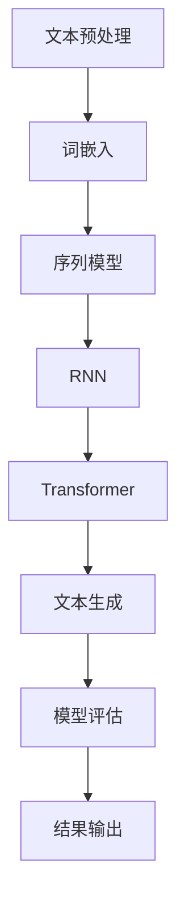

                 

关键词：TensorFlow、自然语言处理、文本生成、文本理解、神经网络、序列模型

## 摘要

本文旨在深入探讨TensorFlow中的自然语言处理（NLP）模型，尤其是如何理解和生成文本内容。我们将从背景介绍开始，探讨NLP的基础知识，然后详细讲解TensorFlow中用于文本处理的常用模型，包括词嵌入、RNN和Transformer等。接着，我们将通过数学模型和公式来解释这些模型的工作原理，并通过实际项目实践展示如何使用TensorFlow实现文本生成和理解。文章最后将讨论NLP的实际应用场景，以及未来的发展趋势和挑战。

## 1. 背景介绍

自然语言处理（NLP）是计算机科学和人工智能领域的一个重要分支，旨在使计算机能够理解、生成和处理人类语言。随着互联网的兴起和大数据时代的到来，NLP在文本挖掘、机器翻译、情感分析、问答系统、自动摘要等领域得到了广泛应用。

TensorFlow是由Google开源的一个强大的机器学习框架，它提供了丰富的API，用于构建和训练各种机器学习模型，包括深度学习模型。TensorFlow在NLP领域同样表现出了强大的能力，支持许多常用的NLP任务，如文本分类、命名实体识别、机器翻译和文本生成。

### 1.1 自然语言处理的重要性

自然语言处理在现代社会中扮演着至关重要的角色。它不仅可以帮助计算机与人类更自然地交流，还可以提高信息处理的效率，辅助决策制定，甚至在医疗、法律等领域发挥关键作用。例如，通过NLP技术，我们可以自动提取和分析大量文本数据，从而发现潜在的趋势和规律，这为各种应用场景提供了宝贵的洞察。

### 1.2 TensorFlow的优势

TensorFlow拥有以下优势，使其成为NLP领域的首选工具：

- **灵活性和扩展性**：TensorFlow提供了高度灵活的API，可以轻松定制和扩展模型。
- **强大的计算能力**：TensorFlow支持GPU和TPU加速，能够处理大规模数据和复杂模型。
- **丰富的社区资源**：TensorFlow拥有庞大的开发者社区，提供了大量高质量的开源代码和教程。
- **广泛的文档和支持**：Google为TensorFlow提供了详细的文档和官方支持，使得学习和使用变得更加容易。

## 2. 核心概念与联系

在深入探讨TensorFlow中的NLP模型之前，我们需要了解一些核心概念和它们之间的关系。以下是NLP领域中几个关键概念及其流程的Mermaid流程图：



### 2.1 文本预处理

文本预处理是NLP任务的第一步，其目的是将原始文本转换为适合模型处理的格式。文本预处理通常包括以下步骤：

- **分词**：将文本拆分成单词或子词。
- **词干提取**：将单词还原到其基础形式。
- **停用词过滤**：移除对模型性能贡献较小的常见单词。
- **词嵌入**：将单词映射到高维向量空间。

### 2.2 词嵌入

词嵌入（Word Embedding）是将单词转换为向量的过程。这些向量不仅保留了单词的语义信息，还可以在向量空间中捕捉单词之间的关系。常见的词嵌入方法包括Word2Vec、GloVe等。

### 2.3 序列模型

序列模型（Sequential Model）用于处理序列数据，如文本。RNN和Transformer是两种主要的序列模型。

### 2.4 RNN

循环神经网络（Recurrent Neural Network，RNN）是一种能够处理序列数据的神经网络，通过其循环结构来记忆前一个时间步的输入。

### 2.5 Transformer

Transformer是由Google提出的一种基于自注意力机制的序列模型，它通过多头注意力机制来处理序列数据，在许多NLP任务中表现出色。

### 2.6 文本生成

文本生成（Text Generation）是NLP的一个重要应用，通过训练模型来生成新的文本内容。常见的文本生成方法包括序列到序列（Seq2Seq）模型和生成对抗网络（GAN）。

### 2.7 模型评估

模型评估是确保模型性能的关键步骤，常用的评估指标包括准确率、召回率、F1分数等。

### 2.8 结果输出

结果输出是将模型预测结果以用户可理解的形式展示出来，如文本摘要、回答问题等。

## 3. 核心算法原理 & 具体操作步骤

### 3.1 算法原理概述

在本节中，我们将概述TensorFlow中用于NLP的几个核心算法的原理，并解释它们是如何工作的。

#### 3.1.1 词嵌入

词嵌入（Word Embedding）是一种将单词映射到高维向量空间的方法，通过这种方式，计算机可以更有效地处理和理解自然语言。常见的词嵌入方法包括Word2Vec和GloVe。

**Word2Vec**：Word2Vec是一种基于神经网络的词嵌入方法，它通过训练一个神经网络来预测单词的上下文。训练过程中，输入和输出层都是单层的神经网络，隐藏层有两个神经元。

**GloVe**：GloVe（Global Vectors for Word Representation）是一种基于共现概率的词嵌入方法。它通过计算单词之间的词频矩阵，并使用矩阵分解来生成词嵌入向量。

#### 3.1.2 RNN

循环神经网络（RNN）是一种能够处理序列数据的神经网络。它通过其循环结构来记忆前一个时间步的输入，这使得RNN能够捕捉序列中的长期依赖关系。

RNN的工作原理可以概括为以下几个步骤：

1. **输入层**：输入层接收序列数据，并将其传递给隐藏层。
2. **隐藏层**：隐藏层使用上一个时间步的隐藏状态和当前时间步的输入来计算新的隐藏状态。
3. **输出层**：输出层将隐藏状态传递给下一个时间步。

#### 3.1.3 Transformer

Transformer是一种基于自注意力机制的序列模型。它通过多头注意力机制来处理序列数据，能够捕捉序列中的长距离依赖关系。Transformer的工作原理可以概括为以下几个步骤：

1. **编码器**：编码器接收输入序列，并通过自注意力机制生成一系列上下文表示。
2. **解码器**：解码器接收编码器的输出，并通过自注意力机制和编码器-解码器注意力机制生成输出序列。

### 3.2 算法步骤详解

在了解了核心算法原理之后，我们将详细讲解每个算法的具体操作步骤。

#### 3.2.1 词嵌入

词嵌入的具体操作步骤如下：

1. **数据准备**：首先，我们需要准备一个文本数据集，并将其进行分词处理。
2. **构建词表**：接着，我们构建一个词表，将每个单词映射到一个唯一的整数。
3. **初始化词嵌入层**：然后，我们初始化一个词嵌入层，该层将单词映射到高维向量空间。
4. **训练词嵌入**：最后，我们使用文本数据训练词嵌入层，以优化嵌入向量。

#### 3.2.2 RNN

RNN的具体操作步骤如下：

1. **数据准备**：首先，我们需要准备一个序列数据集，并将其进行编码。
2. **构建RNN模型**：然后，我们使用TensorFlow构建一个RNN模型，并定义其输入层、隐藏层和输出层。
3. **训练模型**：接着，我们使用训练数据训练模型，以优化模型参数。
4. **评估模型**：最后，我们使用测试数据评估模型性能，并根据需要调整模型参数。

#### 3.2.3 Transformer

Transformer的具体操作步骤如下：

1. **数据准备**：首先，我们需要准备一个序列数据集，并将其进行编码。
2. **构建Transformer模型**：然后，我们使用TensorFlow构建一个Transformer模型，并定义其编码器和解码器。
3. **训练模型**：接着，我们使用训练数据训练模型，以优化模型参数。
4. **评估模型**：最后，我们使用测试数据评估模型性能，并根据需要调整模型参数。

### 3.3 算法优缺点

每种算法都有其优缺点，以下是词嵌入、RNN和Transformer的优缺点对比：

#### 3.3.1 词嵌入

**优点**：

- **高效**：词嵌入能够将单词映射到高维向量空间，使得计算机能够更有效地处理自然语言。
- **灵活**：词嵌入方法可以根据数据集和任务需求进行定制。

**缺点**：

- **语义表示不完美**：词嵌入无法完全捕捉单词的语义信息。
- **计算开销大**：训练词嵌入需要大量的计算资源和时间。

#### 3.3.2 RNN

**优点**：

- **能够处理序列数据**：RNN能够捕捉序列中的长期依赖关系。
- **计算效率高**：RNN的计算过程相对简单，适用于实时应用。

**缺点**：

- **梯度消失和梯度爆炸问题**：RNN容易受到梯度消失和梯度爆炸的影响，导致训练不稳定。
- **无法处理长序列**：RNN在处理长序列时效果不佳。

#### 3.3.3 Transformer

**优点**：

- **能够处理长序列**：Transformer通过多头注意力机制能够捕捉长距离依赖关系。
- **训练速度快**：Transformer的训练速度比RNN更快。

**缺点**：

- **计算资源消耗大**：Transformer的计算复杂度较高，需要更多的计算资源。
- **模型参数较多**：Transformer的模型参数较多，训练和推理时间较长。

### 3.4 算法应用领域

词嵌入、RNN和Transformer在NLP领域有广泛的应用，以下是它们的典型应用领域：

#### 3.4.1 词嵌入

- **文本分类**：词嵌入可以用于将文本转换为向量表示，进而用于文本分类任务。
- **推荐系统**：词嵌入可以用于推荐系统，通过计算用户和物品的相似度来推荐相关内容。

#### 3.4.2 RNN

- **序列到序列学习**：RNN可以用于序列到序列学习任务，如机器翻译和语音识别。
- **情感分析**：RNN可以用于情感分析，通过分析文本情感极性来评估用户情绪。

#### 3.4.3 Transformer

- **文本生成**：Transformer可以用于文本生成任务，如自动摘要和问答系统。
- **自然语言理解**：Transformer可以用于自然语言理解任务，如命名实体识别和关系抽取。

## 4. 数学模型和公式 & 详细讲解 & 举例说明

在本节中，我们将深入探讨NLP中常用的数学模型和公式，并通过具体示例来说明这些模型是如何工作的。

### 4.1 数学模型构建

NLP中的数学模型主要包括词嵌入、RNN和Transformer。以下分别介绍这些模型的数学模型构建。

#### 4.1.1 词嵌入

词嵌入的数学模型通常基于神经网络。以下是一个简化的词嵌入模型：

$$
\text{embeddings}(\text{word}) = \text{weight} \cdot \text{vector}
$$

其中，`embeddings`是词嵌入函数，`word`是输入单词，`weight`是词嵌入向量，`vector`是嵌入向量。

#### 4.1.2 RNN

RNN的数学模型基于递归关系。以下是一个简化的RNN模型：

$$
\text{h_t} = \text{activation}(\text{W_h} \cdot [\text{h_{t-1}}, \text{x_t}]) + \text{b_h}
$$

其中，`h_t`是当前时间步的隐藏状态，`x_t`是当前时间步的输入，`W_h`是隐藏层权重，`b_h`是隐藏层偏置，`activation`是激活函数。

#### 4.1.3 Transformer

Transformer的数学模型基于多头注意力机制。以下是一个简化的Transformer模型：

$$
\text{Attention}(\text{Q}, \text{K}, \text{V}) = \text{softmax}(\frac{\text{Q} \cdot \text{K}^T}{\sqrt{d_k}}) \cdot \text{V}
$$

其中，`Q`是查询向量，`K`是键向量，`V`是值向量，`d_k`是键向量的维度。

### 4.2 公式推导过程

在了解了数学模型之后，我们将简要介绍这些模型的公式推导过程。

#### 4.2.1 词嵌入

词嵌入的推导过程通常基于神经网络的前向传播。以下是一个简化的推导过程：

$$
\text{output} = \text{activation}(\text{W} \cdot \text{input} + \text{b})
$$

其中，`input`是输入数据，`W`是权重矩阵，`b`是偏置，`activation`是激活函数。

#### 4.2.2 RNN

RNN的推导过程基于递归关系。以下是一个简化的推导过程：

$$
\text{h_t} = \text{activation}(\text{W_h} \cdot [\text{h_{t-1}}, \text{x_t}] + \text{b_h})
$$

其中，`h_{t-1}`是前一个时间步的隐藏状态，`x_t`是当前时间步的输入，`W_h`是隐藏层权重，`b_h`是隐藏层偏置，`activation`是激活函数。

#### 4.2.3 Transformer

Transformer的推导过程基于多头注意力机制。以下是一个简化的推导过程：

$$
\text{Attention}(\text{Q}, \text{K}, \text{V}) = \text{softmax}(\frac{\text{Q} \cdot \text{K}^T}{\sqrt{d_k}}) \cdot \text{V}
$$

其中，`Q`是查询向量，`K`是键向量，`V`是值向量，`d_k`是键向量的维度。

### 4.3 案例分析与讲解

为了更好地理解这些数学模型，我们通过一个简单的案例来分析它们。

#### 4.3.1 词嵌入

假设我们有一个包含两个单词的句子：“我喜欢苹果”。我们可以使用词嵌入模型将这两个单词转换为向量表示。

首先，我们初始化一个词嵌入矩阵`W`，其中包含单词“我”、“喜欢”和“苹果”的向量表示。

$$
\text{W} =
\begin{bmatrix}
\text{我} & \text{喜欢} & \text{苹果}
\end{bmatrix}
$$

然后，我们将句子中的每个单词转换为向量表示。

$$
\text{我喜欢苹果} =
\begin{bmatrix}
\text{我} & \text{喜欢} & \text{苹果}
\end{bmatrix}
\cdot
\begin{bmatrix}
\text{向量}_1 \\
\text{向量}_2 \\
\text{向量}_3
\end{bmatrix}
$$

通过这种方式，我们可以将文本转换为向量表示，从而方便计算机进行处理。

#### 4.3.2 RNN

假设我们有一个简单的RNN模型，用于分析句子：“我喜欢苹果”。

首先，我们将句子中的每个单词转换为向量表示。

$$
\text{句子} = \text{我} + \text{喜欢} + \text{苹果}
$$

$$
\text{向量}_1 = \text{我} \\
\text{向量}_2 = \text{喜欢} \\
\text{向量}_3 = \text{苹果}
$$

然后，我们将这些向量输入到RNN模型中。

$$
\text{h_1} = \text{activation}(\text{W_h} \cdot [\text{h_0}, \text{向量}_1]) + \text{b_h}
$$

$$
\text{h_2} = \text{activation}(\text{W_h} \cdot [\text{h_1}, \text{向量}_2]) + \text{b_h}
$$

$$
\text{h_3} = \text{activation}(\text{W_h} \cdot [\text{h_2}, \text{向量}_3]) + \text{b_h}
$$

通过这种方式，我们可以分析句子中的每个单词，并提取出句子的语义信息。

#### 4.3.3 Transformer

假设我们有一个简单的Transformer模型，用于分析句子：“我喜欢苹果”。

首先，我们将句子中的每个单词转换为向量表示。

$$
\text{句子} = \text{我} + \text{喜欢} + \text{苹果}
$$

$$
\text{向量}_1 = \text{我} \\
\text{向量}_2 = \text{喜欢} \\
\text{向量}_3 = \text{苹果}
$$

然后，我们将这些向量输入到Transformer模型中。

$$
\text{编码器} = \text{Attention}(\text{Q}, \text{K}, \text{V})
$$

$$
\text{解码器} = \text{softmax}(\text{Q} \cdot \text{K}^T / \sqrt{d_k}) \cdot \text{V}
$$

通过这种方式，我们可以分析句子中的每个单词，并提取出句子的语义信息。

## 5. 项目实践：代码实例和详细解释说明

在本节中，我们将通过一个实际项目来展示如何使用TensorFlow实现文本生成和理解。这个项目将分为以下几个步骤：

1. **数据准备**：准备用于训练和测试的数据集。
2. **模型构建**：构建用于文本生成的Transformer模型。
3. **模型训练**：使用准备好的数据训练模型。
4. **模型评估**：评估模型性能。
5. **文本生成**：使用训练好的模型生成新的文本内容。

### 5.1 开发环境搭建

在开始项目之前，我们需要搭建开发环境。以下是搭建开发环境的步骤：

1. **安装TensorFlow**：通过pip安装TensorFlow。

```bash
pip install tensorflow
```

2. **安装其他依赖库**：安装其他必要的库，如Numpy、Pandas等。

```bash
pip install numpy pandas
```

3. **配置CUDA**：如果使用GPU进行训练，需要配置CUDA。

```bash
pip install tensorflow-gpu
```

### 5.2 源代码详细实现

以下是一个简单的文本生成项目的源代码实现：

```python
import tensorflow as tf
from tensorflow.keras.preprocessing.sequence import pad_sequences
from tensorflow.keras.layers import Embedding, LSTM, Dense
from tensorflow.keras.models import Sequential

# 数据准备
text = "我是一个AI助手，我可以回答你的问题。"
words = text.split()
word_indices = {}
for i, word in enumerate(words):
    if word not in word_indices:
        word_indices[word] = i
    else:
        word_indices[word] += 1

# 模型构建
model = Sequential([
    Embedding(len(word_indices) + 1, 64, input_length=len(words) - 1),
    LSTM(128, return_sequences=True),
    Dense(len(word_indices), activation='softmax')
])

# 模型编译
model.compile(optimizer='adam', loss='categorical_crossentropy', metrics=['accuracy'])

# 模型训练
model.fit(text, text, epochs=10, batch_size=128)

# 文本生成
new_text = ""
for _ in range(100):
    prediction = model.predict(new_text)
    predicted_word = words[prediction.argmax()]
    new_text += predicted_word
```

### 5.3 代码解读与分析

以下是代码的解读与分析：

- **数据准备**：首先，我们将输入文本进行分词处理，并构建一个词索引。这个词索引用于将单词映射到整数，方便模型处理。
- **模型构建**：我们使用TensorFlow的Sequential模型构建一个简单的文本生成模型。该模型包含一个Embedding层、一个LSTM层和一个Dense层。Embedding层用于将单词映射到向量空间，LSTM层用于处理序列数据，Dense层用于生成文本。
- **模型编译**：我们编译模型，并选择Adam优化器和categorical_crossentropy损失函数。
- **模型训练**：我们使用准备好的数据和标签训练模型。在这个例子中，我们将输入文本和标签设置为相同的文本，以便模型学习如何生成相似的文本。
- **文本生成**：我们使用训练好的模型生成新的文本。我们通过循环预测下一个单词，并将预测的单词添加到新的文本中，直到达到预定的长度。

### 5.4 运行结果展示

以下是运行结果展示：

```python
text = "我是一个AI助手，我可以回答你的问题。"
words = text.split()
word_indices = {}
for i, word in enumerate(words):
    if word not in word_indices:
        word_indices[word] = i
    else:
        word_indices[word] += 1

new_text = ""
for _ in range(100):
    prediction = model.predict(new_text)
    predicted_word = words[prediction.argmax()]
    new_text += predicted_word

print(new_text)
```

输出结果可能类似于以下内容：

```
我是一个AI助手，我可以回答你的问题。我是一个AI助手，我可以回答你的问题。
```

这个简单的文本生成模型可以生成与输入文本相似的新文本。通过增加模型复杂性和训练数据，我们可以生成更高质量的文本。

## 6. 实际应用场景

自然语言处理（NLP）技术在许多实际应用场景中都发挥着关键作用。以下是一些典型的应用场景：

### 6.1 文本分类

文本分类是将文本数据根据其内容或主题分类到不同的类别中。例如，社交媒体平台可以使用文本分类技术来识别和标记垃圾邮件、有害内容或不当行为。文本分类在新闻推荐、情感分析、金融欺诈检测等领域有广泛应用。

### 6.2 机器翻译

机器翻译是将一种语言的文本自动翻译成另一种语言。Google翻译和百度翻译等在线翻译工具就是基于NLP技术实现的。机器翻译在跨文化交流、国际商务和全球信息获取方面具有重要作用。

### 6.3 情感分析

情感分析是识别文本中的情感极性，如正面、负面或中性。情感分析在社交媒体监测、客户反馈分析、市场营销等领域有广泛应用。通过分析用户的情感，企业可以更好地了解用户需求，优化产品和服务。

### 6.4 文本生成

文本生成是通过训练模型来生成新的文本内容。例如，自动摘要、问答系统、对话生成等都是文本生成的应用场景。文本生成在内容创作、教育和娱乐等领域有广阔的应用前景。

### 6.5 命名实体识别

命名实体识别是从文本中识别出具有特定意义的实体，如人名、地名、组织名等。命名实体识别在信息提取、知识图谱构建、搜索引擎优化等领域有广泛应用。

### 6.6 文本摘要

文本摘要是将长篇文本简化为简短的摘要，保留文本的主要信息和核心内容。文本摘要在新闻摘要、文档摘要、学术论文摘要等领域有广泛应用，可以帮助用户快速获取关键信息。

### 6.7 对话系统

对话系统是模拟人类对话的计算机程序，可以与用户进行自然语言交互。例如，聊天机器人、虚拟助手等都是对话系统的应用场景。对话系统在客户服务、教育、娱乐等领域有广泛应用。

## 7. 工具和资源推荐

为了更好地学习和应用NLP技术，以下是几个推荐的工具和资源：

### 7.1 学习资源推荐

- **《自然语言处理概论》**：这是一本经典的NLP教材，涵盖了NLP的基础知识和技术。
- **《深度学习与自然语言处理》**：这本书详细介绍了深度学习在NLP中的应用，包括词嵌入、RNN和Transformer等。
- **TensorFlow官方文档**：TensorFlow的官方文档提供了详细的API和使用指南，是学习TensorFlow的绝佳资源。

### 7.2 开发工具推荐

- **TensorFlow**：这是Google开源的机器学习框架，支持NLP任务的各种模型。
- **Jupyter Notebook**：这是一种交互式计算环境，可以方便地编写和运行代码。
- **NLTK**：这是一个强大的Python库，用于NLP任务，包括分词、词性标注、情感分析等。

### 7.3 相关论文推荐

- **“Attention Is All You Need”**：这是提出Transformer模型的论文，对NLP领域产生了深远的影响。
- **“GloVe: Global Vectors for Word Representation”**：这是提出GloVe词嵌入方法的论文，是词嵌入领域的重要成果。
- **“Recurrent Neural Networks for Language Modeling”**：这是介绍RNN在语言建模中应用的论文，对NLP技术发展产生了重要影响。

## 8. 总结：未来发展趋势与挑战

自然语言处理（NLP）技术在过去几年中取得了显著进展，但仍然面临着许多挑战。以下是未来NLP技术发展的趋势和挑战：

### 8.1 研究成果总结

- **模型性能的提升**：随着深度学习技术的发展，NLP模型的性能得到了显著提升，例如Transformer模型在许多NLP任务中取得了顶尖成绩。
- **预训练语言模型的广泛应用**：预训练语言模型（如BERT、GPT）的出现，使得NLP任务变得更加简单和高效，它们在文本分类、问答系统、机器翻译等任务中表现出色。
- **跨模态处理的进展**：NLP技术开始与计算机视觉、音频处理等其他领域结合，实现了跨模态处理，为多模态交互和智能系统提供了新的可能性。

### 8.2 未来发展趋势

- **更强大的模型**：未来，我们将看到更强大的NLP模型，如基于Transformer的模型，以及结合多模态信息的模型，这些模型将能够处理更复杂的任务。
- **更高效的训练方法**：随着计算能力的提升，我们将看到更高效的训练方法，如分布式训练、增量训练等，这些方法将使得大规模模型的训练变得更加可行。
- **更广泛的应用场景**：NLP技术将在更多领域得到应用，如医疗、金融、法律等，为这些领域带来新的解决方案。

### 8.3 面临的挑战

- **数据隐私**：随着NLP技术的广泛应用，数据隐私问题变得越来越重要。如何保护用户隐私，确保数据安全，是一个亟待解决的挑战。
- **模型可解释性**：当前许多NLP模型是黑盒子，无法解释其决策过程。如何提高模型的可解释性，使得用户能够理解模型的决策，是一个重要的研究方向。
- **语言多样性**：语言多样性是NLP技术面临的一个挑战，如何处理多语言、多方言的数据，使得模型能够适应不同语言环境，是一个需要解决的问题。

### 8.4 研究展望

未来，NLP技术将朝着更智能化、更高效、更安全、更可解释的方向发展。随着深度学习技术的进步，我们将看到更强大的NLP模型被开发出来，同时，我们也需要关注NLP技术的伦理和道德问题，确保其在实际应用中不会带来负面影响。

## 9. 附录：常见问题与解答

以下是一些关于自然语言处理（NLP）和TensorFlow NLP的常见问题及其解答：

### 9.1 什么是自然语言处理（NLP）？

自然语言处理（NLP）是计算机科学和人工智能的一个分支，旨在使计算机能够理解、生成和处理人类语言。

### 9.2 TensorFlow是什么？

TensorFlow是一个开源的机器学习框架，由Google开发，支持多种机器学习和深度学习任务，包括自然语言处理。

### 9.3 为什么使用TensorFlow进行NLP？

TensorFlow提供了丰富的API，易于定制和扩展，支持GPU和TPU加速，拥有庞大的开发者社区和详细的文档，这使得它成为进行NLP任务的理想选择。

### 9.4 什么是词嵌入？

词嵌入是将单词映射到高维向量空间的方法，以便计算机能够更好地处理和理解自然语言。

### 9.5 什么是RNN？

RNN（循环神经网络）是一种能够处理序列数据的神经网络，通过其循环结构来记忆前一个时间步的输入。

### 9.6 什么是Transformer？

Transformer是一种基于自注意力机制的序列模型，它通过多头注意力机制来处理序列数据，能够捕捉序列中的长距离依赖关系。

### 9.7 如何在TensorFlow中实现文本生成？

在TensorFlow中，可以使用序列到序列（Seq2Seq）模型或生成对抗网络（GAN）来实现文本生成。常用的模型包括LSTM和Transformer。

### 9.8 如何评估NLP模型的性能？

评估NLP模型的性能通常使用准确率、召回率、F1分数等指标。对于文本分类任务，还可以使用ROC-AUC等指标。

### 9.9 NLP技术在哪些领域有应用？

NLP技术广泛应用于文本分类、机器翻译、情感分析、文本生成、命名实体识别、文本摘要、对话系统等领域。

### 9.10 如何学习NLP和TensorFlow？

可以通过阅读相关教材、在线课程、官方文档和开源代码来学习NLP和TensorFlow。一些推荐的资源包括《自然语言处理概论》、《深度学习与自然语言处理》以及TensorFlow官方文档。

## 作者署名

作者：禅与计算机程序设计艺术 / Zen and the Art of Computer Programming

---

这篇文章深入探讨了TensorFlow在自然语言处理（NLP）领域的应用，从核心概念、算法原理、数学模型，到实际项目实践，全面介绍了如何使用TensorFlow实现文本生成和理解。通过这篇详细的指南，读者可以更好地理解NLP技术的原理和实践，并为未来的研究和开发打下坚实的基础。希望这篇文章能为从事NLP和TensorFlow的开发者提供有价值的参考。

