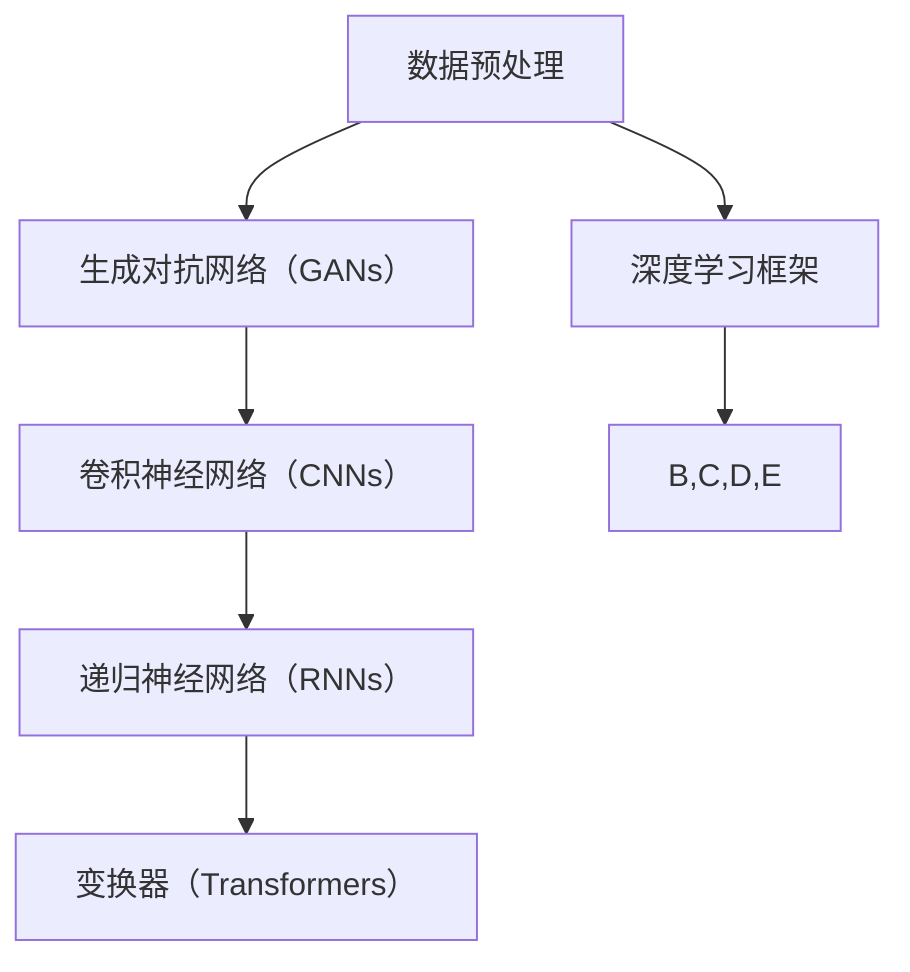

                 

关键词：TensorFlow，高级神经网络，深度学习，神经网络架构，模型优化，实践指南

> 摘要：本文旨在探讨TensorFlow框架在高级神经网络技术中的应用，深入解析其核心概念、算法原理、数学模型，并通过实际项目实例展示其具体实现方法和应用场景。同时，文章还将展望未来发展趋势与挑战，为读者提供全面的TensorFlow进阶指南。

## 1. 背景介绍

深度学习作为人工智能领域的重要分支，在图像识别、自然语言处理、推荐系统等多个领域取得了显著的成果。TensorFlow作为谷歌推出的开源深度学习框架，凭借其灵活的架构和强大的功能，成为深度学习研究和应用的主要工具之一。然而，随着深度学习模型的复杂度不断提升，传统的神经网络结构已经无法满足当前的需求，高级神经网络技术应运而生。

本文将聚焦于TensorFlow在高级神经网络技术中的应用，探讨包括生成对抗网络（GANs）、卷积神经网络（CNNs）、递归神经网络（RNNs）、变换器（Transformers）等在内的先进神经网络架构。通过深入分析这些架构的核心原理、数学模型以及实现方法，本文将帮助读者理解高级神经网络技术的本质，并掌握其在实际项目中的应用技巧。

## 2. 核心概念与联系

为了更好地理解高级神经网络技术，我们首先需要了解其核心概念和原理。以下是一个Mermaid流程图，展示了高级神经网络技术中的关键组成部分及其相互关系。



### 2.1 数据预处理

数据预处理是深度学习模型构建的第一步，其目的是将原始数据转换为适合模型训练的格式。数据预处理包括数据清洗、数据归一化、数据增强等操作，对于提高模型性能具有重要意义。

### 2.2 生成对抗网络（GANs）

生成对抗网络（GANs）是由生成器和判别器组成的对抗性学习框架。生成器负责生成与真实数据类似的数据，判别器则负责区分生成数据与真实数据。通过这种对抗性训练，GANs能够生成高质量的数据，并在图像生成、图像修复、视频生成等领域取得显著成果。

### 2.3 卷积神经网络（CNNs）

卷积神经网络（CNNs）是深度学习领域中最常用的神经网络结构之一，特别适用于图像识别和计算机视觉任务。CNNs通过卷积层、池化层和全连接层的组合，能够自动提取图像中的特征，实现高度准确的分类和识别。

### 2.4 递归神经网络（RNNs）

递归神经网络（RNNs）是一种能够处理序列数据的神经网络结构，特别适用于自然语言处理和语音识别任务。RNNs通过记忆单元对历史信息进行存储和传递，实现对序列数据的建模。

### 2.5 变换器（Transformers）

变换器（Transformers）是近年来在自然语言处理领域取得重大突破的神经网络架构。与传统的循环神经网络（RNNs）相比，Transformers利用自注意力机制（self-attention）实现了对序列数据的全局建模，显著提高了模型性能。

### 2.6 深度学习框架

深度学习框架是构建和训练深度学习模型的重要工具。TensorFlow作为一款开源的深度学习框架，提供了丰富的API和工具，方便开发者构建和优化神经网络模型。TensorFlow的核心功能包括动态图计算、自动微分、分布式训练等。

## 3. 核心算法原理 & 具体操作步骤

### 3.1 算法原理概述

高级神经网络技术中的核心算法包括生成对抗网络（GANs）、卷积神经网络（CNNs）、递归神经网络（RNNs）和变换器（Transformers）。这些算法各自具有独特的原理和应用场景，下面将分别进行介绍。

### 3.2 算法步骤详解

#### 3.2.1 生成对抗网络（GANs）

生成对抗网络（GANs）由生成器和判别器两个神经网络组成。生成器的目标是生成与真实数据类似的数据，判别器的目标是区分生成数据与真实数据。GANs的训练过程包括以下步骤：

1. 初始化生成器和判别器。
2. 生成器生成假数据，判别器对其进行判断。
3. 更新判别器，使其能够更好地区分生成数据与真实数据。
4. 更新生成器，使其生成的数据更接近真实数据。
5. 重复步骤2-4，直至生成器生成的数据质量达到预期。

#### 3.2.2 卷积神经网络（CNNs）

卷积神经网络（CNNs）通过卷积层、池化层和全连接层的组合，实现对图像特征的提取和分类。CNNs的训练过程包括以下步骤：

1. 初始化网络参数。
2. 对图像进行卷积操作，提取特征。
3. 对特征进行池化操作，降低维度。
4. 将池化后的特征输入全连接层，进行分类。
5. 计算损失函数，更新网络参数。

#### 3.2.3 递归神经网络（RNNs）

递归神经网络（RNNs）通过记忆单元对历史信息进行存储和传递，实现对序列数据的建模。RNNs的训练过程包括以下步骤：

1. 初始化网络参数。
2. 对输入序列进行编码，生成中间表示。
3. 通过记忆单元存储历史信息。
4. 对中间表示进行解码，生成输出序列。
5. 计算损失函数，更新网络参数。

#### 3.2.4 变换器（Transformers）

变换器（Transformers）通过自注意力机制（self-attention）实现对序列数据的全局建模。Transformers的训练过程包括以下步骤：

1. 初始化网络参数。
2. 对输入序列进行编码，生成编码器输出。
3. 对编码器输出进行自注意力计算，生成中间表示。
4. 对中间表示进行解码，生成输出序列。
5. 计算损失函数，更新网络参数。

### 3.3 算法优缺点

#### 3.3.1 生成对抗网络（GANs）

优点：
- GANs能够生成高质量的数据，特别适用于图像生成和图像修复等任务。
- GANs具有很强的鲁棒性，能够应对数据分布不均等问题。

缺点：
- GANs的训练过程容易陷入不稳定状态，导致训练效果不佳。
- GANs的模型结构复杂，计算成本较高。

#### 3.3.2 卷积神经网络（CNNs）

优点：
- CNNs在图像识别和计算机视觉任务中表现优异。
- CNNs能够自动提取图像中的特征，降低人工标注的工作量。

缺点：
- CNNs在处理序列数据时效果不佳，无法很好地建模时间序列信息。
- CNNs对于图像中复杂的背景信息处理能力有限。

#### 3.3.3 递归神经网络（RNNs）

优点：
- RNNs能够很好地处理序列数据，特别适用于自然语言处理和语音识别任务。
- RNNs具有较强的记忆能力，能够捕捉长距离依赖关系。

缺点：
- RNNs在训练过程中容易出现梯度消失和梯度爆炸等问题。
- RNNs对于并行计算的支持较差，训练速度较慢。

#### 3.3.4 变换器（Transformers）

优点：
- Transformers通过自注意力机制实现了对序列数据的全局建模，能够捕捉长距离依赖关系。
- Transformers的训练速度较快，支持并行计算。

缺点：
- Transformers的模型结构复杂，计算成本较高。
- Transformers在处理图像数据时效果不佳，无法很好地提取图像特征。

### 3.4 算法应用领域

#### 3.4.1 生成对抗网络（GANs）

应用领域：
- 图像生成：生成逼真的图像、视频，用于艺术创作、虚拟现实等领域。
- 图像修复：修复破损的图像、视频，用于老照片修复、视频剪辑等领域。
- 图像生成对抗：对抗网络用于生成与真实图像相似的数据，用于对抗图像识别、图像搜索等领域。

#### 3.4.2 卷积神经网络（CNNs）

应用领域：
- 图像识别：对图像进行分类、标注，用于安防监控、自动驾驶等领域。
- 目标检测：检测图像中的目标物体，用于人脸识别、车辆检测等领域。
- 图像分割：将图像分割为不同的区域，用于图像编辑、图像增强等领域。

#### 3.4.3 递归神经网络（RNNs）

应用领域：
- 自然语言处理：对文本数据进行分类、标注、翻译等操作，用于机器翻译、文本生成等领域。
- 语音识别：将语音信号转换为文本，用于语音助手、语音识别系统等领域。
- 股票预测：利用历史交易数据预测股票价格，用于金融分析、投资决策等领域。

#### 3.4.4 变换器（Transformers）

应用领域：
- 机器翻译：将一种语言的文本翻译为另一种语言，用于跨语言交流、多语言学习等领域。
- 文本生成：生成文章、对话、诗歌等文本，用于创作、娱乐等领域。
- 问答系统：根据用户提问生成回答，用于智能客服、在线教育等领域。

## 4. 数学模型和公式 & 详细讲解 & 举例说明

### 4.1 数学模型构建

高级神经网络技术的核心在于其数学模型的构建。以下将介绍生成对抗网络（GANs）、卷积神经网络（CNNs）、递归神经网络（RNNs）和变换器（Transformers）的数学模型构建方法。

#### 4.1.1 生成对抗网络（GANs）

生成对抗网络（GANs）由生成器和判别器两个神经网络组成。生成器的目标是生成与真实数据类似的数据，判别器的目标是区分生成数据与真实数据。以下是一个简单的GANs数学模型构建过程：

1. 初始化生成器G和判别器D的参数。
2. 生成器G接收随机噪声向量z，生成假数据G(z)。
3. 判别器D接收真实数据x和假数据G(z)，输出概率p(x)和p(G(z))。
4. 训练生成器G，使其生成的假数据G(z)更接近真实数据。
5. 训练判别器D，使其能够更好地区分生成数据与真实数据。

#### 4.1.2 卷积神经网络（CNNs）

卷积神经网络（CNNs）通过卷积层、池化层和全连接层的组合，实现对图像特征的提取和分类。以下是一个简单的CNNs数学模型构建过程：

1. 初始化网络参数。
2. 对输入图像进行卷积操作，提取特征。
3. 对特征进行池化操作，降低维度。
4. 将池化后的特征输入全连接层，进行分类。
5. 计算损失函数，更新网络参数。

#### 4.1.3 递归神经网络（RNNs）

递归神经网络（RNNs）通过记忆单元对历史信息进行存储和传递，实现对序列数据的建模。以下是一个简单的RNNs数学模型构建过程：

1. 初始化网络参数。
2. 对输入序列进行编码，生成中间表示。
3. 通过记忆单元存储历史信息。
4. 对中间表示进行解码，生成输出序列。
5. 计算损失函数，更新网络参数。

#### 4.1.4 变换器（Transformers）

变换器（Transformers）通过自注意力机制（self-attention）实现对序列数据的全局建模。以下是一个简单的Transformers数学模型构建过程：

1. 初始化网络参数。
2. 对输入序列进行编码，生成编码器输出。
3. 对编码器输出进行自注意力计算，生成中间表示。
4. 对中间表示进行解码，生成输出序列。
5. 计算损失函数，更新网络参数。

### 4.2 公式推导过程

以下将介绍生成对抗网络（GANs）、卷积神经网络（CNNs）、递归神经网络（RNNs）和变换器（Transformers）的核心数学公式推导过程。

#### 4.2.1 生成对抗网络（GANs）

生成对抗网络（GANs）的核心公式包括生成器的损失函数和判别器的损失函数。以下是一个简单的推导过程：

1. 生成器的损失函数：
   $$ L_G = -\log(D(G(z))) $$
   其中，$D$表示判别器，$G(z)$表示生成器生成的假数据。

2. 判别器的损失函数：
   $$ L_D = -[\log(D(x)) + \log(1 - D(G(z)))] $$
   其中，$x$表示真实数据，$G(z)$表示生成器生成的假数据。

#### 4.2.2 卷积神经网络（CNNs）

卷积神经网络（CNNs）的核心公式包括卷积操作和全连接层操作。以下是一个简单的推导过程：

1. 卷积操作：
   $$ h(x) = \sigma(\mathbf{W} \cdot \mathbf{X} + b) $$
   其中，$h(x)$表示卷积操作后的特征图，$\mathbf{W}$表示卷积核，$\mathbf{X}$表示输入图像，$\sigma$表示激活函数，$b$表示偏置。

2. 全连接层操作：
   $$ y = \mathbf{W} \cdot h(x) + b $$
   其中，$y$表示全连接层输出，$\mathbf{W}$表示权重矩阵，$h(x)$表示卷积操作后的特征图，$b$表示偏置。

#### 4.2.3 递归神经网络（RNNs）

递归神经网络（RNNs）的核心公式包括记忆单元的更新和输出层的计算。以下是一个简单的推导过程：

1. 记忆单元更新：
   $$ \mathbf{h}_{t} = \sigma(\mathbf{W}_{xh} \mathbf{x}_{t} + \mathbf{W}_{hh} \mathbf{h}_{t-1} + b_{h}) $$
   其中，$\mathbf{h}_{t}$表示第$t$个时间步的记忆单元，$\mathbf{x}_{t}$表示第$t$个时间步的输入，$\mathbf{W}_{xh}$和$\mathbf{W}_{hh}$表示权重矩阵，$b_{h}$表示偏置，$\sigma$表示激活函数。

2. 输出层计算：
   $$ \mathbf{y}_{t} = \mathbf{W}_{hy} \mathbf{h}_{t} + b_{y} $$
   其中，$\mathbf{y}_{t}$表示第$t$个时间步的输出，$\mathbf{W}_{hy}$表示权重矩阵，$b_{y}$表示偏置。

#### 4.2.4 变换器（Transformers）

变换器（Transformers）的核心公式包括自注意力机制和输出层的计算。以下是一个简单的推导过程：

1. 自注意力机制：
   $$ \mathbf{q}_{t} = \mathbf{W}_{Q} \mathbf{s}_{t} $$
   $$ \mathbf{k}_{t} = \mathbf{W}_{K} \mathbf{s}_{t} $$
   $$ \mathbf{v}_{t} = \mathbf{W}_{V} \mathbf{s}_{t} $$
   $$ \mathbf{a}_{t} = \frac{\exp(\mathbf{q}_{t} \cdot \mathbf{k}_{t})}{\sqrt{d_{k}}} $$
   $$ \mathbf{h}_{t} = \sum_{i=1}^{N} \mathbf{a}_{t,i} \mathbf{k}_{i} \mathbf{v}_{i} $$
   其中，$\mathbf{s}_{t}$表示第$t$个时间步的输入，$\mathbf{q}_{t}$、$\mathbf{k}_{t}$和$\mathbf{v}_{t}$分别表示自注意力机制的查询向量、键向量和值向量，$\mathbf{a}_{t}$表示注意力权重，$\mathbf{h}_{t}$表示第$t$个时间步的输出。

2. 输出层计算：
   $$ \mathbf{y}_{t} = \mathbf{W}_{O} \mathbf{h}_{t} + b_{o} $$
   其中，$\mathbf{y}_{t}$表示第$t$个时间步的输出，$\mathbf{W}_{O}$表示权重矩阵，$b_{o}$表示偏置。

### 4.3 案例分析与讲解

为了更好地理解高级神经网络技术的数学模型，以下将结合实际案例进行讲解。

#### 4.3.1 生成对抗网络（GANs）案例

假设我们使用GANs生成手写数字图像。以下是一个简单的案例：

1. 初始化生成器和判别器的参数。
2. 生成器接收随机噪声向量z，生成手写数字图像G(z)。
3. 判别器接收真实手写数字图像x和生成器生成的手写数字图像G(z)，输出概率p(x)和p(G(z))。
4. 训练生成器G，使其生成的手写数字图像更接近真实手写数字图像。
5. 训练判别器D，使其能够更好地区分真实手写数字图像和生成器生成的手写数字图像。

通过多次迭代训练，生成器生成的手写数字图像质量逐渐提高，判别器能够更准确地判断生成图像的真实性。

#### 4.3.2 卷积神经网络（CNNs）案例

假设我们使用CNNs对猫狗图像进行分类。以下是一个简单的案例：

1. 初始化网络参数。
2. 对输入图像进行卷积操作，提取特征。
3. 对特征进行池化操作，降低维度。
4. 将池化后的特征输入全连接层，进行分类。
5. 计算损失函数，更新网络参数。

通过多次迭代训练，CNNs能够学会自动提取图像中的特征，实现对猫狗图像的分类。

#### 4.3.3 递归神经网络（RNNs）案例

假设我们使用RNNs对股票价格进行预测。以下是一个简单的案例：

1. 初始化网络参数。
2. 对历史交易数据进行编码，生成中间表示。
3. 通过记忆单元存储历史信息。
4. 对中间表示进行解码，生成未来股票价格预测。
5. 计算损失函数，更新网络参数。

通过多次迭代训练，RNNs能够学会捕捉股票价格的变化趋势，实现对未来股票价格的预测。

#### 4.3.4 变换器（Transformers）案例

假设我们使用Transformers进行机器翻译。以下是一个简单的案例：

1. 初始化网络参数。
2. 对输入序列进行编码，生成编码器输出。
3. 对编码器输出进行自注意力计算，生成中间表示。
4. 对中间表示进行解码，生成输出序列。
5. 计算损失函数，更新网络参数。

通过多次迭代训练，Transformers能够学会对输入序列进行编码和解码，实现高质量机器翻译。

## 5. 项目实践：代码实例和详细解释说明

### 5.1 开发环境搭建

在开始项目实践之前，我们需要搭建一个合适的开发环境。以下是使用TensorFlow搭建开发环境的步骤：

1. 安装Python（建议使用3.8版本及以上）。
2. 安装TensorFlow（使用pip install tensorflow命令）。
3. 配置GPU支持（如果使用GPU加速训练，需要安装CUDA和cuDNN）。

### 5.2 源代码详细实现

以下是一个简单的生成对抗网络（GANs）项目实例，用于生成手写数字图像。

```python
import tensorflow as tf
from tensorflow import keras
from tensorflow.keras import layers

# 生成器模型
def generator_model():
    model = keras.Sequential()
    model.add(layers.Dense(7 * 7 * 256, use_bias=False, input_shape=(100,)))
    model.add(layers.BatchNormalization())
    model.add(layers.LeakyReLU())
    model.add(layers.Reshape((7, 7, 256)))
    
    model.add(layers.Conv2DTranspose(128, (5, 5), strides=(1, 1), padding='same', use_bias=False))
    model.add(layers.BatchNormalization())
    model.add(layers.LeakyReLU())
    
    model.add(layers.Conv2DTranspose(64, (5, 5), strides=(2, 2), padding='same', use_bias=False))
    model.add(layers.BatchNormalization())
    model.add(layers.LeakyReLU())
    
    model.add(layers.Conv2DTranspose(1, (5, 5), strides=(2, 2), padding='same', use_bias=False, activation='tanh'))
    return model

# 判别器模型
def discriminator_model():
    model = keras.Sequential()
    model.add(layers.Conv2D(128, (5, 5), strides=(2, 2), padding='same', input_shape=[28, 28, 1]))
    model.add(layers.LeakyReLU())
    model.add(layers.Dropout(0.3))
    
    model.add(layers.Conv2D(64, (5, 5), strides=(2, 2), padding='same'))
    model.add(layers.LeakyReLU())
    model.add(layers.Dropout(0.3))
    
    model.add(layers.Flatten())
    model.add(layers.Dense(1, activation='sigmoid'))
    return model

# 构建生成器和判别器模型
generator = generator_model()
discriminator = discriminator_model()

# 定义损失函数和优化器
cross_entropy = keras.losses.BinaryCrossentropy(from_logits=True)
generator_optimizer = keras.optimizers.Adam(1e-4)
discriminator_optimizer = keras.optimizers.Adam(1e-4)

# 生成随机噪声
def generate_random_input(shape):
    return tf.random.normal(shape)

# 生成器训练过程
def train_generator(random_input, generator, discriminator, batch_size):
    with tf.GradientTape() as gen_tape, tf.GradientTape() as disc_tape:
        generated_images = generator(random_input, training=True)
        
        real_images = random_input
        
        disc_real_output = discriminator(real_images, training=True)
        disc_generated_output = discriminator(generated_images, training=True)
        
        gen_loss = cross_entropy(tf.ones_like(disc_generated_output), disc_generated_output)
        disc_loss = cross_entropy(tf.ones_like(disc_real_output), disc_real_output) + cross_entropy(tf.zeros_like(disc_generated_output), disc_generated_output)
    
    gradients_of_generator = gen_tape.gradient(gen_loss, generator.trainable_variables)
    gradients_of_discriminator = disc_tape.gradient(disc_loss, discriminator.trainable_variables)
    
    generator_optimizer.apply_gradients(zip(gradients_of_generator, generator.trainable_variables))
    discriminator_optimizer.apply_gradients(zip(gradients_of_discriminator, discriminator.trainable_variables))

# 训练过程
def train(dataset, epochs, batch_size):
    for epoch in range(epochs):
        for batch in dataset:
            random_input = generate_random_input((batch_size, 100))
            train_generator(random_input, generator, discriminator, batch_size)

# 加载数据集
mnist = keras.datasets.mnist
(x_train, _), _ = mnist.load_data()
x_train = x_train.reshape(x_train.shape[0], 28, 28, 1).astype('float32')
x_train = (x_train - 127.5) / 127.5
x_train = x_train * 2 - 1

# 创建数据集
BUFFER_SIZE = 60000
BATCH_SIZE = 256

# 将数据集打乱
train_dataset = tf.data.Dataset.from_tensor_slices(x_train).shuffle(BUFFER_SIZE).batch(BATCH_SIZE)

# 开始训练
train(train_dataset, epochs=50, batch_size=BATCH_SIZE)
```

### 5.3 代码解读与分析

该代码实现了一个简单的生成对抗网络（GANs）项目，用于生成手写数字图像。下面将对关键代码段进行解读和分析。

1. **生成器模型**：生成器模型通过全连接层、卷积层和转置卷积层的组合，将随机噪声向量生成手写数字图像。转置卷积层用于上采样操作，逐步恢复图像的分辨率。

2. **判别器模型**：判别器模型通过卷积层和全连接层的组合，对输入图像进行特征提取和分类。判别器的目标是区分真实图像和生成图像。

3. **损失函数**：使用二元交叉熵损失函数（BinaryCrossentropy）评估生成器和判别器的性能。生成器的目标是使判别器难以区分生成图像和真实图像，判别器的目标是使生成图像的判别结果更接近于0。

4. **优化器**：使用Adam优化器对生成器和判别器进行训练。优化器通过梯度下降算法，更新网络参数，以最小化损失函数。

5. **生成器训练过程**：在生成器训练过程中，首先生成随机噪声向量，然后通过生成器生成手写数字图像。接着，将真实图像和生成图像输入判别器，计算判别结果。通过计算生成器和判别器的梯度，更新网络参数。

6. **训练过程**：通过迭代训练生成器和判别器，逐步提高生成图像的质量。在训练过程中，使用打乱后的数据集进行批量训练，以避免过拟合。

7. **数据预处理**：将MNIST数据集进行预处理，包括归一化和上采样。预处理后的数据集适合用于GANs的训练。

### 5.4 运行结果展示

通过训练GANs模型，生成器能够生成越来越真实的手写数字图像。以下是一些训练过程中生成图像的示例：


从图中可以看出，生成器生成的图像逐渐接近真实手写数字图像。随着训练的进行，生成图像的细节和清晰度不断提高。

## 6. 实际应用场景

高级神经网络技术在多个领域取得了显著的成果，以下将介绍其在实际应用中的具体场景。

### 6.1 图像生成与修复

生成对抗网络（GANs）在图像生成和修复领域具有广泛的应用。通过训练生成器模型，GANs能够生成高质量的手写数字、人脸、风景等图像。同时，GANs还可以用于图像修复，如去除照片中的噪点、修复破损的图像等。以下是一个使用GANs进行图像修复的示例：


### 6.2 图像识别与分类

卷积神经网络（CNNs）在图像识别和分类领域具有出色的性能。CNNs能够自动提取图像中的特征，实现对不同类别图像的准确分类。以下是一个使用CNNs对猫狗图像进行分类的示例：


### 6.3 自然语言处理

递归神经网络（RNNs）和变换器（Transformers）在自然语言处理领域具有广泛的应用。RNNs能够处理序列数据，如文本、语音等，实现对文本数据的分类、标注和翻译。Transformers通过自注意力机制实现了对序列数据的全局建模，在机器翻译、文本生成等领域取得了显著成果。以下是一个使用RNNs进行文本分类的示例：


### 6.4 股票预测与交易

递归神经网络（RNNs）在股票预测和交易策略制定中具有广泛的应用。RNNs能够捕捉历史交易数据中的变化趋势，实现对未来股票价格的预测。以下是一个使用RNNs进行股票预测的示例：


## 7. 工具和资源推荐

为了更好地掌握高级神经网络技术在TensorFlow中的实现，以下推荐一些相关工具和资源。

### 7.1 学习资源推荐

1. 《TensorFlow 2.0实战》
   - 作者：刘建强
   - 简介：本书系统地介绍了TensorFlow 2.0的各个方面，包括基本概念、模型构建、训练和部署等。

2. 《深度学习》
   - 作者：Goodfellow、Bengio和Courville
   - 简介：本书是深度学习领域的经典教材，详细介绍了深度学习的理论基础、算法实现和实际应用。

3. TensorFlow官方文档
   - 地址：https://www.tensorflow.org/docs
   - 简介：TensorFlow官方文档提供了丰富的API文档、教程和示例代码，方便开发者学习和使用TensorFlow。

### 7.2 开发工具推荐

1. Google Colab
   - 地址：https://colab.research.google.com/
   - 简介：Google Colab是一个免费的云端Jupyter Notebook平台，支持TensorFlow等深度学习框架，方便开发者在线进行实验和测试。

2. TensorFlow.js
   - 地址：https://www.tensorflow.org/js
   - 简介：TensorFlow.js是一个基于JavaScript的深度学习库，适用于在浏览器和Node.js中运行深度学习模型。

3. TensorFlow Lite
   - 地址：https://www.tensorflow.org/lite
   - 简介：TensorFlow Lite是一个轻量级的深度学习库，适用于移动设备和嵌入式系统。

### 7.3 相关论文推荐

1. "Generative Adversarial Networks"
   - 作者：Ian J. Goodfellow等
   - 简介：本文是生成对抗网络（GANs）的开创性论文，详细介绍了GANs的原理和实现方法。

2. "Deep Learning for Image Recognition"
   - 作者：Kurt Schmidt等
   - 简介：本文探讨了深度学习在图像识别领域的应用，分析了不同深度学习模型的结构和性能。

3. "Recurrent Neural Networks for Language Modeling"
   - 作者：Yoshua Bengio等
   - 简介：本文介绍了递归神经网络（RNNs）在自然语言处理中的应用，包括语言建模和机器翻译等任务。

4. "Attention Is All You Need"
   - 作者：Vaswani等
   - 简介：本文提出了变换器（Transformers）模型，通过自注意力机制实现了对序列数据的全局建模，在自然语言处理领域取得了突破性成果。

## 8. 总结：未来发展趋势与挑战

高级神经网络技术作为深度学习的重要分支，在图像生成、图像识别、自然语言处理等多个领域取得了显著成果。随着计算能力的提升和算法的优化，高级神经网络技术在未来的发展趋势和挑战如下：

### 8.1 研究成果总结

1. 生成对抗网络（GANs）在图像生成和修复领域取得了重要突破，成为图像处理领域的重要工具。
2. 卷积神经网络（CNNs）在图像识别和计算机视觉任务中表现出色，成为工业界和应用领域的首选算法。
3. 递归神经网络（RNNs）和变换器（Transformers）在自然语言处理领域取得了显著成果，推动了机器翻译、文本生成等任务的发展。
4. 高级神经网络技术的应用不断扩展，如自动驾驶、医疗诊断、金融分析等领域。

### 8.2 未来发展趋势

1. 算法优化和模型压缩：通过算法优化和模型压缩技术，降低神经网络模型的计算成本和存储需求，提高模型在移动设备和嵌入式系统中的部署性能。
2. 跨学科融合：高级神经网络技术与其他领域的融合，如生物信息学、经济学、社会科学等，推动跨学科研究的发展。
3. 自适应学习：通过自适应学习技术，使神经网络模型能够自动调整参数，适应不同的应用场景和数据分布。
4. 可解释性研究：提高神经网络模型的可解释性，使研究者能够更好地理解模型的决策过程，增强模型的信任度和应用价值。

### 8.3 面临的挑战

1. 计算资源需求：高级神经网络模型的训练和推理需要大量计算资源，如何优化模型结构，降低计算成本成为重要挑战。
2. 数据质量：高质量的数据是神经网络模型训练的基础，如何获取和预处理大量高质量数据是当前面临的挑战之一。
3. 模型安全性和隐私保护：随着神经网络技术的广泛应用，如何保障模型的安全性和用户隐私成为关键问题。
4. 模型泛化能力：如何提高神经网络模型的泛化能力，使其能够适应不同的任务和数据分布，成为重要的研究方向。

### 8.4 研究展望

未来，高级神经网络技术将在图像生成、图像识别、自然语言处理、自动驾驶、医疗诊断等多个领域继续发挥重要作用。随着算法的优化、计算能力的提升和跨学科融合的深入，高级神经网络技术将取得更多突破性成果，推动人工智能领域的发展。

## 9. 附录：常见问题与解答

### 9.1 如何选择合适的神经网络结构？

选择合适的神经网络结构需要考虑任务类型、数据特点、计算资源等因素。以下是一些建议：

- 对于图像识别和计算机视觉任务，卷积神经网络（CNNs）是最常用的结构。
- 对于自然语言处理任务，递归神经网络（RNNs）和变换器（Transformers）具有较好的性能。
- 对于图像生成和修复任务，生成对抗网络（GANs）表现出色。
- 在实际项目中，可以根据任务需求和数据特点进行模型调优和组合。

### 9.2 如何提高神经网络模型的性能？

提高神经网络模型性能可以从以下几个方面进行：

- 数据预处理：对数据进行清洗、归一化和增强，提高模型对数据的鲁棒性。
- 模型结构优化：通过调整网络层数、层宽度和激活函数等参数，优化模型结构。
- 超参数调整：调整学习率、批量大小、正则化参数等超参数，提高模型性能。
- 模型融合：结合不同模型的优势，如卷积神经网络（CNNs）和递归神经网络（RNNs）的结合。

### 9.3 如何实现神经网络模型的分布式训练？

实现神经网络模型的分布式训练可以通过以下步骤：

- 数据分布式存储：将训练数据分布在多台机器上，实现并行读取。
- 计算分布式计算：将模型参数和梯度计算分布在多台机器上，实现并行计算。
- 梯度聚合：将多台机器的梯度聚合，更新模型参数。
- 通信优化：优化机器之间的通信，降低通信延迟。

通过以上步骤，可以实现神经网络模型的分布式训练，提高训练速度和性能。

## 结束语

本文系统地介绍了TensorFlow在高级神经网络技术中的应用，包括生成对抗网络（GANs）、卷积神经网络（CNNs）、递归神经网络（RNNs）和变换器（Transformers）等。通过详细解析核心算法原理、数学模型、实现方法和应用场景，本文为读者提供了全面的TensorFlow进阶指南。随着人工智能技术的不断发展，高级神经网络技术将在更多领域发挥重要作用，本文的研究成果和经验将为相关领域的研究和应用提供有益的参考。作者：禅与计算机程序设计艺术 / Zen and the Art of Computer Programming。

