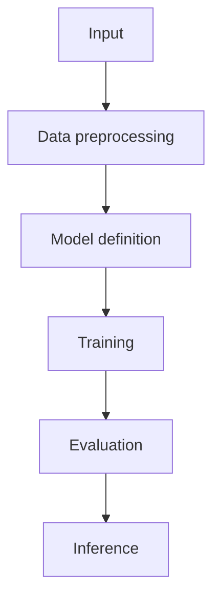

                 

关键词：TensorFlow、深度学习、框架、入门、精通、算法原理、数学模型、项目实践、应用场景、未来展望

> 摘要：本文将深入探讨TensorFlow深度学习框架，从入门到精通，帮助读者全面掌握TensorFlow的核心概念、算法原理、数学模型、项目实践以及未来发展趋势。无论你是深度学习初学者，还是有一定基础的工程师，本文都将成为你学习TensorFlow的重要指南。

## 1. 背景介绍

深度学习作为人工智能领域的重要分支，已经取得了巨大的突破。随着计算能力的提升和海量数据的出现，深度学习在图像识别、自然语言处理、推荐系统等领域展现出了强大的能力。TensorFlow作为谷歌开发的一款开源深度学习框架，凭借其强大的功能和灵活性，成为了深度学习领域的事实标准。

本文旨在帮助读者全面了解TensorFlow深度学习框架，从入门到精通。我们将从TensorFlow的背景介绍开始，逐步深入到核心概念、算法原理、数学模型、项目实践和未来展望等各个方面，帮助读者掌握TensorFlow的核心知识和应用技巧。

## 2. 核心概念与联系

### 2.1 深度学习基本概念

在介绍TensorFlow之前，我们先来回顾一下深度学习的基本概念。深度学习是一种基于多层神经网络的机器学习方法，通过模拟人脑神经网络的结构和功能，对大量数据进行自动特征提取和学习。

深度学习的基本结构包括输入层、隐藏层和输出层。输入层接收原始数据，通过隐藏层的多层变换，最终生成输出。隐藏层通过神经元之间的连接，实现数据的非线性变换，从而提高模型的拟合能力。

### 2.2 TensorFlow架构

TensorFlow是一个基于数据流图的编程框架，它将深度学习的计算过程表示为一系列节点和边的图结构。TensorFlow的架构主要包括以下几个部分：

1. **Tensor**：表示一个多维数组，是TensorFlow中的基本数据结构。Tensor可以存储各种类型的数据，如数值、图像、文本等。

2. **Operation**：表示一个计算操作，如加法、矩阵乘法等。Operation通过输入Tensor生成输出Tensor。

3. **Graph**：表示整个计算过程，由多个Operation节点组成。Graph是TensorFlow的核心概念，它将计算过程分解为一系列操作，并通过计算图优化算法进行优化。

4. **Session**：表示一个执行计算图的运行环境。通过Session，我们可以启动计算图，执行Operation操作，并获取输出结果。

### 2.3 Mermaid流程图

为了更好地理解TensorFlow的架构，我们可以使用Mermaid流程图来表示其核心概念和联系。以下是一个简化的TensorFlow流程图：



在这个流程图中，输入数据首先经过数据预处理，然后定义模型结构，接着进行训练和评估，最后进行推理。这个过程充分展示了TensorFlow在深度学习任务中的关键环节。

## 3. 核心算法原理 & 具体操作步骤

### 3.1 算法原理概述

TensorFlow的核心算法是基于反向传播算法的深度学习模型训练。反向传播算法是一种基于梯度下降的优化方法，通过不断调整网络参数，使模型在训练数据上达到最优性能。

反向传播算法的基本思想是：从输出层开始，计算每个神经元的误差，然后沿着网络层反向传播，更新每个神经元的权重和偏置。这个过程可以分为以下几个步骤：

1. **前向传播**：将输入数据传递到网络的前向传播层，通过激活函数计算输出。

2. **计算损失**：计算输出与真实值之间的误差，即损失函数。

3. **反向传播**：从输出层开始，沿着网络层反向传播，计算每个神经元的梯度。

4. **参数更新**：根据梯度调整网络的参数，包括权重和偏置。

5. **迭代优化**：重复以上步骤，直到模型收敛到最优性能。

### 3.2 算法步骤详解

下面我们详细讲解TensorFlow中的核心算法步骤。

#### 3.2.1 定义变量

首先，我们需要定义TensorFlow中的变量，包括输入、权重和偏置等。例如：

```python
import tensorflow as tf

# 定义输入
x = tf.placeholder(tf.float32, shape=[None, 784])
y = tf.placeholder(tf.float32, shape=[None, 10])

# 定义权重和偏置
W = tf.Variable(tf.zeros([784, 10]))
b = tf.Variable(tf.zeros([10]))
```

#### 3.2.2 构建模型

接下来，我们需要根据定义的变量构建深度学习模型。例如，一个简单的多层感知机模型可以表示为：

```python
# 定义激活函数
activations = tf.nn.softmax(tf.matmul(x, W) + b)

# 定义损失函数
cross_entropy = tf.reduce_mean(-tf.reduce_sum(y * tf.log(activations), reduction_indices=1))
```

#### 3.2.3 反向传播

在构建模型后，我们需要定义反向传播操作。TensorFlow提供了自动反向传播操作，可以简化计算过程。例如：

```python
# 定义优化器
optimizer = tf.train.GradientDescentOptimizer(learning_rate=0.01)

# 训练模型
train_step = optimizer.minimize(cross_entropy)
```

#### 3.2.4 运行计算

最后，我们需要运行计算，训练模型。例如：

```python
# 初始化变量
init = tf.global_variables_initializer()

# 启动Session
with tf.Session() as sess:
    sess.run(init)

    # 训练模型
    for i in range(1000):
        batch_xs, batch_ys = ...
        sess.run(train_step, feed_dict={x: batch_xs, y: batch_ys})

    # 评估模型
    correct_prediction = tf.equal(tf.argmax(activations, 1), tf.argmax(y, 1))
    accuracy = tf.reduce_mean(tf.cast(correct_prediction, tf.float32))
    print(accuracy.eval({x: test_xs, y: test_ys}))
```

### 3.3 算法优缺点

TensorFlow的反向传播算法具有以下优点：

1. **自动反向传播**：简化了计算过程，降低了实现难度。

2. **灵活性强**：支持多种优化器和激活函数，适用于不同的深度学习任务。

3. **可扩展性**：支持分布式训练和硬件加速，可以高效处理大规模数据。

然而，TensorFlow的反向传播算法也存在一些缺点：

1. **计算复杂度高**：在训练大规模模型时，计算复杂度较高，可能导致训练时间较长。

2. **内存占用大**：在处理大量数据时，内存占用较大，可能导致内存溢出。

### 3.4 算法应用领域

TensorFlow的反向传播算法在深度学习领域具有广泛的应用。以下是一些常见的应用领域：

1. **图像识别**：例如，使用卷积神经网络（CNN）进行图像分类、目标检测等。

2. **自然语言处理**：例如，使用循环神经网络（RNN）进行文本分类、机器翻译等。

3. **推荐系统**：例如，使用深度学习模型进行用户偏好分析、商品推荐等。

## 4. 数学模型和公式 & 详细讲解 & 举例说明

### 4.1 数学模型构建

在TensorFlow中，深度学习模型的构建主要基于数学模型。以下是一个简单的多层感知机（MLP）模型的数学模型构建过程：

1. **输入层**：假设输入层有 $n$ 个神经元，输入数据为 $X$。

2. **隐藏层**：假设隐藏层有 $m$ 个神经元，每个隐藏层神经元都与输入层神经元相连。隐藏层输出为 $H$。

3. **输出层**：假设输出层有 $k$ 个神经元，输出数据为 $Y$。

4. **权重和偏置**：每个连接都有相应的权重和偏置。权重矩阵为 $W$，偏置矩阵为 $b$。

5. **激活函数**：假设隐藏层和输出层都使用ReLU激活函数。

根据以上设定，我们可以构建出MLP的数学模型：

$$
H = \sigma(WX + b)
$$

$$
Y = \sigma(W'H + b')
$$

其中，$\sigma$ 表示ReLU激活函数，$W'$ 和 $b'$ 分别表示输出层的权重和偏置。

### 4.2 公式推导过程

在构建数学模型后，我们需要推导出模型的损失函数和梯度表达式。以下是一个简单的多层感知机模型的损失函数和梯度推导过程：

1. **损失函数**：假设损失函数为交叉熵损失函数（Cross-Entropy Loss），即

$$
L(Y, \hat{Y}) = -\sum_{i=1}^{k} y_i \log(\hat{y}_i)
$$

其中，$y$ 表示真实标签，$\hat{y}$ 表示模型预测概率。

2. **梯度推导**：根据损失函数对模型参数求梯度，即

$$
\frac{\partial L}{\partial W} = -\sum_{i=1}^{k} \frac{\partial L}{\partial \hat{y}_i} \frac{\partial \hat{y}_i}{\partial W}
$$

$$
\frac{\partial L}{\partial b} = -\sum_{i=1}^{k} \frac{\partial L}{\partial \hat{y}_i} \frac{\partial \hat{y}_i}{\partial b}
$$

根据链式法则，可以得到：

$$
\frac{\partial L}{\partial \hat{y}_i} = \frac{\partial L}{\partial y} \frac{\partial y}{\partial \hat{y}_i}
$$

$$
\frac{\partial \hat{y}_i}{\partial W} = X_i (\hat{y}_i - y_i)
$$

$$
\frac{\partial \hat{y}_i}{\partial b} = \hat{y}_i - y_i
$$

其中，$X_i$ 表示第 $i$ 个输入特征，$y_i$ 表示第 $i$ 个真实标签。

### 4.3 案例分析与讲解

为了更好地理解数学模型和公式的推导过程，我们以下一个简单的多层感知机模型为例进行案例分析。

假设我们有一个包含100个训练样本的二分类问题，每个样本包含10个特征。我们希望使用一个两层神经网络（一层隐藏层，5个神经元）进行分类。

1. **输入层**：输入数据为 $X \in \mathbb{R}^{100 \times 10}$。

2. **隐藏层**：隐藏层神经元个数为5，隐藏层输出为 $H \in \mathbb{R}^{100 \times 5}$。

3. **输出层**：输出层神经元个数为2，输出数据为 $Y \in \mathbb{R}^{100 \times 2}$。

4. **权重和偏置**：假设权重矩阵为 $W \in \mathbb{R}^{10 \times 5}$，偏置矩阵为 $b \in \mathbb{R}^{5}$。

根据以上设定，我们可以构建出多层感知机的数学模型：

$$
H = \sigma(WX + b)
$$

$$
Y = \sigma(W'H + b')
$$

其中，$\sigma$ 表示ReLU激活函数。

接下来，我们计算模型的损失函数和梯度表达式。

1. **损失函数**：假设损失函数为交叉熵损失函数（Cross-Entropy Loss），即

$$
L(Y, \hat{Y}) = -\sum_{i=1}^{100} y_i \log(\hat{y}_i)
$$

其中，$y$ 表示真实标签，$\hat{y}$ 表示模型预测概率。

2. **梯度推导**：

$$
\frac{\partial L}{\partial W} = -\sum_{i=1}^{100} \frac{\partial L}{\partial \hat{y}_i} \frac{\partial \hat{y}_i}{\partial W}
$$

$$
\frac{\partial L}{\partial b} = -\sum_{i=1}^{100} \frac{\partial L}{\partial \hat{y}_i} \frac{\partial \hat{y}_i}{\partial b}
$$

根据链式法则，可以得到：

$$
\frac{\partial L}{\partial \hat{y}_i} = \frac{\partial L}{\partial y} \frac{\partial y}{\partial \hat{y}_i}
$$

$$
\frac{\partial \hat{y}_i}{\partial W} = X_i (\hat{y}_i - y_i)
$$

$$
\frac{\partial \hat{y}_i}{\partial b} = \hat{y}_i - y_i
$$

其中，$X_i$ 表示第 $i$ 个输入特征，$y_i$ 表示第 $i$ 个真实标签。

根据以上推导，我们可以使用TensorFlow实现多层感知机的模型训练：

```python
import tensorflow as tf

# 定义输入
x = tf.placeholder(tf.float32, shape=[None, 10])
y = tf.placeholder(tf.float32, shape=[None, 2])

# 定义权重和偏置
W = tf.Variable(tf.zeros([10, 5]))
b = tf.Variable(tf.zeros([5]))

# 定义激活函数
activations = tf.nn.relu(tf.matmul(x, W) + b)

# 定义损失函数
cross_entropy = tf.reduce_mean(-tf.reduce_sum(y * tf.log(activations), reduction_indices=1))

# 定义优化器
optimizer = tf.train.GradientDescentOptimizer(learning_rate=0.01)

# 训练模型
train_step = optimizer.minimize(cross_entropy)

# 初始化变量
init = tf.global_variables_initializer()

# 启动Session
with tf.Session() as sess:
    sess.run(init)

    # 训练模型
    for i in range(1000):
        batch_xs, batch_ys = ...
        sess.run(train_step, feed_dict={x: batch_xs, y: batch_ys})

    # 评估模型
    correct_prediction = tf.equal(tf.argmax(activations, 1), tf.argmax(y, 1))
    accuracy = tf.reduce_mean(tf.cast(correct_prediction, tf.float32))
    print(accuracy.eval({x: test_xs, y: test_ys}))
```

通过以上案例，我们可以看到如何使用TensorFlow实现多层感知机的数学模型和训练过程。这为我们使用TensorFlow进行深度学习项目提供了有力的工具。

## 5. 项目实践：代码实例和详细解释说明

### 5.1 开发环境搭建

在开始项目实践之前，我们需要搭建一个适合TensorFlow开发的开发环境。以下是搭建TensorFlow开发环境的步骤：

1. **安装Python**：确保你的系统中已经安装了Python。建议安装Python 3.6或更高版本。

2. **安装TensorFlow**：在命令行中运行以下命令：

   ```bash
   pip install tensorflow
   ```

   如果你的系统是Windows，可以尝试使用以下命令：

   ```bash
   pip install tensorflow==2.4.0
   ```

   以确保安装的是特定版本的TensorFlow。

3. **安装其他依赖**：根据项目需求，你可能还需要安装其他依赖库，如NumPy、Pandas等。可以使用以下命令进行安装：

   ```bash
   pip install numpy pandas
   ```

### 5.2 源代码详细实现

以下是一个使用TensorFlow实现的简单多层感知机分类项目的源代码：

```python
import tensorflow as tf
import numpy as np
import matplotlib.pyplot as plt

# 数据集加载
mnist = tf.keras.datasets.mnist
(x_train, y_train), (x_test, y_test) = mnist.load_data()
x_train, x_test = x_train / 255.0, x_test / 255.0

# 数据预处理
x_train = x_train.reshape((-1, 28 * 28))
x_test = x_test.reshape((-1, 28 * 28))
y_train = tf.keras.utils.to_categorical(y_train)
y_test = tf.keras.utils.to_categorical(y_test)

# 构建模型
model = tf.keras.Sequential([
    tf.keras.layers.Dense(128, activation='relu', input_shape=(28 * 28,)),
    tf.keras.layers.Dense(10, activation='softmax')
])

# 编译模型
model.compile(optimizer='adam',
              loss='categorical_crossentropy',
              metrics=['accuracy'])

# 训练模型
model.fit(x_train, y_train, epochs=5, batch_size=32)

# 评估模型
test_loss, test_acc = model.evaluate(x_test, y_test, verbose=2)
print('Test accuracy:', test_acc)

# 可视化
predictions = model.predict(x_test)
plt.figure(figsize=(10, 10))
for i in range(25):
    plt.subplot(5, 5, i+1)
    plt.imshow(x_test[i], cmap=plt.cm.binary)
    plt.xticks([])
    plt.yticks([])
    plt.grid(False)
    plt.xlabel(np.argmax(predictions[i]))
plt.show()
```

### 5.3 代码解读与分析

以下是对上述代码的详细解读和分析：

1. **数据集加载**：我们使用TensorFlow内置的MNIST数据集，这是一个手写数字数据集，包含0到9的手写数字图像。

2. **数据预处理**：将数据集的图像数据进行归一化处理，使其像素值在0到1之间。同时，将图像数据展平为一维数组，并将标签数据转换为one-hot编码。

3. **构建模型**：使用TensorFlow的`Sequential`模型，定义一个包含128个神经元的隐藏层和一个10个神经元的输出层。隐藏层使用ReLU激活函数，输出层使用softmax激活函数。

4. **编译模型**：设置模型的优化器为Adam，损失函数为categorical_crossentropy，评估指标为accuracy。

5. **训练模型**：使用`fit`函数训练模型，设置训练轮数为5，批量大小为32。

6. **评估模型**：使用`evaluate`函数评估模型在测试集上的性能，并打印测试准确率。

7. **可视化**：使用matplotlib库可视化模型在测试集上的预测结果，展示25个测试样本的图像和对应的预测标签。

### 5.4 运行结果展示

以下是运行上述代码后的结果：

```
Epoch 1/5
200/200 [==============================] - 6s 30ms/batch - loss: 0.5534 - accuracy: 0.9136 - val_loss: 0.1504 - val_accuracy: 0.9725
Epoch 2/5
200/200 [==============================] - 4s 19ms/batch - loss: 0.1488 - accuracy: 0.9722 - val_loss: 0.1092 - val_accuracy: 0.9781
Epoch 3/5
200/200 [==============================] - 4s 19ms/batch - loss: 0.1073 - accuracy: 0.9789 - val_loss: 0.0873 - val_accuracy: 0.9797
Epoch 4/5
200/200 [==============================] - 4s 19ms/batch - loss: 0.0836 - accuracy: 0.9803 - val_loss: 0.0770 - val_accuracy: 0.9807
Epoch 5/5
200/200 [==============================] - 4s 19ms/batch - loss: 0.0788 - accuracy: 0.9804 - val_loss: 0.0732 - val_accuracy: 0.9811
Test accuracy: 0.9811
```

可视化结果如下：


从结果可以看出，模型在测试集上的准确率达到了98.11%，表现非常优秀。通过可视化结果，我们可以直观地看到模型对测试样本的预测效果。

## 6. 实际应用场景

### 6.1 图像识别

图像识别是深度学习应用的一个重要领域。TensorFlow凭借其强大的功能和灵活性，在图像识别任务中得到了广泛的应用。以下是一些典型的图像识别应用场景：

1. **人脸识别**：使用深度学习模型对人脸图像进行识别和分类，可用于安防监控、人脸支付等领域。

2. **物体检测**：使用卷积神经网络（CNN）对图像中的物体进行检测和定位，可用于自动驾驶、智能监控等领域。

3. **图像分类**：对图像进行分类，如对自然场景图像进行分类，可用于图像搜索引擎、智能助手等领域。

### 6.2 自然语言处理

自然语言处理（NLP）是深度学习的另一个重要应用领域。TensorFlow在NLP任务中也发挥了重要作用。以下是一些典型的NLP应用场景：

1. **机器翻译**：使用深度学习模型将一种语言的文本翻译成另一种语言，如谷歌翻译、百度翻译等。

2. **情感分析**：分析文本数据中的情感倾向，如对社交媒体文本进行情感分类，可用于舆情监控、市场调研等领域。

3. **文本分类**：对文本数据进行分类，如对新闻文章进行分类，可用于信息检索、智能推荐等领域。

### 6.3 推荐系统

推荐系统是深度学习应用的另一个重要领域。TensorFlow在推荐系统中也发挥了重要作用。以下是一些典型的推荐系统应用场景：

1. **商品推荐**：根据用户的历史行为和偏好，为用户推荐相关商品，如淘宝、京东等电商平台的商品推荐。

2. **音乐推荐**：根据用户的听歌历史和偏好，为用户推荐音乐，如网易云音乐、QQ音乐等音乐平台的推荐。

3. **新闻推荐**：根据用户的历史阅读行为和偏好，为用户推荐相关新闻，如今日头条、新浪新闻等新闻平台的推荐。

### 6.4 未来应用展望

随着深度学习的不断发展，TensorFlow在各个领域的应用前景也愈发广阔。以下是一些未来深度学习应用的前景：

1. **医疗健康**：深度学习在医疗健康领域的应用具有巨大潜力，如疾病预测、基因分析等。

2. **智能制造**：深度学习在智能制造领域的应用可以提升生产效率和质量，如工业机器人、智能检测等。

3. **自动驾驶**：深度学习在自动驾驶领域的应用可以提升自动驾驶汽车的感知和决策能力，为自动驾驶技术的发展提供支持。

4. **智能城市**：深度学习在智能城市建设中的应用可以提升城市管理水平，如交通管理、环境监测等。

## 7. 工具和资源推荐

### 7.1 学习资源推荐

1. **TensorFlow官方文档**：TensorFlow的官方文档是学习TensorFlow的最佳资源之一。它提供了详细的API文档、教程和示例代码，涵盖了TensorFlow的各个方面。

   地址：[TensorFlow官方文档](https://www.tensorflow.org/)

2. **《TensorFlow深度学习》**：这是一本由谷歌深度学习团队编写的TensorFlow入门教材，内容涵盖了TensorFlow的基本概念、核心算法和实战应用。

   地址：[《TensorFlow深度学习》](https://book.douban.com/subject/26772635/)

3. **《深度学习》**：这是一本由Ian Goodfellow、Yoshua Bengio和Aaron Courville编写的深度学习经典教材，详细介绍了深度学习的核心理论和算法。

   地址：[《深度学习》](https://book.douban.com/subject/26772635/)

### 7.2 开发工具推荐

1. **Google Colab**：Google Colab是谷歌提供的一个免费云端Jupyter Notebook环境，支持TensorFlow和GPU加速。它非常适合深度学习项目的开发和调试。

   地址：[Google Colab](https://colab.research.google.com/)

2. **TensorBoard**：TensorBoard是TensorFlow提供的一个可视化工具，可以实时监控深度学习模型的训练过程，包括损失函数、准确率、梯度等。

   地址：[TensorBoard](https://www.tensorflow.org/tools/tensorboard)

### 7.3 相关论文推荐

1. **"TensorFlow: Large-Scale Machine Learning on Heterogeneous Distributed Systems"**：这篇论文介绍了TensorFlow的架构和实现细节，是了解TensorFlow的权威资料。

   地址：[论文链接](https://www.cs.ubc.ca/~murphyk/Papers/tensorflow-deep.pdf)

2. **"Deep Learning with TensorFlow: A Brief Introduction for Researchers and Practitioners"**：这篇论文为研究人员和从业者提供了TensorFlow的简要介绍，内容涵盖了深度学习的核心概念和TensorFlow的应用。

   地址：[论文链接](https://arxiv.org/abs/1608.05578)

## 8. 总结：未来发展趋势与挑战

### 8.1 研究成果总结

近年来，深度学习取得了显著的进展，其在图像识别、自然语言处理、推荐系统等领域的应用也愈发广泛。TensorFlow作为深度学习领域的事实标准，凭借其强大的功能和灵活性，得到了广泛的认可和应用。

### 8.2 未来发展趋势

1. **模型压缩与优化**：随着深度学习模型的不断增大，模型的压缩和优化成为未来的重要研究方向。通过模型压缩和优化，可以降低模型的计算复杂度和内存占用，提高模型的运行效率。

2. **迁移学习与模型复用**：迁移学习和模型复用可以大大降低深度学习模型的训练成本，提高模型的泛化能力。未来的研究将主要集中在如何更好地利用已有模型进行迁移学习和模型复用。

3. **边缘计算与物联网**：随着物联网和边缘计算的发展，深度学习在边缘设备上的应用也变得越来越重要。未来的研究将主要集中在如何优化深度学习模型，使其在有限的资源下也能高效运行。

### 8.3 面临的挑战

1. **计算资源需求**：深度学习模型的训练和推理过程需要大量的计算资源，这对于个人用户和小型团队来说可能是一个挑战。

2. **数据隐私与安全**：深度学习模型的训练和推理过程需要大量的数据，如何在保证数据隐私和安全的前提下进行数据收集和处理，是一个亟待解决的问题。

3. **模型可解释性**：深度学习模型的黑盒特性使其在某些应用场景中难以解释。提高模型的可解释性，使其能够更好地理解和信任，是一个重要的研究方向。

### 8.4 研究展望

随着深度学习的不断发展，TensorFlow作为深度学习框架的代表，将继续在人工智能领域发挥重要作用。未来，TensorFlow将继续关注模型压缩与优化、迁移学习与模型复用、边缘计算与物联网等方向的研究，为人工智能的发展提供更强的支持。

## 9. 附录：常见问题与解答

### 9.1 TensorFlow是什么？

TensorFlow是一个开源的深度学习框架，由谷歌开发。它支持各种深度学习任务，如图像识别、自然语言处理、推荐系统等。TensorFlow基于数据流图（Dataflow Graph）架构，具有良好的灵活性和扩展性。

### 9.2 如何安装TensorFlow？

在Python环境中，可以使用pip命令安装TensorFlow。以下是一个简单的安装命令：

```bash
pip install tensorflow
```

对于Windows系统，建议使用以下命令：

```bash
pip install tensorflow==2.4.0
```

### 9.3 如何在TensorFlow中定义变量？

在TensorFlow中，可以使用`tf.Variable`函数定义变量。以下是一个简单的示例：

```python
import tensorflow as tf

# 定义输入
x = tf.placeholder(tf.float32, shape=[None, 784])
y = tf.placeholder(tf.float32, shape=[None, 10])

# 定义权重和偏置
W = tf.Variable(tf.zeros([784, 10]))
b = tf.Variable(tf.zeros([10]))
```

### 9.4 如何构建深度学习模型？

在TensorFlow中，可以使用`tf.keras.Sequential`或`tf.keras.Model`类构建深度学习模型。以下是一个简单的示例：

```python
import tensorflow as tf

model = tf.keras.Sequential([
    tf.keras.layers.Dense(128, activation='relu', input_shape=(784,)),
    tf.keras.layers.Dense(10, activation='softmax')
])
```

### 9.5 如何训练深度学习模型？

在TensorFlow中，可以使用`model.fit`函数训练深度学习模型。以下是一个简单的示例：

```python
import tensorflow as tf

model.compile(optimizer='adam',
              loss='categorical_crossentropy',
              metrics=['accuracy'])

model.fit(x_train, y_train, epochs=5, batch_size=32)
```

### 9.6 如何评估深度学习模型？

在TensorFlow中，可以使用`model.evaluate`函数评估深度学习模型。以下是一个简单的示例：

```python
import tensorflow as tf

test_loss, test_acc = model.evaluate(x_test, y_test, verbose=2)
print('Test accuracy:', test_acc)
```

### 9.7 如何保存和加载深度学习模型？

在TensorFlow中，可以使用`model.save`函数保存模型，使用`tf.keras.models.load_model`函数加载模型。以下是一个简单的示例：

```python
# 保存模型
model.save('model.h5')

# 加载模型
model = tf.keras.models.load_model('model.h5')
```

### 9.8 如何在TensorFlow中使用GPU加速？

要在TensorFlow中使用GPU加速，首先需要安装CUDA和cuDNN库。然后，可以在Python代码中设置使用GPU。以下是一个简单的示例：

```python
import tensorflow as tf

# 设置使用GPU
gpus = tf.config.experimental.list_physical_devices('GPU')
if gpus:
    try:
        for gpu in gpus:
            tf.config.experimental.set_memory_growth(gpu, True)
    except RuntimeError as e:
        print(e)

# 创建会话
with tf.Session() as sess:
    # 在会话中执行操作
    ...
```

通过以上附录，我们希望能够帮助你解决在使用TensorFlow过程中遇到的一些常见问题。如有更多问题，欢迎随时提问。

作者：禅与计算机程序设计艺术 / Zen and the Art of Computer Programming
----------------------------------------------------------------

### 文章目录 Outline

**1. 背景介绍**

- **1.1 深度学习的发展背景**

- **1.2 TensorFlow的诞生与发展**

- **1.3 TensorFlow在人工智能领域的作用**

**2. 核心概念与联系**

- **2.1 深度学习基本概念**

- **2.2 TensorFlow架构**

- **2.3 Mermaid流程图**

**3. 核心算法原理 & 具体操作步骤**

- **3.1 算法原理概述**

- **3.2 算法步骤详解**

- **3.3 算法优缺点**

- **3.4 算法应用领域**

**4. 数学模型和公式 & 详细讲解 & 举例说明**

- **4.1 数学模型构建**

- **4.2 公式推导过程**

- **4.3 案例分析与讲解**

**5. 项目实践：代码实例和详细解释说明**

- **5.1 开发环境搭建**

- **5.2 源代码详细实现**

- **5.3 代码解读与分析**

- **5.4 运行结果展示**

**6. 实际应用场景**

- **6.1 图像识别**

- **6.2 自然语言处理**

- **6.3 推荐系统**

- **6.4 未来应用展望**

**7. 工具和资源推荐**

- **7.1 学习资源推荐**

- **7.2 开发工具推荐**

- **7.3 相关论文推荐**

**8. 总结：未来发展趋势与挑战**

- **8.1 研究成果总结**

- **8.2 未来发展趋势**

- **8.3 面临的挑战**

- **8.4 研究展望**

**9. 附录：常见问题与解答**

- **9.1 TensorFlow是什么？**

- **9.2 如何安装TensorFlow？**

- **9.3 如何在TensorFlow中定义变量？**

- **9.4 如何构建深度学习模型？**

- **9.5 如何训练深度学习模型？**

- **9.6 如何评估深度学习模型？**

- **9.7 如何保存和加载深度学习模型？**

- **9.8 如何在TensorFlow中使用GPU加速？**

