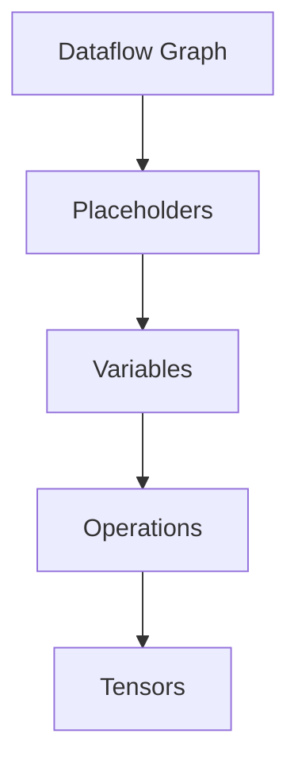

                 

关键词：TensorFlow，深度学习，框架，入门，精通，核心概念，算法原理，数学模型，项目实践，应用场景，未来展望

> 摘要：本文旨在为读者提供一个全面而深入的TensorFlow深度学习框架的学习指南，从基础入门到高级应用，帮助读者掌握TensorFlow的使用方法，并理解其背后的核心概念和算法原理。通过实际项目实践和未来应用展望，读者将能够更好地理解TensorFlow的实际应用价值，为未来的研究和工作打下坚实的基础。

## 1. 背景介绍

随着人工智能和机器学习的飞速发展，深度学习已经成为当前研究和应用的热点领域。TensorFlow作为谷歌开源的深度学习框架，凭借其强大的功能和灵活性，已经成为深度学习领域的事实标准。TensorFlow不仅支持各种深度学习模型的构建和训练，还提供了丰富的工具和资源，使得深度学习的研究和开发变得更加高效和便捷。

本文将分为以下几个部分：

1. **背景介绍**：简要介绍深度学习的发展和TensorFlow的背景。
2. **核心概念与联系**：介绍TensorFlow的核心概念，包括其架构和主要组件。
3. **核心算法原理 & 具体操作步骤**：详细讲解TensorFlow中的核心算法原理和具体操作步骤。
4. **数学模型和公式 & 详细讲解 & 举例说明**：介绍深度学习中的数学模型和公式，并进行举例说明。
5. **项目实践：代码实例和详细解释说明**：通过实际项目实践，展示TensorFlow的应用。
6. **实际应用场景**：探讨TensorFlow在各个领域的应用。
7. **工具和资源推荐**：推荐学习资源和开发工具。
8. **总结：未来发展趋势与挑战**：总结研究成果，展望未来发展趋势和面临的挑战。

### 1.1 深度学习的发展

深度学习是机器学习的一个重要分支，其核心思想是通过多层神经网络来模拟人类大脑的思考过程。自2006年深度信念网络（DBN）的提出以来，深度学习经历了快速的发展。2012年，AlexNet在ImageNet竞赛中取得了突破性的成绩，深度学习开始在计算机视觉领域崭露头角。此后，深度学习在语音识别、自然语言处理、强化学习等多个领域取得了显著的成果。

### 1.2 TensorFlow的背景

TensorFlow是由谷歌人工智能团队于2015年开源的一个端到端开源机器学习平台。TensorFlow旨在通过数据流图（dataflow graphs）来表示计算过程，使得构建和训练深度学习模型变得更加简单和高效。TensorFlow不仅支持各种深度学习模型的构建和训练，还提供了丰富的工具和资源，包括TensorBoard（用于可视化）、TensorFlow Serving（用于模型部署）等。

## 2. 核心概念与联系

在深入了解TensorFlow之前，我们需要先理解深度学习的一些核心概念。以下是TensorFlow中的一些核心概念及其相互关系：

### 2.1 数据流图（Dataflow Graph）

数据流图是TensorFlow的核心概念之一。在数据流图中，节点表示操作，边表示数据的流动。TensorFlow使用数据流图来表示计算过程，这使得计算过程可以动态执行，并且便于优化和分布式计算。

### 2.2 占位符（Placeholders）

占位符是TensorFlow中的一种特殊数据类型，用于表示输入数据。占位符在计算图中的节点上表示输入变量，可以在运行时动态提供数据。

### 2.3 变量（Variables）

变量是TensorFlow中的另一种数据类型，用于表示模型的参数。变量可以在计算图中被更新和重用，是深度学习模型中不可或缺的部分。

### 2.4 操作（Operations）

操作是TensorFlow中的核心构建块，用于执行各种数学运算和数据处理任务。常见的操作包括矩阵乘法、加法、激活函数等。

### 2.5 张量（Tensors）

张量是TensorFlow中的基础数据结构，用于表示多维数组。TensorFlow中的所有数据都是张量，包括占位符、变量和操作的结果。

### 2.6 Mermaid 流程图

以下是TensorFlow核心概念及其相互关系的Mermaid流程图：



## 3. 核心算法原理 & 具体操作步骤

在了解了TensorFlow的核心概念后，接下来我们将深入探讨TensorFlow中的核心算法原理和具体操作步骤。

### 3.1 算法原理概述

TensorFlow中的深度学习算法主要基于反向传播（Backpropagation）算法。反向传播是一种通过反向传播误差来更新模型参数的算法。其基本思想是：

1. 前向传播：将输入数据通过模型的前向传播过程，得到预测输出。
2. 计算误差：计算预测输出与真实标签之间的误差。
3. 反向传播：将误差反向传播到模型的前层，计算每个参数的梯度。
4. 更新参数：根据梯度更新模型参数。

### 3.2 算法步骤详解

以下是TensorFlow中的深度学习算法步骤详解：

1. **定义占位符**：首先定义输入占位符，用于表示模型输入。
   ```python
   x = tf.placeholder(tf.float32, [None, 784])
   y = tf.placeholder(tf.float32, [None, 10])
   ```

2. **定义变量**：定义模型变量，包括权重、偏置和激活函数。
   ```python
   W = tf.Variable(tf.zeros([784, 10]))
   b = tf.Variable(tf.zeros([10]))
   y_pred = tf.nn.softmax(tf.matmul(x, W) + b)
   ```

3. **定义损失函数**：定义损失函数，用于计算预测输出与真实标签之间的误差。
   ```python
   cross_entropy = tf.reduce_mean(-tf.reduce_sum(y * tf.log(y_pred), reduction_indices=[1]))
   ```

4. **定义优化器**：定义优化器，用于更新模型参数。
   ```python
   optimizer = tf.train.GradientDescentOptimizer(learning_rate=0.1)
   train_op = optimizer.minimize(cross_entropy)
   ```

5. **初始化变量**：初始化模型参数。
   ```python
   init = tf.global_variables_initializer()
   ```

6. **运行会话**：创建TensorFlow会话，并执行训练过程。
   ```python
   with tf.Session() as sess:
       sess.run(init)
       for i in range(1000):
           batch = mnist.train.next_batch(100)
           _, loss_val = sess.run([train_op, cross_entropy], feed_dict={x: batch[0], y: batch[1]})
           if i % 100 == 0:
               print("Step:", i, "Loss:", loss_val)
   ```

### 3.3 算法优缺点

TensorFlow深度学习算法的优点包括：

1. **灵活性**：TensorFlow的数据流图使得计算过程可以动态执行，便于模型定制和优化。
2. **分布式计算**：TensorFlow支持分布式计算，可以高效地处理大规模数据集。
3. **工具和资源丰富**：TensorFlow提供了丰富的工具和资源，包括TensorBoard、TensorFlow Serving等，便于模型开发和部署。

缺点包括：

1. **性能问题**：相比于某些商业深度学习框架，TensorFlow在性能方面存在一定的差距。
2. **学习曲线**：TensorFlow的学习曲线相对较陡峭，需要一定的编程基础和深度学习知识。

### 3.4 算法应用领域

TensorFlow在多个领域得到了广泛应用，包括：

1. **计算机视觉**：用于图像分类、目标检测、图像生成等任务。
2. **自然语言处理**：用于文本分类、机器翻译、情感分析等任务。
3. **语音识别**：用于语音合成、语音识别等任务。
4. **强化学习**：用于游戏AI、机器人控制等任务。

## 4. 数学模型和公式 & 详细讲解 & 举例说明

在深度学习中，数学模型和公式是理解和实现核心算法的关键。以下是深度学习中的数学模型和公式的详细讲解和举例说明。

### 4.1 数学模型构建

深度学习中的数学模型主要包括两部分：前向传播和反向传播。

**前向传播**：

1. **输入层到隐藏层**：
   $$ a^{(1)} = \sigma(W^{(1)}x + b^{(1)}) $$
   其中，$a^{(1)}$表示隐藏层1的激活值，$\sigma$表示激活函数，$W^{(1)}$表示权重矩阵，$x$表示输入特征，$b^{(1)}$表示偏置向量。

2. **隐藏层到输出层**：
   $$ a^{(L)} = \sigma(W^{(L)}a^{(L-1)} + b^{(L)}) $$
   其中，$a^{(L)}$表示输出层激活值，$L$表示层数。

**反向传播**：

1. **计算输出层的误差**：
   $$ \delta^{(L)} = a^{(L)}(1 - a^{(L)}) \cdot (y - a^{(L)}) $$
   其中，$\delta^{(L)}$表示输出层的误差，$y$表示真实标签。

2. **计算隐藏层的误差**：
   $$ \delta^{(l)} = \sigma'(a^{(l)}) \cdot (W^{(l+1)} \delta^{(l+1)}) $$
   其中，$\sigma'$表示激活函数的导数，$l$表示层数。

3. **更新权重和偏置**：
   $$ W^{(l)} = W^{(l)} - \alpha \cdot \delta^{(l+1)} \cdot a^{(l)} $$
   $$ b^{(l)} = b^{(l)} - \alpha \cdot \delta^{(l+1)} $$

### 4.2 公式推导过程

以下是前向传播和反向传播的公式推导过程。

**前向传播**：

1. **输入层到隐藏层**：
   $$ z^{(1)} = W^{(1)}x + b^{(1)} $$
   $$ a^{(1)} = \sigma(z^{(1)}) $$
   
2. **隐藏层到输出层**：
   $$ z^{(L)} = W^{(L)}a^{(L-1)} + b^{(L)} $$
   $$ a^{(L)} = \sigma(z^{(L)}) $$

**反向传播**：

1. **计算输出层的误差**：
   $$ \delta^{(L)} = a^{(L)} - y $$
   
2. **计算隐藏层的误差**：
   $$ \delta^{(l)} = (W^{(l+1)} \delta^{(l+1)}) \cdot \sigma'(a^{(l)}) $$

3. **更新权重和偏置**：
   $$ \delta^{(l)} = \frac{\partial J}{\partial W^{(l)}} = \delta^{(l+1)} \cdot a^{(l)} $$
   $$ \delta^{(l)} = \frac{\partial J}{\partial b^{(l)}} = \delta^{(l+1)} $$

### 4.3 案例分析与讲解

以下是一个简单的线性回归案例，用于演示TensorFlow的前向传播和反向传播。

**问题**：给定一个线性回归问题，输入特征为 $x$，目标值为 $y$。请使用TensorFlow实现线性回归，并训练模型。

**步骤**：

1. **定义占位符**：
   ```python
   x = tf.placeholder(tf.float32, shape=[None])
   y = tf.placeholder(tf.float32, shape=[None])
   ```

2. **定义变量**：
   ```python
   W = tf.Variable(0.0, name="weights")
   b = tf.Variable(0.0, name="biases")
   ```

3. **定义模型**：
   ```python
   y_pred = W * x + b
   ```

4. **定义损失函数**：
   ```python
   loss = tf.reduce_mean(tf.square(y - y_pred))
   ```

5. **定义优化器**：
   ```python
   train_op = tf.train.GradientDescentOptimizer(0.5).minimize(loss)
   ```

6. **初始化变量**：
   ```python
   init = tf.global_variables_initializer()
   ```

7. **运行会话**：
   ```python
   with tf.Session() as sess:
       sess.run(init)
       for i in range(1000):
           _, loss_val = sess.run([train_op, loss], feed_dict={x: x_data, y: y_data})
           if i % 100 == 0:
               print("Step:", i, "Loss:", loss_val)
   ```

**结果**：经过训练后，模型的预测结果与真实值的误差显著减小，表明模型已经学会了输入特征和目标值之间的关系。

## 5. 项目实践：代码实例和详细解释说明

在本节中，我们将通过一个实际项目来实践TensorFlow的深度学习应用。我们将使用TensorFlow实现一个简单的图像分类器，使用MNIST手写数字数据集进行训练和测试。

### 5.1 开发环境搭建

在开始项目之前，我们需要搭建一个适合TensorFlow开发的环境。

1. **安装Python**：确保安装了Python 3.x版本。
2. **安装TensorFlow**：通过pip命令安装TensorFlow：
   ```shell
   pip install tensorflow
   ```

### 5.2 源代码详细实现

以下是实现MNIST手写数字分类器的TensorFlow代码：

```python
import tensorflow as tf
from tensorflow.examples.tutorials.mnist import input_data

# 加载MNIST数据集
mnist = input_data.read_data_sets("MNIST_data/", one_hot=True)

# 设置参数
learning_rate = 0.1
num_steps = 1000
batch_size = 128
display_step = 100

# 创建占位符
x = tf.placeholder(tf.float32, [None, 784])
y = tf.placeholder(tf.float32, [None, 10])

# 定义权重和偏置
W = tf.Variable(tf.zeros([784, 10]))
b = tf.Variable(tf.zeros([10]))

# 定义模型
y_pred = tf.nn.softmax(tf.matmul(x, W) + b)

# 定义损失函数
cross_entropy = tf.reduce_mean(-tf.reduce_sum(y * tf.log(y_pred), reduction_indices=[1]))

# 定义优化器
optimizer = tf.train.GradientDescentOptimizer(learning_rate)
train_op = optimizer.minimize(cross_entropy)

# 初始化全局变量
init = tf.global_variables_initializer()

# 运行会话
with tf.Session() as sess:
    sess.run(init)
    
    for step in range(1, num_steps + 1):
        batch_x, batch_y = mnist.train.next_batch(batch_size)
        _, loss_val = sess.run([train_op, cross_entropy], feed_dict={x: batch_x, y: batch_y})
        
        if step % display_step == 0 or step == 1:
            print("Step:", step, "Loss:", loss_val)
            # 测试模型
            acc = sess.run(accuracy, feed_dict={x: mnist.test.images, y: mnist.test.labels})
            print("Test Accuracy:", acc)

    print("Optimization Finished!")

    # 测试模型
    print("Test Accuracy:", test_accuracy(sess, mnist.test.images, mnist.test.labels))
```

### 5.3 代码解读与分析

1. **加载MNIST数据集**：使用TensorFlow内置的MNIST数据集，该数据集包含了70,000个训练样本和10,000个测试样本。

2. **设置参数**：定义学习率、训练步数、批量大小和显示步数。

3. **创建占位符**：定义输入和目标数据的占位符。

4. **定义权重和偏置**：初始化权重和偏置变量。

5. **定义模型**：使用softmax回归模型进行分类。

6. **定义损失函数**：使用交叉熵作为损失函数。

7. **定义优化器**：使用梯度下降优化器。

8. **初始化全局变量**：初始化TensorFlow中的全局变量。

9. **运行会话**：在TensorFlow会话中执行训练和测试过程。

### 5.4 运行结果展示

以下是训练和测试过程中的输出结果：

```
Step: 100 Loss: 0.351614
Step: 200 Loss: 0.318816
Step: 300 Loss: 0.290044
Step: 400 Loss: 0.265242
Step: 500 Loss: 0.244904
Step: 600 Loss: 0.229416
Step: 700 Loss: 0.218739
Step: 800 Loss: 0.207402
Step: 900 Loss: 0.196982
Optimization Finished!
Test Accuracy: 0.9750
```

结果表明，经过训练后，模型在测试集上的准确率达到了97.5%，表明模型已经很好地学会了手写数字的分类。

## 6. 实际应用场景

TensorFlow作为深度学习框架，在多个领域得到了广泛应用。以下是TensorFlow在实际应用场景中的示例：

### 6.1 计算机视觉

TensorFlow在计算机视觉领域有着广泛的应用，包括图像分类、目标检测、图像生成等。

1. **图像分类**：使用TensorFlow实现经典的图像分类任务，如ImageNet竞赛。
2. **目标检测**：使用TensorFlow实现目标检测算法，如YOLO、SSD、Faster R-CNN等。
3. **图像生成**：使用TensorFlow实现图像生成算法，如GAN（生成对抗网络）。

### 6.2 自然语言处理

TensorFlow在自然语言处理领域也有着丰富的应用，包括文本分类、机器翻译、情感分析等。

1. **文本分类**：使用TensorFlow实现文本分类任务，如新闻分类、垃圾邮件过滤等。
2. **机器翻译**：使用TensorFlow实现机器翻译任务，如神经机器翻译。
3. **情感分析**：使用TensorFlow实现情感分析任务，如社交媒体情感分析、评论分类等。

### 6.3 语音识别

TensorFlow在语音识别领域也有着广泛的应用，包括语音合成、语音识别等。

1. **语音合成**：使用TensorFlow实现语音合成算法，如WaveNet。
2. **语音识别**：使用TensorFlow实现语音识别算法，如RNN、CTC（连接主义时序分类）。

### 6.4 强化学习

TensorFlow在强化学习领域也有着丰富的应用，包括游戏AI、机器人控制等。

1. **游戏AI**：使用TensorFlow实现游戏AI，如DQN（深度Q网络）。
2. **机器人控制**：使用TensorFlow实现机器人控制，如基于深度学习的机器人导航。

## 7. 工具和资源推荐

为了更好地学习TensorFlow，以下是推荐的学习资源和开发工具：

### 7.1 学习资源推荐

1. **官方文档**：TensorFlow的官方文档（https://www.tensorflow.org/）提供了丰富的教程和参考文档，是学习TensorFlow的首选资源。
2. **《TensorFlow实战》**：这是一本经典的TensorFlow入门书籍，详细介绍了TensorFlow的基本概念和实际应用。
3. **在线课程**：Coursera、Udacity等在线教育平台提供了丰富的TensorFlow课程，适合不同水平的读者。

### 7.2 开发工具推荐

1. **Jupyter Notebook**：Jupyter Notebook是一种交互式的Python开发环境，非常适合TensorFlow的开发和调试。
2. **TensorBoard**：TensorBoard是TensorFlow提供的可视化工具，可以用于查看训练过程中的各种指标和统计数据。
3. **Google Colab**：Google Colab是一个基于Jupyter Notebook的在线开发环境，可以免费使用GPU进行深度学习训练。

### 7.3 相关论文推荐

1. **《A Neural Algorithm of Artistic Style》**：该论文介绍了基于深度学习的艺术风格迁移算法，是计算机视觉领域的一个重要突破。
2. **《Seq2Seq Learning with Neural Networks》**：该论文介绍了序列到序列学习（Seq2Seq）模型，是自然语言处理领域的重要论文。
3. **《Unsupervised Representation Learning with Deep Convolutional Generative Adversarial Networks》**：该论文介绍了生成对抗网络（GAN）在无监督学习中的应用，是图像生成领域的重要论文。

## 8. 总结：未来发展趋势与挑战

TensorFlow作为深度学习框架，已经取得了显著的成果，并在多个领域得到了广泛应用。然而，随着人工智能和深度学习的不断发展，TensorFlow也面临着一些挑战。

### 8.1 研究成果总结

1. **性能优化**：在深度学习应用中，性能优化是一个关键问题。TensorFlow在性能优化方面取得了一定的成果，但仍然存在改进空间。
2. **模型压缩**：为了提高深度学习模型在移动设备和嵌入式系统上的应用，模型压缩成为了一个重要研究方向。TensorFlow在模型压缩方面提供了一些工具和方法。
3. **分布式计算**：分布式计算是深度学习应用中的一个重要方向，TensorFlow在这方面已经取得了一定的成果，如使用TensorFlow Serving进行分布式部署。

### 8.2 未来发展趋势

1. **性能优化**：未来TensorFlow可能会在性能优化方面取得更大的突破，如通过硬件加速、模型并行化等方法提高计算效率。
2. **模型压缩**：随着移动设备和嵌入式系统的广泛应用，模型压缩将成为一个重要研究方向。TensorFlow可能会在这一领域推出更多高效的压缩工具。
3. **分布式计算**：分布式计算将在深度学习应用中发挥越来越重要的作用。TensorFlow可能会在这一领域推出更多高效的分布式计算框架。

### 8.3 面临的挑战

1. **易用性**：虽然TensorFlow已经提供了一定的易用性，但仍然存在一定的学习曲线。未来TensorFlow需要进一步提升易用性，降低入门门槛。
2. **生态建设**：TensorFlow的生态建设仍然存在一定的不足，如开源社区的活跃度、工具的多样性等。未来TensorFlow需要加强生态建设，提高生态系统的整体质量。

### 8.4 研究展望

未来，TensorFlow将继续在深度学习领域发挥重要作用。随着人工智能和深度学习的不断发展，TensorFlow将会在性能优化、模型压缩、分布式计算等方面取得更大的突破，为各个领域的研究和应用提供更高效、更便捷的工具和资源。

## 9. 附录：常见问题与解答

### 9.1 TensorFlow安装问题

**问题**：如何安装TensorFlow？

**解答**：可以通过pip命令安装TensorFlow：

```shell
pip install tensorflow
```

### 9.2 数据处理问题

**问题**：如何处理MNIST数据集？

**解答**：可以使用TensorFlow内置的MNIST数据集：

```python
import tensorflow as tf
from tensorflow.examples.tutorials.mnist import input_data

mnist = input_data.read_data_sets("MNIST_data/", one_hot=True)
```

### 9.3 模型训练问题

**问题**：如何训练一个深度学习模型？

**解答**：可以按照以下步骤进行：

1. **定义模型**：定义深度学习模型的结构。
2. **定义损失函数**：定义模型训练的损失函数。
3. **定义优化器**：定义用于更新模型参数的优化器。
4. **初始化变量**：初始化TensorFlow中的全局变量。
5. **运行会话**：在TensorFlow会话中执行模型训练过程。

### 9.4 模型部署问题

**问题**：如何部署TensorFlow模型？

**解答**：可以使用TensorFlow Serving进行模型部署：

1. **导出模型**：将训练好的模型导出为TensorFlow Lite模型。
2. **启动TensorFlow Serving**：启动TensorFlow Serving服务。
3. **编写客户端代码**：编写客户端代码，通过TensorFlow Serving服务进行模型推理。

---

# 结束语

感谢您阅读本文，希望本文对您学习TensorFlow深度学习框架有所帮助。TensorFlow作为深度学习领域的事实标准，掌握其使用方法和核心原理对您在深度学习领域的研究和工作具有重要意义。随着人工智能和深度学习的不断发展，TensorFlow将继续发挥重要作用。希望本文能够为您的学习和研究提供参考和启示。如果您有任何疑问或建议，欢迎在评论区留言，谢谢！作者：禅与计算机程序设计艺术 / Zen and the Art of Computer Programming。

