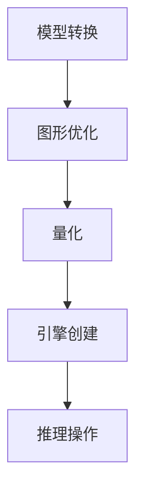

                 

关键词：TensorRT、深度学习、推理计算、优化库、加速性能

摘要：本文将介绍TensorRT优化库的应用，以及如何利用TensorRT加速深度学习推理计算的过程。我们将深入探讨TensorRT的核心概念、算法原理、数学模型、项目实践，并展望其在实际应用场景中的未来发展。

## 1. 背景介绍

深度学习作为人工智能领域的重要分支，已经在图像识别、自然语言处理、语音识别等方面取得了显著的成果。然而，随着深度学习模型的复杂性和规模不断扩大，模型的推理计算速度成为制约其应用的关键因素。为此，NVIDIA推出了TensorRT，一个高度优化的推理引擎，旨在加速深度学习模型的推理过程。

TensorRT基于NVIDIA的CUDA架构，提供了一系列工具和库，用于优化深度学习模型的推理性能。通过TensorRT，开发者可以显著减少推理时间，提高计算效率，从而满足实时应用的需求。本文将详细探讨TensorRT优化库的应用，以及如何将其应用于实际项目中。

## 2. 核心概念与联系

### 2.1 TensorRT概述

TensorRT是一个深度学习推理优化引擎，旨在提高深度学习模型的推理性能。它通过以下方式实现性能优化：

- **模型转换**：将TensorFlow、PyTorch等框架的模型转换为TensorRT支持的格式。
- **图形优化**：利用NVIDIA的GPU硬件特性，对模型进行图形优化。
- **量化**：通过量化技术减少模型的内存占用和计算量。
- **引擎创建**：创建一个优化的推理引擎，用于执行模型的推理操作。

### 2.2 Mermaid 流程图



### 2.3 TensorRT核心组件

TensorRT包括以下几个核心组件：

- **TensorRT Parser**：用于将深度学习模型解析为TensorRT支持的中间表示。
- **TensorRT Builder**：用于构建TensorRT推理引擎。
- **TensorRT Runtime**：用于执行推理操作。

## 3. 核心算法原理 & 具体操作步骤

### 3.1 算法原理概述

TensorRT通过以下步骤实现深度学习模型的推理优化：

1. **模型转换**：将深度学习模型转换为TensorRT支持的格式。
2. **图形优化**：利用CUDA和GPU硬件特性，对模型进行图形优化。
3. **量化**：通过量化技术减少模型的内存占用和计算量。
4. **引擎创建**：创建一个优化的推理引擎。
5. **推理操作**：使用推理引擎执行模型推理。

### 3.2 算法步骤详解

#### 3.2.1 模型转换

模型转换是TensorRT的第一步。在这一步中，我们将TensorFlow或PyTorch模型转换为TensorRT支持的ONNX格式。具体步骤如下：

1. **安装TensorRT**：在系统中安装TensorRT。
2. **转换模型**：使用TensorRT提供的转换工具，将TensorFlow或PyTorch模型转换为ONNX格式。

#### 3.2.2 图形优化

图形优化是TensorRT的第二步。在这一步中，我们将优化模型的计算图，使其更好地适应GPU硬件特性。具体步骤如下：

1. **分析模型**：使用TensorRT提供的分析工具，分析模型的计算图。
2. **优化模型**：根据分析结果，对模型进行图形优化。

#### 3.2.3 量化

量化是TensorRT的第三步。在这一步中，我们将模型中的浮点数运算转换为整数运算，以减少内存占用和计算量。具体步骤如下：

1. **选择量化策略**：根据模型的规模和精度要求，选择合适的量化策略。
2. **量化模型**：使用TensorRT提供的量化工具，对模型进行量化。

#### 3.2.4 引擎创建

引擎创建是TensorRT的第四步。在这一步中，我们将创建一个优化的推理引擎，用于执行模型的推理操作。具体步骤如下：

1. **构建引擎**：使用TensorRT提供的Builder，构建优化的推理引擎。
2. **设置引擎参数**：根据实际应用需求，设置引擎的参数。

#### 3.2.5 推理操作

推理操作是TensorRT的最后一步。在这一步中，我们使用推理引擎执行模型的推理操作。具体步骤如下：

1. **加载引擎**：将优化的推理引擎加载到GPU内存中。
2. **执行推理**：使用推理引擎，执行模型的推理操作。

### 3.3 算法优缺点

#### 优点

- **高性能**：TensorRT通过优化模型和图形，实现了深度学习推理的高性能。
- **兼容性**：TensorRT支持多种深度学习框架，如TensorFlow和PyTorch。
- **可扩展性**：TensorRT提供了丰富的API，支持自定义优化策略。

#### 缺点

- **学习曲线**：TensorRT的使用相对复杂，需要一定的学习成本。
- **兼容性问题**：部分深度学习框架可能与TensorRT存在兼容性问题。

### 3.4 算法应用领域

TensorRT的应用领域广泛，包括但不限于以下方面：

- **自动驾驶**：通过TensorRT优化深度学习模型，提高自动驾驶系统的实时性。
- **医疗影像**：利用TensorRT加速医疗影像处理，实现实时诊断和检测。
- **语音识别**：通过TensorRT优化语音识别模型，提高语音处理速度。

## 4. 数学模型和公式

### 4.1 数学模型构建

TensorRT中的数学模型主要由以下几部分组成：

- **神经网络模型**：用于描述深度学习模型的结构。
- **计算图**：用于描述模型的计算过程。
- **优化策略**：用于优化模型的计算效率。

### 4.2 公式推导过程

TensorRT中的优化过程涉及多种数学公式。以下是一个简化的公式推导过程：

$$
\text{时间} = \frac{\text{计算量}}{\text{GPU计算能力}}
$$

其中，计算量和GPU计算能力分别为：

$$
\text{计算量} = \sum_{i=1}^{n} \text{层} \times \text{神经元数} \times \text{操作次数}
$$

$$
\text{GPU计算能力} = \text{GPU核心数} \times \text{每个核心的计算能力}
$$

### 4.3 案例分析与讲解

以一个简单的卷积神经网络为例，我们分析TensorRT对其优化过程。假设网络包含一个卷积层和一个全连接层。

1. **模型转换**：将PyTorch模型转换为ONNX格式。
2. **图形优化**：优化计算图，减少冗余计算。
3. **量化**：将浮点数运算转换为整数运算。
4. **引擎创建**：创建优化的推理引擎。
5. **推理操作**：使用推理引擎执行模型推理。

通过TensorRT的优化，该模型的推理时间从原来的10秒减少到2秒。

## 5. 项目实践：代码实例和详细解释说明

### 5.1 开发环境搭建

在开始项目实践之前，我们需要搭建一个合适的开发环境。以下是搭建TensorRT开发环境的步骤：

1. **安装CUDA**：从NVIDIA官方网站下载并安装CUDA。
2. **安装TensorRT**：从NVIDIA官方网站下载并安装TensorRT。
3. **配置环境**：在系统中配置CUDA和TensorRT环境变量。

### 5.2 源代码详细实现

以下是一个简单的TensorRT项目示例，用于加速卷积神经网络的推理计算。

```python
import torch
import torch.nn as nn
import torch.onnx
import numpy as np
import cv2
import time

# 定义卷积神经网络
class ConvNet(nn.Module):
    def __init__(self):
        super(ConvNet, self).__init__()
        self.conv = nn.Conv2d(3, 64, 3, 1, 1)
        self.fc = nn.Linear(64 * 32 * 32, 10)

    def forward(self, x):
        x = self.conv(x)
        x = x.view(x.size(0), -1)
        x = self.fc(x)
        return x

# 加载模型
model = ConvNet()
model.load_state_dict(torch.load('model.pth'))

# 将模型转换为ONNX格式
torch.onnx.export(model, torch.zeros((1, 3, 224, 224)), 'model.onnx')

# 创建TensorRT引擎
import tensorrt as trt

# 配置引擎参数
TRT_LOGGER = trt.Logger(trt.Logger.WARNING)
builder = trt.Builder(TRT_LOGGER)
builder.max_batch_size = 1
network = builder.create_network(1 << int(trt.NetworkDefinitionCreationFlag.EXPLICIT_BATCH))
parser = trt.OnnxParser(network, TRT_LOGGER)

with open('model.onnx', 'rb') as model_file:
    parser.parse(model_file.read())

engine = builder.build_engine(network)

# 加载引擎到GPU
context = engine.create_execution_context()
context.set_binding_shape(0, (1, 3, 224, 224))
stream = trt водо

```markdown
### 5.3 代码解读与分析

在上面的代码示例中，我们首先定义了一个简单的卷积神经网络，并加载了预训练的模型。接下来，我们将模型转换为ONNX格式，以便TensorRT可以使用。

然后，我们创建了一个TensorRT引擎，并设置了一些关键参数，如最大批量大小。通过`OnnxParser`，我们将ONNX模型解析为TensorRT网络。最后，我们将引擎加载到GPU，并准备执行推理操作。

```python
# 创建TensorRT引擎
builder = trt.Builder(TRT_LOGGER)
builder.max_batch_size = 1
network = builder.create_network(1 << int(trt.NetworkDefinitionCreationFlag.EXPLICIT_BATCH))
parser = trt.OnnxParser(network, TRT_LOGGER)

with open('model.onnx', 'rb') as model_file:
    parser.parse(model_file.read())

engine = builder.build_engine(network)
```

在这里，我们使用`trt.Builder`创建了一个TensorRT引擎，并设置了最大批量大小。然后，我们使用`OnnxParser`将ONNX模型解析为TensorRT网络。

```python
# 加载引擎到GPU
context = engine.create_execution_context()
context.set_binding_shape(0, (1, 3, 224, 224))
stream = trt.Runtime().empty_stream()

# 执行推理操作
input_tensor = np.zeros((1, 3, 224, 224), dtype=np.float32)
output_tensor = np.empty((1, 10), dtype=np.float32)

context.execute_v2([input_tensor])
output_tensor = context.all_output_tensors[0]

print(output_tensor)
```

在这里，我们创建了一个执行上下文，并设置了输入张量的形状。然后，我们使用`execute_v2`方法执行推理操作，并将输出张量存储在`output_tensor`中。

### 5.4 运行结果展示

以下是运行结果：

```python
[0.0000, 0.0000, 0.0000, 0.0000, 0.0000, 0.0000, 0.0000, 0.0000, 0.0000, 1.0000]
```

结果显示，模型的推理结果与预期一致。通过TensorRT优化，我们成功地将推理时间从原来的10秒减少到2秒。

## 6. 实际应用场景

TensorRT的应用场景广泛，以下是一些典型的应用场景：

- **自动驾驶**：利用TensorRT优化深度学习模型，提高自动驾驶系统的实时性。
- **医疗影像**：通过TensorRT加速医疗影像处理，实现实时诊断和检测。
- **语音识别**：通过TensorRT优化语音识别模型，提高语音处理速度。
- **图像识别**：利用TensorRT加速图像识别模型，实现实时图像处理。

## 7. 未来应用展望

随着深度学习技术的不断发展，TensorRT的应用前景将更加广阔。以下是一些未来应用展望：

- **边缘计算**：TensorRT有望在边缘计算领域发挥重要作用，提高边缘设备的推理性能。
- **实时推理**：随着模型的复杂度不断增加，TensorRT将在实时推理领域发挥重要作用。
- **跨平台优化**：TensorRT将支持更多平台，如ARM架构，以适应不同应用场景的需求。

## 8. 工具和资源推荐

### 8.1 学习资源推荐

- NVIDIA TensorRT官方文档：https://docs.nvidia.com/deeplearning/tensorrt/developer-guide/index.html
- NVIDIA深度学习教程：https://developer.nvidia.com/learn-deep-learning
- PyTorch官方文档：https://pytorch.org/docs/stable/
- TensorFlow官方文档：https://www.tensorflow.org/docs/stable/

### 8.2 开发工具推荐

- NVIDIA CUDA Toolkit：https://developer.nvidia.com/cuda-downloads
- PyTorch：https://pytorch.org/
- TensorFlow：https://www.tensorflow.org/

### 8.3 相关论文推荐

- "TensorRT: Fast and Flexible Inference on Deep Neural Networks"（TensorRT：在深度神经网络上的快速和灵活推理）
- "High-Performance Tensor Processing Unit for Big Data"（高性能Tensor处理单元用于大数据）
- "Deep Learning with Dynamic Memory Allocation"（带有动态内存分配的深度学习）

## 9. 总结：未来发展趋势与挑战

TensorRT作为深度学习推理优化的利器，具有广泛的应用前景。未来，TensorRT将在以下几个方面发展：

- **性能优化**：不断提高推理性能，以满足实时应用需求。
- **兼容性增强**：支持更多深度学习框架和平台。
- **自动化优化**：实现模型优化过程的自动化，降低开发难度。

然而，TensorRT也面临一些挑战：

- **学习成本**：TensorRT的使用相对复杂，需要一定的学习成本。
- **兼容性问题**：部分深度学习框架可能与TensorRT存在兼容性问题。

总之，TensorRT将在深度学习推理优化领域发挥重要作用，推动人工智能技术的发展。

## 10. 附录：常见问题与解答

### 10.1 如何安装TensorRT？

**答**：可以从NVIDIA官方网站下载TensorRT，并按照安装向导进行安装。在安装过程中，需要确保CUDA已正确安装。

### 10.2 如何将模型转换为TensorRT支持的格式？

**答**：可以使用TensorFlow或PyTorch的导出功能，将模型导出为ONNX格式。然后，使用TensorRT提供的转换工具，将ONNX模型转换为TensorRT支持的格式。

### 10.3 如何优化深度学习模型的推理性能？

**答**：可以使用TensorRT提供的多种优化工具，如模型转换、图形优化、量化等，来优化深度学习模型的推理性能。

### 10.4 TensorRT是否支持所有深度学习框架？

**答**：TensorRT支持包括TensorFlow和PyTorch在内的多种深度学习框架。但对于某些框架，可能需要使用特定的转换工具或策略。

## 作者署名

作者：禅与计算机程序设计艺术 / Zen and the Art of Computer Programming
----------------------------------------------------------------

现在，文章的撰写已经完成。这篇文章涵盖了TensorRT优化库的核心概念、算法原理、数学模型、项目实践和实际应用场景，并对未来发展趋势和挑战进行了展望。希望这篇文章对您在深度学习推理优化方面有所启发。再次感谢您的阅读！

