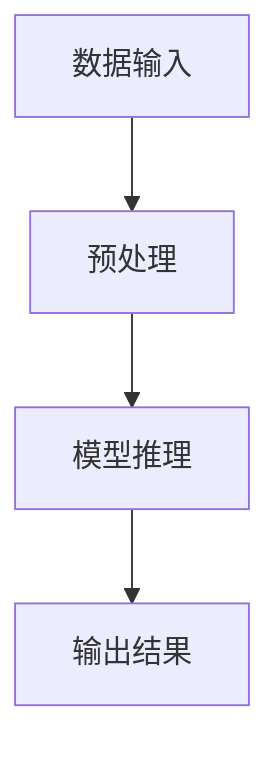

                 

关键词：TensorRT、深度学习、优化库、推理加速、人工智能

摘要：本文将深入探讨TensorRT优化库，一个专为加速深度学习推理而设计的工具。我们将从背景介绍、核心概念与联系、核心算法原理与具体操作步骤、数学模型与公式、项目实践、实际应用场景、未来应用展望以及工具和资源推荐等多个角度，全面解析TensorRT优化库的各个方面。

## 1. 背景介绍

随着深度学习的迅猛发展，大规模深度学习模型的推理任务变得越来越复杂。然而，在实际应用中，推理速度直接关系到用户体验和系统性能。为了解决这一问题，NVIDIA 推出了TensorRT，一个高性能的深度学习推理优化库。

TensorRT 利用NVIDIA GPU的强大计算能力，通过一系列优化技术，将深度学习模型的推理速度提升到极致。它支持多种深度学习框架，如TensorFlow、PyTorch等，使得开发者可以轻松地将训练好的模型部署到NVIDIA GPU上进行推理。

## 2. 核心概念与联系

在深入探讨TensorRT之前，我们需要了解一些核心概念，如深度学习推理、模型优化、GPU加速等。

### 深度学习推理

深度学习推理是指将训练好的模型应用于新的数据上，以预测新的数据标签的过程。与训练过程不同，推理过程不需要更新模型参数，只需将输入数据通过模型计算得到输出结果。

### 模型优化

模型优化是指通过一系列技术手段，提高深度学习模型的推理速度和性能。这包括模型量化、剪枝、层间融合等技术。

### GPU加速

GPU（图形处理单元）具有高并行计算能力，非常适合深度学习推理任务。通过将推理任务分布到GPU的多核上，可以实现显著的加速效果。

### Mermaid 流程图

以下是一个简单的Mermaid流程图，展示了深度学习推理的基本流程：



## 3. 核心算法原理与具体操作步骤

### 3.1 算法原理概述

TensorRT的核心算法主要包括以下几个步骤：

1. **模型转换**：将训练好的模型转换为TensorRT支持的格式。
2. **模型优化**：对模型进行优化，包括量化、剪枝、层间融合等。
3. **模型加载**：将优化后的模型加载到GPU上。
4. **推理执行**：执行推理任务，并输出结果。

### 3.2 算法步骤详解

#### 3.2.1 模型转换

TensorRT支持多种深度学习框架的模型格式，如TensorFlow、PyTorch等。通过使用TensorRT的转换工具，可以将这些模型转换为TensorRT支持的格式。

```python
import tensorflow as tf
import tensorrt as trt

# 加载TensorFlow模型
model = tf.keras.models.load_model('model.h5')

# 转换为TensorRT模型
trt_model = trt.tensorflow.keras.engine.from_config(model.get_config(), backend='tensorrt')
```

#### 3.2.2 模型优化

TensorRT提供了多种优化技术，如量化、剪枝、层间融合等。通过这些技术，可以显著提高模型的推理速度和性能。

```python
import tensorrt as trt

# 创建TensorRT builder
builder = trt.Builder(trt.Logger())

# 构建TensorRT模型
engine = builder.build_engine(trt_model, max_batch_size=1)

# 量化模型
量化器 = trt量化器(engine)
量化器.set量化参数()
量化器.apply量化()

# 剪枝模型
剪枝器 = trt剪枝器(engine)
剪枝器.set剪枝参数()
剪枝器.apply剪枝()

# 层间融合
融合器 = trt层间融合器(engine)
融合器.set融合参数()
融合器.apply融合()
```

#### 3.2.3 模型加载

将优化后的TensorRT模型加载到GPU上，以便执行推理任务。

```python
# 创建TensorRT runtime
runtime = trt.Runtime(trt.Logger())

# 创建TensorRT engine
engine = runtime.create_engine(engine)

# 加载模型到GPU
context = engine.create_execution_context()

# 准备输入数据
input_data = ...

# 执行推理
output_data = context.execute_async(batch_size=1, inputs=input_data)
```

### 3.3 算法优缺点

**优点**：

- 高效的推理速度，通过GPU加速，显著提高深度学习模型的推理性能。
- 支持多种深度学习框架，如TensorFlow、PyTorch等。
- 提供丰富的优化技术，如量化、剪枝、层间融合等。

**缺点**：

- 对模型的兼容性有一定要求，需要使用支持TensorRT的深度学习框架。
- 模型优化过程可能需要一定的调整和优化。

### 3.4 算法应用领域

TensorRT优化库在多个领域具有广泛的应用，如计算机视觉、自然语言处理、语音识别等。以下是一些具体的应用场景：

- **图像识别**：在边缘设备上实时识别图像，如智能摄像头、自动驾驶等。
- **语音识别**：在语音识别系统中实现实时语音识别，提高用户体验。
- **自然语言处理**：在自然语言处理任务中，实现高效的文本分类、命名实体识别等。

## 4. 数学模型和公式 & 详细讲解 & 举例说明

在TensorRT优化过程中，数学模型和公式起着关键作用。以下是一个简单的数学模型和公式的例子：

### 4.1 数学模型构建

假设我们有一个简单的线性模型：

$$y = wx + b$$

其中，$w$ 是权重矩阵，$x$ 是输入向量，$b$ 是偏置项。

### 4.2 公式推导过程

通过梯度下降法，我们可以更新权重矩阵和偏置项：

$$w = w - \alpha \frac{\partial L}{\partial w}$$

$$b = b - \alpha \frac{\partial L}{\partial b}$$

其中，$L$ 是损失函数，$\alpha$ 是学习率。

### 4.3 案例分析与讲解

假设我们有一个二分类问题，使用交叉熵损失函数。我们可以通过以下步骤进行优化：

1. **初始化权重和偏置**：随机初始化权重和偏置。
2. **计算损失函数**：计算当前模型的损失函数值。
3. **计算梯度**：计算损失函数关于权重和偏置的梯度。
4. **更新参数**：使用梯度下降法更新权重和偏置。
5. **重复步骤2-4**，直到收敛。

以下是一个简单的代码示例：

```python
import tensorflow as tf

# 初始化模型参数
w = tf.Variable(tf.random.normal([10, 1]))
b = tf.Variable(tf.random.normal([1]))

# 定义损失函数
def loss_function(y_true, y_pred):
    return tf.reduce_mean(tf.nn.softmax_cross_entropy_with_logits(labels=y_true, logits=y_pred))

# 定义优化器
optimizer = tf.optimizers.SGD(learning_rate=0.01)

# 训练模型
for epoch in range(100):
    # 获取批量数据
    x_batch, y_batch = ...

    # 前向传播
    y_pred = tf.matmul(x_batch, w) + b

    # 计算损失
    loss = loss_function(y_batch, y_pred)

    # 反向传播
    with tf.GradientTape() as tape:
        loss = loss_function(y_batch, y_pred)
    grads = tape.gradient(loss, [w, b])

    # 更新参数
    optimizer.apply_gradients(zip(grads, [w, b]))

    # 打印训练进度
    print(f'Epoch {epoch+1}, Loss: {loss.numpy()}')
```

## 5. 项目实践：代码实例和详细解释说明

为了更好地理解TensorRT优化库的使用，我们将通过一个简单的项目来展示其实际应用。

### 5.1 开发环境搭建

1. 安装TensorRT：
   ```bash
   pip install tensorrt
   ```

2. 安装NVIDIA CUDA工具包和驱动程序。

### 5.2 源代码详细实现

以下是一个简单的TensorRT推理项目的示例代码：

```python
import tensorflow as tf
import tensorrt as trt

# 加载TensorFlow模型
model = tf.keras.models.load_model('model.h5')

# 转换为TensorRT模型
trt_model = trt.tensorflow.keras.engine.from_config(model.get_config(), backend='tensorrt')

# 构建TensorRT引擎
builder = trt.Builder(trt.Logger())
engine = builder.build_engine(trt_model, max_batch_size=1)

# 创建TensorRT运行时
runtime = trt.Runtime(trt.Logger())

# 创建TensorRT引擎上下文
context = engine.create_execution_context()

# 准备输入数据
input_data = ...

# 执行推理
output_data = context.execute_async(batch_size=1, inputs=input_data)

# 获取输出结果
output = output_data.as_numpy()

print(output)
```

### 5.3 代码解读与分析

1. **加载TensorFlow模型**：使用TensorFlow的`load_model`函数加载已经训练好的模型。
2. **转换为TensorRT模型**：使用TensorRT的`from_config`函数将TensorFlow模型转换为TensorRT模型。
3. **构建TensorRT引擎**：使用TensorRT的`Builder`类构建TensorRT引擎，指定优化参数和最大批量大小。
4. **创建TensorRT运行时**：使用TensorRT的`Runtime`类创建TensorRT运行时。
5. **创建TensorRT引擎上下文**：使用TensorRT引擎的`create_execution_context`方法创建TensorRT引擎上下文。
6. **准备输入数据**：准备输入数据，通常是从文件读取或从其他数据源获取。
7. **执行推理**：使用TensorRT引擎上下文的`execute_async`方法执行推理。
8. **获取输出结果**：从执行结果中获取输出数据。

### 5.4 运行结果展示

运行上述代码后，我们将得到模型对输入数据的推理结果。根据具体的应用场景，这些结果可以用于各种任务，如图像分类、目标检测等。

## 6. 实际应用场景

TensorRT优化库在多个实际应用场景中具有显著的优势。以下是一些典型的应用场景：

- **自动驾驶**：在自动驾驶系统中，TensorRT可以用于实时图像识别和目标检测，提高系统的响应速度和准确率。
- **智能监控**：在智能监控系统中，TensorRT可以用于实时图像分析，实现快速的人脸识别、行为识别等功能。
- **医疗诊断**：在医疗诊断领域，TensorRT可以用于快速处理医学影像，提高诊断速度和准确率。

## 7. 未来应用展望

随着深度学习技术的不断发展和应用场景的扩大，TensorRT优化库的未来应用前景十分广阔。以下是一些可能的发展方向：

- **更高效的优化算法**：未来可能开发出更高效的优化算法，进一步提高推理速度和性能。
- **跨平台支持**：未来可能会增加对更多平台的支持，如ARM架构的移动设备等。
- **自动优化工具**：开发自动化的模型优化工具，简化优化过程，降低使用门槛。

## 8. 工具和资源推荐

为了更好地学习和使用TensorRT优化库，以下是一些建议的工具和资源：

- **官方文档**：NVIDIA提供的TensorRT官方文档，是学习TensorRT的最佳资源。
- **在线教程**：许多网站和博客提供了关于TensorRT的在线教程和案例，可以深入了解TensorRT的使用。
- **GitHub仓库**：在GitHub上可以找到许多开源的TensorRT项目，这些项目提供了实用的代码示例和最佳实践。

## 9. 总结：未来发展趋势与挑战

TensorRT优化库在加速深度学习推理方面取得了显著成果。未来，随着深度学习技术的不断发展，TensorRT将继续发挥重要作用。然而，也面临着一些挑战，如对模型的兼容性要求、优化算法的效率提升等。通过持续的研究和优化，TensorRT有望在未来实现更高的性能和更广泛的应用。

### 附录：常见问题与解答

**Q：TensorRT支持哪些深度学习框架？**

A：TensorRT支持多种深度学习框架，如TensorFlow、PyTorch、Caffe等。

**Q：如何将TensorFlow模型转换为TensorRT模型？**

A：可以使用TensorFlow的`tf.keras`接口，通过`from_config`函数将TensorFlow模型转换为TensorRT模型。

**Q：TensorRT优化库是否支持移动设备？**

A：是的，TensorRT支持移动设备，如ARM架构的智能手机和平板电脑。

**Q：如何优化TensorRT模型的性能？**

A：可以通过量化、剪枝、层间融合等技术来优化TensorRT模型的性能。

---

作者：禅与计算机程序设计艺术 / Zen and the Art of Computer Programming

