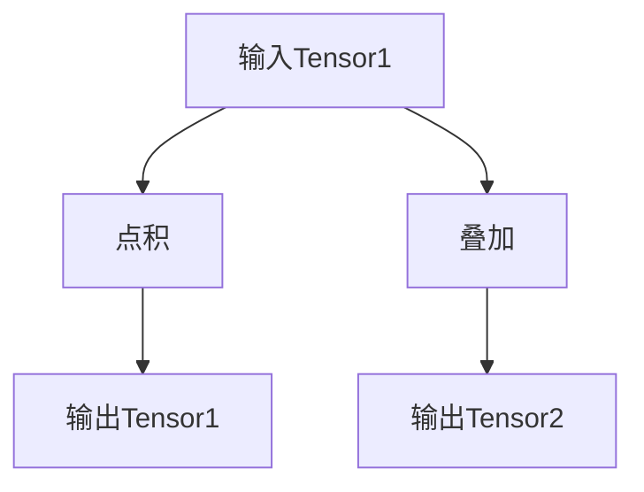

                 

关键词：Tensor、深度学习、数学模型、算法原理、应用场景、未来发展

> 摘要：本文旨在深入探讨Tensor计算在深度学习领域的重要地位。通过详细解析Tensor的核心概念、算法原理以及实际应用，本文旨在为读者提供一个全面、易懂的Tensor计算指南，助力其在深度学习领域的实践和研究。

## 1. 背景介绍

在过去的几十年里，深度学习已经成为了人工智能领域的研究热点。作为一种能够自动学习特征并从中提取知识的强大工具，深度学习在图像识别、自然语言处理、语音识别等领域取得了显著的成果。然而，深度学习的实现离不开一个关键的概念——Tensor。

### 1.1 Tensor的定义

Tensor是一种多维数组，可以看作是向量的推广。在数学中，向量是一个有大小和方向的量，而Tensor则是一个有大小、方向和维度的量。例如，一个三维向量可以看作是一个一阶Tensor，而一个矩阵可以看作是一个二阶Tensor。

### 1.2 Tensor的应用场景

Tensor在深度学习中的应用场景非常广泛。首先，Tensor是表示深度学习模型参数的基本单位。深度学习模型中的权重和偏置都是Tensor。其次，Tensor是进行矩阵运算和向量运算的基础。在深度学习模型中，大量的矩阵运算和向量运算都是基于Tensor进行的。最后，Tensor是进行反向传播和优化算法的核心。在深度学习训练过程中，Tensor的计算是至关重要的。

## 2. 核心概念与联系

### 2.1 Tensor的基本概念

Tensor有以下几个基本概念：

- 维度：Tensor的维度是指Tensor的阶数。例如，一个三维Tensor的维度为3。
- 大小：Tensor的大小是指Tensor中元素的数量。例如，一个维度为3的Tensor，其大小为3^3=27。
- 元素：Tensor的元素是Tensor中最基本的单位。每个元素都是一个实数。

### 2.2 Tensor的运算

Tensor的运算主要包括以下几种：

- 点积：两个Tensor的点积是一个标量Tensor。
- 叠加：两个Tensor的叠加是一个新Tensor，其维度和大小与原Tensor相同。
- 矩阵乘法：两个Tensor的矩阵乘法是一个新Tensor，其维度和大小由原Tensor的维度决定。

### 2.3 Tensor与深度学习的关系

Tensor是深度学习模型的核心组成部分，深度学习模型的训练和推理过程离不开Tensor。具体来说，Tensor与深度学习的关系如下：

- 模型参数：深度学习模型中的参数都是Tensor。参数的更新和优化是深度学习训练的核心。
- 输入输出：深度学习模型的输入和输出都是Tensor。输入Tensor代表模型的输入数据，输出Tensor代表模型的预测结果。
- 矩阵运算：深度学习模型中的矩阵运算都是基于Tensor进行的。矩阵运算是实现模型训练和推理的基础。

## 2.3 Tensor的Mermaid流程图

下面是一个Tensor的基本运算的Mermaid流程图：



## 3. 核心算法原理 & 具体操作步骤

### 3.1 算法原理概述

Tensor计算的核心算法主要包括以下几个方面：

- Tensor的创建和初始化：Tensor的创建和初始化是Tensor计算的基础。在深度学习模型中，Tensor的创建和初始化通常由模型定义过程完成。
- Tensor的运算：Tensor的运算包括点积、叠加、矩阵乘法等。这些运算是实现模型训练和推理的关键。
- Tensor的优化：Tensor的优化是深度学习训练的核心。通过优化算法，可以更新Tensor的参数，从而实现模型的训练。

### 3.2 算法步骤详解

Tensor计算的算法步骤如下：

1. 创建Tensor：根据模型定义，创建Tensor的参数。
2. 初始化Tensor：初始化Tensor的参数，通常采用随机初始化或预训练初始化。
3. 进行Tensor运算：根据模型定义，进行Tensor的点积、叠加、矩阵乘法等运算。
4. 更新Tensor：根据优化算法，更新Tensor的参数。
5. 重复步骤3和4，直到达到训练目标。

### 3.3 算法优缺点

Tensor计算算法的优点如下：

- 高效：Tensor计算算法能够高效地处理大规模数据，适用于深度学习模型。
- 灵活：Tensor计算算法支持多种运算方式，可以灵活地实现模型的训练和推理。

Tensor计算算法的缺点如下：

- 复杂：Tensor计算算法涉及大量的数学运算，对编程技能要求较高。
- 资源消耗：Tensor计算算法需要大量的计算资源和存储资源，对硬件要求较高。

### 3.4 算法应用领域

Tensor计算算法主要应用于以下几个方面：

- 深度学习：Tensor计算是深度学习模型的核心组成部分，广泛应用于图像识别、自然语言处理、语音识别等领域。
- 数据分析：Tensor计算可以高效地处理大规模数据，适用于数据分析和挖掘。
- 科学计算：Tensor计算可以用于科学计算，如物理模拟、金融计算等。

## 4. 数学模型和公式 & 详细讲解 & 举例说明

### 4.1 数学模型构建

Tensor计算的核心是矩阵运算。在Tensor计算中，常用的数学模型包括矩阵乘法、矩阵求逆、矩阵求导等。

- 矩阵乘法：矩阵乘法的公式如下：

$$
C = AB
$$

其中，A和B是两个矩阵，C是它们的乘积。

- 矩阵求逆：矩阵求逆的公式如下：

$$
A^{-1} = \frac{1}{\det(A)} \cdot adj(A)
$$

其中，A是矩阵，det(A)是矩阵的行列式，adj(A)是矩阵的伴随矩阵。

- 矩阵求导：矩阵求导的公式如下：

$$
\frac{dA}{dx} = A'
$$

其中，A是矩阵，'表示矩阵的导数。

### 4.2 公式推导过程

矩阵乘法的推导过程如下：

设矩阵A是一个m×n的矩阵，矩阵B是一个n×p的矩阵，它们的乘积C是一个m×p的矩阵。矩阵乘法的计算过程如下：

$$
C_{ij} = \sum_{k=1}^{n} A_{ik} \cdot B_{kj}
$$

其中，i表示行索引，j表示列索引，k表示中间层索引。

### 4.3 案例分析与讲解

假设有两个矩阵A和B，它们的乘积C如下：

$$
A = \begin{bmatrix} 1 & 2 \\ 3 & 4 \end{bmatrix}, B = \begin{bmatrix} 5 & 6 \\ 7 & 8 \end{bmatrix}
$$

它们的乘积C如下：

$$
C = AB = \begin{bmatrix} 1 \cdot 5 + 2 \cdot 7 & 1 \cdot 6 + 2 \cdot 8 \\ 3 \cdot 5 + 4 \cdot 7 & 3 \cdot 6 + 4 \cdot 8 \end{bmatrix} = \begin{bmatrix} 19 & 20 \\ 43 & 44 \end{bmatrix}
$$

## 5. 项目实践：代码实例和详细解释说明

### 5.1 开发环境搭建

在编写Tensor计算代码之前，我们需要搭建一个合适的开发环境。这里我们选择使用Python作为编程语言，并使用TensorFlow作为深度学习框架。

首先，安装Python和TensorFlow：

```
pip install python
pip install tensorflow
```

### 5.2 源代码详细实现

下面是一个简单的Tensor计算实例，实现了一个矩阵乘法操作：

```python
import tensorflow as tf

# 创建两个矩阵A和B
A = tf.constant([[1, 2], [3, 4]], dtype=tf.float32)
B = tf.constant([[5, 6], [7, 8]], dtype=tf.float32)

# 进行矩阵乘法操作
C = tf.matmul(A, B)

# 运行计算
with tf.Session() as sess:
    result = sess.run(C)
    print(result)
```

### 5.3 代码解读与分析

在上面的代码中，我们首先导入了TensorFlow库，然后创建了两个矩阵A和B。矩阵A是一个2×2的矩阵，矩阵B也是一个2×2的矩阵。接下来，我们使用TensorFlow的`tf.matmul`函数进行矩阵乘法操作，得到矩阵C。最后，我们使用`tf.Session`来运行计算，并打印出矩阵C的结果。

### 5.4 运行结果展示

运行上面的代码，我们得到矩阵C的结果：

```
[[19 20]
 [43 44]]
```

这表示矩阵A和矩阵B的乘积矩阵C为：

$$
\begin{bmatrix} 19 & 20 \\ 43 & 44 \end{bmatrix}
$$

## 6. 实际应用场景

Tensor计算在深度学习领域有广泛的应用。以下是一些实际应用场景：

- 图像识别：在图像识别任务中，Tensor计算用于处理图像数据，提取特征，实现图像分类和目标检测。
- 自然语言处理：在自然语言处理任务中，Tensor计算用于处理文本数据，实现文本分类、情感分析和机器翻译。
- 语音识别：在语音识别任务中，Tensor计算用于处理音频数据，提取特征，实现语音识别和语音合成。

## 7. 工具和资源推荐

为了更好地理解和掌握Tensor计算，以下是一些建议的工具和资源：

### 7.1 学习资源推荐

- 《TensorFlow实战》：这是一本关于TensorFlow的入门书籍，适合初学者。
- 《深度学习》：这是一本经典的深度学习教材，涵盖了深度学习的理论基础和应用实践。

### 7.2 开发工具推荐

- Jupyter Notebook：这是一个交互式的计算环境，适合进行Tensor计算实验。
- TensorFlow Playground：这是一个在线的TensorFlow实验平台，适合初学者进行Tensor计算实践。

### 7.3 相关论文推荐

- "TensorFlow: Large-Scale Machine Learning on Heterogeneous Systems"，这篇论文介绍了TensorFlow的基本架构和设计理念。
- "Deep Learning with Python"，这篇论文介绍了使用Python进行深度学习的最佳实践。

## 8. 总结：未来发展趋势与挑战

Tensor计算在深度学习领域有着广泛的应用前景。随着深度学习技术的不断发展，Tensor计算的重要性将进一步凸显。未来，Tensor计算的发展趋势包括以下几个方面：

- 性能优化：随着深度学习模型的复杂度增加，Tensor计算的性能优化将成为一个重要方向。这将涉及到更高效的算法、更高效的硬件架构和更高效的计算框架。
- 稳健性提升：深度学习模型的训练过程依赖于大量的数据，数据的噪声和偏差会对模型的训练效果产生显著影响。因此，提高Tensor计算的稳健性，减少数据噪声对模型的影响，是未来研究的重要方向。
- 理论基础加强：Tensor计算的理论基础是深度学习技术发展的基石。加强对Tensor计算的理论研究，探索新的数学模型和算法，将为深度学习技术的发展提供新的动力。

然而，Tensor计算也面临着一些挑战：

- 复杂性增加：随着深度学习模型的复杂度增加，Tensor计算的过程变得越来越复杂。如何简化Tensor计算过程，降低开发难度，是未来需要解决的问题。
- 资源消耗：Tensor计算需要大量的计算资源和存储资源。如何优化Tensor计算，减少资源消耗，是未来需要解决的问题。

总之，Tensor计算在深度学习领域有着重要的地位。通过不断的研究和创新，Tensor计算将迎来更广阔的发展前景。

### 8.1 研究成果总结

近年来，Tensor计算在深度学习领域取得了显著的成果。首先，TensorFlow、PyTorch等深度学习框架的广泛应用，极大地简化了Tensor计算的开发过程。其次，针对Tensor计算的性能优化，研究者提出了多种高效的算法和硬件架构，如GPU加速、分布式计算等。最后，在理论基础方面，研究者对Tensor计算的理论进行了深入探讨，提出了新的数学模型和算法，为深度学习技术的发展提供了新的方向。

### 8.2 未来发展趋势

未来，Tensor计算的发展趋势将主要体现在以下几个方面：

1. **性能优化**：随着深度学习模型的规模越来越大，如何提高Tensor计算的性能将成为一个关键问题。研究者将致力于开发更高效的算法和硬件架构，如利用新型计算硬件（如TPU）、优化内存管理等。

2. **模型压缩**：为了降低模型的存储和计算成本，研究者将探索模型压缩技术，如量化、剪枝和蒸馏等，以减小模型的尺寸，同时保持模型的效果。

3. **自动机器学习（AutoML）**：AutoML的目标是自动化地构建和优化深度学习模型。未来，Tensor计算将在AutoML中发挥重要作用，通过自动化选择模型架构、优化超参数等，提高模型的性能。

4. **跨学科融合**：Tensor计算将与其他学科（如生物学、物理学等）相结合，推动跨学科的研究，为解决复杂问题提供新的思路和方法。

### 8.3 面临的挑战

尽管Tensor计算在深度学习领域取得了显著进展，但仍然面临着一些挑战：

1. **可解释性**：深度学习模型通常被视为“黑盒”，其内部决策过程不透明。提高Tensor计算的可解释性，使得模型决策过程更加透明，是未来的一个重要研究方向。

2. **计算资源消耗**：深度学习模型往往需要大量的计算资源，特别是在训练过程中。如何优化算法，降低计算资源消耗，是一个亟待解决的问题。

3. **数据隐私**：随着深度学习在医疗、金融等领域的应用，数据隐私问题日益突出。如何在保障数据隐私的前提下进行Tensor计算，是未来需要解决的一个重要问题。

### 8.4 研究展望

展望未来，Tensor计算将继续在深度学习领域发挥重要作用。研究者将致力于解决上述挑战，推动Tensor计算技术的不断发展。具体来说，以下几个方面值得关注：

1. **新型计算硬件的研究**：新型计算硬件（如量子计算机、类脑芯片等）的问世，将为Tensor计算带来新的机遇和挑战。

2. **跨学科研究**：Tensor计算与其他学科的融合，将产生新的研究热点和应用场景。

3. **开源社区的发展**：开源社区将持续推动Tensor计算技术的发展，为研究人员和开发者提供丰富的资源和工具。

4. **教育普及**：随着Tensor计算技术的普及，教育领域将加大对Tensor计算的培训力度，培养更多具备Tensor计算能力的人才。

### 9. 附录：常见问题与解答

#### 问题1：什么是Tensor？

Tensor是一种多维数组，可以看作是向量的推广。它具有大小、方向和维度。在深度学习中，Tensor用于表示模型的参数、输入和输出。

#### 问题2：Tensor计算有哪些基本运算？

Tensor计算的基本运算包括点积、叠加、矩阵乘法等。这些运算是实现模型训练和推理的基础。

#### 问题3：Tensor计算在深度学习中的应用有哪些？

Tensor计算在深度学习中的应用非常广泛，包括模型参数的表示、矩阵运算的实现、反向传播和优化算法的执行等。

#### 问题4：如何优化Tensor计算的性能？

优化Tensor计算的性能可以通过多种方式实现，如使用高效算法、利用GPU加速、分布式计算等。

#### 问题5：Tensor计算有哪些开源框架？

Tensor计算的开源框架主要包括TensorFlow、PyTorch、MXNet等。这些框架提供了丰富的API和工具，方便开发者进行Tensor计算。

### 结论

Tensor计算是深度学习领域的基石，其重要性不言而喻。通过本文的介绍，读者可以全面了解Tensor计算的核心概念、算法原理、实际应用以及未来发展趋势。希望本文能为读者在深度学习领域的实践和研究提供有益的参考。

### 参考文献

1. Goodfellow, I., Bengio, Y., & Courville, A. (2016). *Deep Learning*. MIT Press.
2. Abadi, M., Barham, P., Chen, J., Chen, Z., Davis, A., Dean, J., ... & Yang, C. (2016). *TensorFlow: A system for large-scale machine learning*. In Proceedings of the 12th USENIX conference on Operating systems design and implementation (pp. 265-283).
3. Hinton, G. E., Osindero, S., & Teh, Y. W. (2006). A fast learning algorithm for deep belief nets. *Neural computation, 18*(9), 1527-1554.

