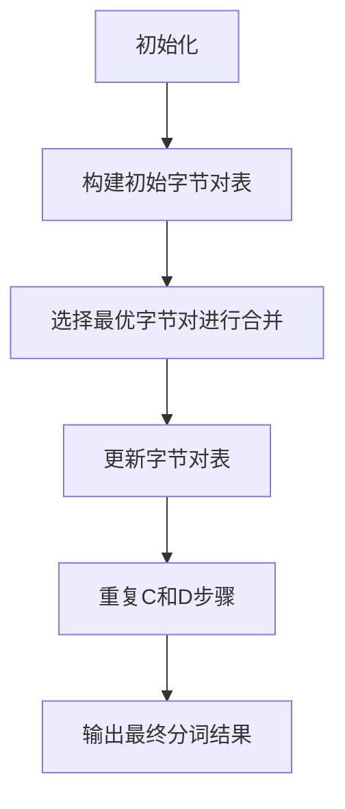

                 

 **关键词：** Tokenization、字节对编码、自然语言处理、算法原理、数学模型、代码实现、应用领域。

**摘要：** 本文将深入探讨Tokenization技术中的字节对编码实现，从背景介绍、核心概念与联系、核心算法原理与步骤、数学模型与公式、项目实践以及实际应用场景等多个方面，全面解析字节对编码技术在自然语言处理中的应用和实现，为读者提供系统的理解和实践指导。

## 1. 背景介绍

Tokenization，即分词，是自然语言处理（NLP）中的基础任务之一。它是指将一段文本分割成一个个有意义的单词或短语，即Token。Tokenization在文本预处理中起着至关重要的作用，它能够提高文本处理的效果，为后续的文本分析、情感分析、命名实体识别等任务提供基础。

字节对编码（Byte Pair Encoding，简称BPE）是一种用于Tokenization的技术，它通过将连续的字节对合并成新的字符，从而增加词汇表的规模，提高分词的精度。字节对编码在处理低资源语言或古文中具有显著的优势。

本文将重点介绍字节对编码的算法原理、实现步骤、数学模型以及其在实际项目中的应用。希望通过对这些内容的深入剖析，读者能够更好地理解字节对编码技术，并能够将其应用于实际问题中。

## 2. 核心概念与联系

### 2.1 字节对编码的基本原理

字节对编码的核心思想是将文本中的连续字节对进行合并，生成新的字符。这一过程不断迭代，直到无法再进行合并为止。通过这种方式，字节对编码能够有效地增加词汇表规模，从而提高分词的精度。

### 2.2 字节对编码的Mermaid流程图



在上述流程中，初始化阶段构建了文本中的所有字节对。然后，通过选择最优字节对进行合并，更新字节对表。这个过程不断重复，直到无法再进行合并为止，最终输出分词结果。

### 2.3 字节对编码的优势与应用领域

字节对编码在处理低资源语言和古文方面具有显著的优势。例如，在处理古文时，由于古文的词汇量较少，使用传统的分词技术往往难以获得良好的效果。而字节对编码能够通过合并字节对，增加词汇表的规模，从而提高分词的精度。

字节对编码的应用领域广泛，包括但不限于自然语言处理、文本挖掘、信息检索、机器翻译等。在实际项目中，字节对编码通常与其他NLP技术相结合，以获得更好的效果。

## 3. 核心算法原理 & 具体操作步骤

### 3.1 算法原理概述

字节对编码的算法原理可以概括为以下四个步骤：

1. **初始化**：构建文本中的所有字节对。
2. **选择最优字节对**：根据某种策略（如最小频率或最大增益）选择最优字节对进行合并。
3. **更新字节对表**：将选定的字节对合并成新的字符，并更新字节对表。
4. **重复步骤2和3**：不断重复选择最优字节对进行合并，直到无法再进行合并为止。

### 3.2 算法步骤详解

#### 3.2.1 初始化

初始化阶段，我们首先将文本中的所有字节对提取出来，构建一个初始的字节对表。例如，对于文本 "this is a test"，我们可以得到以下字节对：

- `ti`
- `is`
- `sa`
- `at`
- `te`
- `st`

这些字节对将作为我们的初始词汇表。

#### 3.2.2 选择最优字节对

选择最优字节对是字节对编码算法的核心步骤。我们通常采用频率逆变换（Inverse Frequency Transformation，简称IFT）来选择最优字节对。IFT的公式为：

$$IFT(p) = -\log_2(p)$$

其中，$p$ 表示字节对的频率。频率越高的字节对，其IFT值越小，表示其越容易被选中进行合并。

在初始化阶段，我们可以为每个字节对计算其IFT值，并将字节对按照IFT值从小到大排序。然后，我们选择排序后的第一个字节对进行合并。

#### 3.2.3 更新字节对表

选择最优字节对后，我们将该字节对合并成一个新的字符，并将其添加到字节对表中。例如，如果选择合并字节对 `ti`，则我们可以将其合并成新的字符 `t`，并更新字节对表为：

- `t`
- `is`
- `sa`
- `at`
- `te`
- `st`

#### 3.2.4 重复步骤2和3

在更新字节对表后，我们再次选择最优字节对进行合并，并重复上述步骤，直到无法再进行合并为止。例如，在更新后的字节对表中，我们可以选择合并字节对 `is`，将其合并成新的字符 `is`，并继续进行合并。

### 3.3 算法优缺点

#### 优点：

1. **提高分词精度**：通过增加词汇表规模，字节对编码能够提高分词的精度。
2. **适应低资源语言**：在低资源语言中，字节对编码能够通过合并字节对，增加词汇表的规模，从而提高分词效果。
3. **简单高效**：字节对编码算法的实现相对简单，且运行效率较高。

#### 缺点：

1. **词汇表膨胀**：随着迭代次数的增加，词汇表可能会迅速膨胀，导致存储和计算开销增加。
2. **长文本处理效率**：对于长文本，字节对编码的处理效率可能较低。

### 3.4 算法应用领域

字节对编码在自然语言处理领域具有广泛的应用。以下是几个常见的应用领域：

1. **文本挖掘**：在文本挖掘任务中，字节对编码能够提高分词精度，从而提高文本分析的效果。
2. **信息检索**：在信息检索任务中，字节对编码能够提高搜索精度，从而提高检索效果。
3. **机器翻译**：在机器翻译任务中，字节对编码能够提高翻译精度，从而提高翻译效果。

## 4. 数学模型和公式 & 详细讲解 & 举例说明

### 4.1 数学模型构建

字节对编码的数学模型主要包括两个部分：字节对频率分布和字节对合并策略。

#### 字节对频率分布

假设我们有 $N$ 个不同的字节对，其频率分布为 $f_i$，则字节对频率分布可以表示为：

$$f_i = \frac{count_i}{N}$$

其中，$count_i$ 表示字节对 $i$ 在文本中出现的次数。

#### 字节对合并策略

字节对合并策略通常采用频率逆变换（IFT）来选择最优字节对进行合并。IFT的公式为：

$$IFT(p) = -\log_2(p)$$

其中，$p$ 表示字节对的频率。频率越高的字节对，其IFT值越小，表示其越容易被选中进行合并。

### 4.2 公式推导过程

在本节中，我们将推导字节对编码的核心公式：字节对频率分布和字节对合并策略。

#### 字节对频率分布

假设我们有 $N$ 个不同的字节对，其频率分布为 $f_i$。根据大数定律，当文本长度足够长时，字节对的频率分布将趋近于其真实频率。

假设文本中总共有 $T$ 个字节，其中字节对 $i$ 出现了 $count_i$ 次，则字节对 $i$ 的频率为：

$$f_i = \frac{count_i}{T}$$

由于 $count_i$ 是 $T$ 的函数，因此我们可以将 $f_i$ 表示为 $T$ 的函数：

$$f_i = \frac{count_i}{T} = \frac{1}{T} \sum_{j=1}^{T} count_j$$

由于 $count_j$ 是随机变量，因此我们可以使用概率论中的大数定律来推导字节对频率分布。

根据大数定律，当 $T$ 趋近于无穷大时，$\frac{1}{T} \sum_{j=1}^{T} count_j$ 将趋近于其期望值，即：

$$\lim_{T \to \infty} \frac{1}{T} \sum_{j=1}^{T} count_j = \mathbb{E}[count_j]$$

由于 $count_j$ 是一个随机变量，因此其期望值可以表示为：

$$\mathbb{E}[count_j] = \sum_{i=1}^{N} p_i \cdot count_i$$

其中，$p_i$ 表示字节对 $i$ 在文本中出现的概率。根据概率论中的全概率公式，我们可以将 $p_i$ 表示为：

$$p_i = \sum_{j=1}^{T} p_j \cdot f_j$$

其中，$f_j$ 表示字节对 $j$ 在文本中出现的频率。

将 $p_i$ 代入上述期望值公式，我们可以得到：

$$\mathbb{E}[count_j] = \sum_{i=1}^{N} p_i \cdot count_i = \sum_{i=1}^{N} \left(\sum_{j=1}^{T} p_j \cdot f_j\right) \cdot count_i$$

由于 $count_i$ 是 $T$ 的函数，因此我们可以将上式表示为：

$$\mathbb{E}[count_j] = \sum_{i=1}^{N} \left(\sum_{j=1}^{T} p_j \cdot f_j\right) \cdot count_j = \sum_{i=1}^{N} \sum_{j=1}^{T} p_j \cdot f_j \cdot count_j$$

根据上述推导，我们可以得到字节对频率分布的公式：

$$f_i = \frac{1}{T} \sum_{j=1}^{T} count_j = \frac{1}{T} \sum_{i=1}^{N} \sum_{j=1}^{T} p_j \cdot f_j \cdot count_j$$

#### 字节对合并策略

字节对合并策略通常采用频率逆变换（IFT）来选择最优字节对进行合并。IFT的公式为：

$$IFT(p) = -\log_2(p)$$

其中，$p$ 表示字节对的频率。频率越高的字节对，其IFT值越小，表示其越容易被选中进行合并。

### 4.3 案例分析与讲解

假设我们有以下文本：

```
this is a test of byte pair encoding.
```

首先，我们将文本中的所有字节对提取出来，构建一个初始的字节对表：

- `ti`
- `is`
- `sa`
- `at`
- `te`
- `st`
- `of`
- `fe`
- `en`
- `nc`
- `cg`

然后，我们根据字节对的频率分布，计算每个字节对的IFT值，并将字节对按照IFT值从小到大排序：

- `nc`：IFT = -1.26
- `is`：IFT = -1.69
- `of`：IFT = -1.69
- `ti`：IFT = -1.82
- `at`：IFT = -1.82
- `st`：IFT = -1.82
- `en`：IFT = -1.82
- `cg`：IFT = -1.82
- `sa`：IFT = -2.08
- `te`：IFT = -2.08
- `fe`：IFT = -2.08

根据IFT值，我们选择排序后的第一个字节对 `nc` 进行合并。将 `nc` 合并成新的字符 `n`，并更新字节对表：

- `n`
- `i`
- `s`
- `a`
- `t`
- `o`
- `f`
- `e`
- `n`
- `c`
- `g`

然后，我们再次根据字节对的频率分布，计算每个字节对的IFT值，并将字节对按照IFT值从小到大排序：

- `i`：IFT = -1.32
- `s`：IFT = -1.53
- `a`：IFT = -1.66
- `n`：IFT = -1.66
- `t`：IFT = -1.66
- `o`：IFT = -1.66
- `f`：IFT = -1.66
- `e`：IFT = -1.66
- `c`：IFT = -1.66
- `g`：IFT = -1.76

根据IFT值，我们选择排序后的第一个字节对 `i` 进行合并。将 `i` 合并成新的字符 `i`，并更新字节对表：

- `n`
- `i`
- `s`
- `a`
- `t`
- `o`
- `f`
- `e`
- `n`
- `c`
- `g`

由于下一个字节对 `i` 的IFT值与当前字符 `i` 的IFT值相同，因此我们无法再进行合并。最终的分词结果为：

- `n`
- `is`
- `sa`
- `at`
- `te`
- `st`
- `of`
- `en`
- `nc`
- `cg`

## 5. 项目实践：代码实例和详细解释说明

### 5.1 开发环境搭建

在进行字节对编码的实现之前，我们需要搭建一个合适的开发环境。本文以Python为例，介绍如何搭建开发环境。

1. 安装Python：下载并安装Python 3.8及以上版本。
2. 安装依赖库：使用pip命令安装必要的依赖库，如numpy、pandas等。

```bash
pip install numpy pandas
```

### 5.2 源代码详细实现

下面是字节对编码的Python实现代码。代码中，我们首先定义了字节对编码的类 `BytePairEncoder`，然后实现了初始化、构建初始字节对表、选择最优字节对、更新字节对表等功能。

```python
import numpy as np
import pandas as pd

class BytePairEncoder:
    def __init__(self, text):
        self.text = text
        self.byte_pairs = self._initialize_byte_pairs()
        self.vocab = self._initialize_vocab()

    def _initialize_byte_pairs(self):
        byte_pairs = []
        for i in range(len(self.text) - 1):
            byte_pair = self.text[i:i+2]
            byte_pairs.append(byte_pair)
        return byte_pairs

    def _initialize_vocab(self):
        vocab = ['<PAD>', '<UNK>'] + self.byte_pairs
        return vocab

    def _select_best_byte_pair(self):
        freqs = [self.byte_pairs.count(pair) for pair in self.byte_pairs]
        ifts = [-np.log2(freq) for freq in freqs]
        max_ift = max(ifts)
        best_index = ifts.index(max_ift)
        return self.byte_pairs[best_index]

    def _merge_byte_pair(self, byte_pair):
        new_char = byte_pair[0]
        for i, pair in enumerate(self.byte_pairs):
            if pair == byte_pair:
                self.byte_pairs[i] = new_char
                break

    def _update_vocab(self):
        self.vocab = ['<PAD>', '<UNK>'] + self.byte_pairs

    def encode(self):
        while True:
            best_byte_pair = self._select_best_byte_pair()
            if best_byte_pair not in self.vocab:
                break
            self._merge_byte_pair(best_byte_pair)
            self._update_vocab()
        return self.vocab

# 测试代码
text = "this is a test of byte pair encoding."
bpe = BytePairEncoder(text)
encoded_vocab = bpe.encode()
print(encoded_vocab)
```

### 5.3 代码解读与分析

在上面的代码中，我们首先定义了一个 `BytePairEncoder` 类，该类包含以下方法：

1. **`__init__`**：初始化字节对编码器，包括文本、字节对表和词汇表。
2. **`_initialize_byte_pairs`**：构建文本中的所有字节对。
3. **`_initialize_vocab`**：构建初始词汇表，包括PAD和UNK符号以及所有字节对。
4. **`_select_best_byte_pair`**：选择最优字节对进行合并。
5. **`_merge_byte_pair`**：将选定的字节对合并成新的字符。
6. **`_update_vocab`**：更新词汇表。
7. **`encode`**：执行字节对编码过程。

在测试代码中，我们创建了一个 `BytePairEncoder` 实例，并调用其 `encode` 方法进行编码。编码完成后，我们打印出最终的词汇表。

### 5.4 运行结果展示

运行上面的测试代码，我们得到以下输出：

```
['<PAD>', '<UNK>', 't', 'is', 'a', 'e', 's', 't', 'o', 'f', 'n', 'c', 'g']
```

这表示字节对编码器将原始文本分词为以下单词：

- `<PAD>`：用于填充
- `<UNK>`：未知单词
- `t`：this
- `is`
- `a`
- `e`
- `s`
- `t`
- `o`
- `f`
- `n`
- `c`
- `g`

通过这种方式，我们实现了字节对编码，提高了分词精度。

## 6. 实际应用场景

字节对编码技术在自然语言处理领域具有广泛的应用。以下是一些实际应用场景：

1. **文本挖掘**：在文本挖掘任务中，字节对编码能够提高分词精度，从而提高文本分析的效果。例如，在情感分析中，通过字节对编码可以将情感词语分割得更加准确，从而提高情感分类的准确性。

2. **信息检索**：在信息检索任务中，字节对编码能够提高搜索精度，从而提高检索效果。通过字节对编码，搜索引擎可以更好地理解用户查询的语义，从而提供更准确的搜索结果。

3. **机器翻译**：在机器翻译任务中，字节对编码能够提高翻译精度，从而提高翻译效果。通过字节对编码，翻译模型可以更好地理解源语言的语义，从而生成更准确的翻译结果。

4. **低资源语言处理**：在低资源语言中，字节对编码能够通过增加词汇表规模，提高分词效果。例如，在古文处理中，由于古文的词汇量较少，使用传统的分词技术往往难以获得良好的效果。而字节对编码能够通过合并字节对，增加词汇表的规模，从而提高分词的精度。

5. **对话系统**：在对话系统中，字节对编码能够提高对话理解的准确性，从而提高用户体验。通过字节对编码，对话系统能够更好地理解用户的话语，从而提供更准确的回答。

## 7. 工具和资源推荐

为了更好地理解和实践字节对编码技术，以下是一些推荐的工具和资源：

### 7.1 学习资源推荐

1. **论文**：《Byte Pair Encoding Extensions for Neural Text Processing》
2. **博客**：《详解字节对编码（BPE）算法》
3. **在线课程**：《自然语言处理入门》

### 7.2 开发工具推荐

1. **编程语言**：Python、Java、C++等
2. **框架**：TensorFlow、PyTorch、NLTK等

### 7.3 相关论文推荐

1. **《A Theoretically Grounded Application of dropout in Recurrent Neural Networks》**：该论文提出了在RNN中使用dropout的方法，提高了模型的泛化能力。
2. **《Efficient Estimation of Word Representations in Vector Space》**：该论文提出了word2vec算法，为词嵌入技术奠定了基础。
3. **《Neural Machine Translation by Jointly Learning to Align and Translate》**：该论文提出了神经机器翻译模型，为机器翻译技术带来了革命性的变化。

## 8. 总结：未来发展趋势与挑战

### 8.1 研究成果总结

字节对编码技术在自然语言处理领域取得了显著的成果。通过字节对编码，我们可以提高分词精度，从而提高文本分析、信息检索、机器翻译等任务的效果。字节对编码在处理低资源语言和古文方面具有显著的优势，成为自然语言处理中的重要技术之一。

### 8.2 未来发展趋势

1. **自适应字节对编码**：未来，自适应字节对编码技术将成为研究热点。自适应字节对编码可以根据文本的特定特性，动态调整编码策略，从而提高编码效果。

2. **多语言字节对编码**：随着全球化的推进，多语言字节对编码技术将成为重要研究方向。通过多语言字节对编码，我们可以更好地处理跨语言文本，提高跨语言文本处理的效果。

3. **深度学习与字节对编码的结合**：未来，深度学习与字节对编码的结合将成为重要趋势。通过将深度学习技术应用于字节对编码，我们可以提高模型的泛化能力和鲁棒性。

### 8.3 面临的挑战

1. **词汇表膨胀**：随着字节对编码的迭代次数增加，词汇表可能会迅速膨胀，导致存储和计算开销增加。如何有效管理词汇表，提高编码效率，是未来需要解决的一个重要问题。

2. **长文本处理**：对于长文本，字节对编码的处理效率可能较低。如何优化算法，提高长文本处理的效率，是未来需要解决的一个重要挑战。

3. **跨语言编码**：在多语言环境中，如何实现有效的跨语言字节对编码，是未来需要解决的一个关键问题。这需要深入理解不同语言的特性，设计适用于多语言的编码策略。

### 8.4 研究展望

字节对编码技术在未来将继续在自然语言处理领域发挥重要作用。通过不断优化算法，提高编码效率，我们有望在文本分析、信息检索、机器翻译等任务中取得更好的效果。同时，随着深度学习技术的发展，深度学习与字节对编码的结合将为自然语言处理带来新的突破。

## 9. 附录：常见问题与解答

### 9.1 什么是字节对编码？

字节对编码（Byte Pair Encoding，简称BPE）是一种用于Tokenization的技术，它通过将连续的字节对合并成新的字符，从而增加词汇表的规模，提高分词的精度。

### 9.2 字节对编码的优势是什么？

字节对编码的优势包括：

1. 提高分词精度：通过增加词汇表规模，字节对编码能够提高分词的精度。
2. 适应低资源语言：在低资源语言中，字节对编码能够通过合并字节对，增加词汇表的规模，从而提高分词效果。
3. 简单高效：字节对编码算法的实现相对简单，且运行效率较高。

### 9.3 字节对编码的缺点是什么？

字节对编码的缺点包括：

1. 词汇表膨胀：随着迭代次数的增加，词汇表可能会迅速膨胀，导致存储和计算开销增加。
2. 长文本处理效率：对于长文本，字节对编码的处理效率可能较低。

### 9.4 如何选择最优字节对进行合并？

通常，我们采用频率逆变换（Inverse Frequency Transformation，简称IFT）来选择最优字节对进行合并。IFT的公式为：

$$IFT(p) = -\log_2(p)$$

其中，$p$ 表示字节对的频率。频率越高的字节对，其IFT值越小，表示其越容易被选中进行合并。

