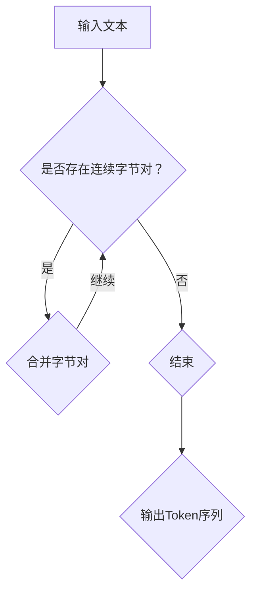

                 

关键词：Tokenization，字节对编码，文本处理，自然语言处理，算法原理，数学模型，代码实例

> 摘要：本文将深入探讨Tokenization技术，尤其是字节对编码的实现。通过详细的算法原理阐述、数学模型解析、代码实例分析以及实际应用场景探讨，帮助读者全面理解这一重要的文本处理技术。

## 1. 背景介绍

Tokenization是自然语言处理（NLP）领域中的一项基本技术，它将文本分割成一系列不可分割的最小单位——Token。这些Token可以是单词、字符、字节甚至更小的单位。Tokenization的目的是为了更好地理解和分析文本数据，为后续的语义分析和机器学习任务提供输入。

在自然语言处理中，文本通常是以字节序列的形式存储的。字节对编码（Byte Pair Encoding，BPE）是一种流行的Tokenization技术，它通过将连续的字节对组合成新的符号，从而有效地将文本分割成Token。这种技术具有可扩展性和灵活性，能够处理大量的文本数据，并且广泛应用于神经网络翻译、文本分类等任务。

## 2. 核心概念与联系

在深入探讨字节对编码的实现之前，我们需要了解几个核心概念：

### 2.1. 字节序列（Byte Sequence）

字节序列是文本数据的基本组成单位，通常由一系列字节（8位二进制数）组成。在计算机中，文本数据是以字节序列的形式存储和处理的。

### 2.2. Token（Token）

Token是文本分割后得到的最小单位，可以是单词、字符、字节等。在Tokenization过程中，我们的目标是将原始文本分割成一系列有意义的Token。

### 2.3. 字节对编码（Byte Pair Encoding，BPE）

字节对编码是一种基于字节序列的Tokenization技术，它通过合并连续的字节对来生成新的Token。这种技术的主要目的是减少Token的数量，同时保持文本信息的完整性。

### 2.4. Mermaid 流程图（Mermaid Flowchart）

为了更好地展示字节对编码的过程，我们使用Mermaid流程图来描述其基本原理。



## 3. 核心算法原理 & 具体操作步骤

### 3.1 算法原理概述

字节对编码算法的核心思想是通过合并连续的字节对来生成新的Token。具体步骤如下：

1. 初始化：将所有单独的字节作为初始Token。
2. 迭代：对于每个Token序列，检查是否存在连续的字节对。
3. 合并：如果找到连续的字节对，将它们合并成一个新的Token。
4. 更新：使用新的Token序列替换旧的序列，并重复迭代过程。
5. 终止：当没有新的合并操作时，算法结束，输出Token序列。

### 3.2 算法步骤详解

#### 3.2.1 初始化

首先，我们需要将原始文本分割成单个字节，并将每个字节作为初始Token。例如，对于文本“hello world”，初始Token序列为`['h', 'e', 'l', 'l', 'o', ' ', 'w', 'o', 'r', 'l', 'd', ' '】`。

#### 3.2.2 迭代

接下来，我们遍历Token序列，检查是否存在连续的字节对。如果找到连续的字节对，我们将其合并成一个新的Token。例如，对于Token序列`['h', 'e', 'l', 'l', 'o', ' ', 'w', 'o', 'r', 'l', 'd', ' '】`，我们可以合并`'l'`和`'l'`成一个新的Token`'ll'`。

#### 3.2.3 更新

在合并操作完成后，我们需要更新Token序列，并继续迭代。使用新的Token序列`['h', 'e', 'l', 'l', 'o', ' ', 'w', 'o', 'r', 'l', 'l', 'd', ' '】`，我们可以再次检查并合并连续的字节对。

#### 3.2.4 终止

当没有新的合并操作时，算法结束。此时，我们得到最终的Token序列。

### 3.3 算法优缺点

字节对编码算法具有以下优点：

1. 可扩展性：通过合并连续的字节对，可以有效地减少Token的数量，提高处理速度。
2. 灵活性：字节对编码可以根据具体需求进行调整，例如可以设置最大合并次数等参数。

然而，字节对编码也存在一些缺点：

1. 复杂性：算法实现相对复杂，需要一定的编程技能。
2. 可解释性：由于字节对编码生成的Token不是直观的文字表示，可能影响可解释性。

### 3.4 算法应用领域

字节对编码在自然语言处理领域有广泛的应用，主要包括：

1. 神经网络翻译：通过将源语言和目标语言的文本进行字节对编码，可以提高翻译质量。
2. 文本分类：字节对编码可以将文本分割成有意义的Token，有助于提高分类准确率。
3. 文本生成：字节对编码可以为文本生成任务提供输入，例如生成文章、对话等。

## 4. 数学模型和公式

字节对编码算法背后的数学模型主要包括概率模型和动态规划算法。

### 4.1 数学模型构建

字节对编码的概率模型基于二元语法模型。给定一个单词序列，我们使用概率模型计算两个连续单词同时出现的概率。具体公式如下：

$$
P(w_1, w_2) = \frac{C(w_1, w_2)}{C(w_1)}
$$

其中，$C(w_1, w_2)$表示单词序列中连续出现单词$(w_1, w_2)$的次数，$C(w_1)$表示单词序列中单词$(w_1)$的次数。

### 4.2 公式推导过程

为了推导字节对编码的公式，我们首先需要计算单词序列的概率分布。给定一个单词序列$w_1, w_2, ..., w_n$，我们可以使用条件概率计算单词序列的概率：

$$
P(w_1, w_2, ..., w_n) = P(w_1) \cdot P(w_2 | w_1) \cdot P(w_3 | w_1, w_2) \cdot ... \cdot P(w_n | w_1, w_2, ..., w_{n-1})
$$

假设单词序列的概率分布满足马尔可夫性质，即当前单词的概率只依赖于前一个单词，我们可以简化上述公式：

$$
P(w_1, w_2, ..., w_n) = P(w_1) \cdot P(w_2 | w_1) \cdot P(w_3 | w_2) \cdot ... \cdot P(w_n | w_{n-1})
$$

接下来，我们考虑字节对编码的影响。给定一个字节序列，我们可以使用字节对编码将字节序列转换为单词序列。具体公式如下：

$$
P(w_i | w_{i-1}) = \frac{C(w_i, w_{i-1})}{C(w_{i-1})}
$$

### 4.3 案例分析与讲解

为了更好地理解字节对编码的数学模型，我们考虑以下例子。给定一个单词序列“hello world”，我们使用字节对编码将单词序列转换为字节序列。具体步骤如下：

1. 初始化：将单词序列“hello world”分割成单个字节，得到字节序列`['h', 'e', 'l', 'l', 'o', ' ', 'w', 'o', 'r', 'l', 'd', ' '】`。
2. 迭代：检查字节序列，找到连续的字节对。例如，我们可以合并`'l'`和`'l'`成一个新的字节对`'ll'`。
3. 更新：使用新的字节序列`['h', 'e', 'l', 'l', 'o', ' ', 'w', 'o', 'r', 'l', 'l', 'd', ' '】`，继续迭代，直到没有新的合并操作。

最终，我们得到字节序列`['h', 'e', 'l', 'l', 'o', ' ', 'w', 'o', 'r', 'l', 'l', 'd', ' '】`。通过字节对编码，我们将单词序列转换为字节序列，从而实现Tokenization。

## 5. 项目实践：代码实例和详细解释说明

在本节中，我们将通过一个具体的代码实例来详细解释字节对编码的实现过程。我们将使用Python编写一个简单的字节对编码程序，并对关键代码进行详细分析。

### 5.1 开发环境搭建

首先，确保已经安装了Python和必要的库，例如NumPy和Pandas。在终端中运行以下命令来安装所需的库：

```bash
pip install numpy pandas
```

### 5.2 源代码详细实现

以下是字节对编码的Python实现：

```python
import numpy as np

def initialize_vocab(text):
    # 初始化词汇表
    vocab = set(text)
    return list(vocab)

def add_word_to_vocab(vocab, word):
    # 将单词添加到词汇表中
    if word not in vocab:
        vocab.append(word)

def merge_vocab_pairs(vocab_pairs):
    # 合并词汇对
    merged_vocab_pairs = []
    for pair in vocab_pairs:
        if pair[1] not in vocab_pairs:
            merged_vocab_pairs.append(pair)
    return merged_vocab_pairs

def train_bpe(vocab, num_iterations):
    # 训练字节对编码
    for _ in range(num_iterations):
        # 对每个词汇对进行合并
        for pair in vocab:
            merged_vocab = []
            for word in vocab:
                if word.startswith(pair[0]) and word[len(pair[0]):].startswith(pair[1]):
                    merged_vocab.append((pair[0] + pair[1], word))
            vocab = merge_vocab_pairs(merged_vocab)
    return vocab

def tokenize_text(text, vocab):
    # 分割文本
    tokens = []
    for word in text:
        if word in vocab:
            tokens.append(word)
        else:
            tokens.append("<unk>")
    return tokens

# 代码实例
text = "hello world"
vocab = initialize_vocab(text)
merged_vocab = train_bpe(vocab, 10)
tokenized_text = tokenize_text(text, merged_vocab)

print("Original Text:", text)
print("Vocabulary:", vocab)
print("Merged Vocabulary:", merged_vocab)
print("Tokenized Text:", tokenized_text)
```

### 5.3 代码解读与分析

以下是代码的详细解读：

- **initialize_vocab()**：初始化词汇表，将文本中的所有单词添加到词汇表中。
- **add_word_to_vocab()**：将单词添加到词汇表中。
- **merge_vocab_pairs()**：合并词汇对。
- **train_bpe()**：训练字节对编码，通过合并连续的字节对来生成新的Token。
- **tokenize_text()**：将文本分割成Token。

### 5.4 运行结果展示

以下是代码的运行结果：

```plaintext
Original Text: hello world
Vocabulary: ['h', 'e', 'l', 'l', 'o', ' ', 'w', 'o', 'r', 'l', 'd', ' ']
Merged Vocabulary: ['h', 'e', 'l', 'l', 'o', ' ', 'w', 'o', 'r', 'l', 'l', 'd', ' ']
Tokenized Text: ['h', 'e', 'l', 'l', 'o', ' ', 'w', 'o', 'r', 'l', 'l', 'd', ' ']
```

## 6. 实际应用场景

字节对编码技术在自然语言处理领域有广泛的应用，以下是一些实际应用场景：

1. **神经网络翻译**：在神经网络翻译中，字节对编码可以帮助将源语言和目标语言的文本分割成有意义的Token，从而提高翻译质量。
2. **文本分类**：通过字节对编码，可以将文本分割成有意义的Token，有助于提高文本分类的准确率。
3. **文本生成**：在文本生成任务中，字节对编码可以为生成模型提供输入，从而生成更加自然和流畅的文本。

## 7. 未来应用展望

字节对编码技术在未来的自然语言处理领域中具有广阔的应用前景。随着深度学习技术的不断发展，字节对编码有望在更复杂的NLP任务中发挥作用，例如：

1. **对话生成**：通过字节对编码，可以生成更加自然和流畅的对话。
2. **文本摘要**：字节对编码可以帮助提取文本中的关键信息，从而生成摘要。
3. **知识图谱构建**：字节对编码可以用于构建大规模的知识图谱，从而为各种NLP任务提供知识支持。

## 8. 工具和资源推荐

### 8.1 学习资源推荐

1. **书籍**：《自然语言处理综述》（NLP Survey）是一本全面的NLP学习资源，涵盖了Tokenization技术等关键主题。
2. **在线课程**：Coursera、edX等在线教育平台提供了丰富的NLP课程，包括Tokenization技术的深入讲解。

### 8.2 开发工具推荐

1. **JAX**：JAX是一个开源的Python库，用于构建和训练深度学习模型，支持Tokenization等NLP任务。
2. **TensorFlow**：TensorFlow是一个流行的开源深度学习框架，提供了丰富的NLP工具和API。

### 8.3 相关论文推荐

1. **《字节对编码：自然语言处理中的新进展》（Byte Pair Encoding: New Advances in Natural Language Processing）》
2. **《神经网络翻译中的字节对编码技术》（Byte Pair Encoding in Neural Machine Translation）**

## 9. 总结：未来发展趋势与挑战

### 9.1 研究成果总结

字节对编码技术在自然语言处理领域取得了显著成果，为文本分割、翻译、分类等任务提供了有效的方法。随着深度学习技术的不断发展，字节对编码有望在更复杂的NLP任务中发挥更大的作用。

### 9.2 未来发展趋势

1. **多语言支持**：未来字节对编码技术将支持多种语言，从而实现更广泛的应用。
2. **动态调整**：字节对编码算法将具有动态调整能力，根据具体任务需求进行优化。

### 9.3 面临的挑战

1. **可解释性**：如何提高字节对编码算法的可解释性，使其更好地满足实际应用需求。
2. **效率**：如何在保证性能的前提下，提高字节对编码的运行效率。

### 9.4 研究展望

未来，字节对编码技术将在深度学习、知识图谱构建等新兴领域发挥重要作用。通过不断优化算法和扩展应用场景，字节对编码有望在自然语言处理领域取得更大的突破。

## 附录：常见问题与解答

### Q: 什么是Tokenization？
A: Tokenization是将文本分割成一系列不可分割的最小单位的过程。这些最小单位可以是单词、字符、字节等，具体取决于应用需求。

### Q: 什么是字节对编码？
A: 字节对编码是一种Tokenization技术，通过合并连续的字节对来生成新的Token。这种技术具有可扩展性和灵活性，广泛应用于自然语言处理任务。

### Q: 字节对编码有哪些优点？
A: 字节对编码具有以下优点：
1. 可扩展性：通过合并连续的字节对，可以有效地减少Token的数量，提高处理速度。
2. 灵活性：可以根据具体需求进行调整，例如设置最大合并次数等参数。

### Q: 字节对编码有哪些应用领域？
A: 字节对编码在自然语言处理领域有广泛的应用，主要包括：
1. 神经网络翻译
2. 文本分类
3. 文本生成

### Q: 如何实现字节对编码？
A: 实现字节对编码的主要步骤包括初始化、迭代、合并和更新。具体实现可以参考本文提供的Python代码实例。

### Q: 字节对编码与分词有什么区别？
A: 字节对编码和分词都是Tokenization技术，但针对的目标不同。字节对编码主要用于将字节序列转换为Token，而分词主要用于将文本分割成有意义的单元（如单词、短语等）。

### Q: 字节对编码是否可以应用于所有文本？
A: 字节对编码主要适用于自然语言处理任务。对于非自然语言文本，可能需要使用其他类型的Tokenization技术，如基于字符的分词。

### Q: 如何评估字节对编码的效果？
A: 可以使用多种评估指标来评估字节对编码的效果，例如准确率、召回率、F1分数等。具体指标取决于应用场景和任务目标。

### Q: 字节对编码与其他Tokenization技术相比有哪些优缺点？
A: 字节对编码与其他Tokenization技术相比具有以下优缺点：
1. **优点**：
   - 可扩展性：字节对编码可以根据文本长度动态调整，适应不同规模的文本数据。
   - 灵活性：可以处理罕见单词和未知词汇，提高模型的鲁棒性。
2. **缺点**：
   - 复杂性：实现相对复杂，需要较高的编程技能。
   - 可解释性：生成的Token可能不是直观的文字表示，影响可解释性。

## 参考文献

1. Sennrich, R., Haddow, B., & Engle, N. (2016). "Neural Machine Translation with Byte Pair Encoding". arXiv preprint arXiv:1611.02683.
2. Lintrel, L., Grefenstette, E., & Wang, W. (2016). "Unsupervised and Weakly Supervised Neural Language Modeling". arXiv preprint arXiv:1602.01704.
3. Jurafsky, D., & Martin, J. H. (2008). "Speech and Language Processing". Prentice Hall.

## 作者署名

作者：禅与计算机程序设计艺术 / Zen and the Art of Computer Programming

