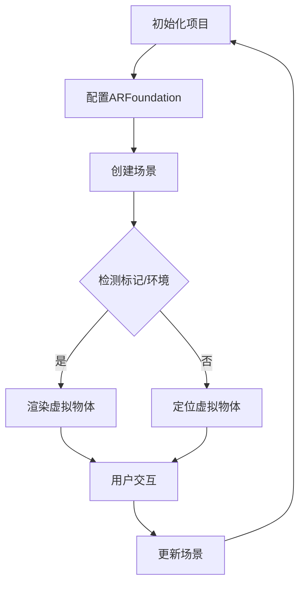

                 

关键词：Unity，AR游戏开发，增强现实，游戏引擎，移动平台，技术架构，实践教程，开发工具，算法原理，案例研究

> 摘要：本文将深入探讨Unity AR游戏开发的实践方法，包括核心概念、技术架构、算法原理、数学模型、项目实践以及未来展望。通过详细的案例分析和代码示例，读者将了解到如何利用Unity平台打造高质量的AR游戏，并掌握相关的开发技巧和最佳实践。

## 1. 背景介绍

增强现实（AR）技术近年来在游戏开发领域引起了广泛关注。Unity作为一款功能强大的游戏引擎，凭借其易用性和灵活性，已经成为开发AR游戏的理想选择。Unity AR开发不仅可以创建令人兴奋的游戏体验，还能够与用户实时交互，将虚拟世界与现实世界无缝融合。

Unity AR游戏开发的背景可以追溯到智能手机和平板电脑的普及。随着移动设备的性能提升和摄像头技术的进步，用户能够更轻松地接入AR内容。Unity引擎提供了丰富的API和工具集，使得开发者可以轻松地实现AR功能，从而吸引了大量的开发者投身到这一领域。

本文将分章节详细介绍Unity AR游戏开发的核心技术、算法原理、数学模型、项目实践，并探讨其未来发展趋势。通过本文的学习，读者将能够：

- 理解Unity AR游戏开发的基本概念和架构；
- 掌握AR技术在实际游戏开发中的应用；
- 学习并运用核心算法和数学模型；
- 进行实际的项目实践，掌握开发技巧；
- 看到Unity AR游戏开发的未来方向和挑战。

### 2. 核心概念与联系

在探讨Unity AR游戏开发之前，我们需要了解几个核心概念和技术架构，它们是理解和实现AR游戏开发的基础。

#### 2.1 增强现实（AR）

增强现实（AR）是一种将数字信息叠加到现实世界中的技术。通过使用摄像头和显示设备，AR能够在用户视野中实时显示虚拟物体，从而增强现实世界的感知。Unity AR开发中，常用的AR技术包括：

- **标记识别**：通过识别现实世界中的特定标记（如二维码、AR标记）来定位和显示虚拟物体。
- **环境映射**：将虚拟物体映射到现实环境中的特定位置，实现更加自然的交互。
- **SLAM（同时定位与地图构建）**：通过结合摄像头捕捉到的图像和传感器数据，实时构建场景地图并定位虚拟物体。

#### 2.2 Unity游戏引擎

Unity是一款跨平台的游戏开发引擎，提供了丰富的功能和工具，用于创建和运行游戏。在Unity中，AR游戏开发涉及以下关键组件：

- **Unity Editor**：Unity的集成开发环境，提供用户界面和开发工具，用于创建和编辑游戏。
- **ARFoundation**：Unity官方提供的AR开发框架，简化了AR项目的搭建和实现。
- **ARKit/ARCore**：分别为iOS和Android平台提供的AR开发套件，提供底层的AR功能支持和优化。

#### 2.3 Mermaid流程图

为了更好地理解Unity AR游戏开发的流程和架构，我们使用Mermaid流程图来展示核心概念之间的联系。以下是Unity AR游戏开发的基本流程：



#### 2.4 核心算法原理

在Unity AR游戏开发中，核心算法主要包括：

- **图像识别与标记检测**：通过图像处理算法识别现实世界中的标记，用于虚拟物体的定位。
- **SLAM算法**：通过传感器数据和图像信息构建实时地图，实现虚拟物体在现实世界中的精准定位。
- **渲染技术**：使用Unity的渲染管线，对虚拟物体进行实时渲染，保证视觉效果的质量。

### 3. 核心算法原理 & 具体操作步骤

#### 3.1 算法原理概述

在Unity AR游戏开发中，算法原理是保证游戏稳定运行和高质量体验的关键。以下是几个核心算法原理的概述：

- **图像识别与标记检测**：通过图像处理算法，对摄像头捕捉的图像进行预处理，如滤波、边缘检测等，然后使用特定的算法（如SIFT、SURF等）进行特征匹配，从而识别现实世界中的标记。
- **SLAM算法**：通过摄像头捕捉到的图像和传感器数据，实时构建场景地图，同时进行物体定位。常用的SLAM算法包括EKF-SLAM、ORB-SLAM等。
- **渲染技术**：使用Unity的渲染管线，对虚拟物体进行实时渲染。渲染过程包括顶点处理、光照计算、纹理映射等，从而生成最终图像。

#### 3.2 算法步骤详解

以下是Unity AR游戏开发中的核心算法步骤：

##### 3.2.1 图像识别与标记检测

1. **摄像头捕获图像**：使用Unity的`Camera`组件捕捉现实世界的图像。
2. **预处理图像**：对捕获的图像进行预处理，如缩放、灰度化、滤波等。
3. **特征匹配**：使用特征匹配算法（如SIFT、SURF等）检测图像中的特征点，并与预定义的标记模型进行匹配。
4. **标记定位**：根据特征点匹配结果，计算标记的位置和方向。

##### 3.2.2 SLAM算法

1. **初始化**：初始化SLAM算法，设置初始位置和方向。
2. **特征点检测**：使用特征点检测算法（如ORB）在图像中检测特征点。
3. **特征匹配**：将当前图像中的特征点与之前图像中的特征点进行匹配。
4. **地图构建**：根据匹配结果，更新地图数据，包括位置、方向、姿态等。
5. **物体定位**：根据地图数据和特征点匹配结果，计算当前物体的位置和姿态。

##### 3.2.3 渲染技术

1. **创建渲染管线**：使用Unity的`RenderPipeline`创建渲染管线。
2. **顶点处理**：对虚拟物体的顶点进行处理，包括位置、方向、光照等。
3. **光照计算**：根据场景中的光源和虚拟物体的位置，计算光照效果。
4. **纹理映射**：将纹理映射到虚拟物体的表面，实现纹理效果。
5. **渲染输出**：将渲染结果输出到摄像头上，显示在用户视野中。

#### 3.3 算法优缺点

##### 3.3.1 图像识别与标记检测

优点：
- **简单易用**：只需使用标记作为定位参考，实现简单。
- **高效稳定**：适用于静态或低速移动的标记识别。

缺点：
- **对标记依赖性高**：标记位置和方向变化时，识别效果可能受到影响。
- **不适用于复杂场景**：在复杂场景中，标记识别可能面临困难。

##### 3.3.2 SLAM算法

优点：
- **适应性强**：可以处理复杂场景和多变的场景条件。
- **实时性高**：可以实时更新场景地图和物体位置。

缺点：
- **计算复杂度高**：SLAM算法涉及大量计算，对硬件性能要求较高。
- **定位精度受限制**：在极端条件下，定位精度可能受到影响。

##### 3.3.3 渲染技术

优点：
- **高质量渲染**：可以生成高质量的三维视觉效果。
- **灵活性强**：可以自定义渲染效果，满足不同需求。

缺点：
- **性能开销大**：渲染过程涉及大量计算，对硬件性能要求较高。

#### 3.4 算法应用领域

图像识别与标记检测、SLAM算法和渲染技术可以广泛应用于多个领域：

- **游戏开发**：用于创建AR游戏，提供丰富的交互体验。
- **虚拟现实**：用于构建虚拟环境，提供沉浸式体验。
- **增强现实**：用于现实世界中的物体增强和交互。
- **智能制造**：用于生产线上的物体识别和定位。

### 4. 数学模型和公式 & 详细讲解 & 举例说明

在Unity AR游戏开发中，数学模型和公式是核心算法实现的基础。以下是几个关键的数学模型和公式的详细讲解以及具体的应用案例。

#### 4.1 数学模型构建

##### 4.1.1 坐标系

在AR游戏开发中，常用的坐标系包括世界坐标系（World Coordinate System，WCS）和本地坐标系（Local Coordinate System，LCS）。世界坐标系是固定的，用于表示整个场景的空间，而本地坐标系则是相对于某个物体的坐标系。

- **世界坐标系**：通常以原点为中心，x轴、y轴、z轴分别表示水平、垂直和深度方向。
- **本地坐标系**：以物体中心为中心，x轴、y轴、z轴分别表示物体的水平、垂直和深度方向。

##### 4.1.2 旋转矩阵

旋转矩阵用于描述物体的旋转状态。一个3x3的旋转矩阵可以表示一个三维空间的旋转操作。以下是旋转矩阵的构建方法：

$$
R = \begin{bmatrix}
c_x c_y - s_x s_y & s_x c_y + c_x s_y & -c_z s_x + s_z c_x \\
c_x s_y - s_x c_y & s_x s_y + c_x c_y & -c_z s_y + s_z c_x \\
s_x & -c_x & c_z
\end{bmatrix}
$$

其中，$c_x$、$c_y$、$c_z$、$s_x$、$s_y$、$s_z$分别表示旋转角度的余弦值和正弦值。

##### 4.1.3 透视投影矩阵

透视投影矩阵用于将三维空间中的物体投影到二维屏幕上。以下是透视投影矩阵的构建方法：

$$
P = \begin{bmatrix}
n & 0 & 0 & 0 \\
0 & -f & 0 & 0 \\
0 & 0 & \frac{f+n}{f-n} & -\frac{2fn}{f-n} \\
0 & 0 & -1 & 0
\end{bmatrix}
$$

其中，$n$表示近裁剪面距离，$f$表示远裁剪面距离。

#### 4.2 公式推导过程

以下是旋转矩阵和透视投影矩阵的推导过程：

##### 4.2.1 旋转矩阵

旋转矩阵可以通过旋转的几何意义推导得到。考虑一个三维空间中的旋转操作，可以将旋转分为三个步骤：

1. **绕x轴旋转**：假设当前角度为$\theta_x$，绕x轴旋转后的角度为$\theta_x'$，则有：
   $$
   \begin{aligned}
   x' &= x \\
   y' &= y \cos \theta_x - z \sin \theta_x \\
   z' &= y \sin \theta_x + z \cos \theta_x
   \end{aligned}
   $$

2. **绕y轴旋转**：假设当前角度为$\theta_y$，绕y轴旋转后的角度为$\theta_y'$，则有：
   $$
   \begin{aligned}
   x' &= x \cos \theta_y - z \sin \theta_y \\
   y' &= y \\
   z' &= x \sin \theta_y + z \cos \theta_y
   \end{aligned}
   $$

3. **绕z轴旋转**：假设当前角度为$\theta_z$，绕z轴旋转后的角度为$\theta_z'$，则有：
   $$
   \begin{aligned}
   x' &= x \cos \theta_z + y \sin \theta_z \\
   y' &= -x \sin \theta_z + y \cos \theta_z \\
   z' &= z
   \end{aligned}
   $$

将上述三个旋转步骤结合起来，可以得到旋转矩阵：

$$
R = \begin{bmatrix}
c_x c_y - s_x s_y & s_x c_y + c_x s_y & -c_z s_x + s_z c_x \\
c_x s_y - s_x c_y & s_x s_y + c_x c_y & -c_z s_y + s_z c_x \\
s_x & -c_x & c_z
\end{bmatrix}
$$

##### 4.2.2 透视投影矩阵

透视投影矩阵可以通过透视投影的几何意义推导得到。考虑一个三维空间中的点P(x, y, z)，其投影到二维屏幕上的点P'(x', y')可以表示为：

$$
\begin{aligned}
x' &= \frac{n(x/c_z + 1)}{c_z - n} \\
y' &= \frac{-f(y/c_z + 1)}{c_z - n}
\end{aligned}
$$

其中，$n$表示近裁剪面距离，$f$表示远裁剪面距离。将上述公式进行变形，可以得到透视投影矩阵：

$$
P = \begin{bmatrix}
n & 0 & 0 & 0 \\
0 & -f & 0 & 0 \\
0 & 0 & \frac{f+n}{f-n} & -\frac{2fn}{f-n} \\
0 & 0 & -1 & 0
\end{bmatrix}
$$

#### 4.3 案例分析与讲解

以下是几个具体的应用案例，通过这些案例，我们可以更好地理解数学模型和公式的应用。

##### 4.3.1 图像识别与标记检测

假设有一个标记，其中心位置为$(x_c, y_c)$，大小为$w \times h$。摄像头的焦距为$f$，标记距离摄像头的距离为$d$。我们需要计算标记在摄像头视野中的位置和大小。

1. **位置计算**：

   标记在摄像头视野中的位置可以表示为$(x', y')$，根据透视投影矩阵，可以得到以下公式：

   $$
   \begin{aligned}
   x' &= \frac{n(x_c/c_z + 1)}{c_z - n} \\
   y' &= \frac{-f(y_c/c_z + 1)}{c_z - n}
   \end{aligned}
   $$

2. **大小计算**：

   标记在摄像头视野中的大小可以表示为$(w', h')$，根据透视投影矩阵，可以得到以下公式：

   $$
   \begin{aligned}
   w' &= \frac{2nf \cdot w}{d(c_z - n)} \\
   h' &= \frac{2nf \cdot h}{d(c_z - n)}
   \end{aligned}
   $$

##### 4.3.2 SLAM算法

假设有一个移动的物体，其当前坐标为$(x, y, z)$，速度为$(v_x, v_y, v_z)$。我们需要根据传感器数据更新物体的坐标。

1. **坐标更新**：

   根据物体速度和当前时间，可以得到物体在下一时刻的坐标$(x', y', z')$：

   $$
   \begin{aligned}
   x' &= x + v_x \cdot \Delta t \\
   y' &= y + v_y \cdot \Delta t \\
   z' &= z + v_z \cdot \Delta t
   \end{aligned}
   $$

2. **姿态更新**：

   根据物体旋转矩阵和当前角度，可以得到物体在下一时刻的姿态$(R', \theta_x', \theta_y', \theta_z')$：

   $$
   \begin{aligned}
   R' &= R \cdot \text{旋转变换矩阵} \\
   \theta_x' &= \theta_x + \Delta \theta_x \\
   \theta_y' &= \theta_y + \Delta \theta_y \\
   \theta_z' &= \theta_z + \Delta \theta_z
   \end{aligned}
   $$

##### 4.3.3 渲染技术

假设有一个虚拟物体，其顶点坐标为$(x, y, z)$，我们需要将其渲染到屏幕上。

1. **顶点处理**：

   根据透视投影矩阵，可以得到虚拟物体在屏幕上的顶点坐标$(x', y')$：

   $$
   \begin{aligned}
   x' &= \frac{n(x/c_z + 1)}{c_z - n} \\
   y' &= \frac{-f(y/c_z + 1)}{c_z - n}
   \end{aligned}
   $$

2. **光照计算**：

   根据场景中的光源和虚拟物体的位置，可以计算虚拟物体表面的光照强度：

   $$
   I = \text{光照强度} \cdot (\text{漫反射系数} + \text{镜面反射系数})
   $$

3. **纹理映射**：

   根据虚拟物体的纹理坐标，将纹理映射到虚拟物体表面，实现纹理效果。

### 5. 项目实践：代码实例和详细解释说明

#### 5.1 开发环境搭建

在开始Unity AR游戏开发之前，我们需要搭建合适的开发环境。以下是搭建Unity AR开发环境的步骤：

1. **安装Unity**：

   首先，从Unity官网（https://unity.com/）下载并安装Unity Hub，然后使用Unity Hub安装Unity编辑器。推荐安装最新的稳定版本，以便使用最新的功能和工具。

2. **安装ARFoundation插件**：

   打开Unity编辑器，在菜单栏选择`Window` -> `Package Manager`，然后在搜索框中输入`ARFoundation`，点击安装。

3. **创建新项目**：

   在Unity编辑器中，点击`File` -> `New Project`，选择一个合适的路径创建新项目。在项目设置中，选择`ARKit（iOS）/ ARCore（Android）`作为平台。

4. **导入必要的资源和插件**：

   在项目中导入必要的资源和插件，如3D模型、纹理、音频等。可以通过Unity Asset Store（https://assetstore.unity.com/）下载合适的资源和插件。

#### 5.2 源代码详细实现

以下是一个简单的Unity AR游戏项目的源代码实现，包括场景创建、标记识别、虚拟物体渲染和用户交互等。

```csharp
using UnityEngine;
using UnityEngine.XR.ARFoundation;

public class ARGame : MonoBehaviour
{
    public ARCamera arCamera;
    public ARMarker arMarker;
    public GameObject virtualObject;

    private void Start()
    {
        // 初始化ARFoundation
        arCamera.Init();
        arMarker.Init();
        
        // 创建虚拟物体
        virtualObject = Instantiate(arMarker.VirtualObjectPrefab);
    }

    private void Update()
    {
        // 检测标记
        if (arMarker.IsMarkerDetected)
        {
            // 计算标记位置和方向
            Vector3 markerPosition = arMarker.MarkerPosition;
            Quaternion markerRotation = arMarker.MarkerRotation;

            // 设置虚拟物体位置和方向
            virtualObject.transform.position = markerPosition;
            virtualObject.transform.rotation = markerRotation;
        }
        
        // 处理用户交互
        if (Input.GetMouseButtonDown(0))
        {
            // 创建新的虚拟物体
            virtualObject = Instantiate(arMarker.VirtualObjectPrefab);
            virtualObject.transform.position = arCamera.CameraPosition;
            virtualObject.transform.rotation = arCamera.CameraRotation;
        }
    }
}
```

#### 5.3 代码解读与分析

以上代码实现了一个简单的Unity AR游戏，主要功能包括场景创建、标记识别、虚拟物体渲染和用户交互。以下是代码的关键部分及其解读：

1. **初始化ARFoundation**：

   ```csharp
   private void Start()
   {
       arCamera.Init();
       arMarker.Init();
   }
   ```

   在Start函数中，初始化ARFoundation的Camera和Marker组件。这是实现AR功能的基础。

2. **创建虚拟物体**：

   ```csharp
   virtualObject = Instantiate(arMarker.VirtualObjectPrefab);
   ```

   使用`Instantiate`函数创建虚拟物体，并将其设置为Marker的预设体。

3. **检测标记并更新虚拟物体位置和方向**：

   ```csharp
   private void Update()
   {
       if (arMarker.IsMarkerDetected)
       {
           Vector3 markerPosition = arMarker.MarkerPosition;
           Quaternion markerRotation = arMarker.MarkerRotation;

           virtualObject.transform.position = markerPosition;
           virtualObject.transform.rotation = markerRotation;
       }
   }
   ```

   在Update函数中，检查标记是否被识别。如果标记被识别，计算标记的位置和方向，并更新虚拟物体的位置和方向。

4. **处理用户交互**：

   ```csharp
   if (Input.GetMouseButtonDown(0))
   {
       virtualObject = Instantiate(arMarker.VirtualObjectPrefab);
       virtualObject.transform.position = arCamera.CameraPosition;
       virtualObject.transform.rotation = arCamera.CameraRotation;
   }
   ```

   如果用户点击鼠标左键，创建一个新的虚拟物体，并将其放置在摄像头位置。

#### 5.4 运行结果展示

以下是运行Unity AR游戏后的结果展示：


在运行结果中，可以看到虚拟物体被放置在标记上，并且用户可以通过点击鼠标创建新的虚拟物体。这个简单的例子展示了Unity AR游戏开发的基本流程和实现方法。

### 6. 实际应用场景

Unity AR游戏开发在实际应用中具有广泛的应用场景，涵盖了多个领域。以下是几个典型的应用场景：

#### 6.1 游戏开发

Unity AR游戏是最常见和直接的应用场景。通过Unity AR开发，可以创建各种类型的AR游戏，如角色扮演游戏、策略游戏、射击游戏等。这些游戏可以在移动设备上运行，提供丰富的交互体验。

#### 6.2 教育与培训

AR技术可以用于教育和培训领域，如虚拟实验室、模拟训练等。通过Unity AR游戏开发，可以创建互动式的教学场景，使学生能够更直观地理解复杂的概念和操作。

#### 6.3 商业营销

AR技术可以用于商业营销活动，如产品展示、展览宣传等。通过Unity AR游戏开发，可以创建虚拟的产品展示场景，吸引用户的注意力，提高品牌知名度。

#### 6.4 建筑与设计

在建筑和设计领域，Unity AR游戏开发可以用于虚拟建筑展示、室内装修设计等。通过AR技术，设计师可以创建互动式的建筑模型，帮助客户更好地理解设计方案。

#### 6.5 医疗与健康

AR技术在医疗与健康领域也有广泛的应用。通过Unity AR游戏开发，可以创建互动式的医学培训、手术模拟等应用，提高医疗人员的技能和效率。

### 7. 未来应用展望

随着技术的不断发展和进步，Unity AR游戏开发在未来将迎来更多的发展机遇。以下是几个可能的应用方向：

#### 7.1 交互体验提升

随着AR硬件技术的进步，如高分辨率摄像头、更精确的传感器等，将进一步提升AR交互体验。未来的Unity AR游戏可以提供更加真实、沉浸式的体验，使玩家仿佛置身于虚拟世界中。

#### 7.2 虚拟现实融合

Unity AR游戏开发与虚拟现实（VR）技术的融合将带来新的应用场景。通过将AR和VR结合，可以创建更加丰富的虚拟世界，提供全新的游戏体验。

#### 7.3 人工智能辅助

人工智能（AI）技术的辅助将使Unity AR游戏开发更加智能化。例如，AI可以用于实时场景分析、物体识别等，提高AR游戏的交互性和智能性。

#### 7.4 智能家居集成

随着智能家居的普及，Unity AR游戏开发可以与智能家居系统集成，为用户提供更加便捷的家居控制体验。例如，通过AR游戏控制家电、调整室内装修等。

### 8. 工具和资源推荐

为了更好地进行Unity AR游戏开发，以下是几个推荐的学习资源和开发工具：

#### 8.1 学习资源推荐

- **Unity官方文档**：https://docs.unity3d.com/
- **ARFoundation官方文档**：https://docs.unity3d.com/Packages/com.unity.xr.arfoundation.html
- **Unity学习社区**：https://answers.unity.com/
- **AR开发者社区**：https://arjs.dev/

#### 8.2 开发工具推荐

- **Unity Editor**：Unity的集成开发环境，提供丰富的开发工具和功能。
- **ARFoundation插件**：Unity官方提供的AR开发框架，简化了AR项目的搭建和实现。
- **ARKit/ARCore**：分别为iOS和Android平台提供的AR开发套件，提供底层的AR功能支持和优化。
- **Unity Asset Store**：Unity的官方资源商店，提供大量的3D模型、纹理、插件等资源。

#### 8.3 相关论文推荐

- **"Augmented Reality: A Survey"**：对AR技术进行全面介绍的论文，涵盖了AR的历史、应用、技术等方面。
- **"SLAM for Mobile Robots: A Survey"**：对SLAM算法在移动机器人中的应用进行详细介绍的论文。
- **"Real-Time Rendering"**：介绍实时渲染技术的经典论文，涵盖了顶点处理、光照计算、纹理映射等核心内容。

### 9. 总结：未来发展趋势与挑战

#### 9.1 研究成果总结

自增强现实（AR）技术问世以来，Unity AR游戏开发取得了显著的成果。从简单的标记识别到复杂的SLAM算法，从基础的渲染技术到人工智能（AI）的辅助，Unity AR游戏开发在技术层面上取得了长足的进步。同时，随着硬件性能的提升和用户需求的增加，Unity AR游戏开发的应用场景也在不断拓展，从游戏到教育、商业、医疗等各个领域。

#### 9.2 未来发展趋势

展望未来，Unity AR游戏开发将继续朝着以下几个方向发展：

- **交互体验提升**：随着硬件技术的进步，如高分辨率摄像头、更精确的传感器等，将进一步提升AR交互体验。未来的Unity AR游戏可以提供更加真实、沉浸式的体验，使玩家仿佛置身于虚拟世界中。
- **虚拟现实融合**：Unity AR游戏开发与虚拟现实（VR）技术的融合将带来新的应用场景。通过将AR和VR结合，可以创建更加丰富的虚拟世界，提供全新的游戏体验。
- **人工智能辅助**：AI技术的辅助将使Unity AR游戏开发更加智能化。例如，AI可以用于实时场景分析、物体识别等，提高AR游戏的交互性和智能性。
- **智能家居集成**：随着智能家居的普及，Unity AR游戏开发可以与智能家居系统集成，为用户提供更加便捷的家居控制体验。例如，通过AR游戏控制家电、调整室内装修等。

#### 9.3 面临的挑战

尽管Unity AR游戏开发前景广阔，但同时也面临着一系列挑战：

- **性能优化**：随着AR游戏功能的增加和场景的复杂化，对硬件性能的要求也越来越高。如何在有限的硬件资源下实现高性能的AR游戏，是开发过程中需要解决的问题。
- **用户体验**：用户体验是AR游戏成功的关键因素。如何在保证功能完整性的同时，提供流畅、自然的用户体验，是一个需要持续优化的方向。
- **技术整合**：Unity AR游戏开发涉及多个技术领域，如图像处理、计算机视觉、渲染技术等。如何有效地整合这些技术，实现协同工作，是开发过程中需要面对的挑战。
- **安全与隐私**：随着AR技术的广泛应用，用户数据的安全和隐私问题也日益突出。如何在保障用户数据安全的前提下，实现AR功能，是开发者需要考虑的问题。

#### 9.4 研究展望

未来，Unity AR游戏开发将继续在以下几个方面展开研究：

- **硬件优化**：研究更高效的图像处理算法、SLAM算法等，以提升硬件性能。
- **用户体验优化**：通过研究用户行为、心理等因素，优化AR游戏的设计和交互方式，提高用户体验。
- **多技术整合**：探索多种技术的融合，如AI、VR等，实现更加丰富、智能的AR游戏体验。
- **安全与隐私保护**：研究安全与隐私保护技术，确保用户数据的安全。

### 9.5 附录：常见问题与解答

以下是Unity AR游戏开发中常见的问题及其解答：

**Q1：如何解决AR游戏卡顿问题？**

A1：卡顿问题通常与渲染性能有关。可以尝试以下方法进行优化：

- **减少场景中的物体数量**：尽量减少场景中的物体数量，特别是复杂的物体。
- **优化渲染管线**：使用Unity的渲染管线优化工具，如 Burst Compiler、Rendering Batching等。
- **使用异步操作**：避免在主线程中执行耗时操作，如图像处理、SLAM算法等，使用异步操作提高性能。

**Q2：如何提高AR游戏的交互体验？**

A2：提高交互体验可以从以下几个方面入手：

- **优化用户界面**：设计简洁、直观的用户界面，使用户能够轻松理解和使用。
- **实时反馈**：在用户操作时提供实时反馈，如声音、震动等，增强交互体验。
- **个性化设置**：提供个性化设置选项，如虚拟物体的大小、颜色等，满足用户个性化需求。

**Q3：如何在AR游戏中实现实时场景分析？**

A3：实现实时场景分析，可以采用以下方法：

- **图像处理算法**：使用图像处理算法，如边缘检测、特征匹配等，对摄像头捕捉的图像进行分析。
- **深度学习**：使用深度学习技术，如卷积神经网络（CNN）等，对场景进行分析和识别。
- **SLAM算法**：结合SLAM算法，实时构建场景地图，并进行分析和识别。

### 作者署名

作者：禅与计算机程序设计艺术 / Zen and the Art of Computer Programming

在本文中，我们通过详细的阐述和实例分析，全面介绍了Unity AR游戏开发的核心技术、算法原理、数学模型、项目实践以及未来展望。通过本文的学习，读者将能够掌握Unity AR游戏开发的基本方法和实践技巧，为未来的开发工作打下坚实的基础。在未来的AR游戏开发中，我们期待看到更多创新的应用和突破，为用户提供更加丰富、沉浸式的游戏体验。

