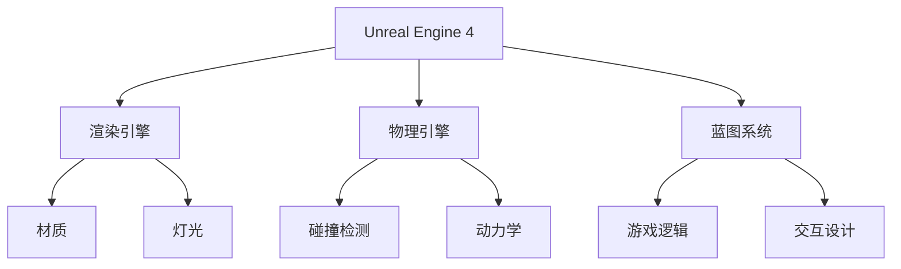

                 

 Unreal Engine 4 (UE4) 是一款功能强大的游戏开发引擎，它以其卓越的视觉效果和丰富的游戏玩法而闻名。本文将深入探讨 UE4 在游戏开发中的应用，重点关注其电影级的视觉效果和游戏玩法的设计。

## 关键词
- Unreal Engine 4
- 游戏开发
- 视觉效果
- 游戏玩法
- 电影级

## 摘要
本文旨在向读者介绍 Unreal Engine 4 的核心特点及其在游戏开发中的应用。我们将探讨 UE4 如何实现电影级的视觉效果，以及如何设计引人入胜的游戏玩法。此外，本文还将提供一些实用的开发技巧和资源，帮助读者更好地掌握 UE4。

## 1. 背景介绍
Unreal Engine 4 是由 Epic Games 开发的一款跨平台游戏引擎，它广泛应用于游戏开发、虚拟现实、电影制作等多个领域。UE4 以其高性能、易用性和丰富的功能而受到开发者的喜爱。

在视觉效果方面，UE4 提供了强大的渲染引擎，支持实时光线追踪和基于物理的渲染技术。这使得 UE4 能够生成逼真的场景和角色，为游戏带来电影级的视觉效果。

在游戏玩法设计方面，UE4 提供了灵活的编程工具和强大的蓝图系统，使开发者能够轻松实现复杂的游戏逻辑和交互。这使得 UE4 成为游戏开发者的首选工具。

### 1.1 Unreal Engine 4 的历史
Unreal Engine 4 是 Unreal Engine 系列的第四个版本。自 2014 年发布以来，UE4 已经成为了游戏开发领域的佼佼者。其前身 Unreal Engine 3 在《侠盗猎车手 5》和《GTA Online》等游戏中取得了巨大的成功。

UE4 在技术上的进步主要体现在以下几个方面：

1. **实时渲染**：UE4 支持实时光线追踪，这使得游戏中的光线、阴影和反射效果更加逼真。
2. **物理模拟**：UE4 的物理引擎更加高效，支持复杂的物理交互和破坏效果。
3. **蓝图系统**：UE4 的蓝图系统使得游戏设计更加直观，开发者无需编写大量的代码即可实现复杂的游戏逻辑。
4. **跨平台支持**：UE4 支持多个平台，包括 PC、主机和移动设备，使得开发者能够轻松地将游戏发布到各种设备上。

### 1.2 Unreal Engine 4 的应用领域
除了游戏开发，UE4 在其他领域也有着广泛的应用。例如：

1. **虚拟现实**：UE4 提供了强大的虚拟现实支持，使得开发者能够轻松创建虚拟现实体验。
2. **电影制作**：UE4 的视觉效果引擎被广泛应用于电影制作，如《银翼杀手 2049》和《黑客帝国：矩阵重启》等。
3. **建筑可视化**：UE4 可以用于建筑可视化，为设计师提供逼真的建筑模型和场景渲染。

## 2. 核心概念与联系
### 2.1 核心概念
Unreal Engine 4 的核心概念包括：

1. **材质**：材质是定义游戏对象外观的属性集合，包括颜色、纹理、反射率等。
2. **灯光**：灯光是游戏场景中的光源，包括点光源、聚光源、方向光等。
3. **物理引擎**：物理引擎负责处理游戏中的物理交互，如碰撞检测、重力、动力学等。
4. **蓝图系统**：蓝图系统是一种可视化的编程工具，用于实现游戏逻辑和交互。

### 2.2 架构图
下面是 Unreal Engine 4 的架构图，展示了其核心组件和它们之间的关系：

## 3. 核心算法原理 & 具体操作步骤
### 3.1 算法原理概述
Unreal Engine 4 的核心算法原理包括：

1. **实时渲染算法**：UE4 使用基于物理的渲染技术，如光线追踪和基于屏幕空间的反射，以实现逼真的视觉效果。
2. **物理模拟算法**：UE4 使用物理引擎进行碰撞检测和动力学计算，以实现真实的物理交互。
3. **蓝图算法**：UE4 的蓝图中使用了一系列算法，如状态机、事件处理等，以实现复杂的游戏逻辑。

### 3.2 算法步骤详解
#### 3.2.1 实时渲染算法
1. **场景构建**：首先，构建游戏场景，包括角色、环境、灯光等。
2. **光照计算**：使用光线追踪算法计算场景中的光照，包括阴影、反射等。
3. **材质渲染**：根据材质属性渲染场景中的每个物体。
4. **后处理**：应用后处理效果，如景深、色彩校正等，以增强视觉效果。

#### 3.2.2 物理模拟算法
1. **碰撞检测**：检测角色、环境之间的碰撞。
2. **动力学计算**：根据物体的质量和受力情况计算物体的运动状态。
3. **交互处理**：处理角色与环境之间的交互，如跳跃、滑行等。

#### 3.2.3 蓝图算法
1. **状态机**：定义角色的状态，如站立、跑动、跳跃等。
2. **事件处理**：处理游戏中的事件，如用户输入、碰撞等。
3. **逻辑分支**：根据不同的条件执行不同的逻辑。

### 3.3 算法优缺点
#### 3.3.1 实时渲染算法
优点：
- 高效：基于物理的渲染技术能够生成高质量的图像，同时保持较高的性能。
- 灵活：开发者可以根据需求调整渲染参数，以适应不同的场景和设备。

缺点：
- 复杂：实时渲染算法涉及到多个组件和步骤，对开发者的技术要求较高。

#### 3.3.2 物理模拟算法
优点：
- 真实：物理模拟算法能够生成真实的物理效果，增强游戏的沉浸感。
- 灵活：开发者可以自定义物理参数，以适应不同的游戏场景。

缺点：
- 资源消耗：物理模拟需要计算大量的碰撞和动力学，对计算资源有一定要求。

#### 3.3.3 蓝图算法
优点：
- 直观：蓝图为开发者提供了可视化的编程界面，易于理解和操作。
- 高效：蓝图系统可以快速实现复杂的游戏逻辑，提高开发效率。

缺点：
- 可读性：蓝图中的代码可能较为混乱，难以维护。
- 性能：蓝图的执行效率可能不如传统编程。

### 3.4 算法应用领域
#### 3.4.1 实时渲染算法
实时渲染算法广泛应用于游戏开发、虚拟现实、建筑可视化等领域。在游戏开发中，实时渲染算法用于生成高质量的游戏画面，提高玩家的游戏体验。

#### 3.4.2 物理模拟算法
物理模拟算法在游戏开发、物理引擎研究、机器人控制等领域有着广泛的应用。在游戏开发中，物理模拟算法用于实现真实的物理交互，增强游戏的沉浸感。

#### 3.4.3 蓝图算法
蓝图算法在游戏开发、交互设计、虚拟现实等领域有着广泛的应用。在游戏开发中，蓝图算法用于实现复杂的游戏逻辑和交互，提高游戏的灵活性。

## 4. 数学模型和公式 & 详细讲解 & 举例说明
### 4.1 数学模型构建
在 Unreal Engine 4 中，数学模型广泛应用于渲染算法、物理引擎、蓝图系统等多个方面。以下是一些常见的数学模型：

#### 4.1.1 渲染模型
- **光线追踪**：光线追踪的基本公式为：
  $$\text{intersection} = \text{ray} \cdot \text{surface}$$
- **反射和折射**：反射和折射的公式为：
  $$\text{reflected} = \text{incident} \times \text{normal}$$
  $$\text{refracted} = \frac{\text{incident} - 2 \times \text{incident} \cdot \text{normal}}{\text{index of refraction}}$$

#### 4.1.2 物理模型
- **牛顿运动定律**：牛顿运动定律的基本公式为：
  $$F = m \cdot a$$
  $$v = u + a \cdot t$$
- **碰撞检测**：碰撞检测的基本公式为：
  $$\text{distance} = \text{position}_{\text{A}} - \text{position}_{\text{B}}$$

#### 4.1.3 蓝图模型
- **状态机**：状态机的基本公式为：
  $$\text{next state} = \text{current state} \cdot \text{event}$$

### 4.2 公式推导过程
#### 4.2.1 光线追踪
光线追踪的推导过程如下：
1. **定义光线方程**：光线方程为：
   $$\text{ray} = \text{origin} + \text{direction} \cdot t$$
2. **定义表面方程**：表面方程为：
   $$\text{surface} = \text{position} - \text{normal} \cdot t$$
3. **求解交点**：将光线方程和表面方程联立，求解 t，得到交点：
   $$\text{intersection} = (\text{origin} + \text{direction} \cdot t) \cdot (\text{position} - \text{normal} \cdot t)$$

#### 4.2.2 牛顿运动定律
牛顿运动定律的推导过程如下：
1. **定义力**：力为物体受到的合外力。
2. **定义质量**：质量为物体的惯性量。
3. **定义加速度**：加速度为物体的速度变化率。
4. **推导加速度**：由牛顿第二定律得：
   $$\text{F} = \text{m} \cdot \text{a}$$
   $$\text{a} = \frac{\text{F}}{\text{m}}$$

#### 4.2.3 状态机
状态机的推导过程如下：
1. **定义状态**：状态为角色或系统的某个行为模式。
2. **定义事件**：事件为触发状态变化的原因。
3. **推导状态转移**：由状态转移函数得：
   $$\text{next state} = \text{current state} \cdot \text{event}$$

### 4.3 案例分析与讲解
#### 4.3.1 光线追踪案例
以光线追踪实现的实时光照为例，分析光线追踪的推导过程和实际应用。

1. **场景构建**：构建一个简单的场景，包括一个立方体和一个光源。
2. **光线追踪**：从光源发出一条光线，与立方体表面相交，求得交点。
3. **反射与折射**：根据光线与表面的相对位置，计算反射光线和折射光线。
4. **渲染**：根据反射光线和折射光线，计算表面颜色，并将其渲染到屏幕上。

#### 4.3.2 牛顿运动定律案例
以一个简单的抛物线运动为例，分析牛顿运动定律的推导过程和实际应用。

1. **初始状态**：物体从地面以一定速度竖直向上抛出。
2. **受力分析**：物体受到重力作用，加速度为重力加速度。
3. **运动过程**：根据牛顿运动定律，计算物体在不同时间点的位置和速度。
4. **渲染**：将物体的运动轨迹渲染到屏幕上。

#### 4.3.3 状态机案例
以一个简单的游戏角色为例，分析状态机的推导过程和实际应用。

1. **定义状态**：角色有站立、跑动、跳跃等状态。
2. **定义事件**：事件包括用户输入、碰撞等。
3. **状态转移**：根据事件，计算角色的下一个状态。
4. **渲染**：根据角色的状态，渲染相应的动画。

## 5. 项目实践：代码实例和详细解释说明
### 5.1 开发环境搭建
在开始 Unreal Engine 4 游戏开发之前，需要搭建合适的开发环境。以下是一个基本的开发环境搭建步骤：

1. **安装 Unreal Engine 4**：从 Epic Games 官网下载 Unreal Engine 4 并安装。
2. **配置编辑器**：配置 Unreal Engine 4 编辑器，包括编辑器主题、插件等。
3. **安装附加工具**：安装一些常用的附加工具，如 Substance Painter、Blender 等。

### 5.2 源代码详细实现
下面是一个简单的 Unreal Engine 4 游戏示例，演示如何使用蓝图系统实现一个简单的游戏角色。

1. **创建项目**：在 Unreal Engine 4 编辑器中创建一个新项目。
2. **创建角色**：在项目中创建一个游戏角色，包括模型、动画等。
3. **编写蓝图**：使用蓝图系统编写角色的行为逻辑，包括站立、跑动、跳跃等状态。
4. **设置输入**：设置用户的输入，如键盘、鼠标等。
5. **渲染**：根据角色的状态，渲染相应的动画。

### 5.3 代码解读与分析
以下是对上述示例代码的解读和分析：

1. **角色创建**：在项目中创建一个游戏角色，包括模型、动画等。这部分代码主要使用 Unreal Engine 4 的对象构建系统，将角色添加到场景中。
2. **蓝图编写**：使用蓝图系统编写角色的行为逻辑，包括站立、跑动、跳跃等状态。这部分代码主要使用蓝图的节点和函数，实现角色的状态切换和运动逻辑。
3. **输入设置**：设置用户的输入，如键盘、鼠标等。这部分代码主要使用 Unreal Engine 4 的输入系统，监听用户的输入事件。
4. **渲染**：根据角色的状态，渲染相应的动画。这部分代码主要使用 Unreal Engine 4 的渲染系统，根据角色的状态，渲染相应的动画。

### 5.4 运行结果展示
当游戏运行时，用户可以通过键盘和鼠标控制角色进行站立、跑动、跳跃等动作。角色的动画和运动效果将根据蓝图的逻辑进行实时渲染。

## 6. 实际应用场景
### 6.1 游戏开发
Unreal Engine 4 在游戏开发中有着广泛的应用。其强大的渲染引擎和游戏玩法设计工具使得开发者能够轻松创建高质量的视觉效果和引人入胜的游戏玩法。例如，《堡垒之夜》和《Minecraft》等游戏都是使用 Unreal Engine 4 开发的。

### 6.2 虚拟现实
Unreal Engine 4 在虚拟现实领域也有着出色的表现。其强大的渲染引擎和物理引擎能够生成高质量的虚拟现实体验。开发者可以使用 Unreal Engine 4 创建虚拟现实游戏、培训模拟器等。

### 6.3 建筑可视化
Unreal Engine 4 可以用于建筑可视化，为设计师提供逼真的建筑模型和场景渲染。其基于物理的渲染技术使得建筑可视化效果更加逼真。许多建筑师和设计师使用 Unreal Engine 4 进行建筑设计和可视化。

### 6.4 未来应用展望
随着 Unreal Engine 4 的发展，其在游戏开发、虚拟现实、建筑可视化等领域的应用将更加广泛。未来，UE4 可能会进一步扩展其功能，支持更多领域的发展。例如，UE4 可能会应用于医疗仿真、教育模拟等领域，为人们带来更多的创新体验。

## 7. 工具和资源推荐
### 7.1 学习资源推荐
1. **官方文档**：Epic Games 提供了详细的 Unreal Engine 4 官方文档，包括入门教程、高级教程、API 文档等。
2. **在线教程**：许多在线平台，如 Udemy、Coursera 等，提供了 Unreal Engine 4 的在线教程和课程。

### 7.2 开发工具推荐
1. **Visual Studio**：Visual Studio 是 Unreal Engine 4 的官方集成开发环境，提供了丰富的编程工具和调试功能。
2. **Substance Painter**：Substance Painter 是一款强大的纹理绘制工具，适用于 Unreal Engine 4 游戏开发。

### 7.3 相关论文推荐
1. **“Unreal Engine 4: A High-Definition Graphics Engine for Games and Beyond”**：该论文介绍了 Unreal Engine 4 的核心技术和应用领域。
2. **“Real-Time Ray Tracing in Unreal Engine 4”**：该论文详细介绍了 Unreal Engine 4 的实时光线追踪技术。

## 8. 总结：未来发展趋势与挑战
### 8.1 研究成果总结
Unreal Engine 4 在游戏开发、虚拟现实、建筑可视化等领域取得了显著成果。其强大的渲染引擎和游戏玩法设计工具为开发者提供了广阔的创造空间。

### 8.2 未来发展趋势
随着技术的不断进步，Unreal Engine 4 有望在更多领域取得突破。例如，UE4 可能会进一步应用于医疗仿真、教育模拟等领域，为人们带来更多的创新体验。

### 8.3 面临的挑战
Unreal Engine 4 在发展过程中也面临着一些挑战。例如，其复杂的渲染算法和物理引擎对硬件性能有一定要求，可能无法在所有设备上运行。此外，UE4 的蓝图中也存在一定的可读性和性能问题。

### 8.4 研究展望
未来，Epic Games 应继续优化 Unreal Engine 4 的性能和可读性，使其更加适用于各种设备和应用领域。同时，开发者也应不断探索新的游戏玩法和技术，推动 Unreal Engine 4 在各个领域的发展。

## 9. 附录：常见问题与解答
### 9.1 什么是 Unreal Engine 4？
Unreal Engine 4 是由 Epic Games 开发的一款跨平台游戏引擎，广泛应用于游戏开发、虚拟现实、电影制作等领域。

### 9.2 如何学习 Unreal Engine 4？
可以通过以下途径学习 Unreal Engine 4：
1. 阅读 Epic Games 提供的官方文档。
2. 参加在线教程和课程。
3. 阅读相关论文和书籍。

### 9.3 Unreal Engine 4 的优点是什么？
Unreal Engine 4 的优点包括：
1. 强大的渲染引擎，支持实时光线追踪和基于物理的渲染技术。
2. 灵活的编程工具和强大的蓝图系统，易于实现复杂的游戏逻辑。
3. 跨平台支持，支持多种设备和操作系统。

### 9.4 Unreal Engine 4 的应用领域有哪些？
Unreal Engine 4 的应用领域包括：
1. 游戏开发
2. 虚拟现实
3. 电影制作
4. 建筑可视化
5. 医疗仿真
6. 教育模拟

### 9.5 如何优化 Unreal Engine 4 的性能？
可以通过以下方法优化 Unreal Engine 4 的性能：
1. 使用合适的渲染技术，如光线追踪、LOD 等。
2. 优化代码，减少不必要的计算和渲染。
3. 使用合适的物理引擎，如 Havok、Bullet 等。
4. 使用合适的图形硬件和驱动程序。

### 9.6 Unreal Engine 4 是否有开源版本？
Unreal Engine 4 没有官方开源版本，但社区中存在一些开源项目，如 UE4-OpenSource。这些项目主要针对开发者和研究者，提供对 Unreal Engine 4 源代码的访问。

作者：禅与计算机程序设计艺术 / Zen and the Art of Computer Programming
----------------------------------------------------------------

以上完成了对于 Unreal Engine 4 游戏开发的介绍，从背景、核心概念、算法、数学模型、项目实践到实际应用场景、工具资源推荐以及未来发展趋势与挑战的全面探讨。希望这篇文章能够帮助读者更好地理解 Unreal Engine 4 的强大功能和其在游戏开发中的广泛应用。如果您有任何问题或意见，欢迎在评论区留言。让我们一起探索 Unreal Engine 4 的无限可能！

