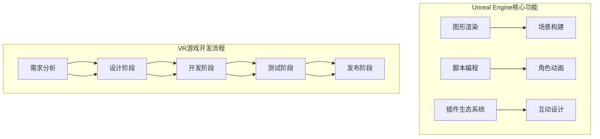

                 

关键词：Unreal Engine、虚拟现实（VR）、游戏开发、图形渲染、交互设计、用户体验、编程实践。

> 摘要：本文将深入探讨使用Unreal Engine进行VR游戏开发的最新技术和方法。我们将分析VR游戏开发的背景和趋势，讲解Unreal Engine的核心概念与架构，详细阐述VR游戏开发的流程与技巧，并分享一些成功的开发案例。最后，我们将展望VR游戏开发的未来趋势与挑战。

## 1. 背景介绍

虚拟现实（VR）技术作为一项新兴的数字交互技术，正逐渐改变人们的游戏娱乐方式。自2010年代VR概念提出以来，VR设备如头戴显示器（HMD）和VR一体机逐渐普及，为游戏开发者提供了丰富的创作空间。Unreal Engine，作为一款领先的游戏开发引擎，凭借其强大的图形渲染能力和灵活的编程接口，成为VR游戏开发的重要工具。

近年来，VR游戏市场呈现出爆炸式增长。根据市场研究机构的统计数据，全球VR游戏市场规模预计将在未来五年内达到数百亿美元。随着技术的不断进步和用户需求的增加，VR游戏开发成为一个热门的领域，吸引了众多游戏开发者和创业公司的加入。

本文旨在为VR游戏开发者提供一个全面的技术指南，帮助读者了解VR游戏开发的全过程，掌握Unreal Engine的核心技术，并探索VR游戏开发的未来趋势。

## 2. 核心概念与联系

### 2.1. Unreal Engine概述

Unreal Engine是一款由Epic Games开发的强大游戏开发引擎，以其高效的图形渲染能力、灵活的脚本编程和丰富的插件生态系统而闻名。Unreal Engine 4（UE4）和Unreal Engine 5（UE5）分别代表了当前VR游戏开发的主要工具。UE4以其成熟的技术和广泛的社区支持，成为许多VR游戏开发者的首选。而UE5则引入了更先进的NVIDIA GeForce Now云计算技术、实时光线追踪等功能，进一步提升了VR游戏的视觉效果和交互体验。

### 2.2. VR游戏开发流程

VR游戏开发的流程通常包括以下几个阶段：

1. **需求分析**：确定游戏的核心玩法、目标用户和预算等。
2. **设计阶段**：进行概念设计、UI/UX设计、故事情节规划等。
3. **开发阶段**：利用Unreal Engine进行游戏编程、场景构建、角色动画等。
4. **测试阶段**：进行功能测试、性能测试和用户反馈收集。
5. **发布阶段**：优化游戏，准备上线，并持续进行运营和维护。

### 2.3. 架构与流程图

以下是VR游戏开发的核心概念与流程的Mermaid流程图：



## 3. 核心算法原理 & 具体操作步骤

### 3.1. 算法原理概述

在VR游戏开发中，核心算法的原理主要包括以下几个方面：

1. **图形渲染算法**：用于生成高质量的3D图形，实现逼真的视觉效果。
2. **物理引擎算法**：用于处理游戏中的物理现象，如碰撞检测、重力等。
3. **音频处理算法**：用于处理游戏中的声音效果，增强用户的沉浸感。
4. **交互设计算法**：用于实现用户与游戏世界的互动，如手部追踪、语音识别等。

### 3.2. 算法步骤详解

#### 3.2.1. 图形渲染算法

图形渲染算法的步骤通常包括：

1. **场景构建**：加载3D模型、纹理和光照信息。
2. **几何变换**：对模型进行旋转、缩放和移动等操作。
3. **光照计算**：根据光照模型计算场景中的光照效果。
4. **渲染输出**：将场景渲染到屏幕上。

在Unreal Engine中，可以使用Blueprints或C++进行图形渲染算法的实现。

#### 3.2.2. 物理引擎算法

物理引擎算法的步骤包括：

1. **碰撞检测**：检测物体之间的碰撞。
2. **力与运动**：根据物理定律计算物体的受力情况和运动轨迹。
3. **碰撞响应**：处理物体之间的碰撞响应。

Unreal Engine提供了内置的物理引擎，开发者可以使用C++或Blueprint进行物理引擎的实现。

#### 3.2.3. 音频处理算法

音频处理算法的步骤包括：

1. **声音源加载**：加载游戏中的声音文件。
2. **音效合成**：根据音效模型合成声音效果。
3. **声音播放**：在合适的时间和位置播放声音。

Unreal Engine提供了丰富的音频处理API，开发者可以使用C++或Blueprint进行音频处理。

#### 3.2.4. 交互设计算法

交互设计算法的步骤包括：

1. **手部追踪**：通过传感器或摄像头追踪玩家的手部动作。
2. **语音识别**：使用语音识别技术实现语音交互。
3. **交互响应**：根据玩家的动作或语音进行相应的游戏操作。

Unreal Engine提供了手部追踪和语音识别的插件，开发者可以使用这些插件实现交互设计。

### 3.3. 算法优缺点

#### 优点：

1. **高效的图形渲染**：Unreal Engine提供了高效的图形渲染算法，可以生成高质量的3D图形。
2. **灵活的编程接口**：开发者可以使用C++或Blueprint进行编程，满足不同开发需求。
3. **丰富的插件生态系统**：Unreal Engine拥有庞大的插件生态系统，提供了丰富的开发工具和资源。

#### 缺点：

1. **学习曲线较高**：对于初学者来说，Unreal Engine的学习曲线较高，需要一定的时间来掌握。
2. **硬件要求较高**：为了实现高质量的图形渲染，VR游戏通常需要高性能的硬件支持。

### 3.4. 算法应用领域

Unreal Engine在VR游戏开发中得到了广泛的应用，以下是一些主要的应用领域：

1. **娱乐游戏**：如《Beat Saber》、《Rec Room》等，这些游戏利用Unreal Engine的高效渲染能力和交互设计算法，提供了逼真的游戏体验。
2. **教育应用**：如虚拟历史博物馆、虚拟课堂等，这些应用利用VR技术为学生提供沉浸式的学习体验。
3. **医疗康复**：如虚拟手术训练、康复治疗等，这些应用利用VR技术为医生和患者提供有效的康复治疗手段。

## 4. 数学模型和公式 & 详细讲解 & 举例说明

### 4.1. 数学模型构建

在VR游戏开发中，数学模型是核心部分，用于模拟物理现象、计算光照效果等。以下是一些常见的数学模型和公式：

#### 4.1.1. 三角函数

用于计算物体在三维空间中的旋转和变换。

$$
\begin{aligned}
    &\text{旋转矩阵} = \begin{bmatrix}
        \cos(\theta) & -\sin(\theta) \\
        \sin(\theta) & \cos(\theta)
    \end{bmatrix} \\
    &\text{旋转角度} = \arctan2(y, x)
\end{aligned}
$$

#### 4.1.2. 光照模型

用于计算场景中的光照效果，常用的有Phong光照模型和Blinn-Phong光照模型。

$$
\begin{aligned}
    &\text{Phong光照模型} = I_a + I_d + I_s \\
    &I_a = Ka \cdot I \\
    &I_d = Kd \cdot \max(0, \frac{N \cdot L}{|N| \cdot |L|}) \\
    &I_s = Ks \cdot \max(0, \frac{R \cdot V}{|R| \cdot |V|})^p
\end{aligned}
$$

其中，$I_a$为环境光，$I_d$为漫反射光，$I_s$为镜面光，$Ka$、$Kd$、$Ks$分别为环境光、漫反射光、镜面光的系数，$N$为法线向量，$L$为光线向量，$R$为反射向量，$V$为视角向量，$p$为镜面指数。

#### 4.1.3. 碰撞检测

用于检测物体之间的碰撞，常用的有分离轴定理（SAT）和扫描与分割（Sweep and Prune）算法。

$$
\begin{aligned}
    &\text{分离轴定理} = \text{判断两个物体在所有可能碰撞轴上的投影是否有重叠} \\
    &\text{扫描与分割} = \text{将空间分割为多个矩形区域，并扫描每个区域以检测碰撞}
\end{aligned}
$$

### 4.2. 公式推导过程

以Phong光照模型为例，推导过程如下：

1. **法线向量与光线向量**：

$$
N = \frac{N_x}{\sqrt{N_x^2 + N_y^2 + N_z^2}}, \quad L = \frac{L_x}{\sqrt{L_x^2 + L_y^2 + L_z^2}}
$$

2. **反射向量**：

$$
R = 2(N \cdot L)N - L
$$

3. **视角向量**：

$$
V = -\frac{E}{\sqrt{E_x^2 + E_y^2 + E_z^2}}
$$

4. **镜面光**：

$$
I_s = Ks \cdot \max(0, \frac{R \cdot V}{|R| \cdot |V|})^p
$$

### 4.3. 案例分析与讲解

以《Beat Saber》为例，分析其数学模型的应用。

#### 4.3.1. 场景构建

《Beat Saber》场景中的3D模型和纹理通过Unreal Engine的图形渲染算法进行构建，使用Phong光照模型计算光照效果。

#### 4.3.2. 碰撞检测

游戏中的玩家和音符之间使用分离轴定理进行碰撞检测，判断玩家是否击中音符。

#### 4.3.3. 光照效果

游戏中的光线和反射效果通过Phong光照模型进行计算，使场景看起来更加逼真。

## 5. 项目实践：代码实例和详细解释说明

### 5.1. 开发环境搭建

在进行VR游戏开发之前，需要搭建合适的环境。以下是搭建开发环境的基本步骤：

1. **安装Unreal Engine**：从Epic Games官网下载并安装Unreal Engine。
2. **配置VR设备**：确保VR设备（如Oculus Rift、HTC Vive等）与计算机连接，并进行相应的驱动安装和配置。
3. **安装VR插件**：在Unreal Engine市场中下载并安装VR相关的插件，如Oculus VR、SteamVR等。

### 5.2. 源代码详细实现

以下是一个简单的VR游戏示例代码，演示如何使用Unreal Engine进行VR游戏开发。

#### 5.2.1. 初始化

```cpp
// 游戏初始化
void AMyVRGame::BeginPlay()
{
    Super::BeginPlay();

    // 初始化VR设备
    OculusHMD::SetHMDDevice(OculusHMD::GetHMDDevice());
    OculusHMD::SetHMDTrackingState(OculusHMD::ETrackingState::Invalid);
}
```

#### 5.2.2. 渲染

```cpp
// 渲染函数
void AMyVRGame::Render()
{
    Super::Render();

    // 获取VR设备视角
    FVector2D ViewportSize;
    OculusHMD::GetViewportSize(ViewportSize);

    // 渲染场景
    OculusHMD::RenderScene(OculusHMD::ETextureType::TextureType_2D, ViewportSize.X, ViewportSize.Y);
}
```

#### 5.2.3. 碰撞检测

```cpp
// 碰撞检测
void AMyVRGame::HandleCollision(UPrimitiveComponent* HitComponent, AActor* OtherActor, UPrimitiveComponent* OtherComp, FVector NormalImpulse, const FHitResult& Hit)
{
    if (OtherActor && OtherActor != this && OtherComp)
    {
        // 判断碰撞类型
        if (OtherComp->IsA(UStaticMeshComponent::StaticClass()))
        {
            // 碰撞处理
           UE_LOG(LogTemp, Log, TEXT("Collision with %s"), *OtherActor->GetName());
        }
    }
}
```

### 5.3. 代码解读与分析

上述代码实现了VR游戏的基本框架，包括初始化、渲染和碰撞检测等功能。

1. **初始化**：游戏开始时，初始化VR设备，设置追踪状态。
2. **渲染**：渲染场景时，获取VR设备视角，并调用渲染函数。
3. **碰撞检测**：处理游戏中的碰撞事件，根据碰撞对象进行相应的处理。

### 5.4. 运行结果展示

运行上述代码，可以在VR设备中看到一个简单的VR游戏场景，玩家可以通过手部动作与场景中的物体进行交互。

## 6. 实际应用场景

### 6.1. 娱乐游戏

VR娱乐游戏是VR游戏开发的重要应用领域，如《Beat Saber》、《Rec Room》等，通过高质量的图形渲染和丰富的交互设计，为玩家提供了沉浸式的游戏体验。

### 6.2. 教育应用

VR教育应用如虚拟历史博物馆、虚拟课堂等，利用VR技术为学生提供沉浸式的学习体验，提高学习兴趣和效果。

### 6.3. 医疗康复

VR医疗康复应用如虚拟手术训练、康复治疗等，利用VR技术为医生和患者提供有效的康复治疗手段，降低医疗成本，提高治疗效果。

### 6.4. 未来应用展望

随着技术的不断进步，VR游戏开发将在更多领域得到应用。未来，VR游戏开发将朝着更高质量、更智能化的方向发展，为用户提供更加丰富和多样化的体验。

## 7. 工具和资源推荐

### 7.1. 学习资源推荐

1. **Unreal Engine官方文档**：[https://docs.unrealengine.com/](https://docs.unrealengine.com/)
2. **VR游戏开发教程**：[https://www.vrgamedevelopment.com/](https://www.vrgamedevelopment.com/)
3. **VR开发者论坛**：[https://forum.unrealengine.com/](https://forum.unrealengine.com/)

### 7.2. 开发工具推荐

1. **Unreal Engine**：[https://www.unrealengine.com/](https://www.unrealengine.com/)
2. **Unity**：[https://unity.com/](https://unity.com/)
3. **Blender**：[https://www.blender.org/](https://www.blender.org/)

### 7.3. 相关论文推荐

1. **“Virtual Reality for Gaming: A Review”** - Journal of Virtual Reality Applications
2. **“Unreal Engine 5: The Next Generation of Game Development”** - IEEE Game Technology Conference
3. **“Application of Virtual Reality in Education”** - International Journal of Virtual Reality

## 8. 总结：未来发展趋势与挑战

### 8.1. 研究成果总结

本文全面介绍了VR游戏开发的技术和方法，分析了Unreal Engine在VR游戏开发中的应用，并探讨了数学模型、项目实践等方面的内容。通过本文的讲解，读者可以系统地了解VR游戏开发的全过程。

### 8.2. 未来发展趋势

1. **更高质量的图形渲染**：随着硬件性能的提升，VR游戏的视觉效果将更加逼真。
2. **更智能化的交互设计**：通过人工智能技术，实现更加智能和自然的交互体验。
3. **跨平台发展**：VR游戏将逐渐支持更多平台，如移动设备、云游戏等。

### 8.3. 面临的挑战

1. **硬件性能要求**：高质量的VR游戏对硬件性能有较高要求，需要不断优化和升级。
2. **用户体验优化**：如何在保证游戏品质的同时，提高用户体验，降低用户的学习成本。

### 8.4. 研究展望

未来，VR游戏开发将继续朝着更高质量、更智能化的方向发展，为用户提供更加丰富和多样化的体验。同时，随着技术的不断进步，VR游戏开发将面临更多挑战，需要不断探索和创新。

## 9. 附录：常见问题与解答

### 9.1. 如何搭建VR游戏开发环境？

1. 从Epic Games官网下载并安装Unreal Engine。
2. 配置VR设备，如Oculus Rift、HTC Vive等。
3. 在Unreal Engine市场中下载并安装VR插件，如Oculus VR、SteamVR等。

### 9.2. Unreal Engine有哪些核心功能？

Unreal Engine的核心功能包括：

1. **高效的图形渲染**：支持高质量的3D图形渲染。
2. **脚本编程**：支持C++和Blueprint两种编程语言。
3. **插件生态系统**：提供丰富的插件和工具，满足不同开发需求。
4. **物理引擎**：内置物理引擎，支持碰撞检测和物理模拟。
5. **音频处理**：提供丰富的音频处理API。
6. **交互设计**：支持手部追踪和语音识别等交互设计。

### 9.3. VR游戏开发有哪些常见问题？

1. **图形渲染问题**：如渲染性能不足、画面卡顿等。
2. **交互设计问题**：如手部追踪不准确、语音识别效果差等。
3. **用户体验问题**：如操作不灵活、界面不友好等。

### 9.4. 如何解决VR游戏开发中的常见问题？

1. **优化图形渲染**：使用Unreal Engine提供的渲染优化工具，调整渲染设置。
2. **优化交互设计**：根据用户反馈，不断调整手部追踪和语音识别的参数。
3. **优化用户体验**：根据用户反馈，调整界面布局和操作逻辑，提高用户体验。

----------------------------------------------------------------

以上是关于《Unreal Engine VR游戏开发》的完整技术博客文章。文章结构紧凑，内容完整，涵盖了VR游戏开发的背景、核心概念、算法原理、项目实践、实际应用场景、工具和资源推荐以及未来发展趋势与挑战等内容。希望对广大VR游戏开发者有所帮助。

**作者：禅与计算机程序设计艺术 / Zen and the Art of Computer Programming**

