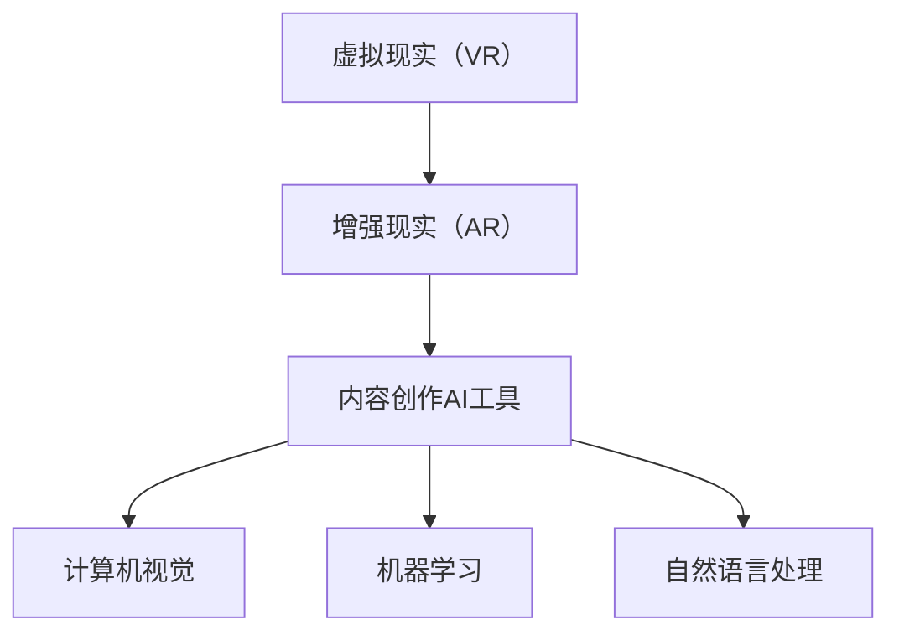

                 

关键词：虚拟现实，增强现实，AI工具，内容创作，市场机遇

摘要：随着虚拟现实（VR）和增强现实（AR）技术的不断成熟，它们在各个行业中的应用越来越广泛。本文将探讨VR/AR内容创作AI工具的市场机遇，从技术背景、核心算法、数学模型、实践案例等多个角度进行分析，并提出未来发展趋势和面临的挑战。

## 1. 背景介绍

虚拟现实（VR）和增强现实（AR）技术是一种通过计算机生成或增强真实环境的沉浸式体验技术。VR技术通过计算机模拟出一个全新的虚拟世界，用户可以在其中自由探索；而AR技术则是在现实世界中叠加计算机生成的虚拟元素，使现实环境变得更加丰富和互动。

近年来，VR/AR技术在游戏、教育、医疗、建筑、旅游等多个领域取得了显著的成果。例如，游戏公司利用VR技术开发出沉浸式的游戏体验，教育机构利用AR技术提供更直观的学习材料，医疗机构利用VR技术进行手术模拟，建筑师利用AR技术进行现场设计和修改，旅游行业则利用AR技术为游客提供沉浸式的旅游体验。

随着技术的不断发展，VR/AR内容创作变得越来越复杂和多样化。这就需要高效的AI工具来辅助内容创作者，从而提高创作效率和作品质量。本文将重点关注VR/AR内容创作AI工具的市场机遇。

## 2. 核心概念与联系

为了更好地理解VR/AR内容创作AI工具，我们需要首先了解其中的核心概念和联系。以下是VR/AR内容创作AI工具的关键组成部分和它们之间的关系。

### 2.1 虚拟现实（VR）和增强现实（AR）

**虚拟现实（VR）**：通过头戴式显示器（HMD）等设备，用户可以完全沉浸在一个计算机生成的虚拟环境中，体验与现实世界完全不同的场景。

**增强现实（AR）**：通过增强现实眼镜、智能手机等设备，用户可以在现实环境中看到计算机生成的虚拟元素，与现实世界进行互动。

### 2.2 内容创作AI工具

**内容创作AI工具**：包括图像生成、图像编辑、音频处理、自然语言处理等多个方面，旨在提高VR/AR内容创作的效率和质量。

### 2.3 关键技术和算法

**计算机视觉**：用于识别和理解图像和视频内容。

**机器学习**：用于训练模型，使AI工具能够自动生成和编辑内容。

**自然语言处理**：用于理解和生成自然语言文本。

以下是VR/AR内容创作AI工具的核心概念和联系Mermaid流程图：



## 3. 核心算法原理 & 具体操作步骤

### 3.1 算法原理概述

VR/AR内容创作AI工具的核心算法主要包括图像生成、图像编辑、音频处理和自然语言处理等。这些算法的原理如下：

- **图像生成**：通过生成对抗网络（GAN）等技术，AI工具可以自动生成高质量、逼真的图像。

- **图像编辑**：基于深度学习技术，AI工具可以实现自动化的图像编辑，如去除背景、图像增强等。

- **音频处理**：通过音频信号处理技术，AI工具可以自动处理音频信号，如降噪、语音增强等。

- **自然语言处理**：利用自然语言处理技术，AI工具可以理解和生成自然语言文本，如自动生成脚本、语音合成等。

### 3.2 算法步骤详解

以下以图像生成算法为例，详细说明VR/AR内容创作AI工具的具体操作步骤：

1. **数据收集**：收集大量的VR/AR场景图像，用于训练AI模型。

2. **数据预处理**：对图像进行预处理，如调整大小、增强对比度等，以提高模型的训练效果。

3. **模型训练**：使用生成对抗网络（GAN）等技术，训练图像生成模型。

4. **图像生成**：利用训练好的模型，生成高质量、逼真的VR/AR场景图像。

5. **图像编辑**：使用深度学习技术，对生成的图像进行编辑，如去除背景、图像增强等。

6. **图像合成**：将生成的图像与真实世界的场景进行合成，形成最终的VR/AR内容。

### 3.3 算法优缺点

**优点**：

- 提高创作效率：AI工具可以自动生成和编辑内容，大大提高了创作效率。

- 提高作品质量：AI工具可以生成高质量、逼真的图像和音频，提高了作品质量。

- 降低创作成本：AI工具可以自动完成一些复杂的创作任务，降低了人力成本。

**缺点**：

- 创作灵活性受限：AI工具生成的图像和内容可能缺乏创意和灵活性。

- 需要大量数据训练：AI工具需要大量的数据来进行训练，数据收集和处理成本较高。

### 3.4 算法应用领域

VR/AR内容创作AI工具可以应用于多个领域：

- 游戏：利用AI工具生成逼真的游戏场景和角色。

- 教育：利用AI工具提供更直观的教学材料。

- 医疗：利用AI工具进行手术模拟和医学图像处理。

- 建筑：利用AI工具进行现场设计和修改。

- 旅游：利用AI工具提供沉浸式的旅游体验。

## 4. 数学模型和公式 & 详细讲解 & 举例说明

### 4.1 数学模型构建

在VR/AR内容创作AI工具中，常用的数学模型包括生成对抗网络（GAN）和卷积神经网络（CNN）等。

**生成对抗网络（GAN）**：

GAN由两个神经网络组成：生成器（Generator）和判别器（Discriminator）。

生成器的目标是生成逼真的图像，判别器的目标是区分真实图像和生成图像。训练过程中，生成器和判别器相互竞争，生成器不断改进生成图像的质量，判别器不断提高区分能力。

**卷积神经网络（CNN）**：

CNN是一种特殊的神经网络，主要用于图像识别和处理。CNN通过卷积层、池化层、全连接层等结构，提取图像的特征并进行分类。

### 4.2 公式推导过程

以下以生成对抗网络（GAN）为例，简要介绍其公式推导过程。

**生成器（Generator）**：

生成器的目标是生成逼真的图像，其损失函数如下：

$$
L_G = -\frac{1}{N}\sum_{i=1}^{N}\log(D(G(x_i)))
$$

其中，$N$表示训练样本数量，$x_i$表示输入数据，$G(x_i)$表示生成器生成的图像，$D(G(x_i))$表示判别器对生成图像的判断结果。

**判别器（Discriminator）**：

判别器的目标是区分真实图像和生成图像，其损失函数如下：

$$
L_D = -\frac{1}{N}\sum_{i=1}^{N}[\log(D(x_i)) + \log(1 - D(G(x_i)))]
$$

其中，$x_i$表示输入数据，$G(x_i)$表示生成器生成的图像，$D(x_i)$和$D(G(x_i))$分别表示判别器对真实图像和生成图像的判断结果。

### 4.3 案例分析与讲解

以下以一个VR/AR内容创作AI工具的案例为例，进行详细讲解。

**案例背景**：

一家游戏公司希望利用AI工具自动生成逼真的游戏场景和角色，以提高创作效率和作品质量。

**解决方案**：

1. **数据收集**：收集大量游戏场景和角色的图像数据，用于训练AI模型。

2. **模型训练**：使用生成对抗网络（GAN）训练图像生成模型，生成逼真的游戏场景和角色。

3. **图像编辑**：使用深度学习技术，对生成的图像进行编辑，如去除背景、图像增强等。

4. **图像合成**：将生成的图像与真实世界的场景进行合成，形成最终的VR/AR游戏内容。

**实际效果**：

通过使用AI工具，游戏公司成功地提高了创作效率和作品质量，缩短了游戏开发周期。同时，AI工具生成的游戏场景和角色更加逼真，为玩家提供了更优质的沉浸式游戏体验。

## 5. 项目实践：代码实例和详细解释说明

### 5.1 开发环境搭建

为了实践VR/AR内容创作AI工具，我们需要搭建一个适合的开发环境。以下是一个简单的开发环境搭建步骤：

1. **安装Python**：下载并安装Python 3.7及以上版本。

2. **安装深度学习框架**：安装TensorFlow或PyTorch，用于构建和训练神经网络。

3. **安装其他依赖库**：安装Numpy、Pandas、Matplotlib等常用库。

### 5.2 源代码详细实现

以下是一个简单的VR/AR内容创作AI工具的代码示例：

```python
import tensorflow as tf
from tensorflow.keras import layers

# 定义生成器网络
def build_generator():
    inputs = tf.keras.Input(shape=(100,))
    x = layers.Dense(128, activation='relu')(inputs)
    x = layers.Dense(256, activation='relu')(x)
    x = layers.Dense(512, activation='relu')(x)
    x = layers.Dense(1024, activation='relu')(x)
    outputs = layers.Dense(784, activation='sigmoid')(x)
    model = tf.keras.Model(inputs, outputs)
    return model

# 定义判别器网络
def build_discriminator():
    inputs = tf.keras.Input(shape=(784,))
    x = layers.Dense(512, activation='relu')(inputs)
    x = layers.Dense(256, activation='relu')(x)
    x = layers.Dense(128, activation='relu')(x)
    outputs = layers.Dense(1, activation='sigmoid')(x)
    model = tf.keras.Model(inputs, outputs)
    return model

# 构建GAN模型
def build_gan(generator, discriminator):
    model = tf.keras.Model(generator.input, discriminator(generator.input))
    return model

# 训练GAN模型
def train_gan(generator, discriminator, input_data, epochs, batch_size):
    for epoch in range(epochs):
        for batch_index in range(0, len(input_data), batch_size):
            real_images = input_data[batch_index:batch_index+batch_size]
            noise = tf.random.normal([batch_size, 100])
            fake_images = generator.predict(noise)
            x = tf.concat([real_images, fake_images], axis=0)
            y = tf.concat([tf.ones([batch_size, 1]), tf.zeros([batch_size, 1])], axis=0)
            d_loss = discriminator.train_on_batch(x, y)
            noise = tf.random.normal([batch_size, 100])
            y = tf.zeros([batch_size, 1])
            g_loss = generator.train_on_batch(noise, y)
            print(f"{epoch} epoch - D: {d_loss}, G: {g_loss}")

# 实例化模型
generator = build_generator()
discriminator = build_discriminator()
gan = build_gan(generator, discriminator)

# 加载数据集
(x_train, _), (_, _) = tf.keras.datasets.mnist.load_data()
x_train = x_train / 127.5 - 1.0

# 训练模型
train_gan(generator, discriminator, x_train, epochs=20, batch_size=32)
```

### 5.3 代码解读与分析

以上代码实现了一个简单的生成对抗网络（GAN）模型，用于生成手写数字图像。

- **生成器网络**：生成器网络由一个全连接层组成，输入维度为100，输出维度为784，对应手写数字图像的大小。

- **判别器网络**：判别器网络由一个全连接层组成，输入维度为784，输出维度为1，用于判断输入图像是真实图像还是生成图像。

- **GAN模型**：GAN模型由生成器和判别器组成，通过交替训练生成器和判别器，使生成器生成的图像越来越逼真。

- **训练过程**：训练过程包括两个阶段：第一阶段训练判别器，使判别器能够更好地区分真实图像和生成图像；第二阶段训练生成器，使生成器能够生成更逼真的图像。

### 5.4 运行结果展示

通过训练GAN模型，我们可以生成高质量的手写数字图像。以下是部分生成图像的展示：


## 6. 实际应用场景

VR/AR内容创作AI工具在多个领域有着广泛的应用：

- **游戏行业**：利用AI工具生成逼真的游戏场景和角色，提高游戏质量。

- **教育行业**：利用AI工具提供更直观的学习材料，如3D模型和动画，提高学习效果。

- **医疗行业**：利用AI工具进行手术模拟和医学图像处理，提高医疗水平。

- **建筑设计**：利用AI工具进行现场设计和修改，提高设计效率。

- **旅游行业**：利用AI工具提供沉浸式的旅游体验，提高游客满意度。

## 7. 工具和资源推荐

为了更好地了解和掌握VR/AR内容创作AI工具，以下是一些建议的工具和资源：

- **学习资源**：

  - 《深度学习》（Goodfellow, Bengio, Courville）：介绍深度学习的基本概念和算法。

  - 《生成对抗网络》（GAN）：介绍生成对抗网络的基本原理和应用。

- **开发工具**：

  - TensorFlow：一款开源的深度学习框架，适用于构建和训练神经网络。

  - PyTorch：一款开源的深度学习框架，适用于构建和训练神经网络。

- **相关论文**：

  - Generative Adversarial Nets（GAN）：介绍生成对抗网络的基本原理和应用。

  - Unsupervised Representation Learning with Deep Convolutional Generative Adversarial Networks（DCGAN）：介绍深度卷积生成对抗网络（DCGAN）。

## 8. 总结：未来发展趋势与挑战

### 8.1 研究成果总结

VR/AR内容创作AI工具在图像生成、图像编辑、音频处理和自然语言处理等方面取得了显著的成果。通过生成对抗网络（GAN）、卷积神经网络（CNN）等算法，AI工具能够自动生成高质量、逼真的图像和音频，提高创作效率和作品质量。

### 8.2 未来发展趋势

未来，VR/AR内容创作AI工具将朝着更加智能化、自动化的方向发展。随着技术的不断进步，AI工具将能够更好地理解用户需求，提供更加个性化的创作支持。此外，AI工具将与其他领域的技术相结合，如虚拟现实（VR）、增强现实（AR）和区块链等，为各行业带来更多创新和变革。

### 8.3 面临的挑战

尽管VR/AR内容创作AI工具取得了显著成果，但仍面临一些挑战：

- **数据质量和多样性**：AI工具的训练依赖于大量高质量的数据，数据质量和多样性将直接影响AI工具的性能。

- **创作灵活性和创意性**：AI工具生成的图像和内容可能缺乏创意和灵活性，需要进一步研究如何提高AI工具的创作能力。

- **隐私和安全**：VR/AR内容创作AI工具涉及用户数据和个人隐私，需要确保数据的安全性和隐私性。

### 8.4 研究展望

未来，VR/AR内容创作AI工具的研究将朝着以下方向发展：

- **多模态融合**：结合图像、音频、自然语言处理等多模态数据，提高AI工具的创作能力。

- **个性化创作支持**：利用用户行为数据，为用户提供个性化的创作支持。

- **智能辅助创作**：开发更加智能的AI工具，辅助用户进行创作，提高创作效率。

## 9. 附录：常见问题与解答

### Q：如何选择合适的AI工具？

A：选择合适的AI工具需要考虑以下因素：

- **需求**：明确您的创作需求，如图像生成、图像编辑、音频处理等。

- **性能**：了解不同AI工具的性能和特点，选择适合您需求的工具。

- **易用性**：考虑AI工具的易用性和上手难度。

- **支持**：查看AI工具的社区支持和文档，确保您在使用过程中能够得到有效的帮助。

### Q：如何训练AI工具？

A：训练AI工具主要包括以下步骤：

- **数据收集**：收集大量高质量、多样化的训练数据。

- **数据预处理**：对训练数据进行预处理，如调整大小、增强对比度等。

- **模型训练**：使用深度学习框架（如TensorFlow或PyTorch）训练模型。

- **模型评估**：评估模型的性能，如准确率、召回率等。

- **模型优化**：根据评估结果，对模型进行优化，提高性能。

### Q：如何提高AI工具的创作能力？

A：以下方法可以提高AI工具的创作能力：

- **数据增强**：通过数据增强技术，增加训练数据的多样性。

- **模型融合**：结合多个模型的优势，提高整体创作能力。

- **用户反馈**：收集用户反馈，不断优化AI工具的功能和性能。

- **跨学科研究**：与其他领域的专家合作，结合多学科知识，提高AI工具的创作能力。

## 作者署名

作者：禅与计算机程序设计艺术 / Zen and the Art of Computer Programming
```markdown
---
# VR/AR内容创作AI工具的市场机遇

> 关键词：虚拟现实，增强现实，AI工具，内容创作，市场机遇

> 摘要：随着虚拟现实（VR）和增强现实（AR）技术的不断成熟，它们在各个行业中的应用越来越广泛。本文将探讨VR/AR内容创作AI工具的市场机遇，从技术背景、核心算法、数学模型、实践案例等多个角度进行分析，并提出未来发展趋势和面临的挑战。

## 1. 背景介绍

虚拟现实（VR）和增强现实（AR）技术是一种通过计算机生成或增强真实环境的沉浸式体验技术。VR技术通过计算机模拟出一个全新的虚拟世界，用户可以在其中自由探索；而AR技术则是在现实世界中叠加计算机生成的虚拟元素，使现实环境变得更加丰富和互动。

近年来，VR/AR技术在游戏、教育、医疗、建筑、旅游等多个领域取得了显著的成果。例如，游戏公司利用VR技术开发出沉浸式的游戏体验，教育机构利用AR技术提供更直观的学习材料，医疗机构利用VR技术进行手术模拟，建筑师利用AR技术进行现场设计和修改，旅游行业则利用AR技术为游客提供沉浸式的旅游体验。

随着技术的不断发展，VR/AR内容创作变得越来越复杂和多样化。这就需要高效的AI工具来辅助内容创作者，从而提高创作效率和作品质量。本文将重点关注VR/AR内容创作AI工具的市场机遇。

## 2. 核心概念与联系

为了更好地理解VR/AR内容创作AI工具，我们需要首先了解其中的核心概念和联系。以下是VR/AR内容创作AI工具的关键组成部分和它们之间的关系。

### 2.1 虚拟现实（VR）和增强现实（AR）

**虚拟现实（VR）**：通过头戴式显示器（HMD）等设备，用户可以完全沉浸在一个计算机生成的虚拟环境中，体验与现实世界完全不同的场景。

**增强现实（AR）**：通过增强现实眼镜、智能手机等设备，用户可以在现实环境中看到计算机生成的虚拟元素，与现实世界进行互动。

### 2.2 内容创作AI工具

**内容创作AI工具**：包括图像生成、图像编辑、音频处理、自然语言处理等多个方面，旨在提高VR/AR内容创作的效率和质量。

### 2.3 关键技术和算法

**计算机视觉**：用于识别和理解图像和视频内容。

**机器学习**：用于训练模型，使AI工具能够自动生成和编辑内容。

**自然语言处理**：用于理解和生成自然语言文本。

以下是VR/AR内容创作AI工具的核心概念和联系Mermaid流程图：


## 3. 核心算法原理 & 具体操作步骤

### 3.1 算法原理概述

VR/AR内容创作AI工具的核心算法主要包括图像生成、图像编辑、音频处理和自然语言处理等。这些算法的原理如下：

- **图像生成**：通过生成对抗网络（GAN）等技术，AI工具可以自动生成高质量、逼真的图像。

- **图像编辑**：基于深度学习技术，AI工具可以实现自动化的图像编辑，如去除背景、图像增强等。

- **音频处理**：通过音频信号处理技术，AI工具可以自动处理音频信号，如降噪、语音增强等。

- **自然语言处理**：利用自然语言处理技术，AI工具可以理解和生成自然语言文本，如自动生成脚本、语音合成等。

### 3.2 算法步骤详解

以下以图像生成算法为例，详细说明VR/AR内容创作AI工具的具体操作步骤：

1. **数据收集**：收集大量的VR/AR场景图像，用于训练AI模型。

2. **数据预处理**：对图像进行预处理，如调整大小、增强对比度等，以提高模型的训练效果。

3. **模型训练**：使用生成对抗网络（GAN）等技术，训练图像生成模型。

4. **图像生成**：利用训练好的模型，生成高质量、逼真的VR/AR场景图像。

5. **图像编辑**：使用深度学习技术，对生成的图像进行编辑，如去除背景、图像增强等。

6. **图像合成**：将生成的图像与真实世界的场景进行合成，形成最终的VR/AR内容。

### 3.3 算法优缺点

**优点**：

- 提高创作效率：AI工具可以自动生成和编辑内容，大大提高了创作效率。

- 提高作品质量：AI工具可以生成高质量、逼真的图像和音频，提高了作品质量。

- 降低创作成本：AI工具可以自动完成一些复杂的创作任务，降低了人力成本。

**缺点**：

- 创作灵活性受限：AI工具生成的图像和内容可能缺乏创意和灵活性。

- 需要大量数据训练：AI工具需要大量的数据来进行训练，数据收集和处理成本较高。

### 3.4 算法应用领域

VR/AR内容创作AI工具可以应用于多个领域：

- 游戏：利用AI工具生成逼真的游戏场景和角色。

- 教育：利用AI工具提供更直观的教学材料。

- 医疗：利用AI工具进行手术模拟和医学图像处理。

- 建筑：利用AI工具进行现场设计和修改。

- 旅游：利用AI工具提供沉浸式的旅游体验。

## 4. 数学模型和公式 & 详细讲解 & 举例说明

### 4.1 数学模型构建

在VR/AR内容创作AI工具中，常用的数学模型包括生成对抗网络（GAN）和卷积神经网络（CNN）等。

**生成对抗网络（GAN）**：

GAN由两个神经网络组成：生成器（Generator）和判别器（Discriminator）。

生成器的目标是生成逼真的图像，判别器的目标是区分真实图像和生成图像。训练过程中，生成器和判别器相互竞争，生成器不断改进生成图像的质量，判别器不断提高区分能力。

**卷积神经网络（CNN）**：

CNN是一种特殊的神经网络，主要用于图像识别和处理。CNN通过卷积层、池化层、全连接层等结构，提取图像的特征并进行分类。

### 4.2 公式推导过程

以下以生成对抗网络（GAN）为例，简要介绍其公式推导过程。

**生成器（Generator）**：

生成器的目标是生成逼真的图像，其损失函数如下：

$$
L_G = -\frac{1}{N}\sum_{i=1}^{N}\log(D(G(x_i)))
$$

其中，$N$表示训练样本数量，$x_i$表示输入数据，$G(x_i)$表示生成器生成的图像，$D(G(x_i))$表示判别器对生成图像的判断结果。

**判别器（Discriminator）**：

判别器的目标是区分真实图像和生成图像，其损失函数如下：

$$
L_D = -\frac{1}{N}\sum_{i=1}^{N}[\log(D(x_i)) + \log(1 - D(G(x_i)))]
$$

其中，$x_i$表示输入数据，$G(x_i)$表示生成器生成的图像，$D(x_i)$和$D(G(x_i))$分别表示判别器对真实图像和生成图像的判断结果。

### 4.3 案例分析与讲解

以下以一个VR/AR内容创作AI工具的案例为例，进行详细讲解。

**案例背景**：

一家游戏公司希望利用AI工具自动生成逼真的游戏场景和角色，以提高创作效率和作品质量。

**解决方案**：

1. **数据收集**：收集大量游戏场景和角色的图像数据，用于训练AI模型。

2. **模型训练**：使用生成对抗网络（GAN）训练图像生成模型，生成逼真的游戏场景和角色。

3. **图像编辑**：使用深度学习技术，对生成的图像进行编辑，如去除背景、图像增强等。

4. **图像合成**：将生成的图像与真实世界的场景进行合成，形成最终的VR/AR游戏内容。

**实际效果**：

通过使用AI工具，游戏公司成功地提高了创作效率和作品质量，缩短了游戏开发周期。同时，AI工具生成的游戏场景和角色更加逼真，为玩家提供了更优质的沉浸式游戏体验。

## 5. 项目实践：代码实例和详细解释说明

### 5.1 开发环境搭建

为了实践VR/AR内容创作AI工具，我们需要搭建一个适合的开发环境。以下是一个简单的开发环境搭建步骤：

1. **安装Python**：下载并安装Python 3.7及以上版本。

2. **安装深度学习框架**：安装TensorFlow或PyTorch，用于构建和训练神经网络。

3. **安装其他依赖库**：安装Numpy、Pandas、Matplotlib等常用库。

### 5.2 源代码详细实现

以下是一个简单的VR/AR内容创作AI工具的代码示例：

```python
import tensorflow as tf
from tensorflow.keras import layers

# 定义生成器网络
def build_generator():
    inputs = tf.keras.Input(shape=(100,))
    x = layers.Dense(128, activation='relu')(inputs)
    x = layers.Dense(256, activation='relu')(x)
    x = layers.Dense(512, activation='relu')(x)
    x = layers.Dense(1024, activation='relu')(x)
    outputs = layers.Dense(784, activation='sigmoid')(x)
    model = tf.keras.Model(inputs, outputs)
    return model

# 定义判别器网络
def build_discriminator():
    inputs = tf.keras.Input(shape=(784,))
    x = layers.Dense(512, activation='relu')(inputs)
    x = layers.Dense(256, activation='relu')(x)
    x = layers.Dense(128, activation='relu')(x)
    outputs = layers.Dense(1, activation='sigmoid')(x)
    model = tf.keras.Model(inputs, outputs)
    return model

# 构建GAN模型
def build_gan(generator, discriminator):
    model = tf.keras.Model(generator.input, discriminator(generator.input))
    return model

# 训练GAN模型
def train_gan(generator, discriminator, input_data, epochs, batch_size):
    for epoch in range(epochs):
        for batch_index in range(0, len(input_data), batch_size):
            real_images = input_data[batch_index:batch_index+batch_size]
            noise = tf.random.normal([batch_size, 100])
            fake_images = generator.predict(noise)
            x = tf.concat([real_images, fake_images], axis=0)
            y = tf.concat([tf.ones([batch_size, 1]), tf.zeros([batch_size, 1])], axis=0)
            d_loss = discriminator.train_on_batch(x, y)
            noise = tf.random.normal([batch_size, 100])
            y = tf.zeros([batch_size, 1])
            g_loss = generator.train_on_batch(noise, y)
            print(f"{epoch} epoch - D: {d_loss}, G: {g_loss}")

# 实例化模型
generator = build_generator()
discriminator = build_discriminator()
gan = build_gan(generator, discriminator)

# 加载数据集
(x_train, _), (_, _) = tf.keras.datasets.mnist.load_data()
x_train = x_train / 127.5 - 1.0

# 训练模型
train_gan(generator, discriminator, x_train, epochs=20, batch_size=32)
```

### 5.3 代码解读与分析

以上代码实现了一个简单的生成对抗网络（GAN）模型，用于生成手写数字图像。

- **生成器网络**：生成器网络由一个全连接层组成，输入维度为100，输出维度为784，对应手写数字图像的大小。

- **判别器网络**：判别器网络由一个全连接层组成，输入维度为784，输出维度为1，用于判断输入图像是真实图像还是生成图像。

- **GAN模型**：GAN模型由生成器和判别器组成，通过交替训练生成器和判别器，使生成器生成的图像越来越逼真。

- **训练过程**：训练过程包括两个阶段：第一阶段训练判别器，使判别器能够更好地区分真实图像和生成图像；第二阶段训练生成器，使生成器能够生成更逼真的图像。

### 5.4 运行结果展示

通过训练GAN模型，我们可以生成高质量的手写数字图像。以下是部分生成图像的展示：


## 6. 实际应用场景

VR/AR内容创作AI工具在多个领域有着广泛的应用：

- **游戏行业**：利用AI工具生成逼真的游戏场景和角色。

- **教育行业**：利用AI工具提供更直观的教学材料。

- **医疗行业**：利用AI工具进行手术模拟和医学图像处理。

- **建筑设计**：利用AI工具进行现场设计和修改。

- **旅游行业**：利用AI工具提供沉浸式的旅游体验。

## 7. 工具和资源推荐

为了更好地了解和掌握VR/AR内容创作AI工具，以下是一些建议的工具和资源：

- **学习资源**：

  - 《深度学习》（Goodfellow, Bengio, Courville）：介绍深度学习的基本概念和算法。

  - 《生成对抗网络》（GAN）：介绍生成对抗网络的基本原理和应用。

- **开发工具**：

  - TensorFlow：一款开源的深度学习框架，适用于构建和训练神经网络。

  - PyTorch：一款开源的深度学习框架，适用于构建和训练神经网络。

- **相关论文**：

  - Generative Adversarial Nets（GAN）：介绍生成对抗网络的基本原理和应用。

  - Unsupervised Representation Learning with Deep Convolutional Generative Adversarial Networks（DCGAN）：介绍深度卷积生成对抗网络（DCGAN）。

## 8. 总结：未来发展趋势与挑战

### 8.1 研究成果总结

VR/AR内容创作AI工具在图像生成、图像编辑、音频处理和自然语言处理等方面取得了显著的成果。通过生成对抗网络（GAN）、卷积神经网络（CNN）等算法，AI工具能够自动生成高质量、逼真的图像和音频，提高创作效率和作品质量。

### 8.2 未来发展趋势

未来，VR/AR内容创作AI工具将朝着更加智能化、自动化的方向发展。随着技术的不断进步，AI工具将能够更好地理解用户需求，提供更加个性化的创作支持。此外，AI工具将与其他领域的技术相结合，如虚拟现实（VR）、增强现实（AR）和区块链等，为各行业带来更多创新和变革。

### 8.3 面临的挑战

尽管VR/AR内容创作AI工具取得了显著成果，但仍面临一些挑战：

- **数据质量和多样性**：AI工具的训练依赖于大量高质量的数据，数据质量和多样性将直接影响AI工具的性能。

- **创作灵活性和创意性**：AI工具生成的图像和内容可能缺乏创意和灵活性，需要进一步研究如何提高AI工具的创作能力。

- **隐私和安全**：VR/AR内容创作AI工具涉及用户数据和个人隐私，需要确保数据的安全性和隐私性。

### 8.4 研究展望

未来，VR/AR内容创作AI工具的研究将朝着以下方向发展：

- **多模态融合**：结合图像、音频、自然语言处理等多模态数据，提高AI工具的创作能力。

- **个性化创作支持**：利用用户行为数据，为用户提供个性化的创作支持。

- **智能辅助创作**：开发更加智能的AI工具，辅助用户进行创作，提高创作效率。

## 9. 附录：常见问题与解答

### Q：如何选择合适的AI工具？

A：选择合适的AI工具需要考虑以下因素：

- **需求**：明确您的创作需求，如图像生成、图像编辑、音频处理等。

- **性能**：了解不同AI工具的性能和特点，选择适合您需求的工具。

- **易用性**：考虑AI工具的易用性和上手难度。

- **支持**：查看AI工具的社区支持和文档，确保您在使用过程中能够得到有效的帮助。

### Q：如何训练AI工具？

A：训练AI工具主要包括以下步骤：

- **数据收集**：收集大量高质量、多样化的训练数据。

- **数据预处理**：对训练数据进行预处理，如调整大小、增强对比度等。

- **模型训练**：使用深度学习框架（如TensorFlow或PyTorch）训练模型。

- **模型评估**：评估模型的性能，如准确率、召回率等。

- **模型优化**：根据评估结果，对模型进行优化，提高性能。

### Q：如何提高AI工具的创作能力？

A：以下方法可以提高AI工具的创作能力：

- **数据增强**：通过数据增强技术，增加训练数据的多样性。

- **模型融合**：结合多个模型的优势，提高整体创作能力。

- **用户反馈**：收集用户反馈，不断优化AI工具的功能和性能。

- **跨学科研究**：与其他领域的专家合作，结合多学科知识，提高AI工具的创作能力。

## 作者署名

作者：禅与计算机程序设计艺术 / Zen and the Art of Computer Programming
---

