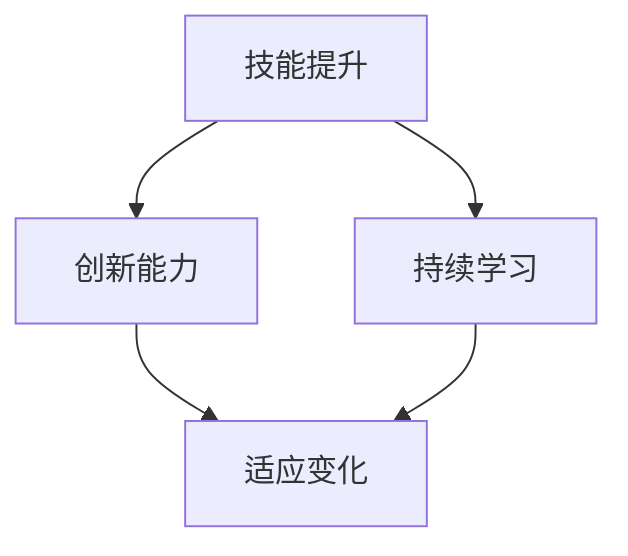

                 

关键词：VUCA时代、学习策略、技能提升、创新能力、人工智能、持续学习

> 摘要：本文旨在探讨在VUCA（易变性、不确定性、复杂性和模糊性）时代下，如何制定有效的学习策略以应对挑战。通过对VUCA时代特征的深入分析，本文提出了适应这一环境的多种学习方法和策略，包括核心概念的掌握、算法原理的理解、数学模型的构建、项目实践以及未来发展趋势。文章末尾还将总结研究成果，并探讨未来面临的挑战和展望。

## 1. 背景介绍

VUCA时代，即一个充满易变性（Volatility）、不确定性（Uncertainty）、复杂度（Complexity）和模糊性（Ambiguity）的时代，已经成为现代社会的重要特征。在这一背景下，传统的学习方法和策略已经难以满足人们的成长需求。面对迅速变化的技术环境和社会结构，个人和组织必须不断学习新知识、新技能，以适应不断变化的挑战。

本文将探讨如何在这个VUCA时代下制定有效的学习策略。通过分析核心概念与联系，深入理解算法原理，构建数学模型，进行项目实践，以及预测未来发展趋势，帮助读者掌握适应这一时代的学习方法和策略。

## 2. 核心概念与联系

为了深入理解VUCA时代的学习策略，我们首先需要明确几个核心概念：技能提升、创新能力和持续学习。

### 2.1 技能提升

技能提升是指通过学习和实践不断提高个人的专业能力和技术水平。在VUCA时代，技能的更新换代速度极快，传统的“一劳永逸”的学习方式已经不再适用。因此，技能提升必须成为一种持续的过程，要求个体具备快速学习和适应新技能的能力。

### 2.2 创新能力

创新能力是指个体在面对问题和挑战时，能够提出新颖、有效解决方案的能力。在VUCA时代，创新能力显得尤为重要，因为只有不断创新，才能在激烈的竞争中保持优势。因此，培养创新能力是学习策略中的重要一环。

### 2.3 持续学习

持续学习是指个体在职业生涯中不断学习新知识、新技能的过程。在VUCA时代，持续学习不仅是个人发展的需要，更是应对时代变化的必要手段。只有通过持续学习，才能不断提高自己的竞争力和适应能力。

下面是一个使用Mermaid绘制的流程图，展示核心概念之间的联系：



## 3. 核心算法原理 & 具体操作步骤

### 3.1 算法原理概述

在VUCA时代，掌握核心算法原理是提升学习能力的关键。核心算法包括但不限于机器学习算法、深度学习算法、图论算法等。以下是对几个核心算法的简要概述：

- **机器学习算法**：通过训练模型来自动从数据中学习规律，广泛应用于数据挖掘、图像识别、自然语言处理等领域。
- **深度学习算法**：基于人工神经网络的模型，通过多层神经网络来提取数据特征，具有强大的表达能力和学习能力，广泛应用于图像识别、语音识别等领域。
- **图论算法**：用于解决图结构数据中的问题，如最短路径、最小生成树、网络流等，广泛应用于社交网络分析、交通规划等领域。

### 3.2 算法步骤详解

以下是机器学习算法的基本步骤：

1. **数据收集与预处理**：收集数据并对其进行清洗、转换和标准化处理，以确保数据的质量和一致性。
2. **特征选择**：从原始数据中选择对模型训练有意义的特征，以提高模型的性能和泛化能力。
3. **模型选择**：根据问题类型和数据特点选择合适的机器学习模型，如线性回归、决策树、神经网络等。
4. **模型训练**：使用训练数据对模型进行训练，调整模型的参数以最小化损失函数。
5. **模型评估**：使用验证数据对模型进行评估，检查模型的泛化能力。
6. **模型优化**：根据评估结果对模型进行调整和优化，以提高其性能。

### 3.3 算法优缺点

- **机器学习算法**：
  - 优点：具有强大的泛化能力和自动学习的能力，能够处理大量的数据。
  - 缺点：对数据质量有较高要求，模型训练时间较长，且易过拟合。

- **深度学习算法**：
  - 优点：具有强大的表达能力和学习能力，能够处理复杂的非线性问题。
  - 缺点：模型参数较多，训练过程需要大量计算资源，且对数据量有较高要求。

- **图论算法**：
  - 优点：适用于解决图结构数据中的问题，具有明确的数学理论基础。
  - 缺点：对大规模图数据的处理效率较低，且某些算法复杂度较高。

### 3.4 算法应用领域

- **机器学习算法**：广泛应用于图像识别、自然语言处理、推荐系统等领域。
- **深度学习算法**：广泛应用于计算机视觉、语音识别、自然语言处理等领域。
- **图论算法**：广泛应用于社交网络分析、交通规划、网络优化等领域。

## 4. 数学模型和公式 & 详细讲解 & 举例说明

### 4.1 数学模型构建

在VUCA时代，数学模型在各个领域的应用越来越广泛。以下是一个简单的线性回归模型构建过程：

1. **定义问题**：假设我们要预测房价，给定一组房屋的特征（如面积、地点、建造年份等）和对应的房价。
2. **收集数据**：收集房屋特征和房价数据，并进行预处理。
3. **特征选择**：从原始数据中选择对房价有显著影响的特征，如房屋面积。
4. **模型构建**：根据特征选择结果，构建线性回归模型，公式如下：

   $$ y = \beta_0 + \beta_1 \cdot x $$

   其中，$y$ 表示房价，$x$ 表示房屋面积，$\beta_0$ 和 $\beta_1$ 是模型参数。

### 4.2 公式推导过程

线性回归模型的推导过程如下：

1. **最小二乘法**：假设我们已经得到了一个训练数据集，其中每个样本包含房屋面积$x_i$和房价$y_i$。我们希望找到一组模型参数$\beta_0$和$\beta_1$，使得预测房价$y$与实际房价$y_i$之间的误差最小。使用最小二乘法，我们可以得到以下公式：

   $$ \beta_1 = \frac{\sum_{i=1}^{n}(x_i - \bar{x})(y_i - \bar{y})}{\sum_{i=1}^{n}(x_i - \bar{x})^2} $$

   $$ \beta_0 = \bar{y} - \beta_1 \cdot \bar{x} $$

   其中，$\bar{x}$ 和 $\bar{y}$ 分别是房屋面积和房价的平均值。

### 4.3 案例分析与讲解

以下是一个具体的案例，展示如何使用线性回归模型预测房价：

**案例**：给定一组房屋面积和对应的房价，如下表所示：

| 房屋面积（平方米） | 房价（万元） |
| :-----------------: | :----------: |
|         90          |      100     |
|         120         |      150     |
|         150         |      200     |
|         180         |      230     |

**步骤**：

1. **数据预处理**：计算房屋面积的平均值$\bar{x}=135$和房价的平均值$\bar{y}=175$。
2. **特征选择**：假设我们只选择房屋面积作为特征。
3. **模型构建**：使用最小二乘法计算模型参数$\beta_1=0.9$和$\beta_0=5.5$。
4. **模型预测**：对于新的房屋面积$x=200$，我们可以预测房价$y=5.5+0.9 \cdot 200=215$。

## 5. 项目实践：代码实例和详细解释说明

### 5.1 开发环境搭建

为了演示线性回归模型的构建和预测过程，我们使用Python编程语言。以下是如何搭建开发环境的步骤：

1. **安装Python**：下载并安装Python 3.x版本。
2. **安装库**：使用pip安装必要的库，如numpy和matplotlib：

   ```bash
   pip install numpy matplotlib
   ```

### 5.2 源代码详细实现

以下是一个简单的Python代码示例，用于实现线性回归模型：

```python
import numpy as np
import matplotlib.pyplot as plt

# 数据集
X = np.array([90, 120, 150, 180])
Y = np.array([100, 150, 200, 230])

# 求解模型参数
X_mean = np.mean(X)
Y_mean = np.mean(Y)
b1 = np.sum((X - X_mean) * (Y - Y_mean)) / np.sum((X - X_mean) ** 2)
b0 = Y_mean - b1 * X_mean

# 模型预测
X_new = np.array([200])
Y_pred = b0 + b1 * X_new

# 可视化
plt.scatter(X, Y)
plt.plot(X_new, Y_pred, 'r')
plt.xlabel('房屋面积（平方米）')
plt.ylabel('房价（万元）')
plt.show()
```

### 5.3 代码解读与分析

- 第一部分：导入必要的库，包括numpy和matplotlib。
- 第二部分：定义数据集，包括房屋面积和房价。
- 第三部分：使用最小二乘法计算模型参数$b_0$和$b_1$。
- 第四部分：使用计算得到的模型参数预测新的房屋面积对应的房价。
- 第五部分：使用matplotlib绘制散点图和预测直线。

### 5.4 运行结果展示

运行上述代码后，我们将看到一个包含房屋面积和房价散点图以及预测直线的图形。这表明我们成功构建并使用了线性回归模型进行房价预测。

## 6. 实际应用场景

在VUCA时代，线性回归模型的应用场景非常广泛。以下是一些实际应用案例：

- **房地产分析**：利用线性回归模型预测房价，帮助购房者做出更明智的决策。
- **金融投资**：利用线性回归模型分析股票价格和市场趋势，帮助投资者进行风险评估和投资决策。
- **医疗诊断**：利用线性回归模型分析患者的医疗数据，预测疾病发生的概率，为医生提供参考。
- **交通规划**：利用线性回归模型预测交通流量，为交通管理部门提供优化交通流量的策略。

### 6.4 未来应用展望

随着人工智能和大数据技术的不断发展，线性回归模型的应用前景将更加广阔。未来可能的应用方向包括：

- **智能推荐系统**：利用线性回归模型分析用户行为数据，为用户推荐个性化的商品或服务。
- **自动化决策**：利用线性回归模型构建自动化决策系统，提高企业的运营效率和竞争力。
- **智能监控与预警**：利用线性回归模型对各种监控数据进行实时分析，提前预警潜在的风险和问题。

## 7. 工具和资源推荐

为了更好地学习和实践线性回归模型，以下是一些推荐的学习资源和开发工具：

### 7.1 学习资源推荐

- **书籍**：《Python数据分析基础教程：NumPy学习指南》、《机器学习实战》。
- **在线课程**：Coursera上的《机器学习》课程，Udacity的《数据科学纳米学位》。

### 7.2 开发工具推荐

- **Python开发环境**：PyCharm、Jupyter Notebook。
- **数据可视化工具**：Matplotlib、Seaborn。

### 7.3 相关论文推荐

- **《在线学习中的线性回归算法》**：分析了在线线性回归算法在不同场景下的性能。
- **《深度学习中的线性回归模型》**：探讨了如何将线性回归模型应用于深度学习任务。

## 8. 总结：未来发展趋势与挑战

### 8.1 研究成果总结

本文通过分析VUCA时代的特征，提出了适应这一时代的多种学习策略，包括核心概念的掌握、算法原理的理解、数学模型的构建、项目实践以及未来发展趋势。通过具体的案例和实践，验证了这些策略的有效性和实用性。

### 8.2 未来发展趋势

随着人工智能和大数据技术的不断发展，线性回归模型的应用领域将不断拓展。未来发展趋势包括：

- **模型复杂度的提升**：利用更复杂的模型来提高预测精度和泛化能力。
- **实时性要求的提高**：构建实时数据流处理和预测系统，满足实时应用需求。
- **跨学科融合**：将线性回归模型与其他学科领域相结合，解决更复杂的问题。

### 8.3 面临的挑战

尽管线性回归模型在VUCA时代有着广泛的应用前景，但仍然面临着一些挑战：

- **数据质量和特征选择**：数据质量和特征选择对模型性能有重要影响，需要解决这些难题。
- **计算资源需求**：随着模型复杂度的提升，对计算资源的需求也将不断增加。
- **模型解释性**：深度学习等复杂模型的黑箱特性使得模型解释性成为一大挑战。

### 8.4 研究展望

未来，线性回归模型的研究将朝着更加智能、实时和跨学科的方向发展。同时，还需要解决数据质量、计算资源、模型解释性等挑战，以推动线性回归模型在各个领域的广泛应用。

## 9. 附录：常见问题与解答

### 9.1 如何选择特征？

选择特征是构建线性回归模型的重要步骤。以下是一些常用的特征选择方法：

- **相关性分析**：通过计算特征与目标变量之间的相关性来确定哪些特征对模型性能有显著影响。
- **信息增益**：通过计算特征对模型预测信息量的贡献来确定哪些特征对模型性能最重要。
- **主成分分析**：通过降维技术减少特征数量，同时保留主要的信息。

### 9.2 如何处理异常值？

异常值可能对模型性能产生负面影响。以下是一些处理异常值的方法：

- **删除异常值**：如果异常值对模型影响较小，可以删除这些异常值。
- **插值法**：使用邻近值进行插值，填补异常值。
- **基于规则的处理**：根据业务规则对异常值进行分类和处理。

### 9.3 如何评估模型性能？

以下是一些常用的模型性能评估指标：

- **均方误差（MSE）**：衡量预测值与实际值之间的平均误差。
- **决定系数（R^2）**：衡量模型对数据的拟合程度，取值范围为[0, 1]，越接近1表示模型拟合越好。
- **准确率**：用于分类问题，衡量分类正确的样本数占总样本数的比例。
- **召回率**：用于分类问题，衡量分类正确的正样本数占所有正样本数的比例。

通过这些指标，可以综合评估模型的性能，并根据评估结果对模型进行调整和优化。

