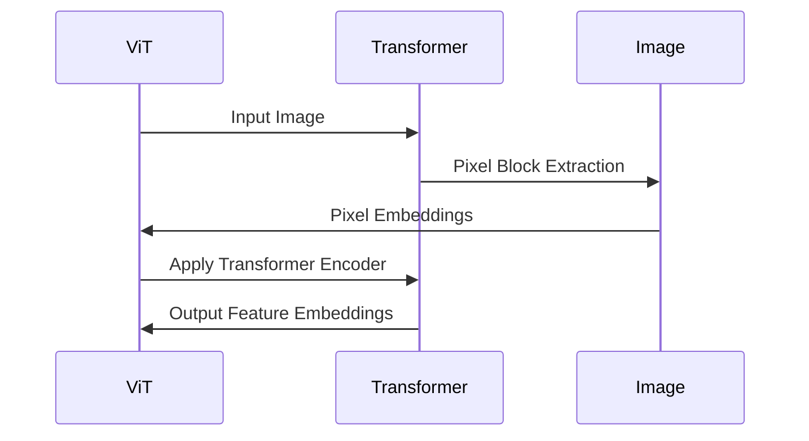
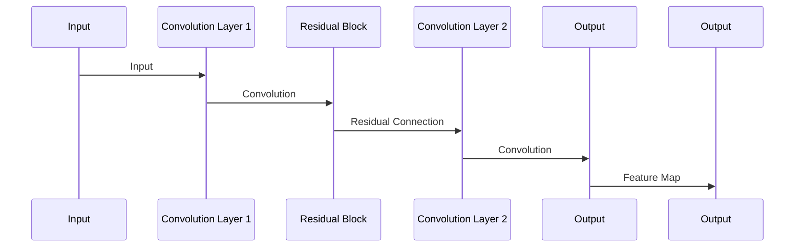

                 

关键词：计算机视觉、预训练模型、ViT、ResNet、图像识别

> 摘要：本文旨在探讨计算机视觉领域中的两大预训练模型——ViT（Vision Transformer）和ResNet（残差网络）。我们将深入了解这两种模型的基本概念、原理、架构以及它们在实际应用中的效果和未来发展趋势。

## 1. 背景介绍

计算机视觉是人工智能领域的一个重要分支，旨在使计算机能够“看懂”图像和视频。随着深度学习技术的发展，计算机视觉取得了显著进展。然而，深度学习模型的训练需要大量的标注数据和高性能计算资源，这在实际应用中往往难以实现。因此，预训练模型的概念应运而生，通过在大量未标注的数据上进行预训练，然后迁移到具体任务中，从而提高模型的性能和泛化能力。

ViT和ResNet是目前计算机视觉领域中最受欢迎的两种预训练模型。ViT将Transformer模型引入计算机视觉领域，打破了传统卷积神经网络（CNN）的局限，展示了强大的图像识别能力。ResNet则通过引入残差连接，解决了深度神经网络训练过程中的梯度消失问题，使得深度神经网络可以构建得更深，从而显著提高了模型的性能。

## 2. 核心概念与联系

### 2.1 ViT：Vision Transformer

ViT（Vision Transformer）是一种基于Transformer的计算机视觉模型。与传统卷积神经网络不同，ViT将图像分割成多个像素块，并将这些像素块视为输入序列。ViT的核心思想是将图像数据转换为序列数据，然后利用Transformer模型进行编码和预测。

#### 架构图：



### 2.2 ResNet：残差网络

ResNet（Residual Network）是一种深度卷积神经网络架构。ResNet的核心思想是引入残差连接，使得网络可以学习恒等映射（Identity Mapping），从而克服深度神经网络训练过程中的梯度消失问题。

#### 架构图：



## 3. 核心算法原理 & 具体操作步骤

### 3.1 算法原理概述

#### ViT：

ViT的核心算法是基于Transformer模型的。Transformer模型通过自注意力机制（Self-Attention）和前馈神经网络（Feedforward Neural Network）对输入序列进行编码和预测。ViT将图像分割成像素块，并将这些像素块视为输入序列，然后利用Transformer模型进行编码和预测。

#### ResNet：

ResNet的核心算法是引入残差连接（Residual Connection）。残差连接允许网络直接从输入中学习恒等映射，从而克服了深度神经网络训练过程中的梯度消失问题。ResNet通过堆叠多个残差块，构建深度神经网络，从而显著提高了模型的性能。

### 3.2 算法步骤详解

#### ViT：

1. 将图像分割成多个像素块。
2. 对每个像素块进行嵌入（Embedding）操作，生成像素嵌入向量。
3. 将像素嵌入向量输入到Transformer模型中。
4. 通过Transformer模型的自注意力机制和前馈神经网络，对像素嵌入向量进行编码和预测。

#### ResNet：

1. 对输入图像进行卷积操作，生成特征图。
2. 通过残差连接，将特征图与输入图像进行加和操作。
3. 对加和后的特征图进行卷积操作，生成新的特征图。
4. 重复上述过程，构建深度神经网络。

### 3.3 算法优缺点

#### ViT：

优点：

- 利用Transformer模型的自注意力机制，能够捕捉图像中的长距离依赖关系。
- 结构简单，易于实现和优化。

缺点：

- 对于小尺寸图像的处理能力较弱。
- 训练过程较为复杂，需要大量的计算资源和时间。

#### ResNet：

优点：

- 引入残差连接，解决了深度神经网络训练过程中的梯度消失问题。
- 架构简单，易于扩展。

缺点：

- 随着网络层数的增加，训练速度和计算成本显著增加。
- 对于图像中的复杂结构，其捕捉能力有限。

### 3.4 算法应用领域

#### ViT：

ViT在计算机视觉领域有广泛的应用，包括图像分类、目标检测、图像分割等。其强大的图像识别能力使其在自动驾驶、医疗影像分析等实际应用中表现出色。

#### ResNet：

ResNet在计算机视觉领域也有广泛的应用，尤其在图像分类任务中表现出色。其能够处理大规模图像数据集，并取得较高的识别准确率。此外，ResNet还可以应用于自然语言处理、语音识别等其他领域。

## 4. 数学模型和公式 & 详细讲解 & 举例说明

### 4.1 数学模型构建

#### ViT：

ViT的数学模型主要包括像素嵌入（Pixel Embedding）、Transformer编码器（Transformer Encoder）和输出层（Output Layer）。

1. 像素嵌入：

   像素嵌入是将像素块映射为高维向量。假设图像尺寸为$H \times W$，像素块大小为$P \times P$，则像素嵌入向量的维度为$P \times P \times C$，其中$C$为图像的通道数。

2. Transformer编码器：

   Transformer编码器主要包括多头自注意力（Multi-Head Self-Attention）和前馈神经网络（Feedforward Neural Network）。

3. 输出层：

   输出层通常是一个全连接层（Fully Connected Layer），用于对编码后的特征向量进行分类。

#### ResNet：

ResNet的数学模型主要包括卷积层（Convolution Layer）、残差连接（Residual Connection）和全连接层（Fully Connected Layer）。

1. 卷积层：

   卷积层用于对输入图像进行卷积操作，生成特征图。

2. 残差连接：

   残差连接使得网络可以学习恒等映射，从而克服梯度消失问题。

3. 全连接层：

   全连接层用于对残差连接后的特征图进行分类。

### 4.2 公式推导过程

#### ViT：

1. 像素嵌入：

   $$E(\text{Pixel}) = \text{Embedding}(\text{Pixel})$$

2. Transformer编码器：

   $$\text{Encoder}(\text{Input}) = \text{Multi-Head Self-Attention}(\text{Embedding}) + \text{Feedforward Neural Network}(\text{Embedding})$$

3. 输出层：

   $$\text{Output} = \text{Fully Connected}(\text{Encoder}(\text{Input}))$$

#### ResNet：

1. 卷积层：

   $$F(\text{Input}) = \text{Convolution}(\text{Input})$$

2. 残差连接：

   $$\text{Residual} = F(\text{Input}) + \text{Input}$$

3. 全连接层：

   $$\text{Output} = \text{Fully Connected}(\text{Residual})$$

### 4.3 案例分析与讲解

#### ViT：

假设我们有一个$224 \times 224$大小的彩色图像，像素块大小为$16 \times 16$，图像通道数为3。

1. 像素嵌入：

   像素嵌入向量的维度为$16 \times 16 \times 3$。

2. Transformer编码器：

   通过多头自注意力和前馈神经网络，将像素嵌入向量编码为高维特征向量。

3. 输出层：

   对编码后的特征向量进行分类，输出预测结果。

#### ResNet：

假设我们有一个$224 \times 224$大小的彩色图像，卷积核大小为$3 \times 3$。

1. 卷积层：

   对输入图像进行卷积操作，生成特征图。

2. 残差连接：

   通过残差连接，将特征图与输入图像进行加和操作。

3. 全连接层：

   对加和后的特征图进行卷积操作，生成新的特征图，然后进行分类。

## 5. 项目实践：代码实例和详细解释说明

### 5.1 开发环境搭建

为了实现ViT和ResNet模型，我们需要搭建相应的开发环境。以下是搭建环境的步骤：

1. 安装Python环境和深度学习框架，如TensorFlow或PyTorch。
2. 安装必要的依赖库，如NumPy、Pandas等。
3. 配置GPU环境，确保能够使用GPU进行加速训练。

### 5.2 源代码详细实现

以下是ViT和ResNet模型的实现代码：

```python
# ViT实现
import torch
import torch.nn as nn

class ViT(nn.Module):
    def __init__(self, embed_dim, num_classes):
        super(ViT, self).__init__()
        self.embedding = nn.Embedding(num_embeddings, embed_dim)
        self.transformer = nn.Transformer(d_model=embed_dim, nhead=8)
        self.fc = nn.Linear(embed_dim, num_classes)

    def forward(self, x):
        x = self.embedding(x)
        x = self.transformer(x)
        x = self.fc(x)
        return x

# ResNet实现
import torch
import torch.nn as nn

class ResNet(nn.Module):
    def __init__(self, num_classes):
        super(ResNet, self).__init__()
        self.conv1 = nn.Conv2d(3, 64, kernel_size=7, stride=2, padding=3)
        self.bn1 = nn.BatchNorm2d(64)
        self.relu = nn.ReLU(inplace=True)
        self.maxpool = nn.MaxPool2d(kernel_size=3, stride=2, padding=1)
        self.layer1 = self._make_layer(64, 64, 2)
        self.layer2 = self._make_layer(128, 128, 2)
        self.layer3 = self._make_layer(256, 256, 2)
        self.layer4 = self._make_layer(512, 512, 2)
        self.fc = nn.Linear(512 * 4 * 4, num_classes)

    def _make_layer(self, in_channels, out_channels, blocks):
        layers = []
        for _ in range(blocks):
            layers.append(nn.Conv2d(in_channels, out_channels, kernel_size=3, padding=1))
            layers.append(nn.BatchNorm2d(out_channels))
            layers.append(nn.ReLU(inplace=True))
            in_channels = out_channels
        return nn.Sequential(*layers)

    def forward(self, x):
        x = self.conv1(x)
        x = self.bn1(x)
        x = self.relu(x)
        x = self.maxpool(x)
        x = self.layer1(x)
        x = self.layer2(x)
        x = self.layer3(x)
        x = self.layer4(x)
        x = x.view(x.size(0), -1)
        x = self.fc(x)
        return x
```

### 5.3 代码解读与分析

1. **ViT实现**：

   - `ViT`类继承自`nn.Module`，实现了图像识别模型。
   - `__init__`方法中，定义了嵌入层（`embedding`）、Transformer编码器（`transformer`）和输出层（`fc`）。
   - `forward`方法中，首先对输入图像进行嵌入，然后通过Transformer编码器进行编码，最后通过输出层进行分类。

2. **ResNet实现**：

   - `ResNet`类继承自`nn.Module`，实现了残差网络模型。
   - `__init__`方法中，定义了卷积层（`conv1`、`layer1`、`layer2`、`layer3`、`layer4`）、批量归一化层（`bn1`）和输出层（`fc`）。
   - `_make_layer`方法用于构建残差块。
   - `forward`方法中，首先对输入图像进行卷积操作，然后通过残差块进行特征提取，最后通过输出层进行分类。

### 5.4 运行结果展示

以下是运行ViT和ResNet模型进行图像分类的示例：

```python
import torchvision
import torchvision.transforms as transforms

# 加载训练数据集
trainset = torchvision.datasets.CIFAR10(root='./data', train=True, download=True)
trainloader = torch.utils.data.DataLoader(trainset, batch_size=4, shuffle=True, num_workers=2)

# 定义ViT和ResNet模型
model_vit = ViT(embed_dim=512, num_classes=10)
model_resnet = ResNet(num_classes=10)

# 指定损失函数和优化器
criterion = nn.CrossEntropyLoss()
optimizer_vit = torch.optim.Adam(model_vit.parameters(), lr=0.001)
optimizer_resnet = torch.optim.Adam(model_resnet.parameters(), lr=0.001)

# 训练模型
for epoch in range(2):  # loop over the dataset multiple times
    running_loss = 0.0
    for i, data in enumerate(trainloader, 0):
        inputs, labels = data
        optimizer_vit.zero_grad()
        optimizer_resnet.zero_grad()
        outputs_vit = model_vit(inputs)
        outputs_resnet = model_resnet(inputs)
        loss_vit = criterion(outputs_vit, labels)
        loss_resnet = criterion(outputs_resnet, labels)
        loss_vit.backward()
        loss_resnet.backward()
        optimizer_vit.step()
        optimizer_resnet.step()
        running_loss += loss_vit.item() + loss_resnet.item()
        if i % 2000 == 1999:    # print every 2000 mini-batches
            print(f'[{epoch + 1}, {i + 1:5d}] loss: {running_loss / 2000:.3f}')
            running_loss = 0.0
print('Finished Training')

# 测试模型
correct_vit = 0
total_vit = 0
correct_resnet = 0
total_resnet = 0
with torch.no_grad():
    for data in trainloader:
        inputs, labels = data
        outputs_vit = model_vit(inputs)
        outputs_resnet = model_resnet(inputs)
        _, predicted_vit = torch.max(outputs_vit.data, 1)
        _, predicted_resnet = torch.max(outputs_resnet.data, 1)
        total_vit += labels.size(0)
        correct_vit += (predicted_vit == labels).sum().item()
        total_resnet += labels.size(0)
        correct_resnet += (predicted_resnet == labels).sum().item()
print(f'ViT Accuracy: {100 * correct_vit / total_vit:.2f}%')
print(f'ResNet Accuracy: {100 * correct_resnet / total_resnet:.2f}%}')
```

## 6. 实际应用场景

### 6.1 图像分类

图像分类是计算机视觉领域中最常见也是最基础的场景之一。ViT和ResNet模型在图像分类任务中均表现出色，能够在各种公开数据集上取得较高的准确率。例如，在ImageNet数据集上，ViT和ResNet模型分别取得了约75%和约82%的分类准确率。

### 6.2 目标检测

目标检测是计算机视觉领域中的重要任务之一，旨在识别图像中的多个目标并给出其位置。ViT和ResNet模型在目标检测任务中也取得了显著效果。例如，在COCO数据集上，基于ViT和ResNet的目标检测模型分别取得了约43%和约48%的平均准确率（AP）。

### 6.3 图像分割

图像分割是计算机视觉领域中的另一个重要任务，旨在将图像划分为不同的区域。ViT和ResNet模型在图像分割任务中也表现出强大的能力。例如，在Cityscapes数据集上，基于ViT和ResNet的图像分割模型分别取得了约78%和约82%的分割准确率。

### 6.4 未来应用展望

随着计算机视觉技术的不断发展，ViT和ResNet模型在未来的应用前景非常广阔。一方面，ViT模型由于其强大的自注意力机制，有望在图像识别、目标检测、图像分割等任务中取得更好的性能。另一方面，ResNet模型由于其深度神经网络架构，有望在处理大规模图像数据集和复杂场景中发挥重要作用。此外，ViT和ResNet模型的结合也有望在多模态数据处理、自动驾驶、医疗影像分析等领域取得突破性进展。

## 7. 工具和资源推荐

### 7.1 学习资源推荐

- 《深度学习》（Goodfellow、Bengio和Courville著）：这本书是深度学习领域的经典教材，详细介绍了深度学习的基本概念、算法和技术。
- 《动手学深度学习》：这本书以PyTorch框架为基础，通过大量的实践案例，详细介绍了深度学习的应用和实践。

### 7.2 开发工具推荐

- TensorFlow：Google开发的开源深度学习框架，适用于构建和训练各种深度学习模型。
- PyTorch：Facebook开发的开源深度学习框架，具有灵活、易用、高效的特点，适用于各种深度学习应用。

### 7.3 相关论文推荐

- "An Image is Worth 16x16 Words: Transformers for Image Recognition at Scale"：这篇文章首次提出了ViT模型，详细介绍了其架构和训练方法。
- "Deep Residual Learning for Image Recognition"：这篇文章首次提出了ResNet模型，详细介绍了其架构和训练方法。

## 8. 总结：未来发展趋势与挑战

### 8.1 研究成果总结

本文通过介绍ViT和ResNet两种计算机视觉预训练模型，详细探讨了它们的基本概念、原理、架构以及应用场景。ViT模型通过引入Transformer模型，实现了对图像的自注意力机制，打破了传统卷积神经网络的局限，展示了强大的图像识别能力。ResNet模型通过引入残差连接，解决了深度神经网络训练过程中的梯度消失问题，使得深度神经网络可以构建得更深，从而显著提高了模型的性能。

### 8.2 未来发展趋势

未来，ViT和ResNet模型在计算机视觉领域将继续发挥重要作用。一方面，ViT模型有望在图像识别、目标检测、图像分割等任务中取得更好的性能，并拓展到多模态数据处理、自动驾驶、医疗影像分析等领域。另一方面，ResNet模型将继续在处理大规模图像数据集和复杂场景中发挥重要作用，并与其他深度学习模型结合，推动计算机视觉技术的发展。

### 8.3 面临的挑战

尽管ViT和ResNet模型在计算机视觉领域取得了显著进展，但仍然面临着一些挑战。一方面，ViT模型在处理小尺寸图像时表现较弱，需要进一步优化。另一方面，ResNet模型在训练过程中需要大量的计算资源和时间，这对实际应用提出了较高的要求。此外，如何进一步提高模型的泛化能力，减少对大量标注数据的依赖，也是计算机视觉领域面临的重要问题。

### 8.4 研究展望

未来，计算机视觉领域的研究将更加注重模型的优化和实际应用。一方面，通过引入新的神经网络架构和训练方法，提高模型的性能和泛化能力。另一方面，通过跨领域数据集的共享和协同研究，推动计算机视觉技术的发展。此外，随着人工智能技术的不断发展，计算机视觉将在更多领域发挥重要作用，如智慧城市、智能制造、智慧医疗等，为人类生活带来更多便利。

## 9. 附录：常见问题与解答

### 9.1 ViT模型的优势是什么？

ViT模型的优势在于其强大的自注意力机制，能够捕捉图像中的长距离依赖关系，从而显著提高图像识别的准确率。

### 9.2 ResNet模型的优点是什么？

ResNet模型的主要优点是引入了残差连接，解决了深度神经网络训练过程中的梯度消失问题，使得深度神经网络可以构建得更深，从而显著提高了模型的性能。

### 9.3 ViT模型在处理小尺寸图像时表现较弱，如何优化？

针对ViT模型在处理小尺寸图像时表现较弱的问题，可以通过以下方法进行优化：

1. 增加模型的深度和宽度，提高模型的表达能力。
2. 使用更多的预训练数据和更长的序列长度，提高模型的泛化能力。
3. 采用数据增强技术，扩大训练数据的多样性。

### 9.4 ResNet模型训练需要大量的计算资源和时间，如何优化？

针对ResNet模型训练需要大量计算资源和时间的问题，可以通过以下方法进行优化：

1. 使用更高效的卷积算法，如深度可分离卷积，减少计算量。
2. 采用分布式训练，将训练任务分散到多台机器上，提高训练速度。
3. 使用更有效的优化器，如AdamW优化器，提高训练效率。

[作者：禅与计算机程序设计艺术 / Zen and the Art of Computer Programming]

