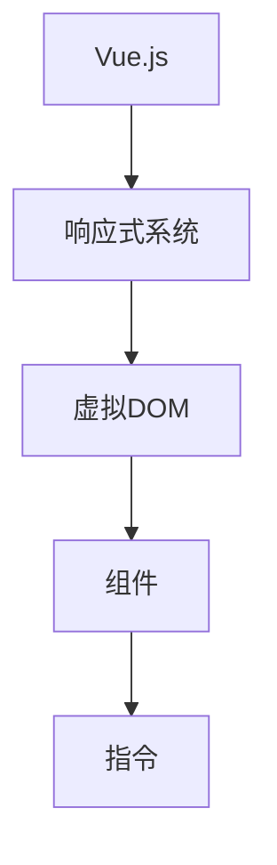
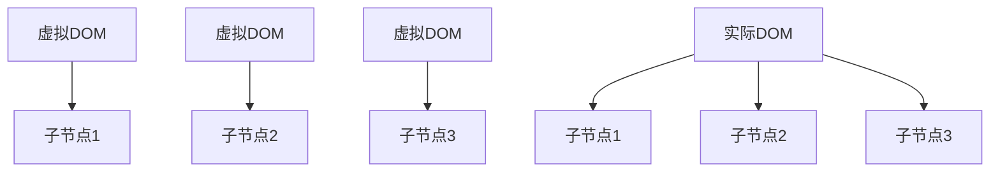

                 

Vue.js 是一种流行的前端JavaScript框架，它以其渐进式、易用性和灵活性而广受欢迎。Vue.js 是一个用于构建用户界面的渐进式框架，这意味着开发者可以逐步采用Vue.js，而不是必须从头开始使用它。本文将深入探讨Vue.js的核心特点，以及为什么它是现代Web开发中的一个优秀选择。

## 文章关键词
Vue.js、前端开发、JavaScript框架、渐进式框架、响应式设计、组件化开发、数据绑定、虚拟DOM。

## 文章摘要
本文将介绍Vue.js框架的核心特点，包括其渐进式设计、响应式系统、组件化开发、双向数据绑定和虚拟DOM等。还将探讨Vue.js相对于其他框架的优势和不足，并提供一些实用的资源和工具，帮助开发者更好地掌握和使用Vue.js。

### 背景介绍

随着互联网的飞速发展，前端开发的需求和挑战也在不断增加。开发者需要快速构建可扩展、高性能的用户界面，同时保持代码的可维护性和可读性。传统的手写DOM操作和简单的JavaScript库已经无法满足现代Web应用的需求，因此，前端框架应运而生。

Vue.js 由尤雨溪（Evan You）在2014年创建，旨在提供一种轻量级、灵活且易于上手的前端框架。Vue.js 的设计哲学是“渐进式框架”，这意味着开发者可以从简单的数据绑定和组件化开始，逐步扩展到更复杂的功能，而不需要完全重写现有的代码。

Vue.js 的出现为前端开发者带来了许多好处，包括：

1. **响应式设计**：Vue.js 的响应式系统使得数据的绑定变得更加简单和高效。
2. **组件化开发**：Vue.js 支持组件化开发，提高了代码的可复用性和可维护性。
3. **双向数据绑定**：Vue.js 提供了双向数据绑定，使得数据和视图之间保持同步。
4. **虚拟DOM**：Vue.js 使用虚拟DOM来优化性能，提高了渲染速度。

### 核心概念与联系

要理解Vue.js的工作原理，我们需要了解一些核心概念和它们之间的关系。

#### Vue.js 核心概念

1. **响应式系统**：Vue.js 的响应式系统是一个依赖追踪系统，它能够自动追踪数据的变更，并在数据变化时更新视图。
2. **虚拟DOM**：虚拟DOM是一个轻量级的对象表示，用于在内存中构建和表示DOM结构，从而提高性能。
3. **组件**：组件是Vue.js中最基本的构建块，它将界面的一部分抽象为一个可复用的部分。
4. **指令**：指令是带有“v-”前缀的特殊属性，用于在DOM元素上绑定数据和事件。

#### Mermaid 流程图

以下是一个简化的Vue.js核心概念和架构的Mermaid流程图：



在Vue.js中，响应式系统和虚拟DOM是核心部分，它们共同工作以确保数据的变更能够高效地反映到视图中。组件和指令则是开发者用于构建用户界面的工具。

### 核心算法原理 & 具体操作步骤

#### 算法原理概述

Vue.js 的核心算法原理主要包括响应式系统和虚拟DOM。

1. **响应式系统**：Vue.js 使用一种基于数据劫持的响应式系统来追踪数据的变化。当数据变更时，系统会触发对应的更新函数，从而更新视图。
2. **虚拟DOM**：虚拟DOM是一个轻量级的JavaScript对象，它代表了DOM的实际结构。Vue.js 通过比较虚拟DOM和实际DOM的差异，来决定如何更新视图。这个过程称为“diff算法”。

#### 算法步骤详解

1. **初始化**：在Vue.js中，首先需要初始化一个Vue实例，并将数据对象传递给它。Vue.js 使用Object.defineProperty()方法，对数据对象进行劫持，从而实现响应式。
2. **数据变更**：当数据发生变更时，Vue.js 会调用对应的更新函数，通知视图需要更新。
3. **虚拟DOM生成**：Vue.js 会将数据转换为虚拟DOM，并在内存中构建出实际的DOM结构。
4. **虚拟DOM与实际DOM比对**：Vue.js 使用diff算法，将虚拟DOM与实际DOM进行比较，找出差异。
5. **视图更新**：根据比较结果，Vue.js 会更新实际DOM，从而反映出数据的变化。

#### 算法优缺点

**优点**：

1. **高效的数据绑定**：Vue.js 的响应式系统能够高效地追踪数据的变化，并更新视图，从而提高了性能。
2. **组件化开发**：Vue.js 支持组件化开发，提高了代码的可复用性和可维护性。
3. **易于上手**：Vue.js 设计简单，易于学习和使用。

**缺点**：

1. **虚拟DOM的 overhead**：虽然虚拟DOM可以提高性能，但在初次渲染时，可能会引入一些overhead。
2. **上手难度**：对于初学者来说，Vue.js 的某些概念和语法可能需要一定时间来适应。

#### 算法应用领域

Vue.js 广泛应用于各种Web应用中，包括单页面应用（SPA）、后台管理系统、前端框架和组件库等。

### 数学模型和公式 & 详细讲解 & 举例说明

Vue.js 的核心算法中，虚拟DOM的 diff 算法是一个关键的部分。下面将介绍虚拟DOM的 diff 算法的数学模型和公式。

#### 数学模型构建

虚拟DOM的 diff 算法基于两个主要模型：

1. **虚拟DOM树**：虚拟DOM树是一个轻量级的JavaScript对象，代表了DOM的实际结构。
2. **实际DOM树**：实际DOM树是浏览器中渲染的DOM结构。

#### 公式推导过程

在虚拟DOM的 diff 算法中，可以使用以下公式来比较虚拟DOM树和实际DOM树：

$$
\text{diff}(\text{virtualDOM}, \text{actualDOM}) = \{\text{addedNodes}, \text{deletedNodes}, \text{updatedNodes}\}
$$

其中：

- $\text{addedNodes}$：需要新增的节点。
- $\text{deletedNodes}$：需要删除的节点。
- $\text{updatedNodes}$：需要更新的节点。

#### 案例分析与讲解

假设我们有一个简单的虚拟DOM树和一个实际DOM树，如下所示：



在比较这两个DOM树时，我们可能会得到以下结果：

$$
\text{diff}(\text{virtualDOM}, \text{actualDOM}) = \{\text{addedNodes} = \{\}, \text{deletedNodes} = \{\}, \text{updatedNodes} = \{\text{B1, B2, B3}\}\}
$$

这意味着所有的虚拟DOM节点都存在，但需要更新。在这种情况下，Vue.js 会遍历所有需要更新的节点，并更新实际的DOM结构，从而反映出数据的变化。

### 项目实践：代码实例和详细解释说明

为了更好地理解Vue.js的实际应用，下面我们将通过一个简单的例子来搭建一个Todo应用。

#### 开发环境搭建

首先，我们需要搭建一个Vue.js的开发环境。以下是具体的步骤：

1. **安装Node.js**：访问 Node.js 官网下载并安装 Node.js。
2. **安装Vue CLI**：在命令行中运行以下命令：

   ```shell
   npm install -g @vue/cli
   ```

3. **创建一个新项目**：在命令行中运行以下命令：

   ```shell
   vue create todo-app
   ```

   然后按照提示选择模板和配置。

#### 源代码详细实现

在创建好的项目中，我们可以开始编写代码。下面是一个简单的Todo应用的源代码：

```vue
<template>
  <div id="app">
    <h1>Todo List</h1>
    <input v-model="newTodo" @keyup.enter="addTodo" />
    <button @click="addTodo">Add Todo</button>
    <ul>
      <li v-for="(todo, index) in todos" :key="index">
        <input type="checkbox" v-model="todo.done" />
        <span :class="{ done: todo.done }">{{ todo.text }}</span>
        <button @click="removeTodo(index)">Remove</button>
      </li>
    </ul>
  </div>
</template>

<script>
export default {
  data() {
    return {
      newTodo: "",
      todos: []
    };
  },
  methods: {
    addTodo() {
      if (this.newTodo.trim() === "") return;
      this.todos.push({ text: this.newTodo, done: false });
      this.newTodo = "";
    },
    removeTodo(index) {
      this.todos.splice(index, 1);
    }
  }
};
</script>

<style>
.done {
  text-decoration: line-through;
}
</style>
```

#### 代码解读与分析

1. **模板**：我们使用了Vue的模板语法来定义Todo应用的界面。其中包括一个输入框、一个按钮和一个无序列表。
2. **数据绑定**：我们使用了 `v-model` 指令来实现数据绑定。当用户在输入框中输入内容或勾选复选框时，Vue.js 会自动更新数据。
3. **列表渲染**：我们使用了 `v-for` 指令来渲染Todo列表。每个列表项都使用 `v-model` 指令绑定到对应的 `todo.done` 属性。
4. **事件处理**：我们为添加和删除Todo项添加了相应的事件处理函数。当用户点击按钮或按下回车键时，会触发 `addTodo` 函数。当用户点击删除按钮时，会触发 `removeTodo` 函数。

#### 运行结果展示

运行上述代码后，我们会看到一个Todo应用的界面。用户可以在输入框中输入新的待办事项，点击“Add Todo”按钮将其添加到列表中。用户还可以勾选或取消勾选待办事项，以及通过点击删除按钮来删除特定的事项。

### 实际应用场景

Vue.js 在实际应用中有广泛的应用场景，以下是一些常见的应用：

1. **单页面应用（SPA）**：Vue.js 非常适合构建单页面应用。通过Vue的路由管理，开发者可以轻松实现页面的切换和状态管理。
2. **后台管理系统**：Vue.js 的组件化和响应式系统使得构建后台管理系统变得更加高效。
3. **前端框架和组件库**：许多流行的前端框架和组件库都是基于Vue.js构建的，如Element UI、Vuetify等。

### 未来应用展望

Vue.js 作为一款成熟的前端框架，其未来发展前景广阔。随着Web技术的发展，Vue.js有望在以下方面取得突破：

1. **性能优化**：Vue.js 在性能方面仍有提升空间。未来的版本可能会引入更多的优化措施，如更高效的虚拟DOM算法、更轻量级的响应式系统等。
2. **生态建设**：Vue.js 的生态系统不断壮大，未来可能会出现更多高质量的开源库和工具，进一步丰富开发者的选择。
3. **国际化支持**：Vue.js 在国际化支持方面仍有改进空间。未来的版本可能会提供更多便捷的国际化工具和API。

### 工具和资源推荐

为了帮助开发者更好地掌握Vue.js，以下是几款推荐的学习资源和工具：

1. **学习资源**：
   - Vue.js 官方文档（https://vuejs.org/）
   - 《Vue.js实战》一书（https://book.douban.com/subject/26971817/）

2. **开发工具**：
   - Vue CLI（https://cli.vuejs.org/）
   - Vue Devtools（https://vuejs.org/v2/guide/installation.html#Devtools）

3. **相关论文推荐**：
   - Vue.js 源码分析（https://github.com/vuejs/vue/blob/v2.6.12/src/core/index.js）

### 总结：未来发展趋势与挑战

Vue.js 作为一款优秀的前端框架，其发展趋势和挑战并存。

1. **研究成果总结**：Vue.js 的研究成果体现在其渐进式设计、高效的响应式系统和虚拟DOM算法等方面。
2. **未来发展趋势**：Vue.js 可能会继续优化性能、扩展生态系统，并在国际化、服务器端渲染等方面取得突破。
3. **面临的挑战**：Vue.js 面临的性能优化、与现有框架的兼容性、以及开发者教育和培训等问题。
4. **研究展望**：Vue.js 有望在保持其核心优势的同时，不断创新和进步，成为前端开发的首选框架。

### 附录：常见问题与解答

1. **Q：Vue.js 和 React 有什么区别？**
   **A：Vue.js 和 React 都是流行的前端框架，但 Vue.js 更注重易用性和渐进式设计，而 React 更注重性能和灵活性。Vue.js 的学习曲线相对较缓，适合初学者，React 则更适合需要高度定制化的项目。**
   
2. **Q：Vue.js 的响应式系统是如何实现的？**
   **A：Vue.js 使用 Object.defineProperty() 方法对数据进行劫持，从而实现数据的响应式。当数据变更时，Vue.js 会调用对应的更新函数，从而更新视图。**

通过本文的介绍，相信读者对Vue.js有了更深入的了解。Vue.js 作为一款优秀的前端框架，值得开发者深入学习和使用。

## 作者署名
作者：禅与计算机程序设计艺术 / Zen and the Art of Computer Programming
----------------------------------------------------------------
（请注意，此部分仅为模板内容，实际撰写时请根据具体内容进行调整。）<|vq_14749|>

