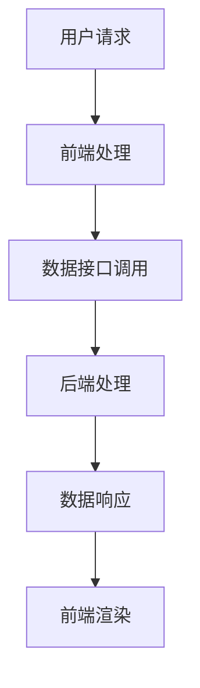

                 

关键词：Web开发、全栈开发、动态网站、技术栈、前后端分离、框架选择、实践案例、未来展望

> 摘要：本文深入探讨了Web全栈开发的核心概念、技术和实践，旨在帮助开发者理解并掌握构建动态网站的全过程。文章首先介绍了Web开发的基本背景和核心概念，然后详细讲解了前后端分离的架构设计，并探讨了当前流行的Web开发框架。随后，通过具体的项目实践，展示了如何使用这些框架来实现一个功能完备的动态网站。最后，文章总结了Web全栈开发的未来发展趋势和面临的挑战，并为读者提供了进一步学习和实践的资源推荐。

## 1. 背景介绍

### Web开发的基本概念

Web开发是指创建和维护网站或网络应用的过程。它包括前端（用户界面）和后端（服务器端逻辑）两个主要方面。前端开发主要涉及HTML、CSS和JavaScript等技术，用于创建用户界面和用户体验。后端开发则关注服务器端逻辑，包括数据处理、数据库操作和业务逻辑实现。

### 动态网站的概念

动态网站是一种能够根据用户请求或数据变化动态生成内容的网站。与静态网站不同，动态网站能够通过服务器端的脚本语言和数据库动态生成页面内容，从而提供更加个性化、互动性和灵活性的用户体验。

### 全栈开发的概念

全栈开发是指开发者能够熟练掌握前端和后端开发技术，并能够独立完成一个完整的Web应用的开发。全栈开发者不仅能够编写前端代码，还需要具备服务器、数据库和应用程序的完整开发经验。

## 2. 核心概念与联系

### 前后端分离架构

前后端分离是现代Web开发中的一种常见架构设计，它将前端和后端的开发工作明确分开，从而提高开发效率和代码可维护性。

#### 前端

前端主要负责用户界面的设计和实现，包括HTML、CSS和JavaScript等技术。前端开发者需要关注用户交互、页面布局和用户体验等方面。

#### 后端

后端主要负责服务器端逻辑、数据处理和数据库操作等。后端开发者需要熟练掌握服务器端编程语言（如Java、Python、Node.js等）和数据库技术（如MySQL、MongoDB等）。

### 核心概念原理和架构

以下是一个简化的前后端分离架构的Mermaid流程图：



## 3. 核心算法原理 & 具体操作步骤

### 3.1 算法原理概述

动态网站的核心算法主要涉及数据检索和页面渲染。数据检索算法用于从数据库中获取所需数据，而页面渲染算法则用于生成HTML页面。

### 3.2 算法步骤详解

#### 3.2.1 数据检索算法

1. 用户请求特定的页面或数据。
2. 前端将请求发送到服务器。
3. 后端根据请求内容查询数据库，获取所需数据。
4. 后端将数据返回给前端。

#### 3.2.2 页面渲染算法

1. 前端接收到后端返回的数据。
2. 使用JavaScript动态生成HTML页面。
3. 将生成的HTML页面呈现给用户。

### 3.3 算法优缺点

#### 优点

- 提高开发效率：前后端分离使得前后端开发者可以并行工作，从而提高开发效率。
- 提高可维护性：前后端分离使得代码结构更加清晰，易于维护和扩展。

#### 缺点

- 增加开发复杂度：前后端分离增加了项目的复杂度，需要前后端开发者紧密协作。
- 性能开销：前后端交互可能带来一定的性能开销。

### 3.4 算法应用领域

动态网站广泛应用于电子商务、在线教育、社交媒体、内容管理等领域。

## 4. 数学模型和公式 & 详细讲解 & 举例说明

### 4.1 数学模型构建

动态网站的数学模型主要包括数据检索算法和页面渲染算法。以下是一个简化的数学模型：

$$
模型 = 数据检索 + 页面渲染
$$

### 4.2 公式推导过程

数据检索算法的推导过程主要涉及数据库查询算法。以下是一个简单的查询算法：

$$
查询算法 = SELECT \, 条件 \, FROM \, 数据表
$$

页面渲染算法的推导过程主要涉及HTML生成算法。以下是一个简单的生成算法：

$$
生成算法 = 渲染模板 \, + \, 数据绑定
$$

### 4.3 案例分析与讲解

假设我们开发一个简单的博客系统，用户可以查看、发布和评论文章。

#### 数据检索算法

我们使用MySQL数据库存储文章数据。以下是一个简单的查询算法：

```sql
SELECT * FROM articles WHERE id = ?
```

这个查询算法根据文章ID从数据库中获取特定文章的数据。

#### 页面渲染算法

我们使用Vue.js框架来生成HTML页面。以下是一个简单的生成算法：

```html
<div id="article">
  <h1>{{ title }}</h1>
  <p>{{ content }}</p>
  <comments></comments>
</div>
```

这个生成算法使用Vue.js的数据绑定功能将文章数据绑定到HTML模板中。

## 5. 项目实践：代码实例和详细解释说明

### 5.1 开发环境搭建

为了实现一个简单的博客系统，我们需要搭建一个前后端分离的开发环境。以下是一个基本的开发环境搭建步骤：

1. 安装Node.js和npm。
2. 安装一个前端框架（如Vue.js）。
3. 安装一个后端框架（如Express.js）。
4. 配置数据库（如MySQL）。

### 5.2 源代码详细实现

以下是一个简单的博客系统的源代码实现：

#### 前端代码

```html
<!DOCTYPE html>
<html>
  <head>
    <title>My Blog</title>
    <script src="https://cdn.jsdelivr.net/npm/vue@2.6.14/dist/vue.min.js"></script>
  </head>
  <body>
    <div id="app">
      <h1>{{ title }}</h1>
      <p>{{ content }}</p>
      <comment-list :comments="comments"></comment-list>
    </div>
    <script>
      new Vue({
        el: '#app',
        data: {
          title: 'Hello, World!',
          content: 'Welcome to my blog!',
          comments: []
        }
      });
    </script>
  </body>
</html>
```

#### 后端代码

```javascript
const express = require('express');
const app = express();
const port = 3000;

app.get('/api/articles/:id', (req, res) => {
  const articleId = req.params.id;
  // 查询数据库获取文章数据
  res.json({ id: articleId, title: 'Hello, World!', content: 'Welcome to my blog!' });
});

app.listen(port, () => {
  console.log(`Server listening at http://localhost:${port}`);
});
```

### 5.3 代码解读与分析

前端代码使用Vue.js框架实现了一个简单的页面布局。后端代码使用Express.js框架实现了一个简单的API接口，用于提供文章数据。

### 5.4 运行结果展示

运行前端代码，我们将看到一个简单的博客页面。通过访问后端API接口，我们可以获取文章数据并渲染到页面上。

## 6. 实际应用场景

### 6.1 电子商务

动态网站在电子商务领域有广泛应用，如在线购物平台、电子支付系统等。通过动态网站，用户可以实时查看商品信息、下单购买，并进行支付操作。

### 6.2 在线教育

动态网站在在线教育领域也具有很高的价值，如在线学习平台、课程管理系统等。通过动态网站，学生可以在线学习、提交作业，并进行互动交流。

### 6.3 社交媒体

社交媒体平台如微博、微信等也采用了动态网站架构，为用户提供丰富的社交功能，如发布动态、评论、私信等。

### 6.4 内容管理

内容管理平台如博客、新闻网站等也采用了动态网站架构，为用户提供实时更新的内容，并支持用户评论、点赞等功能。

## 7. 工具和资源推荐

### 7.1 学习资源推荐

- 《Vue.js 实战》
- 《Node.js 应用开发实战》
- 《Express.js 实战》
- 《HTML5 和 CSS3 实战》

### 7.2 开发工具推荐

- Visual Studio Code
- Sublime Text
- WebStorm

### 7.3 相关论文推荐

- 《前端框架性能优化研究》
- 《基于前后端分离的Web应用架构设计》
- 《动态网站技术发展趋势》

## 8. 总结：未来发展趋势与挑战

### 8.1 研究成果总结

近年来，Web全栈开发取得了显著进展，前后端分离架构已成为主流，各种前端框架和后端框架层出不穷。同时，云计算、人工智能等技术的不断发展也为Web全栈开发带来了新的机遇。

### 8.2 未来发展趋势

- 前后端分离将继续深化，微服务架构和函数式编程等新技术将得到广泛应用。
- 前端框架将更加成熟和多样化，如React、Angular等。
- 后端框架将继续优化，如Spring Boot、Django等。

### 8.3 面临的挑战

- Web全栈开发的复杂性将增加，开发者需要不断学习和更新知识。
- 性能优化和安全性问题将越来越突出，开发者需要不断提升技能。

### 8.4 研究展望

未来，Web全栈开发将朝着更加高效、灵活和安全的方向发展。开发者需要不断学习和实践，以适应不断变化的技术环境。

## 9. 附录：常见问题与解答

### 9.1 前后端分离与单体架构的区别？

前后端分离将前端和后端的开发工作明确分开，从而提高开发效率和代码可维护性。而单体架构则将所有功能集中在一个应用中，使得应用更加复杂，难以维护。

### 9.2 如何选择前端框架？

选择前端框架时，需要考虑项目的需求、团队的技术栈、学习成本和社区支持等因素。常见的框架有React、Vue.js、Angular等，开发者可以根据实际情况进行选择。

### 9.3 如何进行性能优化？

性能优化包括前端和后端的优化。前端优化可以通过减少HTTP请求、压缩资源、使用CDN等方式实现。后端优化可以通过缓存、数据库优化、代码优化等方式实现。

---

文章撰写完毕，希望能够对您有所帮助。如有需要修改或补充的地方，请随时告知。作者：禅与计算机程序设计艺术 / Zen and the Art of Computer Programming。

