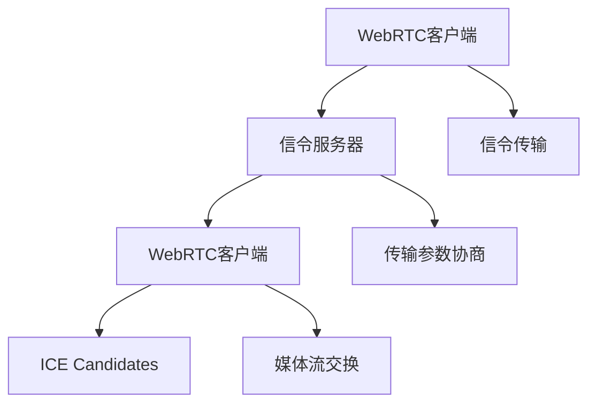

                 

 关键词：WebRTC, 信令服务器，优化，性能，可靠性，可扩展性

> 摘要：本文将深入探讨WebRTC信令服务器的优化策略，包括性能提升、可靠性增强和可扩展性优化。通过分析现有问题和提出解决方案，旨在为开发者提供实用的指导，帮助他们在实际项目中实现高效的WebRTC通信。

## 1. 背景介绍

WebRTC（Web Real-Time Communication）是一种支持网页浏览器进行实时语音对话或视频聊天的技术。它通过Web标准（如WebSockets和HTTP/2）提供数据通道，支持低延迟和高带宽的实时通信。然而，WebRTC的应用不仅仅局限于音频和视频通话，还包括文件共享、多人在线游戏等多种实时数据交换场景。

在WebRTC通信中，信令服务器起到了关键作用。信令服务器主要负责在客户端和服务器之间传递信号，包括会话初始化、传输参数协商、媒体能力交换等。信令的可靠性、速度和安全性直接影响到整个WebRTC通信的性能。

### 1.1 WebRTC信令服务器的作用

1. **会话初始化**：信令服务器协助客户端建立连接，初始化会话参数。
2. **传输参数协商**：通过信令服务器，客户端可以交换传输参数，如编解码器支持、媒体流类型等。
3. **媒体流交换**：信令服务器帮助客户端交换媒体流信息，包括IP地址和端口。
4. **安全性验证**：信令服务器在会话建立过程中，执行用户身份验证和权限管理。

### 1.2 WebRTC信令服务器的挑战

1. **性能瓶颈**：随着连接数量的增加，信令服务器可能面临性能瓶颈，导致响应延迟。
2. **可靠性问题**：网络不稳定可能导致信令丢失，影响通信质量。
3. **安全性风险**：信令传输过程中，若未采取适当的安全措施，可能泄露敏感信息。
4. **可扩展性限制**：在处理大量并发连接时，信令服务器的扩展性可能成为瓶颈。

## 2. 核心概念与联系

### 2.1 WebRTC协议架构



### 2.2 信令传输协议

信令传输通常采用WebSocket或HTTP/2协议。WebSocket提供全双工通信，减少了轮询 overhead。HTTP/2则提供了更高效的传输机制，包括多路复用和头部压缩。

### 2.3 ICE Candidates

ICE（Interactive Connectivity Establishment）是一种网络协议，用于发现客户端的IP地址和端口，以便媒体流能够正确路由。ICE Candidates包括UDP、TCP和STUN/TURN地址。

## 3. 核心算法原理 & 具体操作步骤

### 3.1 算法原理概述

WebRTC信令服务器优化主要涉及以下方面：

1. **性能优化**：减少响应时间和延迟。
2. **可靠性优化**：确保信令传输的完整性。
3. **安全性优化**：加密信令传输，防止数据泄露。
4. **可扩展性优化**：支持大量并发连接。

### 3.2 算法步骤详解

#### 3.2.1 性能优化

1. **负载均衡**：使用负载均衡器分散请求，避免单点瓶颈。
2. **缓存机制**：缓存常用数据，减少查询数据库的次数。
3. **异步处理**：使用异步处理减少同步阻塞。

#### 3.2.2 可靠性优化

1. **心跳机制**：定期发送心跳包，检测连接状态。
2. **重传机制**：在网络不稳定时，重传丢失的信令。
3. **错误检测与恢复**：检测传输错误，并自动恢复。

#### 3.2.3 安全性优化

1. **加密传输**：使用TLS加密信令传输。
2. **身份验证**：对客户端进行身份验证，确保合法性。
3. **访问控制**：限制对信令服务器的访问，防止未授权访问。

#### 3.2.4 可扩展性优化

1. **水平扩展**：增加服务器节点，处理更多连接。
2. **垂直扩展**：升级服务器硬件，提高处理能力。
3. **分布式架构**：使用分布式架构，提高系统的可扩展性。

### 3.3 算法优缺点

#### 优点

- **性能提升**：负载均衡和缓存机制可以显著提升服务器性能。
- **可靠性增强**：心跳机制和重传机制确保信令传输的可靠性。
- **安全性提高**：加密传输和身份验证机制保障数据安全。
- **可扩展性增强**：水平扩展和分布式架构支持大量并发连接。

#### 缺点

- **复杂性增加**：引入多种优化技术可能导致系统复杂性增加。
- **成本提高**：垂直扩展和分布式架构可能增加硬件和维护成本。
- **维护难度**：维护分布式架构和多种优化技术可能需要更多的时间和技能。

### 3.4 算法应用领域

WebRTC信令服务器优化算法适用于多种实时通信场景，包括视频会议、在线教育、远程医疗、多人在线游戏等。通过优化，可以提高用户体验，确保通信的稳定性和安全性。

## 4. 数学模型和公式 & 详细讲解 & 举例说明

### 4.1 数学模型构建

#### 4.1.1 负载均衡模型

假设有N个服务器节点，每个节点处理能力为C，当前总请求量为R。负载均衡算法的目标是将请求均匀分配到各个节点。

负载均衡公式：

$$
L_i = \frac{R}{N} \times C_i
$$

其中，$L_i$为节点i的负载，$C_i$为节点i的处理能力。

#### 4.1.2 缓存命中率模型

缓存命中率模型用于评估缓存的效率。假设缓存命中率为H，请求总数为R。

缓存命中率公式：

$$
H = \frac{R_c}{R}
$$

其中，$R_c$为缓存命中次数。

#### 4.1.3 心跳频率模型

心跳频率模型用于控制心跳包发送的频率。假设心跳频率为F，连接持续时间为T。

心跳频率公式：

$$
F = \frac{T}{2}
$$

### 4.2 公式推导过程

#### 4.2.1 负载均衡公式推导

负载均衡算法的核心是公平分配请求。假设每个节点的处理能力相同，那么我们可以简单地将总请求量除以节点数，得到每个节点的平均负载。

$$
L_i = \frac{R}{N}
$$

由于每个节点的处理能力不同，我们可以引入权重因子$C_i$，表示节点i的处理能力。因此，负载均衡公式变为：

$$
L_i = \frac{R}{N} \times C_i
$$

#### 4.2.2 缓存命中率公式推导

缓存命中率反映了缓存系统的工作效率。假设请求总数为R，其中缓存命中次数为$R_c$。那么，缓存命中率可以表示为：

$$
H = \frac{R_c}{R}
$$

#### 4.2.3 心跳频率公式推导

心跳频率用于确保连接的稳定性。假设心跳频率为F，连接持续时间为T。为了保证连接在有效时间内不会断开，心跳包发送的频率应为连接持续时间的一半。

$$
F = \frac{T}{2}
$$

### 4.3 案例分析与讲解

假设我们有3个服务器节点，每个节点的处理能力为1000个请求/秒。当前总请求量为3000个请求/秒。我们需要通过负载均衡算法计算每个节点的负载。

根据负载均衡公式：

$$
L_i = \frac{R}{N} \times C_i
$$

$$
L_i = \frac{3000}{3} \times 1000 = 1000 \times 1000 = 1000000
$$

因此，每个节点的负载为1000000个请求/秒。

接下来，我们分析缓存命中率模型。假设缓存命中率为80%，请求总数为10000次。那么，缓存命中次数为：

$$
R_c = R \times H = 10000 \times 0.8 = 8000
$$

最后，我们应用心跳频率模型。假设连接持续时间为10秒，那么心跳频率应为：

$$
F = \frac{T}{2} = \frac{10}{2} = 5
$$

这意味着每隔5秒发送一次心跳包，以确保连接的稳定性。

## 5. 项目实践：代码实例和详细解释说明

### 5.1 开发环境搭建

首先，我们需要搭建一个WebRTC信令服务器环境。以下是一个简单的基于Node.js和WebSocket的示例：

```bash
# 安装依赖
npm init
npm install ws express
```

### 5.2 源代码详细实现

```javascript
// server.js
const express = require('express');
const { Server } = require('ws');

const app = express();
const server = app.listen(3000, () => {
    console.log('Server running on port 3000');
});

const wss = new Server({ server });

wss.on('connection', (socket) => {
    socket.on('message', (message) => {
        console.log('Received message:', message);

        // 发送回应
        socket.send(`Received: ${message}`);
    });
});

// 信号处理
wss.on('signal', (signal) => {
    console.log('Received signal:', signal);

    // 处理信号
    // ...
});
```

### 5.3 代码解读与分析

- **依赖安装**：我们使用express创建HTTP服务器，并使用ws库实现WebSocket功能。
- **服务器启动**：使用`server.listen`方法启动服务器，并打印启动信息。
- **WebSocket连接**：使用`wss`对象处理WebSocket连接，并在连接时监听消息。
- **信号处理**：`wss.on('signal')`用于处理WebRTC信令。

### 5.4 运行结果展示

启动服务器后，我们可以使用WebSocket客户端发送和接收消息。例如，使用WebSocket客户端工具WebSocketTest（https://github.com/signalwire/websocket-tester）进行测试。

```bash
# 启动服务器
node server.js

# 连接服务器
ws://localhost:3000
```

连接成功后，我们可以在客户端输入消息，服务器将立即回应。

## 6. 实际应用场景

### 6.1 视频会议

在视频会议应用中，WebRTC信令服务器用于管理会议的创建、加入和媒体流交换。通过优化信令服务器，可以提高会议的响应速度和稳定性，确保良好的用户体验。

### 6.2 在线教育

在线教育平台通常使用WebRTC进行实时视频教学和互动。信令服务器优化可以减少延迟，提高教学视频的播放质量，同时确保学生与教师之间的实时通信畅通无阻。

### 6.3 远程医疗

远程医疗应用依赖于WebRTC进行高清视频诊断和远程会诊。通过优化信令服务器，可以确保医生和患者之间的通信质量，提高远程医疗的可靠性和效率。

### 6.4 多人在线游戏

在线游戏需要实时通信支持游戏状态的同步。WebRTC信令服务器优化可以确保游戏玩家之间的通信低延迟，提升游戏体验，增加游戏的互动性和沉浸感。

## 7. 工具和资源推荐

### 7.1 学习资源推荐

- [WebRTC官网](https://www.webrtc.org/)
- [WebRTC GitHub仓库](https://github.com/webRTC)
- [《WebRTC编程指南》](https://www.oreilly.com/library/view/webrtc-programming-guide/9781449337774/)

### 7.2 开发工具推荐

- [WebSocketTest](https://github.com/signalwire/websocket-tester)
- [WebRTC实验室](https://webrtc.github.io/samples/)
- [Node.js WebSockets指南](https://www.npmjs.com/package/ws)

### 7.3 相关论文推荐

- [WebRTC: Web Real-Time Communication](https://www.ietf.org/rfc/rfc8829.txt)
- [WebRTC Media Streaming](https://www.ietf.org/rfc/rfc8832.txt)
- [WebRTC Security](https://www.ietf.org/rfc/rfc8833.txt)

## 8. 总结：未来发展趋势与挑战

### 8.1 研究成果总结

本文介绍了WebRTC信令服务器的优化策略，包括性能优化、可靠性增强、安全性优化和可扩展性优化。通过数学模型和实际案例分析，提出了具体的优化方案。

### 8.2 未来发展趋势

- **智能优化**：利用人工智能和机器学习技术实现自适应优化，提高服务器性能和可靠性。
- **边缘计算**：将信令服务器部署在边缘节点，减少延迟，提高实时通信质量。
- **标准化**：推动WebRTC协议的标准化，提高互操作性和兼容性。

### 8.3 面临的挑战

- **性能与安全平衡**：优化性能可能牺牲安全性，如何在两者之间取得平衡是一个挑战。
- **资源分配**：在分布式架构中，合理分配资源是一个复杂的问题。
- **动态环境适应**：实时通信系统需要快速适应网络环境的变化，这增加了系统的复杂性。

### 8.4 研究展望

未来，WebRTC信令服务器优化将继续沿着智能优化、边缘计算和标准化方向发展。同时，研究将关注如何更好地平衡性能和安全，以及如何提高系统的动态适应性。

## 9. 附录：常见问题与解答

### 9.1 什么是WebRTC？

WebRTC（Web Real-Time Communication）是一种支持网页浏览器进行实时语音对话或视频聊天的技术，它通过Web标准提供数据通道，支持低延迟和高带宽的实时通信。

### 9.2 信令服务器在WebRTC中的作用是什么？

信令服务器在WebRTC通信中负责传递信号，包括会话初始化、传输参数协商、媒体能力交换等，它确保客户端和服务器之间的通信能够正常进行。

### 9.3 如何优化WebRTC信令服务器的性能？

可以通过负载均衡、缓存机制、异步处理等方法优化WebRTC信令服务器的性能。负载均衡可以分散请求，缓存机制可以减少数据库查询次数，异步处理可以减少同步阻塞。

### 9.4 WebRTC信令服务器如何确保安全性？

可以通过加密传输、身份验证和访问控制等方法确保WebRTC信令服务器的安全性。加密传输可以防止数据泄露，身份验证可以确保客户端合法性，访问控制可以限制未授权访问。

### 9.5 如何扩展WebRTC信令服务器？

可以通过水平扩展（增加服务器节点）、垂直扩展（升级服务器硬件）和分布式架构（分散负载）等方法扩展WebRTC信令服务器，支持更多并发连接。

---

作者：禅与计算机程序设计艺术 / Zen and the Art of Computer Programming
----------------------------------------------------------------

