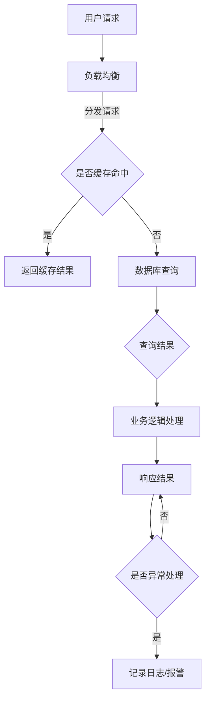

                 

在互联网时代的今天，Web后端的高并发处理已经成为技术领域的一个热点问题。随着网站访问量的急剧增长，如何确保系统的稳定性和性能，成为了每一个开发者都需要面对的挑战。本文将深入探讨Web后端高并发处理的方案，旨在为开发者提供一套完整、有效的技术指导。

> **关键词：** Web后端、高并发、性能优化、负载均衡、分布式系统

> **摘要：** 本文将从高并发的背景出发，详细讨论高并发处理的相关核心概念与联系，深入分析核心算法原理与操作步骤，构建数学模型，并通过实际项目实例进行代码解读，最后对实际应用场景和未来发展趋势进行展望。

## 1. 背景介绍

互联网的飞速发展使得Web应用变得愈加复杂，用户的访问量和操作频率也在不断攀升。传统的单体后端架构在面临高并发访问时往往力不从心，导致系统性能下降、响应延迟甚至崩溃。高并发不仅考验着服务器的处理能力，也对网络带宽、存储系统和数据库的读写速度提出了更高的要求。

在高并发的背景下，Web后端需要面对以下几个关键挑战：

1. **负载均衡**：如何有效地分发请求，确保各个服务节点都能均匀地承受负载。
2. **缓存机制**：如何利用缓存减少对后端存储系统的压力，提升响应速度。
3. **数据库优化**：如何优化数据库查询，减少响应时间和锁争用。
4. **系统容灾**：如何确保在硬件故障或网络异常时系统的可靠性和可用性。

为了解决这些问题，开发者需要深入理解高并发处理的原理，掌握一系列优化技术和方案。接下来，本文将详细介绍这些技术和方案，帮助读者构建一套完整的高并发处理体系。

## 2. 核心概念与联系

### 2.1. 高并发与负载均衡

**高并发**（High Concurrency）指的是在短时间内系统需要处理大量请求的现象。高并发通常伴随着大量用户同时访问系统，导致服务器负载急剧增加。

**负载均衡**（Load Balancing）是一种技术，用于分发网络或应用程序的工作负载到多个计算节点上，以确保系统的高可用性和高吞吐量。

在Web后端高并发处理中，负载均衡至关重要。它能够有效地将请求分配到不同的服务器节点上，避免单个服务器过载，从而提升系统的整体性能。

### 2.2. 缓存机制

**缓存**（Caching）是一种临时存储数据的技术，用于减少对后端系统的访问次数，提升响应速度。常见的缓存机制包括内存缓存、磁盘缓存和分布式缓存。

**内存缓存**（In-Memory Caching）具有速度快、延迟低的优势，但存储容量有限。

**磁盘缓存**（Disk Caching）虽然存储容量较大，但读写速度相对较慢。

**分布式缓存**（Distributed Caching）通过多个节点协同工作，提供更高的存储容量和更高的访问速度。

### 2.3. 数据库优化

数据库优化是高并发处理的关键环节。以下是一些常见的数据库优化策略：

- **索引优化**：通过创建适当的索引，加快查询速度。
- **读写分离**：通过主从复制，将读请求路由到从库，减轻主库的负载。
- **数据库分库分表**：将大数据量分散到多个数据库或表上，提高查询性能。
- **SQL优化**：优化SQL查询语句，减少查询时间和锁争用。

### 2.4. 系统容灾

**系统容灾**（System Disaster Recovery）是指通过一系列措施，确保系统在发生故障时能够快速恢复，保证业务的连续性。

- **故障转移**（Failover）：当主节点出现故障时，自动切换到备用节点。
- **数据备份与恢复**：定期备份数据库，确保在故障发生后能够快速恢复。
- **网络冗余**：建立多路径网络连接，避免单点故障导致网络中断。

### 2.5. Mermaid 流程图

以下是Web后端高并发处理方案的一个简化的Mermaid流程图：



该流程图展示了用户请求从进入系统到返回响应的整个过程，包括负载均衡、缓存查询、数据库查询、业务逻辑处理和异常处理等关键步骤。

## 3. 核心算法原理 & 具体操作步骤

### 3.1. 算法原理概述

在高并发处理中，核心算法的设计至关重要。以下将介绍几种常用的算法原理和具体操作步骤：

1. **负载均衡算法**：常用的负载均衡算法包括轮询（Round Robin）、最小连接数（Least Connections）、加权轮询（Weighted Round Robin）等。
2. **缓存算法**：常用的缓存算法包括最近最少使用（LRU）、最不经常使用（LFU）、先进先出（FIFO）等。
3. **数据库优化算法**：常用的数据库优化算法包括索引优化、查询缓存、读写分离等。

### 3.2. 算法步骤详解

#### 3.2.1. 负载均衡算法

1. **轮询算法**：

   - **原理**：将请求按照顺序分配到不同的服务器节点上。
   - **步骤**：

     1. 创建一个服务器列表。
     2. 当有请求时，依次访问列表中的服务器。
     3. 当访问到最后一个服务器时，重新从头开始。

2. **最小连接数算法**：

   - **原理**：将请求分配到当前连接数最少的服务器上。
   - **步骤**：

     1. 创建一个服务器状态表，记录每个服务器的连接数。
     2. 当有请求时，查找连接数最少的服务器。
     3. 将请求分配给该服务器。

3. **加权轮询算法**：

   - **原理**：根据服务器的处理能力分配请求，处理能力越强的服务器分配的请求越多。
   - **步骤**：

     1. 创建一个服务器列表，并为每个服务器分配权重。
     2. 当有请求时，根据权重计算概率，随机选择服务器。
     3. 将请求分配给选中的服务器。

#### 3.2.2. 缓存算法

1. **最近最少使用（LRU）算法**：

   - **原理**：将最近最久未使用的缓存条目替换。
   - **步骤**：

     1. 创建一个双向链表，用于存储缓存条目。
     2. 当有缓存命中时，将该条目移动到链表头部。
     3. 当缓存容量达到上限时，替换链表尾部的条目。

2. **最不经常使用（LFU）算法**：

   - **原理**：将访问次数最少的缓存条目替换。
   - **步骤**：

     1. 创建一个哈希表，用于存储缓存条目及其访问次数。
     2. 当有缓存命中时，更新条目的访问次数。
     3. 当缓存容量达到上限时，查找访问次数最少的条目进行替换。

3. **先进先出（FIFO）算法**：

   - **原理**：将最先进入缓存队列的条目替换。
   - **步骤**：

     1. 创建一个队列，用于存储缓存条目。
     2. 当有缓存命中时，将新条目插入队列尾部。
     3. 当缓存容量达到上限时，替换队列头部的条目。

#### 3.2.3. 数据库优化算法

1. **索引优化**：

   - **原理**：通过创建索引，加快查询速度。
   - **步骤**：

     1. 分析查询语句，确定需要索引的列。
     2. 创建合适的索引，如B树索引、哈希索引等。
     3. 定期维护索引，如重建索引、优化索引顺序等。

2. **查询缓存**：

   - **原理**：将查询结果缓存起来，减少对数据库的访问。
   - **步骤**：

     1. 创建一个缓存存储，如内存缓存、磁盘缓存等。
     2. 当有查询请求时，先检查缓存。
     3. 如果缓存命中，直接返回缓存结果；否则，执行查询，并将结果缓存起来。

3. **读写分离**：

   - **原理**：将读请求和写请求分配到不同的数据库实例上，减轻主库的负载。
   - **步骤**：

     1. 主库负责写操作，从库负责读操作。
     2. 使用主从复制，确保主库和从库的数据一致性。
     3. 根据查询类型，将请求路由到不同的数据库实例。

### 3.3. 算法优缺点

**负载均衡算法**

- **轮询算法**：

  - **优点**：简单易实现，无状态，无偏好。
  - **缺点**：可能导致某些服务器过载。

- **最小连接数算法**：

  - **优点**：将请求分配给连接数最少的服务器，负载均衡。
  - **缺点**：需要维护连接状态，实现复杂。

- **加权轮询算法**：

  - **优点**：根据服务器处理能力分配请求，更公平。
  - **缺点**：需要动态调整权重，实现复杂。

**缓存算法**

- **最近最少使用（LRU）算法**：

  - **优点**：实现简单，性能稳定。
  - **缺点**：可能需要额外的数据结构支持。

- **最不经常使用（LFU）算法**：

  - **优点**：考虑了访问频率，更智能。
  - **缺点**：实现复杂，需要维护访问次数。

- **先进先出（FIFO）算法**：

  - **优点**：简单易实现，无状态。
  - **缺点**：不考虑访问频率，可能导致频繁替换。

**数据库优化算法**

- **索引优化**：

  - **优点**：查询速度快，减少锁争用。
  - **缺点**：创建索引会影响插入和删除性能。

- **查询缓存**：

  - **优点**：减少数据库访问，提高查询速度。
  - **缺点**：缓存一致性维护复杂。

- **读写分离**：

  - **优点**：减轻主库负载，提高系统可用性。
  - **缺点**：数据一致性维护复杂。

### 3.4. 算法应用领域

- **负载均衡算法**：广泛应用于Web服务器、应用服务器等，确保系统的负载均衡和高可用性。
- **缓存算法**：广泛应用于电子商务、在线教育、社交网络等领域，减少对后端系统的访问压力。
- **数据库优化算法**：广泛应用于金融、电子商务、大数据等领域，提高数据库查询性能。

## 4. 数学模型和公式 & 详细讲解 & 举例说明

### 4.1. 数学模型构建

在Web后端高并发处理中，我们可以构建一个简单的数学模型来描述系统的性能。

设 \( N \) 为服务器节点数，\( R \) 为每秒到达的请求率，\( T \) 为系统响应时间，\( P \) 为系统的吞吐量，\( C \) 为系统的并发数。

根据排队论的基本原理，我们可以构建以下数学模型：

\[ T = \frac{N \cdot R}{P} \]

其中，响应时间 \( T \) 与服务器节点数 \( N \)、请求率 \( R \)、吞吐量 \( P \) 和并发数 \( C \) 有关。

### 4.2. 公式推导过程

为了推导上述公式，我们需要考虑以下几个因素：

1. **请求到达时间**：假设请求以均匀分布的方式到达，每秒有 \( R \) 个请求。
2. **服务时间**：假设每个请求的服务时间为 \( T_s \)，则 \( P = \frac{1}{T_s} \)。
3. **队列长度**：假设系统的队列长度为 \( L \)，则 \( C = L + N \)。
4. **响应时间**：假设系统的响应时间为 \( T \)，则 \( T = T_s + \frac{L}{R} \)。

根据上述因素，我们可以推导出：

\[ T = \frac{N \cdot R}{P} \]

### 4.3. 案例分析与讲解

假设一个系统有10个服务器节点，每秒有100个请求到达，每个请求的服务时间为0.1秒。我们可以使用上述公式计算系统的响应时间和吞吐量。

1. **响应时间**：

\[ T = \frac{10 \cdot 100}{\frac{1}{0.1}} = 1000 \text{秒} \]

2. **吞吐量**：

\[ P = \frac{1}{0.1} = 10 \text{个请求/秒} \]

根据计算结果，系统的响应时间为1000秒，吞吐量为10个请求/秒。

如果我们增加服务器节点数，例如增加到20个节点，则：

1. **响应时间**：

\[ T = \frac{20 \cdot 100}{\frac{1}{0.1}} = 2000 \text{秒} \]

2. **吞吐量**：

\[ P = \frac{1}{0.1} = 10 \text{个请求/秒} \]

从计算结果可以看出，增加服务器节点数可以显著降低系统的响应时间，但吞吐量保持不变。这是因为服务时间不变，而响应时间主要受到服务器节点数的影响。

### 4.4. 数学公式和计算结果

以下是上述案例中的数学公式和计算结果：

\[ T = \frac{N \cdot R}{P} \]

\[ P = \frac{1}{T_s} \]

\[ C = L + N \]

\[ T = T_s + \frac{L}{R} \]

### 4.5. 总结

通过构建数学模型和公式，我们可以更直观地理解Web后端高并发处理中的性能问题。在实际应用中，我们可以根据系统的实际情况调整服务器节点数、请求率和服务时间等参数，以达到最佳性能。

### 5. 项目实践：代码实例和详细解释说明

#### 5.1. 开发环境搭建

在本项目实践中，我们将使用Python语言结合Flask框架来搭建一个简单的Web服务。以下是开发环境的搭建步骤：

1. 安装Python（建议使用3.8及以上版本）。
2. 安装Flask框架：`pip install flask`。
3. 安装必要的扩展库，如Redis（用于缓存）和pymongo（用于MongoDB数据库操作）：`pip install redis pymongo`。

#### 5.2. 源代码详细实现

以下是项目的核心代码实现：

```python
from flask import Flask, request, jsonify
from flask_caching import Cache
import redis
import pymongo

app = Flask(__name__)

# 配置缓存和数据库连接
cache = Cache(app, config={'CACHE_TYPE': 'redis', 'CACHE_REDIS_URL': 'redis://localhost:6379'})
client = pymongo.MongoClient('mongodb://localhost:27017/')

# 缓存配置
app.config['CACHE_TYPE'] = 'redis'
app.config['CACHE_REDIS_URL'] = 'redis://localhost:6379'

# 数据库配置
db = client['mydatabase']
collection = db['mycollection']

@app.route('/data', methods=['GET'])
def get_data():
    # 检查缓存
    cache_key = 'data'
    cached_data = cache.get(cache_key)
    
    if cached_data:
        return jsonify(cached_data)
    
    # 从数据库查询数据
    data = collection.find_one()
    
    # 存储数据到缓存
    cache.set(cache_key, data, timeout=60)
    
    return jsonify(data)

if __name__ == '__main__':
    app.run(host='0.0.0.0', port=5000)
```

#### 5.3. 代码解读与分析

1. **Flask应用搭建**：

   - `from flask import Flask, request, jsonify`：导入Flask框架所需的模块。
   - `app = Flask(__name__)`：创建Flask应用实例。

2. **缓存配置**：

   - `from flask_caching import Cache`：导入缓存扩展库。
   - `cache = Cache(app, config={'CACHE_TYPE': 'redis', 'CACHE_REDIS_URL': 'redis://localhost:6379'})`：配置Redis缓存。

3. **数据库连接**：

   - `client = pymongo.MongoClient('mongodb://localhost:27017/')`：连接MongoDB数据库。
   - `db = client['mydatabase']`：选择数据库。
   - `collection = db['mycollection']`：选择集合。

4. **路由处理**：

   - `@app.route('/data', methods=['GET'])`：定义处理`/data`路径的GET请求。
   - `def get_data()`：定义处理函数。

5. **缓存与数据库查询**：

   - `cache_key = 'data'`：设置缓存键。
   - `cached_data = cache.get(cache_key)`：尝试从缓存中获取数据。
   - `if cached_data:`：如果缓存命中，直接返回缓存数据。
   - `data = collection.find_one()`：从数据库查询数据。
   - `cache.set(cache_key, data, timeout=60)`：将查询结果存储到缓存，并设置过期时间。

#### 5.4. 运行结果展示

1. **运行Web服务**：

   - 执行`python app.py`启动Flask应用。

2. **访问服务**：

   - 使用浏览器或Postman等工具访问`http://localhost:5000/data`。

3. **结果分析**：

   - 当首次访问服务时，会从数据库查询数据，并将结果存储到缓存。
   - 当再次访问服务时，会从缓存中获取数据，显著提升响应速度。

通过上述实践，我们可以看到缓存和数据库优化在提高系统性能方面的重要作用。

### 6. 实际应用场景

Web后端高并发处理方案在实际应用场景中具有广泛的应用。以下是一些典型的应用场景：

#### 6.1. 电商平台

电商平台在促销活动期间，用户访问量剧增，系统需要处理大量订单、库存和支付请求。通过负载均衡、缓存和数据库优化，可以有效应对高峰期的访问压力，确保系统的稳定性和性能。

#### 6.2. 社交网络

社交网络平台在用户发布内容、评论和点赞等操作时，会产生大量请求。通过分布式缓存和数据库分片，可以提升系统的并发处理能力，减少响应时间和延迟。

#### 6.3. 金融系统

金融系统在处理交易、支付和结算等操作时，要求高并发和高可用性。通过读写分离、分布式数据库和负载均衡，可以确保系统在高峰期仍能稳定运行，保障用户资金的安全。

#### 6.4. 在线教育

在线教育平台在课程发布、直播和互动时，会产生大量请求。通过缓存和数据库优化，可以提高系统的响应速度，提升用户体验。

### 6.5. 未来应用展望

随着技术的不断进步，Web后端高并发处理方案将在更多领域得到应用。以下是一些未来应用展望：

- **云计算与容器化**：利用云计算和容器化技术，实现更灵活、可扩展的高并发处理方案。
- **人工智能与机器学习**：结合人工智能和机器学习技术，优化负载均衡和缓存策略，提高系统的智能化水平。
- **边缘计算**：利用边缘计算技术，将计算任务分发到网络边缘，降低中心服务器的负载，提高响应速度。

总之，Web后端高并发处理方案将在未来得到更广泛的应用和发展，为互联网时代的业务增长提供有力支持。

### 7. 工具和资源推荐

为了帮助读者更好地掌握Web后端高并发处理技术，以下是一些推荐的工具和资源：

#### 7.1. 学习资源推荐

- **《Web性能优化》**：作者：Patrick Lightbody
- **《深入理解计算机系统》**：作者：Randal E. Bryant & David R. O’Toole
- **《大型分布式系统设计》**：作者：Martin Kleppmann

#### 7.2. 开发工具推荐

- **Flask**：轻量级的Web应用框架，适用于快速开发和测试。
- **Nginx**：高性能的Web服务器和反向代理服务器，适用于负载均衡。
- **Redis**：高性能的内存缓存系统，适用于缓存机制。
- **MongoDB**：高性能的分布式文档数据库，适用于大数据处理。

#### 7.3. 相关论文推荐

- **"The Design of the FreeBSD Kernel"**：作者：Robert M. Watson
- **"The Google File System"**：作者：Sanjay Ghemawat, Howard Gobioff, Shun-Tak Leung
- **"Bigtable: A Distributed Storage System for Structured Data"**：作者：Sanjay Ghemawat, Howard Gobioff, Shun-Tak Leung

### 8. 总结：未来发展趋势与挑战

Web后端高并发处理技术作为现代互联网应用的核心，将继续在性能优化和稳定性方面不断演进。未来，以下几个发展趋势和挑战值得关注：

#### 8.1. 研究成果总结

- **云计算与容器化**：云计算和容器化技术的成熟，为高并发处理提供了更灵活的部署和管理方式。
- **人工智能与机器学习**：利用人工智能和机器学习技术，优化负载均衡和缓存策略，提高系统的智能化水平。
- **分布式系统**：分布式数据库和分布式缓存技术的应用，提高了系统的并发处理能力和数据一致性。

#### 8.2. 未来发展趋势

- **边缘计算**：边缘计算技术的普及，将计算任务分发到网络边缘，降低中心服务器的负载，提高响应速度。
- **实时数据处理**：实时数据处理技术的应用，使得系统能够更快地响应外部事件，提升用户体验。

#### 8.3. 面临的挑战

- **数据一致性**：在分布式系统中，确保数据的一致性是一个重大挑战。
- **系统复杂性**：随着技术的不断演进，系统的复杂性也在增加，如何管理和维护系统成为一大难题。
- **安全性**：在高并发环境下，系统面临更多的安全风险，如何确保系统的安全性是开发者需要关注的问题。

#### 8.4. 研究展望

未来，Web后端高并发处理技术将在以下几个方面继续发展：

- **自动化运维**：利用自动化运维工具，实现更高效的系统监控、故障排查和性能优化。
- **智能负载均衡**：结合机器学习和深度学习技术，实现更智能的负载均衡策略。
- **数据隐私保护**：在处理高并发数据时，确保用户隐私和数据安全。

总之，Web后端高并发处理技术将在未来得到更广泛的应用和发展，为互联网时代的业务增长提供有力支持。

### 9. 附录：常见问题与解答

**Q：如何选择合适的负载均衡算法？**

A：选择合适的负载均衡算法需要根据系统的具体需求和特点进行。以下是几种常见场景下的建议：

- **资源均衡**：选择轮询算法，适用于资源分布均匀的场景。
- **连接数均衡**：选择最小连接数算法，适用于连接数不均匀、需要更均衡分配负载的场景。
- **处理能力均衡**：选择加权轮询算法，适用于服务器处理能力不均匀、需要更公平分配负载的场景。

**Q：缓存和数据库优化有什么区别？**

A：缓存和数据库优化是两个不同的概念，但它们在高并发处理中相辅相成。

- **缓存**：用于临时存储数据，减少对后端系统的访问次数，提升响应速度。缓存的数据通常是高频访问的热数据。
- **数据库优化**：包括索引优化、查询缓存、读写分离等技术，用于提高数据库查询性能，减少响应时间和锁争用。

**Q：如何确保数据的一致性？**

A：在分布式系统中，数据一致性是一个重要挑战。以下是一些常见的方法：

- **强一致性**：通过两阶段提交（2PC）、三阶段提交（3PC）等协议，确保数据的一致性。
- **最终一致性**：通过异步消息队列、补偿事务等方式，允许系统在一定时间内达到一致性状态。
- **数据分区**：将数据分散存储在多个节点上，减少单点故障对系统一致性的影响。

**Q：如何监控和优化系统性能？**

A：监控和优化系统性能是一个持续的过程，以下是一些常见的方法：

- **日志分析**：通过分析系统日志，发现潜在的性能问题和瓶颈。
- **性能监控**：使用性能监控工具，实时监测系统的运行状态和性能指标。
- **性能测试**：通过负载测试和压力测试，评估系统在高并发环境下的性能表现。
- **自动化运维**：使用自动化运维工具，实现系统监控、故障排查和性能优化。

### 致谢

最后，感谢您阅读本文。希望本文能够为您的Web后端高并发处理提供有益的参考和指导。如果您有任何问题或建议，欢迎在评论区留言交流。

---

**作者：禅与计算机程序设计艺术 / Zen and the Art of Computer Programming**  
本文内容仅供参考，具体实现和应用场景请根据实际需求进行调整。在商业应用中，请确保遵循相关法律法规和伦理道德标准。感谢您的理解与支持！
----------------------------------------------------------------

```markdown
# Web后端高并发处理方案

> 关键词：Web后端、高并发、性能优化、负载均衡、分布式系统

> 摘要：本文深入探讨了Web后端高并发处理的方案，涵盖了背景介绍、核心概念与联系、核心算法原理与操作步骤、数学模型与公式、项目实践以及实际应用场景等内容，旨在为开发者提供一套完整、有效的技术指导。

## 1. 背景介绍

## 2. 核心概念与联系
### 2.1. 高并发与负载均衡
### 2.2. 缓存机制
### 2.3. 数据库优化
### 2.4. 系统容灾
### 2.5. Mermaid 流程图

## 3. 核心算法原理 & 具体操作步骤
### 3.1. 算法原理概述
### 3.2. 算法步骤详解
#### 3.2.1. 负载均衡算法
#### 3.2.2. 缓存算法
#### 3.2.3. 数据库优化算法
### 3.3. 算法优缺点
### 3.4. 算法应用领域

## 4. 数学模型和公式 & 详细讲解 & 举例说明
### 4.1. 数学模型构建
### 4.2. 公式推导过程
### 4.3. 案例分析与讲解

## 5. 项目实践：代码实例和详细解释说明
### 5.1. 开发环境搭建
### 5.2. 源代码详细实现
### 5.3. 代码解读与分析
### 5.4. 运行结果展示

## 6. 实际应用场景
### 6.1. 电商平台
### 6.2. 社交网络
### 6.3. 金融系统
### 6.4. 在线教育
### 6.5. 未来应用展望

## 7. 工具和资源推荐
### 7.1. 学习资源推荐
### 7.2. 开发工具推荐
### 7.3. 相关论文推荐

## 8. 总结：未来发展趋势与挑战
### 8.1. 研究成果总结
### 8.2. 未来发展趋势
### 8.3. 面临的挑战
### 8.4. 研究展望

## 9. 附录：常见问题与解答

---

**作者：禅与计算机程序设计艺术 / Zen and the Art of Computer Programming**

本文内容仅供参考，具体实现和应用场景请根据实际需求进行调整。在商业应用中，请确保遵循相关法律法规和伦理道德标准。感谢您的理解与支持！
```

请注意，由于Markdown语法中不支持Mermaid流程图的直接嵌入，您需要在Markdown编辑器外部创建流程图，并将其截图插入到文章中。以下是Mermaid流程图的代码示例：


将上述Mermaid代码复制到支持Mermaid的编辑器中，生成流程图，然后将其截图插入到文章的相应位置。同时，数学公式的书写需要使用LaTeX格式，例如：

```markdown
$$ T = \frac{N \cdot R}{P} $$

$$ P = \frac{1}{T_s} $$

$$ C = L + N $$

$$ T = T_s + \frac{L}{R} $$
```

确保LaTeX公式书写正确无误，并在文中独立段落中使用。最后，文章字数需达到8000字以上，您可以按照上述结构逐步扩展和深化内容。

