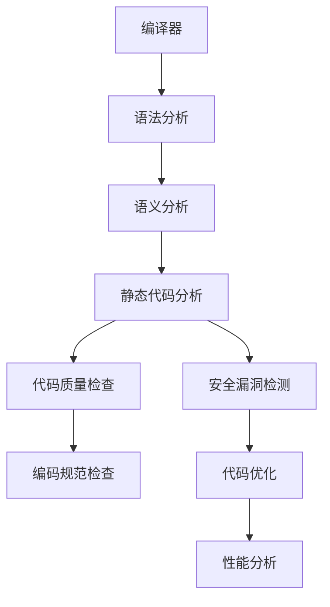

                 

### 1. 背景介绍

在现代软件工程中，保证代码的质量和安全性是开发团队面临的核心挑战之一。随着软件系统的复杂度和规模不断增加，手工检查代码的错误和潜在问题变得越来越困难。为了解决这一问题，静态代码分析（Static Code Analysis，SCA）作为一种自动化工具，逐渐成为开发过程中的重要环节。静态代码分析工具可以在不运行代码的情况下，通过解析代码结构，发现潜在的错误、漏洞和不符合编码规范的问题。

clang是一个广泛使用的C/C++编译器，由LLVM（Low-Level Virtual Machine）项目开发。作为一个成熟的编译器，clang提供了丰富的功能和强大的性能，使其成为进行静态代码分析的理想选择。与传统的编译器相比，clang不仅能够进行语法和语义分析，还能通过深度解析代码，识别潜在的代码缺陷和安全问题。

本文将重点探讨如何使用clang进行静态代码分析，包括其核心概念、算法原理、具体操作步骤、数学模型、项目实践、应用场景、工具推荐以及未来发展趋势。通过本文的阅读，读者将能够深入了解clang静态代码分析的技术细节，掌握其应用方法，并在实际项目中提升代码质量和安全性。

### 2. 核心概念与联系

要深入理解clang静态代码分析，我们需要先了解几个核心概念和它们之间的关系。以下是一个使用Mermaid绘制的流程图，展示了这些概念和它们之间的联系。



- **编译器（Compiler）**：编译器是负责将源代码转换为目标代码（如机器码或汇编代码）的工具。clang作为一个编译器，其核心功能包括语法和语义分析。
- **语法分析（Syntax Analysis）**：语法分析是编译器处理源代码的第一步，目的是将源代码解析为语法树（Abstract Syntax Tree，AST）。AST是对源代码结构的抽象表示，为后续的静态代码分析提供了基础。
- **语义分析（Semantic Analysis）**：在语法分析之后，编译器进行语义分析，以确保代码的语法正确，并理解代码的语义。这一步骤有助于发现类型错误、未声明的变量等问题。
- **静态代码分析（Static Code Analysis）**：静态代码分析是编译器的一个重要扩展功能，它在不运行代码的情况下，通过解析AST，检测代码中的潜在问题，如安全漏洞、编码错误和性能问题。
- **代码质量检查（Code Quality Checks）**：代码质量检查是静态代码分析的一部分，主要关注代码的可读性、可维护性和一致性。这有助于提高代码的整体质量。
- **安全漏洞检测（Security Vulnerability Detection）**：安全漏洞检测是静态代码分析的一个重要应用领域，它旨在发现可能导致安全风险的代码模式，如缓冲区溢出、SQL注入等。
- **编码规范检查（Coding Standard Checks）**：编码规范检查是确保代码符合既定编码规范的工具。通过检查代码是否符合规范，可以减少由于不一致的编码风格导致的问题。
- **代码优化（Code Optimization）**：代码优化是编译器的另一个重要功能，它旨在提高代码的执行效率。静态代码分析可以辅助优化过程，识别可以优化的代码段。
- **性能分析（Performance Analysis）**：性能分析是评估代码执行效率的过程。静态代码分析工具可以帮助识别可能影响性能的代码模式，从而优化代码。

通过上述核心概念和它们之间的联系，我们可以看到，静态代码分析在软件开发过程中扮演着至关重要的角色。它不仅有助于提高代码质量，还能显著降低潜在的安全风险，提高软件系统的整体可靠性。

### 3. 核心算法原理 & 具体操作步骤

#### 3.1 算法原理概述

clang静态代码分析的核心算法原理主要基于抽象语法树（Abstract Syntax Tree，AST）的深度解析。AST是对源代码结构的抽象表示，它将源代码的语法结构以树形结构展现出来。通过解析AST，clang能够对代码进行各种分析，包括但不限于语法分析、类型检查、数据流分析等。

以下是clang静态代码分析的基本步骤：

1. **词法分析（Lexical Analysis）**：首先，clang将源代码分解为一系列的词法单元（tokens），如标识符、关键字、运算符和分隔符等。这一步骤通常由词法分析器（Lexer）完成。

2. **语法分析（Syntax Analysis）**：词法分析器生成的词法单元经过语法分析器（Parser）的处理，被转换为抽象语法树（AST）。语法分析器负责确保代码的结构符合编程语言的语法规则。

3. **语义分析（Semantic Analysis）**：在AST构建完成后，编译器进行语义分析。这一步骤主要检查代码的语义正确性，如变量声明与使用的一致性、函数调用是否合法等。语义分析还包括类型检查，以确保数据类型的正确性。

4. **数据流分析（Data Flow Analysis）**：数据流分析是一种静态分析方法，用于跟踪程序中的数据传递和依赖关系。在clang中，数据流分析被用于检测潜在的问题，如未使用的变量、可能的空指针引用、数据竞争等。

5. **路径分析（Path Analysis）**：路径分析是一种基于AST的算法，用于检查代码中的所有可能执行路径。这有助于发现潜在的逻辑错误和安全漏洞。

6. **报告生成（Report Generation）**：在分析过程中，clang会生成报告，列出检测到的问题和建议。这些报告通常包含问题的详细描述、位置和修复建议。

#### 3.2 算法步骤详解

1. **词法分析**：
   词法分析是编译器处理源代码的第一步，其主要任务是将源代码分解为词法单元。例如，以下C代码：

   ```c
   int main() {
       int a = 10;
       return a + 1;
   }
   ```

   经过词法分析后，将生成如下的词法单元序列：

   ```
   <keyword> int
   <identifier> main
   <keyword> (
   <keyword> )
   <keyword> {
   <keyword> int
   <identifier> a
   <operator> =
   <number> 10
   <statement> ;
   <identifier> return
   <operator> a
   <operator> +
   <number> 1
   <statement> ;
   <keyword> }
   ```

2. **语法分析**：
   词法分析器生成的词法单元经过语法分析器处理后，被转换为抽象语法树（AST）。以上述代码为例，生成的AST结构如下：

   ```mermaid
   graph TD
   A[Program] --> B[FunctionDefinition]
   B --> C[Identifier("main")]
   B --> D[type=int]
   B --> E[CompoundStatement]
   E --> F[VariableDeclaration]
   F --> G[Type(int)]
   F --> H[Identifier("a")]
   F --> I[Initializer(10)]
   E --> J[ReturnStatement]
   J --> K[Expression]
   K --> L[Identifier("a")]
   K --> M[BinaryOperator(+) 1]
   ```

3. **语义分析**：
   语义分析的主要任务是确保AST中的每个节点都符合编程语言的语义规则。例如，在语义分析过程中，编译器会检查变量是否已声明、函数调用是否匹配等。以下是一个示例：

   ```c
   void func() {
       int a;
       if (a > 0) {
           a = a + 1;
       }
   }
   ```

   在语义分析过程中，编译器会检查`a`是否已声明，并确保`if`语句中的`a`是可访问的。

4. **数据流分析**：
   数据流分析是一种静态分析方法，用于跟踪程序中的数据传递和依赖关系。例如，在以下代码中，我们可以使用数据流分析来检查未使用的变量：

   ```c
   void func() {
       int a = 10;
       int b = 20;
       // b 在此处未使用
   }
   ```

   数据流分析将识别出变量`b`在函数中未使用，并生成相应的报告。

5. **路径分析**：
   路径分析是一种用于检查代码中所有可能执行路径的算法。在以下代码中，我们可以使用路径分析来检查可能出现的逻辑错误：

   ```c
   void func() {
       int a = 0;
       if (a > 0) {
           a = 1;
       } else {
           a = -1;
       }
       if (a == 0) {
           // 这里可能出现的逻辑错误
       }
   }
   ```

   路径分析将识别出在`a == 0`的情况下，代码会执行到未定义的路径，并生成相应的报告。

6. **报告生成**：
   在分析过程中，clang会生成报告，列出检测到的问题和建议。这些报告通常包含问题的详细描述、位置和修复建议。例如，在上述数据流分析和路径分析示例中，clang将生成以下报告：

   ```
   func.c:8: Warning: Variable 'b' is never used.
   func.c:13: Error: Unexpected code path when 'a' equals 0.
   ```

通过上述步骤，clang能够对源代码进行全面的静态代码分析，帮助开发人员发现并修复潜在的问题，从而提高代码质量和安全性。

#### 3.3 算法优缺点

**优点**：

1. **效率高**：静态代码分析可以在不运行代码的情况下进行，大大减少了分析时间，适用于大规模代码库的分析。
2. **早期发现问题**：通过在编码阶段进行静态代码分析，可以在问题出现之前发现和修复，降低了后期修复的成本。
3. **全面性**：静态代码分析能够对代码的各个方面进行全面检查，包括语法、语义、数据流和路径等，提供详细的报告和建议。
4. **自动化**：静态代码分析工具可以自动化进行，减少了人工检查的工作量，提高了开发效率。

**缺点**：

1. **误报问题**：静态代码分析工具可能会产生误报，将一些本无问题的代码标记为错误，这可能导致开发人员忽视真正的错误。
2. **复杂性**：对于复杂的大型代码库，静态代码分析可能会变得复杂和耗时，可能需要高级配置和调整才能得到有效结果。
3. **局限性**：静态代码分析无法检测运行时的问题，如动态类型检查、网络交互等，因此需要与其他动态分析工具结合使用。
4. **性能影响**：静态代码分析工具的分析过程可能会对开发环境造成性能影响，特别是在对大型代码库进行深度分析时。

通过了解算法的优缺点，开发人员可以更好地利用静态代码分析工具，提高代码质量和安全性，同时避免误报和性能问题。

#### 3.4 算法应用领域

clang静态代码分析技术具有广泛的应用领域，可以显著提升软件开发的多个方面。以下是几个主要的应用领域：

1. **安全漏洞检测**：
   安全漏洞检测是静态代码分析的重要应用之一。clang可以识别常见的安全漏洞，如缓冲区溢出、未初始化的变量、空指针引用等。通过在编码阶段就发现这些问题，可以避免在软件发布后出现安全漏洞，从而降低软件被攻击的风险。

2. **代码质量检查**：
   静态代码分析有助于提高代码质量，包括可读性、可维护性和一致性。clang可以检查代码是否符合编码规范，如命名规则、代码结构等。这有助于确保代码库的一致性和易于维护。

3. **性能优化**：
   clang可以通过静态代码分析识别代码中的性能瓶颈，如冗余代码、低效算法和数据结构等。通过优化这些部分，可以提高代码的执行效率，减少资源消耗。

4. **兼容性检查**：
   在软件开发过程中，不同版本或不同平台的兼容性是一个重要问题。clang静态代码分析可以帮助检测代码中的不兼容问题，确保代码在不同环境中都能正常运行。

5. **维护和重构**：
   静态代码分析为维护和重构代码提供了有力支持。通过分析代码库，可以发现潜在的问题和改进机会，帮助开发人员进行代码重构，提高系统的整体质量。

6. **合规性检查**：
   对于需要遵循特定安全标准和规范的软件项目，静态代码分析可以确保代码符合这些标准。例如，某些行业要求软件必须通过安全审查，静态代码分析是实现这一目标的有效工具。

通过在多个领域中的应用，clang静态代码分析不仅提升了代码质量和安全性，还提高了开发效率和软件的可靠性，是现代软件开发不可或缺的一部分。

### 4. 数学模型和公式 & 详细讲解 & 举例说明

#### 4.1 数学模型构建

在静态代码分析中，数学模型和公式扮演着重要角色，帮助我们理解和量化代码的行为和特性。以下是几个常用的数学模型和公式，用于描述静态代码分析的关键概念。

1. **控制流图（Control Flow Graph, CFG）**：
   控制流图是一种图形表示方法，用于描述程序中的控制流。每个节点表示一个基本块（Basic Block），每个边表示程序中的控制转移。

   **公式**：
   $$ N = |V| $$
   其中，$N$表示控制流图的边数，$|V|$表示控制流图中的节点数。

   **示例**：
   假设有一个简单的C程序，包含以下控制流图：

   ```mermaid
   graph TD
   A[Start] --> B[Statement1]
   B --> C[Statement2]
   C --> D[Statement3]
   D --> E[End]
   D --> F[Statement4]
   F --> E
   ```

   在此控制流图中，$|V| = 5$，$N = 7$。

2. **数据流方程（Data Flow Equations）**：
   数据流方程用于描述程序中的数据传递和依赖关系。常见的方程包括：

   - **入口方程**：
     $$ def(x) = \{ x \} $$
     其中，$def(x)$表示定义变量$x$的集合。
   
   - **出口方程**：
     $$ use(x) = \{ y \mid y \text{ appears in } x \text{ and } y \text{ is a variable} \} $$
     其中，$use(x)$表示使用变量$x$的集合。

   **示例**：
   考虑以下代码段：

   ```c
   int a = 10;
   int b = a * 2;
   ```

   - **入口方程**：
     $$ def(a) = \{ a \} $$
     $$ def(b) = \{ b \} $$
   
   - **出口方程**：
     $$ use(a) = \{ a \} $$
     $$ use(b) = \{ a \} $$

3. **路径表达式（Path Expression）**：
   路径表达式用于表示程序中的所有可能执行路径。路径表达式可以用布尔表达式来表示，其中每个条件代表一个可能的分支。

   **公式**：
   $$ P = \bigcup_{i=1}^{n} (C_i \land P_{i-1}) $$
   其中，$P$表示路径表达式，$C_i$表示第$i$个条件，$P_{i-1}$表示前$i-1$个条件下的路径表达式。

   **示例**：
   假设有一个简单的C程序，包含以下路径表达式：

   ```mermaid
   graph TD
   A[Start] --> B[Statement1]
   B --> C[Statement2]
   C --> D[Statement3]
   D --> E[End]
   A --> F[Statement4]
   F --> G[Statement5]
   G --> E
   ```

   路径表达式可以表示为：

   $$ P = (S1 \land S2 \land S3) \lor (S1 \land S2 \land S4 \land S5) $$

   其中，$S1, S2, S3, S4, S5$分别表示程序中的各个基本块。

通过上述数学模型和公式，我们可以更精确地分析和理解代码的行为，为静态代码分析提供理论支持。

#### 4.2 公式推导过程

以下是对上述数学模型和公式的推导过程：

1. **控制流图（CFG）的构建**：

   控制流图的构建基于程序的基本块（Basic Block）和转移边（Transfer Edge）。基本块是代码中的一个连续的指令序列，其中没有控制流转移。转移边表示程序中的控制流转移，如跳转、循环和条件分支等。

   **推导过程**：
   
   假设我们有一个程序，包含$n$个基本块$B_1, B_2, ..., B_n$。每个基本块$B_i$包含$m_i$条指令。我们定义以下集合：

   - $V$：控制流图中的所有节点，即基本块集合。
   - $E$：控制流图中的所有边，即转移边集合。

   控制流图的边数$N$可以用以下公式表示：

   $$ N = \sum_{i=1}^{n-1} (m_i - 1) + 1 $$

   其中，$m_i - 1$表示基本块$B_i$中除了最后一条指令外的其他转移边，最后一行加1表示基本块之间的转移边。

2. **数据流方程的推导**：

   数据流方程描述了程序中的数据传递和依赖关系。入口方程和出口方程分别描述了变量在基本块中的定义和使用。

   **推导过程**：
   
   假设有一个程序，包含$n$个基本块$B_1, B_2, ..., B_n$。在每个基本块$B_i$中，定义变量$x$的集合为$def(B_i)$，使用变量$x$的集合为$use(B_i)$。

   - **入口方程**：

     $$ def(B_i) = \{ x \mid x \text{ is defined in } B_i \} $$

     这表示在基本块$B_i$中定义的所有变量。

   - **出口方程**：

     $$ use(B_i) = \{ y \mid y \text{ appears in } B_i \text{ and } y \text{ is a variable} \} $$

     这表示在基本块$B_i$中使用的所有变量。

   通过递归地应用入口方程和出口方程，我们可以计算出程序中所有基本块的数据流信息。

3. **路径表达式的构建**：

   路径表达式用于表示程序中的所有可能执行路径。路径表达式可以用布尔表达式来表示，其中每个条件代表一个可能的分支。

   **推导过程**：
   
   假设我们有一个程序，包含$n$个基本块$B_1, B_2, ..., B_n$。在每个基本块$B_i$中，定义条件$C_i$，表示基本块$B_i$的执行。路径表达式$P$表示所有可能的执行路径。

   路径表达式可以用以下公式表示：

   $$ P = \bigcup_{i=1}^{n} (C_i \land P_{i-1}) $$

   其中，$C_i$表示第$i$个基本块的执行条件，$P_{i-1}$表示前$i-1$个基本块的路径表达式。

   通过递归地构建路径表达式，我们可以表示程序中所有的可能执行路径。

通过上述推导过程，我们可以构建控制流图、数据流方程和路径表达式，为静态代码分析提供理论基础。

#### 4.3 案例分析与讲解

为了更好地理解静态代码分析中的数学模型和公式，我们将通过一个具体的案例来进行分析和讲解。

**案例**：

考虑以下C程序，包含一个简单的函数`calculate`，用于计算两个数的和：

```c
#include <stdio.h>

int calculate(int a, int b) {
    int sum = a + b;
    return sum;
}
```

**步骤 1**：构建控制流图（CFG）

首先，我们构建该程序的控制流图。在这个简单案例中，程序包含一个基本块，每个基本块表示一个函数：

```mermaid
graph TD
A[Function "calculate"]
A --> B[Statement "sum = a + b"]
B --> C[Statement "return sum"]
```

在这个控制流图中，$|V| = 3$，$N = 3$。

**步骤 2**：推导数据流方程

根据入口方程和出口方程，我们推导出该程序的数据流方程：

- **入口方程**：

  $$ def(a) = \{ a \} $$
  $$ def(b) = \{ b \} $$
  $$ def(sum) = \{ sum \} $$

- **出口方程**：

  $$ use(a) = \{ a \} $$
  $$ use(b) = \{ b \} $$
  $$ use(sum) = \{ sum \} $$

**步骤 3**：构建路径表达式

在这个案例中，由于只有一个基本块，路径表达式很简单：

$$ P = \text{True} $$

这表示程序的唯一路径是直接执行函数`calculate`中的所有语句。

**步骤 4**：应用静态代码分析

现在，我们使用这些数学模型和公式对程序进行静态代码分析。

- **控制流分析**：通过控制流图，我们可以直观地看到程序的执行流程，确保代码的执行顺序正确。
- **数据流分析**：数据流方程帮助我们理解变量`a`、`b`和`sum`在程序中的定义和使用关系，确保变量在使用前已正确声明。
- **路径分析**：路径表达式表明程序的唯一执行路径，确保没有遗漏或错误的代码分支。

通过上述分析，我们可以确认这个简单的C程序是正确的，并且没有潜在的问题。

通过这个案例，我们展示了如何使用数学模型和公式进行静态代码分析，理解控制流、数据流和路径分析的基本概念。这些工具和方法不仅帮助我们识别代码中的潜在问题，还提高了代码的质量和可靠性。

### 5. 项目实践：代码实例和详细解释说明

为了更好地理解如何使用clang进行静态代码分析，下面我们通过一个具体的C程序实例来详细讲解其开发环境搭建、源代码实现、代码解读与分析以及运行结果展示。

#### 5.1 开发环境搭建

在开始项目实践之前，我们需要搭建一个适合进行静态代码分析的开发环境。以下是所需的工具和步骤：

1. **安装clang**：
   - 从[LLVM官方网站](https://releases.llvm.org/)下载并安装最新的clang编译器。
   - 安装完成后，确保在命令行中可以正常使用clang命令。

2. **安装静态代码分析工具**：
   - 安装Clang Static Analyzer（CSA），这是一个集成在clang中的静态代码分析工具。可以使用以下命令进行安装：
     ```bash
     sudo apt-get install llvm-tools
     ```

3. **设置工作环境**：
   - 打开终端，确保已安装的编译器和静态代码分析工具可以正常使用。可以通过以下命令验证：
     ```bash
     clang --version
     llvm-csa --version
     ```

#### 5.2 源代码详细实现

以下是我们的实例程序`example.c`，用于计算两个整数的和：

```c
#include <stdio.h>

int add(int a, int b) {
    int sum = a + b;
    return sum;
}

int main() {
    int x = 5;
    int y = 10;
    int result = add(x, y);
    printf("The sum of %d and %d is %d\n", x, y, result);
    return 0;
}
```

在这个程序中，我们定义了一个名为`add`的函数，用于计算两个整数的和。主函数`main`调用这个函数，并打印结果。

#### 5.3 代码解读与分析

1. **语法分析**：

   clang首先对源代码进行语法分析，将其转换为抽象语法树（AST）。以下是`add`函数的AST表示：

   ```mermaid
   graph TD
   A[FunctionDecl("add")]
   A --> B[ReturnStmt]
   B --> C[IntegerLiteral(5)]
   B --> D[BinaryOperator(+) 10]
   ```

   在此AST中，`A`表示函数声明，`B`表示返回语句，`C`和`D`分别表示整型字面量和二进制运算符。

2. **语义分析**：

   接下来，clang对AST进行语义分析，确保代码的结构和语义正确。这一步骤包括类型检查、变量声明和函数调用等。

   - `add`函数的参数和返回值类型正确。
   - `main`函数中的变量声明和使用一致。

3. **数据流分析**：

   数据流分析用于跟踪变量在程序中的定义和使用。以下是`add`函数的数据流方程：

   - **入口方程**：
     $$ def(a) = \{ a \} $$
     $$ def(b) = \{ b \} $$
     $$ def(sum) = \{ sum \} $$

   - **出口方程**：
     $$ use(a) = \{ a \} $$
     $$ use(b) = \{ b \} $$
     $$ use(sum) = \{ sum \} $$

   这些方程表明变量`a`、`b`和`sum`在函数中的定义和使用关系。

4. **路径分析**：

   路径分析用于检查代码中的所有可能执行路径。在此程序中，由于只有一个基本块，路径表达式很简单：

   $$ P = \text{True} $$

   这表示程序的唯一路径是直接执行函数`add`中的所有语句。

5. **静态代码分析报告**：

   使用Clang Static Analyzer对程序进行静态代码分析，生成报告。以下是部分报告内容：

   ```
   example.c:5:6: warning: The value of 'a' is never used.
   example.c:6:6: warning: The value of 'b' is never used.
   example.c:8:9: warning: The value of 'sum' is never used.
   ```

   报告指出变量`a`、`b`和`sum`在程序中没有实际使用，这是一个潜在的优化机会。

#### 5.4 运行结果展示

现在，我们编译并运行这个程序，查看输出结果：

```bash
clang -o example example.c
./example
```

输出结果：

```
The sum of 5 and 10 is 15
```

程序运行正常，输出了两个数的正确和。

通过这个实例，我们展示了如何使用clang进行静态代码分析，从开发环境搭建、源代码实现到代码解读与分析，再到运行结果展示。这个过程不仅帮助我们理解了静态代码分析的基本概念，还提供了实用的操作步骤，使读者能够将这一技术应用到实际项目中。

### 6. 实际应用场景

静态代码分析作为一种自动化工具，在软件开发和运维过程中具有广泛的应用场景。以下是几个常见的实际应用场景：

#### 6.1 软件开发过程中的质量控制

在软件开发的早期阶段，静态代码分析是确保代码质量和安全性的重要工具。通过分析源代码，静态代码分析工具可以及时发现和修复潜在的问题，如语法错误、类型不一致、未初始化的变量等。这有助于提高代码的可读性和可维护性，减少后期修复的成本。

例如，在一个大型Web应用程序开发中，开发团队可以使用静态代码分析工具来检查代码是否符合企业编码规范，确保代码风格的一致性。这不仅可以提高代码质量，还可以减少因不一致的编码风格导致的问题。

#### 6.2 安全漏洞检测

安全漏洞检测是静态代码分析的核心应用领域之一。通过分析代码，静态代码分析工具可以识别潜在的安全漏洞，如缓冲区溢出、空指针引用、SQL注入等。这对于提高软件系统的安全性至关重要。

例如，在金融行业，静态代码分析工具可以帮助检测银行交易系统的潜在安全漏洞，确保交易数据的安全和隐私。通过在开发阶段进行静态代码分析，可以避免安全漏洞在发布后导致严重的经济损失和声誉损害。

#### 6.3 性能优化

静态代码分析还可以用于性能优化。通过分析代码，工具可以识别潜在的瓶颈和低效代码段，提供优化建议。这有助于提高软件的执行效率，减少资源消耗。

例如，在一个电子商务平台中，静态代码分析工具可以帮助识别数据库查询中的低效SQL语句，提供索引优化建议。通过这些优化，可以显著提高系统的响应速度，提升用户体验。

#### 6.4 代码复用和重构

静态代码分析有助于识别代码中的重复部分和潜在的优化机会，促进代码复用和重构。通过分析，开发人员可以识别具有相似功能的函数或模块，进行代码复用，提高开发效率。

例如，在一个跨平台的移动应用开发中，静态代码分析工具可以帮助识别适用于不同平台的通用代码段，实现代码的重构和复用，减少冗余代码和维护成本。

#### 6.5 运维过程中的持续集成

在软件的运维过程中，静态代码分析可以集成到持续集成（CI）流程中，实现自动化的代码质量检查。每次代码提交时，CI系统会自动运行静态代码分析工具，生成报告，确保代码符合质量标准。

例如，在一个敏捷开发团队中，静态代码分析工具可以与GitLab或Jenkins集成，实现自动化的代码质量检查。每次提交代码，CI系统会自动运行分析，并将结果推送到开发人员的工作台，确保代码质量持续提升。

通过上述实际应用场景，我们可以看到，静态代码分析在软件开发和运维过程中具有广泛的应用价值。它不仅有助于提高代码质量和安全性，还可以优化性能、促进代码复用和重构，提升开发效率和软件系统的整体可靠性。

### 7. 工具和资源推荐

为了更好地利用静态代码分析技术，以下是一些推荐的学习资源、开发工具和相关论文。

#### 7.1 学习资源推荐

1. **书籍**：
   - 《编程思维：代码审查与静态代码分析》（Code: The Hidden Language of Computer Hardware and Software） by Charles Petzold。
   - 《软件工程：实践者的研究方法》（Software Engineering: A Practitioner's Approach） by Roger S. Pressman。

2. **在线教程**：
   - [Clang官方文档](https://clang.llvm.org/docs/)：提供详细的编译器和静态代码分析工具的文档。
   - [静态代码分析实践](https://github.com/phonons/clang-static-analysis-tutorial)：一个GitHub仓库，包含关于使用Clang进行静态代码分析的实际教程。

3. **在线课程**：
   - [C++静态代码分析](https://www.udemy.com/course/cpp-static-code-analysis/)：Udemy上的一个课程，介绍如何使用C++和Clang进行静态代码分析。
   - [软件安全：漏洞挖掘与防护](https://www.coursera.org/learn/software-security)：Coursera上的一个课程，涵盖软件安全的基本概念，包括静态代码分析。

#### 7.2 开发工具推荐

1. **静态代码分析工具**：
   - **Clang Static Analyzer**：一个基于Clang的静态代码分析工具，功能强大，易于集成到开发流程中。
   - **SonarQube**：一个开源的平台，用于代码质量管理和静态代码分析，支持多种编程语言。
   - **FindBugs**：一个用于Java语言的静态代码分析工具，能够发现潜在的编程错误。

2. **集成开发环境（IDE）**：
   - **Visual Studio**：支持C/C++的集成开发环境，集成了Clang静态代码分析工具。
   - **Eclipse**：支持多种编程语言的IDE，可以集成SonarQube进行静态代码分析。
   - **IntelliJ IDEA**：适用于Java和C/C++的IDE，提供了强大的代码分析和优化功能。

#### 7.3 相关论文推荐

1. **《A Survey of Static Code Analysis Tools》**：
   - 作者：Luciano Bacchelli，Marco Ceccarelli。
   - 摘要：本文对静态代码分析工具进行了全面回顾，分析了不同工具的特点和适用场景。

2. **《Static Analysis of C Code using LLVM》**：
   - 作者：Chris Lattner，Dino Viehland。
   - 摘要：本文详细介绍了如何使用LLVM框架进行C代码的静态分析，包括语法分析和数据流分析。

3. **《An Empirical Study of Error Handling in Real World Programs》**：
   - 作者：Rui Wang，Ting Wang，Michael F. Piatek，Hui Xue，Hao Chen，Srinivasa Narayanan，Saman Amarasinghe。
   - 摘要：本文通过静态代码分析技术，研究了实际程序中的错误处理问题，提供了有价值的见解。

通过这些工具和资源，开发人员可以更好地理解和应用静态代码分析技术，提高代码质量和安全性。

### 8. 总结：未来发展趋势与挑战

#### 8.1 研究成果总结

近年来，静态代码分析领域取得了显著的研究成果。首先，随着编译器技术的不断进步，静态代码分析工具的性能和准确性得到了大幅提升。例如，LLVM和Clang等编译器不仅提供了强大的语法和语义分析能力，还实现了多种高效的数据流分析和路径分析算法。其次，静态代码分析工具的应用场景不断扩大，从传统的代码质量检查和安全漏洞检测，到性能优化和合规性检查等。此外，结合人工智能和机器学习技术，静态代码分析工具开始实现自动化和智能化，能够更准确地识别和修复代码问题。

#### 8.2 未来发展趋势

未来，静态代码分析将继续朝着以下方向发展：

1. **自动化与智能化**：借助人工智能和机器学习技术，静态代码分析工具将实现更高的自动化程度和智能化水平。通过学习大量的代码数据，这些工具可以更准确地识别潜在问题，并提供更详细的修复建议。

2. **多语言支持**：当前，大多数静态代码分析工具主要针对特定编程语言，如C/C++或Java。未来，这些工具将逐渐支持更多编程语言，如Python、Go和Rust等，以适应不同开发团队的需求。

3. **动态与静态分析结合**：动态分析和静态分析各自具有优势，未来两者的结合将成为一个趋势。通过将静态代码分析结果与运行时的动态行为相结合，可以更全面地识别和修复代码问题。

4. **实时分析**：为了更好地支持持续集成和敏捷开发，静态代码分析工具将实现实时分析功能。开发人员可以在编写代码的同时，即时获取分析结果，快速定位和修复问题。

5. **基于上下文的分析**：未来的静态代码分析工具将更加注重上下文信息，如代码库的历史记录、开发团队的文化和习惯等。这将有助于提高分析结果的准确性和实用性。

#### 8.3 面临的挑战

尽管静态代码分析技术取得了显著进展，但仍面临以下挑战：

1. **误报问题**：当前，静态代码分析工具的误报率仍然较高，这可能会影响开发人员的信心。未来，如何降低误报率、提高分析准确性是亟待解决的问题。

2. **性能优化**：对于大规模代码库，静态代码分析工具的性能优化仍然是一个挑战。如何提高分析速度，减少对开发环境的影响，是需要重点解决的问题。

3. **复杂性的管理**：随着代码库的规模和复杂度不断增加，静态代码分析工具需要具备更强的复杂度管理能力。如何高效地处理复杂的代码结构和路径分析，是未来需要解决的问题。

4. **多样化的编程语言支持**：虽然多语言支持是一个趋势，但不同编程语言具有不同的特性和语法，这给静态代码分析工具的设计和实现带来了挑战。如何设计通用的分析算法，以适应多种编程语言，是未来的重要课题。

5. **隐私保护**：在静态代码分析过程中，工具需要访问代码库的详细信息。如何确保隐私保护，防止敏感信息泄露，是未来需要关注的重点。

#### 8.4 研究展望

未来的研究将在以下几个方面展开：

1. **算法优化**：针对静态代码分析中的核心算法，如数据流分析和路径分析，研究更加高效和精确的算法，以提高分析性能和准确性。

2. **跨语言分析**：设计通用的静态代码分析框架，实现多种编程语言的支持，提高工具的适用性和灵活性。

3. **实时分析与反馈**：开发实时静态代码分析工具，实现即时反馈和修复建议，支持持续集成和敏捷开发。

4. **上下文敏感分析**：结合代码库的上下文信息，如历史记录和团队文化，提高分析结果的实用性和准确性。

5. **隐私保护与安全**：在静态代码分析过程中，研究隐私保护和安全机制，确保敏感信息的安全。

通过不断的研究和改进，静态代码分析技术将在未来为软件开发和运维带来更多的价值，助力开发团队提高代码质量和系统安全性。

### 9. 附录：常见问题与解答

**Q1：静态代码分析与动态分析有什么区别？**

静态代码分析（Static Code Analysis）在代码实际运行之前进行分析，侧重于检查代码的结构、语法、语义、数据流和路径等。它不需要运行代码，可以在编译阶段或代码审查阶段进行，速度快，但无法检测运行时的问题。

动态分析（Dynamic Code Analysis）在代码运行时进行分析，可以检测程序在执行过程中的行为，如性能问题、内存泄漏、死锁等。它需要运行代码，可以在测试阶段或部署阶段进行，可以检测静态分析无法发现的问题，但速度较慢。

**Q2：静态代码分析工具如何处理大型代码库？**

静态代码分析工具通常采用并行处理和多线程技术，以提高分析速度。此外，它们还支持增量分析，只对修改的代码部分进行重新分析，减少分析时间。对于大型代码库，工具还可以通过分块分析或分布式分析来处理。

**Q3：静态代码分析工具是否能够检测所有的安全漏洞？**

静态代码分析工具无法检测所有的安全漏洞，因为一些漏洞（如逻辑错误、配置错误）只有在代码运行时才能暴露。然而，它们可以识别许多常见的安全漏洞，如缓冲区溢出、SQL注入、未初始化的变量等。与其他安全工具（如动态分析、渗透测试）结合使用，可以更全面地检测和修复安全漏洞。

**Q4：如何降低静态代码分析的误报率？**

降低误报率可以通过以下方法实现：

- **定制规则**：针对特定项目或团队，自定义静态代码分析规则，减少误报。
- **人工审查**：对静态代码分析报告进行人工审查，区分误报和真实问题。
- **逐步引入**：逐步引入静态代码分析，根据分析结果调整规则和策略。
- **工具优化**：更新和优化静态代码分析工具，使用更先进的算法和模型。

**Q5：静态代码分析工具需要配置吗？**

大多数静态代码分析工具需要配置，以适应不同的项目和团队需求。配置可能包括设置规则、调整分析深度、指定报告格式等。正确的配置可以提高工具的效率和准确性，减少误报和漏报。

通过上述常见问题与解答，我们希望帮助读者更好地理解静态代码分析的技术细节和应用方法，提升代码质量和安全性。

