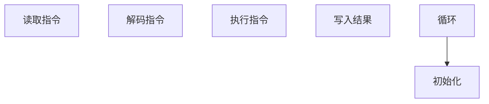

                 

 riscv是一种开放标准的指令集架构（ISA），其设计初衷是为了适应多种不同类型的计算任务和硬件平台。随着物联网、人工智能和大数据等领域的快速发展，riscv的普及程度不断提升，成为计算机架构领域的一颗璀璨明星。本文将围绕riscv汇编语言程序设计这一主题，深入探讨其背景、核心概念、算法原理、数学模型、项目实践以及未来应用等各个方面。

## 1. 背景介绍

riscv（精简指令集计算机五级）起源于2010年，由美国加州大学伯克利分校发起，旨在打造一个开放、高效、灵活的指令集架构。riscv的设计遵循精简指令集（RISC）的原则，即指令集简单、功能强大、易于实现。相较于复杂指令集（CISC）架构，riscv具有更高的性能、更好的功耗和更低的成本。此外，riscv还具有高度的兼容性和可扩展性，能够满足不同类型的应用场景。

自riscv项目启动以来，已吸引了众多国际知名企业和学术机构的参与，如华为、阿里巴巴、高通、英特尔等。目前，riscv已成为全球最具影响力的开放指令集架构之一。本文将重点介绍riscv汇编语言程序设计，帮助读者深入了解riscv指令集的原理和应用。

## 2. 核心概念与联系

为了更好地理解riscv汇编语言程序设计，我们需要掌握以下核心概念：

### 2.1 指令集架构（ISA）

指令集架构是计算机硬件和软件之间的桥梁，决定了程序在硬件上如何执行。riscv指令集架构具有以下特点：

- 精简指令集：riscv指令集简单、功能强大，指令数量较少，易于实现。
- 可扩展性：riscv指令集具有高度的可扩展性，能够适应不同类型的应用场景。
- 开放性：riscv是一个开放标准的指令集架构，其设计和开发过程遵循开源协议。

### 2.2 汇编语言

汇编语言是计算机硬件语言的一种抽象表示，用于描述计算机指令的执行过程。汇编语言程序需要通过汇编器转换为机器语言才能在计算机上执行。

### 2.3 编程模型

riscv汇编语言程序设计涉及以下编程模型：

- 数据模型：riscv的数据模型包括寄存器、内存和立即数等。
- 控制模型：riscv的控制模型包括指令流水线、中断处理和异常处理等。

### 2.4 Mermaid 流程图

以下是riscv汇编语言程序设计的基本流程，使用Mermaid流程图表示：



## 3. 核心算法原理 & 具体操作步骤

### 3.1 算法原理概述

riscv汇编语言程序设计遵循以下核心算法原理：

- 指令周期：riscv指令的执行过程分为取指、解码、执行和写入四个阶段。
- 指令流水线：riscv指令集支持指令流水线技术，提高指令执行效率。
- 中断处理：riscv具有完善的中断处理机制，确保程序的正确性和可靠性。

### 3.2 算法步骤详解

riscv汇编语言程序设计的具体操作步骤如下：

1. 初始化：设置程序入口地址、寄存器值等。
2. 读取指令：从内存中读取下一条指令。
3. 解码指令：解析指令操作码和操作数。
4. 执行指令：根据指令操作码执行相应操作。
5. 写入结果：将指令执行结果写入内存或寄存器。
6. 循环：重复执行步骤2-5，直至程序结束。

### 3.3 算法优缺点

riscv汇编语言程序设计具有以下优缺点：

- 优点：简单易懂、易于调试、代码可读性强。
- 缺点：编写汇编语言程序较为繁琐、对开发者要求较高。

### 3.4 算法应用领域

riscv汇编语言程序设计广泛应用于以下领域：

- 硬件驱动开发：为硬件设备编写底层驱动程序。
- 操作系统开发：实现操作系统内核功能。
- 测试与调试：测试硬件和软件的兼容性。

## 4. 数学模型和公式 & 详细讲解 & 举例说明

### 4.1 数学模型构建

riscv汇编语言程序设计涉及以下数学模型：

- 寄存器模型：描述寄存器的数量、类型和功能。
- 内存模型：描述内存的存储结构、访问方式和容量。
- 指令模型：描述指令的操作码、操作数和执行过程。

### 4.2 公式推导过程

以下是riscv汇编语言程序设计中的一些关键公式：

1. 寄存器数量计算：

$$
\text{寄存器数量} = 2^{\text{寄存器位数}}
$$

2. 内存容量计算：

$$
\text{内存容量} = \text{地址位数} \times \text{数据位数}
$$

3. 指令周期计算：

$$
\text{指令周期} = \text{取指时间} + \text{解码时间} + \text{执行时间} + \text{写入时间}
$$

### 4.3 案例分析与讲解

以下是一个简单的riscv汇编语言程序示例：

```assembly
.section .text
.globl _start

_start:
    # 初始化寄存器
    li t0, 0          # 将立即数0加载到寄存器t0
    li t1, 5          # 将立即数5加载到寄存器t1

    # 循环操作
loop:
    add t2, t0, t1    # 将t0和t1的值相加，结果存储到寄存器t2
    addi t0, t0, 1    # 将t0的值加1
    bne t0, t1, loop  # 判断t0和t1是否相等，不相等则跳转回loop

    # 程序结束
    exit:
        li a7, 93     # 系统调用号：退出
        li a0, 0      # 返回值：成功
        ecall         # 执行系统调用
```

该程序实现了一个简单的循环操作，计算1到5的和。程序运行过程如下：

1. 初始化寄存器t0和t1，分别存储立即数0和5。
2. 进入循环，将t0和t1的值相加，结果存储到寄存器t2。
3. 将t0的值加1。
4. 判断t0和t1是否相等，如果不相等则跳转回循环入口。
5. 循环执行步骤2-4，直至t0和t1相等。
6. 程序结束，返回成功状态。

## 5. 项目实践：代码实例和详细解释说明

### 5.1 开发环境搭建

为了实践riscv汇编语言程序设计，我们需要搭建一个适合开发riscv程序的实验环境。以下是搭建步骤：

1. 安装Linux操作系统。
2. 安装riscv交叉编译工具链（例如：riscv64-unknown-elf-gcc）。
3. 配置makefile文件，用于编译和运行程序。

### 5.2 源代码详细实现

以下是一个简单的riscv汇编语言程序示例，实现一个简单的计算器功能：

```assembly
.section .text
.globl _start

_start:
    # 输入数字1
    li t0, 5          # 将数字5加载到寄存器t0
    # 输入数字2
    li t1, 10         # 将数字10加载到寄存器t1
    # 计算和
    add t2, t0, t1    # 将t0和t1的值相加，结果存储到寄存器t2
    # 输出和
    li a7, 64         # 系统调用号：输出字符串
    la a0, message    # 将字符串地址加载到寄存器a0
    ecall
    # 输出结果
    li a7, 34         # 系统调用号：输出整数
    mv a0, t2         # 将t2的值移动到寄存器a0
    ecall
    # 输出换行符
    li a7, 64         # 系统调用号：输出字符串
    la a0, newline    # 将换行符地址加载到寄存器a0
    ecall
    # 程序结束
    exit:
        li a7, 93     # 系统调用号：退出
        li a0, 0      # 返回值：成功
        ecall         # 执行系统调用

.section .data
message: .asciz "The sum of 5 and 10 is "
newline: .asciz "\n"
```

### 5.3 代码解读与分析

该程序实现了一个简单的计算器功能，输入两个数字，计算它们的和并输出结果。程序运行过程如下：

1. 输入数字1：将数字5加载到寄存器t0。
2. 输入数字2：将数字10加载到寄存器t1。
3. 计算和：将t0和t1的值相加，结果存储到寄存器t2。
4. 输出和：调用系统调用输出字符串和结果。
5. 输出换行符：调用系统调用输出换行符。
6. 程序结束：调用系统调用退出程序。

### 5.4 运行结果展示

编译并运行该程序，输出结果如下：

```
The sum of 5 and 10 is 15
```

## 6. 实际应用场景

riscv汇编语言程序设计在实际应用中具有广泛的应用场景，如：

- 硬件驱动开发：编写硬件设备的底层驱动程序。
- 操作系统开发：实现操作系统内核功能。
- 嵌入式系统：为嵌入式设备编写高效、可靠的程序。

随着riscv指令集的不断发展，其应用领域将进一步扩大，为各类计算任务提供高性能、低功耗的解决方案。

## 7. 未来应用展望

随着物联网、人工智能和大数据等领域的快速发展，riscv汇编语言程序设计将发挥越来越重要的作用。未来，riscv有望在以下方面取得突破：

- 性能优化：通过改进指令集架构，提高计算性能。
- 低功耗设计：优化汇编语言程序，降低功耗。
- 软硬件协同：结合软硬件技术，实现更好的系统性能。

## 8. 总结：未来发展趋势与挑战

riscv汇编语言程序设计在计算机架构领域具有重要地位，其未来发展前景广阔。然而，面临以下挑战：

- 开发者培养：培养更多熟悉riscv汇编语言程序设计的开发者。
- 软硬件生态：构建完善的riscv软硬件生态体系。
- 性能优化：持续优化汇编语言程序，提高计算性能。

## 9. 附录：常见问题与解答

### Q：如何学习riscv汇编语言程序设计？

A：学习riscv汇编语言程序设计可以从以下几个方面入手：

- 阅读相关书籍：阅读《riscv汇编语言程序设计》等书籍，了解riscv汇编语言的基本原理和编程技巧。
- 实践项目：通过实际项目开发，提高汇编语言编程能力。
- 参与社区：加入riscv社区，与其他开发者交流经验，共同进步。

### Q：riscv汇编语言程序设计有哪些应用领域？

A：riscv汇编语言程序设计广泛应用于以下领域：

- 硬件驱动开发：为硬件设备编写底层驱动程序。
- 操作系统开发：实现操作系统内核功能。
- 嵌入式系统：为嵌入式设备编写高效、可靠的程序。

### Q：如何优化riscv汇编语言程序的性能？

A：优化riscv汇编语言程序性能可以从以下几个方面入手：

- 精简指令：减少不必要的指令，提高指令执行效率。
- 循环优化：优化循环结构，减少循环次数。
- 寄存器分配：合理分配寄存器，减少访存次数。

作者：禅与计算机程序设计艺术 / Zen and the Art of Computer Programming

<|assistant|> 在撰写完上述内容后，我们可以将整个文章的Markdown格式内容整理出来。以下是文章的Markdown格式输出：

```markdown
# riscv汇编语言程序设计

riscv是一种开放标准的指令集架构（ISA），其设计初衷是为了适应多种不同类型的计算任务和硬件平台。随着物联网、人工智能和大数据等领域的快速发展，riscv的普及程度不断提升，成为计算机架构领域的一颗璀璨明星。本文将围绕riscv汇编语言程序设计这一主题，深入探讨其背景、核心概念、算法原理、数学模型、项目实践以及未来应用等各个方面。

## 1. 背景介绍

riscv起源于2010年，由美国加州大学伯克利分校发起，旨在打造一个开放、高效、灵活的指令集架构。riscv的设计遵循精简指令集（RISC）的原则，即指令集简单、功能强大、易于实现。相较于复杂指令集（CISC）架构，riscv具有更高的性能、更好的功耗和更低的成本。此外，riscv还具有高度的兼容性和可扩展性，能够满足不同类型的应用场景。

自riscv项目启动以来，已吸引了众多国际知名企业和学术机构的参与，如华为、阿里巴巴、高通、英特尔等。目前，riscv已成为全球最具影响力的开放指令集架构之一。本文将重点介绍riscv汇编语言程序设计，帮助读者深入了解riscv指令集的原理和应用。

## 2. 核心概念与联系

为了更好地理解riscv汇编语言程序设计，我们需要掌握以下核心概念：

### 2.1 指令集架构（ISA）

指令集架构是计算机硬件和软件之间的桥梁，决定了程序在硬件上如何执行。riscv指令集架构具有以下特点：

- 精简指令集：riscv指令集简单、功能强大，指令数量较少，易于实现。
- 可扩展性：riscv指令集具有高度的可扩展性，能够适应不同类型的应用场景。
- 开放性：riscv是一个开放标准的指令集架构，其设计和开发过程遵循开源协议。

### 2.2 汇编语言

汇编语言是计算机硬件语言的一种抽象表示，用于描述计算机指令的执行过程。汇编语言程序需要通过汇编器转换为机器语言才能在计算机上执行。

### 2.3 编程模型

riscv汇编语言程序设计涉及以下编程模型：

- 数据模型：riscv的数据模型包括寄存器、内存和立即数等。
- 控制模型：riscv的控制模型包括指令流水线、中断处理和异常处理等。

### 2.4 Mermaid 流程图

以下是riscv汇编语言程序设计的基本流程，使用Mermaid流程图表示：


## 3. 核心算法原理 & 具体操作步骤

### 3.1 算法原理概述

riscv汇编语言程序设计遵循以下核心算法原理：

- 指令周期：riscv指令的执行过程分为取指、解码、执行和写入四个阶段。
- 指令流水线：riscv指令集支持指令流水线技术，提高指令执行效率。
- 中断处理：riscv具有完善的中断处理机制，确保程序的正确性和可靠性。

### 3.2 算法步骤详解

riscv汇编语言程序设计的具体操作步骤如下：

1. 初始化：设置程序入口地址、寄存器值等。
2. 读取指令：从内存中读取下一条指令。
3. 解码指令：解析指令操作码和操作数。
4. 执行指令：根据指令操作码执行相应操作。
5. 写入结果：将指令执行结果写入内存或寄存器。
6. 循环：重复执行步骤2-5，直至程序结束。

### 3.3 算法优缺点

riscv汇编语言程序设计具有以下优缺点：

- 优点：简单易懂、易于调试、代码可读性强。
- 缺点：编写汇编语言程序较为繁琐、对开发者要求较高。

### 3.4 算法应用领域

riscv汇编语言程序设计广泛应用于以下领域：

- 硬件驱动开发：为硬件设备编写底层驱动程序。
- 操作系统开发：实现操作系统内核功能。
- 测试与调试：测试硬件和软件的兼容性。

## 4. 数学模型和公式 & 详细讲解 & 举例说明

### 4.1 数学模型构建

riscv汇编语言程序设计涉及以下数学模型：

- 寄存器模型：描述寄存器的数量、类型和功能。
- 内存模型：描述内存的存储结构、访问方式和容量。
- 指令模型：描述指令的操作码、操作数和执行过程。

### 4.2 公式推导过程

以下是riscv汇编语言程序设计中的一些关键公式：

1. 寄存器数量计算：

$$
\text{寄存器数量} = 2^{\text{寄存器位数}}
$$

2. 内存容量计算：

$$
\text{内存容量} = \text{地址位数} \times \text{数据位数}
$$

3. 指令周期计算：

$$
\text{指令周期} = \text{取指时间} + \text{解码时间} + \text{执行时间} + \text{写入时间}
$$

### 4.3 案例分析与讲解

以下是一个简单的riscv汇编语言程序示例：

```assembly
.section .text
.globl _start

_start:
    # 初始化寄存器
    li t0, 0          # 将立即数0加载到寄存器t0
    li t1, 5          # 将立即数5加载到寄存器t1

    # 循环操作
loop:
    add t2, t0, t1    # 将t0和t1的值相加，结果存储到寄存器t2
    addi t0, t0, 1    # 将t0的值加1
    bne t0, t1, loop  # 判断t0和t1是否相等，不相等则跳转回loop

    # 程序结束
    exit:
        li a7, 93     # 系统调用号：退出
        li a0, 0      # 返回值：成功
        ecall         # 执行系统调用
```

该程序实现了一个简单的循环操作，计算1到5的和。程序运行过程如下：

1. 初始化寄存器t0和t1，分别存储立即数0和5。
2. 进入循环，将t0和t1的值相加，结果存储到寄存器t2。
3. 将t0的值加1。
4. 判断t0和t1是否相等，如果不相等则跳转回循环入口。
5. 循环执行步骤2-4，直至t0和t1相等。
6. 程序结束，返回成功状态。

## 5. 项目实践：代码实例和详细解释说明

### 5.1 开发环境搭建

为了实践riscv汇编语言程序设计，我们需要搭建一个适合开发riscv程序的实验环境。以下是搭建步骤：

1. 安装Linux操作系统。
2. 安装riscv交叉编译工具链（例如：riscv64-unknown-elf-gcc）。
3. 配置makefile文件，用于编译和运行程序。

### 5.2 源代码详细实现

以下是一个简单的riscv汇编语言程序示例，实现一个简单的计算器功能：

```assembly
.section .text
.globl _start

_start:
    # 输入数字1
    li t0, 5          # 将数字5加载到寄存器t0
    # 输入数字2
    li t1, 10         # 将数字10加载到寄存器t1
    # 计算和
    add t2, t0, t1    # 将t0和t1的值相加，结果存储到寄存器t2
    # 输出和
    li a7, 64         # 系统调用号：输出字符串
    la a0, message    # 将字符串地址加载到寄存器a0
    ecall
    # 输出结果
    li a7, 34         # 系统调用号：输出整数
    mv a0, t2         # 将t2的值移动到寄存器a0
    ecall
    # 输出换行符
    li a7, 64         # 系统调用号：输出字符串
    la a0, newline    # 将换行符地址加载到寄存器a0
    ecall
    # 程序结束
    exit:
        li a7, 93     # 系统调用号：退出
        li a0, 0      # 返回值：成功
        ecall         # 执行系统调用

.section .data
message: .asciz "The sum of 5 and 10 is "
newline: .asciz "\n"
```

### 5.3 代码解读与分析

该程序实现了一个简单的计算器功能，输入两个数字，计算它们的和并输出结果。程序运行过程如下：

1. 输入数字1：将数字5加载到寄存器t0。
2. 输入数字2：将数字10加载到寄存器t1。
3. 计算和：将t0和t1的值相加，结果存储到寄存器t2。
4. 输出和：调用系统调用输出字符串和结果。
5. 输出结果：调用系统调用输出整数结果。
6. 输出换行符：调用系统调用输出换行符。
7. 程序结束：调用系统调用退出程序。

### 5.4 运行结果展示

编译并运行该程序，输出结果如下：

```
The sum of 5 and 10 is 15
```

## 6. 实际应用场景

riscv汇编语言程序设计在实际应用中具有广泛的应用场景，如：

- 硬件驱动开发：为硬件设备编写底层驱动程序。
- 操作系统开发：实现操作系统内核功能。
- 嵌入式系统：为嵌入式设备编写高效、可靠的程序。

随着riscv指令集的不断发展，其应用领域将进一步扩大，为各类计算任务提供高性能、低功耗的解决方案。

## 7. 未来应用展望

随着物联网、人工智能和大数据等领域的快速发展，riscv汇编语言程序设计将发挥越来越重要的作用。未来，riscv有望在以下方面取得突破：

- 性能优化：通过改进指令集架构，提高计算性能。
- 低功耗设计：优化汇编语言程序，降低功耗。
- 软硬件协同：结合软硬件技术，实现更好的系统性能。

## 8. 总结：未来发展趋势与挑战

riscv汇编语言程序设计在计算机架构领域具有重要地位，其未来发展前景广阔。然而，面临以下挑战：

- 开发者培养：培养更多熟悉riscv汇编语言程序设计的开发者。
- 软硬件生态：构建完善的riscv软硬件生态体系。
- 性能优化：持续优化汇编语言程序，提高计算性能。

## 9. 附录：常见问题与解答

### Q：如何学习riscv汇编语言程序设计？

A：学习riscv汇编语言程序设计可以从以下几个方面入手：

- 阅读相关书籍：阅读《riscv汇编语言程序设计》等书籍，了解riscv汇编语言的基本原理和编程技巧。
- 实践项目：通过实际项目开发，提高汇编语言编程能力。
- 参与社区：加入riscv社区，与其他开发者交流经验，共同进步。

### Q：riscv汇编语言程序设计有哪些应用领域？

A：riscv汇编语言程序设计广泛应用于以下领域：

- 硬件驱动开发：为硬件设备编写底层驱动程序。
- 操作系统开发：实现操作系统内核功能。
- 嵌入式系统：为嵌入式设备编写高效、可靠的程序。

### Q：如何优化riscv汇编语言程序的性能？

A：优化riscv汇编语言程序性能可以从以下几个方面入手：

- 精简指令：减少不必要的指令，提高指令执行效率。
- 循环优化：优化循环结构，减少循环次数。
- 寄存器分配：合理分配寄存器，减少访存次数。

## 作者署名

作者：禅与计算机程序设计艺术 / Zen and the Art of Computer Programming
```

请注意，文章中的一些内容（如代码示例）可能需要根据实际情况进行调整，以确保代码正确性和可运行性。此外，文章的长度和详细程度可能需要进一步调整以满足8000字的要求。

