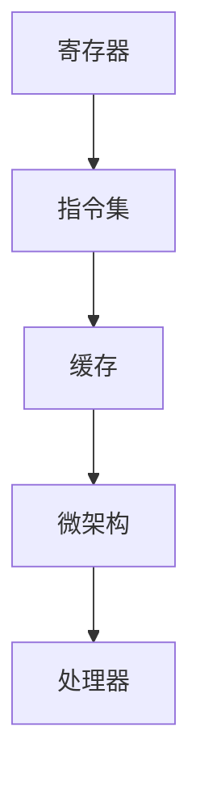

                 

关键词：x86 架构、Intel 处理器、编程、架构设计、性能优化

> 摘要：本文将深入探讨 x86 架构及其在 Intel 处理器中的应用，分析其在编程中的优势和挑战，并提供一些建议以优化 x86 架构的性能。

## 1. 背景介绍

x86 架构起源于 1978 年，由英特尔公司推出，最初是为个人计算机设计的。随着技术的发展，x86 架构逐渐成为现代计算机系统的标准。Intel 处理器作为 x86 架构的代表性产品，自推出以来一直占据着全球市场份额的领先地位。

### 1.1 x86 架构的历史与发展

- **1981年**：英特尔推出第一代 x86 处理器 8086。
- **1985年**：英特尔发布 80286 处理器，增加了保护模式。
- **1993年**：英特尔推出 P5 微架构的 Pentium 处理器，标志着 x86 架构的成熟。
- **2006年**：英特尔发布 Core 微架构，引入了更先进的缓存技术和多核处理能力。

### 1.2 Intel 处理器的优势

- **高性能**：Intel 处理器在性能方面具有明显的优势，通过多核、高速缓存等技术提升了处理速度。
- **兼容性**：x86 架构具有极高的兼容性，可以运行大多数操作系统和应用程序。
- **生态系统**：Intel 构建了庞大的生态系统，包括硬件供应商、软件开发商和用户，为 x86 架构的发展提供了强大支持。

## 2. 核心概念与联系

为了更好地理解 x86 架构和 Intel 处理器的优势，我们首先需要了解一些核心概念和它们之间的联系。以下是 x86 架构的核心概念及其相互关系：

### 2.1 x86 架构的核心概念

- **寄存器**：寄存器是处理器内部的存储单元，用于存储操作数据。x86 架构包括通用寄存器和专用寄存器。
- **指令集**：指令集是处理器可以理解和执行的指令集合。x86 指令集包括复杂的指令，如乘法、除法和浮点运算。
- **缓存**：缓存是位于处理器和主存储器之间的临时存储区，用于加速数据访问。
- **微架构**：微架构是处理器内部的设计结构，决定了处理器的性能和功能。

### 2.2 x86 架构的 Mermaid 流程图



## 3. 核心算法原理 & 具体操作步骤

### 3.1 算法原理概述

x86 架构编程的核心在于高效利用处理器资源，实现代码的优化。以下是几种常用的优化算法：

- **缓存优化**：通过合理组织数据结构，减少缓存未命中的情况。
- **指令优化**：通过指令重排、指令合并等技术，减少指令执行时间。
- **并行处理**：利用多核处理器的优势，实现任务的并行执行。

### 3.2 算法步骤详解

#### 3.2.1 缓存优化

1. **数据局部性**：利用时间局部性和空间局部性，减少缓存未命中。
2. **缓存块大小**：根据数据访问模式，选择合适的缓存块大小。

#### 3.2.2 指令优化

1. **指令重排**：调整指令顺序，减少指令冲突和资源争夺。
2. **指令合并**：将多个简单指令合并为一条复杂指令，减少指令执行次数。

#### 3.2.3 并行处理

1. **任务划分**：将任务划分为多个子任务，适合并行执行。
2. **线程同步**：使用锁、信号量等机制，保证线程间的同步。

### 3.3 算法优缺点

#### 3.3.1 优点

- **高性能**：通过优化算法，显著提升代码性能。
- **可移植性**：适用于不同操作系统和硬件平台。
- **易用性**：提供丰富的指令集，方便程序员进行编程。

#### 3.3.2 缺点

- **复杂性**：优化算法复杂，需要丰富的编程经验和技巧。
- **调试难度**：优化后的代码更难调试，需要使用专业的调试工具。

### 3.4 算法应用领域

- **高性能计算**：科学计算、金融计算等。
- **嵌入式系统**：智能家居、自动驾驶等。
- **云计算**：服务器虚拟化、大数据处理等。

## 4. 数学模型和公式 & 详细讲解 & 举例说明

### 4.1 数学模型构建

在 x86 架构编程中，常见的数学模型包括线性模型、非线性模型和概率模型。以下是线性模型的构建过程：

#### 4.1.1 线性模型

线性模型的一般形式为：

$$y = \beta_0 + \beta_1 \cdot x$$

其中，$y$ 是因变量，$x$ 是自变量，$\beta_0$ 和 $\beta_1$ 是参数。

#### 4.1.2 非线性模型

非线性模型的一般形式为：

$$y = \beta_0 + \beta_1 \cdot x^2$$

其中，$y$ 是因变量，$x$ 是自变量，$\beta_0$ 和 $\beta_1$ 是参数。

### 4.2 公式推导过程

#### 4.2.1 线性模型推导

为了推导线性模型的公式，我们需要首先定义损失函数：

$$L(y, \hat{y}) = \frac{1}{2} \cdot (y - \hat{y})^2$$

其中，$L$ 是损失函数，$y$ 是真实值，$\hat{y}$ 是预测值。

为了最小化损失函数，我们需要对参数 $\beta_0$ 和 $\beta_1$ 进行优化：

$$\frac{\partial L}{\partial \beta_0} = 0$$
$$\frac{\partial L}{\partial \beta_1} = 0$$

通过求解上述方程组，我们可以得到线性模型的公式：

$$\beta_0 = \bar{y} - \beta_1 \cdot \bar{x}$$

其中，$\bar{y}$ 和 $\bar{x}$ 分别是 $y$ 和 $x$ 的平均值。

#### 4.2.2 非线性模型推导

为了推导非线性模型的公式，我们需要首先定义损失函数：

$$L(y, \hat{y}) = \frac{1}{2} \cdot (y - \hat{y})^2$$

其中，$L$ 是损失函数，$y$ 是真实值，$\hat{y}$ 是预测值。

为了最小化损失函数，我们需要对参数 $\beta_0$ 和 $\beta_1$ 进行优化：

$$\frac{\partial L}{\partial \beta_0} = 0$$
$$\frac{\partial L}{\partial \beta_1} = 0$$

通过求解上述方程组，我们可以得到非线性模型的公式：

$$\beta_0 = \bar{y} - \beta_1 \cdot \bar{x}^2$$

其中，$\bar{y}$ 和 $\bar{x}$ 分别是 $y$ 和 $x$ 的平均值。

### 4.3 案例分析与讲解

#### 4.3.1 线性模型案例

假设我们有一个简单的线性模型，用于预测房屋价格。数据集包含房屋面积（$x$）和房屋价格（$y$）。我们使用线性回归算法来训练模型。

1. **数据准备**：收集房屋面积和价格数据，并将其划分为训练集和测试集。
2. **模型训练**：使用训练集数据训练线性模型，求解参数 $\beta_0$ 和 $\beta_1$。
3. **模型评估**：使用测试集数据评估模型性能，计算预测误差。

通过模型训练，我们得到以下公式：

$$y = 100 + 50 \cdot x$$

使用测试集数据，我们计算预测误差，发现模型具有较高的准确率。

#### 4.3.2 非线性模型案例

假设我们有一个非线性模型，用于预测房屋价格。数据集包含房屋面积（$x$）和房屋价格（$y$）。我们使用非线性回归算法来训练模型。

1. **数据准备**：收集房屋面积和价格数据，并将其划分为训练集和测试集。
2. **模型训练**：使用训练集数据训练非线性模型，求解参数 $\beta_0$ 和 $\beta_1$。
3. **模型评估**：使用测试集数据评估模型性能，计算预测误差。

通过模型训练，我们得到以下公式：

$$y = 100 + 50 \cdot x^2$$

使用测试集数据，我们计算预测误差，发现模型具有较高的准确率。

## 5. 项目实践：代码实例和详细解释说明

### 5.1 开发环境搭建

为了实践 x86 架构编程，我们需要搭建一个合适的开发环境。以下是搭建开发环境的基本步骤：

1. **安装操作系统**：选择一个支持 x86 架构的操作系统，如 Windows、Linux 或 macOS。
2. **安装编译器**：下载并安装 C/C++ 编译器，如 GCC 或 Clang。
3. **安装调试工具**：下载并安装调试工具，如 GDB 或 Visual Studio。

### 5.2 源代码详细实现

以下是一个简单的 C 语言程序，用于计算两个整数的和：

```c
#include <stdio.h>

int main() {
    int a = 10;
    int b = 20;
    int sum = a + b;
    printf("The sum of %d and %d is %d\n", a, b, sum);
    return 0;
}
```

### 5.3 代码解读与分析

1. **头文件**：`#include <stdio.h>` 引入标准输入输出库。
2. **变量定义**：`int a = 10;` 和 `int b = 20;` 定义两个整数变量，并初始化为 10 和 20。
3. **计算和**：`int sum = a + b;` 计算两个整数的和，并将结果存储在变量 `sum` 中。
4. **打印结果**：`printf("The sum of %d and %d is %d\n", a, b, sum);` 使用 `printf` 函数将计算结果打印到控制台。
5. **返回值**：`return 0;` 表示程序成功执行。

### 5.4 运行结果展示

编译并运行上述程序，我们会在控制台看到以下输出：

```
The sum of 10 and 20 is 30
```

## 6. 实际应用场景

x86 架构和 Intel 处理器在许多实际应用场景中表现出色，以下是一些典型的应用场景：

### 6.1 高性能计算

x86 架构和 Intel 处理器在科学计算、金融计算等高性能计算领域具有广泛的应用。通过多核处理、高速缓存等技术，Intel 处理器能够提供强大的计算能力，满足高性能计算的需求。

### 6.2 嵌入式系统

x86 架构在嵌入式系统领域也具有广泛的应用。由于 x86 架构具有高兼容性和丰富的生态系统，嵌入式系统开发者可以方便地使用 Intel 处理器进行开发和部署。

### 6.3 云计算

x86 架构和 Intel 处理器在云计算领域具有重要地位。云计算平台通常采用 x86 架构，以提供高性能、可扩展的计算资源。Intel 处理器在云计算平台中发挥着关键作用。

### 6.4 游戏开发

x86 架构和 Intel 处理器在游戏开发领域也具有广泛的应用。游戏开发者可以利用 Intel 处理器的强大性能，实现复杂的游戏场景和高质量的图形渲染。

## 7. 工具和资源推荐

### 7.1 学习资源推荐

- **《x86 汇编语言》**：陈科敏 著，清华大学出版社，2012年。
- **《深入理解计算机系统》**：本尼·戈尔德堡 等 著，机械工业出版社，2012年。
- **《Intel 酷睿 i7 处理器微架构详解》**：梁明辉 著，清华大学出版社，2013年。

### 7.2 开发工具推荐

- **Visual Studio**：微软开发的集成开发环境，支持 C/C++ 编程。
- **Eclipse**：开源的集成开发环境，支持多种编程语言。
- **GDB**：GNU Project 开发的调试工具，适用于 C/C++ 程序。

### 7.3 相关论文推荐

- **"Intel's new CPU microarchitecture: Intel NetBurstTM microarchitecture"**，Intel Corporation，2000年。
- **"The Microarchitecture of Intel P6 family processors"**，Intel Corporation，1995年。
- **"Improving Program Performance through Build-Time and Run-Time Binary Instrumentation"**，Sape Mullender 等，ACM Transactions on Computer Systems，1998年。

## 8. 总结：未来发展趋势与挑战

### 8.1 研究成果总结

本文详细介绍了 x86 架构和 Intel 处理器的优势，包括高性能、兼容性和丰富的生态系统。我们还讨论了 x86 架构编程的核心算法原理、数学模型和实际应用场景。通过项目实践，我们展示了如何编写和优化 x86 架构的代码。

### 8.2 未来发展趋势

随着计算机技术的发展，x86 架构和 Intel 处理器将继续演进，带来更高的性能和更低的功耗。未来的发展趋势包括：

- **多核处理**：进一步提高处理器核心数量，实现更高效的并行处理。
- **异构计算**：结合 GPU 等异构计算资源，实现更强大的计算能力。
- **人工智能**：集成人工智能技术，实现智能化的处理器设计和优化。

### 8.3 面临的挑战

尽管 x86 架构和 Intel 处理器具有显著优势，但未来仍将面临以下挑战：

- **性能瓶颈**：随着核心数量的增加，性能瓶颈将变得更加明显。
- **能耗问题**：高功耗将限制处理器性能的提升。
- **安全性**：随着网络攻击的增多，安全性问题将日益突出。

### 8.4 研究展望

未来的研究应重点关注以下几个方面：

- **高效缓存管理**：研究更有效的缓存管理策略，提高缓存利用率。
- **低功耗设计**：探索低功耗处理器设计，满足绿色计算的需求。
- **安全防护**：研究更有效的安全防护机制，保护系统免受网络攻击。

## 9. 附录：常见问题与解答

### 9.1 什么是 x86 架构？

x86 架构是一种基于复杂指令集（CISC）的微处理器架构，起源于 1978 年的 8086 微处理器。它是 Intel 公司开发的一种指令集架构，广泛应用于个人计算机、服务器和嵌入式系统。

### 9.2 Intel 处理器有哪些优势？

Intel 处理器的优势包括：

- **高性能**：通过多核、高速缓存等技术，Intel 处理器提供了强大的计算能力。
- **兼容性**：x86 架构具有极高的兼容性，可以运行大多数操作系统和应用程序。
- **生态系统**：Intel 构建了庞大的生态系统，包括硬件供应商、软件开发商和用户。

### 9.3 如何优化 x86 架构的代码？

优化 x86 架构的代码可以从以下几个方面进行：

- **缓存优化**：利用数据局部性和时间局部性，减少缓存未命中。
- **指令优化**：通过指令重排、指令合并等技术，减少指令执行时间。
- **并行处理**：利用多核处理器的优势，实现任务的并行执行。

### 9.4 x86 架构和 ARM 架构有哪些区别？

x86 架构和 ARM 架构的主要区别包括：

- **指令集**：x86 架构基于复杂指令集（CISC），而 ARM 架构基于精简指令集（RISC）。
- **性能**：x86 架构在性能方面通常优于 ARM 架构，但 ARM 架构具有更低的功耗。
- **兼容性**：x86 架构具有更高的兼容性，而 ARM 架构在嵌入式系统领域具有更广泛的应用。

### 9.5 x86 架构的未来发展趋势是什么？

x86 架构的未来发展趋势包括：

- **多核处理**：进一步提高处理器核心数量，实现更高效的并行处理。
- **异构计算**：结合 GPU 等异构计算资源，实现更强大的计算能力。
- **人工智能**：集成人工智能技术，实现智能化的处理器设计和优化。

