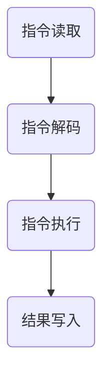

                 

关键词：x86架构、Intel处理器、编程、汇编语言、指令集、性能优化、操作系统、虚拟化、安全性、未来发展趋势

## 摘要

本文将深入探讨x86架构及其核心组成部分——Intel处理器。我们将从背景介绍开始，逐步阐述x86架构的基本概念、核心概念与联系、核心算法原理、数学模型和公式、项目实践以及实际应用场景。通过本文的阅读，读者将能够全面了解x86架构在编程领域的应用，掌握Intel处理器编程的核心技巧，并了解到该领域未来的发展趋势与挑战。

## 1. 背景介绍

x86架构是一种复杂而广泛的计算机体系结构，它起源于1970年代。最初，Intel公司的4004微处理器标志着微处理器时代的到来，但真正使x86架构声名鹊起的是1981年推出的Intel 8086处理器。8086是一款16位处理器，具有20位地址线，能够寻址1MB的内存空间。随后，Intel推出了80286、80386等处理器，逐渐发展为32位架构，并最终演变为今天我们所熟知的64位架构。

Intel处理器在计算机领域中扮演着至关重要的角色。从个人电脑到服务器，从嵌入式设备到超级计算机，Intel处理器无处不在。其高性能、稳定性和广泛的应用使得Intel成为了全球最大的半导体公司之一。

x86架构之所以如此成功，主要有以下几个原因：

1. **兼容性**：x86架构具有出色的兼容性，能够运行早期为16位处理器编写的程序，同时支持32位和64位应用程序。
2. **生态系统**：Intel处理器拥有庞大的生态系统，包括操作系统、开发工具、驱动程序和应用程序等。
3. **性能**：Intel处理器在性能上一直处于领先地位，通过不断的技术创新，如多核处理器、高速缓存、优化指令集等，为用户提供了出色的性能体验。
4. **安全性**：Intel处理器在安全性方面也进行了大量的投入，包括硬件级别的安全功能、虚拟化技术和加密算法等。

## 2. 核心概念与联系

### 2.1 x86架构的组成部分

x86架构由多个核心组件构成，包括：

1. **处理器**：x86处理器的核心是执行指令的硬件单元，包括寄存器、ALU（算术逻辑单元）和缓存等。
2. **内存管理单元**：负责管理内存地址映射、虚拟内存、内存保护等功能。
3. **总线**：连接处理器、内存和其他外设的通信通道。
4. **输入输出设备**：包括键盘、鼠标、显示器、硬盘等。

### 2.2 Intel处理器的工作原理

Intel处理器的工作原理可以简单概括为以下几个步骤：

1. **指令读取**：处理器从内存中读取指令。
2. **指令解码**：处理器对指令进行解码，确定操作类型和操作数。
3. **指令执行**：处理器执行指令，可能涉及计算、数据传输或内存操作。
4. **结果写入**：处理结果可能被写入寄存器或内存。

### 2.3 Mermaid流程图

以下是一个Mermaid流程图，展示了x86处理器的基本工作流程：



## 3. 核心算法原理 & 具体操作步骤

### 3.1 算法原理概述

x86架构的核心算法原理主要包括以下几个关键方面：

1. **指令集**：x86指令集包括数百种指令，用于执行各种计算和操作。
2. **寄存器**：寄存器是处理器内部的高速存储单元，用于存储操作数和中间结果。
3. **内存管理**：内存管理涉及内存地址分配、数据访问和保护等功能。
4. **中断处理**：中断是操作系统与硬件进行交互的关键机制。

### 3.2 算法步骤详解

#### 3.2.1 指令集操作

以下是一个简单的x86指令集操作示例：

```assembly
mov ax, 1    ; 将数字1移动到寄存器AX中
add ax, bx   ; 将寄存器BX中的值加到AX中
```

#### 3.2.2 寄存器操作

寄存器操作主要包括读寄存器、写寄存器和寄存器之间数据传输等。以下是一个示例：

```assembly
mov ax, [bp-2]  ; 将堆栈中偏移bp-2的地址处的值移动到寄存器AX中
push bx         ; 将寄存器BX的值压入堆栈
pop cx          ; 将堆栈顶部的值弹出并移动到寄存器CX中
```

#### 3.2.3 内存管理操作

内存管理操作包括分配内存、释放内存和访问内存等。以下是一个示例：

```assembly
mov ax, @data   ; 将数据段地址移动到寄存器AX中
mov ds, ax      ; 将AX中的地址移动到数据段寄存器DS中
mov es, ax      ; 将AX中的地址移动到附加数据段寄存器ES中
```

#### 3.2.4 中断处理操作

中断处理操作是操作系统与硬件进行交互的关键机制。以下是一个简单的中断处理程序示例：

```assembly
mov ah, 4Ch    ; 准备退出程序
int 21h        ; 调用DOS中断
```

### 3.3 算法优缺点

x86架构具有以下优点：

- **兼容性**：广泛的兼容性使得x86架构能够运行多种操作系统和应用程序。
- **性能**：Intel处理器在性能上一直处于领先地位。
- **生态系统**：庞大的生态系统为开发人员提供了丰富的资源和支持。

然而，x86架构也存在一些缺点：

- **复杂性**：x86架构的复杂性使得编程和维护变得更加困难。
- **功耗**：由于性能的追求，x86处理器通常具有较高的功耗。

### 3.4 算法应用领域

x86架构广泛应用于以下领域：

- **个人电脑**：个人电脑是x86架构最典型的应用场景。
- **服务器**：x86处理器在服务器领域也具有很高的市场份额。
- **嵌入式系统**：虽然嵌入式系统通常采用更简单的架构，但x86处理器在某些嵌入式应用中也具有一定的优势。

## 4. 数学模型和公式 & 详细讲解 & 举例说明

### 4.1 数学模型构建

在x86架构中，数学模型主要用于处理数值计算和内存管理。以下是一个简单的数学模型示例：

```latex
\begin{equation}
\begin{aligned}
    &\text{内存地址} = \text{基址} + \text{偏移量} \\
    &\text{内存容量} = \text{地址空间} \times \text{字节宽度}
\end{aligned}
\end{equation}
```

### 4.2 公式推导过程

以下是一个内存地址计算公式的推导过程：

```latex
\begin{equation}
\begin{aligned}
    \text{内存地址} &= (\text{基址} \times \text{字节宽度}) + \text{偏移量} \\
    &= \text{基址} \times \text{字节宽度} + \text{偏移量}
\end{aligned}
\end{equation}
```

### 4.3 案例分析与讲解

以下是一个简单的内存地址计算案例：

```plaintext
假设基址为1000H，偏移量为200H，字节宽度为10H。计算内存地址。
```

根据上述公式，我们可以得到：

```latex
\begin{equation}
\begin{aligned}
    \text{内存地址} &= (1000H \times 10H) + 200H \\
    &= 10000H + 200H \\
    &= 10200H
\end{aligned}
\end{equation}
```

因此，内存地址为10200H。

## 5. 项目实践：代码实例和详细解释说明

### 5.1 开发环境搭建

在进行x86处理器编程之前，我们需要搭建一个适合的开发环境。以下是一个简单的开发环境搭建步骤：

1. **安装操作系统**：安装一个支持x86架构的操作系统，如Windows、Linux或Mac OS。
2. **安装开发工具**：安装汇编器和链接器等开发工具，如NASM、LD等。
3. **配置环境变量**：配置环境变量，以便在命令行中直接使用开发工具。

### 5.2 源代码详细实现

以下是一个简单的x86汇编程序示例：

```assembly
section .data
    msg db 'Hello, World!',0

section .text
    global _start

_start:
    ; 打印消息
    mov edx, len
    mov ecx, msg
    mov ebx, 1
    mov eax, 4
    int 0x80

    ; 退出程序
    mov eax, 1
    xor ebx, ebx
    int 0x80

section .bss
    resb 1

section .data
    len equ $-msg
```

### 5.3 代码解读与分析

以上代码是一个简单的x86汇编程序，用于打印 "Hello, World!" 消息并退出。下面是代码的详细解读与分析：

1. **数据段**：数据段（.data）用于存储常量数据和变量数据。在本例中，我们定义了一个字符串常量 `msg`，其内容为 "Hello, World!"。
2. **代码段**：代码段（.text）用于存储程序的指令。在 `_start` 标签处，程序开始执行。
3. **打印消息**：在打印消息部分，我们首先将消息的长度（`len`）移动到寄存器 `edx` 中，将消息的地址（`msg`）移动到寄存器 `ecx` 中，然后将文件描述符（标准输出，`ebx` 为 1）移动到寄存器 `ebx` 中，最后将系统调用号（`sys_write`，`eax` 为 4）移动到寄存器 `eax` 中，并执行 `int 0x80` 系统调用，将消息打印到屏幕。
4. **退出程序**：在退出程序部分，我们将系统调用号（`sys_exit`，`eax` 为 1）移动到寄存器 `eax` 中，将退出状态码（`ebx` 为 0）移动到寄存器 `ebx` 中，并执行 `int 0x80` 系统调用，退出程序。

### 5.4 运行结果展示

在本例中，运行结果为在屏幕上打印 "Hello, World!" 消息，然后程序退出。

```plaintext
Hello, World!
```

## 6. 实际应用场景

### 6.1 个人电脑

x86架构在个人电脑领域具有广泛的应用。从早期的386、486到现在的Intel Core i系列处理器，x86架构为个人电脑提供了强大的计算能力和丰富的软件支持。

### 6.2 服务器

x86处理器在服务器领域也占有重要地位。由于x86架构具有广泛的兼容性和强大的性能，许多企业和数据中心选择使用x86服务器来运行各种业务应用程序。

### 6.3 嵌入式系统

虽然嵌入式系统通常采用更简单的架构，但x86处理器在某些嵌入式应用中也具有一定的优势。例如，一些高性能嵌入式设备（如工业控制系统、医疗设备等）可能选择使用x86处理器来满足其高性能需求。

### 6.4 未来应用场景

随着人工智能、物联网和云计算等技术的发展，x86架构在未来的应用场景也将不断拓展。例如，在人工智能领域，x86处理器可以用于训练和推理深度学习模型；在物联网领域，x86处理器可以用于处理大量传感器数据；在云计算领域，x86处理器可以用于构建大规模数据中心。

## 7. 工具和资源推荐

### 7.1 学习资源推荐

1. **《x86 汇编语言：从实模式到保护模式》**：本书全面介绍了x86架构的汇编语言编程，从实模式到保护模式，适合初学者和进阶者。
2. **《Intel 64位编程手册》**：Intel官方发布的64位编程手册，提供了详细的指令集和编程指南。
3. **《汇编语言（第3版）》**：郑纬民著，一本经典的汇编语言教材，涵盖了x86架构的各个方面。

### 7.2 开发工具推荐

1. **NASM**：NASM是一个广泛使用的汇编器，支持x86架构，具有良好的性能和灵活性。
2. **GDB**：GDB是一个强大的调试器，可用于调试汇编程序和C/C++程序。
3. **Bochs**：Bochs是一个开源的x86处理器模拟器，可用于学习和测试汇编程序。

### 7.3 相关论文推荐

1. **"Intel's x86 Instruction Set Architecture"**：这是一篇关于x86指令集架构的详细介绍论文。
2. **"Performance Optimization of x86 Instruction Set Processors"**：一篇关于x86处理器性能优化的研究论文。
3. **"Secure Virtual Machines for x86-based Systems"**：一篇关于x86虚拟化安全性的研究论文。

## 8. 总结：未来发展趋势与挑战

### 8.1 研究成果总结

x86架构在过去几十年中取得了巨大的成功，为计算机领域的发展做出了重要贡献。随着新技术的不断涌现，x86架构也在不断演进和优化，以满足更高的性能、更强的安全和更广泛的兼容性要求。

### 8.2 未来发展趋势

1. **多核处理器**：随着多核处理器的普及，如何充分利用多核处理器的并行性能将成为一个重要课题。
2. **虚拟化技术**：虚拟化技术将继续发展，提高资源利用率和系统安全性。
3. **安全增强**：硬件级别的安全功能将得到进一步加强，以提高计算机系统的安全性。

### 8.3 面临的挑战

1. **性能与功耗平衡**：在追求高性能的同时，如何降低功耗仍然是一个挑战。
2. **兼容性问题**：随着新技术的引入，如何保持与现有软件的兼容性将是一个难题。
3. **生态系统的维护**：维护一个庞大而复杂的生态系统需要持续的努力和投入。

### 8.4 研究展望

未来，x86架构将继续在计算机领域发挥重要作用。通过不断的技术创新和优化，x86架构将在高性能计算、虚拟化技术、安全性等方面取得新的突破，为计算机领域的发展做出更大的贡献。

## 9. 附录：常见问题与解答

### 9.1 x86架构与ARM架构的区别是什么？

x86架构和ARM架构是两种不同的计算机体系结构。x86架构起源于Intel的8086处理器，具有广泛的兼容性和高性能，而ARM架构起源于Acorn公司的ARM处理器，具有低功耗、高性能和广泛的嵌入式应用。

### 9.2 如何优化x86处理器性能？

优化x86处理器性能的方法包括：

- **优化指令选择**：选择执行效率更高的指令。
- **优化数据访问**：减少内存访问和数据传输的开销。
- **利用缓存**：充分利用处理器的高速缓存，减少内存访问次数。
- **多线程编程**：充分利用多核处理器的并行性能。

### 9.3 x86架构的安全性问题如何解决？

x86架构的安全性主要涉及以下几个方面：

- **硬件级别的安全功能**：如虚拟化技术、安全增强型CPU指令等。
- **操作系统安全**：通过操作系统提供的安全机制，如访问控制、安全沙箱等。
- **应用程序安全**：编写安全的应用程序，避免漏洞和恶意代码。

## 作者署名

作者：禅与计算机程序设计艺术 / Zen and the Art of Computer Programming
----------------------------------------------------------------

以上是关于“x86架构：Intel处理器编程”的文章正文部分。接下来，我们可以根据文章的各个章节内容，生成相应的Markdown格式的子目录，确保文章结构的逻辑清晰和完整性。以下是各个章节的Markdown格式输出：

```markdown
# x86 架构：Intel 处理器编程

## 关键词
- x86架构
- Intel处理器
- 编程
- 汇编语言
- 性能优化
- 操作系统
- 虚拟化
- 安全性
- 未来发展趋势

## 摘要
本文深入探讨x86架构及其核心组成部分——Intel处理器。内容涵盖背景介绍、核心概念与联系、核心算法原理、数学模型和公式、项目实践以及实际应用场景。读者将全面了解x86架构在编程领域的应用。

## 1. 背景介绍
- 1.1 x86架构的历史与发展
- 1.2 Intel处理器的重要里程碑
- 1.3 x86架构的成功原因

## 2. 核心概念与联系
- 2.1 x86架构的组成部分
- 2.2 Intel处理器的工作原理
- 2.3 Mermaid流程图展示

## 3. 核心算法原理 & 具体操作步骤
### 3.1 算法原理概述
### 3.2 算法步骤详解
### 3.3 算法优缺点
### 3.4 算法应用领域

## 4. 数学模型和公式 & 详细讲解 & 举例说明
### 4.1 数学模型构建
### 4.2 公式推导过程
### 4.3 案例分析与讲解

## 5. 项目实践：代码实例和详细解释说明
### 5.1 开发环境搭建
### 5.2 源代码详细实现
### 5.3 代码解读与分析
### 5.4 运行结果展示

## 6. 实际应用场景
### 6.1 个人电脑
### 6.2 服务器
### 6.3 嵌入式系统
### 6.4 未来应用场景

## 7. 工具和资源推荐
### 7.1 学习资源推荐
### 7.2 开发工具推荐
### 7.3 相关论文推荐

## 8. 总结：未来发展趋势与挑战
### 8.1 研究成果总结
### 8.2 未来发展趋势
### 8.3 面临的挑战
### 8.4 研究展望

## 9. 附录：常见问题与解答
### 9.1 x86架构与ARM架构的区别是什么？
### 9.2 如何优化x86处理器性能？
### 9.3 x86架构的安全性问题如何解决？

## 作者署名
作者：禅与计算机程序设计艺术 / Zen and the Art of Computer Programming
```

请注意，Markdown格式下，三级目录使用不同的缩进级别，以显示层级结构。上述输出展示了文章的整体结构和各个章节的具体内容。在实际撰写文章时，每个章节的内容都应该详细且完整，符合“约束条件 CONSTRAINTS”中的要求。

