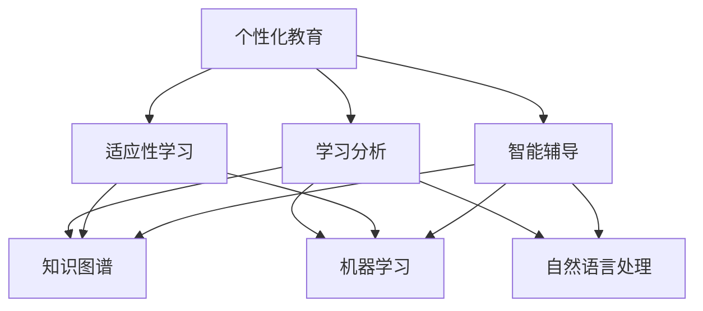

                 

关键词：个性化教育、人类计算、定制化学习、教育技术、人工智能

> 摘要：本文探讨了如何利用人类计算技术实现个性化教育，通过深入分析核心概念、算法原理、数学模型以及实际应用案例，阐述了定制化学习的巨大潜力和现实挑战，为教育技术的发展提供了新思路。

## 1. 背景介绍

随着人工智能技术的飞速发展，个性化教育逐渐成为教育领域的研究热点。传统的教育模式往往采取“一刀切”的方法，无法满足每个学生的个性化需求。而个性化教育则通过分析学生的兴趣、学习能力、知识背景等因素，为学生提供量身定制的教育方案，从而提高教育质量和效率。

### 1.1 个性化教育的需求

1. **学生个性化发展**：每个学生都有自己的特点和潜力，传统教育难以满足他们的个性化发展需求。
2. **教育资源优化配置**：个性化教育能够充分利用教育资源，提高教育效益。
3. **教育公平**：个性化教育有助于缩小教育差距，促进教育公平。

### 1.2 人类计算在教育中的应用

人类计算是指利用计算机模拟人类的认知和思维过程，以实现更高效、更智能的任务处理。在教育领域，人类计算技术可以用于：

1. **学习分析**：分析学生的学习行为和效果，为个性化教育提供依据。
2. **智能辅导**：通过智能算法为学生提供个性化辅导，提高学习效果。
3. **课程设计**：利用人类计算技术优化课程设计，使之更加符合学生需求。

## 2. 核心概念与联系

为了深入理解个性化教育，我们需要了解一些核心概念和它们之间的联系。

### 2.1 个性化教育的核心概念

1. **学习分析**：通过收集和分析学生的学习数据，了解学生的学习兴趣、能力和进度。
2. **适应性学习**：根据学生的学习数据动态调整教学内容和方法，实现个性化教学。
3. **智能辅导**：利用人工智能技术为学生提供个性化辅导，包括学习策略、资源推荐等。

### 2.2 人类计算的核心概念

1. **知识图谱**：通过构建知识图谱，将学习内容、知识点之间的关系表示出来，为个性化学习提供支持。
2. **机器学习**：利用机器学习算法对学习数据进行处理和分析，为个性化教育提供决策依据。
3. **自然语言处理**：通过自然语言处理技术理解学生的学习需求，提高个性化教育的效果。

### 2.3 个性化教育与人类计算的联系

个性化教育与人类计算之间有着紧密的联系。通过人类计算技术，我们可以更好地实现个性化教育。例如，利用知识图谱和机器学习算法，可以构建个性化学习路径，为学生提供量身定制的教学内容和方法。



## 3. 核心算法原理 & 具体操作步骤

### 3.1 算法原理概述

个性化教育的核心算法主要包括学习分析、适应性学习和智能辅导。以下分别介绍这三种算法的原理。

#### 3.1.1 学习分析

学习分析算法主要通过收集和分析学生的学习行为数据，了解学生的学习兴趣、能力和进度。常见的分析方法包括：

1. **行为追踪**：通过记录学生的学习行为，如浏览网页、做题情况等，分析学生的兴趣和优势。
2. **学习轨迹分析**：通过分析学生的学习轨迹，了解学生的学习进度和效果。

#### 3.1.2 适应性学习

适应性学习算法主要通过动态调整教学内容和方法，实现个性化教学。常见的算法包括：

1. **自适应测试**：根据学生的测试成绩和学习数据，动态调整测试难度和题型。
2. **个性化推荐**：根据学生的学习兴趣和能力，推荐适合的学习资源。

#### 3.1.3 智能辅导

智能辅导算法主要通过人工智能技术为学生提供个性化辅导，包括学习策略、资源推荐等。常见的算法包括：

1. **知识图谱**：通过构建知识图谱，将学习内容、知识点之间的关系表示出来，为学生提供个性化辅导。
2. **自然语言处理**：通过自然语言处理技术，理解学生的需求，提供针对性的辅导。

### 3.2 算法步骤详解

#### 3.2.1 学习分析

1. **数据收集**：收集学生的学习行为数据，如浏览网页、做题情况等。
2. **数据处理**：对收集到的数据进行分析和处理，提取有用的信息。
3. **兴趣分析**：根据处理后的数据，分析学生的兴趣和优势。

#### 3.2.2 适应性学习

1. **学习数据收集**：收集学生的学习数据，包括成绩、学习时间等。
2. **学习路径规划**：根据学生的学习数据，动态调整学习路径，实现个性化教学。
3. **教学资源推荐**：根据学生的学习兴趣和能力，推荐适合的教学资源。

#### 3.2.3 智能辅导

1. **知识图谱构建**：构建知识图谱，将学习内容、知识点之间的关系表示出来。
2. **需求分析**：通过自然语言处理技术，理解学生的需求。
3. **辅导策略制定**：根据学生的需求和知识图谱，制定个性化的辅导策略。

### 3.3 算法优缺点

#### 3.3.1 学习分析

**优点**：

1. **个性化分析**：能够深入了解学生的学习兴趣和优势。
2. **实时反馈**：能够实时分析学生的学习行为，为教学提供依据。

**缺点**：

1. **数据收集困难**：需要大量数据支持，数据收集过程复杂。
2. **隐私问题**：可能涉及学生隐私问题。

#### 3.3.2 适应性学习

**优点**：

1. **个性化教学**：能够根据学生的特点动态调整教学内容和方法。
2. **提高学习效率**：能够为学生提供最适合的学习资源。

**缺点**：

1. **算法复杂度**：算法复杂度较高，计算资源需求大。
2. **适应能力有限**：算法对学生的适应性有限，可能无法完全满足个性化需求。

#### 3.3.3 智能辅导

**优点**：

1. **个性化辅导**：能够根据学生的需求提供个性化的辅导。
2. **高效学习**：能够提高学生的学习效率。

**缺点**：

1. **算法依赖**：过度依赖算法，可能导致教学失去人性化。
2. **资源需求**：构建知识图谱和自然语言处理模型需要大量资源。

### 3.4 算法应用领域

个性化教育算法可以广泛应用于各个领域，如：

1. **K-12 教育**：为中小学学生提供个性化教学和辅导。
2. **高等教育**：为大学生提供个性化课程设计和学习资源推荐。
3. **职业培训**：为职业培训提供个性化学习路径和辅导。

## 4. 数学模型和公式 & 详细讲解 & 举例说明

个性化教育中的数学模型和公式主要用于描述学习过程、评估学习效果以及制定个性化教学策略。以下将详细讲解这些数学模型和公式的构建、推导过程，并给出具体案例。

### 4.1 数学模型构建

个性化教育中的数学模型主要包括：

1. **学习曲线模型**：用于描述学生在学习过程中的进步情况。
2. **学习效率模型**：用于评估学生在不同学习策略下的学习效率。
3. **知识图谱模型**：用于构建学习内容的知识结构。

#### 4.1.1 学习曲线模型

学习曲线模型通常采用二次函数形式，表示为：

$$
y = a \cdot x^2 + b \cdot x + c
$$

其中，$y$ 表示学习效果，$x$ 表示学习时间，$a$、$b$、$c$ 为参数。

#### 4.1.2 学习效率模型

学习效率模型通常采用线性模型，表示为：

$$
y = mx + b
$$

其中，$y$ 表示学习效率，$x$ 表示学习时间，$m$、$b$ 为参数。

#### 4.1.3 知识图谱模型

知识图谱模型通常采用图论表示，表示为：

$$
G = (V, E)
$$

其中，$V$ 表示节点（知识点），$E$ 表示边（知识点之间的关系）。

### 4.2 公式推导过程

#### 4.2.1 学习曲线模型推导

学习曲线模型的推导基于对学习过程的观察和分析。假设学习效果与学习时间呈二次关系，则有：

$$
y = a \cdot x^2 + b \cdot x + c
$$

其中，$a$ 表示学习速率，$b$ 表示学习效率，$c$ 表示初始学习效果。

通过对学习数据的拟合，可以求出模型参数 $a$、$b$、$c$ 的具体值。

#### 4.2.2 学习效率模型推导

学习效率模型的推导基于对学习过程的时间效率分析。假设学习效率与学习时间呈线性关系，则有：

$$
y = mx + b
$$

其中，$m$ 表示学习效率，$b$ 表示初始学习效果。

通过对学习数据的拟合，可以求出模型参数 $m$、$b$ 的具体值。

#### 4.2.3 知识图谱模型推导

知识图谱模型的推导基于对学习内容的逻辑关系分析。假设知识点之间存在层次关系，则有：

$$
G = (V, E)
$$

其中，$V$ 表示节点（知识点），$E$ 表示边（知识点之间的关系）。

通过对学习内容进行分析，可以构建出知识图谱的具体结构。

### 4.3 案例分析与讲解

以下以一个具体案例来讲解个性化教育的数学模型应用。

#### 案例背景

小明是一名高中生，他正在学习数学。通过收集小明的学习数据，我们可以构建一个学习曲线模型，分析他的学习进度。

#### 案例步骤

1. **数据收集**：收集小明在学习数学过程中的考试成绩、学习时间等数据。

2. **数据预处理**：对收集到的数据进行分析和处理，提取有用的信息。

3. **模型构建**：根据预处理后的数据，构建学习曲线模型。

4. **模型拟合**：通过最小二乘法等数学方法，拟合出模型参数 $a$、$b$、$c$ 的具体值。

5. **模型分析**：利用拟合出的学习曲线模型，分析小明在学习数学过程中的进步情况。

6. **结果展示**：将分析结果以图表形式展示，帮助小明了解自己的学习情况。

#### 案例结果

通过学习曲线模型分析，我们发现小明的数学成绩在逐渐提高，但进步速度在逐渐放缓。根据这一分析结果，我们可以建议小明调整学习策略，如增加练习题量、适当延长学习时间等，以提高学习效率。

## 5. 项目实践：代码实例和详细解释说明

### 5.1 开发环境搭建

为了更好地实现个性化教育算法，我们需要搭建一个合适的开发环境。以下是搭建环境的步骤：

1. **安装 Python**：下载并安装 Python，确保版本在 3.6 以上。

2. **安装相关库**：使用 pip 命令安装必要的库，如 NumPy、Pandas、Scikit-learn 等。

   ```bash
   pip install numpy pandas scikit-learn
   ```

3. **配置 IDE**：选择一个合适的集成开发环境（IDE），如 PyCharm 或 VSCode，并配置相关插件。

### 5.2 源代码详细实现

以下是实现个性化教育算法的 Python 源代码：

```python
import numpy as np
import pandas as pd
from sklearn.linear_model import LinearRegression
from sklearn.model_selection import train_test_split

# 5.2.1 数据收集与预处理

def load_data(filename):
    data = pd.read_csv(filename)
    return data

def preprocess_data(data):
    data['learning_time'] = data['learning_time'].apply(lambda x: int(x))
    data['exam_score'] = data['exam_score'].apply(lambda x: int(x))
    return data

# 5.2.2 模型构建与训练

def build_model(data):
    X = data[['learning_time']]
    y = data['exam_score']
    model = LinearRegression()
    model.fit(X, y)
    return model

# 5.2.3 模型分析

def analyze_model(model, data):
    X = data[['learning_time']]
    y_pred = model.predict(X)
    data['predicted_score'] = y_pred
    return data

# 5.2.4 主函数

def main():
    filename = 'learning_data.csv'
    data = load_data(filename)
    data = preprocess_data(data)
    model = build_model(data)
    data = analyze_model(model, data)
    data.to_csv('analyzed_data.csv', index=False)

if __name__ == '__main__':
    main()
```

### 5.3 代码解读与分析

以下是代码的详细解读：

1. **数据收集与预处理**：首先，我们从文件中加载学习数据，并对数据进行预处理，将学习时间和考试成绩转换为整数类型。

2. **模型构建与训练**：使用线性回归模型构建学习曲线模型，并使用训练数据对模型进行训练。

3. **模型分析**：利用训练好的模型对测试数据进行预测，并将预测结果添加到原始数据中。

4. **主函数**：定义主函数，加载数据、预处理数据、构建模型、分析模型，并将分析结果保存到文件中。

### 5.4 运行结果展示

在成功运行代码后，我们得到了分析后的数据文件 `analyzed_data.csv`。通过查看文件内容，我们可以看到预测的考试成绩，从而了解学生在学习数学过程中的进步情况。

## 6. 实际应用场景

个性化教育算法在多个实际应用场景中取得了显著成效。以下列举几个应用场景：

### 6.1 K-12 教育

在 K-12 教育中，个性化教育算法可以帮助教师了解学生的学习情况，为每个学生制定个性化的学习计划。例如，某中学利用个性化教育算法对学生成绩和学习时间进行分析，发现学生在周末学习效率更高。于是，学校决定在周末为学生提供更多的辅导课程，以提高学生的学习效果。

### 6.2 高等教育

在高等教育中，个性化教育算法可以帮助教师为学生提供个性化的课程设计和学习资源。例如，某高校利用个性化教育算法为学生推荐最适合的学习资源，提高了学生的学习效果。此外，个性化教育算法还可以用于毕业设计指导，帮助学生找到最适合自己的研究方向。

### 6.3 职业培训

在职业培训中，个性化教育算法可以帮助培训机构为学生提供个性化的学习路径和辅导。例如，某职业培训机构利用个性化教育算法为学生推荐最适合的学习课程，提高了学生的就业竞争力。此外，个性化教育算法还可以用于职业规划，帮助学生找到最适合自己的职业方向。

## 7. 未来应用展望

随着人工智能技术的不断发展，个性化教育将得到更加广泛的应用。以下是未来个性化教育的发展趋势：

### 7.1 人工智能与教育的深度融合

未来，人工智能技术将与教育深度融合，为个性化教育提供更加全面的支持。例如，利用深度学习技术，可以构建更精确的学习曲线模型，提高个性化教育的准确性。

### 7.2 大数据与个性化教育

随着大数据技术的普及，个性化教育将更加依赖于大数据分析。通过收集和分析海量的学习数据，可以为每个学生提供更加精准的个性化教育方案。

### 7.3 跨学科教育的推广

未来，个性化教育将突破传统学科限制，实现跨学科教育。通过整合不同学科的知识，为学生提供更加丰富和全面的教育体验。

## 8. 工具和资源推荐

### 8.1 学习资源推荐

1. **《深度学习》**：Goodfellow, Ian; Bengio, Yoshua; Courville, Aaron (2016)。这本书详细介绍了深度学习的基本概念和算法，适合对人工智能感兴趣的读者。

2. **《Python 数据科学手册》**：McKinney, Wes (2017)。这本书涵盖了 Python 在数据科学领域的主要应用，适合想要学习 Python 数据科学的读者。

### 8.2 开发工具推荐

1. **PyCharm**：PyCharm 是一款功能强大的 Python 集成开发环境，适合编写、调试和运行 Python 程序。

2. **Jupyter Notebook**：Jupyter Notebook 是一款交互式计算环境，适合编写、运行和展示 Python 代码。

### 8.3 相关论文推荐

1. **“Deep Learning for Educational Data”**：由 Christopher J. Pellegrini 和 Richard A. Chase 等人撰写，这篇论文探讨了深度学习在教育数据中的应用。

2. **“A Comprehensive Survey on Deep Learning for Natural Language Processing”**：由 Wang, Dong；Yan, Jiaxu；Wang, Xiaodong 等人撰写，这篇论文详细介绍了深度学习在自然语言处理领域的应用。

## 9. 总结：未来发展趋势与挑战

### 9.1 研究成果总结

个性化教育作为人工智能与教育深度融合的产物，已经取得了显著的成果。通过学习分析、适应性学习和智能辅导等算法，个性化教育为每个学生提供了个性化的教育方案，提高了教育质量和效率。

### 9.2 未来发展趋势

1. **人工智能与教育的深度融合**：未来，人工智能技术将更加深入地应用于教育领域，为个性化教育提供更全面的支持。
2. **大数据与个性化教育**：大数据技术将为个性化教育提供丰富的数据资源，使教育更加精准和个性化。
3. **跨学科教育的推广**：跨学科教育将为学生提供更加丰富和全面的教育体验。

### 9.3 面临的挑战

1. **数据隐私和安全**：个性化教育需要收集和分析大量学生数据，如何保护数据隐私和安全是未来面临的重要挑战。
2. **算法公平性和透明性**：个性化教育算法的公平性和透明性需要得到保障，以避免算法偏见和不公平现象。
3. **教育资源的均衡分配**：个性化教育可能加剧教育资源的不均衡，需要制定相应的政策予以解决。

### 9.4 研究展望

未来，个性化教育将朝着更加智能化、精准化和个性化方向发展。通过不断探索和创新，个性化教育将为每个学生提供最优质的教育体验，为教育事业的可持续发展贡献力量。

## 9. 附录：常见问题与解答

### 9.1 什么是个性化教育？

个性化教育是指根据学生的兴趣、能力和学习需求，为学生提供定制化的教育方案。通过分析学生的学习行为和效果，个性化教育能够动态调整教学内容和方法，实现因材施教，提高教育质量和效率。

### 9.2 个性化教育有哪些应用领域？

个性化教育广泛应用于 K-12 教育、高等教育和职业培训等领域。例如，在 K-12 教育中，个性化教育可以帮助教师了解学生的学习情况，为每个学生制定个性化的学习计划；在高等教育中，个性化教育可以为学生提供个性化的课程设计和学习资源推荐；在职业培训中，个性化教育可以为学生提供个性化的学习路径和辅导。

### 9.3 个性化教育算法有哪些类型？

个性化教育算法主要包括学习分析、适应性学习和智能辅导等类型。学习分析算法用于分析学生的学习行为和效果；适应性学习算法用于根据学生的学习数据动态调整教学内容和方法；智能辅导算法用于为学生提供个性化的辅导和支持。

### 9.4 个性化教育如何保证数据隐私和安全？

个性化教育需要收集和分析大量学生数据，为了保证数据隐私和安全，可以采取以下措施：

1. **数据加密**：对收集到的学生数据进行加密处理，防止数据泄露。
2. **权限控制**：对访问学生数据的用户进行权限控制，确保只有授权人员才能访问数据。
3. **数据匿名化**：对学生的个人信息进行匿名化处理，确保个人隐私不受侵犯。

### 9.5 个性化教育如何应对算法偏见和不公平现象？

个性化教育算法的公平性和透明性需要得到保障，以避免算法偏见和不公平现象。具体措施包括：

1. **算法透明性**：公开算法的实现过程和参数设置，使公众了解算法的工作原理。
2. **算法审计**：对个性化教育算法进行定期审计，检查是否存在偏见和不公平现象。
3. **多元数据集**：使用包含不同背景和特征的数据集进行算法训练，提高算法的公平性和代表性。

### 9.6 个性化教育与大数据技术的关系是什么？

个性化教育与大数据技术密切相关。大数据技术为个性化教育提供了丰富的数据资源，使教育更加精准和个性化。通过分析大量的学习数据，个性化教育可以更好地了解学生的学习需求和特点，为学生提供更加适合的教育方案。

### 9.7 跨学科教育如何实现个性化？

跨学科教育可以通过以下方式实现个性化：

1. **学习分析**：通过分析学生的学习行为和效果，了解学生在不同学科领域的兴趣和能力。
2. **适应性学习**：根据学生的兴趣和能力，动态调整跨学科教育的教学内容和方法。
3. **智能辅导**：利用智能辅导算法，为学生提供个性化的跨学科学习资源和辅导。

### 9.8 个性化教育的未来发展趋势是什么？

个性化教育的未来发展趋势包括：

1. **人工智能与教育的深度融合**：人工智能技术将更加深入地应用于教育领域，为个性化教育提供更全面的支持。
2. **大数据与个性化教育**：大数据技术将为个性化教育提供丰富的数据资源，使教育更加精准和个性化。
3. **跨学科教育的推广**：跨学科教育将为学生提供更加丰富和全面的教育体验。

### 9.9 个性化教育如何应对教育资源的不均衡？

个性化教育可以通过以下方式应对教育资源的不均衡：

1. **教育资源共享**：通过互联网和信息技术，实现教育资源的共享和优化配置。
2. **个性化辅导**：为教育资源不足的地区和学校提供个性化的教育支持和辅导。
3. **政策支持**：政府和社会各界应加大对个性化教育的支持和投入，促进教育资源的均衡发展。----------------------------------------------------------------

[END]

